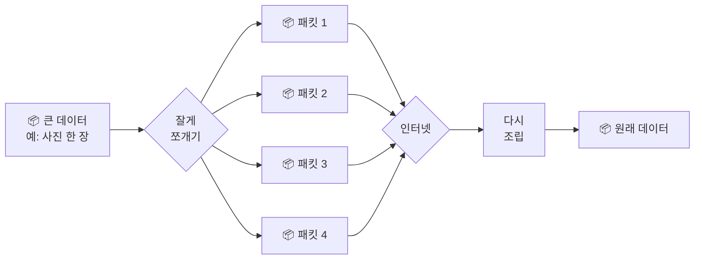
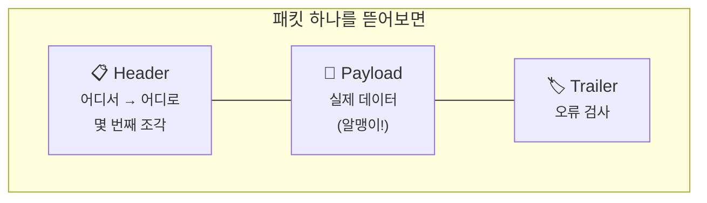
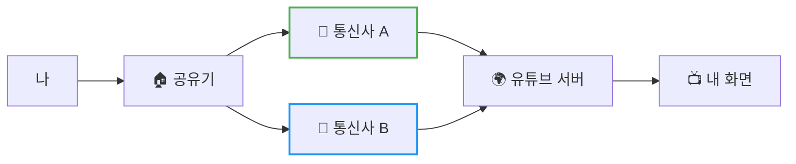
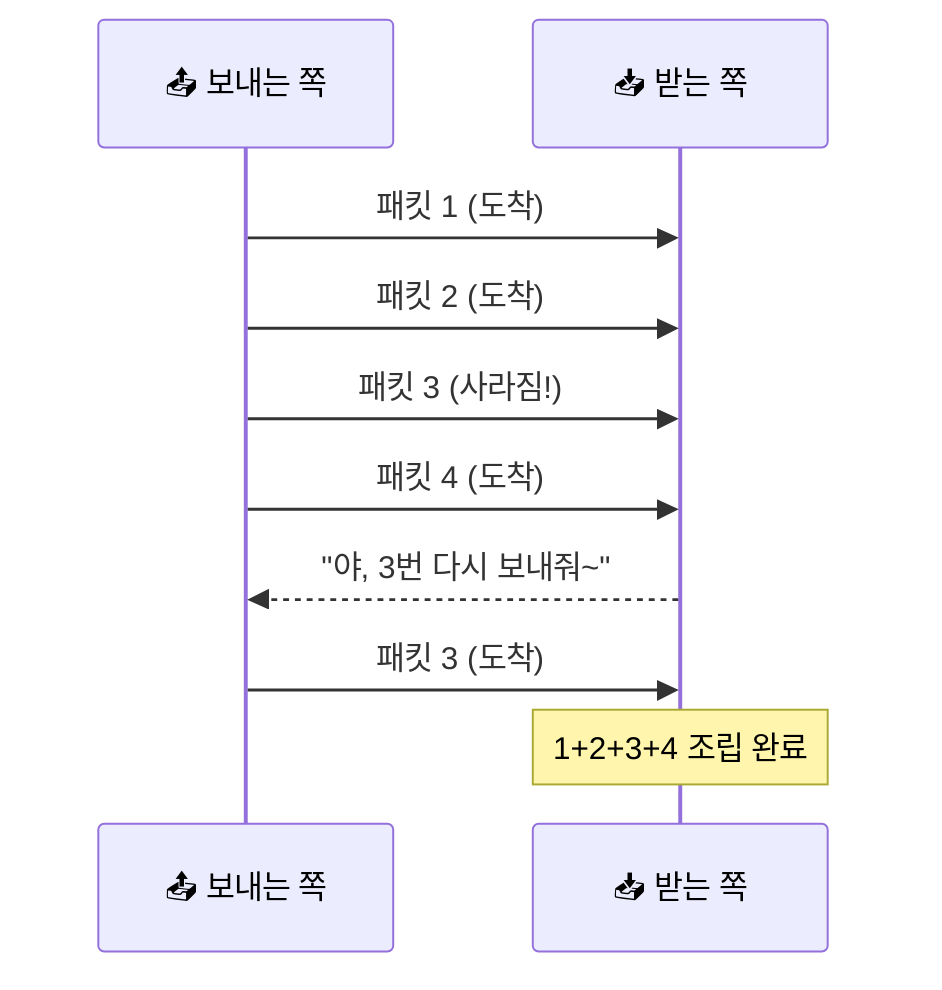

# 패킷이 뭐길래?

> 사실 여러분이 보는 모든 유튜브 영상은… **수만 개의 작은 조각**으로 도착한 거예요.

자, 잠깐 상상해볼까요?

여러분이 친구한테 카톡으로 사진 한 장을 보냈어요. 그 사진, 한 덩어리로 슝~ 날아갔을 것 같죠?

근데요, **사실은 아니에요.**

인터넷은 그 사진을 **수십, 수백 조각**으로 잘게 쪼개서 보내요. 그리고 그 한 조각 한 조각을 우리는 **"패킷(Packet)"** 이라고 불러요.

"엥? 왜 굳이 쪼개서 보내?" 라는 생각이 드신다면, 끝까지 읽어보세요. 다 읽고 나면 *"아~ 그래서 그렇구나!"* 하실 거예요.

---

## 일단 비유로 시작해볼게요

큰 짐을 옮긴다고 생각해봐요. 예를 들어 침대를 통째로 옮긴다고 치면…

!!! warning "통째로 보내면 이런 일이 생겨요"
    - 좁은 골목길은 통과조차 못 함
    - 트럭이 길 한복판에서 멈추면 **모든 짐이 같이 멈춤**
    - 사고라도 나면? **처음부터 다시** 보내야 해요

그래서 똑똑한 이삿짐센터는 이렇게 해요:

1. 짐을 **작은 박스 여러 개**로 나눠요
2. 박스마다 **"몇 번째 박스인지"** 번호를 적어요 (1/5, 2/5…)
3. 박스마다 **"어디로 갈지"** 주소를 붙여요
4. 여러 트럭이 **각자 편한 길**로 출발해요
5. 도착해서 번호 순서대로 **다시 조립**

**짠! 이게 바로 패킷이 동작하는 방식이에요.** 어렵지 않죠?



---

## 패킷은 사실 택배 상자랑 똑같이 생겼어요

택배 받아보신 적 있죠? 상자에는 보통 **송장(주소표)** 이 붙어 있고, 안에는 **물건**이 들어있잖아요. 패킷도 완전 똑같아요.

| 부분 | 택배에서는 | 패킷에서는 |
|------|-----------|-----------|
| 📋 **송장** | 보내는 사람 / 받는 사람 주소 | **헤더(Header)** — 출발지·도착지 IP, 몇 번째 조각인지 |
| 📦 **내용물** | 진짜 물건 | **페이로드(Payload)** — 실제 데이터 (사진의 일부 등) |
| 🏷️ **검수 도장** | 잘 왔나 확인 | **트레일러(Trailer)** — 오류 검사용 *(있을 수도, 없을 수도)* |



!!! tip "이것만 기억해도 충분해요"
    **헤더 = 송장**, **페이로드 = 알맹이**

---

## 근데 왜 굳이 쪼개서 보내요?

좋은 질문이에요. 이유가 세 가지나 있어요.

### 1. 길이 막혀도 돌아갈 수 있어요



1번 패킷은 통신사 A를 거쳐가고, 2번 패킷은 통신사 B를 거쳐갈 수도 있어요. 한쪽 길이 막혀도 **다른 길**로 휙 돌아가면 되니까 든든하죠.

### 2. 모두가 공평하게 인터넷을 써요

만약 옆집이 4K 영화를 통째로 다운받는 동안, 여러분은 카톡 메시지 하나도 못 보낸다면…?

> 너무하잖아요.

근데 패킷 단위로 잘게 쪼개면, **모두가 조금씩 번갈아** 사용할 수 있어요. 마치 신호등처럼요.

### 3. 일부만 잃어버려도 그것만 다시 받으면 돼요



생각해보세요. 100MB 짜리 영상을 받는데, 딱 한 조각만 도착을 못 했다고 처음부터 100MB를 다시 받아야 한다면…

근데 패킷 덕분에 **그 한 조각만** 다시 받으면 끝! 효율 갑이죠.

---

## 그럼 진짜 패킷은 어떻게 생겼을까요?

여러분이 `google.com`에 접속할 때, 컴퓨터는 대충 이런 패킷을 보내요:

```
┌─────────────────────────────────────────┐
│ 출발지 IP:  192.168.0.10                 │  ← 내 컴퓨터       ┐
│ 도착지 IP:  142.250.196.78               │  ← 구글 서버       ├─ 헤더 (송장)
│ 순서 번호:  1번 / 총 5개                  │                  ┘
├─────────────────────────────────────────┤
│ GET / HTTP/1.1                          │                  ┐
│ Host: google.com                        │                  ├─ 페이로드 (알맹이)
│ ... (구글한테 보내는 진짜 메시지)           │                  ┘
└─────────────────────────────────────────┘
```

!!! note "더 궁금한 분들을 위해"
    실제로는 포트 번호, 프로토콜 종류, 체크섬 같은 더 많은 정보가 들어 있어요. 근데 **"주소 + 알맹이"** 가 핵심이라는 것만 기억해도 충분합니다.

---

## 자, 정리해볼까요?

!!! abstract "오늘 우리가 배운 것"
    - 인터넷 데이터는 항상 **잘게 쪼개진 패킷**으로 오가요
    - 패킷에는 **주소(헤더)** 와 **알맹이(페이로드)** 가 들어 있어요
    - 쪼개서 보내면 **빠르고**, **공평하고**, **안정적**이에요
    - 받는 쪽에서 번호 순서대로 **다시 조립**해서 원래 데이터로!

어때요? 생각보다 별거 아니죠?

---

## 다음 글 예고

근데 말이죠, 한 가지 궁금한 점이 생기지 않으세요?

> *"그 작은 패킷이 어떻게 지구 반대편 서버까지 정확하게 찾아가지?"*

다음 글에서는 **"IP 주소와 라우팅"** 이야기를 해볼게요. 패킷이라는 작은 택배가 어떻게 길을 찾는지, 같이 따라가 봐요.
