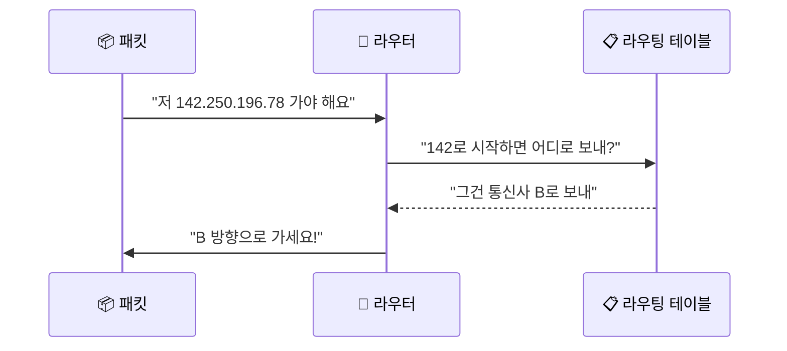
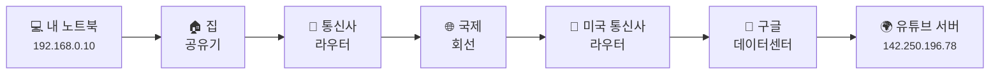
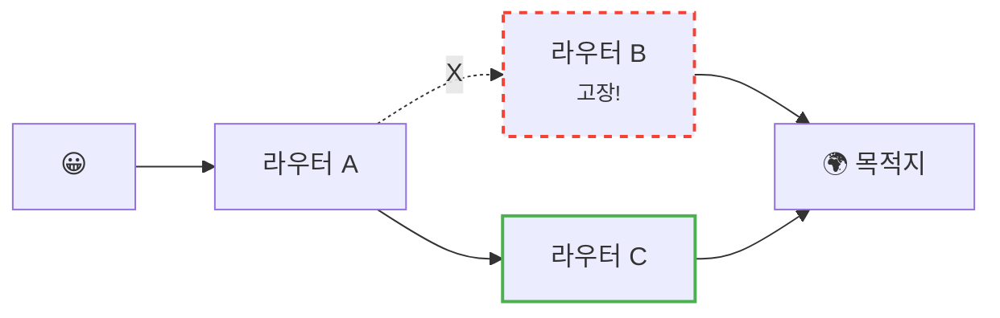

# IP 주소와 라우팅 - 패킷은 어떻게 길을 찾을까?

> 여러분의 카톡 메시지는 보통 **10~20군데를 거쳐서** 친구한테 도착해요.

지난 글에서 우리는 인터넷 데이터가 **잘게 쪼개진 패킷**으로 오간다는 걸 알게 됐어요. 그리고 마지막에 이런 질문을 남겼죠.

> *"그 작은 패킷이 어떻게 지구 반대편 서버까지 정확하게 찾아가지?"*

오늘은 그 답을 찾아볼 거예요. 키워드는 두 개예요. **IP 주소** 와 **라우팅(Routing)**.

생각해보세요. 서울에 사는 여러분이 미국 캘리포니아의 유튜브 서버에 영상을 요청하는데, 그 사이에 길 안내해주는 사람이 한 명도 없다면…?

> 미아 되겠죠.

근데 인터넷은 매일 수조 개의 패킷을 단 한 번도 헷갈리지 않고 정확한 곳으로 보내요. 어떻게 이게 가능할까요?

---

## 일단 비유로 시작해볼게요

여러분이 친구한테 편지를 부친다고 상상해봐요. 편지 봉투에 뭘 적나요?

- **받는 사람 주소**: "서울특별시 강남구 테헤란로 123, 5층"
- **보내는 사람 주소**: "부산광역시 해운대구..."

그리고 편지를 우체통에 넣으면, 다음과 같은 일이 벌어져요:

1. 동네 우체국이 편지를 모아요
2. **"서울 가는 거니까 일단 부산 본부로 보내자"**
3. 부산 본부는 **"강남이면 서울 본부 거쳐서 강남 우체국으로"**
4. 강남 우체국은 **"테헤란로면 우리 동네 집배원한테"**
5. 집배원이 5층까지 배달!

여기서 중요한 점은 **아무도 처음부터 끝까지의 전체 경로를 모른다는 거예요.** 각 우체국은 그저 **"다음 어디로 보낼지"** 만 알면 돼요.


**바로 이게 인터넷이 패킷을 보내는 방식이에요.** 우체국 = **라우터(Router)**, 주소 = **IP 주소** 인 셈이죠.

---

## IP 주소: 인터넷 세계의 집 주소

모든 인터넷에 연결된 기기에는 **고유한 주소**가 하나씩 있어요. 그게 바로 **IP 주소(IP Address)** 예요.

여러분이 지금 보는 화면도, 옆에 놓인 스마트폰도, 유튜브 서버도 전부 IP 주소를 가지고 있어요.

| 일상 주소 | IP 주소 |
|-----------|---------|
| 🏠 서울특별시 강남구 테헤란로 123 | `142.250.196.78` |
| 🌍 우리 집 위치를 알려주는 좌표 | 인터넷에서 기기를 찾는 좌표 |
| 이사 가면 바뀜 | 네트워크 옮기면 바뀔 수 있음 |

### 점 4개로 나뉜 숫자

```
142.250.196.78
 │   │   │   │
 └───┴───┴───┴── 0~255 사이 숫자 4개
```

이 형식을 **IPv4** 라고 불러요. 왜 0~255 냐면, 각 자리가 **8비트(2^8 = 256)** 짜리 숫자거든요. 외울 필요는 없어요. *"아, 그냥 점으로 나뉜 숫자 4개구나"* 정도만 알면 충분해요.

!!! tip "내 IP 주소 확인해보기"
    구글에서 `"내 ip"` 라고 검색하면 바로 나와요. 한번 확인해보세요. 신기하죠?

### 공인 IP vs 사설 IP

근데 여기서 재밌는 사실 하나. 여러분 집 컴퓨터의 IP가 `192.168.0.10` 인데, 옆집 컴퓨터도 똑같이 `192.168.0.10` 일 수 있어요.

> 어? 주소가 같으면 안 되는 거 아니에요?

맞는 말이에요. 그래서 IP는 두 종류로 나눠져 있어요.

| 종류 | 설명 | 예시 |
|------|------|------|
| 🌍 **공인 IP** | 인터넷 전체에서 유일한 주소 | `142.250.196.78` (구글) |
| 🏠 **사설 IP** | 우리 집 안에서만 쓰는 주소 | `192.168.0.10` (내 노트북) |

집 비유로 치면:

- **공인 IP** = 우리 아파트의 주소 (전국에서 유일)
- **사설 IP** = 아파트 내부 호수 (101호, 102호...)

택배가 우리 아파트까지는 공인 IP로 오고, 그다음 몇 호인지는 공유기가 정리해서 보내주는 거예요. 이걸 **NAT** 라고 부르는데, 이건 다른 글에서 자세히 다룰게요.

지금은 **"집 바깥에서는 공인 IP가 보이고, 집 안에서는 사설 IP가 쓰인다"** 정도만 감으로 잡아두면 충분해요. 나중에 NAT 편에서 공유기가 이 주소표를 실제로 어떻게 바꿔 붙이는지까지 같이 보게 될 거예요.

---

## 라우팅: 패킷의 길 안내

자, IP 주소가 "어디로 갈지" 라면, **라우팅(Routing)** 은 "어떻게 갈지" 예요.

### 라우터가 하는 일

라우터는 인터넷 곳곳에 있는 **교통 정리 아저씨**예요. 패킷이 도착하면 이렇게 일해요.



라우터는 머릿속에 **"어떤 IP는 어디로 보내야 한다"** 는 일종의 **지도(라우팅 테이블)** 를 가지고 있어요. 패킷이 오면 이 지도를 보고 다음 라우터로 넘겨주는 거죠.

### 한 번에 가지 않아요. 여러 번 갈아타요

서울에서 캘리포니아까지 한 방에 가는 비행기처럼 패킷이 한 번에 가지 않아요. **여러 라우터를 차례차례 거쳐가요.** 이걸 **홉(Hop)** 이라고 불러요.



**각 라우터는 "다음 한 칸"만 알면 돼요.** 전체 경로를 아는 사람은 아무도 없어요. 그런데도 패킷은 정확히 도착해요. 신기하지 않나요?

!!! note "직접 확인해보기"
    터미널에서 `traceroute google.com` (Mac/Linux) 또는 `tracert google.com` (Windows) 을 입력하면, 여러분의 패킷이 실제로 거쳐가는 라우터들을 볼 수 있어요. 보통 10~20개 정도 나와요.

---

## 근데 왜 이런 식으로 보내요?

### 1. 길을 외우는 게 불가능해요

전 세계 인터넷에는 **수십억 개의 기기**가 연결돼 있어요. 만약 모든 기기가 "A에서 B로 갈 때 이 경로로 가세요" 를 다 외우려면…

> 머리 터지죠.

그래서 각 라우터는 **딱 자기 주변만** 알아요. "이쪽 방향에 있는 IP는 이 라우터로 보내" 정도만요. 마치 우체국 직원이 전국 주소를 다 외우지 않고 *"강남 가는 거? 일단 서울본부로"* 하는 것처럼요.

### 2. 길이 막히면 알아서 우회해요



라우터 B가 갑자기 고장 나도 괜찮아요. 라우터 A는 **"어, B가 응답이 없네? 그럼 C로 보내자"** 하고 알아서 경로를 바꿔요. 인터넷이 잘 안 끊기는 비결이에요.

### 3. 서로 다른 회사·나라가 협력할 수 있어요

내 패킷이 KT를 거쳐 미국 AT&T를 거쳐 구글로 가는데, 이 회사들은 서로 남이에요. 근데도 잘 연결돼요. 왜냐하면 **"IP 주소"라는 공통 약속**과 **"이 IP는 우리한테 보내"라는 라우팅 약속**만 있으면 되거든요.

---

## 그럼 진짜 IP 헤더는 어떻게 생겼을까요?

지난 글에서 봤던 패킷의 **헤더(송장)** 부분, 이번엔 좀 더 자세히 들여다봐요.

<div style="max-width: 38rem; margin: 1.5rem auto; border: 2px solid var(--md-default-fg-color--lighter); border-radius: 1rem; overflow: hidden; background: color-mix(in srgb, var(--md-default-bg-color) 95%, var(--md-default-fg-color) 5%); box-shadow: 0 0.5rem 1.25rem color-mix(in srgb, var(--md-default-fg-color) 10%, transparent);">
  <div style="padding: 1rem 1.25rem; background: color-mix(in srgb, var(--md-primary-fg-color) 8%, var(--md-default-bg-color)); border-bottom: 1px solid var(--md-default-fg-color--lightest);">
    <div style="display: grid; gap: 0.7rem;">
      <div style="display: grid; grid-template-columns: minmax(6.5rem, auto) 1fr auto; gap: 0.75rem; align-items: start;">
        <strong>출발지 IP</strong>
        <code>192.168.0.10</code>
        <span style="color: var(--md-default-fg-color--light);">← 누가 보냈는지</span>
      </div>
      <div style="display: grid; grid-template-columns: minmax(6.5rem, auto) 1fr auto; gap: 0.75rem; align-items: start;">
        <strong>도착지 IP</strong>
        <code>142.250.196.78</code>
        <span style="color: var(--md-default-fg-color--light);">← 어디로 갈지</span>
      </div>
      <div style="display: grid; grid-template-columns: minmax(6.5rem, auto) 1fr auto; gap: 0.75rem; align-items: start;">
        <strong>TTL</strong>
        <code>64</code>
        <span style="color: var(--md-default-fg-color--light);">← 최대 몇 번 갈아탈 수 있는지</span>
      </div>
      <div style="display: grid; grid-template-columns: minmax(6.5rem, auto) 1fr auto; gap: 0.75rem; align-items: start;">
        <strong>프로토콜</strong>
        <code>TCP</code>
        <span style="color: var(--md-default-fg-color--light);">← 어떤 방식으로 통신할지</span>
      </div>
    </div>
  </div>
  <div style="padding: 1rem 1.25rem; background: color-mix(in srgb, var(--md-accent-fg-color) 7%, var(--md-default-bg-color));">
    <strong style="display: block; margin-bottom: 0.35rem;">(실제 데이터)</strong>
    <span style="color: var(--md-default-fg-color--light);">이 아래부터가 진짜로 보내고 싶은 내용이에요.</span>
  </div>
</div>

`TTL` 이라는 게 재밌어요. **Time To Live**, 직역하면 "살아있을 시간" 인데요. 라우터를 한 번 거칠 때마다 1씩 줄어요. 0이 되면 그 패킷은 **버려져요.**

> 왜 그런 잔인한 짓을…?

길을 잘못 들어 무한 반복 도는 패킷을 막기 위해서예요. 만약 TTL이 없다면, 잘못 설정된 라우터 두 대가 서로 패킷을 핑퐁처럼 주고받으면서 영원히 인터넷을 떠돌 수도 있거든요. TTL이 그 사고를 막아줘요.

---

## 자, 정리해볼까요?

!!! abstract "오늘 우리가 배운 것"
    - **IP 주소**는 인터넷 세계의 집 주소예요. 모든 기기가 하나씩 가지고 있어요.
    - 공인 IP는 인터넷 전체에서 유일하고, 사설 IP는 우리 집 안에서만 통해요.
    - **라우터**는 패킷의 길을 안내하는 교통 정리 아저씨예요.
    - 패킷은 한 번에 가지 않고 **여러 라우터를 거쳐(홉)** 도착해요.
    - 각 라우터는 **"다음 한 칸"** 만 알면 돼요. 전체 경로는 아무도 몰라요.

어때요? 인터넷이 어떻게 그렇게 안 끊기고 잘 돌아가는지 조금은 이해되시죠?

---

## 다음 글 예고

근데 또 궁금한 게 생기지 않나요?

> *"그럼 도착했다는 건 어떻게 알아? 중간에 패킷이 사라지면?"*

다음 글에서는 **"TCP vs UDP"** 이야기를 해볼게요. 패킷을 보내는 두 가지 성격의 친구가 있어요. 한 명은 꼼꼼하고, 한 명은 빠르고. 둘이 어떻게 다른지 같이 살펴봐요.
