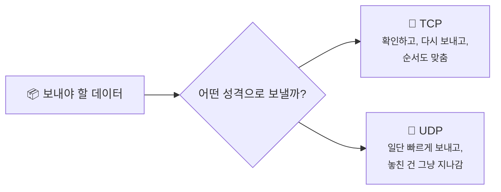
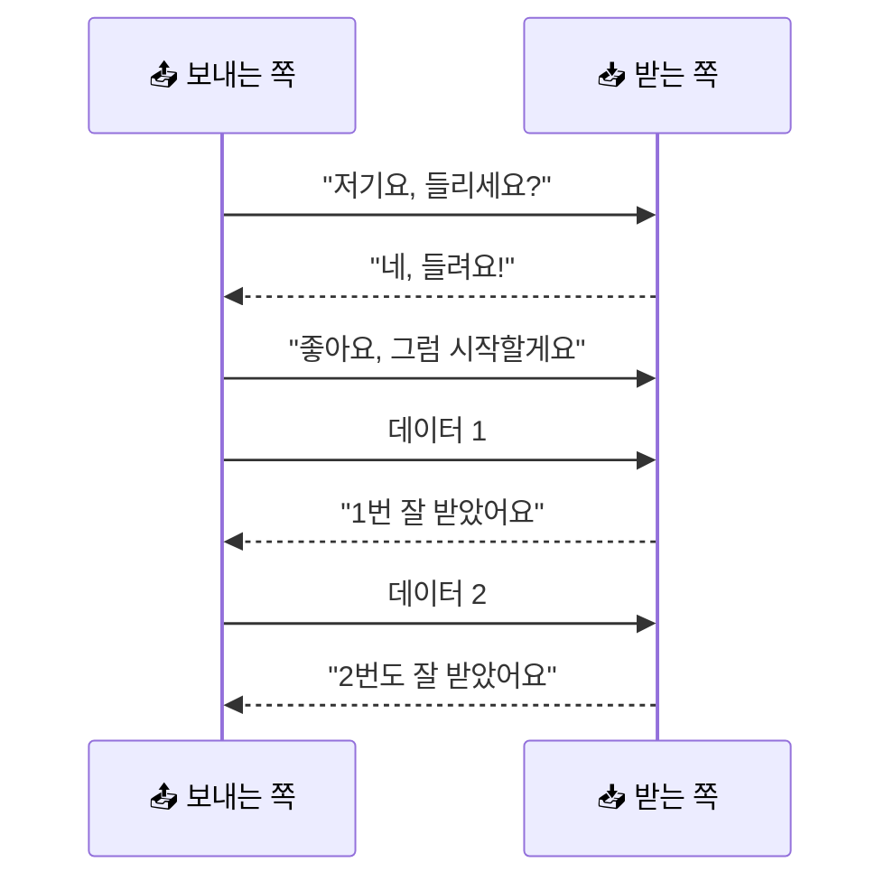
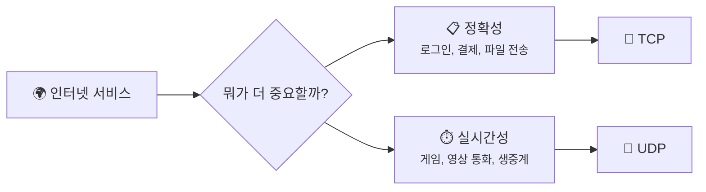

# TCP vs UDP - 꼼꼼한 친구와 빠른 친구는 뭐가 다를까요?

> 우리가 보는 실시간 축구 중계는, 사실 **가끔 몇 조각쯤 놓쳐도 그냥 계속 흘러가요.**

[지난 글](02-ip-and-routing.md){ data-preview }에서 우리는 패킷이 **IP 주소**를 따라 길을 찾아간다는 걸 봤어요. 근데 거기서 또 이런 궁금증이 생겼죠.

> *"그럼 도착했다는 건 어떻게 알아? 중간에 패킷이 사라지면?"*

좋은 질문이에요. 인터넷은 이 문제를 해결하려고 **성격이 다른 두 방식**을 써요. 하나는 엄청 꼼꼼하고, 하나는 엄청 빠르죠.

바로 **TCP** 와 **UDP** 예요.

이름만 들으면 벌써 머리 아플 것 같죠? 근데요, 사실 일상 비유로 보면 그렇게 어렵지 않아요.

---

## 일단 비유로 시작해볼게요

여러분이 친구한테 중요한 서류를 보낸다고 상상해볼까요?

보내는 방법은 두 가지예요.

1. **등기 우편으로 보내기**
2. **확인 없이 그냥 전단지처럼 뿌리기**

등기 우편은 이런 식이에요.

- 보냈다는 기록이 남아요
- 상대가 받았는지 확인해요
- 중간에 빠지면 다시 보내요
- 순서가 중요하면 순서도 맞춰요

반대로 전단지는 어때요?

- 일단 빨리 뿌려요
- 누가 몇 장을 못 받았는지는 신경 안 써요
- 대신 절차가 거의 없어서 훨씬 가벼워요

**짠! TCP는 등기 우편 쪽이고, UDP는 전단지나 방송 쪽에 가까워요.**

---

## TCP와 UDP는 뭐가 다를까요?

둘 다 데이터를 보내는 방식이긴 해요. 근데 성격이 완전히 달라요.

| 항목 | TCP는 | UDP는 |
|------|------|------|
| 비유 | 📮 등기 우편 | 📢 길거리 방송 / 전단지 |
| 도착 확인 | 받았는지 확인해요 | 확인 안 해요 |
| 재전송 | 빠지면 다시 보내요 | 다시 안 보내요 |
| 순서 보장 | 순서가 꼬이면 다시 맞춰요 | 순서가 바뀔 수 있어요 |
| 속도 | 상대적으로 느려요 | 상대적으로 빨라요 |
| 대표 사용처 | 웹, 로그인, 파일 전송 | 실시간 게임, 음성 통화, 방송 |

이 차이를 한 문장으로 줄이면 이거예요.

!!! tip "이것만 기억해도 충분해요"
    **TCP는 정확성이 중요할 때**, **UDP는 속도가 더 중요할 때** 써요.

### TCP는 먼저 인사부터 해요

TCP는 그냥 던지고 시작하지 않아요. 먼저 상대가 준비됐는지 확인해요.

다만 여기서는 **"TCP는 먼저 확인하고 시작하는 성격이구나"** 정도만 잡고 갈게요. `SYN`, `ACK`, sequence 번호처럼 **그 인사 안에서 실제로 무슨 숫자와 신호가 오가는지**는 뒤의 **TCP 3-way handshake** 글에서 본격적으로 열어볼 거예요.

이런 식으로 **보냈다 → 받았다** 를 계속 확인하면서 가요. 그래서 믿음직하죠.

### UDP는 확인보다 속도를 택해요

UDP는 달라요. "잘 받았어?" 를 일일이 묻지 않아요.

그냥 이렇게 가요.

1. 데이터 보냄
2. 또 보냄
3. 또 보냄
4. 계속 보냄

중간에 하나가 빠질 수도 있어요. 근데요, **실시간 상황에서는 그게 오히려 더 나을 때가 많아요.**

예를 들어 축구 생중계를 보는데 2초 전 장면을 완벽하게 다시 받느라 화면이 멈춘다면 어떨까요?

> 아예 끊기는 게 더 답답하잖아요.

그래서 이런 경우엔 **조금 놓치더라도 계속 앞으로 가는 방식**이 더 잘 맞아요. 그게 UDP예요.

---

## 근데 왜 굳이 두 가지나 있어요?

하나로 통일하면 편할 것 같죠? **사실은 아니에요.** 인터넷에서는 상황마다 중요한 게 다르거든요.

### 1. 어떤 데이터는 절대 틀리면 안 돼요

여러분이 인터넷 뱅킹에서 송금 버튼을 눌렀다고 해볼게요. 이때 데이터가 하나라도 빠지면 어떨까요?

금액이 틀리거나, 요청이 중복되거나, 로그인 정보가 꼬일 수도 있어요. 무섭죠.

이럴 땐 느려도 괜찮으니 **정확하게, 순서대로, 빠짐없이** 가는 게 중요해요. 그래서 TCP를 써요.

### 2. 어떤 데이터는 지금 이 순간이 더 중요해요

반대로 영상 통화나 온라인 게임은 어때요?

여기서는 패킷 하나를 완벽하게 복구하느라 멈추는 것보다, **조금 거칠어도 지금 바로 도착하는 것**이 더 중요해요.

목소리가 아주 잠깐 끊기는 건 참을 수 있어도, 3초 뒤에 밀려서 들리면 대화가 안 되잖아요.

### 3. 확인 절차도 공짜는 아니에요

TCP가 꼼꼼한 건 좋은데, 그 꼼꼼함에는 비용이 들어요.

- 연결 시작할 때 인사해야 하고
- 받았는지 계속 확인해야 하고
- 빠지면 다시 보내야 하고
- 순서가 꼬이면 다시 정렬해야 해요

이 과정이 다 **시간**이고, **일**이에요. 그래서 필요 없을 땐 UDP처럼 가볍게 보내는 편이 더 효율적이죠.

---

## 그럼 진짜 TCP와 UDP는 어떻게 생겼을까요?

실제로는 둘 다 패킷 앞부분에 자기만의 정보표를 붙여요. 근데 TCP 쪽이 훨씬 더 꼼꼼해서 정보가 많아요.

### TCP는 적을 게 많아요

  

    

      

        <strong>출발지 포트</strong>
        <code>51515</code>
      

      

        <strong>도착지 포트</strong>
        <code>443</code>
      

      

        <strong>순서 번호</strong>
        <code>1201</code>
        ← 몇 번째 데이터인지
      

      

        <strong>확인 번호</strong>
        <code>1301</code>
        ← 어디까지 받았는지
      

      

        <strong>플래그</strong>
        <code>SYN / ACK</code>
        ← 연결, 확인 같은 신호
      

    

  

  

    <strong style="display: block; margin-bottom: 0.35rem;">(실제 데이터)</strong>
  

이걸 보면 왜 TCP가 꼼꼼한지 감이 와요. **순서 번호**, **확인 번호**, **연결 신호** 같은 게 다 들어 있거든요.

### UDP는 훨씬 단순해요

  

    

      

        <strong>출발지 포트</strong>
        <code>51515</code>
      

      

        <strong>도착지 포트</strong>
        <code>5004</code>
      

      

        <strong>길이</strong>
        <code>128 bytes</code>
      

      

        <strong>체크섬</strong>
        <code>0x2A91</code>
      

    

  

  

    <strong style="display: block; margin-bottom: 0.35rem;">(실제 데이터)</strong>
  

보다시피 UDP는 **"어디서 왔고, 어디로 가고, 길이가 얼마인지"** 정도만 빠르게 적고 지나가요. 훨씬 가볍죠.

!!! note "한 가지 헷갈리기 쉬운 점"
    UDP가 "대충 보내는 방식"이라는 뜻은 아니에요. **일부러 확인 절차를 줄인 방식**에 더 가까워요. 그래서 실시간 서비스에서는 오히려 아주 똑똑한 선택일 때가 많아요.

---

## 자, 정리해볼까요?

!!! abstract "오늘 우리가 배운 것"
    - **TCP** 는 도착 확인, 재전송, 순서 보장을 해주는 **꼼꼼한 방식**이에요.
    - **UDP** 는 확인 절차를 줄이고 빠르게 보내는 **가벼운 방식**이에요.
    - 로그인, 결제, 파일 전송처럼 **정확성이 중요하면 TCP** 가 잘 맞아요.
    - 게임, 음성 통화, 생중계처럼 **실시간성이 중요하면 UDP** 가 잘 맞아요.
    - 둘 중 뭐가 더 좋다기보다, **상황에 맞는 도구가 다를 뿐**이에요.

어때요? 이제 "TCP가 더 좋고 UDP는 안 좋은 거 아니야?" 같은 느낌은 조금 사라지죠?

사실은 둘 다 인터넷에 꼭 필요한 친구예요. 한 명은 꼼꼼해서 좋고, 한 명은 가벼워서 좋아요.

---

## 다음 글 예고

근데 여기서 또 이런 생각이 들지 않으세요?

> *"우리는 `google.com`만 쳤는데, 그걸 어떻게 IP 주소로 바꿔서 찾아가죠?"*

다음 글에서는 [**"DNS"**](04-dns.md){ data-preview } 이야기를 해볼게요. 사람은 이름을 기억하고, 컴퓨터는 숫자를 좋아하잖아요. 그 둘 사이를 누가 통역해주는지 같이 살펴봐요.
