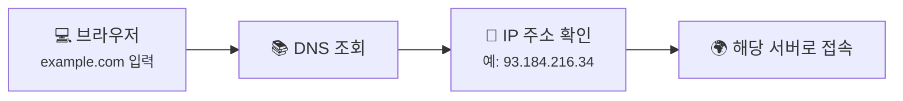
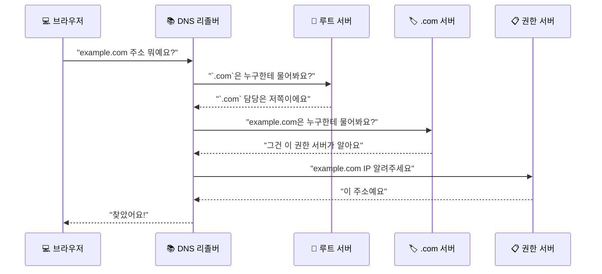
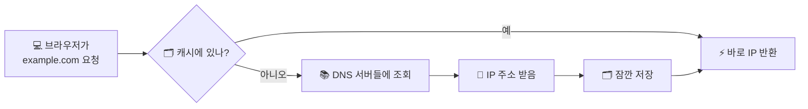

# DNS는 어떻게 이름을 IP 주소로 바꿀까요?

> 여러분 브라우저는 `example.com`을 보는 순간, 바로 IP 주소를 알고 있는 게 아니에요.

[TCP vs UDP - 꼼꼼한 친구와 빠른 친구는 뭐가 다를까요?](03-tcp-vs-udp.md){ data-preview }에서 우리는 패킷이 **TCP** 나 **UDP** 같은 방식으로 오간다는 걸 봤어요. 근데요, 거기까지 오기 전에 먼저 해결해야 하는 문제가 하나 있었죠.

> *"우리는 `google.com`만 쳤는데, 그걸 어떻게 IP 주소로 바꿔서 찾아가죠?"*

맞아요. 사람은 **이름**을 기억하고, 컴퓨터는 **숫자**를 더 좋아해요. 이 둘 사이를 통역해주는 시스템이 바로 **DNS** 예요.

이름은 익숙한데, 실제로 뭐 하는 친구인지는 좀 흐릿하게 느껴질 수 있죠? 근데요, 생각보다 되게 일상적인 방식으로 이해할 수 있어요.

---

## 일단 비유로 시작해볼게요

처음 가는 가게에 전화를 걸어야 한다고 상상해볼까요?

우리는 보통 **가게 이름**은 기억해도, 전화번호는 잘 모르잖아요. 그래서 이렇게 하죠.

1. 이름을 말해요
2. 누군가가 번호를 찾아줘요
3. 그 번호로 실제 전화를 걸어요

DNS도 거의 똑같아요.

- `example.com` 같은 **도메인 이름**을 주고
- DNS가 그에 맞는 **IP 주소**를 찾아주고
- 브라우저가 그 IP 주소로 실제 접속해요

이 그림에서 중요한 건, **브라우저가 이름을 바로 이해하는 게 아니라 중간에 한 번 물어본다** 는 거예요. DNS는 그 "물어보는 과정" 자체라고 보면 돼요.

---

## DNS는 실제로 뭐 하는 걸까요? { #dns-role }

한 문장으로 말하면 이거예요.

**DNS는 "이 이름이 어느 주소인지" 찾아주는 인터넷 주소록 시스템**이에요.

| 부분 | 일상 비유에서는 | 실제로는 |
|------|----------------|----------|
| 📛 **가게 이름** | "아하 서점" | **도메인 이름** (`example.com`) |
| ☎️ **전화번호** | 실제로 눌러야 하는 숫자 | **IP 주소** (`93.184.216.34`) |
| 📚 **안내 데스크** | 번호를 대신 찾아주는 사람 | **DNS 서버 / 리졸버** |
| 🗂️ **최근 찾은 메모** | 방금 찾은 번호를 적어둠 | **캐시(Cache)** |

!!! tip "이것만 기억해도 충분해요"
    **DNS = 이름을 숫자 주소로 바꿔주는 통역 시스템**이에요.

근데 여기서 중요한 반전 하나.

> DNS가 웹사이트를 "보내주는" 건 아니에요.

DNS는 어디까지나 **"어디로 가야 하는지 알려주는 역할"** 을 해요. 실제 데이터는 그다음에 브라우저가 해당 서버에 접속해서 받아오는 거예요.

---

## 그럼 실제로는 누구한테 물어보는 걸까요?

"이름을 주소로 바꿔준다" 는 건 알겠는데, 누구한테 물어보는지가 궁금하죠?

사실은 한 명한테만 묻는 게 아니에요. 단계별로 **아는 사람을 따라가며** 물어봐요.

복잡해 보이죠? 근데 역할을 나누면 오히려 단순해요.

- **루트 서버**: ".com", ".net", ".kr" 같은 큰 분류는 어디로 가야 하는지 알아요
- **TLD 서버**: 그 분류 안에서 "그 도메인은 누구한테 물어봐야 하는지" 알아요
- **권한 서버**: 최종적으로 **진짜 IP 주소**를 가지고 있어요

즉, 처음부터 끝까지 다 아는 한 서버가 있는 게 아니라, **"다음에 누구한테 물어봐야 하는지"를 이어주는 구조**예요.

---

## 근데 왜 굳이 이렇게 여러 단계를 거쳐요?

"그냥 엄청 큰 주소록 하나 두면 안 되나?" 싶죠? **사실은 아니에요.** 여러 단계로 나누는 데는 이유가 있어요.

### 1. 인터넷은 너무 커서 한 군데가 다 알 수 없어요

전 세계 사이트 이름을 한 서버가 전부 들고 있다면 어떨까요?

- 너무 무겁고
- 너무 바쁘고
- 고장 나면 다 같이 멈춰요

그래서 DNS는 **역할을 나눠서 분산**해놨어요. 덕분에 인터넷이 훨씬 커져도 버틸 수 있죠.

### 2. 자주 찾는 이름은 저장해두면 빨라요

여러분도 친구 번호를 한번 찾고 나면, 다음엔 다시 검색 안 하잖아요. DNS도 그래요. 한번 찾은 결과를 **캐시**에 잠깐 저장해둬요.

그래서 같은 사이트는 두 번째부터 더 빨라 보일 수 있어요. 매번 처음부터 다 물어보는 게 아니거든요.

### 3. 주소는 바뀔 수도 있으니까요

사이트가 서버를 옮기거나, 더 빠른 서버로 연결 대상을 바꾸는 경우도 있어요. 그러면 예전 주소를 영원히 들고 있으면 안 되겠죠.

그래서 DNS 캐시에는 **유통기한 같은 시간**이 붙어요. 그게 바로 **TTL** 이에요.

---

## TTL은 왜 중요할까요?

TTL은 **Time To Live**의 줄임말이에요. 여기서는 쉽게 말해서 **"이 답을 몇 초 동안 믿고 있어도 되는지"** 정도로 이해하면 충분해요.

예를 들어 TTL이 300초라면:

1. DNS가 주소를 알려줘요
2. 컴퓨터나 DNS 서버가 그 답을 5분 동안 기억해요
3. 5분이 지나면 다시 물어봐요

이게 왜 중요하냐면요.

- 너무 길면: 주소가 바뀌었는데 예전 값을 오래 믿을 수 있어요
- 너무 짧으면: 맨날 다시 물어봐서 느려질 수 있어요

> 즉, **빠름**과 **최신 정보** 사이의 줄다리기인 셈이죠.

!!! note "한 가지 헷갈리기 쉬운 점"
    브라우저가 사이트에 접속할 때마다 항상 루트 서버부터 다시 묻는 건 아니에요. 보통은 이미 저장된 캐시 덕분에 훨씬 짧게 끝나요.

---

## 그럼 진짜 DNS 응답은 어떻게 생겼을까요?

실제로는 DNS도 꽤 많은 정보를 주고받아요. 근데 초반엔 이렇게 단순하게 봐도 충분해요.

  

    

      

        <strong>질문 이름</strong>
        <code>example.com</code>
      

      

        <strong>레코드 종류</strong>
        <code>A</code>
        ← IPv4 주소를 물어봄
      

    

  

  

    

      

        <strong>응답 주소</strong>
        <code>93.184.216.34</code>
      

      

        <strong>TTL</strong>
        <code>300</code>
        ← 300초 동안 기억 가능
      

    

  

여기서 `A` 레코드는 **"이 이름의 IPv4 주소 알려줘"** 라는 뜻이에요. 나중에 IPv6 이야기를 하게 되면 `AAAA` 같은 것도 보게 되겠지만, 지금은 **이름 → 주소** 흐름만 잡으면 충분해요.

---

## 자, 정리해볼까요?

!!! abstract "오늘 우리가 배운 것"
    - **DNS** 는 사람이 기억하는 **도메인 이름**을 컴퓨터가 이해하는 **IP 주소**로 바꿔줘요.
    - DNS는 한 서버가 다 아는 게 아니라, 여러 단계가 **다음 물어볼 곳을 이어주는 구조**예요.
    - 자주 찾는 결과는 **캐시**에 저장해서 더 빠르게 답할 수 있어요.
    - **TTL** 은 그 캐시를 얼마나 믿어도 되는지 정해주는 시간이에요.
    - DNS는 데이터를 보내는 시스템이 아니라, **어디로 가야 하는지 알려주는 시스템**이에요.

어때요? 이제 `google.com` 같은 이름을 입력할 때, 뒤에서 누가 바쁘게 주소를 찾아주고 있다는 느낌이 좀 오죠?

이제 우리는 "어느 컴퓨터로 가야 하는지"는 알게 됐어요. 근데요, 거기서 또 다음 질문이 생겨요.

---

## 다음 글 예고

컴퓨터 하나에는 웹브라우저도 있고, 게임도 있고, 메신저도 있잖아요?

> *"그럼 같은 컴퓨터에 도착한 데이터는, 정확히 어떤 앱한테 가야 하는 건 어떻게 구분하죠?"*

다음 글에서는 [**"포트와 소켓"**](05-ports-and-sockets.md){ data-preview } 이야기를 해볼게요. 같은 집에 도착한 택배를 어느 방으로 보내야 하는지, 그 규칙을 같이 살펴봐요.
