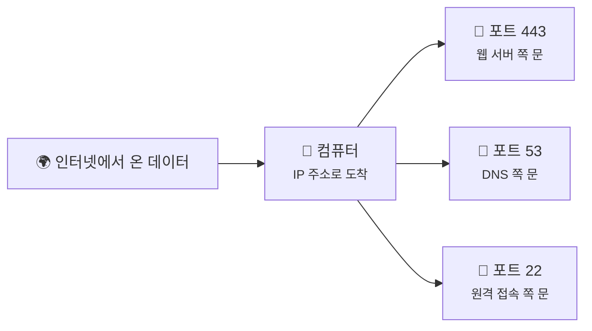
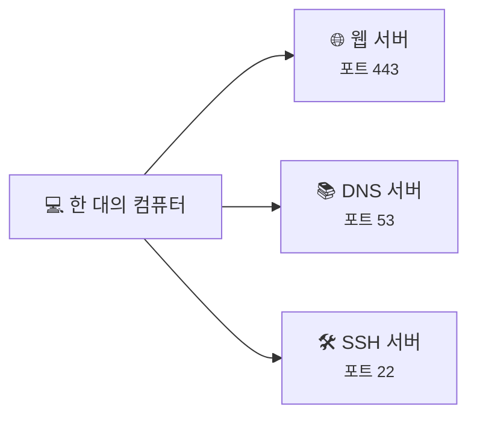
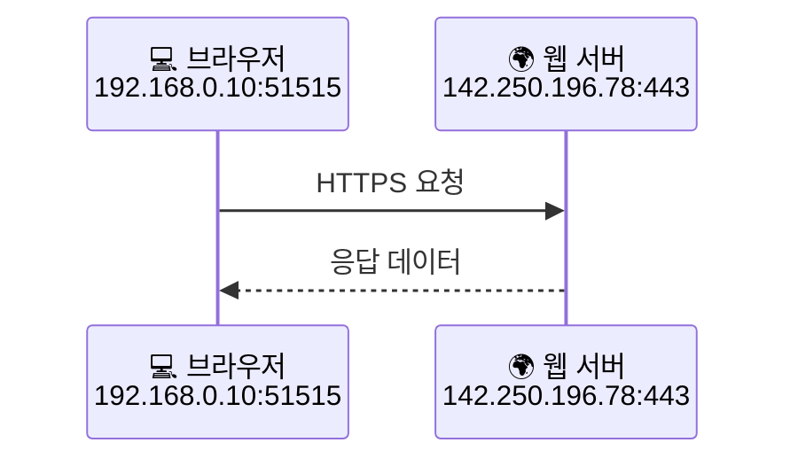

# 포트와 소켓은 뭐가 다를까요?

> 같은 집 주소로 도착한 인터넷 데이터도, **어느 방으로 들어가야 할지** 한 번 더 구분해야 해요.

[DNS는 어떻게 이름을 IP 주소로 바꿀까요?](04-dns.md){ data-preview }에서 우리는 `google.com` 같은 이름이 **DNS** 를 통해 IP 주소로 바뀐다는 걸 봤어요.
그래서 이제 **어느 컴퓨터로 가야 하는지** 는 알게 됐죠.

근데요, 여기서 끝이 아니에요.

한 컴퓨터 안에는 브라우저도 있고, 게임도 있고, 메신저도 있잖아요?
그럼 그 컴퓨터에 도착한 데이터는 **정확히 어떤 앱이 받아야 하는지** 도 알아야겠죠.

바로 그때 등장하는 게 **포트(Port)** 와 **소켓(Socket)** 이에요.

이름만 보면 벌써 비슷해서 헷갈릴 것 같죠? 근데요, 일상 비유로 보면 생각보다 금방 감이 와요.

---

## 일단 비유로 시작해볼게요

택배를 회사 건물로 보낸다고 상상해볼까요?

- **건물 주소**는 이미 알아요
- 근데 건물 안에 부서가 여러 개 있어요
- 3층 개발팀, 5층 회계팀, 7층 고객센터처럼요

이 상태에서 택배 상자에 건물 주소만 적혀 있으면 어떻게 될까요?

> 건물까진 오겠죠. 근데 그다음은 좀 난감해요.

그래서 보통은 이렇게 적어요.

1. 건물 주소
2. 몇 층인지, 몇 호인지
3. 누구 앞으로 온 건지

인터넷도 완전히 비슷해요.

- **IP 주소**는 어느 컴퓨터인지 알려주고
- **포트 번호**는 그 컴퓨터 안의 어느 앱인지 알려줘요
- **소켓**은 그 앱과 실제로 연결된 통신 자리라고 보면 돼요

즉, **IP 주소가 건물 주소라면 포트는 문 번호나 내선 번호에 가까워요.**

---

## 포트는 뭘 구분해주는 걸까요?

포트는 한 컴퓨터 안에서 **어느 프로그램이 이 데이터를 받아야 하는지** 를 구분해주는 번호예요.

| 부분 | 비유에서는 | 실제로는 |
|------|----------|----------|
| 🏢 **건물 주소** | 어느 건물로 갈지 | **IP 주소** |
| 🚪 **문 번호 / 호수** | 어느 부서, 어느 방인지 | **포트 번호** |
| 👩‍💼 **그 방의 담당자** | 실제로 택배를 받는 사람 | **앱 / 서비스** |
| ☎️ **지금 연결된 통화선** | 실제 대화가 오가는 선 | **소켓** |

예를 들어 이런 식이에요.

- 웹사이트는 보통 **80번** 또는 **443번 포트**를 많이 써요
- DNS는 보통 **53번 포트**를 많이 써요
- SSH 원격 접속은 보통 **22번 포트**를 많이 써요

여기서 중요한 건 이거예요.

> **포트는 앱 그 자체가 아니라, 앱이 기다리고 있는 번호표**에 가까워요.

그러니까 `443`이 "웹사이트" 그 자체는 아니고,
**웹 서버가 "이 문으로 들어오세요" 하고 열어둔 번호**라고 보면 돼요.

같은 컴퓨터라도 앱마다 서로 다른 포트를 쓰면, 데이터가 섞이지 않고 각자 자기 자리로 들어갈 수 있어요.

---

## 그럼 소켓은 또 뭐가 다른 걸까요?

여기서 많이 헷갈려요. **포트랑 소켓이 같은 말 아닌가?** 싶거든요.

근데요, **사실은 아니에요.**

- **포트**는 "몇 번 문인지"
- **소켓**은 "그 문에 연결된 실제 통신 끝점"

조금 더 쉽게 말하면 이래요.

- 포트 = 건물의 **문 번호**
- 소켓 = 그 문을 통해 **지금 실제로 연결된 통화선**

예를 들어 브라우저가 어떤 서버에 접속할 때는,
브라우저 쪽에도 자기 포트가 하나 생기고 서버 쪽에도 자기 포트가 있거든요.
그리고 그 둘이 연결되면 **양쪽 끝점**이 만들어져요. 그걸 소켓이라고 보면 돼요.

위 그림에서:

- `192.168.0.10:51515` 는 **클라이언트 쪽 소켓**
- `142.250.196.78:443` 는 **서버 쪽 소켓**

이라고 이해하면 돼요.

즉, 소켓은 보통 **IP 주소 + 포트 번호**로 생각하면 감이 와요.
그리고 실제 통신은 **클라이언트 소켓 ↔ 서버 소켓** 사이에서 벌어져요.

!!! tip "이것만 기억해도 충분해요"
    **포트는 앱을 구분하는 번호**, **소켓은 실제 통신이 붙는 끝점**이에요.

---

## 근데 왜 이런 구분이 필요할까요?

"어차피 IP 주소로 컴퓨터까지 왔는데, 거기서 알아서 처리하면 안 되나?" 싶죠?

근데 한 컴퓨터 안에는 생각보다 여러 앱이 동시에 움직여요. 그래서 이 구분이 꼭 필요해요.

### 1. 한 컴퓨터에 앱이 여러 개 있으니까요

노트북 한 대만 봐도 브라우저, 메신저, 게임, 업데이트 프로그램이 동시에 인터넷을 쓰잖아요.

만약 포트가 없다면,
컴퓨터는 들어온 데이터를 보고 **"이걸 누구한테 줘야 하지?"** 하고 멈춰버릴 거예요.

### 2. 같은 앱도 연결이 여러 개일 수 있어요

브라우저 탭을 여러 개 열어두면, 한 서버와만 이야기하는 게 아니죠.
여러 사이트와 동시에 통신할 수도 있어요.

이때 각각의 연결을 구분하려면 **"어느 쪽 누구와 연결된 대화인지"** 를 식별해야 해요. 소켓이 그 역할을 해줘요.

### 3. 돌아오는 답도 정확히 제자리로 보내야 하니까요

서버가 응답을 보낼 때도 그냥 "아까 그 컴퓨터" 정도로 보내면 부족해요.
그 컴퓨터 안의 **어느 앱, 어느 연결**로 되돌려줘야 하는지 알아야 하거든요.

> 즉, IP 주소는 "집까지", 포트와 소켓은 "집 안 어디까지"를 책임져요.

---

## 그럼 진짜 포트와 소켓은 어떻게 보일까요?

브라우저가 웹사이트 하나에 접속할 때, 아주 단순하게 보면 이런 모습이에요.

  

    

      

        <strong>출발지</strong>
        <code>192.168.0.10:51515</code>
        ← 내 브라우저 쪽
      

      

        <strong>도착지</strong>
        <code>142.250.196.78:443</code>
        ← 웹 서버 쪽
      

      

        <strong>프로토콜</strong>
        <code>TCP</code>
      

    

  

  

    <code>GET / HTTP/1.1</code> 
    <code>Host: example.com</code>
  

여기서 보면:

- `142.250.196.78` 는 **어느 컴퓨터인지**
- `443` 은 그 컴퓨터 안에서 **웹 서버가 기다리는 문 번호**고
- `51515` 는 내 컴퓨터가 이번 통신을 위해 잠깐 쓴 **임시 포트**예요

이 임시 포트가 왜 필요하냐면,
브라우저가 동시에 여러 서버와 통신하더라도 **응답을 어느 요청에 돌려줘야 하는지** 구분해야 하거든요.

!!! note "한 가지 헷갈리기 쉬운 점"
    서버는 보통 잘 알려진 포트 번호를 오래 열어두지만, 클라이언트는 통신할 때마다 **잠깐 쓰는 임시 포트**를 많이 써요. 그래서 브라우저 쪽 포트 번호는 접속할 때마다 달라질 수 있어요.

---

## 자, 정리해볼까요?

!!! abstract "오늘 우리가 배운 것"
    - **IP 주소**는 어느 컴퓨터로 갈지 알려줘요.
    - **포트 번호**는 그 컴퓨터 안에서 어느 앱이 받을지 구분해줘요.
    - **소켓**은 실제 통신이 붙는 끝점이라고 보면 돼요.
    - 한 컴퓨터에 여러 앱과 여러 연결이 동시에 있어도, 포트와 소켓 덕분에 서로 안 헷갈려요.
    - 즉, 인터넷 데이터는 **컴퓨터까지는 IP로**, **앱까지는 포트와 소켓으로** 찾아가요.

어때요?
이제 "IP 주소는 알겠는데, 같은 컴퓨터 안에서는 어떻게 구분하지?" 같은 궁금증은 조금 풀리죠?

우리는 이제 꽤 멀리 왔어요.
패킷이 뭔지에서 시작해서, 길도 찾고, 전달 방식도 보고, 이름도 주소로 바꾸고, 마지막으로 **어느 앱으로 들어가는지** 까지 봤으니까요.

---

## 다음 글 예고

근데 여기서 또 이런 생각이 들지 않으세요?

> *"브라우저는 443번 문을 두드린 뒤에, 대체 무슨 말을 주고받길래 웹페이지가 뜨는 걸까요?"*

다음 글에서는 [**"HTTP와 HTTPS"**](06-http-and-https.md){ data-preview } 이야기를 해볼게요.
우리가 주소를 찾고, 연결할 앱도 찾았다면, 이제 그 위에서 **어떤 규칙으로 대화를 나누는지** 볼 차례예요.
