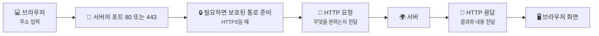
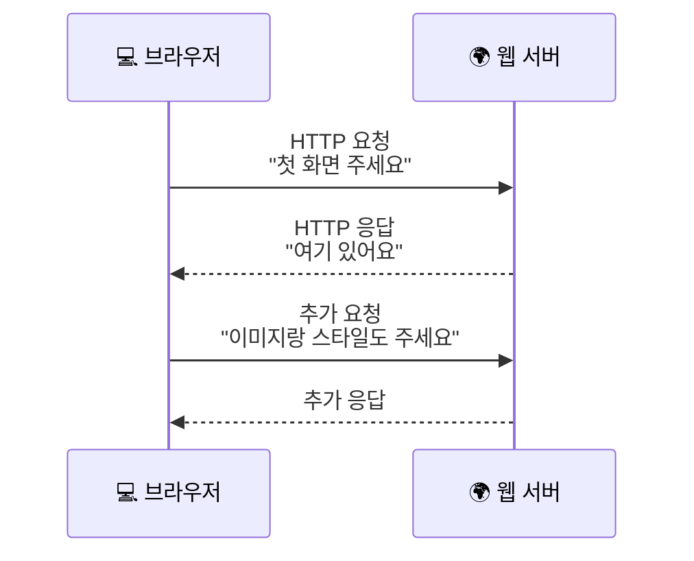
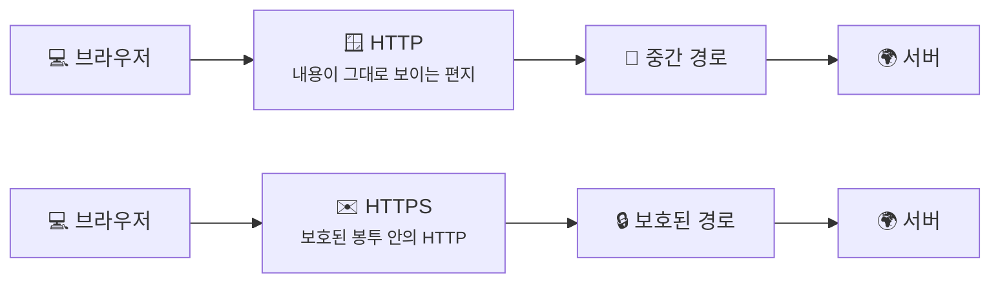

# HTTP와 HTTPS는 뭐가 다를까요?

> 웹페이지 하나를 여는 일도, 사실은 브라우저가 서버에 **정해진 형식으로 말 한마디를 건네는 것**에서 시작해요.

[포트와 소켓은 뭐가 다를까요?](05-ports-and-sockets.md){ data-preview }에서 우리는 데이터가 같은 컴퓨터 안에서도 **어느 앱으로 들어가야 하는지**를 포트와 소켓으로 구분한다는 걸 봤어요.
그래서 이제 브라우저가 **어느 서버의 어느 문으로 가야 하는지**까지는 알게 됐죠.

근데요, 여기서 또 궁금해져요.

> *"브라우저는 443번 문을 두드린 뒤에, 대체 무슨 말을 주고받길래 웹페이지가 뜨는 걸까요?"*

좋은 질문이에요. 브라우저는 그냥 **"페이지 좀 주세요"** 하고 막연하게 외치지 않아요.
서버가 알아들을 수 있게 **정해진 대화 규칙**으로 말해요. 그 규칙이 바로 **HTTP** 예요.

그리고 **HTTPS** 는 아예 다른 언어가 아니라, 그 HTTP 대화를 **조금 더 안전하게 감싸서 보내는 방식**이라고 보면 돼요.
조금 더 정확히 말하면, **먼저 보호된 통로를 만든 뒤 그 안에서 HTTP 요청과 응답이 오간다** 고 이해하면 좋아요.

여기서 한 가지만 미리 말해둘게요. 이 글에서는 **HTTP와 HTTPS가 대화 규칙과 보호 방식에서 어떻게 다르게 느껴지는지**에 집중하고, **그 보호 통로를 실제로 누가 어떻게 준비하는지**는 [TLS, SSL, 인증서는 뭐가 다를까요?](07-tls-ssl-and-certificates.md){ data-preview }에서 더 자세히 열어볼 거예요.

---

## 일단 비유로 시작해볼게요

카페에서 주문한다고 상상해볼까요?

- 손님은 **뭘 원하는지** 말해야 하고
- 직원은 **주문 내용을 알아들어야** 하고
- 결과로 **주문이 됐는지, 품절인지** 알려줘야 하잖아요

그냥 "그거 하나요" 하면 어떨까요?

> 서로 아는 사이가 아니면, 바로 헷갈리겠죠.

그래서 보통은 이런 규칙이 생겨요.

1. 뭘 원하는지 말해요
2. 추가 정보가 있으면 함께 적어요
3. 상대는 결과를 정해진 방식으로 돌려줘요

웹에서도 완전히 비슷해요.

- 브라우저는 **어떤 페이지를 원하는지** 말하고
- 서버는 **찾았는지, 못 찾았는지, 뭘 보내는지** 답해줘요
- 이 대화 형식 자체가 **HTTP** 예요

이 그림에서 핵심은 간단해요. **브라우저와 서버는 아무 말이나 주고받는 게 아니라, 서로 약속된 형식으로 대화한다** 는 거예요.

---

## HTTP와 HTTPS는 실제로 뭐가 다를까요?

먼저 제일 중요한 감각부터 잡아볼게요.

- **HTTP** 는 브라우저와 서버가 대화하는 **형식과 규칙**이고
- **HTTPS** 는 그 HTTP 대화를 **더 안전한 통로로 보내는 방식**이에요

그러니까 둘은 경쟁 관계라기보다 이런 느낌이에요.

- HTTP = 주문서에 어떻게 적을지 정한 규칙
- HTTPS = 그 주문서를 **봉인된 봉투에 넣고, 진짜 가게인지 확인한 뒤** 주고받는 방식

| 부분 | 비유에서는 | 실제로는 |
|------|----------|----------|
| 📄 **주문서 형식** | 메뉴, 수량, 요청사항 적는 규칙 | **HTTP 요청/응답 형식** |
| 🧑‍🍳 **가게 직원** | 주문서를 읽고 처리하는 사람 | **웹 서버** |
| 📋 **주문 결과표** | 주문 완료, 품절, 준비 중 | **응답 상태 코드** |
| 🪟 **열린 쪽지** | 중간에 보면 내용이 보임 | **HTTP** |
| ✉️ **봉인된 봉투** | 중간에서 내용을 보기 어려움 | **HTTPS** |

여기서 자주 오해하는 포인트가 하나 있어요.

> HTTPS가 HTTP를 없애는 게 아니에요.

사실은 **HTTP 메시지를 더 안전하게 운반하는 방식**에 가까워요. 그래서 브라우저와 서버는 여전히 **HTTP 규칙대로** 대화하고, 다만 그 대화가 가는 길을 좀 더 보호하는 거예요.

!!! tip "이것만 기억해도 충분해요"
    **HTTP는 대화 규칙**, **HTTPS는 그 대화를 안전하게 감싸는 방식**이에요.

---

## 그럼 브라우저는 실제로 어떤 말을 할까요?

브라우저는 서버에 접속했다고 해서 자동으로 화면을 받는 게 아니에요.
이제부터는 **무슨 페이지가 필요한지**, **어떤 형식으로 받고 싶은지** 를 직접 말해야 해요.

아주 단순하게 보면 이런 흐름이에요.
HTTPS라면 이 요청을 보내기 전에 **먼저 안전하게 대화할 준비를 맞추는 단계**가 한 번 있다고 생각하면 돼요.

웹페이지 하나가 뜰 때도 사실은 이런 요청과 응답이 여러 번 오갈 수 있어요. HTML 한 장만 받는 게 아니라, 이미지나 글꼴, 스타일 파일도 따로 요청할 수 있거든요.

그럼 요청 안에는 보통 뭐가 들어갈까요?

1. **무엇을 하고 싶은지** — 예: 가져오기(`GET`)
2. **어떤 길을 원하는지** — 예: `/`, `/about`
3. **추가 설명** — 예: 어떤 사이트인지, 어떤 형식을 원하는지

응답 쪽도 비슷해요.

1. **결과가 어땠는지** — 예: 성공, 못 찾음
2. **무슨 종류의 내용인지** — 예: HTML, 이미지
3. **실제 내용물** — 브라우저가 화면으로 보여줄 데이터

즉, HTTP는 그냥 "데이터 주세요" 수준이 아니라, **요청과 응답을 서로 읽을 수 있게 정리한 약속문**이라고 보면 돼요.

---

## 근데 왜 굳이 HTTP와 HTTPS 같은 규칙이 필요할까요?

"어차피 연결만 되면 알아서 보내면 안 되나?" 싶죠? **사실은 아니에요.** 규칙이 없으면 서로 이해할 수가 없거든요.

### 1. 브라우저와 서버가 같은 형식으로 말해야 하니까요

브라우저마다, 서버마다 제멋대로 말하면 어떨까요?

- 어떤 브라우저는 먼저 주소를 보내고
- 어떤 브라우저는 결과부터 달라고 하고
- 어떤 서버는 성공을 `OK`, 어떤 서버는 `DONE`, 어떤 서버는 숫자로만 보낸다면

서로 맞춰 읽기가 너무 힘들겠죠.

그래서 HTTP는 **"이렇게 요청하고, 이렇게 응답하자"** 는 공통 약속을 줘요.

### 2. 결과를 깔끔하게 구분해야 하니까요

웹에서는 항상 성공만 있는 게 아니에요.

- 페이지를 잘 찾았을 수도 있고
- 권한이 없을 수도 있고
- 아예 없는 주소일 수도 있어요

이걸 브라우저가 알아야 화면에 맞는 반응을 할 수 있겠죠. 그래서 HTTP 응답에는 **결과를 알려주는 정보**가 같이 들어가요.

### 3. 중간에서 내용을 함부로 읽거나 바꾸면 안 될 때가 많으니까요

로그인, 결제, 메시지 같은 건 특히 민감하잖아요.
이럴 때 대화 내용이 너무 훤히 보이거나, 중간에서 바뀌면 큰일이에요.

그래서 HTTPS가 필요해요. HTTPS는 브라우저와 서버가 주고받는 HTTP 대화를 **조금 더 안전하게 감싸서**, 중간에서 내용을 보기 어렵게 하고, **내가 접속한 상대가 진짜 그 서버인지 확인하고**, **중간에서 내용이 바뀌는 일도 줄이는 데** 도움을 줘요.

이 그림도 너무 복잡하게 볼 필요는 없어요. **HTTP와 HTTPS의 차이는 "무슨 말을 하느냐"보다, 그 말을 보내기 전에 보호를 준비하느냐, 그리고 그 길이 얼마나 안전하게 지켜지느냐에 더 가깝다** 고 이해하면 충분해요.

---

## 그럼 진짜 HTTP 요청과 응답은 어떻게 생겼을까요?

실제로는 훨씬 더 많은 정보가 붙을 수 있어요. 근데 초반에는 이런 식으로만 봐도 감이 확 와요.

  

    <strong style="display: block; margin-bottom: 0.6rem;">📄 요청</strong>
    <code>GET / HTTP/1.1</code> 
    <code>Host: example.com</code> 
    <code>Accept: text/html</code>
  

  

    <strong style="display: block; margin-bottom: 0.6rem;">📋 응답</strong>
    <code>HTTP/1.1 200 OK</code> 
    <code>Content-Type: text/html</code>
  

  

    <strong style="display: block; margin-bottom: 0.6rem;">📄 내용물</strong>
    <code>&lt;h1&gt;Hello&lt;/h1&gt;</code>
  

여기서 보면:

- `GET` 은 **가져오고 싶다** 는 뜻이고
- `/` 는 **어느 길의 내용을 원하는지** 를 말해주고
- `200 OK` 는 **잘 찾았고, 잘 처리했다** 는 뜻이에요

그러면 HTTPS일 땐 이 모양이 완전히 달라질까요?

> **사실은 아니에요.**

보통은 **이런 HTTP 요청/응답이 먼저 준비된 보호 통로 안에서 오간다** 고 이해하면 돼요. 즉, 브라우저와 서버가 하는 말의 성격은 비슷한데, **가면서 덜 노출되고, 상대를 더 확인하고, 중간 변경에도 더 강해지게** 만든 거예요.

즉, **HTTP가 하는 말 자체**와 **그 말이 지나가는 보호 통로를 준비하는 과정**은 살짝 다른 이야기예요. 이 구분은 다음 글에서 TLS를 볼 때, 그리고 나중에 OSI/TCP-IP 지도에서 **"어느 층의 일인가"** 를 볼 때 더 또렷해질 거예요.

!!! note "한 가지 헷갈리기 쉬운 점"
    주소창에 자물쇠가 보인다고 해서 그 사이트 내용이 무조건 모두 믿을 만하다는 뜻은 아니에요. 여기서 핵심은 **브라우저와 서버 사이 대화가 보호되고, 상대를 확인하는 과정이 들어간다** 는 쪽에 더 가까워요.

---

## 자, 정리해볼까요?

!!! abstract "오늘 우리가 배운 것"
    - **HTTP** 는 브라우저와 서버가 주고받는 **대화 규칙**이에요.
    - 브라우저는 요청을 보내고, 서버는 결과와 내용을 담아 응답해줘요.
    - **HTTPS** 는 아예 다른 언어가 아니라, 그 HTTP 대화를 **더 안전하게 감싸는 방식**이에요.
    - 그래서 HTTP와 HTTPS의 차이는 **무슨 말을 하느냐**보다, **그 말을 보내는 길이 얼마나 보호되느냐**에 더 가까워요.
    - 이제 웹페이지가 뜨는 건, 브라우저와 서버가 **약속된 형식으로 여러 번 대화한 결과**라고 볼 수 있어요.

어때요?
이제 주소창에 `https://` 가 보일 때, 그냥 익숙한 글자가 아니라 **"아, 이건 브라우저와 서버가 안전하게 대화하는 방식이구나"** 하는 감각이 조금 생기죠?

지금까지 우리는 데이터가 쪼개지고, 길을 찾고, 전달 방식을 고르고, 이름을 주소로 바꾸고, 앱을 찾고, 마지막으로 **어떤 규칙으로 대화하는지** 까지 봤어요.

---

## 다음 글 예고

근데 여기서 또 이런 생각이 들지 않으세요?

> *"HTTPS가 안전하다고 하는데, 그 보호된 통로는 대체 어떻게 만들어지는 걸까요?"*

다음 글에서는 [**"TLS, SSL, 그리고 인증서"**](07-tls-ssl-and-certificates.md){ data-preview } 이야기를 해볼게요.
브라우저가 어떻게 **"진짜 서버"** 를 확인하고, 우리가 본 그 **보호된 통로**가 실제로 어떻게 준비되는지 같이 살펴봐요.
