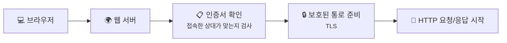
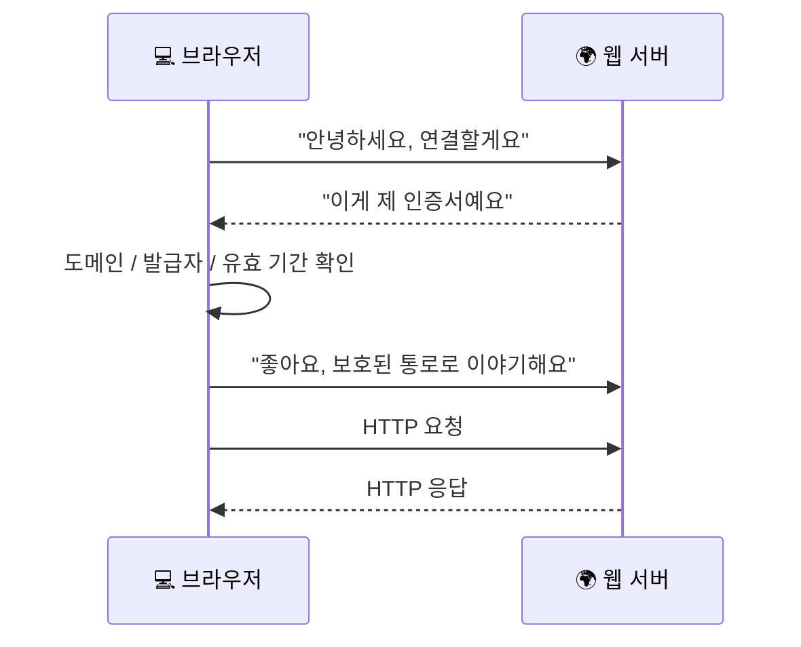
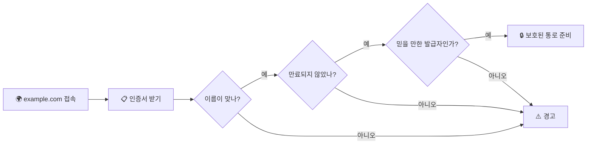

# TLS, SSL, 인증서는 뭐가 다를까요?

> 주소창의 자물쇠는 단순히 **"내용을 숨긴다"** 는 뜻만이 아니라, 브라우저가 **"지금 내가 접속한 도메인에 맞는 상대와 이야기 중인가?"** 도 확인했다는 뜻에 더 가까워요.

지난 글에서 우리는 **HTTP** 와 **HTTPS** 의 차이를 봤어요.
HTTP는 브라우저와 서버가 주고받는 **대화 규칙**이고, HTTPS는 그 대화를 **더 안전하게 감싸서 보내는 방식**이라고 했죠.

근데요, 여기서 또 궁금해져요.

> *"HTTPS가 안전하다고 하는데, 그 보호된 통로는 대체 어떻게 만들어지는 걸까요?"*

좋은 질문이에요. 브라우저는 그냥 **"자, 이제부터 안전 모드예요"** 하고 막 시작하지 않아요.
먼저 **지금 접속한 상대가 맞는지 확인하고**, 그다음에 **조금 더 안전하게 대화할 준비를 맞춘 뒤**, 그 안에서 HTTP를 시작해요.

바로 그때 등장하는 게 **TLS**, **SSL**, 그리고 **인증서**예요.

---

## 일단 비유로 시작해볼게요

은행 상담실에 들어간다고 상상해볼까요?

- 그냥 빈 방에 들어가서 돈 이야기를 하면 좀 불안하잖아요
- 먼저 **직원이 진짜 은행 직원인지** 확인해야 하고
- 그다음에 **문이 닫힌 상담실**로 들어가야 안심이 되죠

만약 이 확인 과정이 없다면 어떨까요?

> 겉모습만 비슷한 가짜 창구에 앉을 수도 있겠죠.

그래서 보통은 이런 순서가 필요해요.

1. 상대가 진짜인지 확인해요
2. 안전하게 이야기할 자리를 준비해요
3. 그다음에 본론을 말해요

HTTPS도 완전히 비슷해요.

- **인증서**는 "제가 이 도메인에 맞는 서버예요" 하고 보여주는 신분증 비슷한 거고
- **TLS** 는 그다음에 안전한 통로를 준비하는 규칙이고
- 그 안에서 **HTTP** 대화가 시작돼요

이 그림에서 핵심은 간단해요. **HTTPS는 처음부터 끝까지 한 덩어리가 아니라, 확인 → 준비 → 대화** 순서로 이해하면 훨씬 쉬워요.

---

## TLS, SSL, 인증서는 각각 뭐가 다를까요?

이름이 셋이나 나오니까 벌써 헷갈릴 수 있어요. 근데 역할을 나눠 보면 생각보다 단순해요.

- **SSL** 은 예전 이름에 가까워요
- **TLS** 는 지금 실제로 중심이 되는 현대 버전이라고 보면 돼요
- **인증서** 는 그 과정에서 서버가 자기 신원을 보여줄 때 쓰는 증표예요

그러니까 이렇게 이해하면 편해요.

- SSL/TLS = 안전하게 이야기하는 규칙
- 인증서 = "제가 진짜 누구예요" 하고 증명하는 표식

| 부분 | 비유에서는 | 실제로는 |
|------|----------|----------|
| 🪪 **직원 신분증** | 내가 찾아온 그 창구 직원이 맞는지 확인 | **인증서** |
| 🏦 **은행 본점 도장** | 믿을 만한 곳이 발급했는지 확인 | **신뢰된 발급 기관** |
| 🚪 **닫힌 상담실** | 남이 듣기 어려운 공간 | **TLS가 준비한 보호 통로** |
| 🗣️ **실제 상담 내용** | 계좌, 송금, 문의 내용 | **HTTP 요청/응답** |
| 🕰️ **유효 기간** | 지금도 쓸 수 있는 신분증인지 | **인증서 만료 여부** |

여기서 중요한 반전 하나.

> 인증서가 곧 TLS 전체는 아니에요.

인증서는 어디까지나 **"지금 접속한 상대가 누구인지 보여주는 단서"** 에 가깝고,
TLS는 그 확인을 바탕으로 **보호된 통로를 준비하는 전체 과정**에 더 가까워요.

!!! tip "이것만 기억해도 충분해요"
    **인증서는 신분 확인**, **TLS는 보호 통로 준비**, **그 안에서 HTTP가 대화**한다고 보면 돼요.

---

## 근데 왜 굳이 이런 확인 과정이 필요할까요?

"그냥 암호처럼 가려서 보내기만 하면 되는 거 아닌가?" 싶죠? **사실은 아니에요.** 누구랑 이야기하는지도 모르면, 안전하게 숨겨도 소용이 없을 수 있거든요.

### 1. 진짜 서버인지 먼저 확인해야 하니까요

여러분이 `example.com`에 접속했다고 해볼게요.
근데 중간에서 누가 **그럴듯한 가짜 서버**를 내밀면 어떨까요?

- 주소창에는 비슷하게 보이고
- 화면도 얼핏 비슷하게 보이고
- 여러분은 그대로 비밀번호를 넣을 수도 있겠죠

그래서 브라우저는 먼저 **"이 서버가 내가 접속하려던 도메인에 맞는 상대가 맞나?"** 를 확인하려고 해요.

### 2. 중간에서 내용을 엿보거나 바꾸면 안 되니까요

우리가 로그인 정보나 결제 정보 같은 걸 보낼 때는,
중간에서 누가 내용을 슬쩍 읽거나 바꾸면 안 되잖아요.

TLS는 이 대화가 가는 동안 **내용을 덜 노출되게** 하고,
중간에서 **함부로 바뀌지 않게** 돕는 역할도 해요.

### 3. 브라우저도 "이제부터 안전하게 말하자"는 합의가 필요하니까요

그냥 한쪽만 갑자기 안전 모드로 들어갈 수는 없어요.

- 브라우저도 준비돼 있어야 하고
- 서버도 준비돼 있어야 하고
- 둘이 어떤 방식으로 대화를 보호할지 먼저 맞춰야 하죠

그래서 HTTPS에서는 실제 HTTP 요청을 보내기 전에,
**대화 준비 단계**가 먼저 있다고 이해하는 게 중요해요.

---

## 그럼 브라우저는 실제로 어떤 순서로 확인할까요?

너무 깊게 들어가면 복잡해져요. 초반에는 이 정도 흐름만 잡아도 충분해요.

여기서 브라우저가 대충 보는 포인트는 이런 느낌이에요.

1. **지금 접속한 이름과 인증서의 이름이 맞는지**
2. **브라우저가 신뢰하는 발급 기관으로 이어지는지**
3. **유효 기간이 지나지 않았는지**

이런 기본 확인이 지나가야 브라우저는 **"좋아, 이 서버와 보호된 통로를 준비하자"** 쪽으로 넘어가요.

즉, 자물쇠가 뜬다는 건 단순히 "글자가 숨겨진다"보다,
**"브라우저가 확인 절차를 통과하고 나서 대화를 시작했다"** 는 의미에 더 가까워요.

이 그림도 너무 세세하게 볼 필요는 없어요. 브라우저가 하는 일은 결국 **"상대 확인"** 과 **"대화 준비"** 라고 보면 돼요.

---

## 그럼 진짜 인증서는 어떻게 생겼을까요?

실제로는 훨씬 더 많은 정보가 들어 있어요. 근데 초반에는 이런 식으로만 봐도 감이 확 와요.

  

    

      

        <strong>도메인 이름</strong>
        <code>example.com</code>
      

      

        <strong>발급 기관</strong>
        <code>Example CA</code>
        ← 누가 확인해줬는지
      

      

        <strong>유효 기간</strong>
        <code>2026-01-01 ~ 2027-01-01</code>
      

      

        <strong>공개키</strong>
        <code>AB:CD:EF:...</code>
        ← 보호 통로 준비에 쓰이는 정보
      

    

  

여기서 보면:

- **이름**은 누구용 인증서인지 보여주고
- **발급 기관**은 누가 이 신원을 확인해줬는지 보여주고
- **유효 기간**은 아직 쓸 수 있는 증표인지 알려줘요

브라우저는 이런 걸 바탕으로 **"좋아, 내가 접속하려던 상대와 이야기해도 되겠다"** 는 판단을 하는 거예요.

!!! note "한 가지 헷갈리기 쉬운 점"
    자물쇠가 보인다고 해서 그 사이트의 내용이나 운영이 무조건 다 훌륭하다는 뜻은 아니에요. 여기서 핵심은 **브라우저와 서버 사이 연결이 보호되고, 내가 접속한 상대를 확인하는 과정이 들어간다** 는 점에 더 가까워요.

---

## 자, 정리해볼까요?

!!! abstract "오늘 우리가 배운 것"
    - **SSL** 은 예전 이름에 가깝고, 지금은 보통 **TLS** 가 중심이라고 보면 돼요.
    - **인증서** 는 서버가 "제가 누구예요" 하고 보여주는 신분증 같은 역할을 해요.
    - 브라우저는 이름, 발급 기관, 유효 기간 같은 걸 보고 **진짜 서버인지 확인**하려고 해요.
    - 그 확인이 지나가야 **보호된 통로**가 준비되고, 그 안에서 HTTP 대화가 시작돼요.
    - 그래서 HTTPS의 자물쇠는 단순히 **숨김**만이 아니라, **확인 + 보호 준비**까지 포함한 결과라고 볼 수 있어요.

어때요?
이제 주소창 자물쇠를 볼 때, 그냥 막연한 보안 표시가 아니라 **"브라우저가 먼저 확인하고 나서 안전하게 말하기 시작했구나"** 하는 감각이 조금 생기죠?

우리는 이제 패킷에서 시작해서, 길을 찾고, 전달 방식을 보고, 이름을 주소로 바꾸고, 앱을 찾고, 대화 규칙을 보고, 마지막으로 **그 대화가 어떻게 보호되는지** 까지 왔어요.

---

## 다음 글 예고

근데 여기서 또 이런 생각이 들지 않으세요?

> *"그럼 우리 집 컴퓨터나 휴대폰은, 공유기 뒤에 숨어 있으면서도 어떻게 바깥 인터넷과 잘 통신하는 걸까요?"*

다음 글에서는 **"공인 IP, 사설 IP, 그리고 NAT"** 이야기를 해볼게요.
집 안 기기 여러 대가 어떻게 **공유기 하나를 통해 바깥세상과 연결되는지** 같이 따라가 봐요.
