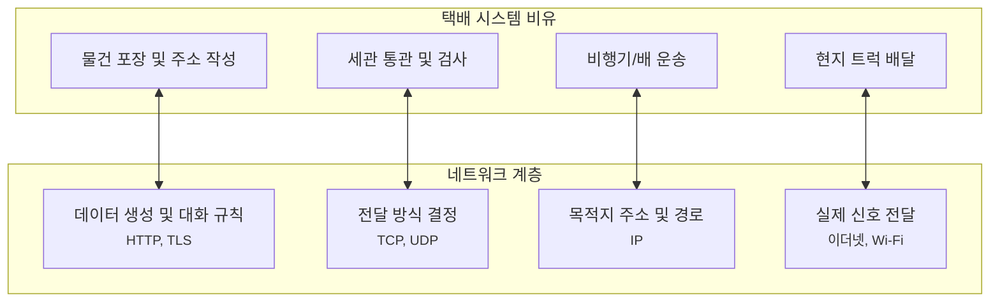
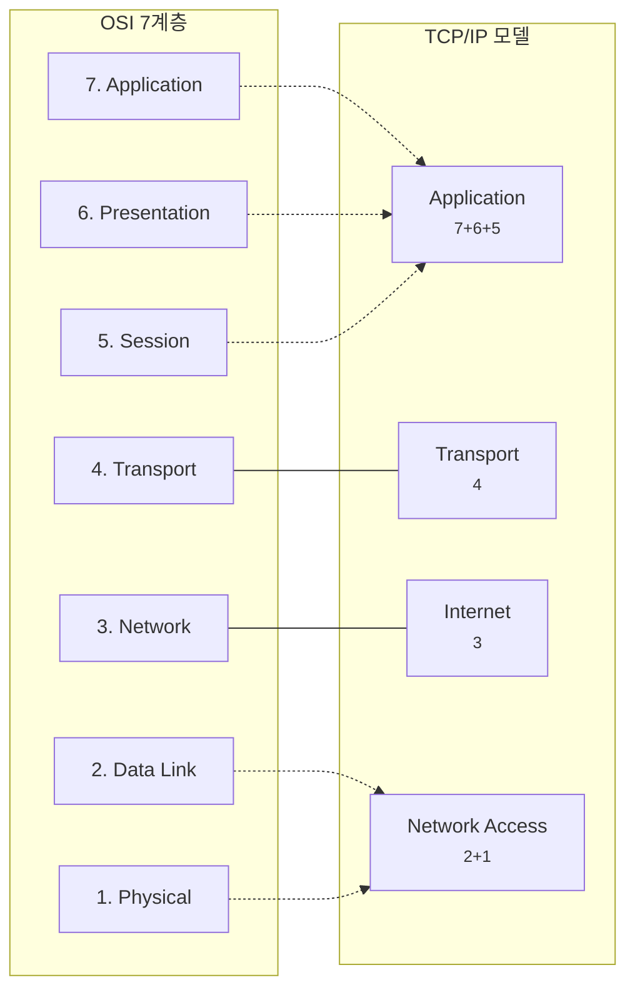
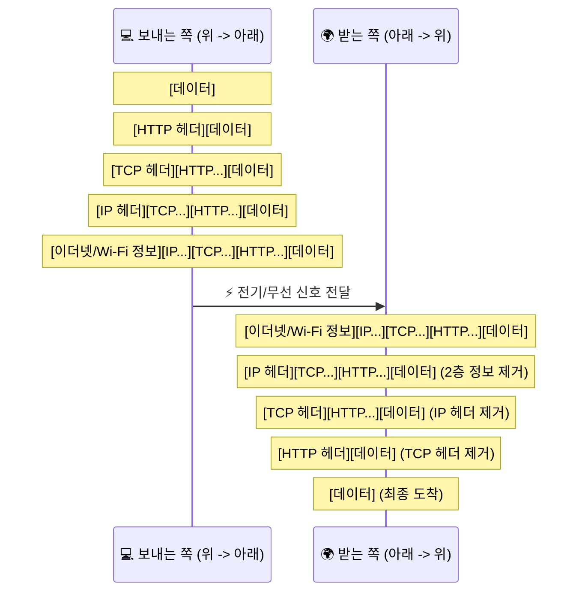

# OSI 7계층과 TCP/IP 모델, 왜 지도를 두 개나 그릴까요?

> 우리가 지금까지 배운 패킷, IP, TCP, HTTP는 모두 자기만의 **"층"** 이 있어요. 이 층들이 어떻게 쌓여있는지 알면 네트워크 전체 그림이 보이기 시작해요.

우리는 지금까지 꽤 먼 길을 왔어요.
데이터 조각인 **패킷**부터 시작해서, **IP 주소**로 길을 찾고, **TCP/UDP**로 전달 방식을 정하고, **DNS**로 이름을 찾고, **포트**로 앱을 찾고, **HTTP**로 대화하고, **TLS**로 그 대화를 보호하는 법까지 배웠죠.

지금까지는 각각의 개념을 **하나씩 따로 만나본 시간**이었다면, 이번 글은 그 조각들을 한 번에 펼쳐서 **"아, 이 친구들이 원래 이런 층에 살고 있었구나"** 하고 지도로 묶어보는 시간이라고 생각하면 돼요.

근데요, 이쯤 되면 이런 생각이 들지 않으세요?

> *"이 많은 개념이 머릿속에서 따로 노는 것 같아요. 얘네들을 한데 묶어서 볼 수 있는 지도는 없을까요?"*

맞아요. 그래서 네트워크 전문가들은 복잡한 통신 과정을 **"계층(Layer)"** 이라는 개념으로 나눠서 지도를 그렸어요.
그중 가장 유명한 게 바로 **OSI 7계층**과 **TCP/IP 모델**이에요.

---

## 일단 비유로 시작해볼게요

우리가 해외로 택배를 보낸다고 상상해볼까요?
택배가 도착하기까지는 여러 단계의 서비스가 필요해요.

- **포장 단계**: 물건을 박스에 담고 주소를 적어요 (내용물 준비)
- **통관 단계**: 세관에서 내용물을 확인하고 승인해요 (보안/절차)
- **운송 단계**: 비행기나 배에 싣고 국가 간 이동을 해요 (길 찾기)
- **배달 단계**: 현지 택배 기사님이 우리 집 문 앞까지 가져다줘요 (최종 전달)

여기서 중요한 건, **각 단계는 자기 일만 잘하면 된다**는 거예요.
비행기 기장님은 박스 안에 뭐가 들었는지 일일이 알 필요가 없죠. 그냥 정해진 경로로 안전하게 운송만 하면 돼요.

네트워크도 똑같아요.
데이터가 만들어져서 전선이나 무선 신호로 바뀌어 나갈 때까지, 각 단계가 **층층이 쌓여서** 자기 역할을 수행해요.

이 그림처럼 복잡한 일을 여러 단계로 나누면, 문제가 생겼을 때 어디가 고장 났는지 찾기도 쉽고 새로운 기술을 끼워 넣기도 편해져요.

---

## OSI 7계층과 TCP/IP 모델, 뭐가 다를까요?

네트워크 지도는 크게 두 종류가 있어요.

1. **OSI 7계층**: "이론적으로는 이렇게 7단계로 나눠서 생각해보자" 하고 만든 **표준 참조 모델**이에요. 아주 꼼꼼하죠.
2. **TCP/IP 모델**: 실제 인터넷에서 자주 쓰는 프로토콜들을 바탕으로 정리한 **실전형 인터넷 구조 지도**예요.

우리가 쓰는 진짜 인터넷은 대부분 **TCP/IP 모델**을 따르지만, 공부할 때는 **OSI 7계층**이라는 잣대를 빌려서 설명할 때가 많아요.

| 계층 (OSI 7) | 비유하자면 | 대표적인 기술 / 우리가 배운 것 |
| :--- | :--- | :--- |
| **7. 응용 (Application)** | 대화 규칙 그 자체 | **HTTP**, **DNS** |
| **6. 표현 (Presentation)** | 데이터 표현 방식 / 암호화 같은 개념 | **TLS를 이 층과 연결해 설명하기도 해요** |
| **5. 세션 (Session)** | 대화 흐름을 이어가는 개념적 자리 | 세션 관리 같은 개념 |
| **4. 전송 (Transport)** | 어떻게 보낼지 (꼼꼼하게/빠르게) | **TCP**, **UDP**, **포트** |
| **3. 네트워크 (Network)** | 어디로 갈지 (주소와 길) | **IP**, **라우팅** |
| **2. 데이터 링크 (Data Link)** | 옆집까지 어떻게 보낼지 | 이더넷, MAC 주소 |
| **1. 물리 (Physical)** | 전선, 빛, 무선 신호 | 케이블, 허브 |

여기서 재미있는 점은, TCP/IP 모델은 이 복잡한 7개를 **4개나 5개로 합쳐서** 불러요.
예를 들어 5, 6, 7층을 묶어서 그냥 **"응용(Application) 계층"** 이라고 부르는 식이죠.

근데 여기서 한 가지는 꼭 조심해서 봐야 해요.

> **OSI 7계층은 공부용 지도에 가깝고, 실제 프로토콜이 1:1로 딱 떨어지게 꽂히는 건 아니에요.**

그래서 TLS를 6층 쪽에 설명하는 자료도 있고, 응용 계층 쪽 흐름 안에서 같이 설명하는 자료도 있어요. 5층, 6층도 요즘 인터넷에서는 아주 또렷한 독립 주인공처럼 보이기보다, **개념을 정리하기 위한 칸**에 더 가깝다고 생각하면 덜 헷갈려요.

> "OSI는 이상적인 설계도고, TCP/IP는 실제로 지어진 건물"이라고 생각하면 이해가 빨라요.

---

## 근데 왜 굳이 이렇게 나눠서 생각해야 할까요?

처음엔 그냥 "인터넷 연결" 하나면 될 것 같은데, 굳이 층을 나누는 이유가 있어요.

### 1. 문제가 생겼을 때 범인을 찾기 쉬워요

인터넷이 안 될 때, "인터넷이 안 돼요!"라고만 하면 어디를 고쳐야 할지 모르죠.

- "공유기 불은 들어오나?" (1층 물리 계층 확인)
- "IP 주소는 제대로 받았나?" (3층 네트워크 계층 확인)
- "웹사이트 주소가 잘못됐나?" (7층 응용 계층 확인)
이렇게 층별로 확인하면 문제를 훨씬 빨리 해결할 수 있어요.

### 2. 기술을 독립적으로 발전시킬 수 있어요

새로운 Wi-Fi 기술(1, 2층)이 나왔다고 해서, 우리가 쓰는 크롬 브라우저(7층)를 새로 만들 필요는 없잖아요.
각 층이 독립되어 있어서, 아래층이 바뀌어도 위층은 그대로 자기 일을 할 수 있어요.

### 3. 우리가 배운 개념들의 "집"을 찾아줄 수 있어요

- **HTTP**는 제일 꼭대기인 7층에 살아요.
- **TCP**는 그 아래인 4층에서 배달 방식을 고민하죠.
- **IP**는 그 아래 3층에서 주소를 보고 길을 찾아요.
- **패킷**은 사실 이 층들을 지나면서 계속 포장지가 씌워지고 벗겨지는 과정을 겪는 주인공이에요.

그러니까 우리가 앞에서 본 글들은 사실 따로 놀던 게 아니었어요. **01은 데이터 조각의 감각**, **02는 3층의 길 찾기**, **03과 05는 4층의 전달과 연결 감각**, **04와 06은 7층의 대화와 이름 찾기**, **07은 그 대화를 보호하는 준비**를 먼저 떼어 본 셈이죠.

---

## 그럼 진짜 데이터는 어떻게 이동할까요?

여러분이 브라우저에 `hello`라고 입력해서 보낸다고 해볼게요.
데이터는 위에서 아래로 내려가면서 **"포장(캡슐화)"** 돼요.

1. **7층 (HTTP)**: "안녕"이라는 데이터에 HTTP 헤더를 붙여요.
2. **4층 (TCP)**: "몇 번 포트로 가야 해"라는 정보를 붙여요.
3. **3층 (IP)**: "어떤 IP 주소로 가야 해"라는 정보를 붙여요.
4. **2층 (이더넷 / Wi-Fi)**: "지금 바로 다음 장비(공유기 등)한테는 어떻게 보낼까?" 하는 정보를 붙여요.
5. **1층 (물리)**: 이 모든 걸 전기 신호나 무선 신호로 바꿔서 실제로 내보내요.

받는 쪽에서는 반대로 **"포장을 하나씩 뜯으면서(역캡슐화)"** 위로 올라가요.

이 과정을 보면 우리가 왜 지난 글들에서 그 많은 용어를 배웠는지 알 수 있죠.
결국 각 층의 포장지에 적힌 정보를 배우는 과정이었던 거예요!

---

## 자, 정리해볼까요?

!!! abstract "오늘 우리가 배운 것"
    - **계층(Layer)**은 복잡한 네트워크를 단계별로 나눈 지도예요.
    - **OSI 7계층**은 이론적인 표준 지도, **TCP/IP 모델**은 실제 인터넷 지도예요.
    - 각 층은 독립적으로 움직여서, 문제가 생겼을 때 해결하기 쉽고 기술 발전도 자유로워요.
    - 우리가 배운 **HTTP(7층), TCP(4층), IP(3층)** 등은 모두 자기만의 자리가 있어요.
    - 데이터는 보낼 때 층별로 **포장(캡슐화)**되고, 받을 때 **포장을 뜯으면서(역캡슐화)** 원래 모습을 찾아요.

지도가 생기니까 이제 네트워크라는 큰 대륙이 한눈에 들어오는 기분이 들지 않으세요?
우리는 이제 이 지도를 들고, 더 깊고 흥미로운 네트워크의 속살을 들여다볼 준비가 됐어요.

---

## 다음 글 예고

근데요, 이 계층들 사이에서 특히 4층(TCP)이 연결을 시작할 때 아주 신중한 약속을 한다는 사실, 알고 계셨나요?

> *"서로 대화를 시작하기 전에 '준비됐니?'라고 세 번이나 물어본다고?"*

다음 글에서는 TCP가 안전하게 연결을 맺는 마법, **"TCP 3-way handshake"** 이야기를 해볼게요.
데이터가 흐르기 전, 두 장비가 어떻게 손을 맞잡는지 같이 확인해 봐요.
