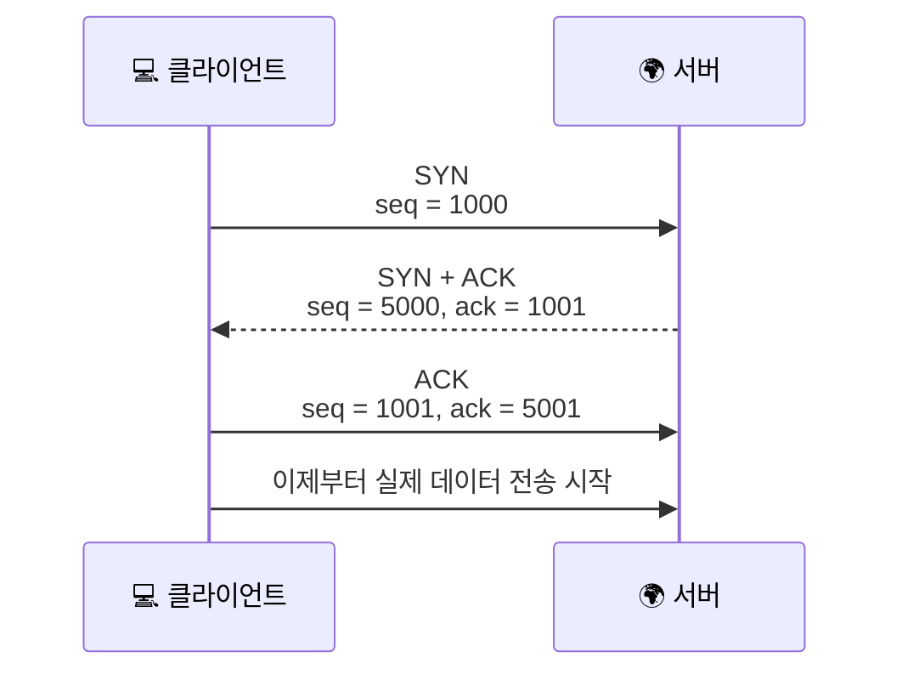
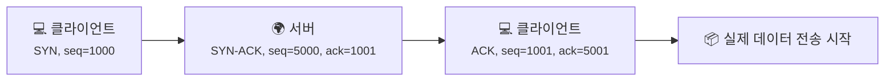
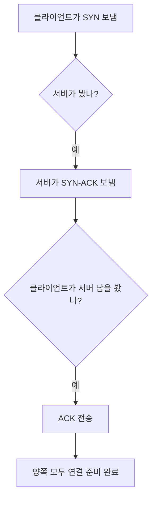

# TCP 3-way handshake는 왜 세 번이나 주고받을까요?

> 웹페이지 하나를 열기 전에도, TCP는 그냥 바로 데이터를 던지지 않아요. 먼저 **"우리 둘 다 준비됐고, 어디서부터 셀지 합의했어"** 라는 확인부터 해요.

[OSI 7계층과 TCP/IP 모델, 왜 지도를 두 개나 그릴까요?](08-osi-and-tcp-ip-layers.md){ data-preview }에서 우리는 **OSI 7계층과 TCP/IP 모델**을 보면서, TCP가 **전송 계층**에서 연결을 시작하는 중요한 역할을 맡는다고 봤어요.
그리고 더 앞선 **TCP vs UDP** 글에서는 TCP가 UDP와 다르게 **먼저 인사부터 한다**는 감각도 잡았죠.

즉, [TCP vs UDP](03-tcp-vs-udp.md){ data-preview }가 **"TCP는 시작 전에 확인부터 하는구나"** 라는 직관을 잡아주는 글이었다면, 이번 글은 그 인사 안을 열어서 **실제로 어떤 신호와 숫자가 오가는지** 보는 메커니즘 편이라고 생각하면 돼요.

근데요, 여기서 한 단계 더 들어가면 이런 궁금증이 생겨요.

> *"그 인사라는 게 정확히 뭐예요? 그냥 안부만 묻는 게 아니라 뭘 확인하는 걸까요?"*

좋은 질문이에요. TCP의 인사는 단순한 예의가 아니라,
**서로 연결할 준비가 됐는지**, **어디서부터 번호를 셀지**, **이제부터 어떤 흐름으로 데이터를 주고받을지** 맞추는 과정이에요.

바로 그게 **TCP 3-way handshake** 예요.

---

## 일단 비유로 시작해볼게요

콘서트장 물품 보관소에 짐을 맡긴다고 상상해볼까요?

- 여러분은 먼저 **"저 맡길게요"** 하고 번호표를 내밀고
- 보관소 직원은 **"좋아요, 저는 이 번호로 받을게요"** 하고 자기 쪽 번호표를 보여주고
- 마지막으로 여러분이 **"네, 그 번호 확인했어요"** 하고 답해야
- 그다음부터 진짜 짐을 주고받기 시작할 수 있잖아요

여기서 중요한 건, 둘 다 **자기 번호표 체계**를 가지고 있다는 점이에요.
그 번호를 맞춰놓지 않으면 나중에 **어디까지 맡겼고, 어디까지 돌려받았는지** 헷갈릴 수 있겠죠.

TCP도 비슷해요.

- `SYN` = "연결하고 싶어요. 저는 이 번호부터 시작할게요"
- `SYN-ACK` = "좋아요. 당신 번호도 확인했고, 저는 이 번호부터 시작할게요"
- `ACK` = "좋아요. 당신 번호도 확인했어요"

이 그림에서 핵심은 이거예요.
TCP는 그냥 **"연결할게요"** 한마디만 하는 게 아니라,
**서로의 시작 번호를 교환하고 확인한 뒤**에야 진짜 데이터를 보내기 시작해요.

---

## SYN, SYN-ACK, ACK는 각각 무슨 말일까요?

이름이 좀 딱딱해 보이죠? 근데 하나씩 뜯어보면 생각보다 분명해요.

| 단계 | 비유에서는 | 실제로는 |
|------|----------|----------|
| `SYN` | "저 맡길게요. 제 번호는 여기서 시작해요" | **연결 요청 + 내 시작 sequence 번호 전달** |
| `SYN-ACK` | "좋아요. 그 번호 확인했고, 제 번호는 여기서 시작해요" | **상대의 시작 번호 확인 + 내 시작 sequence 번호 전달** |
| `ACK` | "좋아요. 당신 번호도 확인했어요" | **상대의 시작 번호를 최종 확인** |

여기서 같이 봐야 하는 게 두 숫자예요.

1. **Sequence Number** — 내가 보내는 데이터 흐름의 번호표
2. **Acknowledgment Number** — 나는 **다음에 이 번호를 기대해요** 라는 뜻

이 표현이 중요해요.

> ACK는 단순히 **"받았어요"** 가 아니라, **"나는 이제 다음 번호를 이만큼 기대하고 있어요"** 에 더 가까워요.

예를 들어 클라이언트가 `seq = 1000` 으로 `SYN` 을 보냈다면,
서버가 `ack = 1001` 로 답하는 건 **"1000번 시작 신호는 확인했고, 다음은 1001을 기대할게요"** 라는 뜻이에요.

!!! tip "이것만 기억해도 충분해요"
    `SYN` 은 시작 번호를 제안하고, `ACK` 는 다음에 받을 번호를 알려줘요.

---

## 그 숫자는 실제로 어떻게 움직일까요?

이 부분이 오늘 글의 핵심이에요.
[TCP vs UDP - 꼼꼼한 친구와 빠른 친구는 뭐가 다를까요?](03-tcp-vs-udp.md#tcp){ data-preview } 글에서는 "먼저 인사한다"는 감각을 봤다면, 여기서는 **그 인사 안에 숫자가 어떻게 들어 있는지** 보는 거예요.

아주 단순하게 따라가보면 이래요.

1. 클라이언트가 `SYN`, `seq = 1000` 을 보내요
2. 서버가 `SYN-ACK`, `seq = 5000`, `ack = 1001` 을 보내요
3. 클라이언트가 `ACK`, `seq = 1001`, `ack = 5001` 을 보내요

여기서 자주 헷갈리는 포인트가 하나 있어요.

왜 갑자기 `1000` 다음이 `1001` 이 될까요?

그 이유는 **`SYN` 자체도 sequence 공간을 1칸 사용하기 때문**이에요.
즉, 아직 본문 데이터는 안 보냈어도,
**"연결 시작"** 이라는 신호 자체가 번호 하나를 차지한다고 보면 돼요.

그래서:

- 클라이언트 `SYN seq=1000` → 서버는 `ack=1001`
- 서버 `SYN seq=5000` → 클라이언트는 `ack=5001`

이렇게 서로의 시작점을 맞춘 뒤에야 데이터가 흐를 수 있어요.

---

## 근데 왜 굳이 세 번이나 주고받을까요?

처음 보면 "두 번이면 안 되나?" 싶죠? **사실은 부족해요.**

### 1. 양쪽이 다 준비됐는지 확인해야 하니까요

클라이언트만 준비됐다고 끝이 아니에요.
서버도 **연결 요청을 봤다**는 걸 알려줘야 하고,
클라이언트도 다시 **서버의 답을 봤다**는 걸 알려줘야 하죠.

즉, 둘 다 이렇게 말해야 해요.

- "내가 시작할 준비가 됐어"
- "네 준비도 확인했어"

### 2. 각자 자기 시작 번호를 알려줘야 하니까요

TCP는 데이터를 순서대로 관리해야 하잖아요.
그러려면 양쪽이 **어느 번호에서 출발하는지** 서로 알아야 해요.

한쪽 번호만 알면 반쪽짜리예요.
클라이언트 번호와 서버 번호를 **둘 다 확인**해야, 그다음부터 ACK를 제대로 주고받을 수 있어요.

### 3. 오래된 패킷과 새 연결을 헷갈리면 안 되니까요

만약 예전에 떠돌던 오래된 연결 요청이 뒤늦게 도착하면 어떨까요?
그걸 새 연결로 착각하면 큰일이겠죠.

세 번째 ACK까지 확인하면,
**"이건 지금 실제로 서로 보고 있는 새 연결이구나"** 를 좀 더 분명하게 확인할 수 있어요.

이걸 보면 왜 두 번으로는 살짝 불안한지 감이 오죠.
세 번째 답장이 있어야 **서버 입장에서도 클라이언트가 내 응답을 진짜 확인했는지** 알 수 있어요.

---

## 데이터는 언제부터 흐를까요?

이것도 중요해요.

TCP는 보통 이 세 단계가 끝나기 전까지는,
**"이제 연결이 열렸어요"** 라고 보지 않아요.

그래서 우리가 흔히 보는 HTTP 요청이나 응답도,
대부분은 이 핸드셰이크가 끝난 다음에야 오가기 시작해요.

즉 순서는 이런 느낌이에요.

1. 연결 준비
2. 번호 합의
3. 연결 열림
4. 그다음 실제 데이터 전송

그래서 핸드셰이크는 **데이터 본문 자체**가 아니라,
**데이터가 안전하게 흐를 바닥을 먼저 까는 작업**이라고 보면 돼요.

!!! note "한 가지 더"
    TCP 핸드셰이크는 **인증**도 아니고 **암호화**도 아니에요. 상대가 누구인지 확인하는 건 TLS나 인증서 쪽 이야기고, 핸드셰이크는 어디까지나 **전송 계층에서 연결을 시작하는 합의**에 더 가까워요.

---

## 핸드셰이크에서 같이 맞추는 것들이 더 있을까요?

있어요. 초반에는 sequence 번호와 ACK만 봐도 충분하지만,
조금 더 보면 TCP는 이때 **추가 옵션**들도 같이 맞춰요.

예를 들면:

- **MSS** — 한 번에 어느 정도 크기로 보낼지
- **Window Scale** — 얼마나 많은 데이터를 미리 흘릴지
- **SACK 관련 옵션** — 중간에 빠진 조각을 더 똑똑하게 복구할지

이걸 지금 다 외울 필요는 없어요.
중요한 건, 핸드셰이크가 단순한 "안녕"이 아니라,
**앞으로 데이터를 어떻게 보낼지 운영 규칙까지 조금 맞추는 자리**라는 점이에요.

---

## 그럼 이게 나중에 NAT나 패킷 분석에서 왜 중요할까요?

이제부터는 이런 흐름이 실제로 어디서 보이는지 하나씩 만나게 될 텐데,
바로 여기서 핸드셰이크가 중요해져요.

특히 이 감각은 여기서 끝나는 게 아니라, 뒤에서 다룰 **NAT**, **패킷 캡처**, **공유기 분석** 같은 주제들의 출발점이 돼요. 그러니까 지금은 **연결이 열릴 때 어떤 표식이 찍히는지**를 눈에 익힌다고 생각하면 좋아요.

### 1. 패킷 캡처에서 제일 먼저 눈에 띄는 게 이 세 패킷이에요

나중에 `tcpdump` 나 Wireshark 같은 걸 보게 되면,
가장 먼저 찾게 되는 게 보통 **SYN → SYN-ACK → ACK** 흐름이에요.

이걸 보면:

- 누가 먼저 연결을 시작했는지
- 어느 포트를 향해 갔는지
- 연결이 정상적으로 열렸는지

같은 걸 빠르게 파악할 수 있어요.

### 2. NAT는 이런 연결 상태를 기억해야 하거든요

공유기나 NAT 장비도 바보처럼 패킷만 툭툭 넘기는 게 아니에요.
어떤 연결이 시작됐고, 어느 출발지 포트와 목적지 포트가 묶였는지 추적해야 해요.

그래서 핸드셰이크를 이해하고 있으면,
나중에 **사설 IP가 공인 IP 바깥으로 나갈 때 어떤 흐름으로 상태가 잡히는지** 이해하기가 훨씬 쉬워져요.

### 3. 연결 문제를 디버깅할 때도 출발점이 돼요

예를 들어:

- SYN만 가고 응답이 안 온다
- SYN-ACK는 왔는데 마지막 ACK가 안 간다
- 연결이 열리기 전에 중간에서 끊긴다

이런 상황은 전부 의미가 달라요.
즉, 핸드셰이크를 알면 **"어디에서 막혔는지"** 를 더 빨리 짚을 수 있어요.

---

## 자, 정리해볼까요?

!!! abstract "오늘 우리가 배운 것"
    - **TCP 3-way handshake** 는 데이터를 보내기 전에 연결을 준비하는 과정이에요.
    - `SYN` 은 연결 요청과 시작 sequence 번호를 보내고, `SYN-ACK` 는 그 번호를 확인하면서 서버 쪽 시작 번호를 함께 보내요.
    - 마지막 `ACK` 까지 지나야 양쪽이 서로의 시작점을 확인하고 연결이 열려요.
    - `ACK` 는 단순히 "받았어요" 가 아니라, **"다음 번호를 이만큼 기대해요"** 에 가까워요.
    - 이 흐름을 알아두면 나중에 **패킷 캡처**, **NAT**, **연결 디버깅** 을 이해할 때 훨씬 유리해져요.

어때요?
이제 "TCP는 먼저 인사한다" 는 말을 들으면,
그냥 막연한 비유가 아니라 **서로 번호를 맞추고 연결을 여는 실제 절차**가 떠오르죠?

우리는 이제 TCP가 어떻게 연결을 시작하는지까지 봤어요.
그다음엔 이름이 주소로 바뀌는 더 디테일한 부분도 슬슬 궁금해질 거예요.

---

## 다음 글 예고

근데 여기서 또 이런 생각이 들지 않으세요?

> *"브라우저는 `google.com` 같은 이름을 보고, 실제로는 어떤 종류의 DNS 기록을 따라가며 주소를 찾는 걸까요?"*

다음 글에서는 [**`A`, `AAAA`, `CNAME` 같은 DNS 레코드**](10-dns-records.md){ data-preview } 이야기를 해볼게요.
우리가 늘 보던 도메인 이름 뒤에, 어떤 종류의 주소 정보가 숨어 있는지 같이 살펴봐요.
