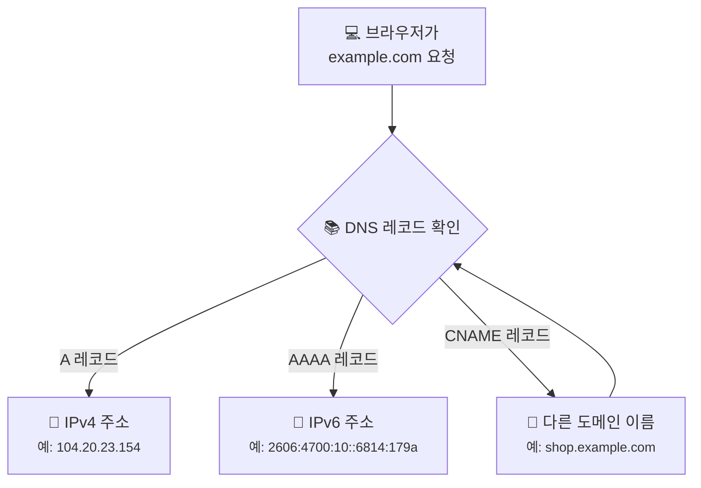
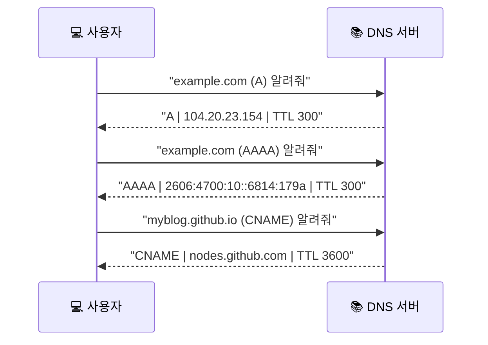

# A, AAAA, CNAME... DNS 레코드는 왜 종류가 여러 갈래일까요?

> 우리가 `example.com`을 쳤을 때 주소록에서 꺼내오는 정보는, 단순히 숫자 주소 하나가 아닐 수도 있어요.

[지난 글](09-tcp-3-way-handshake.md){ data-preview }에서 우리는 **TCP 3-way handshake**를 통해 실제 연결이 어떻게 시작되는지 깊게 살펴봤어요. 그리고 그보다 훨씬 앞선 [DNS는 어떻게 이름을 IP 주소로 바꿀까요?](04-dns.md){ data-preview } 글에서는 DNS가 "이름을 주소로 바꿔주는 안내 데스크"라는 사실도 배웠죠.

근데요, 안내 데스크에 가서 "이 가게 번호 좀 알려주세요"라고 물었을 때, 직원이 항상 "101호예요"라고만 답하는 건 아니에요.

> *"아, 그 가게는 원래 202호였는데 지금은 303호로 연결돼요."*
> *"그 가게는 집 주소(IPv4)도 있고, 새 빌딩 주소(IPv6)도 있어요."*

이런 식으로 상황에 따라 **답해주는 방식**이 달라지거든요. DNS 주소록에 적힌 이 다양한 메모 형식을 우리는 **DNS 레코드**라고 불러요.

---

## 일단 비유로 시작해볼게요

단골 빵집 **'아하 베이커리'**를 찾는다고 상상해볼까요? 주소록에는 이렇게 적혀 있을 수 있어요.

1. **직통 주소**: "아하 베이커리는 **서울시 강남구...**에 있어요." (A 레코드)
2. **별명/연결**: "아하 베이커리는 사실 **'맛있는 빵집'**을 검색하면 나와요." (CNAME 레코드)
3. **새 주소**: "아하 베이커리의 새 빌딩 주소는 **2001:db8...**이에요." (AAAA 레코드)

우리는 상황에 따라 직통 주소를 바로 찾기도 하고, 별명을 통해 진짜 이름을 찾아가기도 하죠. DNS도 똑같아요.



여기서 중요한 건, **레코드 종류에 따라 우리가 받는 결과값의 성격이 다르다**는 거예요.

---

## DNS 레코드는 실제로 뭐 하는 걸까요?

한 문장으로 말하면 이거예요.

**DNS 레코드는 "어떤 이름을 어떤 형식의 데이터로 연결할지" 정의한 설정값**이에요.

| 레코드 종류 | 비유에서는 | 실제로는 |
|------------|----------|----------|
| **A** | 구 주소 (지번) | **도메인을 IPv4 주소로** 연결 |
| **AAAA** | 신 주소 (도로명) | **도메인을 IPv6 주소로** 연결 |
| **CNAME** | 별명 (본명으로 연결) | **도메인을 다른 도메인 이름으로** 연결 |

!!! tip "이것만 기억해도 충분해요"
    - **A** = IPv**4** (숫자 4개 주소)
    - **AAAA** = IPv**6** (긴 숫자+문자 주소)
    - **CNAME** = 별명 (이 이름은 사실 저 이름이야!)

---

## 근데 왜 종류를 나눠서 써요?

"그냥 다 똑같이 주소 하나만 적어두면 편하지 않나?" 싶죠? **사실은 아니에요.** 용도에 따라 나눠 쓰는 데는 분명한 이유가 있어요.

### 1. IPv4 주소는 이제 부족하니까요 (A vs AAAA)

우리가 흔히 쓰는 `192.168.0.1` 같은 IPv4 주소는 이미 전 세계적으로 거의 다 써버렸어요. 그래서 더 길고 복잡한 IPv6 주소가 나왔죠.

- **A 레코드**는 예전부터 쓰던 IPv4를 위해 남겨두고,
- **AAAA 레코드**는 새로운 시대의 IPv6를 위해 따로 만들었어요.

브라우저와 운영체제는 상황에 따라 A와 AAAA를 함께 보거나, 받은 결과를 바탕으로 더 잘 닿는 쪽을 고르기도 해요. 중요한 건 **DNS가 IPv4와 IPv6 주소를 구분해서 알려줄 수 있다**는 점이에요.

### 2. 관리하기 편하려고 별명을 써요 (CNAME)

웹사이트 주소가 `www.example.com`도 있고, `blog.example.com`도 있다고 해볼까요? 근데 이 둘이 사실 **똑같은 서버**를 가리키고 있다면요?

만약 두 곳 다 A 레코드로 IP를 직접 적어두면, 나중에 서버 IP가 바뀔 때 **두 군데를 다 수정**해야 해요. 귀찮고 실수하기 딱 좋죠.

이럴 때 `www`는 A 레코드로 IP를 적고, `blog`는 **CNAME**으로 "얘는 `www.example.com`이랑 똑같아"라고 적어두면 어떨까요? 나중에 IP가 바뀌어도 `www` 하나만 고치면 끝이에요!

---

## 그럼 실제 DNS 응답은 어떻게 생겼을까요?

우리가 터미널에서 `dig`나 `nslookup` 같은 명령어로 조회해보면, 이런 식의 응답을 볼 수 있어요.



말로만 보면 살짝 추상적이죠? 실제로 리눅스 터미널에서 `dig`나 `nslookup`을 실행해보면 이런 식으로 보여요.

```bash
$ dig +short example.com
172.66.147.243
104.20.23.154
```

`dig +short` 는 답만 짧게 보여줘서, **"이 도메인에 지금 어떤 주소가 매달려 있지?"** 를 빠르게 확인할 때 좋아요.

```bash
$ nslookup example.com
Server:         192.168.0.1
Address:        192.168.0.1#53

Non-authoritative answer:
Name:   example.com
Address: 104.20.23.154
Name:   example.com
Address: 172.66.147.243
Name:   example.com
Address: 2606:4700:10::6814:179a
Name:   example.com
Address: 2606:4700:10::ac42:93f3
```

여기서는 `example.com`에 **IPv4 주소도 여러 개**, **IPv6 주소도 여러 개** 붙어 있다는 걸 바로 볼 수 있죠. 다만 이런 응답값은 **조회 시점, 사용하는 DNS 서버, 캐시 상태**에 따라 달라질 수 있어요.

실제 데이터를 뜯어보면 이렇게 구획이 나뉘어 있어요.

<div style="max-width: 38rem; margin: 1.5rem auto; border: 2px solid var(--md-default-fg-color--lighter); border-radius: 1rem; overflow: hidden; background: color-mix(in srgb, var(--md-default-bg-color) 95%, var(--md-default-fg-color) 5%); box-shadow: 0 0.5rem 1.25rem color-mix(in srgb, var(--md-default-fg-color) 10%, transparent);">
  <div style="padding: 1rem 1.25rem; background: color-mix(in srgb, var(--md-primary-fg-color) 8%, var(--md-default-bg-color)); border-bottom: 1px solid var(--md-default-fg-color--lightest);">
    <div style="display: grid; gap: 0.7rem;">
      <div style="display: grid; grid-template-columns: minmax(7.5rem, auto) 1fr auto; gap: 0.75rem; align-items: start;">
        <strong>이름 (Name)</strong>
        <code>example.com</code>
      </div>
      <div style="display: grid; grid-template-columns: minmax(7.5rem, auto) 1fr auto; gap: 0.75rem; align-items: start;">
        <strong>종류 (Type)</strong>
        <div style="display: grid; grid-template-columns: repeat(2, minmax(0, 1fr)); gap: 0.5rem;">
          <code style="text-align: center;">A (IPv4)</code>
          <code style="text-align: center;">AAAA (IPv6)</code>
        </div>
      </div>
    </div>
  </div>
  <div style="padding: 1rem 1.25rem; background: color-mix(in srgb, var(--md-accent-fg-color) 7%, var(--md-default-bg-color));">
    <div style="display: grid; gap: 0.7rem;">
      <div style="display: grid; grid-template-columns: minmax(7.5rem, auto) 1fr auto; gap: 0.75rem; align-items: start;">
        <strong>값 (Value)</strong>
        <div style="display: grid; grid-template-columns: repeat(2, minmax(0, 1fr)); gap: 0.5rem;">
          <code>104.20.23.154</code>
          <code>2606:4700:10::6814:179a</code>
          <code>172.66.147.243</code>
          <code>2606:4700:10::ac42:93f3</code>
        </div>
      </div>
      <div style="display: grid; grid-template-columns: minmax(7.5rem, auto) 1fr auto; gap: 0.75rem; align-items: start;">
        <strong>TTL</strong>
        <code>300</code>
      </div>
    </div>
  </div>
</div>

물론 실제로는 이메일을 어디로 보낼지 정하는 `MX`나, 도메인 인증·검증 정보 같은 걸 담는 `TXT` 레코드도 있어요. 이것들도 분명 중요한 네트워크 개념이지만, **웹사이트 접속**이라는 큰 줄기에서는 이 세 가지만 알아도 90%는 해결된 셈이에요.

대신 `MX`, `TXT` 같은 레코드는 메일과 도메인 운영 이야기가 본격적으로 붙기 시작하거든요. 그래서 이 부분은 나중에 **별도 글로 더 깊게** 다루는 편이 흐름상 더 자연스러워요.

---

## 잠깐! NAT랑 헷갈리면 안 돼요

여기서 한 가지 짚고 넘어갈 게 있어요. 나중에 배울 **NAT**라는 기술도 "주소를 바꾼다"는 말을 쓰거든요. 그래서 가끔 "DNS 레코드 설정하는 거랑 NAT 설정하는 거랑 비슷한 거 아니야?"라고 생각할 수 있어요.

근데요, **둘은 푸는 문제가 완전히 달라요.**

- **DNS**는 "이 **이름**이 어느 **주소**인지" 알려주는 **이름표 시스템**이에요.
- **NAT**는 "이 **사설 주소**를 어떻게 **공인 주소**로 바꿔서 바깥세상과 통신할지" 결정하는 **주소 변환 장치**예요.

DNS는 주로 인터넷의 **안내 데스크** 역할을 하고, NAT는 우리 집 **공유기** 안에서 일어나는 일이라고 생각하면 구분하기 쉬워요.

---

## 자, 정리해볼까요?

!!! abstract "오늘 우리가 배운 것"
    - **DNS 레코드**는 도메인 이름을 어떤 형식으로 연결할지 정해둔 주소록의 메모예요.
    - **A** 레코드는 도메인을 IPv4 주소로, **AAAA** 레코드는 IPv6 주소로 연결해요.
    - **CNAME** 레코드는 도메인에 별명을 붙여서 다른 도메인으로 연결해줘요.
    - 레코드를 나눠 쓰는 이유는 **주소 부족 문제(IPv6)**를 해결하고, **관리 편의성**을 높이기 위해서예요.
    - DNS는 이름을 주소로 바꾸는 시스템이고, NAT는 주소 자체를 변환하는 기술이라 서로 달라요.

어때요? 이제 `example.com` 뒤에 단순히 숫자 하나만 있는 게 아니라, A냐 CNAME이냐 하는 복잡한 주소록 설정이 숨어 있다는 게 느껴지시나요?

우리는 이제 "어느 주소로 가야 하는지"를 아주 또렷하게 알게 됐어요. 근데요, 그 주소가 집 안에서 쓰는 주소인지, 아니면 전 세계 누구나 접속할 수 있는 진짜 주소인지에 따라 또 이야기가 달라져요.

---

## 다음 글 예고

여러분 컴퓨터가 지금 쓰고 있는 IP 주소, 사실은 전 세계에서 유일한 주소가 아닐 수도 있다는 거 알고 계셨나요?

> *"그럼 다른 집 컴퓨터랑 내 컴퓨터의 주소가 똑같으면 어떡하죠? 패킷이 꼬이지 않을까요?"*

다음 글에서는 **"공인 IP, 사설 IP, 그리고 NAT"** 이야기를 해볼게요. 우리 집 공유기가 어떻게 수많은 기기를 하나의 공인 주소로 묶어서 인터넷에 연결해주는지, 그 마법 같은 비밀을 같이 파헤쳐봐요.
