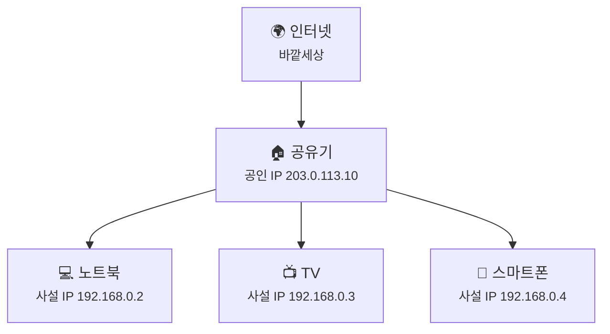
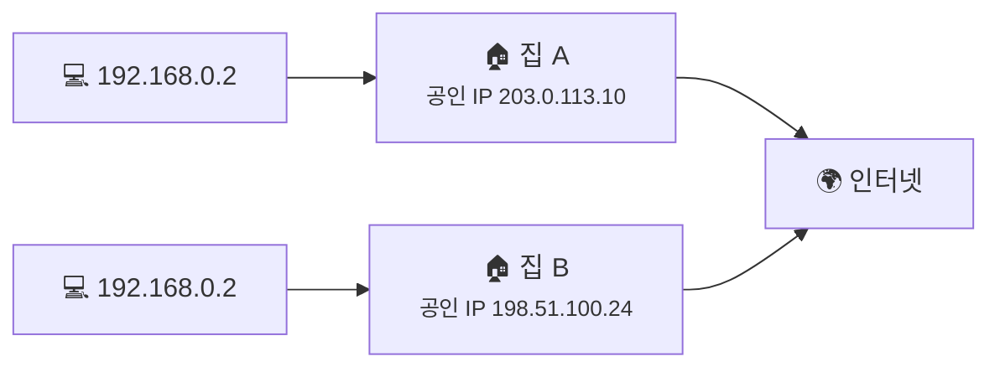
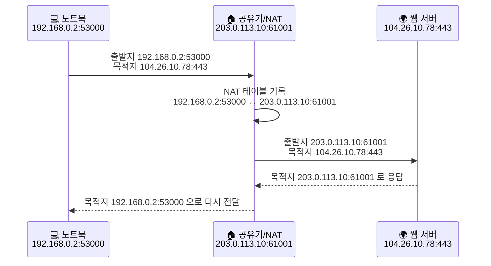

# 공인 IP, 사설 IP, 그리고 NAT는 왜 같이 나올까요?

> 우리 집 안 기기들이 전부 인터넷에 나가는데도, 바깥세상에서는 그 기기들이 **하나의 주소처럼** 보일 때가 많아요.

[지난 글](10-dns-records.md){ data-preview }에서 우리는 **DNS 레코드**를 보면서, 이름이 주소로 바뀌는 과정을 조금 더 구체적으로 살펴봤어요.
그러니까 이제는 이런 질문이 자연스럽게 따라와요.

> *"좋아요, 주소는 찾았어요. 근데 그 주소가 우리 집 안에서 쓰는 주소인지, 인터넷 바깥에서 보이는 주소인지는 또 어떻게 다른 거죠?"*

좋은 질문이에요. 여기서부터는 **주소를 찾는 이야기**가 아니라, **그 주소가 집 안과 바깥에서 어떻게 쓰이고 바뀌는지** 보는 차례예요.
즉, 앞에서는 쉬운 버전으로 봤고, 이번엔 그다음 단계인 **공인 IP, 사설 IP, 그리고 NAT** 를 함께 열어볼게요.

---

## 일단 비유로 시작해볼게요

아파트를 하나 떠올려볼까요?

- 아파트 건물 전체에는 **도로명 주소 하나**가 있어요.
- 하지만 그 안에는 **101호, 202호, 303호**처럼 각 집의 호수가 따로 있죠.
- 택배 기사님은 먼저 **건물 주소**를 보고 찾아오고,
- 그다음 경비실이나 택배실이 **어느 호수로 보내야 하는지**를 구분해줘야 해요.

네트워크도 비슷해요.

- **공인 IP** = 인터넷 바깥에서 보이는 건물 주소
- **사설 IP** = 우리 집 안에서만 통하는 호수
- **공유기/NAT** = 바깥과 안쪽 주소를 이어주는 경비실

이 그림에서 중요한 건, **인터넷은 노트북이나 TV의 사설 IP를 직접 보는 게 아니라, 먼저 공유기의 공인 IP를 본다**는 점이에요.

---

## 공인 IP와 사설 IP는 실제로 뭐가 다를까요?

이름은 비슷해 보여도, 쓰이는 범위가 완전히 달라요.

| 부분 | 비유에서는 | 실제로는 |
|------|----------|----------|
| **공인 IP** | 아파트의 도로명 주소 | **인터넷 전체에서 식별되는 주소** |
| **사설 IP** | 아파트 안의 호수 | **집/회사 내부 네트워크에서만 쓰는 주소** |
| **공유기** | 건물 입구와 경비실 | **집 안 네트워크와 인터넷을 이어주는 장비** |
| **NAT** | 택배를 호수에 맞게 다시 배달하는 기록/전달 과정 | **사설 IP와 공인 IP 사이를 변환하는 기술** |

여기서 많은 분이 헷갈리는 포인트가 하나 있어요.

> **사설 IP는 가짜 주소가 아니에요.**

그냥 **사용 범위가 집 안으로 한정된 주소**일 뿐이에요.
여러분 집 안에서는 `192.168.0.2` 같은 주소가 완전히 멀쩡하게 동작하거든요.

---

## 그럼 사설 IP는 어떤 번호를 쓸 수 있을까요?

아무 숫자나 마음대로 쓰는 건 아니에요. 인터넷에서는 **사설 네트워크용으로 따로 예약된 범위**가 있어요. 이걸 보통 **[RFC 1918](https://datatracker.ietf.org/doc/html/rfc1918) 범위**라고 불러요.

| 범위 | CIDR 표기 | 흔한 사용 예 |
|------|----------|------------|
| `10.0.0.0` ~ `10.255.255.255` | `10.0.0.0/8` | 큰 회사, 클라우드 환경 |
| `172.16.0.0` ~ `172.31.255.255` | `172.16.0.0/12` | 중간 규모 네트워크, 일부 핫스팟 |
| `192.168.0.0` ~ `192.168.255.255` | `192.168.0.0/16` | 집 공유기, 소규모 사무실 |

`/8`, `/12`, `/16` 같은 표기는 지금은 **이 주소가 어디까지 한 묶음인지 보여주는 범위 표시** 정도로만 가볍게 봐도 괜찮아요.

이 중에서 우리가 집에서 가장 자주 보는 건 아마 `192.168.x.x` 일 거예요.
공유기 관리자 화면에서 `192.168.0.1` 이나 `192.168.1.1` 을 본 적 있으시죠?

그건 보통 **공유기 자신의 집 안 주소**예요.
즉, 인터넷에서 보이는 주소가 아니라 **내부 네트워크의 출입문 주소**에 더 가까워요.

!!! tip "이것만 기억해도 충분해요"
    `192.168.x.x`, `10.x.x.x`, `172.16.x.x` ~ `172.31.x.x` 는 보통 **집 안이나 회사 안에서만 쓰는 사설 주소**라고 보면 돼요.

---

## 근데 왜 다른 집도 똑같이 `192.168.0.2`를 써도 안 헷갈릴까요?

이게 NAT 이야기를 이해하는 첫 번째 핵심이에요.

여러분 집 노트북이 `192.168.0.2` 일 수도 있고,
옆집 노트북도 `192.168.0.2` 일 수도 있어요.

처음 들으면 이상하죠?
**사실은 전혀 문제 없어요.**

왜냐하면 그 숫자는 **집 안에서만 의미가 있는 번호**이기 때문이에요.
밖에서는 두 집이 서로의 사설 IP를 직접 보는 일이 거의 없어요.

이 그림처럼 두 집 안에 같은 `192.168.0.2` 가 있어도,
인터넷에서 볼 때는 **집 A의 공인 IP** 와 **집 B의 공인 IP** 가 다르기 때문에 서로 충돌하지 않아요.

그러니까 사설 IP는 **동네 안에서만 통하는 주소**, 공인 IP는 **전 세계에서 통하는 주소**라고 생각하면 감이 와요.

---

## 근데 왜 굳이 NAT가 필요할까요?

여기서 이런 생각이 들 수 있어요.

> *"그냥 집 안 기기마다 공인 IP를 하나씩 주면 더 단순하지 않나요?"*

예전 같았으면 어느 정도 가능했을지도 몰라요. 근데 인터넷에 연결되는 기기가 너무 많아졌어요.
노트북, 스마트폰, TV, 태블릿, 게임기, CCTV, 로봇청소기까지 생각해보면,
기기마다 공인 IPv4 주소를 하나씩 주는 건 금방 한계에 부딪히죠.

### 1. IPv4 주소가 부족해졌기 때문이에요

우리가 오래 써온 IPv4 주소는 개수가 무한하지 않아요.
그래서 인터넷이 커질수록 **모든 기기에 공인 주소를 하나씩 주기 어려워졌어요.**

### 2. 집 안 주소가 바깥에 직접 드러나지 않는 효과도 있어요

NAT를 쓰면 바깥에서는 우리 집 기기 하나하나가 직접 드러나지 않고,
일단 **공유기의 공인 IP 뒤에 묶여서** 보이게 돼요.

이걸 보고 가끔 "그럼 NAT가 방화벽이네요?" 라고 생각하는데,
완전히 같은 말은 아니에요.

NAT는 어디까지나 **주소를 바꿔 이어주는 기술**이고,
방화벽은 **어떤 통신을 허용하고 막을지 판단하는 기술**에 더 가까워요.

즉, NAT가 바깥에서 안쪽을 바로 보기 어렵게 만드는 효과는 있지만,
그 자체를 보안 장비랑 완전히 같은 걸로 보면 살짝 위험해요.

---

## 그럼 NAT는 실제로 어떻게 동작할까요?

이제 비유를 잠깐 접고, 실제 흐름으로 들어가볼게요.

여러분 노트북이 웹사이트에 접속한다고 해볼까요?

1. 노트북이 `192.168.0.2:53000` 같은 출발지로 패킷을 보냅니다.
2. 공유기는 그 패킷을 밖으로 내보내기 전에, **출발지 주소를 자기 공인 IP로 바꾸고, 보통은 포트도 함께 바꿔요.**
3. 동시에 **어느 내부 기기가 어떤 포트를 썼는지** NAT 테이블에 기록해둬요.
4. 웹사이트는 공유기의 공인 IP를 보고 응답을 보냅니다.
5. 공유기는 NAT 테이블을 확인한 뒤, 원래 요청했던 노트북에게 응답을 다시 넘겨줘요.

여기서 핵심은 **포트 번호까지 같이 본다**는 점이에요.
공유기는 그냥 "이건 우리 집으로 온 패킷이네" 하고 끝내는 게 아니라,
**어느 내부 기기가 먼저 보냈는지**를 포트와 기록을 이용해 찾아내요.

---

## NAT 테이블은 뭐길래 그렇게 중요할까요?

쉽게 말하면 공유기의 **비밀 장부**예요.

예를 들어 집 안에서 여러 기기가 동시에 인터넷을 쓰고 있다면,
공유기는 대충 이렇게 기억하고 있어야 해요.

| 내부 기기 | 내부 포트 | 공유기 바깥 포트 | 목적지 |
|----------|----------|----------------|--------|
| `192.168.0.2` | `53000` | `61001` | 웹 서버 A |
| `192.168.0.3` | `54000` | `61002` | 동영상 서버 B |

이 기록이 있어야,
웹 서버 A에서 돌아온 응답은 노트북에게,
동영상 서버 B에서 돌아온 응답은 TV에게 정확히 보낼 수 있겠죠.

즉, NAT는 단순히 숫자 하나만 바꾸는 게 아니라,
**"이 연결은 누구 것이었는지"를 상태로 기억하는 작업**도 같이 해요.

---

## 그럼 실제로는 어떤 장면에서 이 감각이 중요할까요?

### 1. 카페 와이파이에서 모두 같은 IP처럼 보일 때요

카페 안에 사람이 30명 있어도,
바깥 웹사이트 입장에서는 그 카페의 공인 IP 하나만 먼저 보일 수 있어요.
그 안에서 누가 어떤 요청을 했는지는 카페 공유기가 NAT 기록으로 구분하는 거예요.

### 2. 집 안 기기가 여러 대인데 다 인터넷이 되는 이유를 이해할 때요

노트북, TV, 스마트폰이 동시에 유튜브나 웹사이트에 접속해도,
공유기가 각 연결을 따로 기억하고 있기 때문에 서로 응답이 꼬이지 않아요.

### 3. 나중에 패킷 캡처를 볼 때요

다음에 보게 될 **패킷 캡처**나 공유기 로그에서는,
같은 요청이 **집 안 주소**로 보일 때도 있고 **공인 주소**로 보일 때도 있어요.

그 차이를 이해하려면 지금 보는 이 감각이 꼭 필요해요.
어느 지점에서 캡처했느냐에 따라,
**NAT 되기 전 패킷**을 보는지 **NAT 된 뒤 패킷**을 보는지가 달라질 수 있거든요.

---

## 잠깐! DNS랑 NAT는 비슷해 보여도 다른 이야기예요

[지난 글](10-dns-records.md){ data-preview }에서 DNS를 봤다 보니,
이쯤에서 둘이 살짝 섞여 보일 수 있어요.

근데요, **같은 문제를 푸는 기술은 아니에요.**

- **DNS**는 `example.com` 같은 **이름을 IP 주소로 바꾸는 기술**이에요.
- **NAT**는 **사설 IP와 공인 IP 사이를 이어주거나 바꿔주는 기술**이에요.

즉,

- DNS = **이름표를 찾는 일**
- NAT = **집 안 주소와 바깥 주소를 이어주는 일**

이렇게 나눠 생각하면 훨씬 덜 헷갈려요.

---

## 자, 정리해볼까요?

!!! abstract "오늘 우리가 배운 것"
    - **공인 IP**는 인터넷 바깥에서 보이는 주소이고, **사설 IP**는 집 안이나 회사 안에서만 쓰는 내부 주소예요.
    - `10.x.x.x`, `172.16.x.x` ~ `172.31.x.x`, `192.168.x.x` 는 대표적인 **사설 IP 범위**예요.
    - 두 집이 똑같이 `192.168.0.2` 를 써도, 바깥에서는 서로 다른 **공인 IP** 뒤에 있으므로 충돌하지 않아요.
    - **NAT**는 여러 내부 기기가 하나의 공인 IP를 공유할 수 있게 해주고, 포트와 기록을 이용해 응답을 다시 원래 기기로 돌려줘요.
    - DNS는 **이름을 주소로 바꾸는 기술**이고, NAT는 **주소를 집 안과 바깥 사이에서 이어주는 기술**이라 서로 달라요.

어때요?
이제 집 안에서 보는 `192.168.0.x` 같은 숫자가 그냥 이상한 번호가 아니라,
**집 안에서 쓰이다가, 인터넷으로 나갈 때는 NAT를 거쳐 바깥 주소와 연결되는 내부 주소 체계**처럼 느껴지죠?

우리는 이제 이름이 주소가 되는 과정도 봤고,
그 주소가 집 안과 바깥에서 어떻게 다르게 쓰이는지도 봤어요.

---

## 다음 글 예고

근데 여기서 또 궁금해지지 않으세요?

> *"그 NAT 전후 차이랑 TCP 연결 흐름은, 실제 패킷을 보면 눈으로도 확인할 수 있을까요?"*

다음 글에서는 **패킷 캡처** 이야기를 해볼게요.
Wireshark나 `tcpdump` 같은 도구에서, 우리가 지금까지 배운 패킷·TCP·NAT의 흔적이 어떻게 보이는지 같이 따라가봐요.
