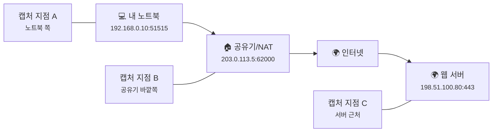
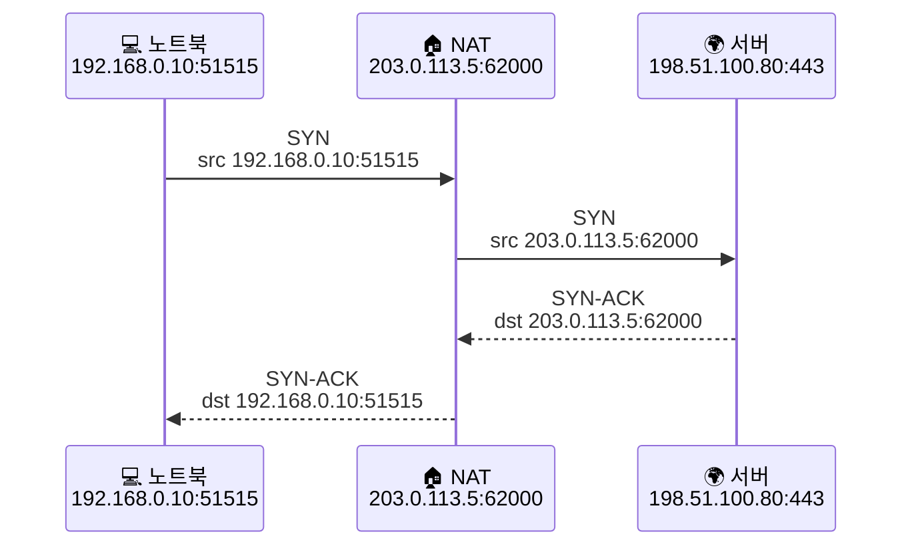
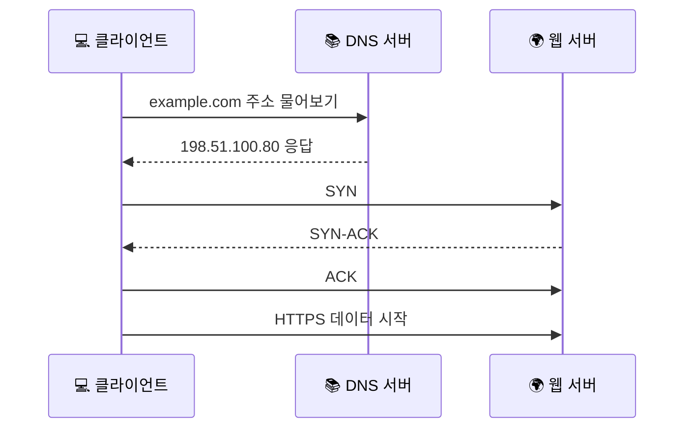

# 패킷 캡처는 뭘 보는 걸까요?

> 똑같은 웹사이트 접속 한 번도, **어디에서 지켜봤느냐** 에 따라 전혀 다른 패킷처럼 보일 수 있어요.

[공인 IP, 사설 IP, 그리고 NAT는 왜 같이 나올까요?](11-public-private-ip-and-nat.md){ data-preview }에서 우리는 **공인 IP, 사설 IP, 그리고 NAT** 를 보면서, 집 안 주소와 바깥 주소가 왜 다르게 보이는지 살펴봤어요.
그리고 글 마지막에 이런 질문도 남았죠.

> *"그 NAT 전후 차이랑 TCP 연결 흐름은, 실제 패킷을 보면 눈으로도 확인할 수 있을까요?"*

바로 그 질문에 답하는 글이 이번 글이에요.
이번에는 개념을 한 번 더 비틀어서, **실제로 네트워크 대화를 지켜보는 방법** 쪽으로 들어가볼게요.

그러니까 지금은 큰 그림만 보고, 정확한 동작은 캡처 화면에서 어떻게 보이는지 중심으로 볼게요.

---

## 일단 비유로 시작해볼게요

택배가 집에서 나가서 물류센터를 거쳐 다른 집에 도착하는 장면을 **CCTV 여러 대**로 찍는다고 상상해볼까요?

- 현관 앞 카메라는 **우리 집 안에서 붙어 있던 주소표**를 보고,
- 아파트 출입구 카메라는 **경비실이 바깥용 주소로 바꾼 뒤**의 모습을 보고,
- 도착지 건물 카메라는 **밖에서 들어온 최종 택배 상자**를 보겠죠.

상자는 같은 상자인데,
카메라 위치가 다르면 **보이는 주소표와 흐름이 달라질 수 있어요.**

패킷 캡처도 똑같아요.

| 부분 | 비유에서는 | 실제로는 |
|------|----------|----------|
| **패킷 캡처** | CCTV 영상 | **특정 지점에서 지나가는 패킷 기록** |
| **캡처 위치** | 어느 카메라로 봤는지 | **어느 장비/인터페이스에서 잡았는지** |
| **주소표** | 보내는 집/받는 집 정보 | **출발지·목적지 IP와 포트** |
| **경비실 주소 교체** | 바깥용 스티커로 바꾸기 | **NAT로 공인 IP/포트로 변환** |

즉, 패킷 캡처는 **네트워크 전체의 절대 진실**을 보여주는 게 아니라,
**그 자리에서 지나간 장면**을 보여주는 거예요.

---

## 패킷 캡처는 실제로 뭘 보여줄까요?

한 문장으로 말하면 이거예요.

**패킷 캡처는 어떤 인터페이스를 지나가는 패킷을 시간순으로 기록한 관찰 로그예요.**

그래서 캡처를 보면 보통 이런 걸 읽을 수 있어요.

1. **누가 누구에게 보냈는지** — 출발지 IP, 목적지 IP
2. **어느 앱 쪽 대화인지** — 포트 번호
3. **무슨 종류의 대화인지** — TCP, UDP, DNS, HTTP 같은 프로토콜 단서
4. **어떤 순서로 오갔는지** — 먼저 보냈는지, 답이 왔는지, 중간에 끊겼는지

근데요, 여기서 한 가지 오해를 많이 해요.

> *"패킷 캡처를 하면 내용까지 전부 다 읽히는 거 아닌가요?"*

**사실은 아니에요.**

- **HTTP** 처럼 평문이면 본문이나 헤더 일부가 보일 수 있고,
- **HTTPS** 처럼 암호화돼 있으면 내용은 바로 읽기 어렵지만,
- 그래도 **누가 누구랑**, **어느 포트로**, **언제 연결을 열었는지** 는 충분히 볼 수 있어요.

즉, 암호화가 되어 있어도 패킷 캡처가 무용지물은 아니에요.
오히려 **연결이 열렸는지, DNS가 먼저 나갔는지, 어디서 끊겼는지** 를 보는 데는 여전히 아주 유용하죠.

---

## 어디에서 캡처하느냐가 왜 그렇게 중요할까요?

이제 오늘 글의 핵심으로 들어가볼게요.

같은 웹사이트 접속이라도,
**내 노트북에서 잡느냐**, **공유기 바깥쪽에서 잡느냐**, **서버 근처에서 잡느냐** 에 따라 보이는 정보가 달라져요.



이 그림에서 중요한 건,
각 지점이 **같은 연결의 서로 다른 모습**을 본다는 점이에요.

- **노트북 쪽 캡처**: `192.168.0.10:51515 -> 198.51.100.80:443`
- **공유기 바깥쪽 캡처**: `203.0.113.5:62000 -> 198.51.100.80:443`
- **서버 근처 캡처**: 역시 바깥에서 들어온 **공인 IP 기준 흐름**이 보일 가능성이 커요

즉, 캡처는 항상 **"이 자리에서 본 장면"** 이라고 생각해야 덜 헷갈려요.

!!! tip "이것만 기억해도 충분해요"
    패킷 캡처에서 가장 먼저 물어야 할 질문은 **"이 패킷을 어디에서 잡았지?"** 예요. 그걸 모르면 같은 연결도 다르게 보이는 이유를 설명하기 어려워져요.

---

## 그럼 NAT 전후에는 실제로 뭐가 다르게 보일까요?

[공인 IP, 사설 IP, 그리고 NAT는 왜 같이 나올까요?](11-public-private-ip-and-nat.md){ data-preview }에서 봤던 NAT가 이제 여기서 진짜 중요해져요.

내 노트북이 웹 서버에 접속한다고 해볼게요.

1. 노트북은 `192.168.0.10:51515` 에서 요청을 보냅니다.
2. 공유기는 그걸 바깥으로 내보내면서 `203.0.113.5:62000` 으로 바꿉니다.
3. 서버는 바깥에서 보이는 그 공인 IP와 포트를 기준으로 응답합니다.



말로는 쉬운데, 캡처 줄로 보면 더 확 와요.

```bash
# 집 안 노트북에서 본 캡처
12:00:01.100 IP 192.168.0.10.51515 > 198.51.100.80.443: Flags [S]
12:00:01.140 IP 198.51.100.80.443 > 192.168.0.10.51515: Flags [S.]
12:00:01.141 IP 192.168.0.10.51515 > 198.51.100.80.443: Flags [.]
```

```bash
# 공유기 바깥쪽에서 본 캡처
12:00:01.102 IP 203.0.113.5.62000 > 198.51.100.80.443: Flags [S]
12:00:01.138 IP 198.51.100.80.443 > 203.0.113.5.62000: Flags [S.]
12:00:01.139 IP 203.0.113.5.62000 > 198.51.100.80.443: Flags [.]
```

잘 보면 **연결 자체는 같은데**,
보이는 출발지 주소와 포트가 달라졌죠?

바로 이게 **NAT 되기 전 패킷**과 **NAT 된 뒤 패킷**의 차이예요.

그래서 패킷 캡처를 보다 보면,
"어? 아까 본 주소랑 왜 다르지?" 싶은 순간이 생길 수 있는데,
그건 종종 **틀린 캡처**가 아니라 **다른 자리에서 본 캡처**라서 그래요.

---

## 캡처에서 제일 먼저 눈에 들어와야 하는 패턴은 뭘까요?

패킷 캡처를 처음 보면 줄이 너무 많아서 당황하기 쉬워요.
근데요, 처음부터 모든 필드를 다 읽으려고 하면 오히려 더 안 보여요.

처음엔 이 세 가지만 잡아도 충분해요.

### 1. DNS가 먼저 보이는지

[DNS는 어떻게 이름을 IP 주소로 바꿀까요?](04-dns.md){ data-preview }와 [DNS 레코드는 왜 종류가 여러 갈래일까요?](10-dns-records.md){ data-preview }에서 본 것처럼,
브라우저는 먼저 이름을 주소로 바꾸려는 움직임을 보일 수 있어요.

예를 들면 이런 느낌이죠.

```bash
12:00:00.900 IP 192.168.0.10.53000 > 192.168.0.1.53: 12345+ A? example.com.
12:00:00.920 IP 192.168.0.1.53 > 192.168.0.10.53000: 12345 1/0/0 A 198.51.100.80
```

이걸 보면 **주소 찾기**가 먼저 일어났다는 걸 알 수 있어요.

### 2. TCP 연결이 정상적으로 열리는지

[TCP 3-way handshake는 왜 세 번이나 주고받을까요?](09-tcp-3-way-handshake.md){ data-preview }에서 봤던
`SYN → SYN-ACK → ACK` 흐름이 실제 캡처에서는 정말 자주 첫 단서가 돼요.



이 흐름이 보이면 적어도 **이름 찾기 → 연결 열기 → 데이터 보내기** 순서가 살아 있다는 뜻이에요.

### 3. 내용이 안 보여도 연결 단서는 남는지

HTTPS는 본문이 바로 읽히지 않을 수 있어요.
그렇지만 여전히 이런 건 보여요.

- 어느 서버의 **443 포트**로 갔는지
- 연결이 **열렸는지**
- 응답이 **돌아왔는지**
- 중간에 **재전송**이나 끊김이 있는지

그러니까 "암호화돼서 아무것도 못 본다" 보다는,
**"내용은 안 보여도 흐름은 볼 수 있다"** 쪽이 훨씬 정확해요.

---

## 그럼 진짜 패킷 캡처는 어떻게 생겼을까요?

여기서는 도구 사용법을 전부 외우는 게 아니라,
**아주 안전하고 작은 예시로 감만 잡아보는 것**에 집중할게요.

### `tcpdump`는 언제 좋을까요?

터미널에서 빠르게 **지금 무슨 패킷이 지나가는지** 보고 싶을 때 좋아요.

```bash
sudo tcpdump -ni any port 53
```

이 명령은 대충 **DNS 패킷만 빠르게 보기** 좋은 출발점이에요.

```bash
sudo tcpdump -ni any host 198.51.100.80
```

이건 특정 서버와의 대화만 좁혀서 볼 때 도움이 돼요.

```bash
sudo tcpdump -ni any -w packet-demo.pcap host 198.51.100.80
```

이렇게 저장해두면 나중에 Wireshark로 다시 열어볼 수 있어요.
다만 실제로 저장한 `.pcap` 파일에는 주소, 요청 시점, 경우에 따라 민감한 내용이 함께 들어갈 수 있으니, **함부로 공유하지 않는 편이 좋아요.**

### Wireshark는 언제 좋을까요?

패킷을 **줄 단위로만 보는 게 아니라 흐름으로 따라가고 싶을 때** 좋아요.

- DNS 패킷만 보고 싶으면 `dns`
- TCP handshake처럼 **SYN이 들어간 패킷부터** 먼저 보고 싶으면 `tcp.flags.syn == 1`
- 특정 주소만 보고 싶으면 `ip.addr == 198.51.100.80`

이런 식으로 화면을 좁혀서 보면,
처음엔 복잡해 보여도 **질문 하나씩 던지며** 읽기가 쉬워져요.

!!! warning "주의할 점이 있어요"
    패킷 캡처는 **내가 관리하는 장비와 네트워크**에서만 조심스럽게 다루는 게 좋아요. 남의 네트워크나 다른 사람 트래픽을 함부로 캡처하는 건 기술 문제가 아니라 권한과 프라이버시 문제로 바로 이어질 수 있어요.

---

## 패킷 캡처가 왜 이렇게 실전에서 자주 쓰일까요?

이제 마지막으로, 왜 다들 Wireshark나 `tcpdump` 이야기를 자주 하는지 감을 잡아볼게요.

### 1. DNS 문제인지부터 빠르게 가를 수 있어요

브라우저가 느리다고 해서 꼭 서버 문제는 아니잖아요.
캡처를 보면 **아예 DNS 질문이 안 나갔는지**, **응답이 늦는지** 부터 볼 수 있어요.

### 2. TCP 연결이 어디서 막히는지 볼 수 있어요

`SYN`만 가고 `SYN-ACK`가 안 오면,
적어도 **연결이 아직 열리지 않았다**는 건 바로 알 수 있어요.

반대로 `SYN-ACK`까지 왔는데 그다음이 이상하다면,
또 다른 방향으로 의심해볼 수 있겠죠.

### 3. NAT 때문에 헷갈리는 주소를 풀어낼 수 있어요

내 PC에서 본 주소와 서버 쪽 로그의 주소가 다를 때,
그게 단순 오류인지 **NAT를 거치며 바뀐 정상적인 모습인지** 구분하는 데 도움이 돼요.

### 4. 암호화된 통신도 흐름은 읽을 수 있어요

HTTPS라서 본문은 안 보여도,
연결 시도, 응답 시간, 재전송, 끊김 같은 **운영 단서**는 여전히 남아요.

즉, 패킷 캡처는 "몰래 내용을 읽는 도구"라기보다,
**네트워크 대화가 어디서 어떻게 흘렀는지 보는 현장 기록**에 더 가까워요.

---

## 자, 정리해볼까요?

!!! abstract "오늘 우리가 배운 것"
    - **패킷 캡처**는 특정 지점에서 지나가는 패킷을 시간순으로 기록한 관찰 로그예요.
    - 같은 요청도 **어디에서 캡처했는지** 에 따라 다르게 보일 수 있어요.
    - **NAT 전**에는 사설 IP와 내부 포트가, **NAT 후**에는 공인 IP와 바깥쪽 포트가 보일 수 있어요.
    - 처음 패킷 캡처를 볼 때는 **DNS가 먼저 보이는지**, **SYN → SYN-ACK → ACK가 보이는지**, **암호화돼도 흐름 단서가 남는지** 부터 보면 좋아요.
    - `tcpdump`는 빠르게 잡아볼 때, **Wireshark**는 흐름을 눈으로 따라가며 분석할 때 특히 유용해요.

어때요?
이제 패킷 캡처를 보면 그냥 복잡한 줄무늬가 아니라,
**"이건 이름 찾는 장면이구나"**, **"이건 연결 여는 장면이구나"**, **"여기서 NAT 때문에 주소가 바뀌었구나"** 같은 감각이 조금씩 생기죠?

우리는 이제 패킷, 주소, 핸드셰이크, NAT를 따로따로 본 게 아니라,
그 흔적이 **실제로 어떻게 찍히는지** 까지 보기 시작했어요.

---

## 다음 글 예고

근데 여기서 한 가지가 더 궁금해지지 않으세요?

> *"캡처 위치가 그렇게 중요하다면, 우리 집 공유기와 홈 네트워크 안에서는 패킷이 실제로 어떤 길을 따라 움직이는 걸까요?"*

다음 글에서는 [공유기와 홈 네트워크](13-router-and-home-network.md){ data-preview } 이야기를 해볼게요.
우리 집 안 장비들이 어떻게 연결되고, 공유기가 그 사이에서 어떤 역할을 하는지 이제 한 장면 더 가까이서 열어볼 차례예요.
