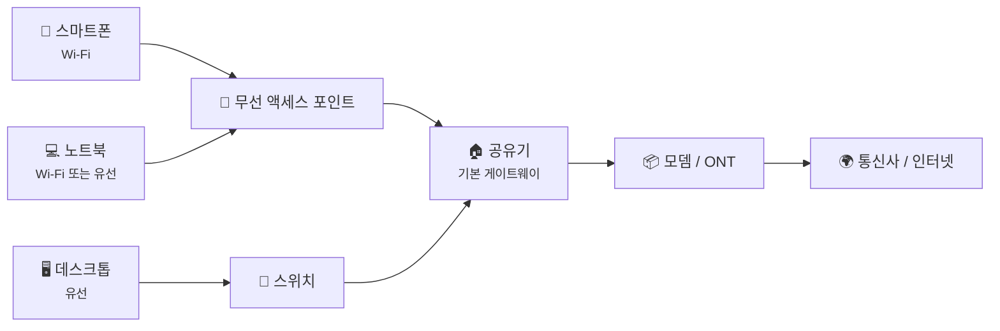
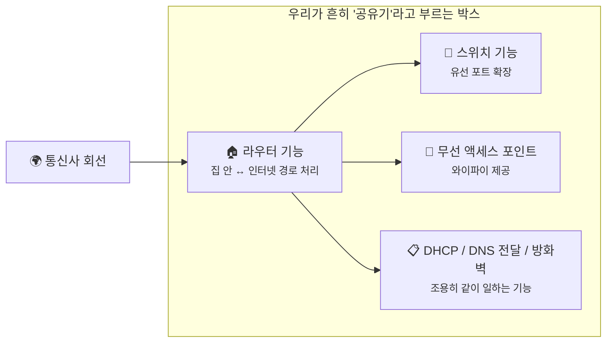
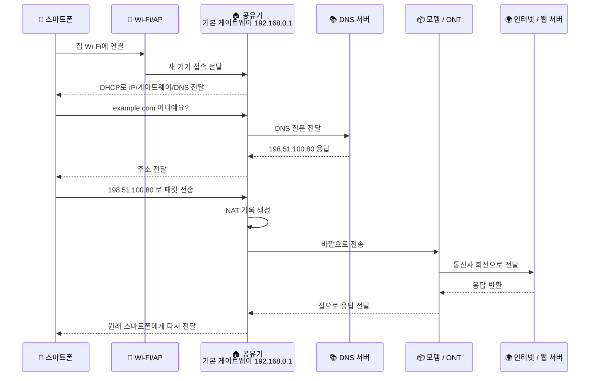

# 공유기와 홈 네트워크, 우리 집 인터넷은 안에서 어떻게 흘러갈까요?

> 와이파이 칸은 꽉 차 있는데도, **인터넷은 안 될 수 있어요.** 둘은 같은 말 같죠? **사실은 아니에요.**

[패킷 캡처는 뭘 보는 걸까요?](12-packet-capture.md){ data-preview }에서는 같은 요청도 **어디에서 캡처했는지** 에 따라 전혀 다르게 보일 수 있다는 걸 봤어요.
노트북에서 보면 사설 IP가 보이고, 공유기 바깥쪽에서 보면 공인 IP가 보이기도 했죠.

근데 여기서 한 가지가 더 궁금해져요.

> *"좋아요, 캡처 위치가 중요하다는 건 알겠어요. 근데 그 전에, 우리 집 안에서는 패킷이 실제로 어떤 장비를 지나가고 있는 거죠?"*

바로 그 장면을 여는 글이 이번 글이에요.
[OSI 7계층과 TCP/IP 모델](08-osi-and-tcp-ip-layers.md){ data-preview } 이후부터는 개념을 하나씩 외우는 구간이 아니라, **실제로 어디에서 어떤 역할이 보이는지** 를 읽는 구간이잖아요.
이번에는 우리 집 안의 작은 네트워크 지도를 펼쳐서, **공유기가 정확히 무슨 일을 하고 다른 장비들은 어디에 있는지** 차근차근 연결해볼게요.

---

## 일단 비유로 시작해볼게요

작은 사무실 하나를 떠올려볼까요?

- 건물 바깥에서 들어오는 **메인 회선**이 있고,
- 입구에는 사람과 택배를 정리하는 **안내 데스크**가 있고,
- 복도 안쪽에는 책상들을 이어주는 **분배기**가 있고,
- 무선 호출기를 쓰는 사람들을 받는 **무선 접수 창구**도 있어요.

겉으로 보면 그냥 "사무실 인터넷" 하나처럼 보이죠?
근데 안을 열어보면 역할이 조금씩 달라요.

| 부분 | 비유에서는 | 실제로는 |
|------|----------|----------|
| **모뎀 / ONT** | 건물 바깥 회선을 안으로 들여오는 입구 장치 | **통신사 선을 집 안 네트워크가 쓸 수 있는 형태로 바꾸는 장치** |
| **공유기** | 안내 데스크 | **집 안과 인터넷 바깥 사이에서 길을 정하고 전달하는 중심 장비** |
| **스위치** | 책상 쪽으로 선을 나눠주는 분배기 | **같은 집 안 네트워크의 유선 연결을 늘려주는 장치** |
| **무선 액세스 포인트** | 무선 접수 창구 | **와이파이로 기기를 같은 집 안 네트워크에 붙여주는 장치** |
| **기본 게이트웨이** | "바깥으로 나갈 일 있으면 여기로 오세요" 하는 안내 창구 | **내 기기가 집 밖으로 가는 패킷을 먼저 보내는 기본 출구 주소** |

즉, 우리가 보통 그냥 **공유기**라고 부르는 박스 하나 안에,
사실은 여러 역할이 같이 들어 있는 경우가 아주 많아요.

이 그림에서 중요한 건,
와이파이, 유선 랜선, 공유기, 모뎀은 전부 **같은 역할이 아니라는 점** 이에요.
우리는 평소에 한 박스로 봐서 헷갈릴 뿐이죠.

---

## 공유기라고 부르는 그 박스 안에는 뭐가 들어 있을까요?

이쯤 되면 이런 생각이 들 수 있어요.

> *"그럼 집에 있는 그 네모난 박스는 대체 정체가 뭐예요?"*

좋은 질문이에요.
일반인 입장에서는 전부 다 공유기처럼 보이거든요.
근데 기술적으로는 역할을 나눠서 보는 편이 훨씬 덜 헷갈려요.

### 모뎀 / ONT는 바깥 회선을 집 안으로 넘겨주는 입구예요

통신사에서 들어오는 선이 늘 똑같은 모양은 아니에요.
광케이블일 수도 있고, 동축 케이블일 수도 있고, 다른 방식일 수도 있죠.

여기서 **모뎀**이나 **ONT** 는 그 바깥 신호를 집 안 장비가 다루기 쉬운 형태로 넘겨주는 역할을 해요.

- **모뎀**: 통신사 회선을 데이터 신호로 바꿔주는 쪽에 가까워요.
- **ONT**: 광회선에서 자주 보이는 장비예요. 빛 신호를 네트워크 장비가 쓸 수 있는 쪽으로 바꿔줘요.

그러니까 모뎀이나 ONT는 **인터넷 길의 입구**에 가깝지,
집 안 기기들에게 주소를 나눠주거나 와이파이를 뿌리는 주인공은 아닐 수 있어요.

### 공유기는 집 안과 바깥 사이의 중심 출구예요

공유기는 이번 글의 주인공이에요.

공유기는 집 안 기기들이 바깥으로 나가려 할 때,
**"이건 집 밖으로 가는 패킷이네. 그럼 내가 바깥쪽 출구로 넘겨줄게."** 하고 일하는 장비예요.

그래서 여러분 기기 설정에 보이는 **기본 게이트웨이(Default Gateway)** 주소가 보통 공유기 쪽을 가리켜요.
예를 들어 노트북이 `192.168.0.23` 이고, 기본 게이트웨이가 `192.168.0.1` 이라면,
그 `192.168.0.1` 이 바로 **집 안에서 바깥으로 나가는 기본 문** 같은 거예요.

다만 여기서 한 가지는 같이 기억해두면 좋아요.
집마다 구조가 똑같지는 않아서, 어떤 집은 **내 공유기 앞에 통신사 장비가 한 겹 더** 있을 수도 있어요.
그러니까 항상 "내가 만지는 그 공유기 = 바로 공인 IP를 들고 있는 장비" 라고 단정하면 살짝 위험해요.

### 스위치는 같은 집 안 유선 연결을 늘려줘요

스위치는 공유기랑 살짝 비슷해 보여도 역할이 달라요.

스위치는 **같은 집 안 네트워크 안에서** 유선 기기들을 더 많이 붙일 수 있게 해줘요.
예를 들어 데스크톱, TV, 게임기, NAS를 랜선으로 여러 대 연결해야 할 때 쓰죠.

스위치는 "인터넷 바깥으로 보낼지 말지" 를 결정하는 중심 장비라기보다,
**집 안에서 유선 포트를 늘려주는 분배기** 쪽에 더 가까워요.

### 무선 액세스 포인트는 와이파이 입구예요

와이파이는 인터넷 그 자체가 아니에요.
와이파이는 그냥 **집 안 네트워크에 무선으로 붙는 방식** 이에요.

무선 액세스 포인트(AP)는 스마트폰이나 노트북이 그 집 안 네트워크에 들어오도록 도와주는 문 같은 역할을 해요.
그래서 와이파이 신호가 아주 좋아도,
그 뒤에 있는 공유기나 모뎀, 통신사 회선 쪽에 문제가 있으면 인터넷은 안 될 수 있어요.

이 그림처럼 실제 집에서는 여러 역할이 한 장비에 합쳐져 있을 때가 많아요.
그래서 설명할 때는 **공유기**라고 부르더라도,
머릿속에서는 **"지금은 그 안의 어떤 역할을 말하는지"** 를 구분해두면 훨씬 편해요.

---

## 근데 왜 이런 역할을 나눠서 봐야 할까요?

그냥 "인터넷 장비"라고 뭉뚱그려도 될 것 같죠?
근데요, **실전에서는 이 구분이 엄청 중요해요.**

### 1. 어디가 문제인지 훨씬 빨리 좁힐 수 있어요

- 와이파이가 안 잡히면 **무선 액세스 포인트** 쪽 문제일 수 있고,
- IP를 못 받으면 **DHCP** 쪽 문제일 수 있고,
- 집 안 기기끼리는 되는데 바깥만 안 되면 **공유기/모뎀/통신사 회선** 쪽 문제일 수 있어요.

즉, "인터넷이 안 돼요" 를 조금 더 정확하게 바꿔서 볼 수 있게 돼요.

### 2. 패킷 캡처에서 본 장면이 더 덜 헷갈려요

[패킷 캡처는 뭘 보는 걸까요?](12-packet-capture.md){ data-preview }에서 같은 요청도 **잡은 위치에 따라 다르게 보인다** 고 했잖아요.
이제는 왜 그런지 더 선명해져요.

- 스마트폰 가까이서 보면 **사설 IP** 가 보이고,
- 공유기 바깥쪽에서 보면 **NAT 뒤의 공인 IP** 가 보일 수 있고,
- 통신사 쪽으로 더 나가면 집 안 기기 하나하나가 아니라 **공유기 바깥 모습** 이 먼저 보이죠.

### 3. 집 안 네트워크의 기본 설정이 무엇을 하는지도 보이기 시작해요

공유기 관리자 화면을 열어보면 이것저것 항목이 많잖아요.
예전엔 그냥 복잡한 설정처럼 보였을 수 있어요.
근데 역할을 알고 나면,
그 화면이 사실은 **집 안 출입문 규칙표** 처럼 읽히기 시작해요.

---

## 그럼 공유기는 집 안에서 구체적으로 무슨 일을 할까요?

이제 비유를 조금 접고,
집 안 공유기가 조용히 맡고 있는 일을 실제 용어로 연결해볼게요.

### 1. DHCP로 기기에게 기본 설정을 나눠줘요

새 스마트폰이나 노트북이 집 와이파이에 처음 붙으면,
보통 우리가 IP 주소를 손으로 입력하지는 않잖아요.

그걸 대신 해주는 게 **DHCP** 예요.
공유기는 새로 들어온 기기에게 대충 이런 걸 알려줘요.

| 항목 | 예시 값 | 뜻 |
|------|--------|----|
| **IP 주소** | `192.168.0.23` | 이 기기의 집 안 주소 |
| **서브넷 정보** | `255.255.255.0` | 어디까지가 같은 집 안 네트워크인지 |
| **기본 게이트웨이** | `192.168.0.1` | 바깥으로 나갈 때 먼저 갈 출구 |
| **DNS 서버** | `192.168.0.1` 또는 `8.8.8.8` | 이름을 주소로 물어볼 곳 |

즉, DHCP는 **"너는 오늘부터 이 자리 쓰고, 밖으로 나갈 땐 여기로 가고, 이름 물어볼 땐 여기 물어봐"** 하고 안내해주는 역할이에요.

### 2. 기본 게이트웨이로 집 밖 트래픽을 받아줘요

내 노트북이 같은 집 안의 프린터에게 보내는 패킷과,
웹사이트로 보내는 패킷은 성격이 다르죠.

웹사이트처럼 **집 밖 주소** 로 가야 하는 패킷이면,
기기는 그걸 **기본 게이트웨이**, 즉 보통 공유기에게 먼저 보냅니다.

이건 [IP 주소와 라우팅 - 패킷은 어떻게 길을 찾을까?](02-ip-and-routing.md){ data-preview }에서 봤던 라우팅 감각이 집 안으로 내려온 거예요.
인터넷 전체 라우터가 다음 길을 고르듯,
우리 집 안에서는 공유기가 **첫 번째 길 안내자** 가 되는 거죠.

### 3. NAT로 여러 기기의 바깥 출구를 하나로 묶어요

[공인 IP, 사설 IP, 그리고 NAT는 왜 같이 나올까요?](11-public-private-ip-and-nat.md){ data-preview }에서 본 NAT도 여기 들어 있어요.
다만 이번 글에서는 길게 반복하지 않을게요.

핵심만 말하면,
공유기나 집 바깥쪽 게이트웨이 경로는 집 안 기기들의 **사설 IP** 를 바깥으로 내보낼 때 **바깥쪽 주소 기준 흐름** 으로 이어줘요.
그래서 스마트폰, 노트북, TV가 동시에 인터넷을 써도,
바깥에서는 먼저 **집 바깥 출구 쪽 주소** 가 대표로 보일 수 있는 거예요.

### 4. DNS 질문을 대신 전달해주기도 해요

[A, AAAA, CNAME... DNS 레코드는 왜 종류가 여러 갈래일까요?](10-dns-records.md){ data-preview }에서 DNS는 **이름을 주소로 바꾸는 기술** 이라고 봤죠.
집에서는 많은 경우 공유기가 그 질문을 한 번 받아서 바깥 DNS 서버로 넘겨줘요.

그러니까 기기 입장에서는:

1. `example.com` 의 주소를 알고 싶어요.
2. 공유기나 지정된 DNS 서버에 물어봐요.
3. 주소 응답을 받으면 그다음 연결을 시작해요.

여기서 중요한 건,
**DNS는 이름을 찾는 일** 이고,
**공유기는 그 질문이 어디로 가야 할지 이어주는 자리** 를 맡을 수 있다는 점이에요.

### 5. 방화벽으로 들어오는 연결을 걸러요

여기서 NAT와 많이 헷갈리는 기능이 하나 있어요.
바로 **방화벽** 이에요.

- **NAT** = 주소를 바꿔 이어주는 일
- **방화벽** = 어떤 통신을 허용하고 막을지 판단하는 일

둘은 종종 같은 공유기 안에 같이 들어 있지만,
같은 일은 아니에요.

그래서 공유기는 단순히 주소만 바꾸는 장비가 아니라,
**집 안으로 함부로 들어오는 연결을 막는 문지기 역할** 도 함께 맡는 경우가 많아요.

---

## 그럼 진짜 패킷은 집 안에서 어떻게 움직일까요?

이제 오늘 글의 핵심 장면으로 들어가볼게요.
스마트폰이 집 와이파이에 붙은 뒤 `example.com` 을 여는 상황을 상상해보죠.

이 흐름을 보면,
우리가 앞에서 따로 봤던 개념들이 한 장면 안에서 다 만나요.

- **DHCP** 가 먼저 기본 설정을 나눠주고,
- **DNS** 가 이름을 주소로 바꾸고,
- **기본 게이트웨이** 인 공유기가 바깥 출구를 맡고,
- **NAT** 가 주소를 바깥 기준으로 이어주고,
- 응답은 다시 원래 기기로 돌아오죠.

말하자면 공유기는 **집 안 네트워크의 현장 관리자** 에 가까워요.
그냥 선만 꽂혀 있는 박스가 아니라,
누가 들어오고 나가는지, 어느 길로 보내야 하는지, 어디까지 허용할지 계속 판단하고 있는 거예요.

---

## 와이파이와 인터넷은 왜 자꾸 같은 말처럼 들릴까요?

이건 정말 많이 헷갈리는 부분이에요.

> *"와이파이가 잘 뜨는데 인터넷이 안 돼요."*

이 말이 이상하게 들리지 않죠?
근데 사실은 아주 정확한 문장이에요.

왜냐하면:

- **와이파이 연결** 은 내 기기가 **집 안 무선 네트워크에 붙었다** 는 뜻이고,
- **인터넷 연결** 은 그 뒤에 있는 공유기, 모뎀, 통신사 회선, 바깥 경로까지 살아 있다는 뜻이거든요.

즉,

- 와이파이는 **집 안으로 들어오는 방식** 이고,
- 인터넷은 **그 집에서 바깥세상까지 닿는 길 전체** 예요.

그래서 와이파이 칸이 가득해도,
모뎀 쪽 회선이 끊겼거나 공유기 WAN 쪽에 문제가 있으면 바깥으로 못 나갈 수 있어요.

!!! tip "이것만 기억해도 충분해요"
    **와이파이 = 집 안 무선 연결**, **인터넷 = 그 뒤 바깥세상까지 이어지는 전체 경로** 예요. 둘은 겹치지만 같은 말은 아니에요.

---

## 그럼 공유기 설정 화면에서 뭘 보면 감이 올까요?

공유기 관리자 화면을 열면 메뉴가 많아서 조금 겁나죠?
근데 처음엔 이 네 가지만 보여도 충분해요.

### 1. WAN 쪽 주소

이건 공유기가 **바깥과 연결될 때 쓰는 주소** 쪽이에요.
여기 상태가 비어 있거나 이상하면, 집 안 와이파이가 멀쩡해도 인터넷은 안 될 수 있어요.

### 2. LAN 쪽 주소

이건 공유기가 집 안에서 쓰는 주소예요.
보통 `192.168.0.1` 이나 `192.168.1.1` 같은 숫자를 많이 보죠.
바로 이 주소가 기기들 입장에서는 **기본 게이트웨이** 로 쓰이기 쉬워요.

### 3. DHCP 설정

어떤 범위의 주소를 자동으로 나눠줄지 보는 항목이에요.
예를 들면 `192.168.0.100` 부터 `192.168.0.200` 까지 자동 할당하도록 둘 수 있죠.

### 4. DNS / 보안 / 포트 관련 메뉴

공유기가 DNS 질문을 어디로 넘길지,
어떤 연결을 막을지,
나중에 바깥에서 안쪽으로 들어오는 연결을 어떻게 열지 같은 옵션들이 여기에 붙어 있어요.

그러니까 설정 화면은 마법 상자가 아니라,
**집 안 출입 규칙과 주소 배정표** 를 보여주는 곳이라고 보면 훨씬 읽기 쉬워져요.

---

## 그런데 공유기가 두 번 겹치면 왜 귀찮아질까요?

여기서 실전에서 자주 만나는 함정이 하나 있어요.
바로 **이중 NAT(Double NAT)** 예요.

집에 이미 통신사 장비가 공유기처럼 동작하고 있는데,
그 뒤에 내가 산 공유기를 또 공유기 모드로 연결하면 어떻게 될까요?

집 안 기기 입장에서는 **출구가 두 겹** 생겨버려요.

겉보기엔 잘 될 때도 많아요.
웹서핑이나 영상 시청은 그냥 되는 경우가 많거든요.

근데 바깥에서 안으로 들어와야 하는 연결,
예를 들면 일부 게임, 원격 접속, 포트 포워딩, 특정 VPN에서는 이야기가 복잡해질 수 있어요.
왜냐하면 어느 장비가 문지기인지가 **두 번 겹쳐버리기** 때문이에요.

그러니까 공유기를 하나 더 달았다고 해서 무조건 좋아지는 건 아니고,
가끔은 **브릿지 모드** 나 **AP 모드** 같은 설정이 필요한 이유가 바로 여기 있어요.

---

## 패킷 캡처나 장애 확인에서 이 감각이 왜 중요할까요?

이제 [패킷 캡처는 뭘 보는 걸까요?](12-packet-capture.md){ data-preview }와 다시 연결해볼게요.

### 1. 어디에서 봤는지 먼저 물어보게 돼요

패킷을 내 노트북에서 잡은 건지,
공유기 바깥쪽에서 잡은 건지,
통신사 장비 앞뒤에서 본 건지에 따라 해석이 달라져요.

이제는 그 이유를 구조적으로 설명할 수 있죠.

### 2. "인터넷이 안 돼요" 를 더 구체적으로 바꿀 수 있어요

- 와이파이 자체가 안 붙는 건지
- DHCP로 IP를 못 받은 건지
- DNS 질문이 안 나가는 건지
- 기본 게이트웨이까진 가는데 바깥으로 못 나가는 건지
- NAT 뒤 응답이 제대로 안 돌아오는 건지

이렇게 질문이 더 날카로워져요.

### 3. 집 안 네트워크가 한 장면으로 연결돼요

우리가 따로 배웠던 **IP, 라우팅, DNS, NAT, 패킷 캡처** 가
사실은 전부 공유기 주변에서 다시 만나고 있었다는 게 보여요.

그러니까 이 글은 완전히 새로운 개념을 하나 더 외우는 글이라기보다,
**지금까지 본 조각들이 우리 집이라는 실제 공간에서 어떻게 붙어 있는지** 를 확인하는 글에 더 가까워요.

---

## 자, 정리해볼까요?

!!! abstract "오늘 우리가 배운 것"
    - **모뎀 / ONT** 는 통신사 회선을 집 안 네트워크가 쓸 수 있는 쪽으로 넘겨주는 입구 장치예요.
    - **공유기** 는 집 안과 인터넷 바깥 사이의 중심 출구이고, 많은 기기에서 **기본 게이트웨이** 주소로 보이는 주인공이에요.
    - **스위치** 는 집 안 유선 연결을 늘려주고, **무선 액세스 포인트** 는 와이파이로 같은 집 안 네트워크에 붙게 해줘요.
    - **DHCP** 는 IP, 기본 게이트웨이, DNS 같은 기본 설정을 자동으로 나눠줘요.
    - **NAT** 는 여러 집 안 기기가 하나의 공인 주소를 공유하게 해주고, **방화벽** 은 어떤 연결을 허용하거나 막을지 판단해요.
    - **와이파이** 는 집 안 무선 연결 방식이고, **인터넷** 은 그 뒤 바깥세상까지 이어지는 전체 경로라서 서로 같은 말은 아니에요.

어때요?
이제 공유기를 보면 그냥 불 들어오는 박스가 아니라,
**집 안 주소를 나눠주고, 바깥 출구를 맡고, 이름 찾는 질문을 넘기고, 주소를 바꾸고, 들어오는 문도 지키는 장비** 처럼 보이기 시작하죠?

우리는 이제 집 안 네트워크를 한 장면으로 봤어요.
다음부터는 "인터넷이 된다 / 안 된다" 를 넘어서,
**어느 문에서 막혔는지** 를 조금씩 읽을 수 있게 될 거예요.

---

## 다음 글 예고

근데 여기서 또 하나 궁금한 게 생기지 않으세요?

> *"공유기가 집 안 문지기라면, 바깥에서 우리 집 안 장치로 일부러 들어오게 하려면 어떻게 해야 할까요?"*

다음 글에서는 **포트 포워딩과 들어오는 연결** 이야기를 해볼게요.
우리 집 공유기가 평소엔 문을 지키다가도, 어떤 경우엔 왜 특정 문을 열어줘야 하는지 이제 그다음 장면으로 넘어가볼 차례예요.
