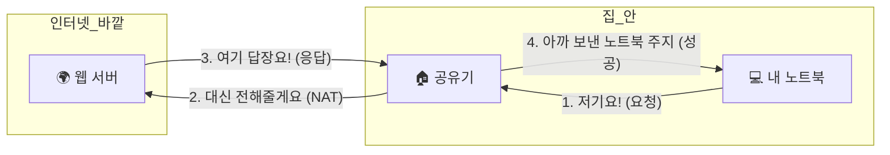
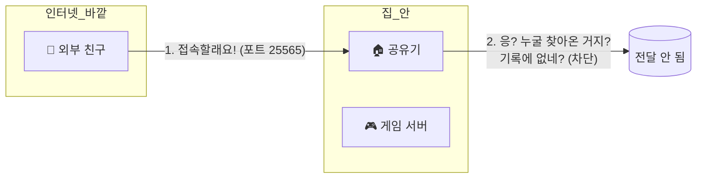
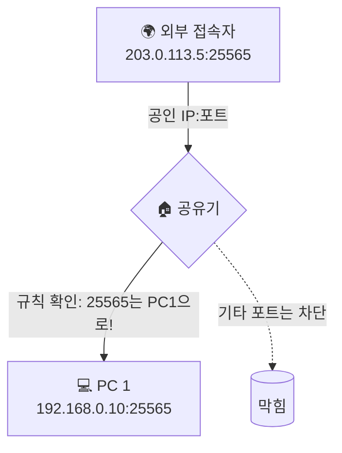

# 포트 포워딩과 들어오는 연결, 닫힌 우리 집 문을 어떻게 열까요?

> *"포트 포워딩을 했는데도 접속이 안 돼요."* **사실은 문만 연다고 다 되는 게 아니에요.**

[공유기와 홈 네트워크](13-router-and-home-network.md){ data-preview }에서 우리는 공유기가 집 안의 문지기이자 안내 데스크라는 걸 배웠어요.
집 안 기기들이 바깥 인터넷으로 나갈 때는 공유기가 알아서 길을 터주죠.
근데 반대의 경우는 어떨까요?

바깥 세상에서 우리 집 안에 있는 특정 컴퓨터나 게임기에게 먼저 말을 걸고 싶을 때 말이에요.

> *"집에 있는 컴퓨터로 마인크래프트 서버를 열고 싶은데, 친구들이 접속을 못 해요."*
> *"밖에서도 우리 집 나스(NAS)에 파일을 올리고 싶은데, 주소를 쳐도 응답이 없어요."*

분명히 [공인 IP, 사설 IP, 그리고 NAT](11-public-private-ip-and-nat.md){ data-preview }에서 배운 공인 IP 주소로 접속을 시도했는데 왜 안 될까요?
오늘은 그 닫힌 문을 안전하게 여는 방법인 **포트 포워딩** 이야기를 해볼게요.

즉, 앞에서 봤던 NAT가 **안에서 밖으로 나가는 흐름**을 이어주는 이야기였다면, 이번 글은 그 반대로 **밖에서 안으로 들어오게 하려면 무엇을 더 정해줘야 하는지** 보는 편이라고 생각하면 돼요.

---

## 일단 비유로 시작해볼게요

거대한 아파트 단지를 상상해볼까요?

- 아파트 정문에는 **택배 보관소(공유기)**가 있고,
- 각 세대(기기)는 **호수(사설 IP)**를 쓰고 있어요.
- 바깥 사람들이 아파트 단지를 볼 때는 **아파트 정문 주소(공인 IP)**만 보여요.

자, 이제 택배(패킷)가 옵니다.

1. **안에서 밖으로 보낼 때**: "101호에서 피자 주문했어요" 하고 나가면, 공유기가 "아, 101호가 피자집이랑 대화 중이구나" 하고 기억했다가 오는 피자를 101호로 전해줘요. (이건 NAT가 알아서 해줘요!)
2. **밖에서 안으로 올 때**: 갑자기 누군가 정문에 와서 "피자 배달 왔습니다!" 라고 해요. 근데 공유기는 당황해요. "응? 지금 피자 기다리는 집이 없는데? 이거 누구한테 줘야 하지?"

이때 공유기가 택배를 버리지 않고 특정 집으로 배달하게 하려면, 미리 **장부**에 적어둬야 해요.
**"앞으로 피자 배달 오면 무조건 101호로 보내줘!"** 라고요. 이게 바로 포트 포워딩이에요.

| 부분 | 비유에서는 | 실제로는 |
|------|----------|----------|
| **아파트 정문 주소** | 누구나 찾아올 수 있는 대표 주소 | **공인 IP (Public IP)** |
| **개별 세대 호수** | 단지 안에서만 쓰는 주소 | **사설 IP (Private IP)** |
| **택배 품목** | 피자, 택배, 우편물 등 | **포트 번호 (Port Number)** |
| **배달 장부** | "피자 오면 101호로" 적힌 쪽지 | **포트 포워딩 규칙 (Port Forwarding Rule)** |
| **모든 택배 받기** | "일단 오는 거 다 우리 집으로 줘" | **DMZ 설정** |

---

## 왜 나가는 건 잘 되는데 들어오는 건 안 될까요?

[포트와 소켓](05-ports-and-sockets.md#port-role){ data-preview }에서 포트가 "앱을 찾아가는 문"이라고 했잖아요.
공유기는 기본적으로 **안에서 밖으로 먼저 말을 건 통신**만 기억해요.

하지만 바깥에서 **예약 없이** 불쑥 찾아오면, 공유기는 이 패킷을 누구에게 전달해야 할지 모릅니다.
보안을 위해서라도 모르는 패킷은 일단 차단하고 보거든요.

이 "누굴 찾아왔는지 알려주는 꼬리표"가 바로 **포트 번호**이고,
그 번호를 보고 "아, 이건 192.168.0.10 PC로 보내라는 거구나" 하고 길을 터주는 게 **포트 포워딩**이에요.

---

## 공유기 설정 화면, 어떻게 채우면 될까요?

공유기 관리자 페이지에서 포트 포워딩 메뉴를 열면 보통 이런 칸들이 보여요.
어렵게 생각하지 말고 하나씩 채워볼까요?

1. **규칙 이름**: 내가 알아보기 쉬운 이름 (예: 마인크래프트, NAS)
2. **내부 IP 주소**: 패킷을 받을 **집 안 기기의 사설 IP** (예: `192.168.0.10`)
3. **프로토콜**: 보통 TCP를 쓰지만, 게임이나 스트리밍은 UDP를 쓰기도 해요. 가장 좋은 건 **그 서비스가 실제로 쓰는 프로토콜만 정확히 여는 것** 이에요.
4. **외부 포트 (External Port)**: 바깥 사람이 우리 집 공인 IP 뒤에 붙여서 들어올 포트 번호.
5. **내부 포트 (Internal Port)**: 실제 그 기기 안에서 돌아가는 앱이 기다리는 포트 번호. (보통 외부 포트와 똑같이 맞춰요.)

이 그림에서 핵심은,
공유기가 모든 패킷을 무조건 안으로 넣는 게 아니라 **미리 적어둔 규칙과 딱 맞는 포트만** 특정 기기로 넘긴다는 점이에요.
그러니까 포트 포워딩은 "문 전체를 열기" 보다는 **정해진 문 하나를 지정해서 열기** 에 더 가까워요.

!!! tip "DMZ는 뭔가요?"
    "포트 번호 따지기 귀찮아! 그냥 바깥에서 오는 모든 연결을 특정 PC 한 대에 다 몰아줘!" 하는 설정이에요.
    설정은 편하지만, 그 PC의 모든 문(포트)이 인터넷에 노출되는 거라 **보안상 위험할 수 있어요.** 꼭 필요한 경우가 아니면 포트 포워딩으로 필요한 문만 여는 걸 권장해요.

---

## 잠깐! UPnP랑 hairpin NAT는 또 뭘까요?

공유기 설정을 보다 보면 처음 보는 이름이 또 나와요.
바로 **UPnP** 와 **hairpin NAT** 예요.

### UPnP는 "앱이 공유기에게 문 좀 열어달라고 부탁하는 기능"이에요

예를 들어 게임기나 화상회의 앱이,
"제가 지금 이 포트 써야 하니까 잠깐 열어주세요" 하고 공유기에게 자동으로 요청할 수 있어요.

편하긴 해요.
직접 포트 번호를 안 적어도 되니까요.
근데 반대로 말하면,
**어떤 앱이 자동으로 문을 열고 닫는지 사용자가 잘 모를 수도 있다** 는 뜻이기도 해요.

그래서 집에서 테스트 용도로는 편할 수 있어도,
지속적으로 공개할 서비스라면 보통은 **내가 직접 규칙을 이해하고 고정해서 여는 쪽** 이 더 마음이 편해요.

### hairpin NAT는 "집 안에서 우리 집 공인 주소로 다시 들어가려는 상황"이에요

가끔 이런 경우가 있어요.

> *"밖에서는 접속되는데, 같은 집 와이파이에서는 우리 집 공인 IP로 접속이 안 돼요."*

이건 이상한 일이 아니라,
공유기가 **집 안에서 나간 척했다가 다시 집 안으로 들어오는 길** 을 제대로 돌려주지 못하는 경우가 있어서 그래요.
이걸 보통 **hairpin NAT** 나 **NAT loopback** 같은 말로 불러요.

즉,

- 바깥 LTE에서는 접속되는데
- 같은 집 Wi-Fi에서는 공인 IP 주소로 접속이 안 된다면

포트 포워딩 규칙 자체보다 **공유기의 loopback 지원 여부** 를 의심해보는 게 더 맞을 수 있어요.

---

## 근데 왜 포트 포워딩을 해도 안 될 때가 있을까요?

분명히 설정을 다 했는데도 안 된다면, 보통 이 세 가지 중 하나가 범인이에요.

### 1. 윈도우 방화벽이 막고 있어요 (호스트 방화벽)

공유기 문은 열었어도, 정작 패킷을 받는 **그 기기 자체의 방화벽**이 "너 누구야!" 하고 막을 수 있어요.
윈도우라면 인바운드 규칙을 확인해야 하고, NAS나 리눅스 서버라면 그 장비 쪽 방화벽이나 서비스 허용 설정을 다시 봐야 해요.

### 2. 이중 NAT 상황이에요 (공유기 앞에 공유기가 더 있어요)

[공유기와 홈 네트워크](13-router-and-home-network.md#double-nat){ data-preview }에서 잠깐 말했던 이중 NAT 상황이에요.
통신사 모뎀이 사실은 공유기 역할을 하고 있다면, **모뎀에서도 포트 포워딩을 하고, 내 공유기에서도 또 해줘야 해요.**
문을 두 번 열어야 하는 거죠.

### 3. CGNAT (통신사가 공인 IP를 안 줘요)

요즘은 공인 IP가 부족해서 통신사가 여러 집을 하나의 공인 IP로 묶어서 관리하기도 해요.
이걸 **CGNAT**라고 부르는데, 이 경우에는 우리가 공유기 설정을 아무리 만져도 바깥에서 직접 들어올 방법이 없어요. (이럴 땐 별도의 터널링 서비스나 IPv6를 써야 해요.) [공인 IP, 사설 IP, 그리고 NAT](11-public-private-ip-and-nat.md#nat-how-it-works){ data-preview }에서 봤던 NAT를 통신사 바깥쪽에서 한 번 더 해버린 상황이라고 생각하면 이해가 쉬워요. 지금은 **"공인 IP를 못 받으면 포트 포워딩만으로는 안 풀릴 수 있구나"** 정도만 먼저 잡아두면 충분해요.

---

## 그럼 진짜로 어떻게 확인하고 해결할까요?

포트 포워딩 트러블슈팅의 정석 흐름이에요. 이 순서대로 차근차근 확인하면 대부분 여기서 문제를 찾게 돼요.

1. **사설 IP 고정**: 내 컴퓨터의 사설 IP가 자꾸 바뀌면 공유기 규칙이 엉뚱한 곳을 가리키게 돼요. 공유기 설정에서 내 컴퓨터의 IP를 고정(DHCP 예약)해주세요.
   [공유기와 홈 네트워크](13-router-and-home-network.md#dhcp-basics){ data-preview }에서 봤던 DHCP가 여기서 다시 중요해져요.
2. **내부 접속 확인**: 같은 집 안의 다른 기기에서 사설 IP로 접속이 되는지 먼저 보세요. 여기서 안 되면 앱 설정이나 컴퓨터 방화벽 문제예요.
3. **외부 포트 오픈 확인**: 'Open Port Check' 같은 사이트에서 우리 집 공인 IP의 해당 포트가 열려 있는지 확인하세요.
4. **공인 IP 확인**: 공유기가 받은 WAN IP가 `10.x.x.x`나 `172.16.x.x`~`172.31.x.x`, 혹은 `100.64.x.x` 대역이라면 통신사 차원에서 막혀 있는 경우가 많아요.

---

## 자, 정리해볼까요?

!!! abstract "오늘 우리가 배운 것"
    - **포트 포워딩**은 외부에서 불쑥 찾아온 패킷을 집 안의 특정 기기로 안내해주는 **배달 장부**예요.
    - 공유기는 기본적으로 보안을 위해 **안에서 시작된 대화**만 허용하고, 밖에서 시작된 연결은 차단해요.
    - **DMZ**는 모든 포트를 한 기기로 몰아주는 기능이지만 보안에 주의해야 해요.
    - 설정이 안 된다면 **컴퓨터 방화벽**, **이중 NAT**, 혹은 **통신사 CGNAT**를 의심해봐야 해요.
    - 원활한 운영을 위해 패킷을 받는 기기의 **사설 IP를 고정**하는 것이 필수예요.

포트 포워딩은 내가 만든 서비스를 세상에 처음 공개하는 아주 설레는 작업이기도 해요.
하지만 문을 열어준다는 건, 반대로 말하면 **나쁜 사람들도 그 문으로 들어올 수 있다**는 뜻이기도 하죠.

그래서 다음 글에서는 이 문을 더 꼼꼼하게 지키는 법,
**방화벽과 상태 기반 필터링** 이야기를 해볼게요.

---

## 다음 글 예고

문을 열어주긴 했는데, 들어오는 사람이 친구인지 도둑인지 어떻게 구분할까요?

> *"포트는 열어뒀지만, 이상한 패킷은 알아서 걸러낼 수 없을까?"*

다음 글에서는 **"방화벽과 상태 기반 필터링"** 이야기를 통해,
단순히 문을 열고 닫는 수준을 넘어 패킷의 '상태'를 보고 판단하는 똑똑한 문지기의 비밀을 알아볼게요.
