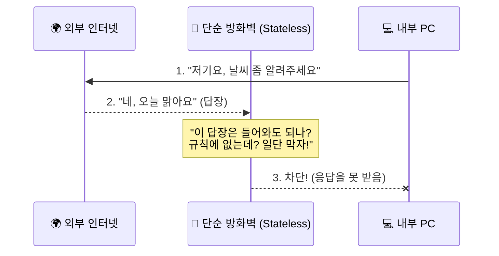
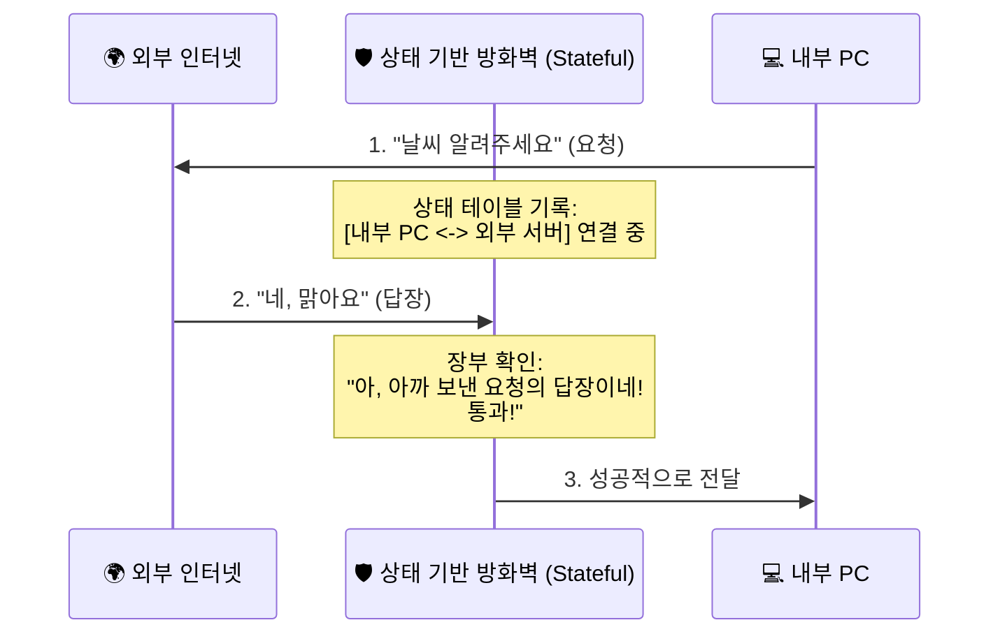
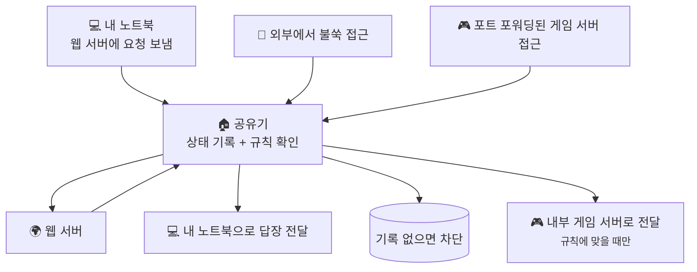

# 방화벽과 상태 기반 필터링, 열린 문 앞에서 누가 들어와도 되는지 어떻게 판단할까요?

> *"문을 열어주긴 했는데, 들어오는 사람이 친구인지 도둑인지 어떻게 구분할까요?"* **그냥 문만 열어두는 건 너무 위험하잖아요.**

[포트 포워딩과 들어오는 연결](14-port-forwarding-and-incoming-connections.md){ data-preview }에서 우리는 바깥 세상에서 우리 집 안으로 들어올 수 있는 '통로'를 만드는 법을 배웠어요.
마치 아파트 정문에 "피자 배달 오면 101호로 보내주세요"라고 적어두는 것과 같았죠.

하지만 여기서 한 가지 걱정이 생겨요.
만약 나쁜 마음을 먹은 사람이 "피자 배달 왔습니다!"라고 거짓말을 하면서 위험한 물건을 들고 오면 어쩌죠?
혹은 우리가 부르지도 않았는데 누군가 우리 집 문을 계속 두드린다면요?

오늘은 단순히 문을 열고 닫는 수준을 넘어, 들어오는 패킷이 정말 안전한지 판단하는 똑똑한 문지기, **방화벽(Firewall)** 이야기를 해볼게요.

즉, 지난 글이 **"바깥에서 안으로 들어오는 길을 어떻게 만들까?"** 에 가까웠다면, 이번 글은 그다음 단계인 **"그 길로 들어오려는 패킷을 어떤 기준으로 들이고 막을까?"** 를 보는 편이에요.

---

## 일단 비유로 시작해볼게요

이번에도 아파트 단지 이야기를 가져와 볼까요?
포트 포워딩이 '배달 장부'였다면, 방화벽은 정문에 서 있는 **베테랑 보안 요원**이에요.

- **포트 포워딩**: "피자 배달은 101호로 연결해!" (길 안내)
- **방화벽**: "잠깐, 당신 누구야? 101호에서 피자 시킨 적 있어? 신분증 좀 봅시다." (판단과 차단)

방화벽 중에서도 가장 똑똑한 녀석은 **'상태 기반 필터링(Stateful Filtering)'**이라는 기술을 써요. 이 요원은 기억력이 아주 좋아서, 안에서 누가 밖으로 나갔는지를 다 기억하고 있거든요.

1. **안에서 밖으로 나갈 때**: 101호 거주자가 정문을 나가면서 "저 피자 주문하러 가요!"라고 말해요. 요원은 장부에 **`101호 - 피자집 - 대화 중`**이라고 적어둡니다.
2. **밖에서 안으로 올 때**: 피자 배달원이 옵니다. 요원은 장부를 봐요. "아하, 아까 101호 사람이 피자 시키러 나갔었지? 들어오세요."
3. **불쑥 찾아올 때**: 갑자기 모르는 사람이 "피자 왔어요!"라고 해요. 요원이 장부를 보니 101호는 피자를 시킨 적이 없네요. "가짜구나! 돌아가세요!"

| 부분 | 비유에서는 | 실제로는 |
|------|----------|----------|
| **보안 요원** | 들어오는 사람을 검사하는 사람 | **방화벽 (Firewall)** |
| **출입 허가 명단** | "이런 사람은 들여보내줘" 적힌 리스트 | **방화벽 규칙 (ACL/Rules)** |
| **요원의 기억 장부** | "누가 밖으로 나갔었지?" 기록한 메모 | **상태 테이블 (State Table)** |
| **상태 기반 필터링** | 대화의 맥락을 보고 판단하는 능력 | **Stateful Inspection / Filtering** |
| **단순 필터링** | 메모 없이 관상(?)만 보고 판단하기 | **Stateless Filtering** |

---

## NAT는 방화벽이 아니에요 { #nat-vs-firewall }

여기서 많은 분이 헷갈려하는 포인트가 있어요.

> *"공유기(NAT)가 있으니까 바깥에서 안으로 못 들어오잖아요? 그럼 NAT가 방화벽 아닌가요?"*

사실은 조금 달라요. [공인 IP, 사설 IP, 그리고 NAT](11-public-private-ip-and-nat.md){ data-preview }에서 본 것처럼 NAT의 본업은 **'주소를 바꿔주는 것'**이지 '보안'이 아니에요.

- **NAT**: "주소가 사설 IP네? 공인 IP로 바꿔서 보내줄게." (통역사)
- **방화벽**: "이 패킷은 위험해 보여. 차단!" (경찰관)

공유기를 쓰면 바깥에서 안으로 먼저 말을 못 거는 건, 보안 기능이라기보다는 **NAT가 누구한테 전달할지 몰라서 생기는 부수적인 효과**에 가까워요. 진짜 보안은 그 과정에서 "이 연결이 정말 안전한가?"를 따지는 방화벽의 몫이랍니다.

---

## 단순한 방화벽 vs 똑똑한 방화벽

방화벽이 패킷을 검사하는 방식은 크게 두 가지로 나뉘어요.

### 1. 관상만 보고 판단하는 '단순 필터링' (Stateless)

이 방식은 패킷 하나하나를 독립적으로 봐요. "어, 너 출발지가 나쁜 놈 리스트에 있네? 차단!" 하는 식이죠.
하지만 이 방식은 **맥락**을 몰라요.

답장을 받으려면 "외부 포트 80에서 오는 건 다 허용해" 같은 규칙을 일일이 만들어줘야 하는데, 이러면 보안 구멍이 숭숭 뚫리게 돼요.

### 2. 맥락을 기억하는 '상태 기반 필터링' (Stateful)

요즘 쓰는 대부분의 방화벽(공유기 포함)은 이 방식을 써요.
안에서 밖으로 나간 요청을 기억했다가, 그에 대한 **정당한 답장**만 쏙쏙 들여보내 주죠.

이 방식 덕분에 우리는 복잡한 설정 없이도 안전하게 인터넷 쇼핑도 하고 유튜브도 볼 수 있는 거예요.

---

## 왜 포트 포워딩만으로는 부족할까요?

"포트 포워딩으로 문을 열었으면 된 거 아닌가?" 싶겠지만, 문을 연다는 건 그만큼 위험이 늘어난다는 뜻이에요.

만약 우리가 게임 서버를 위해 `25565` 포트를 열었다면, 이제 전 세계 누구나 우리 집 `25565` 문 앞까지 올 수 있어요.
이때 방화벽은 다음과 같은 추가적인 일을 해줘요.

1. **특정 주소만 허용**: "친구네 집 IP인 `211.x.x.x`에서 오는 연결만 `25565`로 들여보내 줘."
2. **비정상적인 접근 차단**: "초당 1,000번씩 문을 두드리는 놈이 있네? 이건 공격이야! 당분간 무시해."
3. **규칙에 안 맞는 접근 차단**: "이 포트는 게임 서버용인데, 허용한 방식이 아니네? 이건 통과시키지 말자."

즉, **포트 포워딩이 통로를 만드는 것**이라면, **방화벽은 그 통로를 지키는 보안 절차**라고 할 수 있어요.

---

## 근데 왜 상태 기반 필터링이 꼭 필요할까요?

여기서 이런 생각이 들 수 있어요.

> *"그냥 허용할 포트만 적어두면 끝 아닌가요? 굳이 상태까지 기억해야 해요?"*

문제는 네트워크 대화가 생각보다 훨씬 더 자주 **왕복**한다는 거예요.
우리가 웹사이트 하나만 열어도, 브라우저는 밖으로 요청을 보내고 서버는 그에 대한 답장을 다시 보내죠.

이때 상태를 기억하지 못하면 두 가지 중 하나가 벌어져요.

1. **답장까지 같이 막아버리기** — 그러면 웹페이지가 제대로 안 열려요.
2. **답장을 받으려고 문을 너무 넓게 열어두기** — 그러면 원치 않는 패킷까지 들어오기 쉬워져요.

상태 기반 필터링은 이 사이에서 균형을 잡아줘요.
**"아까 안에서 시작한 대화의 답장이면 통과, 처음 보는 수상한 접근이면 차단"** 이라는 식으로요.

그래서 이 방식은 단순히 보안을 세게 하는 기술이라기보다,
**필요한 대화는 자연스럽게 이어주고 불필요한 접근만 줄이는 기술**이라고 보면 이해가 쉬워요.

---

## 그럼 진짜 공유기에서는 어떻게 보일까요?

이제 비유를 잠깐 접고, 집에서 흔히 만나는 장면으로 바꿔볼게요.

이 그림 안에는 사실 세 가지 상황이 같이 들어 있어요.

### 1. 내가 먼저 웹사이트에 접속했을 때

노트북이 먼저 요청을 보냈으니, 공유기는 **"이건 진행 중인 대화"** 라고 상태를 기록해요.
그래서 서버 답장이 돌아오면 자연스럽게 통과시켜 주죠.

### 2. 바깥에서 아무 예고 없이 들이밀 때

상태 테이블에도 없고, 허용 규칙에도 맞지 않으면 공유기는 일단 막아요.
이게 우리가 평소에 별다른 설정 없이도 어느 정도 안전하게 인터넷을 쓰는 큰 이유예요.

### 3. 포트 포워딩으로 일부러 문을 열어둔 서비스가 있을 때

예를 들어 게임 서버나 NAS처럼 바깥에서 들어오게 허용한 서비스가 있다면,
공유기는 **"어느 기기로 보낼지"** 를 포트 포워딩 규칙으로 보고,
**"정말 들여보낼지"** 는 방화벽 규칙과 상태를 함께 보고 판단해요.

그러니까 여기서도 핵심은 같아요.
**길 안내는 포트 포워딩이 하고, 최종 판단은 방화벽이 한다**는 점이죠.

!!! note "공유기 방화벽과 컴퓨터 방화벽은 따로 있을 수 있어요"
    공유기에서 한 번 걸러도, 실제로 패킷을 받는 컴퓨터나 NAS 안에서 한 번 더 막을 수 있어요.
    그래서 접속이 안 될 때는 공유기 규칙만 볼 게 아니라, 그 기기 자체의 방화벽도 같이 봐야 할 때가 많아요.

---

## 잠깐! '상태'를 기억한다는 건 메모리를 쓴다는 뜻이에요 { #stateful-memory }

방화벽이 모든 연결의 '상태'를 기억하려면 공유기의 메모리(RAM)를 사용해요.
수천 명의 사람과 동시에 대화 기록을 남기려면 장부가 두꺼워져야 하는 것과 같죠.

- 가끔 공유기가 먹통이 될 때, "연결이 너무 많아서 상태 테이블이 꽉 찼다"는 표현을 쓰기도 해요.
- 토렌트처럼 동시에 수많은 곳과 연결을 맺는 프로그램을 쓰면 이 장부가 금방 차버릴 수 있거든요.
- 그래서 고성능 방화벽이나 공유기일수록 이 '상태'를 더 많이, 더 빠르게 처리할 수 있는 능력이 중요해진답니다.

---

## 자, 정리해볼까요?

!!! abstract "오늘 우리가 배운 것"
    - **방화벽**은 들어오고 나가는 패킷이 안전한지 판단하고 걸러내는 **경찰관**이에요.
    - **NAT**는 주소를 바꿔주는 통역사일 뿐, 그 자체가 보안 도구는 아니에요.
    - **상태 기반 필터링(Stateful)**은 안에서 나간 요청을 기억했다가 그 답장만 허락하는 똑똑한 방식이에요.
    - **포트 포워딩**으로 문을 열었다면, 방화벽 규칙을 통해 **허용할 사람**을 더 꼼꼼히 정하는 게 안전해요.
    - 모든 연결을 기억하는 데는 비용(메모리)이 들고, 이게 꽉 차면 네트워크가 느려질 수 있어요.

인터넷이라는 험난한 세상에서 우리 집 네트워크가 안전하게 유지되는 건, 보이지 않는 곳에서 묵묵히 장부를 적고 패킷을 검사하는 방화벽 덕분이에요.

그런데 문득 이런 생각이 들지 않으세요?
우리 집 기기들이 공유기에게 "나 나갈게!"라고 말할 때, 그 기기들은 **자기 주소(사설 IP)**를 어떻게 알고 있는 걸까요? 우리가 일일이 번호를 매겨주지도 않았는데 말이죠.

다음 글에서는 우리 집 기기들에게 자동으로 주소를 나눠주는 친절한 도우미, **DHCP** 이야기를 해볼게요.

---

## 다음 글 예고

컴퓨터를 켜자마자 인터넷이 바로 되는 비결은 뭘까요?

> *"내가 주소를 설정한 적도 없는데, 내 노트북은 어떻게 192.168.0.5라는 이름을 갖게 됐지?"*

다음 글에서는 **"DHCP, 주소를 나눠주는 자동 판매기"** 이야기를 통해, 복잡한 설정 없이도 기기들이 네트워크에 착착 붙는 비밀을 알아볼게요.
