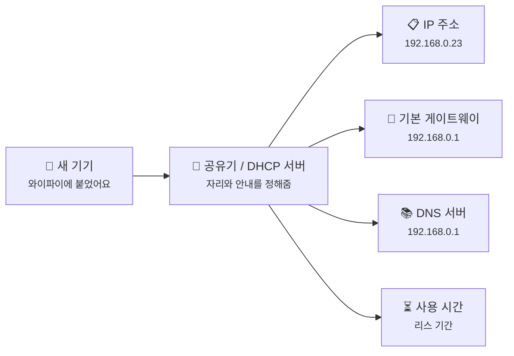
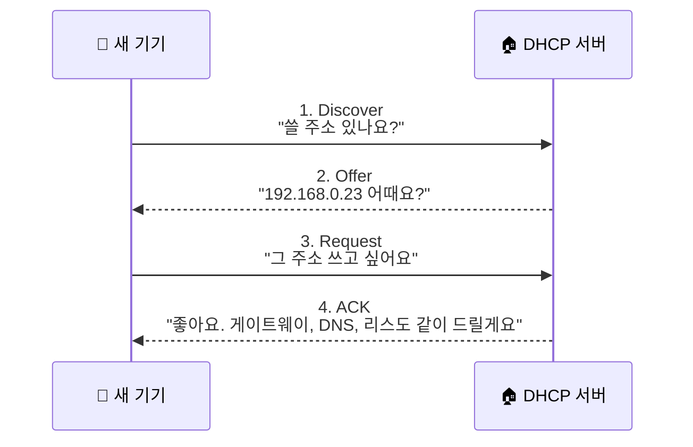
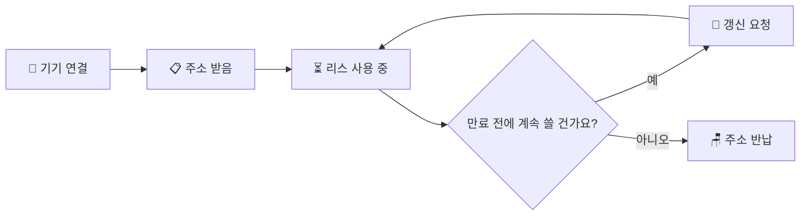

# DHCP, 우리 집 기기들은 자기 주소를 어떻게 자동으로 받을까요?

> *"와이파이만 누르면 바로 인터넷이 되잖아요."* **사실은 그 전에, 누가 네 자리와 출구를 먼저 정해주고 있어요.**

[방화벽과 상태 기반 필터링](15-firewall-and-stateful-filtering.md){ data-preview }에서는 공유기가 들어오는 패킷을 무조건 다 받는 게 아니라,
**이게 정말 정당한 연결인지**를 보고 걸러낸다는 걸 봤어요.

근데 여기서 자연스럽게 이런 질문이 생기죠.

> *"좋아요, 누가 들어와도 되는지는 알겠어요. 근데 그 전에 내 노트북은 자기 주소를 어떻게 아는 거예요?"*

맞아요. 집 와이파이에 새 기기를 붙일 때 우리가 매번 `192.168.0.23` 같은 숫자를 손으로 적지는 않잖아요.
오늘은 그 일을 조용히 대신해주는 **DHCP** 이야기를 해볼게요.

즉, [공유기와 홈 네트워크](13-router-and-home-network.md#dhcp-basics){ data-preview }에서 짧게 본 **"기본 설정을 나눠주는 역할"**을,
이번엔 실제 동작 순서까지 한 단계 더 열어보는 편이에요.

> 여기서는 집 와이파이에서 가장 흔한 **IPv4 기준의 DHCP** 큰 그림을 볼게요. 회사 네트워크의 DHCP 릴레이나 IPv6 쪽 이야기는 뒤에서 필요할 때 다시 열어봐도 충분해요.

---

## 일단 비유로 시작해볼게요

호텔에 체크인하는 장면을 떠올려볼까요?

- 손님은 프런트에 가서 **"방 하나 주세요"** 하고 말해요.
- 프런트는 빈 방을 보고 **방 번호**를 하나 내줘요.
- 그리고 끝이 아니에요.
  **"엘리베이터는 저쪽이에요, 조식은 2층이에요, 이 방은 내일까지 쓰시면 돼요"** 같은 안내도 같이 주죠.

DHCP도 비슷해요.
기기에게 숫자 하나만 툭 던지는 게 아니라,
**"너는 이 주소를 쓰고, 바깥으로 나갈 땐 여기로 가고, 이름을 물어볼 땐 여기 물어봐"** 하고 한꺼번에 알려줘요.

| 부분 | 비유에서는 | 실제로는 |
|------|----------|----------|
| **프런트 데스크** | 손님을 받고 방을 배정하는 곳 | **DHCP 서버** |
| **손님** | 새로 체크인하는 사람 | **새로 연결된 기기** |
| **방 번호** | 오늘 묵을 방 | **IP 주소** |
| **엘리베이터 안내** | 밖으로 나갈 때 쓰는 길 | **기본 게이트웨이** |
| **안내 책자** | 필요한 곳을 물어볼 정보 | **DNS 서버 정보** |
| **숙박 기간** | 언제까지 이 방을 쓰는지 | **리스(Lease) 시간** |

이 그림에서 핵심은,
**DHCP가 주소 하나만 주는 서비스가 아니라 네트워크 기본 설정 묶음을 건네는 역할**이라는 점이에요.

---

## DHCP는 실제로 뭘 나눠주는 걸까요?

[공유기와 홈 네트워크](13-router-and-home-network.md#dhcp-basics){ data-preview }에서도 잠깐 봤지만,
여기서는 한 번 더 또렷하게 묶어볼게요.

| 항목 | 예시 값 | 왜 필요한가요? |
|------|--------|----------------|
| **IP 주소** | `192.168.0.23` | 이 기기의 집 안 주소예요 |
| **서브넷 정보** | `255.255.255.0` | 어디까지가 같은 집 안인지 알려줘요 |
| **기본 게이트웨이** | `192.168.0.1` | 집 밖으로 나갈 때 먼저 갈 출구예요 |
| **DNS 서버** | `192.168.0.1` 또는 `8.8.8.8` | 이름을 주소로 물어볼 곳이에요 |
| **리스 시간** | 예: 24시간 | 이 설정을 얼마나 믿고 써도 되는지예요 |

여기서 헷갈리기 쉬운 포인트가 하나 있어요.

> **DHCP = IP만 주는 기능** 같죠? **사실은 아니에요.**

IP 주소만 있어서는 인터넷이 바로 되지 않아요.
어디까지가 우리 집 안인지도 알아야 하고,
집 밖으로 갈 때 누구에게 먼저 가야 하는지도 알아야 하고,
`example.com` 같은 이름을 누구에게 물어볼지도 알아야 하거든요.

그래서 DHCP는 **네트워크 입문 세트**를 한 번에 나눠준다고 보면 이해가 쉬워요.

---

## 그럼 기기는 이걸 어떤 순서로 받을까요?

이제 비유를 잠깐 접고,
실제 흐름으로 들어가볼게요.

DHCP의 대표적인 기본 흐름은 보통 **DORA**라고 불러요.

- **Discover**: "저 왔어요! 주소 좀 주세요"
- **Offer**: "이 주소 어때요?"
- **Request**: "좋아요, 그 주소 쓸게요"
- **ACK**: "오케이, 그럼 이 설정으로 쓰세요"

복잡해 보이죠?
근데 대화로 바꾸면 의외로 단순해요.

1. 기기가 네트워크에 처음 붙어요.
2. 아직 자기 주소를 모르니까 **일단 도움을 요청**해요.
3. DHCP 서버가 **쓸 수 있는 후보 주소**를 내밀어요.
4. 기기가 그걸 쓰겠다고 고르고,
5. 서버가 최종 확인하면서 다른 설정도 같이 줘요.

짠, 이제야 비로소 **"인터넷을 할 준비"**가 되는 거예요.

---

## 근데 왜 굳이 이런 자동 배정이 필요할까요?

여기서 이런 생각이 들 수 있어요.

> *"그냥 집마다 기기 주소를 손으로 적어두면 되는 거 아닌가요?"*

한두 대만 있으면 가능해 보이죠.
근데 실제 집 안에는 노트북, 스마트폰, TV, 태블릿, 게임기, 프린터, NAS까지 잔뜩 있잖아요.

### 1. 매번 손으로 적으면 너무 귀찮아요

새 기기를 붙일 때마다 IP, 서브넷, 게이트웨이, DNS를 직접 넣는다고 상상해볼까요?
벌써부터 피곤하죠.

### 2. 주소가 겹치면 바로 문제가 생겨요

두 기기가 같은 `192.168.0.23`을 동시에 쓰면,
누가 누구인지 헷갈리기 시작해요.
자동 배정은 이런 충돌을 줄이는 데도 도움이 돼요.

### 3. 잠깐 쓰고 떠나는 기기가 많아요

친구가 집에 놀러 와서 와이파이를 붙였다가,
몇 시간 뒤 나갈 수도 있잖아요.
이런 기기까지 영구 주소로 관리하면 오히려 더 번거로워져요.

즉, DHCP는 단순히 편의 기능이 아니라,
**많은 기기가 들락날락하는 네트워크를 굴러가게 만드는 기본 운영 방식**에 가까워요.

---

## 잠깐! 왜 '내 주소'인데 계속 바뀔 수 있을까요? { #lease }

DHCP에서 중요한 단어가 하나 더 있어요.
바로 **리스(Lease)**예요.

이건 쉽게 말하면 **완전한 소유가 아니라 임대**라는 뜻이에요.

- 오늘은 `192.168.0.23`을 쓸 수 있지만,
- 나중에도 무조건 그 숫자를 영원히 보장받는 건 아니에요.
- 일정 시간이 지나면 계속 쓸지 다시 확인할 수 있어요.

이 감각이 왜 중요하냐면요.
집 공유기에서 가끔 기기 주소가 바뀌는 이유를 이해하게 해주거든요.

예를 들어:

- 어제는 NAS가 `192.168.0.50`이었는데
- 오늘은 `192.168.0.88`이 됐다면

그건 DHCP가 **다른 빈 자리**를 다시 배정했을 수 있다는 뜻이에요.

그래서 [포트 포워딩과 들어오는 연결](14-port-forwarding-and-incoming-connections.md){ data-preview }에서 봤듯이,
밖에서 들어오는 규칙을 특정 기기에 묶어야 할 때는 **DHCP 예약**이나 고정 주소 설정이 중요해져요.

---

## 그럼 진짜 공유기 화면에서는 어떻게 보일까요?

공유기 관리자 페이지를 열어보면,
대충 이런 식의 정보가 숨어 있을 때가 많아요.

  

    <strong>DHCP 임대 목록 예시</strong>
  

  

    

      <strong>기기 이름</strong>
      <code>Jisoo-MacBook</code>
    

    

      <strong>할당 주소</strong>
      <code>192.168.0.23</code>
    

    

      <strong>기본 게이트웨이</strong>
      <code>192.168.0.1</code>
    

    

      <strong>DNS 서버</strong>
      <code>192.168.0.1</code>
    

    

      <strong>남은 시간</strong>
      <code>11h 42m</code>
    

  

이런 화면을 보면 이제 조금 다르게 읽혀요.

- **할당 주소** = 이 기기의 현재 자리
- **기본 게이트웨이** = 바깥으로 나갈 첫 문
- **DNS 서버** = 이름을 물어볼 창구
- **남은 시간** = 이 자리를 얼마나 더 쓸 수 있는지

그러니까 DHCP는 단순한 숫자 배정기가 아니라,
**집 안 네트워크의 입장권과 안내문을 같이 나눠주는 접수 데스크**인 셈이죠.

!!! note "DHCP가 항상 공유기 안에만 있는 건 아니에요"
    집에서는 보통 공유기가 DHCP 서버 역할까지 같이 하지만,
    꼭 그래야만 하는 건 아니에요.
    지금은 **"집에서는 대개 공유기가 그 역할을 겸한다"** 정도로 보면 충분해요.

---

## 근데 주소를 못 받으면 무슨 일이 벌어질까요?

이제 반대로 생각해볼까요?
만약 DHCP가 제대로 동작하지 않으면,
기기는 네트워크에 붙어도 **뭘 믿고 어디로 가야 할지** 모르게 돼요.

### 1. 와이파이는 잡히는데 인터넷은 안 될 수 있어요

[공유기와 홈 네트워크](13-router-and-home-network.md){ data-preview }에서 봤던 것처럼,
와이파이는 그냥 **무선으로 집 안 네트워크에 붙는 방법**일 뿐이었죠.
주소를 못 받으면 붙어는 있어도 실제로 바깥과 대화하기 어려워져요.

### 2. `169.254.x.x` 같은 주소가 보일 수 있어요

운영체제는 가끔 DHCP에게 주소를 못 받으면,
**일단 같은 동네 안에서만 어떻게든 써보자**는 식의 임시 주소를 잡기도 해요.
이럴 때 자주 보이는 게 `169.254.x.x` 대역이에요.

이 숫자가 보이면 보통은,
**"DHCP랑 정상적으로 대화하지 못했나 보다"** 하고 의심해볼 만해요.

### 3. 포트 포워딩도 꼬일 수 있어요

기기의 주소가 안정적으로 유지되지 않으면,
공유기가 예전에 기억하던 규칙이 엉뚱한 자리로 갈 수 있어요.
그래서 NAS, 프린터, 게임 서버처럼 **항상 같은 주소가 중요한 기기**는 예약을 걸어두는 일이 많아요.

---

## DHCP는 NAT랑 DNS와 뭐가 다를까요?

이쯤 되면 비슷비슷하게 느껴질 수 있어요.
근데 하는 일은 꽤 또렷하게 달라요.

- [공인 IP, 사설 IP, 그리고 NAT](11-public-private-ip-and-nat.md#nat-how-it-works){ data-preview }의 **NAT**는 집 안 주소와 바깥 주소를 이어주는 기술이에요.
- [DNS는 어떻게 이름을 IP 주소로 바꿀까요?](04-dns.md#dns-role){ data-preview }의 **DNS**는 이름을 숫자 주소로 바꿔줘요.
- DHCP는 **그 주소와 기본 설정을 처음 나눠주는 기술**이에요.

그러니까 순서를 느슨하게 그려보면 이런 느낌이죠.

1. **DHCP**: "너는 이 주소 쓰고, 밖으로 나갈 땐 여기로 가"
2. **DNS**: "`example.com`은 이 숫자 주소야"
3. **NAT**: "집 밖으로 나갈 땐 내가 바깥 주소로 바꿔줄게"

여기서 한 가지는 살짝만 표지판처럼 짚고 넘어갈게요.
기기가 **같은 집 안의 특정 장비를 실제로 어떻게 찾아가는지**는 다음 글에서 볼 **ARP와 로컬 전달** 쪽에 더 가까워요.
이번 글에서는 일단 **"주소와 기본 설정을 받는 단계"**까지만 잡아두면 충분해요.

---

## 자, 정리해볼까요?

!!! abstract "오늘 우리가 배운 것"
    - **DHCP**는 기기가 네트워크에 붙을 때 **IP 주소만이 아니라 기본 설정 묶음**을 자동으로 나눠주는 기술이에요.
    - 보통 집에서는 **IP 주소, 서브넷 정보, 기본 게이트웨이, DNS 서버, 리스 시간** 같은 걸 함께 받아요.
    - 대표적인 기본 흐름은 **Discover → Offer → Request → ACK** 순서로 이해하면 돼요.
    - DHCP의 주소는 보통 **임대(Lease)** 개념이라, 계속 같은 주소를 영원히 보장하는 건 아니에요.
    - 포트 포워딩이나 NAS처럼 **항상 같은 사설 IP가 중요한 기기**는 DHCP 예약이 특히 중요해요.

이제 와이파이에 새 기기가 붙자마자,
보이지 않는 곳에서 누가 자리표와 안내문을 쥐여주고 있다는 느낌이 좀 오죠?

근데 여기서 또 한 가지 궁금해져요.
좋아요, 주소는 받았어요.
그럼 이제 같은 집 안의 다른 장비를 찾아갈 때는,
그 **IP 주소를 실제 랜선이나 와이파이 수준의 목적지**로는 어떻게 바꾸는 걸까요?

---

## 다음 글 예고

주소를 받았다고 해서, 바로 같은 집 안 기기를 찾아갈 수 있는 건 아니에요.

> *"`192.168.0.50`이라는 숫자는 알겠는데, 그걸 실제로 누구한테 보내야 하는지는 또 어떻게 알아요?"*

다음 글에서는 **[ARP와 로컬 전달](17-arp-and-local-delivery.md){ data-preview }** 이야기를 통해,
같은 집 안 네트워크에서 패킷이 마지막 한 걸음을 어떻게 찾아가는지 같이 열어볼게요.
