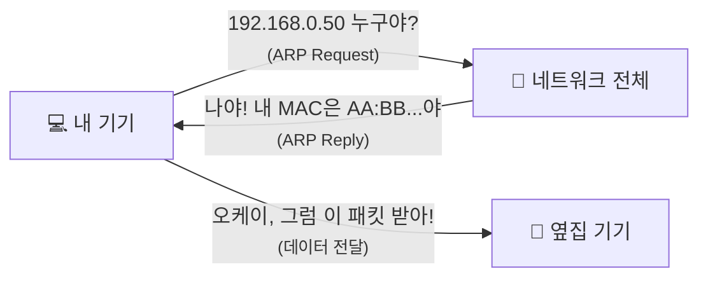
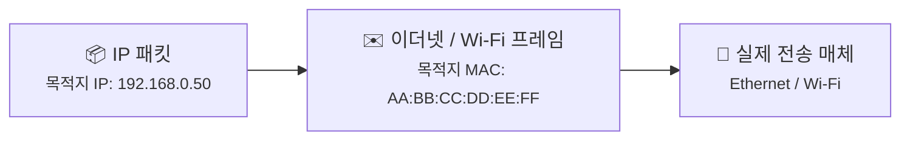
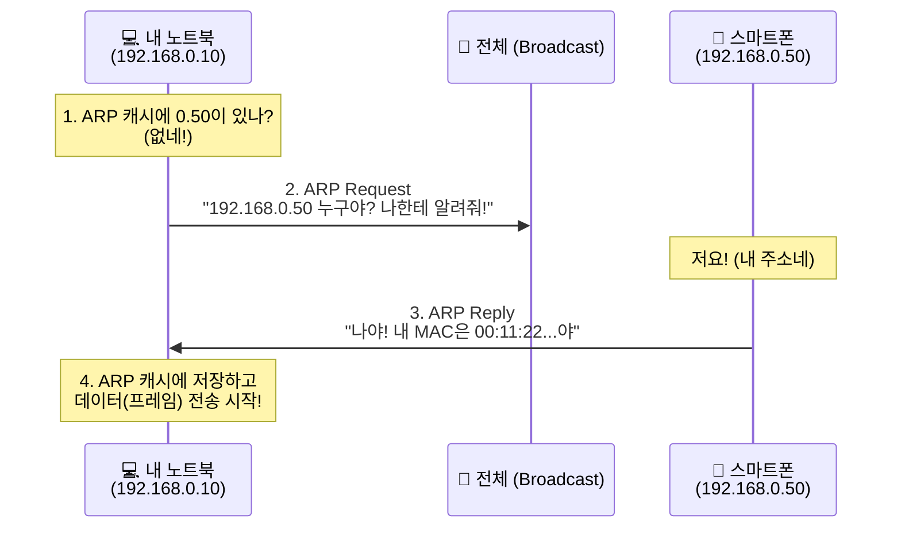
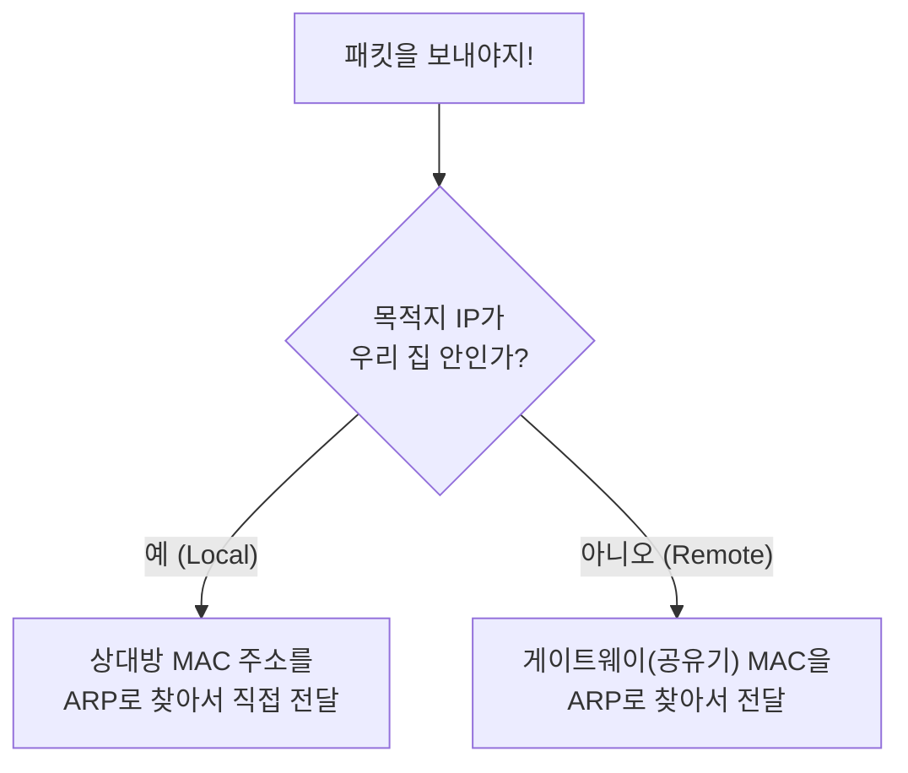

# ARP와 로컬 전달, 주소는 알겠는데 진짜 목적지는 어떻게 찾을까요?

> *"IP 주소는 아는데, 그게 지금 내 옆에 있는 노트북인지 어떻게 알죠?"* **사실은 숫자를 부르기 전에, 진짜 '이름표'를 먼저 확인해야 해요.**

[DHCP](16-dhcp.md){ data-preview }에서 우리 기기가 네트워크에 붙자마자 자기 IP 주소와 게이트웨이 정보를 어떻게 자동으로 받는지 봤어요.
이제 우리는 `192.168.0.23`이라는 내 주소도 알고, 밖으로 나갈 출구인 `192.168.0.1`이 누군지도 알게 됐죠.

근데 여기서 한 가지 현실적인 문제가 생겨요.

> *"IP 주소는 가상의 숫자일 뿐인데, 랜선이나 와이파이 신호가 그 숫자를 보고 정확히 그 기기를 찾아갈 수 있나요?"*

상상해보세요. 복도에서 "101호 사시는 분!" 하고 불러도, 정작 그 사람의 얼굴이나 실제 위치를 모르면 물건을 직접 건네주기 어렵잖아요.
네트워크에서도 마찬가지예요. IP라는 '가상 주소'를 **MAC 주소**라는 '진짜 하드웨어 이름표'로 바꾸는 과정이 필요하거든요.

오늘은 그 일을 담당하는 **ARP**와, 패킷이 우리 집 안에서 마지막 한 걸음을 내딛는 **로컬 전달** 이야기를 해볼게요.

> 여기서는 집 안(동일 네트워크)에서 일어나는 가장 흔한 IPv4 ARP와 로컬 전달의 큰 그림만 볼게요. 집 밖으로 나갈 때 게이트웨이가 어떻게 움직이는지, 그 깊은 '첫 번째 도약(First-hop)' 이야기는 다음 글에서 본격적으로 다뤄볼게요.

---

## 일단 비유로 시작해볼게요

아파트 단지 안에서 옆집에 택배를 직접 전해준다고 생각해볼까요?

- 우리는 **"102호에 전해줘야지"** 라는 목적지(IP 주소)를 알고 있어요.
- 하지만 복도에 나가서 102호를 부른다고 해서 바로 전해지는 건 아니에요.
- **"102호 사시는 분, 성함이 어떻게 되세요?"** 하고 물어봐서, 상대방의 진짜 이름(MAC 주소)을 확인해야 하죠.
- 상대방이 **"제가 홍길동(MAC)입니다"** 라고 대답하면, 그때서야 물건을 그 사람 손에 직접 쥐여줄 수 있어요.

이때 "102호 누구세요?" 하고 묻는 과정이 바로 **ARP**예요.

| 부분 | 비유에서는 | 실제로는 |
|------|----------|----------|
| **102호** | 가상의 목적지 번호 | **IP 주소** |
| **홍길동** | 그 사람의 고유한 신원 | **MAC 주소** |
| **"102호 누구세요?"** | 전체에게 물어보기 | **ARP Request (브로드캐스트)** |
| **"제가 홍길동입니다"** | 당사자의 대답 | **ARP Reply (유니캐스트)** |
| **복도 메모판** | 이름과 호수를 적어둔 명단 | **ARP 캐시 (ARP Table)** |

이 그림에서 핵심은 간단해요.
**주소(IP)는 이미 알고 있어도, 실제로 손에 쥐여줄 상대(MAC)는 한 번 더 확인해야 한다**는 거예요.

---

## 왜 IP 주소만으로는 안 될까요? { #ip-vs-mac }

[OSI 7계층과 TCP/IP 모델](08-osi-and-tcp-ip-layers.md){ data-preview }에서 봤듯이, 네트워크는 여러 층으로 나뉘어 있어요.

IP 주소는 **3계층(네트워크 계층)**의 주소예요. 전 세계 어디든 찾아가기 위한 가상의 주소 체계죠.
반면, 실제로 전기 신호나 무선 신호를 쏘는 **2계층(데이터 링크 계층)**에서는 기기의 진짜 식별자인 **MAC 주소**가 필요해요.

> **IP = "어디 사세요?"** (주소)
> **MAC = "당신 누구예요?"** (이름표)

우리가 패킷을 보낼 때, IP라는 상자(패킷)를 만들면 이걸 다시 MAC이라는 봉투(프레임)에 담아서 던져야 해요.
봉투 겉면에 "이 MAC 주소를 가진 기기에게 전해줘"라고 써야 하는 거죠.

즉, [IP 주소와 라우팅](02-ip-and-routing.md#routing-basics){ data-preview }에서 본 **"어디로 갈지"** 와,
[OSI 7계층과 TCP/IP 모델](08-osi-and-tcp-ip-layers.md){ data-preview }에서 본 **"지금 바로 누구에게 건넬지"** 는 같은 문제가 아니에요.

---

## ARP는 어떤 순서로 동작할까요? { #arp-sequence }

이제 실제 대화 순서를 조금 더 자세히 들여다볼게요. 이 과정을 **ARP(Address Resolution Protocol)**라고 불러요.

1. **캐시 확인**: 내 컴퓨터가 먼저 **"내가 이미 이 IP의 MAC 주소를 알고 있나?"** 하고 메모판(ARP 캐시)을 봐요.
2. **질문 던지기 (Request)**: 모른다면, 네트워크 전체에 소리쳐요. **"여기 192.168.0.50 쓰시는 분? MAC 주소 좀 알려주세요!"**
3. **답변 받기 (Reply)**: 해당 IP를 쓰는 기기만 대답해요. **"저예요! 제 MAC 주소는 00:11:22... 예요."**
4. **기록하고 보내기**: 이제 상대방의 MAC 주소를 알았으니, 메모판에 적어두고(캐시 업데이트) 패킷을 보내요.

여기서 재미있는 점은 질문(Request)은 **모두에게(Broadcast)** 던지지만, 답변(Reply)은 질문한 사람에게만 **조용히(Unicast)** 전달한다는 점이에요.
즉, ARP는 인터넷 전체를 뒤지는 기술이 아니라, **지금 붙어 있는 같은 링크 안에서만 잠깐 크게 묻는 방식**이라고 보면 돼요.

---

## 같은 동네인가, 아니면 먼 동네인가? { #same-subnet-vs-gateway }

패킷을 보낼 때 기기는 아주 중요한 결정을 하나 내려야 해요.

> *"이 목적지가 우리 집 안(로컬)에 있는 친구인가? 아니면 집 밖(외부)으로 나가야 하는 친구인가?"*

이걸 결정하는 기준이 바로 [DHCP](16-dhcp.md){ data-preview }에서 받았던 **서브넷 마스크**예요.

- **우리 집 안이면?**: 직접 상대방의 MAC 주소를 물어봐서 던져요. (로컬 전달)
- **집 밖이면?**: 상대방에게 직접 묻지 않아요. 대신 **"기본 게이트웨이(공유기)"**의 MAC 주소를 물어본 뒤, 공유기한테 패킷을 맡겨요.

이 결정 덕분에 우리는 지구 반대편 서버의 MAC 주소를 몰라도 인터넷을 할 수 있는 거예요. 공유기라는 '대리인'에게만 전해주면 되니까요.
이 장면은 [공유기와 홈 네트워크](13-router-and-home-network.md#home-packet-flow){ data-preview }에서 봤던 흐름이,
이번에는 **"공유기까지 어떻게 첫 전달을 하느냐"** 수준으로 한 단계 더 내려온 거예요.

---

## 근데 왜 굳이 이런 과정이 필요할까요?

여기서 이런 생각이 들 수 있어요.

> *"그냥 IP 주소만 알면 보내면 되는 거 아닌가요? 왜 굳이 MAC 주소를 또 찾아요?"*

겉으로 보면 한 번 더 돌아가는 것 같죠?
근데요, **IP와 MAC은 해결하는 문제가 애초에 달라요.**

### 1. IP는 큰 지도고, MAC은 마지막 한 걸음이에요

IP 주소는 "최종 목적지가 어디냐"를 알려줘요.
하지만 랜선이나 와이파이는 그 순간 **바로 다음에 누구한테 건네야 하는지**를 알아야 하거든요.

즉, IP는 먼 목적지까지 보는 지도고,
MAC은 지금 내 옆 복도에서 누구 손에 쥐여줄지를 정하는 이름표에 가까워요.

### 2. 같은 집 안인지 아닌지 먼저 갈라야 해요

같은 `192.168.0.x` 대역 안에 있는 기기라면 직접 찾으면 되지만,
바깥 서버라면 그 서버의 MAC을 알 방법도 없고 알 필요도 없어요.
그럴 때는 [공유기와 홈 네트워크](13-router-and-home-network.md#router-jobs){ data-preview }에서 봤던 것처럼,
기본 게이트웨이에게 먼저 맡기는 편이 훨씬 자연스럽죠.

### 3. 그래서 DHCP가 IP만 준 게 아니었던 거예요

[DHCP](16-dhcp.md){ data-preview } 글에서 공유기가 **IP 주소, 서브넷, 기본 게이트웨이**를 같이 준 이유도 여기서 다시 이어져요.

- **IP 주소**: 나는 누구인가
- **서브넷 정보**: 어디까지가 같은 집 안인가
- **기본 게이트웨이**: 집 밖이면 누구에게 먼저 맡길까

그러니까 ARP는 갑자기 툭 튀어나온 별개의 기술이 아니라,
**DHCP가 나눠준 네트워크 기본 설정이 실제 전달로 이어지는 마지막 연결 고리**인 셈이에요.

---

## 잠깐! 매번 물어보면 너무 비효율적이지 않나요? { #arp-cache }

맞아요. 패킷 하나 보낼 때마다 "누구세요?" 하고 물어보면 네트워크가 너무 시끄럽겠죠.
그래서 모든 기기는 **ARP 캐시**라는 임시 메모판을 가지고 있어요.

한 번 물어봐서 알아낸 정보는 보통 몇 분 동안 저장해둬요.

- **장점**: 다음 패킷을 보낼 때 질문 없이 바로 보낼 수 있어서 빨라요.
- **특징**: 시간이 지나면 자동으로 지워져요. 기기가 네트워크를 나갔거나 주소가 바뀌었을 수도 있으니까요.

---

## 그럼 진짜 내 컴퓨터에서는 어떻게 보일까요?

명령어 한 줄이면 내 컴퓨터가 지금 누구누구와 대화하고 있는지, 그들의 '진짜 이름표'를 엿볼 수 있어요.
[패킷 캡처](12-packet-capture.md#capture-location-matters){ data-preview }에서 봤던 것처럼, 위치에 따라 보이는 정보는 달라질 수 있지만,
ARP 테이블은 **내 기기 기준으로 지금 누구의 MAC을 알고 있는지**를 읽는 가장 쉬운 출발점이에요.

> 운영체제마다 명령어나 출력 모양은 조금씩 달라질 수 있어요. 여기서는 **"이런 식으로 보이는구나"** 하는 감각만 먼저 잡아두면 충분해요.

  

    <strong>ARP 테이블 확인 예시 (arp -a)</strong>
  

  

    
? (192.168.0.1) at 00:31:92:ef:2a:01 [ether] on en0 (게이트웨이)

    
? (192.168.0.50) at 1c:fe:2b:88:d1:42 [ether] on en0 (내 스마트폰)

    
? (192.168.0.102) at f4:d4:88:5c:23:a5 [ether] on en0 (내 NAS)

  

이 목록을 보면 이제 이렇게 해석할 수 있어요.

- **192.168.0.1**: "아, 우리 집 공유기(게이트웨이)의 실제 하드웨어 주소는 저거구나."
- **192.168.0.50**: "옆에 있는 스마트폰이랑 대화하려고 방금 물어봐서 알아냈구나."

그러니까 이 표는 단순한 숫자 목록이 아니라,
**내 컴퓨터가 지금 로컬 네트워크에서 누구를 어떻게 찾아갈 준비가 되어 있는지**를 보여주는 메모판이에요.

---

## 자, 정리해볼까요?

!!! abstract "오늘 우리가 배운 것"
    - **MAC 주소**는 기기의 진짜 하드웨어 이름표고, **IP 주소**는 네트워크상의 가상 주소예요.
    - **ARP**는 "이 IP 주소를 쓰는 사람의 MAC 주소가 뭐예요?"라고 물어보고 알아내는 과정이에요.
    - 패킷을 보낼 때, 목적지가 **같은 네트워크 안**이면 상대방에게 직접 ARP를 던져요.
    - 목적지가 **외부 네트워크**면, 상대방 대신 **기본 게이트웨이(공유기)**의 MAC 주소를 찾아서 패킷을 맡겨요.
    - 알아낸 정보는 **ARP 캐시**에 잠시 저장해서 다음 대화 때 재사용해요.

이제 주소(IP)를 넘어, 실제로 패킷이 누구의 손(MAC)에 쥐여지는지 그 마지막 한 걸음이 그려지시나요?

그런데 여기서 한 가지 더 궁금한 점이 생겨요.
집 밖으로 나갈 때 패킷을 공유기(게이트웨이)한테 맡긴다고 했잖아요?
그럼 그 공유기는 대체 어떤 원리로 패킷을 받아서 바깥세상으로 툭 던져주는 걸까요?

---

## 다음 글 예고

우리가 외부 사이트에 접속할 때, 모든 패킷은 일단 우리 집 문지기인 공유기를 거쳐 가요.

> *"게이트웨이는 단순히 패킷을 넘겨주는 걸까요, 아니면 그 안에서 또 다른 마법이 일어나는 걸까요?"*

다음 글에서는 **"기본 게이트웨이와 첫 번째 도약(First-hop)"** 이야기를 통해, 우리 집 패킷이 드넓은 인터넷 바다로 나가는 그 첫 번째 순간을 더 깊게 들여다볼게요.
