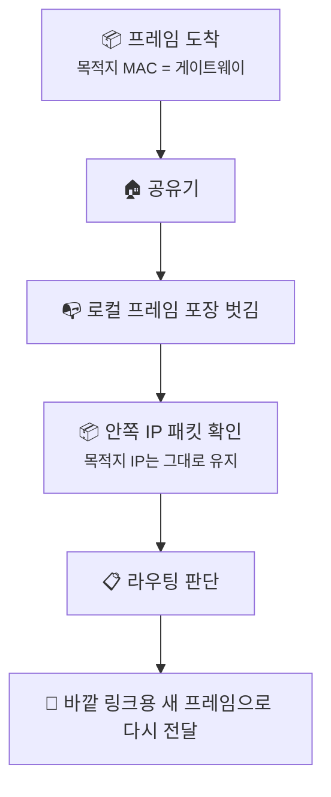
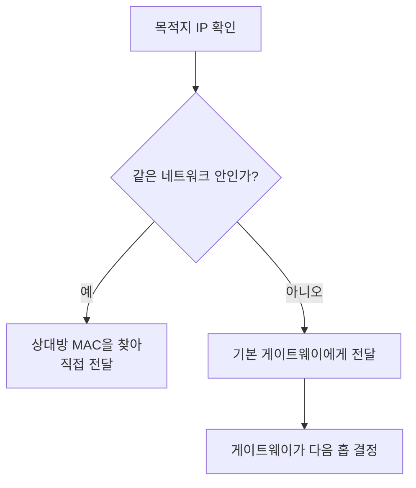
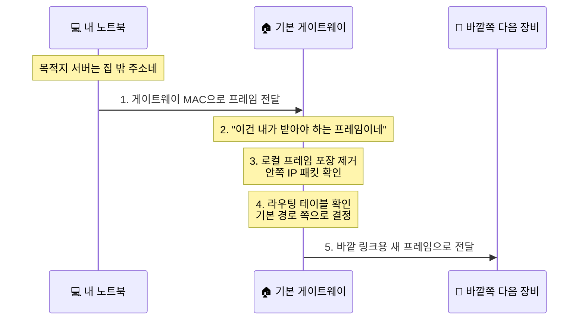

# 기본 게이트웨이와 첫 번째 도약, 패킷이 집을 나서는 순간엔 무슨 일이 벌어질까요?

> *"집 밖으로 나가는 첫 발걸음은 생각보다 단순할 것 같죠?"* **사실은 바로 그 첫 걸음에서, 로컬 전달이 라우팅으로 바뀌어요.**

[ARP와 로컬 전달](17-arp-and-local-delivery.md){ data-preview }에서는 같은 네트워크 안이면 상대방의 MAC 주소를 찾고,
집 밖이면 **기본 게이트웨이(공유기)**의 MAC 주소를 찾아 그쪽으로 패킷을 맡긴다는 데까지 왔어요.

근데 여기서 딱 한 장면이 아직 비어 있죠.

> *"좋아요. 이제 패킷을 공유기 손에 쥐여줬어요. 근데 그다음엔요? 공유기는 그걸 그냥 바깥으로 휙 던지는 건가요?"*

바로 그 순간을 여는 글이 이번 글이에요.
[IP 주소와 라우팅](02-ip-and-routing.md#routing-basics){ data-preview }에서 라우터는 **다음 한 칸만 안다**고 했고,
[공유기와 홈 네트워크](13-router-and-home-network.md#router-jobs){ data-preview }에서는 공유기가 집 밖으로 나가는 기본 출구라고 했죠.
이번에는 그 큰 그림을, **우리 집 패킷이 실제로 첫 번째 홉을 밟는 장면**으로 한 단계 더 내려와서 볼게요.

> 여기서는 집 안 링크를 벗어나 **첫 번째 바깥 경로로 갈아타는 큰 그림**에 집중할게요. 공유기가 이 패킷을 어떤 기준으로 바깥 경로에 태우는지에 초점을 두고, NAT가 이어지는 더 자세한 장면이나 통신사 망에서 여러 홉이 어떻게 보이는지는 이번 글에서 필요한 만큼만 짚고, 더 깊은 확인 도구는 다음 글에서 같이 열어볼게요.

---

## 일단 비유로 시작해볼게요

이번에는 아파트 단지 문 앞 장면을 떠올려볼까요?

- 나는 택배를 **다른 도시**에 있는 친구에게 보내고 싶어요.
- [ARP와 로컬 전달](17-arp-and-local-delivery.md){ data-preview }까지는 **경비실 아저씨(게이트웨이)**가 누구인지 알아내고, 그분 손에 택배를 건네는 데까지 왔어요.
- 그런데 경비실 아저씨가 택배를 받았다고 해서, 그 상자를 그대로 고속도로에 던질 수는 없잖아요.
- 먼저 **이게 단지 밖으로 나가야 하는 택배가 맞는지** 보고,
- 그다음 **어느 외부 집하장으로 보내야 할지** 정해서 다시 붙여 보내야 하죠.

이게 바로 **첫 번째 도약(First-hop)**이에요.
내 기기 입장에서는 공유기까지가 첫 번째 큰 전달이고,
공유기 입장에서는 이제 또 **자기 다음 칸**으로 넘길 차례가 되는 거예요.

| 부분 | 비유에서는 | 실제로는 |
|------|----------|----------|
| **경비실 아저씨** | 단지 밖으로 나가는 택배를 받는 사람 | **기본 게이트웨이(Default Gateway)** |
| **단지 안 포장** | 우리 동 안에서만 통하는 전달 방식 | **내 로컬 네트워크의 프레임** |
| **외부 집하장** | 단지 밖 첫 번째 전달 지점 | **게이트웨이가 넘길 다음 홉** |
| **다시 붙이는 운송표** | 바깥 경로용 새 포장 | **새 링크용 프레임** |
| **첫 번째 도약** | 단지 문을 나서는 첫 환승 | **내 기기에서 공유기를 거쳐 바깥 첫 링크로 넘어가는 순간** |

이 그림에서 중요한 건,
**내가 최종 목적지 서버를 바로 붙잡는 게 아니라, 일단 첫 번째 길 안내자에게 맡긴다**는 점이에요.

---

## 게이트웨이는 패킷을 받으면 제일 먼저 뭘 볼까요?

이제 비유를 잠깐 접고,
게이트웨이가 실제로 하는 일을 순서대로 따라가볼게요.

### 1. "이거 나한테 온 거 맞네" 하고 먼저 확인해요

[ARP와 로컬 전달](17-arp-and-local-delivery.md#same-subnet-vs-gateway){ data-preview }에서,
내 기기는 외부 목적지라면 **게이트웨이의 MAC 주소**를 찾아서 그쪽으로 프레임을 보낸다고 했죠.

그러면 공유기는 프레임 바깥쪽에 적힌 목적지 MAC을 보고,
**"오케이, 이건 내가 받아야 하는 프레임이네"** 하고 먼저 확인해요.

여기서 한 가지가 중요해요.

> 공유기가 받는 건 **"최종 목적지 서버용 MAC"** 이 아니라, **"일단 나한테 가져와"** 라고 적힌 프레임이에요.

즉, 내 노트북은 구글 서버의 MAC 주소를 아는 게 아니라,
지금 내 옆에서 바깥 출구를 맡고 있는 **게이트웨이의 MAC 주소**만 알면 충분해요.

### 2. 로컬 프레임 포장을 벗기고, 안쪽 IP 패킷을 꺼내요

공유기는 프레임을 받으면,
우리 집 안 링크에서만 쓰던 바깥 포장을 한 번 벗겨요.

쉽게 말하면:

- **밖 포장**: 로컬 네트워크에서 누구에게 건넬지 적은 프레임 정보
- **안 내용물**: 진짜 목적지인 서버 IP가 적힌 IP 패킷

[ARP와 로컬 전달](17-arp-and-local-delivery.md){ data-preview }에서 봤던 ARP와 MAC 주소는 여기까지예요.
이제부터는 **"같은 링크 안에서 누구에게 건넬까"**가 아니라,
**"이 IP 목적지를 다음엔 어느 방향으로 넘길까"** 문제로 넘어갑니다.

핵심은 이거예요.
**MAC 주소는 홉마다 바뀔 수 있지만, IP 패킷의 큰 목적지는 계속 유지된다**는 점이죠.

### 3. 라우팅 테이블을 보고 "다음엔 어디로 보낼까"를 정해요

여기서 [IP 주소와 라우팅](02-ip-and-routing.md#routing-basics){ data-preview }에서 봤던 감각이 다시 등장해요.
라우터는 전체 길을 다 외우는 게 아니라,
**다음 한 칸만** 정하면 된다고 했잖아요.

공유기도 똑같아요.
안쪽 IP 패킷의 목적지 주소를 보고,
자기 안에 있는 **라우팅 테이블**을 훑어봐요.

- "이 주소는 우리 집 LAN 안인가?"
- "아니네. 그럼 바깥쪽 기본 경로로 보내야겠네."

집 공유기에서는 이게 아주 자주,
**"이거 우리 집 바깥 주소네? 그럼 기본 경로(Default Route) 쪽으로 넘기자"** 가 돼요.

그래서 이름이 **기본 게이트웨이(Default Gateway)**예요.
정말 간단히 말하면,
**"딱 맞는 더 가까운 길을 모르겠으면 일단 여기로 보내"** 라는 기본 출구인 거죠.

---

## 왜 하필 이름이 '기본' 게이트웨이일까요?

여기서 이런 생각이 들 수 있어요.

> *"그냥 게이트웨이면 되지, 왜 굳이 '기본'이라는 말을 붙여요?"*

이유는 생각보다 단순해요.

내 기기가 모든 외부 네트워크의 자세한 경로를 다 아는 건 아니거든요.
대부분의 일반 가정 기기는 대충 이렇게 생각해요.

1. **같은 집 안 주소면** 직접 보내기
2. **그게 아니면** 기본 게이트웨이에게 맡기기

그러니까 "기본"이라는 말은
**모든 걸 다 안다는 뜻이 아니라, 일단 모르는 바깥 길은 여기로 보내는 기본 선택지**라는 뜻에 가까워요.

[DHCP](16-dhcp.md){ data-preview }가 IP 주소와 함께 게이트웨이 정보를 꼭 같이 줬던 이유도 여기서 다시 이어져요.
내 기기가 세상 모든 길을 몰라도,
**첫 번째 출구 하나만 알면 일단 집 밖으로 나갈 수 있기 때문**이에요.

---

## 그럼 '첫 번째 도약'에서는 정확히 뭐가 바뀔까요?

여기서 가장 헷갈리기 쉬운 포인트를 딱 나눠볼게요.

### 1. 최종 목적지는 그대로예요

내가 `198.51.100.80` 같은 바깥 서버로 보내고 있었다면,
그 **목적지 IP 자체는 그대로** 유지돼요.

즉, 공유기가 받았다고 해서 갑자기
"이제 목적지가 공유기예요"가 되는 건 아니에요.
공유기는 **최종 목적지까지 가는 중간 전달자**일 뿐이죠.

### 2. 홉마다 바깥 포장은 새로 바뀔 수 있어요

반대로,
**지금 이 링크에서 누구에게 건넬지**를 적는 바깥쪽 프레임 정보는 바뀔 수 있어요.

- 내 노트북 → 공유기 구간에서는 **게이트웨이 MAC**이 필요했고,
- 공유기 → 그다음 장비 구간에서는 **그 바깥 링크에서 통하는 새 전달 정보**가 필요해요.

이게 바로 [ARP와 로컬 전달](17-arp-and-local-delivery.md){ data-preview }의 **로컬 전달**과 이번 글의 **첫 홉 라우팅**이 맞물리는 지점이에요.

### 3. 홉을 하나 지났다는 흔적도 생겨요

[IP 주소와 라우팅](02-ip-and-routing.md){ data-preview }에서 봤던 `TTL` 기억나세요?
패킷이 라우터를 한 번 지날 때마다,
**"아, 한 홉 썼네"** 하고 값이 하나 줄어요.

이건 아직 크게만 기억해도 충분해요.

> 여기서는 **공유기를 지나며 한 홉이 시작된다**는 감각만 잡아둘게요. 이 `TTL`이 왜 중요하고, 우리가 그걸 `ping`이나 `traceroute` 같은 도구에서 어떻게 느끼게 되는지는 다음 글에서 같이 열어볼게요.

---

## 근데 왜 이 첫 홉이 그렇게 중요할까요?

겉으로 보면 그냥 공유기 하나 지나가는 장면 같죠?
근데요, **집 안 네트워크와 인터넷 전체가 갈라지는 경계**가 바로 여기예요.

### 1. 로컬 전달과 라우팅이 여기서 갈라져요

같은 집 안 기기에게 보낼 때는,
결국 **상대방 MAC 주소를 찾아 직접 건네는 문제**였어요.

하지만 집 밖으로 나가려는 순간부터는,
더는 최종 상대의 MAC을 찾지 않아요.
대신 **첫 번째 라우터에게 맡기고, 그다음부터는 라우터들의 연쇄**가 이어지죠.

### 2. 장애가 날 때도 경계가 여기예요

[공유기와 홈 네트워크](13-router-and-home-network.md){ data-preview }에서 봤던 질문도 여기랑 이어져요.

- 와이파이는 붙는데 인터넷이 안 되는 건지,
- ARP까진 되는데 게이트웨이 이후로 못 나가는 건지,
- 공유기 바깥쪽 경로에서 막히는 건지,

이걸 나눠서 생각하려면 **첫 홉이 어디서 시작되는지**를 알아야 해요.

### 3. "다음 한 칸만 안다"는 말이 현실로 보이기 시작해요

[IP 주소와 라우팅](02-ip-and-routing.md){ data-preview }에서는 이걸 지구 반대편까지 가는 큰 그림으로 봤죠.
이번엔 그 말이 아주 현실적으로 들려요.

- 내 노트북은 **게이트웨이까지** 알면 되고,
- 공유기는 **자기 다음 홉**만 알면 되고,
- 그다음 라우터도 **또 자기 다음 홉**만 알면 돼요.

이렇게 릴레이처럼 이어지니까,
우리는 최종 서버의 MAC 주소도 모르고,
중간 경로 전체도 몰라도 인터넷을 쓸 수 있는 거예요.

---

## 그럼 진짜 패킷은 어떤 순서로 첫 홉을 밟을까요?

이제 집 와이파이에 붙은 노트북이 `example.com`의 서버 주소를 이미 알아낸 뒤,
바깥으로 첫 걸음을 내딛는 장면만 딱 잘라서 볼게요.

이 과정을 보면,
공유기는 단순히 택배를 힘으로 멀리 던지는 장비가 아니에요.
**받고, 열어보고, 판단하고, 다시 싸서 보내는 첫 번째 라우터**에 가깝죠.

!!! note "집마다 바깥쪽 전달 방식은 조금씩 다를 수 있어요"
    어떤 집은 공유기 뒤에 모뎀이나 ONT가 있고,
    어떤 집은 통신사 장비가 한 겹 더 라우터처럼 동작할 수도 있어요.
    여기서는 **"내 기기에서 본 첫 홉은 기본 게이트웨이"** 라는 핵심 흐름만 먼저 잡아두면 충분해요.

---

## 자, 정리해볼까요?

!!! abstract "오늘 우리가 배운 것"
    - **기본 게이트웨이**는 집 밖으로 나가는 패킷을 가장 먼저 맡는 **첫 번째 출구**예요.
    - 내 기기는 외부 목적지의 MAC 주소를 아는 게 아니라, **게이트웨이의 MAC 주소**만 알면 일단 첫 홉을 시작할 수 있어요.
    - 공유기는 프레임을 받으면 **로컬 포장을 벗기고**, 안쪽 **IP 패킷의 목적지**를 본 뒤, **라우팅 테이블**로 다음 홉을 정해요.
    - 그다음에는 바깥 링크에 맞는 **새 프레임으로 다시 싸서** 다음 장비로 넘겨요.
    - 이렇게 해서 [ARP와 로컬 전달](17-arp-and-local-delivery.md){ data-preview }의 **로컬 전달**이 이번 글의 **첫 홉 라우팅**으로 이어지고, 이후엔 여러 라우터가 **다음 한 칸씩** 패킷을 이어받게 돼요.

어때요?
이제 "게이트웨이에게 맡긴다"는 말이,
그냥 막연한 표현이 아니라 **패킷이 집 안 규칙에서 바깥 경로 규칙으로 갈아타는 순간**처럼 느껴지지 않으세요?

근데 여기서 또 이런 궁금증이 생겨요.
패킷이 첫 홉을 밟고 밖으로 나간 뒤,
중간 어딘가에서 길이 막히거나, 너무 멀리 돌아가거나, 아예 도착하지 못하면 그걸 우리는 어떻게 알아챌까요?

---

## 다음 글 예고

패킷은 말없이 사라질 때도 있고,
가끔은 네트워크가 우리에게 "여기서 막혔어요" 하고 힌트를 주기도 해요.

> *"그럼 우리 패킷이 길을 잃었는지, 어디쯤까지 갔는지는 어떻게 확인할 수 있을까요?"*

다음 글에서는 **"ICMP, Ping, 그리고 Traceroute"** 이야기를 통해,
보이지 않는 경로를 우리가 어떻게 두드려 보고, 어디서 응답이 오는지 확인하는지 같이 열어볼게요.
