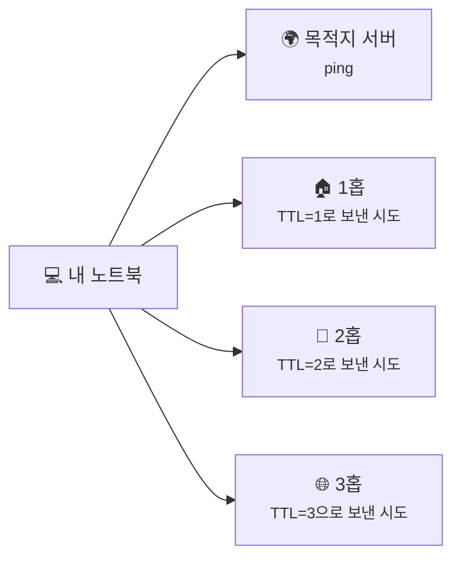
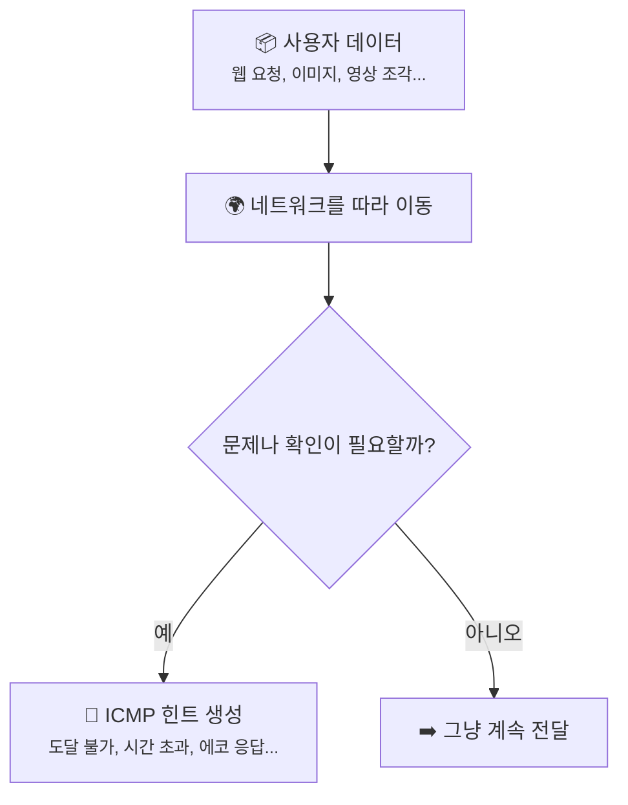
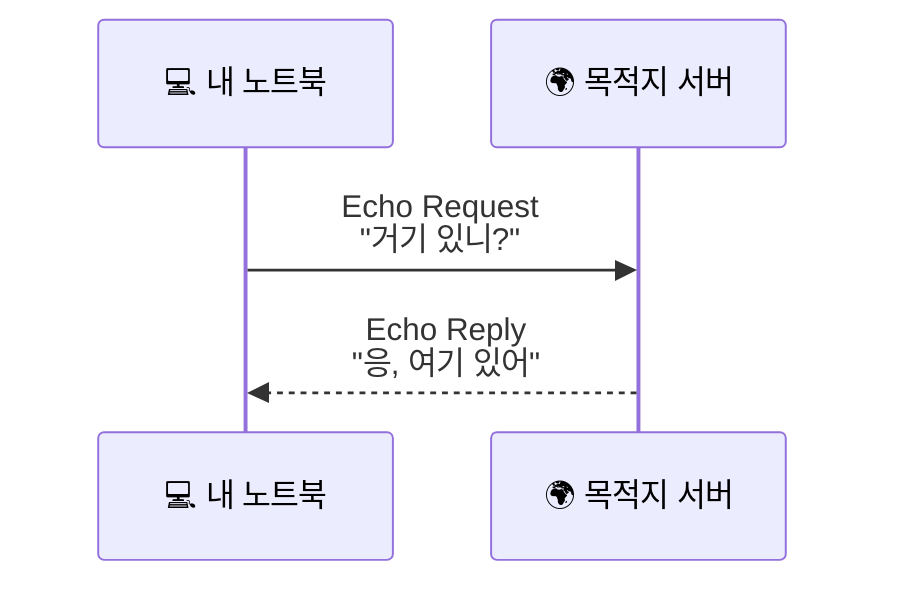
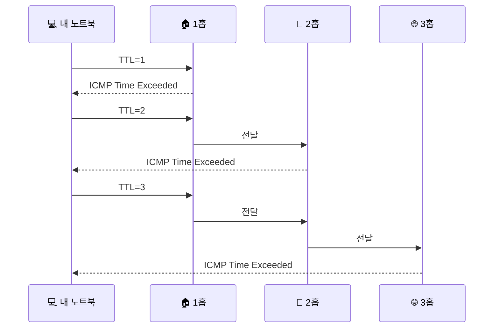

# ICMP, Ping, 그리고 Traceroute, 패킷이 어디까지 갔는지 어떻게 알아낼까요?

> *"패킷은 조용히 사라지기만 할 것 같죠?"* **사실은 가끔, 네트워크가 "여기까지는 왔어요" 하고 힌트를 남겨줘요.**

[기본 게이트웨이와 첫 번째 도약](18-default-gateway-and-first-hop.md){ data-preview }에서,
패킷이 집을 나서 첫 홉으로 넘어가는 장면과 `TTL`이 홉을 지날 때 하나씩 줄어든다는 감각까지 봤어요.

근데 그러면 바로 이런 궁금증이 생기죠.

> *"좋아요. 이제 패킷이 집 밖으로 나갔어요. 근데 그다음엔 어디까지 갔는지, 어디서 막혔는지는 우리가 어떻게 알아요?"*

바로 그 질문에 답해주는 게 오늘 이야기예요.
이번에는 **그 길 위에서 네트워크가 우리에게 어떤 힌트를 돌려주는지**를 볼 차례예요.

> 여기서는 ICMP가 주는 **가장 대표적인 진단 힌트**와, 그걸 이용하는 `ping`, `traceroute`의 큰 그림만 볼게요. 운영체제마다 명령어 모양이나 세부 동작은 조금씩 다를 수 있으니, 이번 글에서는 **"이 도구들이 무엇을 묻고, 어떤 힌트를 돌려받는지"** 에 집중해볼게요.

---

## 일단 비유로 시작해볼게요

이번에는 긴 복도를 지나 여러 문을 거쳐야 하는 택배를 떠올려볼까요?

- 내가 친구 집까지 택배를 보내고 싶어요.
- 그런데 중간에 **경비실**, **엘리베이터 앞 안내 데스크**, **건물 출입문**처럼 여러 체크포인트가 있다고 해볼게요.
- 이때 내가 할 수 있는 질문은 크게 두 가지예요.

첫 번째는 아주 단순해요.

> *"친구야, 거기 있니? 내 소리 들리니?"*

이건 `ping`에 가까워요.
상대가 **"응, 들려"** 하고 돌아오면,
적어도 그 순간에는 **왕복이 됐구나** 를 알 수 있죠.

두 번째는 조금 더 흥미로워요.

> *"이 심부름꾼은 딱 한 칸만 가고 멈추게 해볼게요. 어디서 멈췄는지 알려줘요."*

그다음엔 새 심부름꾼을 보내서 **두 칸만**, 또 하나를 보내서 **세 칸만** 가게 해보는 거예요.
그러면 각 체크포인트가 **"여기까지는 왔어요"** 하고 차례대로 손을 들 수 있겠죠.

이게 `traceroute`가 길을 드러내는 방식과 닮아 있어요.

| 부분 | 비유에서는 | 실제로는 |
|------|----------|----------|
| **"거기 있니?"** | 상대가 살아 있는지 묻는 짧은 확인 | **ICMP Echo Request** *(확인 신호)* |
| **"응, 여기 있어"** | 상대가 되돌려주는 응답 | **ICMP Echo Reply** *(응답 신호)* |
| **한 칸만 가는 심부름꾼** | 정해진 거리까지만 가게 하는 제한 | **TTL(홉 제한)** |
| **"여기서 멈췄어요"** | 중간 체크포인트가 알려주는 힌트 | **ICMP Time Exceeded** *(홉 제한 초과 알림)* |
| **왕복 시간을 재는 초시계** | 갔다가 돌아오는 데 걸린 시간 | **RTT (Round-Trip Time, 왕복 시간)** |

핵심은 이거예요.
`ping`은 **"상대가 응답하느냐"** 를 보고,
`traceroute`는 **TTL을 1, 2, 3으로 늘려 보내면서 중간 어디서 응답이 돌아오느냐** 를 차례대로 보는 도구예요.

---

## ICMP는 정확히 어떤 역할을 할까요?

이름부터 조금 낯설죠.
근데 너무 겁먹을 필요는 없어요.

**ICMP**는 인터넷에서 웹페이지 본문이나 사진 같은 데이터를 실어 나르는 주인공이라기보다,
**네트워크 상태를 알려주는 짧은 안내 메시지**에 더 가까워요.

예를 들면 이런 식이죠.

- **"여기까지는 도착했어요"**
- **"이 길은 못 가요"**
- **"홉 제한을 다 써서 여기서 멈췄어요"**
- **"제가 보낸 확인 신호에 답할게요"**

즉, ICMP는 **실제 사용자 데이터**라기보다,
패킷이 길 위에서 겪은 상황을 네트워크가 짧게 알려주는 방식이라고 보면 돼요.

이 그림에서 중요한 건,
**ICMP가 "주인공 데이터"를 대신하는 게 아니라, 그 옆에서 상태를 알려주는 역할**이라는 점이에요.

---

## ping은 뭘 확인하는 걸까요?

이제 제일 익숙한 도구부터 볼게요.

`ping`은 아주 단순하게 말하면,
**"내 확인 신호가 저기까지 갔다가 다시 돌아오나?"** 를 보는 도구예요.

보통 흐름은 이렇게 생각하면 돼요.

1. 내가 **ICMP Echo Request**를 보내요.
2. 상대가 그걸 받을 수 있으면 **ICMP Echo Reply**를 돌려줘요.
3. 나는 **응답이 왔는지**, 그리고 **왕복 시간이 얼마나 걸렸는지** 를 봐요.

그래서 `ping`을 보면 보통 이런 감각을 잡을 수 있어요.

- **응답이 온다** → 적어도 그 순간에는, 그 대상이 ICMP 확인에 답하고 있어요.
- **왕복 시간이 짧다/길다** → 갔다가 돌아오는 데 걸린 시간이 대략 어느 정도인지 감이 와요.
- **손실이 있다** → 어떤 요청은 돌아오고 어떤 요청은 안 돌아오는구나, 정도를 볼 수 있어요.

근데 여기서 꼭 조심해야 할 게 있어요.

> `ping` 실패는 **"웹사이트가 완전히 죽었다"** 는 뜻이 아니라, **"ICMP 확인 응답을 못 받았다"** 에 더 가까워요.

왜냐하면:

- 방화벽이 ICMP를 막을 수도 있고,
- 중간 장비가 진단용 응답을 일부러 줄일 수도 있고,
- 서비스는 잘 열리는데 `ping`만 안 받을 수도 있거든요.

그러니까 `ping`은 **아주 유용한 첫 질문**이지만,
그 결과 하나만으로 세상을 단정하면 안 돼요.

!!! tip "이렇게 생각하면 쉬워요"
    `ping`은 **"서비스가 완벽히 살아 있나?"** 보다,
    **"지금 이 대상이 내 확인 신호에 응답하나? 응답한다면 왕복이 얼마나 걸리나?"** 를 묻는 도구에 더 가까워요.

---

## traceroute는 왜 중간 길을 보여줄 수 있을까요? { #traceroute-ttl }

여기서부터가 진짜 재미있어요.

[IP 주소와 라우팅](02-ip-and-routing.md){ data-preview }에서 `TTL`은 패킷이 영원히 떠돌지 않게 하는 값이라고 봤죠.
라우터를 하나 지날 때마다,
**"홉 하나 썼네"** 하고 값이 줄어들어요.

`traceroute`는 바로 그 성질을 일부러 이용해요.

### 1. 먼저 TTL을 아주 작게 줘요

예를 들어 `TTL = 1`로 보내면,
패킷은 첫 번째 라우터를 지나려는 순간 거의 바로 한계에 닿아요.

그러면 그 지점의 라우터가 이렇게 말할 수 있어요.

> *"여기까지는 왔는데, 더는 못 가요. 홉 제한을 다 썼어요."*

이때 돌아오는 대표적인 힌트가 **ICMP Time Exceeded**예요. 말 그대로 **"홉 제한을 다 써서 여기서 멈췄어요"** 라는 알림이죠.

### 2. 그다음엔 TTL을 하나씩 늘려봐요

- `TTL = 1` → 첫 번째 홉이 드러나요
- `TTL = 2` → 두 번째 홉이 드러나요
- `TTL = 3` → 세 번째 홉이 드러나요

이걸 반복하면,
패킷이 **어느 길을 따라 중간중간 어디까지 갔는지**를 한 칸씩 짐작할 수 있게 돼요.

이걸 보면,
`traceroute`는 누군가가 전체 지도를 미리 알려주는 도구가 아니라,
**TTL을 조금씩 늘려가면서 각 홉이 차례대로 목소리를 내게 만드는 도구**라고 이해하면 딱 맞아요.

### 3. 마지막엔 목적지에 도달했다는 신호를 봐요

운영체제나 구현에 따라 세부 방식은 조금 다를 수 있어요.
어떤 환경은 ICMP 방식으로,
어떤 환경은 다른 프로브 방식으로 마지막 도착을 확인하기도 하죠.

여기서는 이 정도만 기억해도 충분해요.

> `traceroute`의 핵심은 **"TTL을 조절해서 중간 홉의 반응을 본다"** 는 데 있어요. 마지막 도착 확인의 세부 방식은 환경마다 조금 다를 수 있어요.

---

## 근데 왜 이 도구들이 그렇게 중요할까요?

겉으로 보면 그냥 진단용 장난감 같을 수도 있어요.
근데요, **어디까지는 됐고 어디부터는 안 되는지** 를 나누는 데 아주 강력해요.

### 1. 문제 지점을 대충이라도 층층이 나눠볼 수 있어요

예를 들어 인터넷이 안 될 때,
우리가 궁금한 건 보통 이런 거잖아요.

- 내 노트북 자체 문제인가?
- [기본 게이트웨이와 첫 번째 도약](18-default-gateway-and-first-hop.md){ data-preview }까지는 되는가?
- 그다음 통신사 쪽으로는 나가는가?
- 멀리 있는 목적지 직전까지는 갔는가?

`ping`과 `traceroute`는 이 질문을
**한 덩어리로 뭉개지 않고 층층이 나눠보게 해줘요.**

### 2. "응답 없음"의 의미를 더 조심해서 읽게 해줘요

`ping`이 안 되면 바로 **"죽었네"** 하고 생각하기 쉬워요.
근데 [공유기와 홈 네트워크](13-router-and-home-network.md#router-jobs){ data-preview }에서 봤듯이,
중간에는 공유기, 통신사 장비, 방화벽, 여러 정책이 끼어 있을 수 있죠.

그러니까 이 도구들은 단답형 정답을 주기보다,
**"어디쯤을 더 의심해야 할까?"** 를 좁혀주는 힌트에 더 가까워요.

### 3. 나중에 패킷 캡처를 볼 때도 감이 더 잘 잡혀요

[패킷 캡처](12-packet-capture.md#capture-location-matters){ data-preview }에서는,
어디서 잡느냐에 따라 같은 요청도 다르게 보일 수 있다고 했죠.

그런데 캡처를 보기 전에라도,
`ping`과 `traceroute` 같은 도구로 **길이 대충 어디까지 열려 있는지** 를 먼저 느껴두면,
나중에 캡처에서 보이는 장면도 훨씬 덜 막막해져요.

---

## 그럼 진짜로는 어떤 식으로 보일까요?

이번에는 운영체제별 세세한 출력 형식보다,
**우리가 어떤 장면을 읽어내야 하는지** 에 집중해볼게요.

### 1. ping은 "왕복이 되느냐" 를 먼저 보여줘요

예를 들어 `example.com`에 확인 신호를 보냈다고 해볼게요.

  

    <strong>ping 예시 (개념용)</strong>
  

  

    
reply from 172.66.147.243: time=24ms

    
reply from 172.66.147.243: time=23ms

    
reply from 172.66.147.243: time=25ms

  

이런 장면을 보면,
우리는 우선 이렇게 읽을 수 있어요.

- **응답이 돌아오네** → ICMP 확인에 답하고 있구나
- **20ms대 정도네** → 왕복 시간이 대략 그 정도구나

반대로 응답이 안 보인다고 해도,
그걸 바로 **"서버 완전 죽음"** 으로 읽으면 안 돼요.
그 대상이 **ICMP에 답하지 않도록 설정**돼 있을 수도 있으니까요.

### 2. traceroute는 "어느 홉까지 목소리가 들리나" 를 보여줘요

이번엔 아주 단순화한 traceroute 장면을 떠올려볼게요.

  

    <strong>traceroute 예시 (개념용)</strong>
  

  

    
1  192.168.0.1       1 ms

    
2  10.0.0.1          8 ms

    
3  203.0.113.9      15 ms

    
4  * * *

    
5  172.66.147.243   24 ms

  

여기서 중요한 건 4번째 줄이에요.

`* * *` 가 나왔다고 해서,
**"4번째 홉에서 무조건 완전히 끊겼다"** 고 단정하면 안 돼요.

왜냐하면:

- 그 홉은 진단용 응답을 안 줄 수도 있고,
- 너무 늦게 답할 수도 있고,
- 그 홉은 조용하지만 **다음 홉은 응답할 수도** 있거든요.

즉, traceroute는 **아주 유용한 지도 조각**이지만,
**완벽한 CCTV 영상**은 아니에요.

!!! note "출력 모양은 조금씩 달라도 읽는 감각은 비슷해요"
    운영체제마다 `ping`, `traceroute` 명령 이름과 출력 형식은 조금 다를 수 있어요.
    하지만 우리가 읽어야 하는 핵심은 비슷해요.
    **응답이 왔는지**, **왕복 시간이 어느 정도인지**, **어느 홉까지 목소리가 들리는지** 를 보면 돼요.

---

## 그럼 어디서부터 막혔는지 어떻게 감을 잡을까요?

이제 앞에서 본 장면을,
실제로 문제를 좁히는 감각으로 바꿔볼게요.

### 1. 첫 홉도 안 보이면 집 안쪽부터 의심해봐요

예를 들어 traceroute 첫 줄부터 이상하다면,
우선은 [ARP와 로컬 전달](17-arp-and-local-delivery.md#same-subnet-vs-gateway){ data-preview },
[기본 게이트웨이와 첫 번째 도약](18-default-gateway-and-first-hop.md){ data-preview } 쪽을 먼저 떠올리는 게 자연스러워요.

즉:

- 내 기기가 네트워크에 제대로 붙어 있는지
- 게이트웨이까지는 닿는지
- 집 안 링크에서부터 문제가 시작된 건 아닌지

이런 쪽을 먼저 의심해볼 수 있죠.

### 2. 첫 홉은 되는데 그다음부터 안 보이면 바깥 경로를 의심해봐요

첫 홉인 공유기까지는 잘 보이는데,
그다음부터 응답이 끊긴다면,
**"적어도 우리 집 출구까지는 됐구나"** 하는 감은 얻을 수 있어요.

물론 그것만으로 통신사 문제라고 단정할 수는 없어요.
하지만 적어도 **집 안 문제와 집 밖 문제를 나눠 보는 첫 실마리**는 되죠.

### 3. 끝까지 안 보여도, 그걸 바로 한 가지 이유로 묶으면 안 돼요

앞에서 본 것처럼,
어떤 대상은 `ping`을 막고,
어떤 중간 라우터는 `traceroute` 응답을 줄일 수 있어요.

그러니까 `ping`과 `traceroute`는 **판결문**이 아니라 **단서 모음**으로 읽는 게 중요해요.
이 단서를 바탕으로, 어디서부터 더 깊게 봐야 할지 방향을 잡는 거죠.

---

## 자, 정리해볼까요?

!!! abstract "오늘 우리가 배운 것"
    - **ICMP**는 사용자 데이터를 실어 나르는 본문이라기보다, 네트워크 상태를 알려주는 **짧은 안내 메시지**에 가까워요.
    - **ping**은 보통 **Echo Request / Echo Reply**를 이용해서, 대상이 응답하는지와 **왕복 시간(RTT)** 이 어느 정도인지 확인해요.
    - **traceroute**는 `TTL`을 일부러 작게 주면서, 중간 홉이 돌려주는 **ICMP Time Exceeded** 같은 힌트로 경로를 한 칸씩 드러내요.
    - `ping` 실패는 곧바로 **서비스 전체 장애**를 뜻하지 않아요. ICMP 응답이 정책상 막혀 있을 수도 있어요.
    - `traceroute`의 `* * *` 도 무조건 완전한 장애를 뜻하진 않아요. 어떤 홉은 조용해도, 그다음 홉이 응답할 수 있어요.

어때요?
이제 `ping`과 `traceroute`가 단순한 명령어가 아니라,
**보이지 않는 길 위에서 네트워크가 남기는 힌트를 읽는 도구**처럼 느껴지지 않으세요?

근데 말이죠,
길을 찾는 문제 다음에는 **짐 크기** 문제가 기다리고 있어요.

---

## 다음 글 예고

패킷은 길만 잘 찾는다고 끝이 아니에요.
가끔은 **어느 길을 가느냐** 만큼이나,
**짐이 얼마나 큰가** 가 더 중요해질 때도 있어요.

> *"길은 맞는데도 왜 어떤 패킷은 너무 커서 중간에서 문제를 만들까요?"*

다음 글에서는 **"MTU, Fragmentation, 그리고 Path MTU"** 이야기를 통해,
패킷 크기와 경로 사이에 숨어 있는 또 다른 현실을 같이 열어볼게요.
