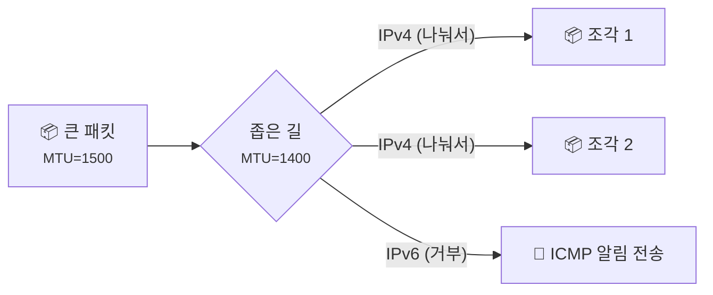
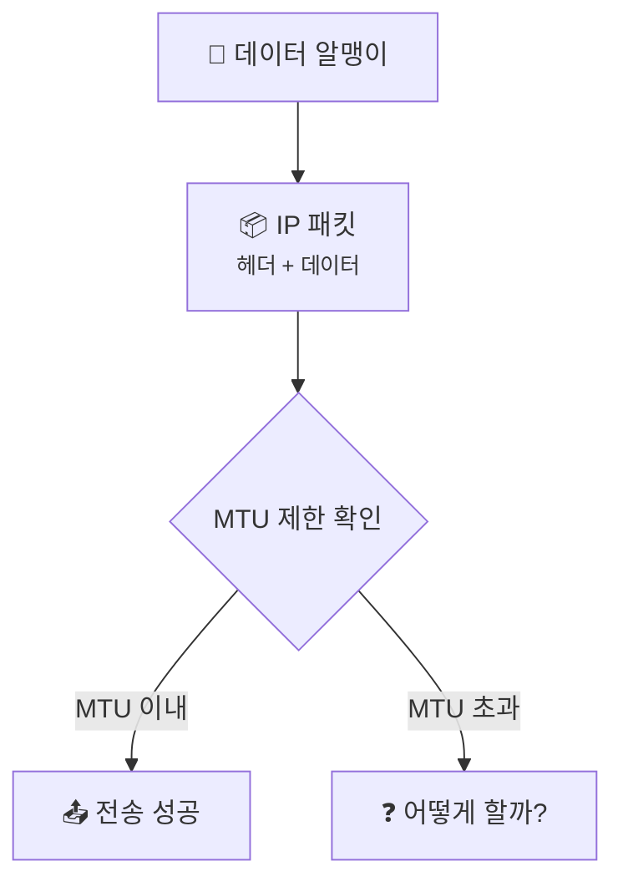
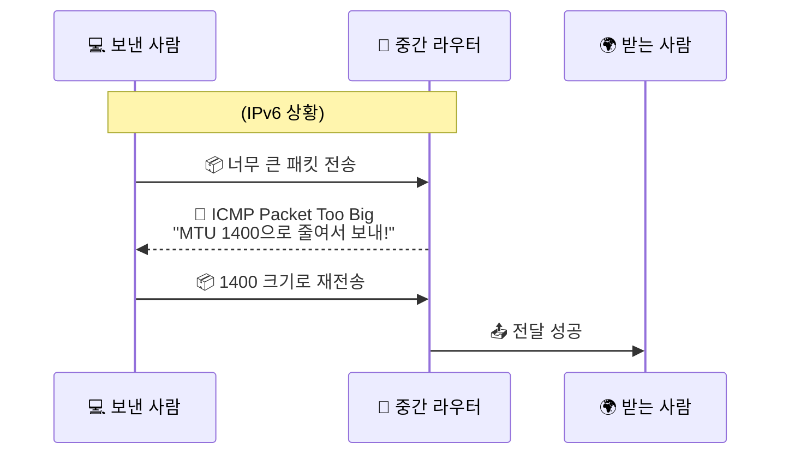

# MTU, Fragmentation, 그리고 Path MTU, 패킷은 왜 길 위에서 쪼개지거나 멈출까요?

> *"길이 맞다고 해서 짐을 마음대로 실을 수 있는 건 아니에요."* **네트워크에도 한 번에 실을 수 있는 짐의 크기가 정해져 있거든요.**

[ICMP, Ping, 그리고 Traceroute](19-icmp-ping-and-traceroute.md){ data-preview }에서,
패킷이 목적지까지 가는 길 위에서 네트워크가 어떤 힌트를 돌려주는지 봤어요.
`TTL`을 이용해 길을 찾고, ICMP로 상태를 확인하는 법도 익혔죠.

근데 말이죠, 길은 분명히 열려 있는데도 패킷이 중간에서 막히거나, 조각조각 나눠지는 일이 생겨요.
바로 **패킷의 크기** 때문이에요.

이번에는 패킷이 길 위에서 마주치는 **"최대 짐 크기 제한"** 이야기를 해볼게요.

> 여기서는 MTU와 Fragmentation(단편화)의 큰 그림과, IPv4와 IPv6에서 이 문제를 다루는 방식의 차이만 볼게요. 기술적인 세부 필드 값보다는 **"왜 패킷 크기가 문제가 되고, 네트워크는 그걸 어떻게 해결하려 하는지"** 에 집중해볼게요.

---

## 일단 비유로 시작해볼게요

이번에는 고속도로를 달리는 택배 트럭을 상상해볼까요?

- 우리 집 앞 도로(LAN)는 넓어서 아주 큰 트럭도 다닐 수 있어요.
- 그런데 목적지까지 가는 중간에 **폭이 좁은 다리**나 **천장이 낮은 터널**이 있다고 해볼게요.
- 이때 트럭 운전사가 할 수 있는 선택은 크게 두 가지예요.

첫 번째는 **짐을 나눠 싣는 거예요.**

> *"아, 다리가 좁네? 그럼 여기서 짐을 작은 차 여러 대에 나눠 실어서 건너가자."*

이게 바로 **Fragmentation(단편화)** 이에요.

두 번째는 **미리 길을 물어보는 거예요.**

> *"저기요, 목적지까지 가는 길 중에 제일 좁은 구간이 어디예요? 처음부터 그 크기에 맞춰서 출발할게요."*

이게 바로 **Path MTU(PMTU)** 를 알아내는 방식과 닮아 있어요.

| 부분 | 비유에서는 | 실제로는 |
|------|----------|----------|
| **트럭의 최대 크기** | 도로가 허용하는 가장 큰 차 크기 | **MTU (Maximum Transmission Unit)** |
| **짐 나눠 싣기** | 중간에 짐을 작은 차로 옮겨 싣는 것 | **Fragmentation (단편화)** |
| **"너무 커서 못 지나가요"** | 터널 입구에서 막혀서 돌아오는 알림 | **ICMP 크기 초과 힌트** *(IPv6의 Packet Too Big, IPv4의 관련 알림)* |
| **가장 좁은 길 찾기** | 전체 경로 중 최소 폭을 알아내는 것 | **Path MTU Discovery (PMTUD)** |

핵심은 이거예요.
네트워크 장비마다 한 번에 실어 나를 수 있는 최대 크기인 **MTU**가 다를 수 있고,
패킷이 이 제한보다 크면 **경로 중간에서 문제가 생기거나**, 보낸 쪽이 **더 작은 크기로 다시 보내야 하는 상황**이 생겨요.

---

## MTU는 정확히 무엇을 말할까요?

**MTU(Maximum Transmission Unit)** 는 말 그대로 **"한 링크 구간에서 한 번에 실어 보낼 수 있는 가장 큰 크기"** 예요.

집이나 사무실에서 흔히 만나는 네트워크에서는 IP MTU가 **1500바이트인 경우가 많아요.**
그래서 많은 패킷이 이 1500바이트 안쪽에서 움직이죠.

그런데 왜 이게 문제가 될까요?

1. **길마다 제한이 달라요**: 어떤 구간은 터널링(VPN 등) 때문에 실제 MTU가 1500보다 작을 수 있어요.
2. **바깥 껍데기가 하나 더 붙을 수 있어요**: VPN이나 터널처럼 원래 패킷 바깥에 헤더가 하나 더 붙으면, 알맹이는 그대로인데 전체 크기가 MTU를 넘어버릴 수도 있죠.

---

## 패킷이 너무 크면 어떤 일이 벌어질까요?

여기서 IPv4와 IPv6가 문제를 해결하는 철학이 조금 갈려요.

### 1. IPv4: 경우에 따라 중간에서 쪼개질 수도 있어요

IPv4에서는 패킷이 너무 클 때 **중간 라우터가 조각낼 수도 있었어요.**
패킷을 여러 조각으로 나눠 보내고, 목적지 컴퓨터가 그걸 다시 합치는 식이죠.

근데 이게 항상 자동으로 되는 건 아니에요.
보낸 쪽이 **"쪼개지 말고 보내주세요"** 같은 뜻을 함께 실어 보냈다면,
라우터는 조각내는 대신 **"너무 커요"** 라는 힌트를 돌려줄 수도 있어요.

하지만 이 방식에는 문제가 있어요.

- **라우터가 바빠져요**: 패킷을 쪼개고 헤더를 새로 붙이는 작업이 라우터에게 부담이 돼요.
- **하나라도 잃어버리면 끝이에요**: 조각 중 하나만 사라져도 전체 패킷을 다시 보내야 해요.

### 2. IPv6: "직접 크기를 맞춰서 다시 보내세요"

현대적인 IPv6에서는 라우터가 더는 패킷을 쪼개지 않아요.
만약 패킷이 MTU보다 크면, 라우터는 그냥 패킷을 버리고 보낸 사람에게 이렇게 말해요.

> *"미안한데 너무 커요. 이 길은 MTU가 이 정도니까, 다시 작게 만들어서 보내주세요."*

이때 돌아오는 힌트가 바로 ICMP **Packet Too Big** 메시지예요.

---

## Path MTU(PMTU)는 왜 필요할까요?

생각해보면, 중간에 패킷이 막혀서 다시 보내는 건 시간 낭비잖아요.
그래서 현대 네트워크는 **실제로 패킷을 보내보면서, 목적지까지 가는 길 중에 가장 좁은 곳(최소 MTU)** 이 어디쯤인지 알아내려고 해요.

이걸 **Path MTU Discovery (PMTUD)** 라고 불러요.

1. 일단 어느 정도 큰 패킷을 실제로 보내봐요.
2. 중간에 막히면 ICMP 힌트를 받아서 크기를 줄여요.
3. 이런 경험이 쌓이면서 **"이 길에서는 이 정도까지가 안전하구나"** 를 배우게 돼요.

이렇게 하면 처음부터 최적의 크기로 짐을 실을 수 있겠죠?

---

## 근데 왜 이게 트러블슈팅의 복병이 될까요?

이론은 완벽해 보이는데, 현실에서는 PMTU 문제 때문에 인터넷이 느려지거나 특정 사이트만 안 열리는 일이 생길 수 있어요.

### 1. ICMP가 차단된 경우 (Black Hole)

[ICMP, Ping, 그리고 Traceroute](19-icmp-ping-and-traceroute.md){ data-preview }에서 봤듯이, 보안상의 이유로 ICMP를 막아두는 곳이 많아요.
만약 라우터가 **"패킷이 너무 커요"** 라고 ICMP 힌트를 보내려는데, 중간 방화벽이 이걸 막아버리면 어떻게 될까요?

- 보낸 사람은 패킷이 왜 안 가는지 몰라서 계속 같은 크기로 보내보게 돼요.
- 받는 사람도 패킷이 안 오니 기다리기만 하죠.
- 통신이 아예 멈추거나, 아주 작은 데이터만 겨우 오가는 **블랙홀** 현상이 발생할 수 있어요.

이건 IPv6에서 특히 자주 같이 언급되지만,
IPv4도 **조각내지 말라**는 쪽으로 보내고 이런 힌트를 못 받으면 비슷하게 답답한 상황이 생길 수 있어요.

### 2. VPN이나 터널링을 쓸 때

VPN을 쓰면 데이터에 암호화 헤더 같은 추가 껍데기가 붙어요.
그러면 우리가 1500바이트라고 믿고 보낸 패킷이, VPN 터널 안으로 들어가는 순간 헤더 때문에 1500을 넘어서 막히는 일이 생길 수 있어요.

!!! warning "이것만은 기억하세요"
    인터넷은 잘 되는데 **특정 사이트 접속이 무한 로딩**에 걸리거나, **VPN 연결 후 통신이 불안정**하다면 MTU와 PMTU 문제를 제일 먼저 의심해봐야 해요.

---

## 그럼 진짜 MTU 문제는 어떻게 보일까요?

실제로 우리가 겪는 장면은 의외로 단순할 수 있어요.

- **웹서핑은 잘 되는데 큰 파일 업로드만 실패해요.**
- **SSH 접속은 되는데 긴 명령어를 치면 화면이 멈춰요.**
- **핑(Ping)은 가는데 실제 서비스 데이터는 안 넘어가요.**

이런 경우, 작은 패킷(핑)은 MTU 제한에 걸리지 않아서 잘 가지만, 큰 데이터 패킷은 중간 어디선가 막히고 있는 거예요.

---

## 자, 정리해볼까요?

!!! abstract "오늘 우리가 배운 것"
    - **MTU**는 네트워크 길 위의 **각 링크 구간**에서 한 번에 실어 보낼 수 있는 최대 짐 크기예요. 많은 환경에서 1500바이트가 흔하지만, 항상 그런 건 아니에요.
    - **Fragmentation(단편화)** 은 패킷이 너무 클 때 쪼개는 방식이에요. IPv4에서는 경우에 따라 중간 라우터가 조각낼 수도 있지만, IPv6 라우터는 그렇게 하지 않아요.
    - **IPv6**는 패킷이 크면 **ICMP Packet Too Big** 힌트를 돌려주며 발신자가 직접 크기를 조절하게 해요.
    - **Path MTU(PMTU)** 는 목적지까지 가는 경로 중 가장 좁은 구간의 크기를, 실제로 보내보며 알아내는 감각에 가까워요.
    - ICMP가 차단되면 PMTU 탐색이 실패해서 통신이 멈추는 **블랙홀** 현상이 생길 수 있어요.

어때요?
이제 인터넷이 가끔 먹통이 될 때, 길뿐만 아니라 **짐의 크기**도 중요하다는 감각이 좀 생기셨나요?

지금까지는 패킷이 길을 찾고(IP), 길의 상태를 보고(ICMP), 짐의 크기를 맞추는(MTU) 이야기를 했어요.
이제는 도착한 짐이 **제대로 왔는지**, **빠진 건 없는지** 를 꼼꼼하게 챙기는 친구를 만나볼 차례예요.

---

## 다음 글 예고

패킷은 무사히 도착하는 것만큼이나, **순서대로 빠짐없이** 도착하는 게 중요해요.

> *"중간에 패킷 하나가 사라지면, 네트워크는 어떻게 그 사실을 알고 다시 보내줄까요?"*

다음 글에서는 TCP의 가장 강력한 특징인 **[TCP 재전송과 신뢰성](21-tcp-retransmission-and-reliability.md){ data-preview }** 이야기를 통해, 끈질기게 데이터를 책임지는 메커니즘을 같이 열어볼게요.
