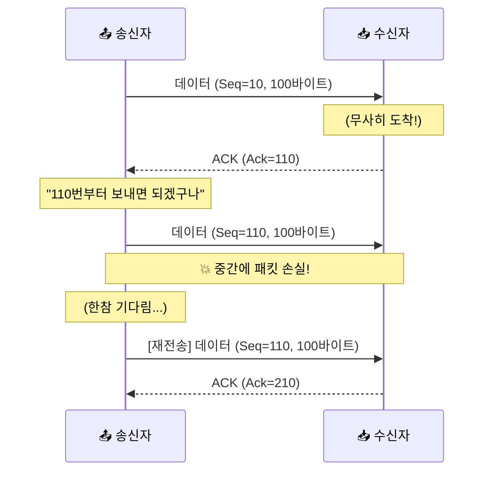
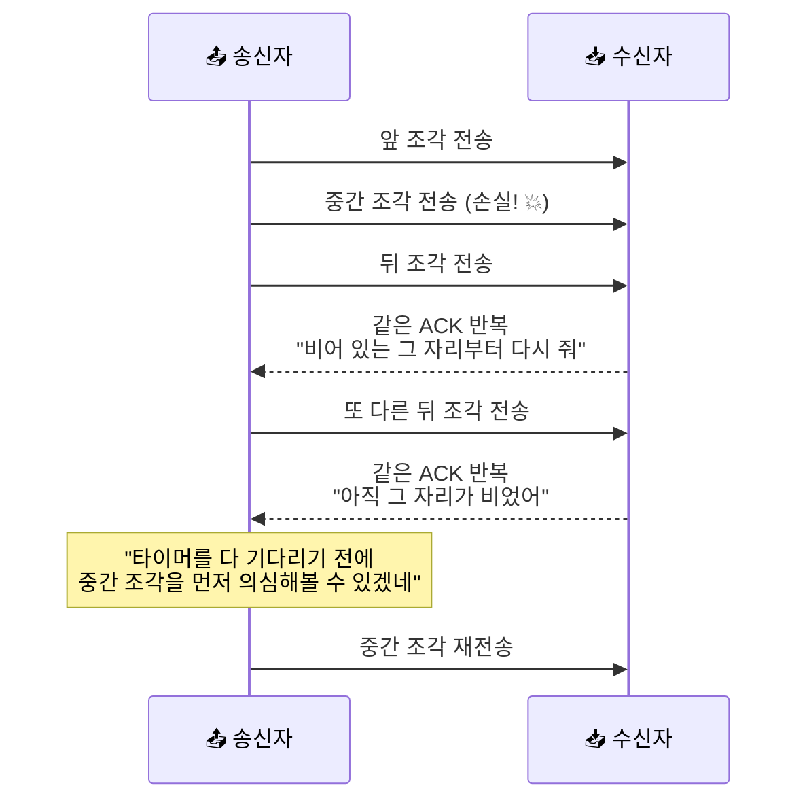

# TCP 재전송과 신뢰성 - 사라진 패킷을 끝까지 챙기는 법

> *"보냈다고 해서 다 간 건 아니에요. 인터넷 세상에서는 짐이 사라지는 일이 아주 흔하거든요."*

[MTU, Fragmentation, 그리고 Path MTU](20-mtu-fragmentation-and-path-mtu.md){ data-preview }에서 우리는 패킷이 길의 크기에 맞춰 쪼개지거나, 너무 크면 중간에서 막힐 수도 있다는 걸 봤어요. 길 위에서 패킷이 버려지는 상황을 하나 본 셈이죠.

그런데 말이죠, 패킷이 버려졌을 때 **"어? 하나가 안 왔네? 다시 보내줘!"** 라고 끈질기게 챙기는 친구가 있어요. 

바로 **TCP**예요.

[TCP vs UDP](03-tcp-vs-udp.md#tcp-intro){ data-preview }에서 TCP를 "꼼꼼한 친구"라고 불렀던 것 기억하시나요? 그리고 [TCP 3-way handshake](09-tcp-3-way-handshake.md#handshake-signals){ data-preview }에서는 그 꼼꼼함이 연결을 여는 순간 어떤 숫자와 신호로 보이는지 봤죠.

이번에는 거기서 한 걸음 더 가볼게요. **연결이 이미 열린 뒤에**, TCP가 빠진 조각을 어떻게 눈치채고 다시 보내는지 보는 편이라고 생각하면 딱 맞아요.

---

## 일단 비유로 시작해볼게요

이번에는 여러분이 친구에게 **번호가 매겨진 사과 10알**을 택배로 보낸다고 상상해볼까요?

1. 여러분은 사과에 1번부터 10번까지 스티커를 붙여서 하나씩 보내요.
2. 친구는 사과를 받을 때마다 **"방금 n번 잘 받았어! 다음은 n+1번 줘"** 라고 전화를 해줘요.
3. 그런데 4번 사과를 보냈는데, 한참이 지나도 친구한테 전화가 안 와요.
4. 여러분은 생각하죠. *"아, 4번이 가다가 길을 잃었나 보네?"*
5. 그래서 여러분은 **4번 사과를 다시 상자에 담아 보내요.**

이게 바로 TCP가 데이터를 책임지는 방식이에요.

| 부분 | 비유에서는 | 실제로는 |
|------|----------|----------|
| **사과 번호 스티커** | 몇 번째 사과인지 표시 | **Sequence Number (순서 번호)** |
| **"다음은 n번 줘" 전화** | 어디까지 받았고 다음은 뭘 기다리는지 알림 | **Acknowledgment Number (확인 번호, ACK)** |
| **전화 기다리는 시간** | 일정 시간 답이 없으면 사고로 판단 | **Retransmission Timeout (RTO, 재전송 타이머)** |
| **사과 다시 보내기** | 잃어버린 사과를 새 박스에 담아 전송 | **Retransmission (재전송)** |

핵심은 이거예요. TCP는 **"상대가 잘 받았다는 확인(ACK)"** 이 올 때까지 데이터를 포기하지 않고 챙겨요.

---

## "다음에 이거 줘" - ACK의 진짜 의미

[TCP 3-way handshake](09-tcp-3-way-handshake.md#handshake-signals){ data-preview }에서 살짝 봤듯이, TCP 헤더 안에는 `Sequence Number`와 `Acknowledgment Number`가 들어 있어요.

- **Sequence Number (순서 번호)**: "내가 보내는 이 데이터는 전체 흐름 중 **몇 번째 바이트부터** 시작하는 거야"라는 뜻이에요.
- **Acknowledgment Number (확인 번호, ACK)**: "나는 여기까지 잘 받았으니, **다음에는 이 번호부터** 보내줘"라는 뜻이에요.

이게 왜 중요하냐면요, 네트워크에서는 패킷 순서가 뒤바뀌어 도착할 수도 있거든요.

- 1번(Seq: 1~100)이 오고
- 3번(Seq: 201~300)이 먼저 왔다면?
- 받는 쪽은 **"어? 101번부터 와야 하는데 201번이 왔네?"** 하고 알 수 있어요.

그럼 받는 쪽은 3번을 받아두긴 하지만, 보내는 쪽에는 계속 **"아직 101번이 안 왔어. 101번(Ack=101) 줘!"** 라고 대답해요. 이 끈질긴 요구 덕분에 보내는 쪽은 중간에 뭐가 빠졌는지 정확히 알 수 있죠.

---

## 패킷이 사라진 걸 어떻게 알까요?

TCP가 "사고가 났다"고 판단하는 기준은 크게 두 가지예요.

### 1. 시간이 너무 오래 지났을 때 (Timeout)

가장 기본이에요. 패킷을 보낸 뒤에 일정 시간(Timeout) 동안 ACK가 안 오면, TCP는 "패킷이 사라졌거나 ACK가 사라졌구나"라고 생각하고 다시 보내요.

이때 기다리는 시간을 **RTO(Retransmission Timeout)** 라고 불러요. 이 시간은 고정된 게 아니라, 평소에 패킷이 얼마나 빨리 갔다 오는지(RTT)를 보고 TCP가 스스로 조절하는 똑똑한 시간이에요.

### 2. 똑같은 요구를 반복해서 받을 때 (Fast Retransmission)

시간이 다 흐를 때까지 기다리는 건 너무 느리잖아요. 그래서 더 빠른 방법도 있어요.

- 송신자: 순서대로 데이터를 계속 보냄
- 수신자: (중간 조각 하나를 못 받음)
- 수신자: "여기까지는 왔는데, **그다음 조각이 비었어!**" (뒤 조각이 먼저 도착함)
- 수신자: "여전히 **같은 자리가 비었어!**"
- 수신자: "아직도 **그 조각이 안 왔어!**"

이렇게 똑같은 ACK 번호가 **여러 번 반복되면**, TCP는 "아, 타이머가 끝나지 않았지만 중간에 빈 조각이 생겼구나!"라고 더 빨리 눈치챌 수 있어요. 대표적으로는 이런 반복 ACK를 몇 번 연달아 보고 바로 재전송하는 방식이 널리 쓰이는데, 이 감각을 **빠른 재전송(Fast Retransmission)** 이라고 보면 돼요.

---

## 근데 왜 이렇게까지 꼼꼼해야 할까요?

UDP처럼 그냥 던지고 말면 편할 텐데, 왜 굳이 번호를 매기고 타이머를 돌릴까요?

### 1. 데이터가 오염되거나 조각나면 쓸모가 없어져요

우리가 내려받는 파일, 실행하는 프로그램, 로그인 정보... 이런 데이터는 단 1바이트만 틀려도 파일이 깨지거나 로그인이 실패해요. [HTTP와 HTTPS](06-http-and-https.md){ data-preview } 같은 상위 계층의 대화가 성립하려면, 밑바닥(TCP)에서 **"깨진 채로 슬쩍 넘기지 않고, 문제가 생기면 다시 챙긴다"** 는 감각이 중요하거든요.

### 2. 네트워크는 생각보다 불안정해요

패킷은 수많은 라우터를 거쳐가요. 중간에 라우터가 너무 바빠서 패킷을 버릴 수도 있고(Congestion), [MTU 문제](20-mtu-fragmentation-and-path-mtu.md){ data-preview }로 막힐 수도 있죠. TCP는 이런 불안정한 길 위에서 **가상으로 안정적인 통로**를 만들어주는 마법 같은 역할을 해요.

---

## 실제 캡처 화면에서는 어떻게 보일까요? { #retransmission-symptoms }

나중에 [패킷 캡처](12-packet-capture.md){ data-preview } 도구로 통신을 들여다보면, 재전송 상황은 아주 또렷하게 보여요.

- **TCP Retransmission**: 패킷이 유실되었거나, 송신자가 그렇게 의심해서 같은 조각을 다시 보낼 때 나타나요.
- **TCP Dup ACK**: 수신자가 "비어 있는 그 번호 줘!"라고 반복해서 요청할 때 보여요.
- **Out-of-Order**: 패킷 순서가 뒤바뀌어 도착했을 때 나타나요.

이런 흔적들이 보인다면, 지금 네트워크 어딘가에서 패킷이 버려지고 있거나 순서가 흔들리고 있을 가능성을 먼저 의심해볼 수 있어요. 서비스가 느려진다면 이런 **재전송 비율**과 반복 ACK 같은 단서를 함께 보는 게 트러블슈팅의 첫걸음이 된답니다.

---

## 자, 정리해볼까요?

!!! abstract "오늘 우리가 배운 것"
    - **신뢰성(Reliability)** 은 패킷이 사라지거나 순서가 바뀌어도 완벽하게 복구해내는 TCP의 성격이에요.
    - **Sequence Number**는 데이터의 위치를 알려주고, **ACK Number**는 다음에 받을 위치를 요구해요.
    - **Retransmission(재전송)** 은 ACK가 안 오거나(Timeout), 같은 ACK가 반복될 때(Fast Retransmission) 발생해요.
    - TCP는 이 과정을 통해 불안정한 인터넷 환경에서도 **데이터의 정확성**을 보장해요.
    - 재전송이 잦아지면 서비스가 느려지므로, 패킷 캡처에서 중요한 관찰 포인트가 돼요.

어때요? 이제 "TCP는 신뢰할 수 있는 프로토콜이다"라는 말이 단순히 착하다는 뜻이 아니라, **번호표와 타이머를 들고 끈질기게 체크하는 메커니즘**이라는 게 느껴지시나요?

---

## 다음 글 예고

우리는 지금까지 연결을 맺고(Handshake), 데이터를 보내고, 유실된 걸 복구하는 과정까지 봤어요. 그런데 말이죠, 시작이 있으면 끝도 있는 법이죠.

> *"데이터를 다 보낸 뒤에 '이제 끝낼게요'라고 인사하는 과정은 시작할 때랑 어떻게 다를까요?"*

다음 글에서는 TCP 연결의 마지막 단계인 **[TCP Teardown과 TIME-WAIT](22-tcp-teardown-and-time-wait.md){ data-preview }** 이야기를 해볼게요. 끝맺음을 잘해야 다음 연결도 깔끔하게 시작할 수 있거든요.
