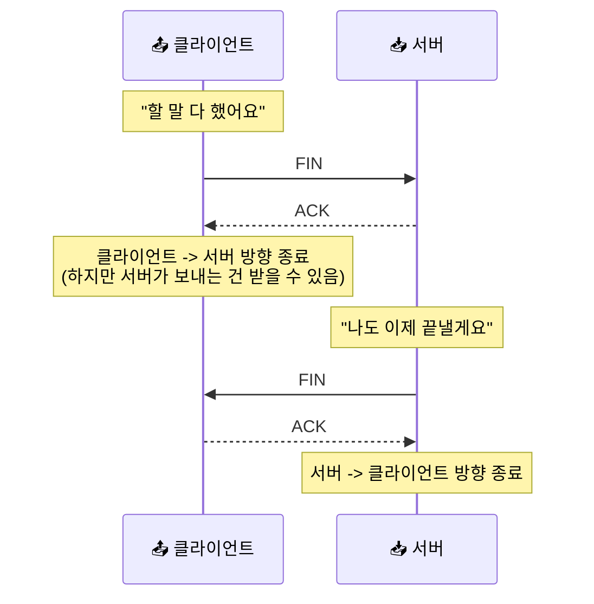
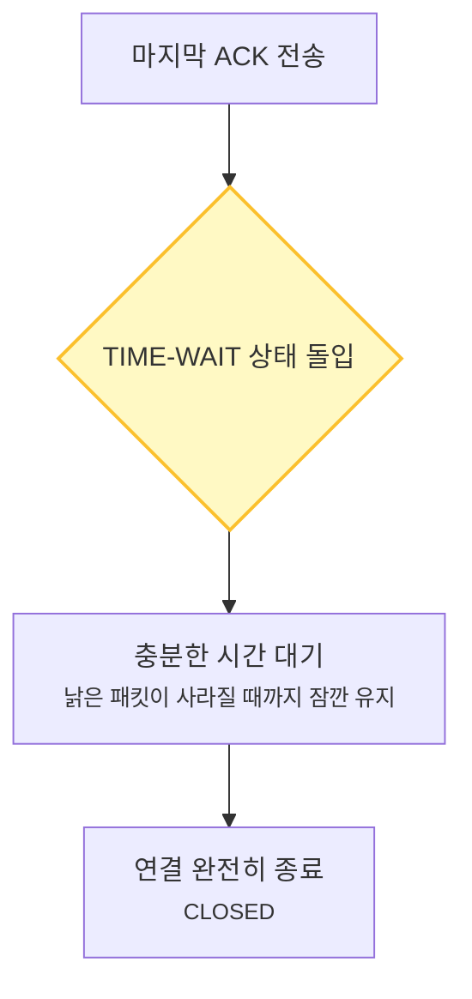

# TCP Teardown과 TIME-WAIT - 대화가 끝난 뒤의 깔끔한 마무리

> *"시작보다 중요한 건 끝맺음이에요. 마지막 인사가 전달되지 않으면, 누군가는 계속 문앞에서 기다릴지도 모르니까요."*

[TCP 재전송과 신뢰성](21-tcp-retransmission-and-reliability.md){ data-preview }에서 우리는 데이터를 보낼 때 조각 하나하나를 꼼꼼하게 챙기는 법을 봤어요. 덕분에 우리는 중간에 짐이 사라져도 걱정 없이 데이터를 주고받을 수 있게 됐죠.

그런데 말이죠, 할 말을 다 마쳤으면 이제 **"그만할게요"** 라고 인사를 하고 헤어져야 해요. 만약 인사도 없이 툭 끊어버리면 상대방은 아직 할 말이 남았는지, 아니면 갑자기 사고가 난 건지 알 길이 없거든요.

[TCP 3-way handshake](09-tcp-3-way-handshake.md){ data-preview }가 연결을 열 때의 정중한 약속이었다면, 이번에 볼 **TCP Teardown(해제)** 과정은 연결을 닫을 때의 정중한 작별 인사예요. 특히 마지막에 잠깐 머무르는 **TIME-WAIT**라는 상태가 왜 필요한지 이해하는 게 오늘 이야기의 핵심이에요.

---

## 일단 비유로 시작해볼게요

이번에는 여러분이 친구와 **각자의 방에서 무전기로 대화**를 하다가 마무리를 한다고 상상해볼까요? 

1. **나**: "친구야, 나는 이제 할 말 다 했어. 내 무전기 끌게! (FIN)"
2. **친구**: "응, 알았어. 네가 할 말 다 한 거 확인했어. (ACK)"
3. **친구**: (잠시 후 자기도 정리하고) "나도 이제 할 말 다 끝났어. 나도 끌게! (FIN)"
4. **나**: "응, 너도 끝난 거 확인했어. 잘 가! (ACK)"
5. **나**: (하지만 바로 무전기를 집어던지지 않고, **친구의 '잘 가'를 확인한 뒤에 잠시 더 기다렸다가** 자리를 떠나요.)

여기서 중요한 건, 내가 "끝!"이라고 한다고 해서 친구의 입까지 막는 건 아니라는 점이에요. 나는 할 말이 끝났지만, 친구는 아직 나에게 할 말이 더 남아 있을 수도 있거든요.

| 부분 | 비유에서는 | 실제로는 |
|------|----------|----------|
| **"내 할 말은 끝났어"** | 내가 보내는 방향의 전원을 끔 | **FIN (Finish) 신호** |
| **"인사 확인했어"** | 상대의 종료 의사를 수신함 | **ACK (Acknowledgment)** |
| **반대쪽에서도 종료** | 친구도 자기 방향의 전원을 끔 | **FIN (Finish) 신호** |
| **자리를 뜨기 전 대기** | 마지막 인사가 잘 갔는지 확신할 때까지 기다림 | **TIME-WAIT 상태** |

---

## FIN은 "나 이제 안 보내"라는 뜻이에요

TCP 연결은 신기하게도 **양방향 도로** 같아요. 그래서 한쪽이 "끝!"이라고 해도, 그건 **"내가 너한테 보내는 도로를 닫겠다"** 는 뜻이지 "너도 나한테 보내지 마"라는 뜻이 아니에요.

이걸 전문 용어로 **Half-Close(절반만 닫기)** 라고 불러요.



이렇게 네 번의 신호를 주고받으며 양쪽 도로를 하나씩 닫는 과정을 **4-way teardown**이라고 불러요. 시작할 때(3-way)보다 한 번 더 주고받는 이유는, 양쪽이 각자 할 일을 마칠 시간이 필요하기 때문이죠.

---

## TIME-WAIT, 왜 바로 안 끝내고 기다릴까요?

연결을 닫을 때 가장 독특한 지점은 바로 여기예요. 마지막 ACK를 보낸 쪽(먼저 종료를 요청한 쪽)은 연결을 바로 지우지 않고, **일정 시간 동안 자리를 지키며 기다려요.** 이 상태를 **TIME-WAIT**라고 해요.

*"이미 끝났는데 왜 리소스를 쓰면서 기다려요?"* 라고 물을 수 있죠. 이유는 크게 두 가지예요.

### 1. 마지막 인사가 배달 사고가 날 수 있어서

내가 보낸 마지막 "잘 가!(ACK)"가 중간에 사라졌다고 상상해볼까요? 
그럼 상대방(서버)은 "어? 내 마지막 인사(FIN)를 못 받았나?" 하고 **다시 FIN을 보내요.**

만약 내가 이미 자리를 떠나고 무전기를 꺼버렸다면, 서버가 다시 보낸 인사를 받을 사람이 없겠죠. 그러면 서버는 한동안 "저기요? 끝내도 돼요?" 하듯 같은 FIN을 다시 보내며 정리를 마무리하지 못하고 기다리게 돼요. 내가 조금만 더 기다려주면, 다시 온 FIN에 대해 "응, 진짜 잘 가!"라고 다시 대답해줄 수 있어요.

### 2. "미아" 패킷이 뒤늦게 나타날 수 있어서

인터넷 세상은 아주 넓어서, 가끔 패킷이 길을 잃고 헤매다가 아주 늦게 도착할 때가 있어요. 
만약 내가 연결을 닫자마자 **똑같은 주소와 포트로 새로운 연결**을 바로 만들었는데, 예전 연결에서 헤매던 낡은 패킷이 갑자기 툭 튀어나오면 어떻게 될까요?

새로운 연결 입장에서는 "어? 나는 이런 데이터를 보낸 적이 없는데?" 하고 혼란에 빠질 수 있어요. TIME-WAIT는 이런 **떠돌이 패킷들이 자연스럽게 사라질 때까지** 시간을 벌어주는 안전장치인 셈이에요.



---

## 근데 왜? 이게 왜 중요할까요?

보통은 운영체제가 알아서 다 해주기 때문에 우리가 매번 신경 쓸 일은 없어요. 그래도 연결이 아주 자주 열리고 닫히는 환경에서는, 이 상태를 이해하고 있는 게 꽤 중요해져요.

### 1. 포트가 부족해질 수 있어요
한 컴퓨터가 쓸 수 있는 포트 번호는 유한해요. 그런데 연결을 맺고 끊을 때마다 TIME-WAIT 상태의 연결이 수만 개씩 쌓인다면? 정작 **새로운 연결을 맺고 싶어도 쓸 수 있는 포트가 없어서** 서비스가 멈추는 상황이 생길 수 있어요.

### 2. 서버 설정의 핵심 포인트가 돼요
그래서 아주 바쁜 웹 서버나 DB 서버를 운영할 때는, `TIME_WAIT`가 많이 보이는 게 왜 그런지 읽을 줄 아는 감각이 중요해져요. 무조건 없애는 게 답이라기보다, **안전하게 정리하느라 잠깐 남아 있는 흔적**이라는 걸 이해하고 다른 병목과 함께 봐야 하거든요.

---

## 그럼 실제로는 어떤 모습일까요?

명령 프롬프트나 터미널에서 `netstat` 명령어를 입력해보면, 지금 내 컴퓨터의 연결 상태를 볼 수 있어요.

```text
TCP    192.168.0.5:54321      142.250.196.78:443     ESTABLISHED
TCP    192.168.0.5:54322      172.217.161.14:443     TIME_WAIT
```

- **ESTABLISHED**: 지금 한창 즐겁게 대화 중인 상태예요.
- **TIME_WAIT**: 대화는 끝났지만, 혹시 모를 상황을 위해 잠시 자리를 지키고 있는 상태예요.

여러분이 브라우저 창을 닫거나 프로그램이 종료된 뒤에도 이 `TIME_WAIT` 흔적들은 잠시 동안 리스트에 남아 있다가 조용히 사라진답니다.

---

## 자, 정리해볼까요?

!!! abstract "오늘 우리가 배운 것"
    - **TCP Teardown**은 4번의 신호(FIN-ACK, FIN-ACK)를 주고받으며 양방향 연결을 정중하게 닫는 과정이에요.
    - **FIN**은 "나는 이제 보낼 게 없어"라는 뜻이며, 상대방은 아직 더 보낼 수 있는 **Half-Close** 상태가 가능해요.
    - **TIME-WAIT**는 마지막 ACK를 보낸 쪽이 혹시 모를 재전송이나 낡은 패킷의 혼입을 막기 위해 잠시 기다리는 상태예요.
    - 이 대기 시간 덕분에 다음 연결이 안전하고 깨끗하게 시작될 수 있어요.
    - 하지만 연결이 너무 빈번하면 TIME-WAIT가 쌓여 포트 부족 현상을 일으키기도 하므로 서버 운영 시 중요한 관리 포인트가 돼요.

끝맺음이 깔끔해야 다음 시작도 기분 좋은 법이죠. TCP는 연결을 여는 것만큼이나 닫는 것에도 아주 진심인 친구랍니다.

---

## 다음 글 예고

우리는 지금까지 내 컴퓨터에서 시작해서 서버까지, 패킷이 어떻게 만들어지고 길을 찾고(IP), 신뢰를 쌓고(TCP), 안전하게 헤어지는지 전 과정을 봤어요.

그런데 사실, 우리가 만나는 서버들은 그렇게 단순하게 혼자 있지 않아요.

> *"수많은 사람이 몰려오는데, 서버 한 대가 그 많은 대화를 다 감당할 수 있을까요? 누군가 중간에서 '너는 이쪽으로 가'라고 정리해주진 않을까요?"*

다음 글에서는 우리 눈에는 보이지 않지만 서버 앞단에서 교통 정리를 해주는 **"Proxy, Reverse Proxy, 그리고 Load Balancer"** 이야기를 해볼게요. 드디어 현대 웹 서비스의 진짜 구조를 들여다볼 차례예요.
