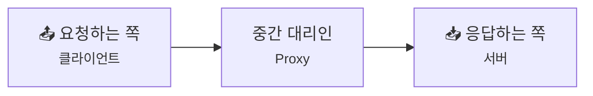
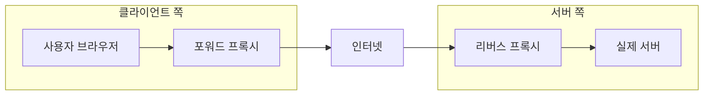
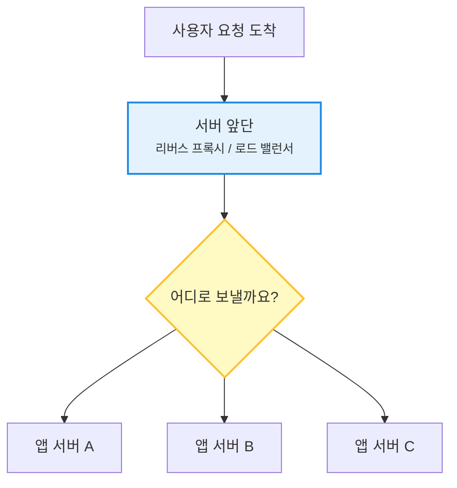
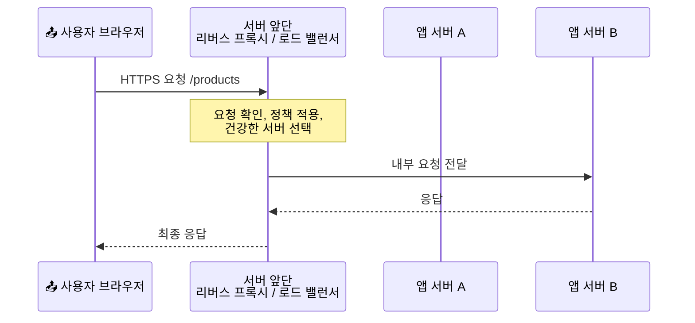

# Proxy, Reverse Proxy, 그리고 Load Balancer - 서버 앞단의 교통정리

> *"우리가 말 걸고 있는 서버가, 사실은 진짜 일을 하는 서버가 아닐 수도 있어요."*

[TCP Teardown과 TIME-WAIT](22-tcp-teardown-and-time-wait.md){ data-preview }에서는 연결 하나가 어떻게 깔끔하게 끝나는지 봤어요. 그런데 현실의 웹 서비스는 연결 하나만 예쁘게 닫는다고 끝나지 않아요. **수많은 사용자가 동시에 몰려왔을 때, 그 요청을 누가 먼저 받아주고, 어디로 보낼지 정리하는 앞단**이 필요하거든요.

근데요, 여기서 이름이 갑자기 확 늘어나죠. 프록시, 리버스 프록시, 로드 밸런서... 다 비슷하게 중간에 서 있는 것 같아서 헷갈리기 쉬워요.

여기서는 이 셋을 **"누구 편에서 대신 서 있느냐"**, **"여러 서버 중 어디로 보낼지를 고르느냐"** 이 두 축으로 큰 그림부터 잡아볼게요. 참고로 여기서 말하는 **프록시(proxy)**는 큰 범주 이름이고, 클라이언트 쪽 사례는 **포워드 프록시**라고 부를게요. CDN처럼 **사용자 가까이 복사본을 두는 이야기**는 다음 글에서 더 본격적으로 열어볼게요.

---

## 일단 비유로 시작해볼게요

큰 오피스 건물을 떠올려볼까요?

- 어떤 직원은 바깥 심부름을 직접 가지 않고 **비서에게 대신 다녀와 달라**고 부탁해요.
- 어떤 방문객은 건물 안쪽 사무실로 바로 들어가지 못하고, **1층 안내 데스크**에서 먼저 응대를 받아요.
- 그리고 방문객이 너무 많으면 안내 데스크는 **덜 바쁜 창구**로 사람을 나눠 보내겠죠.

이 세 장면이 오늘 이야기의 핵심이에요.

| 부분 | 비유에서는 | 실제로는 |
|------|----------|----------|
| **밖으로 대신 나가주는 사람** | 직원 대신 심부름 가는 비서 | **포워드 프록시(Forward Proxy)** |
| **건물 입구에서 먼저 받는 사람** | 방문객을 먼저 맞는 1층 안내 데스크 | **리버스 프록시(Reverse Proxy)** |
| **여러 창구로 나눠 보내기** | 손님을 덜 바쁜 창구로 배정 | **로드 밸런서(Load Balancer)** |
| **중간에서 대신 말해주는 역할 전체** | 대신 가주거나 대신 받아주는 중간 담당 | **프록시(Proxy)** |

핵심은 **프록시가 큰 범주 이름**이라는 점이에요. 그리고 그 안에서 **클라이언트 쪽 대리인**이면 포워드 프록시, **서버 쪽 대문**이면 리버스 프록시라고 보면 훨씬 덜 헷갈려요.

---

## 프록시는 결국 "중간 대리인"이에요

프록시(proxy)는 아주 넓게 보면 **어느 한쪽을 대신해 중간에 서는 존재**예요.

이 그림만 보면 너무 단순해 보여서, *"그럼 프록시는 다 같은 거 아닌가요?"* 싶을 수 있어요.

사실은 아니에요.

- **클라이언트 편에 서서 바깥으로 나가주면** 포워드 프록시예요.
- **서버 편에 서서 바깥 요청을 먼저 받아주면** 리버스 프록시예요.
- **그리고 그 앞단이 여러 서버 중 하나를 골라 보내면** 로드 밸런싱 역할까지 하는 거예요.

즉, 오늘 헷갈림의 시작은 **이름이 셋인데, 실제로는 역할이 겹치기도 한다**는 데 있어요.

---

## 포워드 프록시와 리버스 프록시는 뭐가 다를까요?

이 구간에서는 용어를 한 번에 완벽하게 외우려 하지 않아도 괜찮아요. 지금은 **"클라이언트 쪽 중간자냐, 서버 쪽 중간자냐"** 이 감각만 잡아도 충분해요. 뒤에서 실제 웹 요청 흐름에 다시 연결해볼게요.

같은 "프록시"라는 말을 쓰더라도, **누가 그 존재를 알고 쓰느냐**가 달라요.

| 구분 | 포워드 프록시 | 리버스 프록시 | 로드 밸런서 |
|------|--------------|--------------|-------------|
| **어느 쪽에 가까울까요?** | 클라이언트 쪽 | 서버 쪽 | 서버 쪽 |
| **누가 존재를 알고 쓰나요?** | 보통 클라이언트/조직이 알아요 | 보통 서버 운영 쪽이 둬요 | 보통 서버 운영 쪽이 둬요 |
| **누구를 대신하나요?** | 클라이언트 | 서버 | 여러 서버 앞단 |
| **여러 서버가 꼭 필요할까요?** | 아니에요 | 아니에요 | 보통은 그래요 |
| **한 줄 역할** | 대신 밖으로 나가줘요 | 대신 먼저 받아줘요 | 여러 서버로 나눠 보내요 |

예를 들어 회사나 학교에서는 사용자가 인터넷에 바로 나가는 대신, **사내 프록시를 거쳐 나가게** 만들 수 있어요. 그러면 어떤 사이트에 접근할지 정책을 걸거나 기록을 남기기 쉬워지죠. 이건 **포워드 프록시**에 가까워요.

반대로 우리가 `example.com`에 접속할 때는, 사실 안쪽 서버 여러 대가 직접 우리를 상대하지 않고 **앞단 리버스 프록시가 먼저 요청을 받아** 뒤로 넘길 수 있어요. 사용자는 그냥 서버 하나와 대화한다고 느끼지만, 실제로는 중간 정리 담당이 끼어 있는 거예요.

---

## 로드 밸런서는 왜 따로 이름이 있을까요?

여기서 많이 헷갈리는 포인트가 나와요.

*"리버스 프록시가 앞에서 받는 거라면, 로드 밸런서도 그냥 그거 아닌가요?"*

반은 맞고, 반은 아니에요.

리버스 프록시는 **서버 앞단에서 대신 받아주는 역할**에 초점이 있고,
로드 밸런서는 **뒤에 있는 여러 서버 중 어디로 보낼지 고르는 역할**에 초점이 있어요.

즉,

- **리버스 프록시**는 한 대의 서버 앞에도 설 수 있어요.
- **로드 밸런서**는 보통 뒤에 여러 후보 서버가 있을 때 의미가 커져요.

현실에서는 이 둘이 **한 장비나 한 소프트웨어 안에서 같이 동작하는 경우가 아주 흔해요.**

예를 들면 앞단이:

- TLS/HTTPS 종료를 앞단에서 맡기도 하고,
- 어떤 URL 요청인지 보고,
- 살아 있는 서버를 확인한 뒤,
- 서버 A/B/C 중 하나로 보내줄 수 있어요.

이럴 때 그 앞단은 **리버스 프록시 역할도 하고**, 동시에 **로드 밸런서 역할도 하는 셈**이에요.

그래서 이 둘을 **완전히 같은 말이라고 뭉개면 안 되지만**, **현실에서 많이 겹친다**고 이해하는 건 아주 좋아요.

---

## 근데 왜? 굳이 이런 앞단이 왜 필요할까요?

그냥 사용자가 서버에 바로 붙으면 더 단순할 것 같죠?

**사실은 단순하지 않아요.** 서비스가 커질수록 "바로 붙기"는 오히려 더 불편하고 위험해져요.

### 1. 진짜 서버를 바로 드러내지 않으려고요

리버스 프록시가 앞에 서 있으면, 사용자는 **항상 같은 입구**만 보면 돼요. 뒤에 서버가 한 대인지 세 대인지, 어떤 앱이 어디서 돌고 있는지는 감춰둘 수 있죠.

### 2. 공통 일을 앞단에서 한 번에 처리하려고요

HTTPS 종료, 압축, 캐시, 간단한 접근 제어 같은 일은 매 서버가 제각각 처리하는 것보다 **앞단에서 먼저 정리**하는 편이 편할 때가 많아요.

### 3. 요청을 한 군데에 몰아두지 않으려고요

사람이 몰리는데 서버가 한 대뿐이라면 금방 버거워져요. 앞단이 여러 서버로 나눠 보내주면 **한 서비스처럼 보이면서도 뒤에서는 일을 나눠서 처리**할 수 있어요.

### 4. 아픈 서버를 잠깐 빼둘 수 있어서요

로드 밸런서는 보통 **정상적으로 응답하는 서버만 고르는 판단**도 같이 해요. 그러면 서버 B가 잠깐 아프더라도, 앞단이 B를 빼고 A와 C로 우회시킬 수 있죠.

### 5. 운영 관점에서 바꾸기가 쉬워져요

새 서버를 붙이거나, 일부 요청만 다른 서비스로 보내거나, 특정 경로만 따로 처리하는 일을 **입구 한 곳에서 조정**할 수 있어요. 뒤쪽 구조가 바뀌어도 바깥 주소는 그대로 유지하기 쉽고요.

---

## 그럼 진짜 웹 서비스에서는 어떻게 보일까요?

여러분이 쇼핑몰 앱이나 웹사이트에 접속한다고 상상해볼까요?

1. 브라우저는 `shop.example.com`으로 요청을 보내요.
2. 이 요청은 먼저 **서버 앞단**에 도착해요.
3. 앞단은 HTTPS를 받거나, 어떤 경로인지 확인하거나, 살아 있는 서버가 누구인지 살펴봐요.
4. 그다음 앱 서버 A나 B 중 한 곳으로 요청을 넘겨요.
5. 사용자는 그냥 `shop.example.com` 하나와 대화했다고 느껴요.

여기서 사용자가 꼭 알아야 할 건 하나예요.

**내가 보고 있는 주소 하나 뒤에, 실제 서버는 하나가 아닐 수도 있다**는 점이죠.

그리고 서버 입장에서도, 직접 모든 사용자를 바로 받는 대신 **앞단에게 입구 정리**를 맡기면 훨씬 유연하게 운영할 수 있어요.

참고로 프록시 앞단이 끼어 있으면, 뒤쪽 서버는 사용자의 진짜 주소 대신 **바로 앞 중간 장비의 주소**를 먼저 보게 될 때도 있어요. 그래서 운영 환경에서는 `X-Forwarded-For` 같은 정보를 같이 다루기도 하는데, 그건 여기서 깊게 파기보다 **"중간자가 있으면 원래 정보가 그대로 보이지 않을 수 있다"** 정도만 감 잡아도 충분해요.

---

## 자, 정리해볼까요?

!!! abstract "오늘 우리가 배운 것"
    - **프록시**는 한쪽을 대신해 중간에 서는 **넓은 개념**이에요.
    - **포워드 프록시**는 클라이언트 쪽 대리인이라서, 바깥 인터넷으로 **대신 나가주는 역할**에 가까워요.
    - **리버스 프록시**는 서버 쪽 대문이라서, 바깥 요청을 **먼저 받아서 안쪽 서버로 넘겨주는 역할**에 가까워요.
    - **로드 밸런서**는 여러 서버 중 어디로 보낼지 **나눠서 배정하는 역할**에 초점이 있어요.
    - 현실에서는 **리버스 프록시와 로드 밸런서 역할이 한 앞단에서 함께 동작하는 경우가 아주 흔해요.**
    - 그래서 중요한 건 장비 이름을 외우는 것보다, **"누구 편에서 대신 서 있나?"**, **"여러 서버 중 하나를 고르나?"** 이 두 질문으로 보는 감각이에요.

결국 우리가 접속하는 서비스는, 보이는 주소 하나 뒤에서 생각보다 훨씬 똑똑하게 교통정리를 하고 있는 셈이에요.

---

## 다음 글 예고

이제 우리는 서버 앞단에서 누가 요청을 먼저 받고, 어떻게 안쪽으로 나눠 보내는지까지 봤어요.

그런데 말이죠, 사용자가 서울에 있든 뉴욕에 있든 똑같이 먼 서버까지 매번 달려가게 두는 건 너무 비효율적이지 않을까요?

> *"굳이 원본 서버까지 매번 가지 말고, 사용자 가까운 곳에 미리 복사해두면 더 빠를 수 있지 않을까요?"*

다음 글에서는 **CDN, Cache, 그리고 Edge Delivery** 이야기를 해볼게요. 이번 글이 서버 앞단의 **입구 정리**였다면, 다음 글은 전 세계 곳곳에 **복사본을 더 가까이 놓는 전략**으로 시야를 넓혀볼 차례예요.
