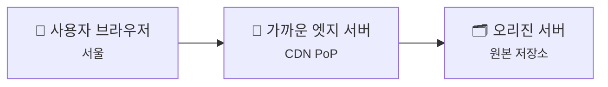
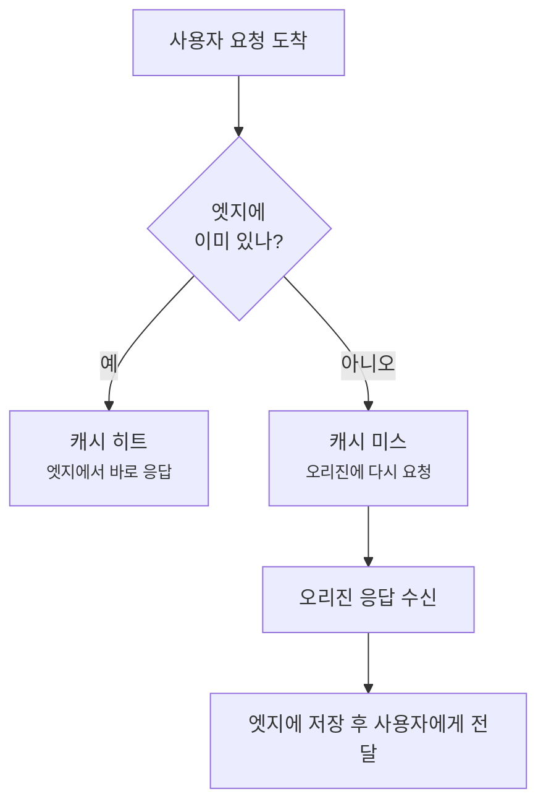
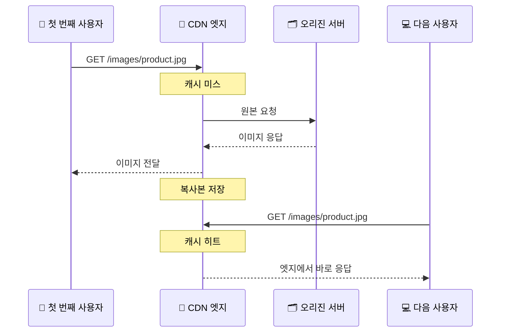

# CDN, Cache, 그리고 Edge Delivery - 왜 사용자 가까이에 복사본을 둘까요?

> *"같은 웹사이트인데도, 어떤 파일은 굳이 원본 서버까지 가지 않고도 더 빨리 도착할 수 있어요."*

[Proxy, Reverse Proxy, 그리고 Load Balancer](23-proxy-reverse-proxy-and-load-balancer.md){ data-preview }에서는
서버 앞단이 요청을 먼저 받고, 안쪽 서버들 사이에서 **입구 정리**를 해주는 그림을 봤어요.

그런데 여기서 한 걸음만 더 가보면,
자연스럽게 이런 질문이 생겨요.

> *"좋아요. 앞단에서 잘 나눠 보내는 건 알겠어요. 근데 자주 보는 파일이라면, 굳이 매번 저 멀리 있는 원본 서버까지 다시 가야 하나요?"*

바로 그 질문에 답해주는 게 오늘 이야기예요.
이번에는 **사용자 가까이에 복사본을 두고 더 빠르게 전달하는 방식**, 그러니까 **CDN**, **캐시(Cache)**, **엣지 전달(Edge Delivery)** 의 큰 그림을 열어볼게요.

참고로 여기서는 특정 회사 설정 화면보다,
**왜 이런 구조가 필요하고 실제 요청이 어떻게 흐르는지** 에 집중해볼게요.
세세한 운영 팁과 디버깅은 다음 흐름에서 더 열어봐도 충분해요.

---

## 일단 비유로 시작해볼게요

이번에는 큰 서점 하나와 동네 픽업 지점을 떠올려볼까요?

- 책 원본은 **본사 물류창고**에 있어요.
- 그런데 사람들이 매번 본사까지 갈 필요는 없죠.
- 자주 찾는 책은 **동네 가까운 픽업 지점**에 몇 권씩 미리 가져다둘 수 있어요.
- 그러면 사람들은 더 빨리 책을 받을 수 있고, 본사 창고도 같은 책을 계속 꺼내느라 덜 바빠져요.

네트워크에서 CDN과 캐시는 이 그림과 꽤 닮아 있어요.

| 부분 | 비유에서는 | 실제로는 |
|------|----------|----------|
| **원본 보관 장소** | 본사 물류창고 | **오리진(Origin) 서버** |
| **가까운 배포 지점** | 동네 픽업 지점 | **엣지 서버 / PoP(Point of Presence)** |
| **미리 가져다 둔 책** | 인기 책 재고 | **캐시된 복사본** |
| **바로 꺼내줄 수 있는 상태** | 지점에 재고가 있음 | **캐시 히트(Cache Hit)** |
| **다시 본사에서 가져와야 하는 상태** | 지점 재고 없음 | **캐시 미스(Cache Miss)** |
| **같은 책인지 구분하는 기준** | 제목, 판본, 언어 | **캐시 키(Cache Key)** |

핵심은 이거예요.
**CDN은 "사용자 가까운 곳에 복사본을 두는 전달망"** 이고,
**캐시는 그 안에 저장된 복사본 자체**라고 보면 훨씬 덜 헷갈려요.

---

## CDN은 정확히 어떤 그림일까요?

아주 단순하게 그리면 이런 모습이에요.



사용자가 웹사이트에 접속하면,
무조건 곧바로 오리진 서버로 뛰어가는 게 아니라
먼저 **가까운 CDN 엣지** 쪽에서 받아볼 수 있는지 확인해요.

여기서 용어를 아주 가볍게만 정리해보면 이래요.

- **오리진(Origin)** = 원본이 있는 진짜 출발점
- **엣지(Edge)** = 사용자 가까이에서 먼저 응답해줄 수 있는 지점
- **PoP** = 그런 엣지 서버들이 모여 있는 거점이라고 생각하면 돼요

그러니까 [Proxy, Reverse Proxy, 그리고 Load Balancer](23-proxy-reverse-proxy-and-load-balancer.md){ data-preview }가
**서버 앞단의 입구 정리**였다면,
CDN은 거기서 더 나아가 **전 세계 여러 곳에 전달 거점을 퍼뜨린 구조**에 가까워요.

---

## 캐시 히트와 캐시 미스는 뭐가 다를까요?

여기서부터가 CDN의 체감 속도를 가르는 핵심이에요.



### 캐시 히트

엣지에 이미 쓸 수 있는 복사본이 있으면,
그 자리에서 바로 응답할 수 있어요.
이게 **캐시 히트**예요.

이때 좋은 점은 아주 분명하죠.

- 사용자는 더 빨리 받아요.
- 오리진 서버까지 굳이 가지 않아도 돼요.
- 원본 서버 부담도 줄어요.

### 캐시 미스

반대로 엣지에 아직 없거나,
있어도 더는 믿고 쓰면 안 되는 상태라면
오리진 서버에 다시 물어봐야 해요.
이게 **캐시 미스**예요.

그러니까 "CDN을 붙였다"는 사실만으로 끝나는 게 아니라,
**얼마나 자주 히트가 나느냐**가 실제 체감 속도와 원본 서버 부담을 크게 바꿔요.

---

## 같은 요청인지 어떻게 판단할까요?

여기서 한 가지 더 중요한 게 있어요.

> *"겉보기엔 같은 페이지 같아도, CDN 입장에선 정말 같은 응답으로 봐도 되는 걸까요?"*

이걸 가르는 기준이 바로 **캐시 키(Cache Key)** 예요.

쉽게 말하면,
**"어떤 조건이 같아야 같은 복사본으로 취급할까?"** 를 정하는 규칙이죠.

예를 들어:

- URL 경로가 다르면 다른 것으로 보고,
- 쿼리 문자열이 다르면 다른 것으로 볼 수도 있고,
- 어떤 헤더나 쿠키가 다르면 아예 다른 응답으로 취급할 수도 있어요.

이 감각이 왜 중요하냐면,
캐시 키를 너무 넓게 잡으면 **다른 사용자에게 엉뚱한 내용이 섞여 보일 수 있고**,
반대로 너무 잘게 쪼개면 **캐시가 거의 재사용되지 않아서 히트율이 떨어질 수 있거든요.**

즉, 캐시는 그냥 "저장한다"에서 끝나는 게 아니라,
**무엇을 같은 것으로 볼지 정하는 일**까지 같이 들어 있어요.

---

## 근데 왜? 굳이 이런 구조가 왜 필요할까요?

처음엔 이런 생각이 들 수 있어요.

> *"원본 서버가 잘 버티면 그냥 거기로 보내면 되는 거 아닌가요?"*

작은 서비스라면 어느 정도는 그럴 수도 있어요.
근데 서비스가 커질수록,
그리고 사용자가 여러 지역에 퍼질수록 이야기가 달라져요.

### 1. 자주 보는 파일은 더 가까운 곳에서 주는 편이 유리해요

로고 이미지, CSS, JavaScript 파일, 자주 바뀌지 않는 다운로드 파일처럼
**많은 사람이 비슷하게 반복해서 요청하는 것들**은
가까운 엣지에서 바로 주는 편이 훨씬 효율적이에요.

### 2. 오리진 서버를 덜 바쁘게 만들 수 있어요

사용자 수가 많아질수록,
오리진이 같은 파일을 매번 다시 보내는 건 꽤 비효율적이죠.
캐시가 잘 동작하면 오리진은 **진짜 원본이 필요한 순간**에 더 집중할 수 있어요.

### 3. 전 세계 사용자를 한 곳만 바라보게 두지 않을 수 있어요

서울 사용자도, 뉴욕 사용자도, 시드니 사용자도
똑같이 먼 원본 서버만 바라보게 두면
거리만큼 기다림도 길어질 가능성이 커져요.

CDN은 이걸 줄이기 위해
**여러 지역에 전달 거점**을 두는 거예요.

### 4. 현실의 웹은 "가깝기만 하면 끝"이 아니에요

여기서 중요한 반전이 하나 있어요.

**가까운 곳에 둔다고 무조건 다 빨라지는 건 아니에요.**

왜냐하면 실제 체감은 이런 것들도 함께 좌우하거든요.

- 캐시 히트가 나는지, 아니면 매번 미스가 나는지
- 무엇을 같은 응답으로 보는지
- 복사본이 아직 유효한지
- 오래된 복사본을 언제 비우고 다시 채울지

즉, CDN의 핵심은 단순히 "거리 단축"만이 아니라,
**복사본을 얼마나 똑똑하게 관리하느냐**에도 있어요.

---

## 그럼 진짜 웹 서비스에서는 어떻게 보일까요?

이번에는 쇼핑몰 사이트의 상품 이미지 하나를 떠올려볼게요.

처음엔 엣지에 그 이미지가 없을 수 있어요.
그러면 첫 번째 요청은 오리진까지 가겠죠.
그런데 한 번 받아온 뒤엔,
다음 요청부터는 훨씬 가까운 곳에서 바로 나갈 수 있어요.



이 흐름에서 사용자가 꼭 느껴야 하는 포인트는 두 가지예요.

1. **첫 요청과 다음 요청의 비용이 같지 않을 수 있다**는 점
2. **같은 URL이라도 엣지 상태에 따라 응답 경로가 달라질 수 있다**는 점

그리고 이 감각은 나중에 [패킷 캡처](12-packet-capture.md){ data-preview }나
실전 디버깅 글로 넘어갈 때도 꽤 중요해져요.
왜 어떤 때는 오리진까지 갔고, 어떤 때는 중간에서 끝났는지 이해하는 출발점이 되거든요.

---

## 캐시는 어떤 기준으로 "아직 쓸 만하다"고 판단할까요?

여기서는 헤더를 깊게 외울 필요는 없어요.
다만 **웹은 캐시 복사본이 얼마나 오래 유효한지 힌트를 같이 준다**는 정도는 알고 가면 좋아요.

예를 들면 이런 정보들이 쓰여요.

- `Cache-Control`: 얼마나 캐시해도 되는지
- `ETag`: 이 복사본이 어떤 버전인지 비교할 단서
- `Last-Modified`: 마지막으로 언제 바뀌었는지

간단한 예시는 이런 느낌이에요.

```http
HTTP/1.1 200 OK
Cache-Control: public, max-age=3600
ETag: "product-image-v3"
Last-Modified: Thu, 14 May 2026 09:00:00 GMT
```

이걸 아주 쉬운 말로 바꾸면 이래요.

- **`max-age=3600`** → "이 복사본은 1시간 정도는 믿고 써도 돼요"
- **`ETag`** → "지금 가진 사본이 같은 버전인지 비교할 수 있어요"
- **`Last-Modified`** → "언제 바뀌었는지 기억해둘게요"

즉, 캐시는 그냥 막 저장하는 게 아니라,
**언제까지 믿을지, 바뀌었는지 어떻게 확인할지** 를 함께 다뤄요.

---

## 그럼 모든 걸 다 캐시하면 제일 좋을까요?

그럴 것 같죠?
**사실은 아니에요.**

### 정적 파일은 캐시하기 쉬운 편이에요

이미지, CSS, JavaScript, 버전이 붙은 다운로드 파일처럼
여러 사람이 같은 내용을 봐도 괜찮은 자원은
상대적으로 캐시하기 쉬워요.

### 동적 응답은 더 조심해야 해요

로그인한 사용자마다 내용이 다른 페이지,
장바구니 상태가 섞인 응답,
개인화된 추천 결과 같은 건
아무 생각 없이 캐시하면 위험할 수 있어요.

그러니까 현실에서는 보통 이렇게 나눠 생각해요.

- **누가 봐도 같은 내용** → 캐시에 잘 어울림
- **사람마다 달라지는 내용** → 훨씬 조심해서 다뤄야 함

!!! warning "캐시가 빠르다고 해서 항상 안전한 건 아니에요"
    잘못 캐시하면 다른 사용자에게 보여주면 안 되는 내용이 섞이거나,
    이미 바뀐 페이지가 오래된 복사본으로 계속 보일 수 있어요.

---

## 오래된 복사본은 어떻게 치울까요?

이제 마지막 퍼즐이에요.

> *"오리진에서 파일이 바뀌었으면, 엣지에 있던 예전 복사본은 어떻게 하죠?"*

이때 필요한 감각이 바로 **만료**, **재검사**, **무효화(invalidation / purge)** 예요.

### 1. 시간이 지나면 자연스럽게 만료될 수 있어요

"이 복사본은 1시간까지만 믿어요"처럼 유효 시간을 정해두면,
그 시간이 지난 뒤엔 다시 확인하게 만들 수 있어요.

### 2. 바뀌었는지 다시 물어볼 수 있어요

ETag나 마지막 수정 시각 같은 단서를 바탕으로,
"이전 사본 그대로 써도 되나요?" 하고 확인할 수 있어요.

### 3. 급하면 일부러 바로 비워달라고 할 수도 있어요

배포 직후 꼭 새 파일을 보여줘야 한다면,
CDN에 **예전 복사본을 비워달라**고 요청할 수도 있어요.

그래서 캐시에서 가장 유명한 말 중 하나가 바로 이거예요.

> **"캐시는 빠르게 만드는 일인 동시에, 오래된 것을 제때 치우는 일이기도 해요."**

---

## 자, 정리해볼까요?

!!! abstract "오늘 우리가 배운 것"
    - **CDN**은 사용자 가까운 여러 거점에서 콘텐츠를 더 빠르게 전달하려는 구조예요.
    - **캐시**는 그 거점에 저장해둔 복사본이고, **캐시 히트**면 엣지에서 바로 응답하고 **캐시 미스**면 오리진까지 다시 가야 해요.
    - **오리진 서버**는 원본이 있는 출발점이고, **엣지 서버/PoP**는 사용자 가까이에서 먼저 응답해줄 수 있는 지점이에요.
    - 같은 요청인지 판단하는 **캐시 키**를 어떻게 잡느냐에 따라, 속도와 안전성이 크게 달라질 수 있어요.
    - CDN은 단순히 "가까이 둔다"에서 끝나지 않고, **무엇을 저장하고 언제 비우고 어떻게 다시 확인할지** 까지 함께 설계하는 일이에요.

결국 CDN은 원본 서버를 없애는 기술이 아니라,
**원본 서버까지 가는 횟수를 줄이면서 더 똑똑하게 전달하는 기술**이라고 보면 딱 맞아요.

---

## 다음 글 예고

근데 말이죠,
이제는 또 이런 궁금증이 생기지 않으세요?

> *"좋아요. 프록시, 로드 밸런서, CDN까지 봤어요. 그럼 실제 서비스 요청 하나가 중간에 어디서 느려지고, 어디서 꼬였는지는 어떻게 따라가죠?"*

다음 글에서는 **End-to-End Request Debugging** 이야기를 해볼게요.
브라우저에서 시작한 요청 하나가 DNS, 연결, TLS, 프록시, 캐시, 오리진을 지나며 어디서 시간이 쓰이고 어디서 문제가 생기는지,
이제 전체 경로를 다시 한 번 한 장면으로 묶어볼 차례예요.
