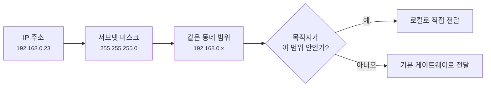
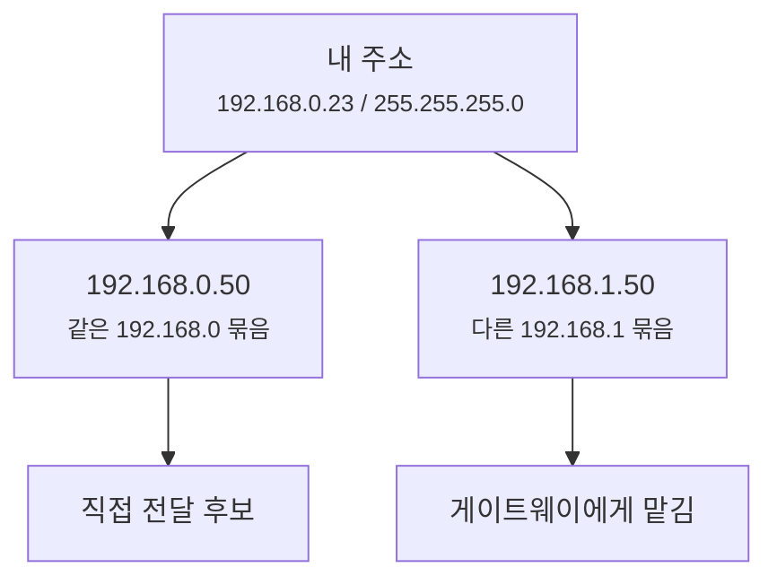
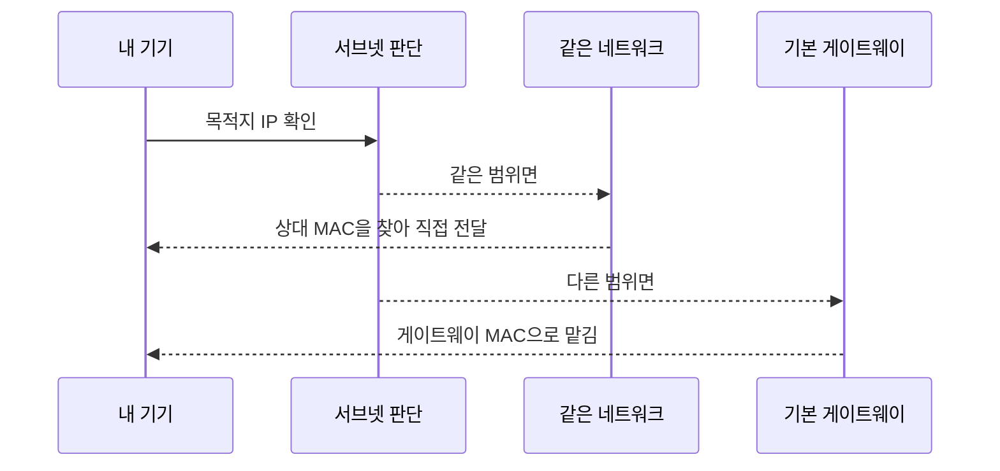

# 서브넷 마스크와 CIDR, 같은 동네인지 어떻게 판단할까요?

> `192.168.0.10` 과 `192.168.0.50` 은 같은 집 안 주소처럼 보이죠? **사실은 주소만 봐서는 아직 확정할 수 없어요.**

[공인 IP, 사설 IP, 그리고 NAT](11-public-private-ip-and-nat.md){ data-preview }에서는 집 안에서 `192.168.x.x` 같은 사설 IP를 쓴다는 걸 봤어요.
그리고 [공유기와 홈 네트워크](13-router-and-home-network.md){ data-preview }에서는 공유기가 집 안 기기들의 출구 역할을 한다는 것도 봤죠.

근데요, 여기서 아주 중요한 질문이 하나 남아요.

- 내 노트북이 `192.168.0.50` 으로 보낼 때, 이건 같은 집 안 기기일까요?
- `192.168.1.50` 은 가까워 보이는데, 정말 바로 보낼 수 있을까요?
- `255.255.255.0` 은 대체 왜 DHCP 설정에 같이 따라올까요?
- `/24` 라는 표기는 `255.255.255.0` 과 무슨 관계일까요?

오늘은 바로 이 빈칸을 채울 거예요.
키워드는 **서브넷 마스크**와 **CIDR**이에요.
여기서는 어려운 계산을 길게 하기보다, **"어디까지가 같은 동네인지 판단하는 기준"** 으로 먼저 잡아볼게요.

!!! note "이 글의 범위"
    여기서는 IPv4에서 가장 자주 만나는 서브넷 마스크와 CIDR 표기 감각을 볼게요.
    네트워크 주소, 브로드캐스트 주소, usable host range를 비트 단위로 계산하는 자세한 이야기는 [심화편의 서브넷 마스크와 CIDR 글](../deep-dive/subnet-mask-and-cidr.md){ data-preview }에서 더 깊게 열어볼게요.
    예전 A/B/C 클래스 주소 체계도 여기서는 이름만 짚고, 지금은 **CIDR 중심으로 생각하면 된다**는 정도로 둘게요.

---

## 주소의 동네 경계선을 먼저 그어볼게요

아파트 주소를 떠올려볼까요?

`서울시 강남구 아하아파트 101동 502호` 라는 주소가 있다고 해요.
여기서 "같은 동네"를 어디까지로 볼지는 상황에 따라 달라요.

- 같은 **아파트 단지**인가?
- 같은 **101동**인가?
- 같은 **층**인가?

주소 자체는 하나지만, **어디까지를 같은 묶음으로 볼지 정하는 기준**이 따로 있어야 하죠.
IP 주소도 비슷해요.

`192.168.0.23` 이라는 숫자만 있으면, 이 기기의 주소는 알 수 있어요.
하지만 **어디까지가 같은 로컬 네트워크인지**는 아직 몰라요.
그 경계를 알려주는 게 바로 서브넷 마스크예요.

| 부분 | 비유에서는 | 실제로는 |
|------|----------|----------|
| **IP 주소** | 내 집의 정확한 호수 | 기기의 주소 |
| **서브넷 마스크** | 같은 동네를 어디까지로 볼지 정하는 선 | 네트워크 부분과 호스트 부분을 나누는 기준 |
| **CIDR** | 경계를 짧게 적은 표기 | `/24`, `/16`, `/8` 같은 prefix 길이 |
| **같은 서브넷** | 같은 단지 안 | 직접 전달을 시도할 수 있는 로컬 네트워크 |
| **다른 서브넷** | 다른 동네 | 기본 게이트웨이에게 맡겨야 하는 목적지 |



이 그림에서 핵심은 간단해요.
**IP 주소는 내 자리이고, 서브넷 마스크는 동네 경계선**이에요.

---

## 서브넷 마스크는 뭐 하는 숫자일까요?

서브넷 마스크는 보통 이런 모양으로 보여요.

```text
IP 주소: 192.168.0.23
서브넷 마스크: 255.255.255.0
```

처음 보면 그냥 또 다른 IP 주소처럼 생겼죠?
하지만 역할은 달라요.

> **서브넷 마스크는 IP 주소 중 어디까지가 네트워크 이름이고, 어디부터가 기기 번호인지 나눠주는 표시예요.**

`255.255.255.0` 은 쉽게 말해 이렇게 읽을 수 있어요.

- 앞의 `192.168.0` 까지는 **같은 네트워크 묶음**
- 마지막 숫자 `23` 은 **그 안의 기기 번호**

그래서 `192.168.0.23` 과 `192.168.0.50` 은 같은 동네처럼 볼 수 있어요.
반면 `192.168.1.50` 은 비슷해 보여도, `255.255.255.0` 기준에서는 다른 동네예요.



정확히는 이 판단이 비트 단위로 일어나지만, 기본편에서는 먼저 이 감각이면 충분해요.
`255` 로 채워진 앞쪽은 네트워크를 묶는 쪽, `0` 으로 남은 뒤쪽은 그 안의 기기 번호 쪽이라고 보면 돼요.

---

## CIDR은 왜 `/24`처럼 짧게 쓸까요?

`255.255.255.0` 은 자주 쓰이지만 길어요.
그래서 같은 뜻을 더 짧게 이렇게 적기도 해요.

```text
192.168.0.23/24
```

여기서 `/24` 는 **앞에서부터 24비트가 네트워크 부분**이라는 뜻이에요.
IPv4 주소는 총 32비트라서, `/24` 라고 하면 앞 24비트는 동네 이름, 뒤 8비트는 그 동네 안의 기기 번호로 보는 거예요.

```text
192 . 168 . 0 . 23
 8     8    8    8   = 32비트
 └────┴────┴────      앞 24비트 = 네트워크 부분
                └──   뒤 8비트 = 기기 번호 부분
```

자주 보는 표기는 이렇게 연결돼요.

| CIDR | 서브넷 마스크 | 처음엔 이렇게 읽으면 돼요 |
|---|---|---|
| `/8` | `255.0.0.0` | 첫 번째 숫자까지 같은 큰 묶음 |
| `/16` | `255.255.0.0` | 앞 두 숫자까지 같은 묶음 |
| `/24` | `255.255.255.0` | 앞 세 숫자까지 같은 묶음 |

집에서는 `/24` 를 정말 자주 봐요.
예를 들어 `192.168.0.0/24` 라고 하면 보통 `192.168.0.x` 묶음을 떠올리면 돼요.

!!! tip "이것만 기억해도 충분해요"
    `/24` 는 어렵게 보면 비트 길이지만, 처음에는 **"앞 세 칸이 같은 동네 이름이고, 마지막 한 칸이 기기 번호구나"** 정도로 읽어도 괜찮아요.

---

## 같은 네트워크인지 왜 꼭 알아야 할까요?

이 판단은 뒤 글에서 계속 중요해져요.
기기가 패킷을 보내기 전에 먼저 이렇게 갈라야 하거든요.

1. **같은 네트워크 안인가?**
   - 그러면 상대방을 로컬에서 직접 찾아볼 수 있어요.
2. **다른 네트워크인가?**
   - 그러면 기본 게이트웨이에게 맡겨야 해요.



여기서 다음 글들이 자연스럽게 이어져요.

- [DHCP](17-dhcp.md){ data-preview }는 IP 주소와 함께 이 서브넷 정보를 나눠줘요.
- [ARP와 로컬 전달](18-arp-and-local-delivery.md#same-subnet-vs-gateway){ data-preview }은 같은 네트워크 안이면 상대 MAC을 찾는 장면이에요.
- [기본 게이트웨이와 첫 번째 도약](19-default-gateway-and-first-hop.md){ data-preview }은 다른 네트워크라면 게이트웨이에게 맡기는 장면이에요.

그러니까 서브넷 마스크는 설정 화면에 있는 낯선 숫자가 아니라,
**패킷을 직접 보낼지, 출구에게 맡길지 결정하는 기준표**예요.

---

## 그럼 주소 범위는 어떻게 감으로 잡을까요?

예를 들어 내 기기가 이렇게 설정되어 있다고 해볼게요.

```text
IP 주소: 192.168.0.23
CIDR:   /24
```

그러면 처음엔 이렇게 생각하면 돼요.

```text
같은 동네 이름: 192.168.0
그 안의 기기:  1 ~ 254 근처
```

왜 꼭 `1 ~ 254` 라고 애매하게 말하냐면, `192.168.0.0` 과 `192.168.0.255` 는 보통 특별한 의미로 쓰이기 때문이에요.
정확한 네트워크 주소와 브로드캐스트 주소, 실제 호스트 범위 이야기는 [심화편의 주소 범위 글](../deep-dive/network-broadcast-and-host-range.md){ data-preview }에서 더 자세히 열어볼게요.

기본편에서는 이렇게만 잡아도 충분해요.

| 설정 | 같은 네트워크처럼 보는 예 | 다른 네트워크처럼 보는 예 |
|---|---|---|
| `192.168.0.23/24` | `192.168.0.50` | `192.168.1.50` |
| `10.0.5.20/16` | `10.0.9.10` | `10.1.9.10` |
| `172.16.3.10/24` | `172.16.3.99` | `172.16.4.99` |

물론 실제 환경에서는 라우터 설정, VLAN, VPN, 회사 네트워크 정책이 더 끼어들 수 있어요.
하지만 기본 판단의 출발점은 늘 같아요.

> **내 IP와 목적지 IP를 서브넷 마스크 기준으로 비교해서, 같은 묶음인지 먼저 본다.**

---

## A, B, C 클래스는 지금도 외워야 할까요?

예전에는 IP 주소를 크게 A 클래스, B 클래스, C 클래스처럼 나눠 설명했어요.
그래서 이런 말을 들어본 적이 있을 수 있어요.

- A 클래스는 아주 큰 네트워크
- B 클래스는 중간 크기 네트워크
- C 클래스는 작은 네트워크

하지만 지금 인터넷을 이해할 때는, 이걸 주인공으로 두면 오히려 헷갈릴 수 있어요.
현대 네트워크에서는 보통 **CIDR 표기**, 그러니까 `/24`, `/20`, `/16` 같은 방식으로 범위를 더 유연하게 나눠요.

그래서 기본편에서는 이렇게만 기억해도 충분해요.

!!! note "A/B/C 클래스는 역사 표지판으로만 볼게요"
    A, B, C 클래스는 IP 주소를 나누던 예전 방식이에요.
    지금은 **이 주소가 몇 클래스인가**보다 **CIDR이 몇 비트까지 같은 네트워크로 보는가**가 훨씬 중요해요.
    클래스 체계가 왜 생겼고 왜 CIDR로 넘어왔는지는 심화편에서 따로 열어볼게요.

즉 `192.168.0.23` 을 보면 *"C 클래스네!"* 하고 멈추기보다,
`192.168.0.23/24` 처럼 **뒤에 붙은 prefix 길이**를 같이 보는 습관이 더 좋아요.

---

## 그럼 진짜 설정 화면에서는 어떻게 보일까요?

집 공유기나 컴퓨터 네트워크 설정 화면에서는 보통 이런 값들이 같이 보여요.

```text
IP 주소: 192.168.0.23
서브넷 마스크: 255.255.255.0
기본 게이트웨이: 192.168.0.1
DNS 서버: 192.168.0.1
```

이제 이 줄들을 이렇게 읽을 수 있어요.

| 항목 | 이렇게 읽으면 돼요 |
|---|---|
| IP 주소 | 내 기기의 현재 집 안 주소 |
| 서브넷 마스크 | 어디까지가 같은 집 안 네트워크인지 |
| 기본 게이트웨이 | 다른 네트워크로 갈 때 먼저 맡길 출구 |
| DNS 서버 | 이름을 IP 주소로 바꿔달라고 물어볼 곳 |

이 값들이 따로 노는 게 아니에요.
서브넷 마스크가 있어야 같은 네트워크인지 판단하고,
다른 네트워크라고 판단되면 기본 게이트웨이가 필요하고,
사용자가 이름으로 접속하면 DNS 서버도 필요해져요.

바로 그래서 다음 글의 DHCP가 이 값들을 한꺼번에 나눠주는 거예요.

---

## 자, 정리해볼까요?

!!! abstract "오늘 우리가 배운 것"
    - **IP 주소**는 기기의 주소이고, **서브넷 마스크**는 같은 네트워크 범위를 정하는 경계선이에요.
    - `255.255.255.0` 은 보통 `/24` 로도 적고, 처음에는 앞 세 칸이 같은 묶음이라고 읽으면 돼요.
    - 같은 서브넷 안이면 로컬에서 직접 전달을 시도하고, 다른 서브넷이면 기본 게이트웨이에게 맡겨요.
    - A/B/C 클래스는 예전 설명 방식이고, 지금은 CIDR 표기를 중심으로 보는 게 더 자연스러워요.
    - DHCP가 IP 주소뿐 아니라 서브넷 마스크와 기본 게이트웨이를 같이 주는 이유도 여기에 있어요.

이제 `255.255.255.0` 이 그냥 이상한 숫자처럼 보이진 않죠?
이 숫자는 우리 집 네트워크의 **동네 경계선**이에요.

그런데 아직 한 가지가 남았어요.
이 주소와 경계선을 매번 손으로 넣는다면 너무 귀찮지 않을까요?

---

## 다음 글 예고

와이파이에 붙자마자 인터넷이 되는 건, 누군가가 이 설정 묶음을 자동으로 건네주기 때문이에요.

> *"내가 주소도, 서브넷도, 게이트웨이도 입력한 적 없는데 노트북은 그걸 어떻게 알고 있을까요?"*

다음 글에서는 [DHCP, 우리 집 기기들은 자기 주소를 어떻게 자동으로 받을까요?](17-dhcp.md){ data-preview } 이야기를 통해,
복잡한 설정 없이도 기기들이 네트워크에 착착 붙는 비밀을 알아볼게요.
