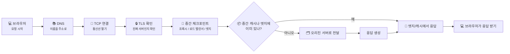
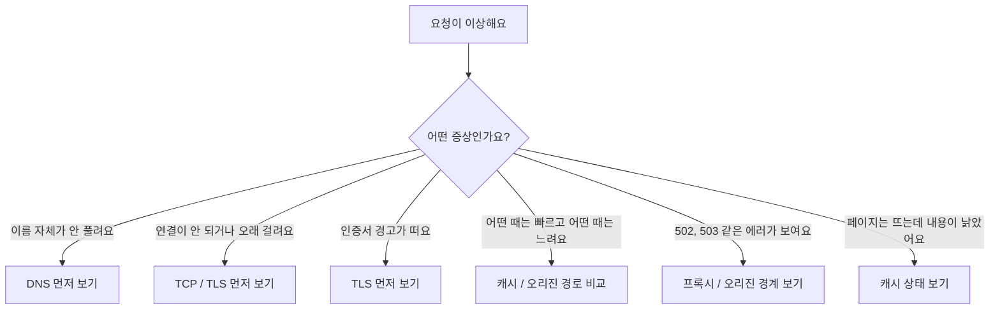
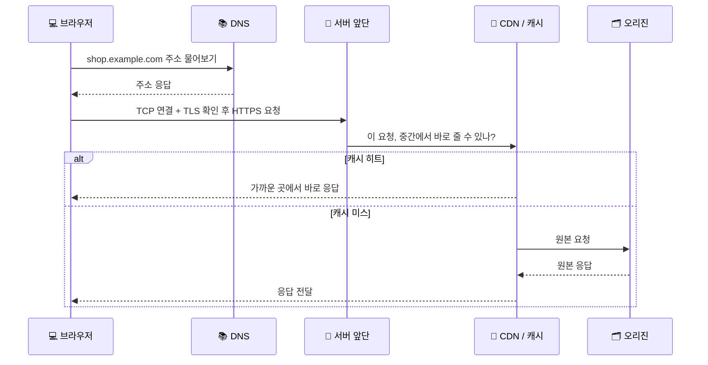

# End-to-End Request Debugging - 느린 요청은 어디서 막히고 있을까요?

> *"같은 요청 하나도, 어디에서 멈췄느냐에 따라 전혀 다른 문제처럼 보일 수 있어요."*

[CDN, Cache, 그리고 Edge Delivery](24-cdn-cache-and-edge-delivery.md){ data-preview }에서는
사용자 가까이에 복사본을 두면 왜 더 빨라질 수 있는지 봤어요.

근데요, 여기까지 보고 나면 이런 궁금증이 생기죠.

> *"좋아요. DNS도 알고, TLS도 알고, 프록시도 알고, CDN도 알겠어요. 근데 실제로 느린 요청 하나가 생기면, 이제 어디부터 봐야 하죠?"*

바로 그 질문에 답하는 글이 이번 글이에요.
이번에는 **브라우저에서 시작한 요청 하나를 끝까지 따라가면서**,
**어느 구간에서 시간이 쓰이고**, **어느 지점에서 문제가 생길 수 있는지** 를 한 장의 흐름으로 묶어볼게요.

참고로 여기서는 특정 회사의 설정 화면이나 특정 브라우저 버튼 이름보다,
**어떤 체크포인트를 어떤 순서로 보면 덜 헷갈리는지** 에 집중할게요.

---

## 일단 비유로 시작해볼게요

이번에는 큰 서점에 책 한 권을 주문한다고 상상해볼까요?

1. 먼저 **서점 이름으로 전화번호를 찾고**,
2. 실제로 **전화가 연결되고**,
3. **진짜 그 서점이 맞는지 확인**하고,
4. 주문은 **대표 안내 데스크**가 먼저 받고,
5. 가까운 지점에 책이 있으면 거기서 바로 꺼내주고,
6. 없으면 **본사 창고**까지 다시 확인하겠죠.

웹 요청도 꽤 비슷해요.

| 부분 | 비유에서는 | 실제로는 |
|------|----------|----------|
| **서점 이름으로 번호 찾기** | 전화번호부 조회 | **DNS 조회** |
| **전화 연결하기** | 실제 통화선 연결 | **TCP 연결** |
| **진짜 서점인지 확인** | 상호와 신분 확인 | **TLS 인증서 확인** |
| **대표 안내 데스크** | 먼저 주문을 받는 창구 | **리버스 프록시 / 로드 밸런서** |
| **가까운 지점 재고** | 근처 지점에 이미 책이 있음 | **CDN / 캐시 히트** |
| **본사 창고 확인** | 원본 재고 조회 | **오리진 서버** |
| **주문 진행 상황 확인** | 어디서 늦는지 추적 | **트러블슈팅 / 디버깅** |

핵심은 이거예요.
**요청 하나가 항상 끝까지 똑같은 길을 다 가는 건 아니에요.**
어떤 요청은 캐시에서 바로 끝나고,
어떤 요청은 오리진까지 깊숙이 들어가야 하죠.

---

## 요청 하나를 따라갈 때는 체크포인트로 보면 쉬워요

End-to-End Request Debugging을 어렵게 느끼는 가장 큰 이유는,
머릿속에 너무 많은 이름이 한꺼번에 떠오르기 때문이에요.

DNS, TCP, TLS, 프록시, CDN, 캐시, 오리진...
이걸 전부 따로 외우려고 하면 오히려 더 헷갈려요.

그래서 이렇게 보면 훨씬 쉬워져요.

**"이 요청은 지금 어느 체크포인트까지 갔지?"**

여기서 한 가지 먼저 짚고 갈게요.
이 순서는 **모든 서비스가 실제로 똑같은 장비 순서로 서 있다** 는 뜻이 아니라,
요청을 읽을 때 덜 헤매기 위한 **디버깅 체크리스트**에 더 가까워요.
현실에서는 CDN이 가장 앞에 설 수도 있고,
TLS를 엣지에서 끝낼 수도 있고,
프록시와 로드 밸런서 역할이 한곳에 겹쳐 있을 수도 있거든요.

이 그림이 좋은 이유는,
속도가 느리거나 에러가 났을 때 **어디에서 멈췄는지 질문하기 쉬워지기 때문**이에요.

예를 들면:

- DNS도 못 끝났다면 아직 서버는 만나지도 못한 거고,
- TLS에서 경고가 났다면 앱 코드까지 가기 전에 막힌 거고,
- 캐시에서 바로 끝났다면 오리진은 바쁘지 않았을 수 있어요.

즉, 디버깅은 **무작정 모든 걸 의심하는 일**이 아니라,
**체크포인트를 하나씩 지워가는 일**에 더 가까워요.

---

## 먼저, 어떤 증상인지부터 나눠볼까요?

현실에서는 "느려요" 한마디로 끝나는 경우가 많죠.
근데 사실 그 안에는 전혀 다른 종류의 문제가 섞여 있을 수 있어요.

그러니까 첫 질문은
**"왜 느리지?"** 가 아니라,
**"어떤 종류로 이상하지?"** 예요.

이 질문 하나만 잘해도,
처음부터 앱 코드만 뒤지거나 반대로 네트워크만 의심하는 실수를 꽤 줄일 수 있어요.

---

## DNS에서 이미 막힐 수도 있어요

[DNS는 어떻게 이름을 IP 주소로 바꿀까요?](04-dns.md#dns-role){ data-preview }와
[DNS 레코드는 왜 종류가 여러 갈래일까요?](10-dns-records.md#dns-records-role){ data-preview }에서 봤던 것처럼,
브라우저는 먼저 **이 이름이 어느 주소로 가야 하는지** 알아내야 해요.

이 단계에서 생길 수 있는 문제는 생각보다 단순해요.

- 이름 자체를 못 찾음
- 오래된 주소를 봄
- 조회가 너무 느림
- 가야 할 대상이 잘못 연결됨

여기서 중요한 건,
DNS 문제라면 **아직 HTTP 요청이 제대로 시작되기도 전일 수 있다**는 점이에요.

즉,

- 서버 로그에는 아무것도 안 남을 수도 있고,
- 애플리케이션은 억울하게 욕을 먹을 수도 있어요.

그래서 요청을 따라갈 때는 먼저
**"이름을 주소로 바꾸는 단계는 무사히 끝났나?"** 를 생각해보는 게 좋아요.

!!! tip "DNS는 '주소를 물어보는 단계'예요"
    이 단계가 느리면, 뒤에 있는 TCP, TLS, 프록시, 오리진이 아무리 멀쩡해도 사용자는 그냥 "사이트가 늦다"고 느낄 수 있어요.

---

## 연결은 됐는데 TLS에서 멈출 수도 있어요 { #tls-checkpoint }

이름을 주소로 잘 찾았다고 해서 끝은 아니에요.
이제는 실제로 **연결을 열고**, HTTPS라면 **신뢰할 수 있는 상대인지 확인**해야 하거든요.

[TCP 3-way handshake](09-tcp-3-way-handshake.md#handshake-signals){ data-preview }에서 본 연결 열기와,
[TLS, SSL, 인증서](07-tls-ssl-and-certificates.md#browser-verification-flow){ data-preview }에서 본 확인 과정이 여기서 다시 만나요.

여기서는 **TLS가 병목이 될 수 있다**는 감각까지만 잡고 갈게요. 만약 *"그 TLS 1.3 핸드셰이크 안에서 `ClientHello`, `ServerHello`, `Finished` 가 어떤 순서로 지나가는데요?"* 가 궁금해졌다면, 심화편 [TLS 1.3 핸드셰이크는 실제로 어떤 순서일까요?](../deep-dive/tls13-handshake-anatomy.md#full-handshake){ data-preview }에서 **대표적인 1-RTT 흐름 전체**를 이어서 볼 수 있어요.

이 단계에서 자주 나오는 장면은 이런 식이에요.

- DNS는 끝났는데 연결이 한참 안 열림
- 연결은 열리는데 인증서 경고가 뜸
- HTTPS 협상이 느려서 첫 응답이 늦게 시작됨

이럴 때 독자가 꼭 기억하면 좋은 건 하나예요.

**"서버가 느린 것처럼 보여도, 아직 서버 코드가 시작도 안 됐을 수 있다"** 는 점이죠.

예를 들어 TLS에서 오래 걸렸다면,
사용자는 그냥 하얀 화면을 기다리게 되지만,
그 시간은 앱이 HTML을 만드는 시간과는 다른 종류의 기다림이에요.

---

## 서버 앞단은 요청을 대신 받고 나눠 보내요

[Proxy, Reverse Proxy, 그리고 Load Balancer](23-proxy-reverse-proxy-and-load-balancer.md){ data-preview }에서 봤던 것처럼,
현실의 서비스는 브라우저가 곧바로 안쪽 앱 서버와 1:1로 말하는 그림이 아닐 때가 많아요.

중간에 **리버스 프록시**가 먼저 받고,
**로드 밸런서**가 어느 서버로 보낼지 고를 수도 있어요.

이 감각이 왜 중요하냐면,
에러가 보여도 그 에러를 **누가 만들었는지** 가 달라질 수 있기 때문이에요.

- 앞단에서 바로 막았는지
- 뒤 서버로 보내긴 했는데 거기서 실패했는지
- 뒤 서버가 아파서 다른 서버로 우회했는지

즉, 502나 503 같은 숫자를 봤다고 해서
곧바로 "앱 코드가 터졌네" 하고 단정하면 안 돼요.

어떤 경우엔 **앞단이 뒤 서버와 대화하다가 실패한 흔적**일 수도 있거든요.

그래서 여기서의 질문은 이거예요.

**"이 요청은 서버 입구에서 이미 이상했나, 아니면 안쪽까지 들어간 뒤 이상해졌나?"**

---

## 캐시에서 끝났는지, 오리진까지 갔는지가 갈려요

[CDN, Cache, 그리고 Edge Delivery](24-cdn-cache-and-edge-delivery.md){ data-preview }까지 보고 나면,
이제 요청을 볼 때 반드시 하나 더 떠올려야 해요.

> *"이 응답은 가까운 복사본에서 끝난 걸까요, 아니면 원본 서버까지 갔을까요?"*

이 차이는 체감 속도에도 크고,
원인 파악에도 아주 커요.

- **캐시 히트**면 엣지나 중간 캐시에서 바로 끝날 수 있고,
- **캐시 미스**면 오리진까지 다시 가야 하고,
- **오래된 복사본** 문제라면 내용은 보이는데 이상하게 낡아 보일 수도 있어요.

그래서 어떤 요청이 느릴 때는 단순히
"응답 시간이 길다"만 보면 부족해요.

함께 떠올려야 하는 건 이런 것들이죠.

- 이번엔 캐시 히트였나 미스였나
- 지난번과 같은 경로였나
- 응답 헤더에 캐시 흔적이 남아 있나
- 캐시가 오래된 사본을 보여준 건 아닌가

예를 들어 `Age`, `X-Cache`, `Cache-Status`, `Server-Timing` 같은 헤더는
환경에 따라 있을 수도 있고 없을 수도 있어요.
중요한 건 **이름을 외우는 것보다, "중간에서 끝났는지" 를 읽으려는 태도**예요.

!!! note "헤더가 없다고 꼭 이상한 건 아니에요"
    어떤 환경은 캐시 상태를 친절하게 보여주고, 어떤 환경은 거의 안 보여줘요. 그러니까 헤더는 좋은 단서이긴 하지만, 없다고 해서 바로 결론을 내리면 안 돼요.

---

## 오리진까지 갔는데도 느릴 수 있어요

여기까지 왔다면 이제 진짜 **원본을 만드는 쪽**까지 간 거예요.

이 단계에서는 비로소 이런 질문이 힘을 가지기 시작해요.

- 데이터베이스가 느린가?
- 외부 API를 오래 기다리나?
- 앱이 너무 많은 일을 한 번에 하나?
- 오류는 났지만 앞단이 대신 다른 형태로 보여주고 있나?

즉,
오리진 문제는 분명 중요하지만,
**항상 제일 먼저 의심해야 하는 문제는 아니라는 것**도 같이 기억해야 해요.

앞에서 봤던 DNS, 연결, TLS, 프록시, 캐시 중 하나에서 막혔는데,
곧바로 오리진부터 뒤지기 시작하면 시간이 많이 새거든요.

그래서 End-to-End Debugging의 좋은 습관은,
오리진을 무시하는 게 아니라
**오리진이 정말 범인일 때까지 차례대로 좁혀가는 것**이에요.

---

## 근데 왜? 굳이 이런 순서로 따라가야 할까요?

그냥 눈에 보이는 에러 메시지 하나 보고 찍어가면 안 될까요?

**사실은 위험해요.**

왜냐하면 같은 증상도 전혀 다른 이유로 생길 수 있기 때문이죠.

### 1. "느리다"는 말은 너무 넓어요

DNS가 느린 건지,
TLS 협상이 느린 건지,
캐시 미스라서 오리진까지 간 건지,
오리진 처리 자체가 느린 건지...

겉으로는 전부 그냥 **"느리다"** 로 보일 수 있어요.

### 2. 중간자가 많을수록 책임 구간도 나뉘어요

브라우저와 앱 서버 사이에는 생각보다 많은 중간자가 있을 수 있어요.
그래서 "서버가 이상하다"는 말만으로는 너무 많은 가능성을 한꺼번에 가리키게 돼요.

### 3. 체크포인트 순서가 있어야 엉뚱한 곳에서 헤매지 않아요

DNS도 안 된 요청을 들고 애플리케이션 로그를 몇 시간 보는 건 너무 억울하잖아요.

반대로 오리진이 진짜 느린데,
계속 인증서나 DNS만 만지는 것도 빗나간 수고고요.

즉, 이 순서는 이론을 멋있게 늘어놓으려는 게 아니라,
**덜 헤매기 위한 디버깅 동선**에 가까워요.

---

## 그럼 진짜 요청 하나를 같이 따라가볼까요?

이번에는 브라우저가 아래 요청을 보낸다고 상상해볼게요.

`https://shop.example.com/images/product-42.jpg`

이 요청은 어떤 날엔 빠르고,
어떤 날엔 느리고,
어떤 날엔 오래된 이미지처럼 보일 수도 있어요.

그럴 때는 이렇게 따라가면 돼요.

이 흐름을 디버깅 언어로 바꾸면 이래요.

1. **주소는 잘 찾았나?**
2. **연결과 TLS는 무사했나?**
3. **앞단에서 막히진 않았나?**
4. **캐시에서 끝났나, 오리진까지 갔나?**
5. **오리진까지 갔다면 거기서 오래 걸렸나?**

그리고 [패킷 캡처](12-packet-capture.md#capture-location-matters){ data-preview }에서 봤던 것처럼,
**어디에서 관찰했느냐** 도 같이 중요해요.

- 브라우저에서 본 건 브라우저 기준의 기다림이고,
- 중간 캐시에서 본 건 캐시 기준의 기다림이고,
- 서버 근처에서 본 건 오리진 기준의 기다림일 수 있어요.

그래서 End-to-End Debugging은
**단서를 많이 모으는 일**이기도 하지만,
동시에 **그 단서가 어느 지점의 관찰인지 구분하는 일**이기도 해요.

---

## 처음 볼 때는 이런 단서부터 챙기면 좋아요

처음부터 모든 로그와 모든 패킷을 한꺼번에 들여다보려 하면 금방 지쳐요.
그래서 초반엔 이 정도만 챙겨도 충분해요.

1. **요청이 실패한 위치에 가까운 증상**
   - 이름 해석 실패인지, 인증서 경고인지, 502/503인지, 그냥 느린지
2. **응답이 오기 전 시간이 길었는지, 응답 본문이 내려오는 시간이 긴지**
   - 첫 바이트가 늦은 건지, 내려받는 몸집이 큰 건지 감이 달라져요
3. **캐시 흔적이 보이는지**
   - 히트인지 미스인지, 오래된 사본인지
4. **같은 문제를 다른 위치에서도 똑같이 보는지**
   - 브라우저만 느린지, 서버 쪽에서도 느린지
5. **재전송이나 경로 문제 단서가 있는지**
   - [TCP 재전송과 신뢰성](21-tcp-retransmission-and-reliability.md#retransmission-symptoms){ data-preview }이나 [ICMP, Ping, 그리고 Traceroute](19-icmp-ping-and-traceroute.md#traceroute-ttl){ data-preview }에서 봤던 감각이 여기서 다시 도움돼요

핵심은
**"정답 도구"를 찾는 게 아니라, 먼저 층위를 좁히는 것** 이에요.

---

## 자, 정리해볼까요?

!!! abstract "오늘 우리가 배운 것"
    - **End-to-End Request Debugging** 은 요청 하나가 **DNS → 연결 → TLS → 서버 앞단 → 캐시 → 오리진** 중 어디까지 갔는지 따라가는 일이에요.
    - 같은 "느림" 이라도 DNS, TLS, 캐시 미스, 오리진 처리처럼 **원인은 전혀 다를 수 있어요.**
    - 그래서 첫 질문은 "왜 느리지?" 보다 **"어느 체크포인트까지는 무사했지?"** 에 가까워요.
    - 캐시에서 바로 끝난 요청과 오리진까지 깊게 들어간 요청은 **체감 속도도, 원인 파악 방식도 달라요.**
    - 중요한 건 특정 회사 화면을 외우는 게 아니라, **요청이 어디에서 멈췄고 그걸 어디에서 관찰했는지** 차근차근 구분하는 감각이에요.

결국 디버깅은 마법처럼 한 번에 정답을 찍는 일이 아니라,
**요청의 이동 경로를 한 칸씩 좁혀가며 "여기까지는 정상"을 늘려가는 일**이라고 보면 딱 맞아요.

---

## 다음 글 예고

여기까지 오면 또 이런 궁금증이 생기지 않으세요?

> *"좋아요. 이제 큰 동선은 알겠어요. 그럼 다음엔 이 흐름을 실제 캡처나 브라우저 화면에서 어떻게 더 침착하게 읽어내면 될까요?"*

여기까지가 기본편에서 한 번 닫는 큰 흐름이에요.
이제부터는 이 흐름 위에서 **장면 하나를 더 깊게 파고드는 심화편** 으로 들어가는 쪽이 더 자연스러워요.

예를 들면,

- 패킷 캡처를 실제 줄 단위로 더 읽어보는 글,
- 브라우저 네트워크 타이밍을 장면별로 해석해보는 글,
- 캐시 히트와 미스를 실제 응답 헤더로 구분해보는 글,
- 혹은 특정 장애 상황을 처음부터 끝까지 따라가는 실전형 글 같은 것들이죠.

그러니까 이번 글은 단순히 다음 순서를 기다리는 마침표라기보다,
**기본편의 큰 그림을 여기서 한 번 정리하고, 심화편으로 넘어가는 문**이라고 생각하면 좋아요.

더 깊이 들어가 보고 싶다면 [심화편 입구](../deep-dive/index.md){ data-preview }에서,
패킷 캡처, 브라우저 타이밍, 캐시 헤더, 장애 장면처럼 **한 장면을 더 깊게 읽는 글들**로 이어서 들어와 보세요.
