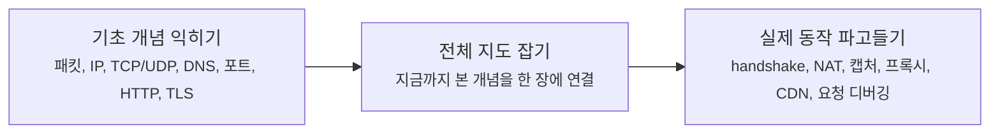

# 네트워크 기본편은 어디부터 읽으면 좋을까요?

> 네트워크는 조각 이름만 외우면 더 쉬워질 것 같죠? **사실은 조각을 순서대로 연결해보는 쪽이 훨씬 덜 헷갈려요.**

패킷, IP, TCP, DNS, NAT...
이름은 익숙한데 막상 읽으려면 **지금 나는 감부터 잡아야 하는지**, 아니면 **실제 구조를 더 깊게 봐도 되는지** 가 제일 헷갈리죠?

그래서 이 페이지는 글마다 설명을 길게 붙이는 대신,
**기본편 전체 흐름**을 한눈에 따라갈 수 있게 정리해둔 읽기 가이드예요.

참고로 여기서는 **처음부터 끝까지 차례대로 읽는 흐름**에 집중할게요.
심화편처럼 장면별로 더 깊게 들어가는 글은 [상위 Network 안내 페이지](../index.md){ data-preview }와 이후 [심화편 입구](../deep-dive/index.md){ data-preview }에서 따로 이어볼 수 있어요.

---

## 먼저, 어떤 방식으로 읽고 싶으세요?

사실 모든 분이 같은 지점에서 들어오는 건 아니잖아요.
지금 궁금한 방향에 따라 이렇게 시작하면 훨씬 덜 헤매요.

- **아직 네트워크가 낯설고, 감부터 잡고 싶어요**
→ [패킷이 뭐길래?](01-what-is-packet.md){ data-preview }부터 차근차근 읽는 게 가장 편해요.
  이쪽은 패킷, IP, TCP/UDP, DNS, 포트, HTTP, TLS를 먼저 친숙하게 연결해보는 구간이에요.
- **이미 큰 개념은 조금 아는데, 실제 구조와 동작이 더 궁금해요**
→ [OSI 7계층과 TCP/IP 모델](08-osi-and-tcp-ip-layers.md){ data-preview }부터 들어오면 좋아요.
여기서 전체 지도를 한 번 정리한 뒤에, TCP 3-way handshake, DNS 레코드, NAT, 패킷 캡처 같은 실제 메커니즘으로 들어가게 돼요.

근데요, **처음 읽는 분에게는 여전히 첫 글부터 시작하는 길이 제일 자연스러워요.**
뒤쪽 글은 앞에서 만든 직관을 바탕으로, 실제 필드와 상태, 신호로 번역하는 방식이기 때문이에요.

!!! tip "이렇게 읽으면 제일 덜 헷갈려요"
    - 처음이라면 [패킷이 뭐길래?](01-what-is-packet.md){ data-preview }부터 시작하고,
      이미 개념 감은 있다면 [OSI 7계층과 TCP/IP 모델](08-osi-and-tcp-ip-layers.md){ data-preview }부터 들어와도 괜찮아요.
    - 뒤쪽 글부터 읽다가 막히면, 앞쪽 글로 돌아가 감을 보충하면 돼요.

---

## 왜 읽는 길이 이렇게 이어질까요?

이 기본편은 그냥 번호만 늘어나는 구조가 아니에요.
앞에서는 **직관**을 만들고, 가운데에서 **전체 지도**를 잡고, 뒤에서는 **실제 메커니즘**을 열어봐요.

여기서 중요한 건 **[OSI 7계층과 TCP/IP 모델](08-osi-and-tcp-ip-layers.md){ data-preview }이 다리 역할**을 한다는 점이에요.

- **[패킷이 뭐길래?](01-what-is-packet.md){ data-preview }부터 [TLS, SSL, 인증서](07-tls-ssl-and-certificates.md){ data-preview }까지**: "이게 뭐지? 왜 필요하지?" 를 먼저 쉽게 익혀요.
- **[OSI 7계층과 TCP/IP 모델](08-osi-and-tcp-ip-layers.md){ data-preview }**: 지금까지 본 개념을 네트워크 전체 지도 위에 올려서, 어디쯤 있는 기술인지 연결해봐요.
- **[TCP 3-way handshake는 왜 세 번이나 주고받을까요?](09-tcp-3-way-handshake.md){ data-preview } 이후**: 이제는 "실제로는 어떤 신호, 숫자, 상태로 보일까?" 를 보는 구간이에요.

그러니까 뒤쪽 글은 앞쪽 글의 쉬운 설명을 다시 반복하는 게 아니라,
**앞에서 감으로 잡은 내용을 실제 구조로 번역하는 단계**라고 보면 딱 맞아요.

---

## 지금 읽을 수 있는 기본편 글은 이렇게 보면 돼요

여기만 보면 현재 공개된 기본편 흐름을 한 번에 파악할 수 있어요.

### 감부터 차근차근 잡는 구간

- [패킷이 뭐길래?](01-what-is-packet.md){ data-preview } — 인터넷 데이터는 왜 잘게 쪼개서 보낼까요?
- [IP 주소와 라우팅](02-ip-and-routing.md){ data-preview } — 그 작은 패킷은 어떻게 목적지를 찾아갈까요?
- [TCP vs UDP](03-tcp-vs-udp.md){ data-preview } — 도착 확인은 어떻게 하고, 왜 방식이 두 가지일까요?
- [DNS](04-dns.md){ data-preview } — `google.com` 같은 이름은 어떻게 주소로 바뀔까요?
- [포트와 소켓](05-ports-and-sockets.md){ data-preview } — 같은 컴퓨터 안에서 어느 앱으로 가야 하는지는 어떻게 구분할까요?
- [HTTP와 HTTPS](06-http-and-https.md){ data-preview } — 브라우저와 서버는 어떤 규칙으로 대화하고, 왜 HTTPS가 필요할까요?
- [TLS, SSL, 인증서](07-tls-ssl-and-certificates.md){ data-preview } — 브라우저는 어떻게 진짜 서버를 확인하고 보호된 통로를 준비할까요?

### 감과 구조를 연결하는 다리

- [OSI 7계층과 TCP/IP 모델](08-osi-and-tcp-ip-layers.md){ data-preview } — 지금까지 본 개념들은 네트워크 전체 지도에서 어디에 놓일까요?

### 실제 신호와 구조를 읽는 구간

- [TCP 3-way handshake](09-tcp-3-way-handshake.md){ data-preview } — TCP는 왜 연결 전에 세 번이나 주고받을까요?
- [DNS 레코드](10-dns-records.md){ data-preview } — A, AAAA, CNAME 같은 레코드는 왜 여러 종류로 나뉠까요?
- [공인 IP, 사설 IP, 그리고 NAT](11-public-private-ip-and-nat.md){ data-preview } — 집 안 주소와 바깥 주소는 왜 다르고, 공유기는 그 사이에서 무슨 일을 할까요?
- [패킷 캡처](12-packet-capture.md){ data-preview } — 같은 요청도 캡처 위치에 따라 왜 다르게 보이고, TCP와 NAT 흔적은 어디서 읽을 수 있을까요?
- [공유기와 홈 네트워크](13-router-and-home-network.md){ data-preview } — 우리 집 안 장비들은 실제로 어떤 구조로 연결되고, 공유기는 그 안에서 어떤 역할을 할까요?
- [포트 포워딩과 들어오는 연결](14-port-forwarding-and-incoming-connections.md){ data-preview } — 평소엔 닫혀 있는 집 안 문을, 어떤 경우에 왜 특정 장치 쪽으로 열어줘야 할까요?
- [방화벽과 상태 기반 필터링](15-firewall-and-stateful-filtering.md){ data-preview } — 들어오는 패킷이 친구인지 도둑인지, 공유기는 어떻게 똑똑하게 판단할까요?
- [DHCP](16-dhcp.md){ data-preview } — 우리 집 기기들은 자기 주소를 어떻게 자동으로 받을까요?
- [ARP와 로컬 전달](17-arp-and-local-delivery.md){ data-preview } — 주소는 받았는데, 같은 집 안의 진짜 목적지는 어떻게 찾을까요?
- [기본 게이트웨이와 첫 번째 도약](18-default-gateway-and-first-hop.md){ data-preview } — 게이트웨이에게 맡긴 패킷은 집을 나서는 순간 어떤 판단을 거칠까요?
- [ICMP, Ping, 그리고 Traceroute](19-icmp-ping-and-traceroute.md){ data-preview } — 패킷이 어디까지 갔는지, 어디서 막혔는지 네트워크는 어떻게 힌트를 줄까요?
- [MTU, Fragmentation, 그리고 Path MTU](20-mtu-fragmentation-and-path-mtu.md){ data-preview } — 길은 맞는데도 왜 어떤 패킷은 너무 커서 중간에서 문제를 만들까요?
- [TCP 재전송과 신뢰성](21-tcp-retransmission-and-reliability.md){ data-preview } — 중간에 패킷 하나가 사라지면, 네트워크는 어떻게 그 사실을 알고 다시 보내줄까요?
- [TCP Teardown과 TIME-WAIT](22-tcp-teardown-and-time-wait.md){ data-preview } — 대화가 끝난 뒤에 "이제 그만할게요"라고 인사하는 과정과, 왜 바로 주소를 재사용하지 않고 기다리는 시간이 필요한지 알아봐요.
- [Proxy, Reverse Proxy, 그리고 Load Balancer](23-proxy-reverse-proxy-and-load-balancer.md){ data-preview } — 사용자가 보는 서버와 실제로 일을 하는 서버가 왜 다를 수 있고, 앞단은 요청을 어떻게 대신 받고 나눠 보낼까요?
- [CDN, Cache, 그리고 Edge Delivery](24-cdn-cache-and-edge-delivery.md){ data-preview } — 같은 원본 서버만 매번 찾지 않고, 왜 사용자 가까운 곳에 복사본을 두고 더 빠르게 전달하려고 할까요?
- [End-to-End Request Debugging](25-end-to-end-request-debugging.md){ data-preview } — 브라우저에서 시작한 요청 하나가 DNS, 연결, TLS, 프록시, 캐시, 오리진을 지나며 어디서 시간이 쓰이고 어디서 문제가 생기는지 어떻게 따라가 볼 수 있을까요?

---

## 이 흐름을 끝까지 따라오면, 다음은 여기예요

기본편은 마지막 글에서 한 번 큰 그림을 닫아요.

> *"좋아요. 이제 인터넷이 어떻게 흘러가는지는 큰 그림으로 보이기 시작해요. 그럼 다음엔 그 장면을 더 깊게 읽어볼 차례 아니에요?"*

바로 그다음부터가 [심화편 입구](../deep-dive/index.md){ data-preview }예요.
이제부터는 패킷 캡처, 브라우저 타이밍, 캐시 헤더, 특정 장애 장면처럼 **장면 하나를 더 깊게 보는 글**로 들어가게 될 거예요.

---

## 자, 정리해볼까요?

!!! abstract "기본편은 이렇게 읽으면 돼요"
    - 처음이라면 첫 글부터 마지막 글까지 차례대로 읽는 게 가장 자연스러워요.
    - 이 기본편은 **직관 → 전체 지도 → 실제 요청 흐름** 순서로 깊어져요.
    - 마지막 글은 기본편의 마침표이자, 이후 심화편으로 넘어가는 다리 역할을 해요.

그럼, 기본편은 어디부터 읽어볼까요?

<a class="md-button md-button--primary" href="01-what-is-packet/">패킷부터 읽기</a>
<a class="md-button" href="25-end-to-end-request-debugging/">기본편 마지막 글 미리 보기</a>
