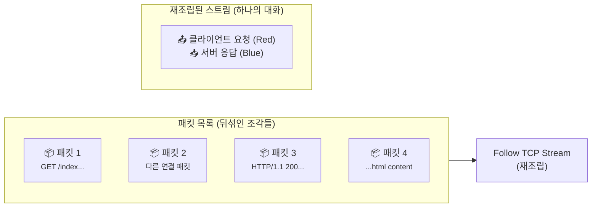
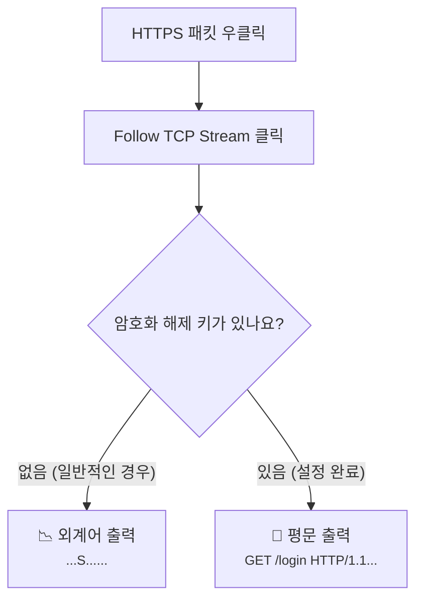

# Wireshark Follow Stream은 왜 대화문처럼 읽힐까요?

> 수만 장의 쪽지가 바닥에 뿌려져 있다면 읽기 힘들겠죠? **하지만 같은 사람끼리 주고받은 쪽지만 순서대로 모아두면, 비로소 하나의 편지가 돼요.**

[패킷 캡처는 뭘 보는 걸까요?](../basic/12-packet-capture.md){ data-preview }에서 우리는 패킷 캡처가 **특정 지점에서 찍힌 관찰 로그**라는 걸 배웠어요. 그리고 [tcpdump 한 줄은 어떻게 읽어야 할까요?](./tcpdump-first-look.md){ data-preview }에서는 그 로그의 한 줄 한 줄이 어떤 의미인지도 살펴봤죠. 이번 글은 그 기본편 12편의 Wireshark 쪽 장면을 한 칸 더 확대해서, **패킷 여러 줄을 하나의 대화로 다시 읽는 감각**에 집중해보는 심화편이에요.

근데 말이죠, 패킷 캡처를 하다 보면 이런 순간이 꼭 와요.

> *"한 줄씩 읽는 건 알겠는데, 그래서 이 사람들이 정확히 무슨 대화를 나눈 건가요? 요청이랑 응답만 딱 묶어서 한눈에 볼 순 없나요?"*

바로 이럴 때 쓰는 기능이 Wireshark의 **Follow TCP Stream**이에요.

이 글이 필요한 이유는, 패킷을 한 줄씩 읽는 감각과 **대화 전체를 복원해서 읽는 감각**이 다르기 때문이에요.

- 요청과 응답을 **한 덩어리 대화**로 보고 싶을 때
- `GET /...` 와 `HTTP/1.1 200 OK` 가 실제로 **어떤 연결에서 만났는지** 보고 싶을 때
- 패킷 목록의 잡음은 치우고 **한 연결의 애플리케이션 목소리만** 보고 싶을 때

오늘은 흩어진 패킷 조각들을 하나의 완성된 대화문으로 바꿔주는 이 기능의 실전 장면을 같이 열어볼게요.

!!! note "이 글의 범위"
    여기서는 Wireshark 메뉴를 처음부터 끝까지 다 훑지는 않을 거예요. 대신 **패킷 목록에서 한 연결을 골라 Follow Stream으로 묶어 읽는 감각**에만 집중할게요. 필터 문법 전체나 TLS 복호화 설정 자체를 길게 파고들기보다는, *"이 대화창이 지금 뭘 보여주고 있지?"* 를 읽는 데 필요한 장면부터 먼저 잡아볼게요.

---

## 그래서 Follow Stream은 한마디로 뭐예요?

Follow Stream은 **패킷 목록에서 한 연결의 애플리케이션 대화만 다시 재조립해서 보여주는 보기 모드**에 가까워요.

즉 패킷 목록이 시간순 관찰 로그라면, Follow Stream은 그중에서 **같은 연결의 말만 모아서 대화문처럼 보여주는 장면**이에요.

| 부분 | 비유에서는 | 실제로는 |
|------|----------|----------|
| **전체 패킷 목록** | 정신없이 올라오는 단톡방 | 시간순으로 섞여 있는 모든 패킷 |
| **TCP Stream** | 특정 두 사람 사이의 대화 맥락 | 같은 두 끝점 사이에서 이어진 하나의 TCP 연결 |
| **Follow Stream** | 1:1 대화방 들어가기 | 특정 연결의 데이터만 순서대로 합쳐 보기 |
| **대화 내용** | 말풍선 안의 텍스트 | 패킷에 실려 있던 실제 애플리케이션 데이터 |

즉, Follow Stream은 **"이 연결에서 오간 말만 다 모아와 봐!"** 라고 명령하는 것과 같아요.

---

## 흩어진 조각이 어떻게 대화가 될까요?

우리가 보는 패킷 목록 화면에서는 TCP 연결 하나가 수십, 수백 개의 패킷으로 쪼개져 있어요. Wireshark는 이 패킷들에 붙은 **순서 번호(Sequence Number)** 를 보고 마치 퍼즐을 맞추듯 원래의 데이터를 복원해내죠.



이 그림처럼 Wireshark는 우리가 선택한 패킷이 속한 **'대화의 줄기(Stream)'** 를 찾아서, 그 사이의 잡음을 다 제거하고 알맹이 데이터만 보여줍니다.

---

## 그럼 실제 Follow Stream 장면은 어떻게 생겼을까요?

가장 흔한 **평문 HTTP 통신** 장면을 예로 들어볼게요. Wireshark에서 패킷 하나를 우클릭하고 `Follow -> TCP Stream`을 누르면 짠! 하고 이런 창이 떠요.

```text
GET /welcome.txt HTTP/1.1
Host: example.com
User-Agent: curl/7.68.0
Accept: */*

HTTP/1.1 200 OK
Content-Type: text/plain
Content-Length: 13
Date: Wed, 20 May 2026 10:00:00 GMT

Hello, World!
```

이 화면을 볼 때 우리가 읽어내야 할 **세 가지 핵심 신호**가 있어요.

- **방향 색깔** — 지금 보이는 줄이 클라이언트 쪽 말인지, 서버 쪽 답장인지
- **애플리케이션 데이터** — 실제 요청 줄, 헤더, 본문이 어떤 문법으로 오갔는지
- **스트림 번호** — 지금 내가 보고 있는 대화가 캡처 전체에서 몇 번째 연결인지

### 1. 빨간색과 파란색 (방향의 신호) { #direction-colors }

Wireshark는 친절하게 색깔로 **두 방향을 구분**해줘요. (기본 설정 기준)

- **한 색깔**은 한쪽 방향으로 흘러간 데이터
- **다른 색깔**은 반대 방향으로 흘러간 데이터
- 보통은 이걸 보면서 *"아, 이 줄은 요청 쪽이구나"*, *"이건 답장 쪽이구나"* 하고 읽기 시작하면 돼요

즉 여기서 핵심은 **빨간색이 무조건 클라이언트, 파란색이 무조건 서버**라고 외우는 게 아니라, **지금 보고 있는 대화가 어느 쪽에서 어느 쪽으로 흘렀는지** 를 빠르게 가르는 거예요. 만약 화면이 거의 한 색깔뿐이라면? 적어도 한쪽 방향 데이터만 두드러지게 보이거나, 반대편 응답이 아주 적다는 뜻일 수 있겠죠.

### 2. 애플리케이션 계층의 진짜 목소리 { #app-data }

[tcpdump 한 줄](./tcpdump-first-look.md#one-line-anatomy){ data-preview }에서는 `Flags [P.]`, `length 517` 같은 간접적인 신호로만 짐작했죠.
하지만 여기서 우리는 `GET /welcome.txt` 같은 **진짜 요청 줄**과 `Hello, World!` 같은 **진짜 데이터**를 눈으로 직접 확인해요. 프로토콜이 약속한 문법이 제대로 오가고 있는지 바로 알 수 있는 거죠.

### 3. 스트림 인덱스 (대화방 번호) { #stream-index }

Wireshark는 각각의 TCP 연결에 `0`, `1`, `2` 같은 번호를 붙여요. Follow Stream 창 하단에 `Stream 0`이라고 적혀 있다면, 이건 이 캡처 파일에서 잡힌 **0번째 대화**라는 뜻이에요. 이 번호를 알면 나중에 필터 창에 `tcp.stream == 0` 이라고 쳐서 그 대화에 속한 패킷들만 다시 골라볼 수도 있어요.

---

## 근데 왜 굳이 이걸 봐야 할까요?

### 1. 앱 개발자의 논리 문제를 풀 때 최고예요

"서버가 에러를 줘요!"라고 할 때, 캡처를 해서 Follow Stream을 열어보세요.
내가 보낸 JSON 데이터에 오타가 있지는 않은지, 서버가 주는 에러 메시지가 사실은 "인증 토큰이 만료됐어"라고 친절하게 말하고 있지는 않은지 바로 보이거든요.

### 2. 프로토콜이 꼬인 지점을 찾기 좋아요

요청은 하나인데 응답이 두 번 오거나, 응답 헤더 끝에 이상한 쓰레기 값이 붙어 오는 등의 미세한 버그를 잡을 때는 한 줄짜리 로그보다 이 대화문 뷰가 훨씬 강력해요.

---

## 주의! 모든 대화가 다 읽히는 건 아니에요 { #pitfalls }

Follow Stream을 썼을 때 가장 당황스러운 순간은 바로 **HTTPS(TLS)** 통신을 볼 때예요.



위 그림처럼 암호화된 통신은 Follow Stream을 해도 **읽을 수 없는 바이너리 데이터**만 보여요. 이건 Wireshark의 잘못이 아니라, 중간에서 누가 엿보지 못하게 꽁꽁 싸매놓은 TLS의 보안 기능 때문이죠.

!!! warning "함정에 빠지지 마세요"
    - **Follow Stream은 실시간이 아니에요.** 캡처가 진행 중인 동안 창을 열어둬도, 새로 들어오는 패킷이 자동으로 창에 추가되지는 않아요. 창을 닫고 다시 열어야 최신 대화까지 반영돼요.
    - **색깔을 역할 이름으로 너무 딱 고정해 읽지 마세요.** 여기서 중요한 건 '누가 클라이언트냐' 자체보다, **두 방향이 서로 어떻게 오가고 있는지** 예요.
    - **순서가 섞여 보일 수도 있어요.** 드물게 네트워크 상태가 아주 안 좋아서 재전송이 심하게 일어나면, Wireshark가 재조립에 실패해서 데이터가 중복되거나 비어 보일 수 있어요.

---

## 자, 정리해볼까요?

!!! abstract "오늘 우리가 배운 것"
    - **Follow TCP Stream**은 흩어진 패킷들을 하나의 연결(Stream) 단위로 묶어 대화문처럼 보여주는 기능이에요.
    - **두 색깔은 서로 반대 방향의 흐름**을 보여줘서, 누가 먼저 말하고 누가 답했는지 감을 잡기 좋아요.
    - 애플리케이션이 주고받은 **진짜 데이터(HTTP 헤더, 본문 등)**를 직접 확인할 수 있어요.
    - **HTTPS**는 암호화 키가 없으면 읽을 수 없는 외계어로 보인다는 점을 꼭 기억하세요!

처음엔 패킷 하나하나의 숫자가 무서웠을지도 몰라요. 하지만 Follow Stream이라는 돋보기를 들고 나면, 네트워크는 더 이상 차가운 숫자의 나열이 아니라 **장비들이 나누는 친절한(혹은 까칠한) 대화**로 보이기 시작할 거예요.

---

## 이어서 보면 좋은 글

- 기본편에서 패킷 캡처의 큰 그림부터 다시 잡고 싶다면 — [패킷 캡처는 뭘 보는 걸까요?](../basic/12-packet-capture.md){ data-preview }
- Follow Stream으로 묶기 전, 패킷 한 줄의 뼈대부터 보고 싶다면 — [tcpdump 한 줄은 어떻게 읽어야 할까요?](./tcpdump-first-look.md){ data-preview }
- 대화문이 아니라 패킷의 비트 단위 칸을 해부해보고 싶다면 — [TCP 헤더는 왜 이렇게 칸이 많을까요?](./tcp-header-anatomy.md){ data-preview }
- 캡처 화면에서 handshake 표식이 어떻게 보이는지 다시 붙여보고 싶다면 — [TCP 플래그는 어떻게 읽어야 할까요?](./tcp-flags-cheatsheet.md#common-combinations){ data-preview }
