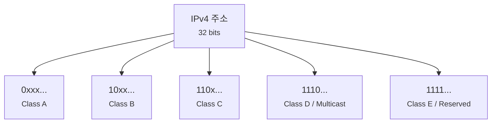
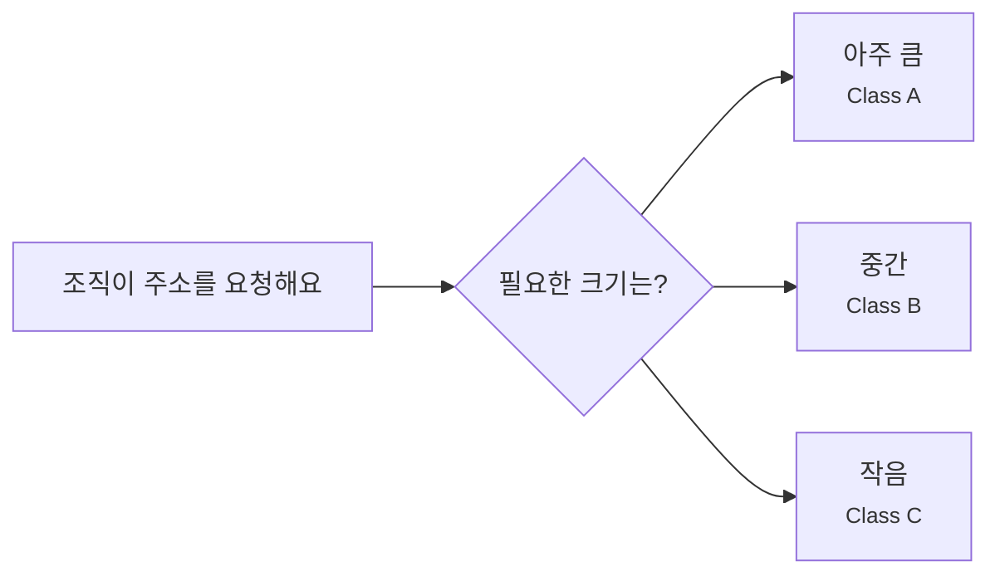
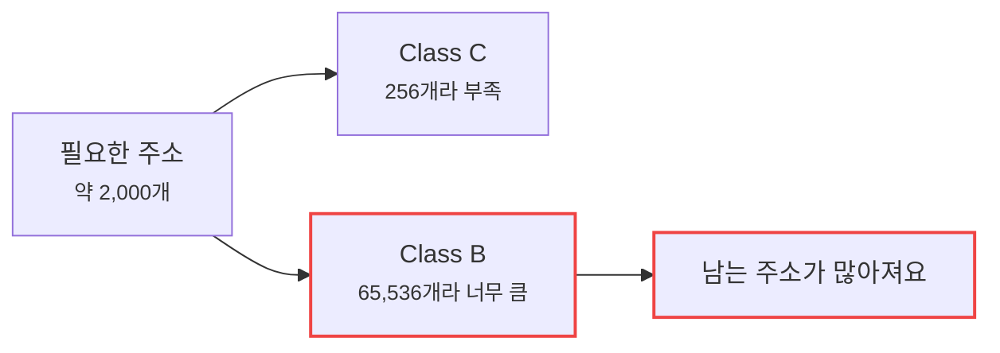
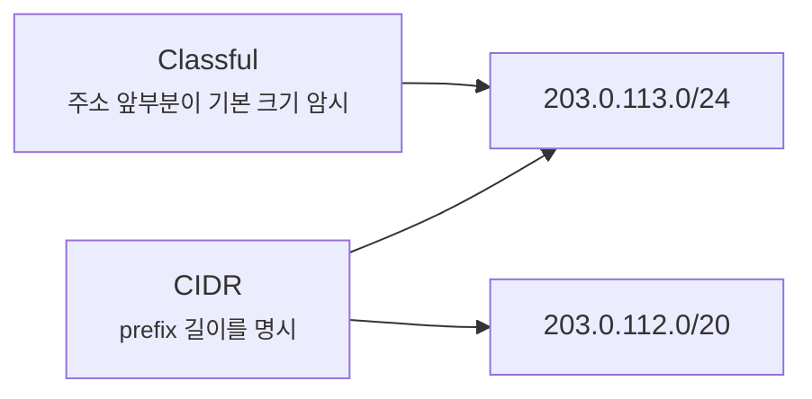
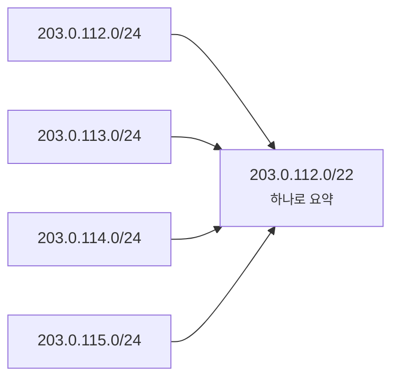

# A/B/C 클래스 주소 체계는 왜 CIDR로 바뀌었을까요?

> 예전에는 IP 주소의 첫 숫자만 보고 네트워크 크기를 짐작했어요. **지금은 그렇게 읽으면 오히려 길을 잘못 잡기 쉬워요.**

[IP 주소와 라우팅](../basic/02-ip-and-routing.md){ data-preview }에서는 IPv4 주소를 `142.250.196.78`처럼 점 4개로 나뉜 숫자로 봤어요.
그리고 [공인 IP, 사설 IP, 그리고 NAT](../basic/11-public-private-ip-and-nat.md#public-vs-private-ip){ data-preview }에서는 `10.0.0.0/8`, `172.16.0.0/12`, `192.168.0.0/16` 같은 사설 주소 범위를 봤죠.

근데요, 네트워크를 조금 찾아보다 보면 이런 말을 만나게 돼요.

- `10.x.x.x`는 A 클래스예요.
- `172.16.x.x`는 B 클래스 쪽이에요.
- `192.168.x.x`는 C 클래스예요.
- C 클래스니까 마스크는 `255.255.255.0`이죠?

익숙해 보이지만, 마지막 문장은 조심해야 해요.
오늘날에는 `192.168.0.0/16`처럼 `192.168`으로 시작해도 `/16`으로 쓸 수 있고, `10.10.12.0/24`처럼 `10`으로 시작해도 `/24`로 쓸 수 있거든요.

오늘은 **클래스 주소 체계가 한마디로 무엇이었는지**, **왜 처음에는 그런 방식이 자연스러웠는지**, **왜 인터넷이 커지면서 CIDR로 넘어갔는지**, 그리고 **지금 주소를 읽을 때 무엇을 기준으로 삼아야 하는지** 같이 볼게요.
초기 IPv4 주소 형식은 [RFC 791 3.2절](https://www.rfc-editor.org/rfc/rfc791#section-3.2)의 주소 설명을 출발점으로 보고, CIDR 전환의 문제의식은 [RFC 1519](https://www.rfc-editor.org/info/rfc1519/)와 그 후속 정리인 [RFC 4632](https://www.rfc-editor.org/rfc/rfc4632)를 기준으로 잡을게요.

!!! note "이 글의 범위"
    여기서는 **IPv4의 classful addressing에서 CIDR로 넘어간 이유**를 큰 흐름으로 볼게요.
    BGP 경로 전파, RIR 주소 할당 정책, 실제 인터넷 라우팅 테이블 운영까지 깊게 들어가지는 않아요.
    그쪽은 뒤에서 longest prefix match와 경로 선택을 볼 때 더 자연스럽게 이어질 거예요.

---

## 왜 아직도 A/B/C 클래스 이야기가 나올까요?

클래스 주소 체계는 오래된 설명 방식인데, 아직도 교재나 네트워크 설정 글에서 자주 보여요.
이유는 간단해요.
처음 배울 때는 숫자 첫 칸으로 대략적인 크기를 나누는 방식이 꽤 직관적으로 보이거든요.

예전 감각은 대충 이랬어요.

| 클래스 | 첫 비트 감각 | 전통적인 네트워크 크기 | 처음 읽는 느낌 |
|---|---|---|---|
| Class A | `0...` | `/8` | 아주 큰 조직 하나에 큰 덩어리 |
| Class B | `10...` | `/16` | 중간 규모 조직에 중간 덩어리 |
| Class C | `110...` | `/24` | 작은 조직에 작은 덩어리 |
| Class D | `1110...` | 멀티캐스트 | 일반 호스트 주소가 아님 |
| Class E | `1111...` | 예약 영역 | 일반 사용 주소가 아님 |

여기까지만 보면 꽤 단순하죠.
첫 숫자 범위로 “큰 네트워크인지, 중간인지, 작은지”를 빠르게 나눌 수 있으니까요.

문제는 이 단순함이 너무 거칠었다는 데 있어요.
인터넷이 작을 때는 괜찮아 보였지만, 연결되는 조직과 네트워크가 늘어나면서 낭비와 라우팅 테이블 문제가 같이 커졌어요.

---

## 클래스 방식은 한마디로 뭐였을까요?

짧게 잡으면 이래요.

> **클래스 주소 체계는 IPv4 주소의 앞쪽 비트 모양만 보고 네트워크 크기를 미리 정해두는 방식이었어요.**

| 기본편에서 잡은 감각 | 예전 클래스 방식에서는 | 지금 CIDR 방식에서는 |
|---|---|---|
| IP 주소 | 첫 비트로 A/B/C 큰 틀을 먼저 판단 | 주소와 prefix 길이를 함께 봄 |
| 네트워크 크기 | `/8`, `/16`, `/24` 같은 고정 크기에 가까움 | `/13`, `/20`, `/27`처럼 필요한 만큼 조절 |
| 주소 할당 | 큰 상자 몇 종류 중 하나를 받음 | 더 잘 맞는 크기의 상자를 받음 |
| 라우팅 표기 | 주소 자체에서 기본 마스크를 추정 | `203.0.113.0/24`처럼 prefix를 명시 |
| 지금의 쓰임 | 역사적 설명, 오래된 용어 | 실제 운영과 라우팅의 기본 언어 |

비유로 보면 클래스 방식은 이래요.
이사할 사람에게 집을 줄 때, 선택지가 세 종류밖에 없는 거예요.

- 아주 큰 건물
- 중간 건물
- 작은 건물

그런데 필요한 공간이 2,000명분이라면 어떻게 될까요?
작은 건물은 부족하고, 중간 건물은 너무 커요.
결국 중간 건물을 통째로 받지만 대부분을 비워두게 되죠.

CIDR은 이 문제를 줄이려고 **필요한 크기에 더 가까운 주소 묶음**을 줄 수 있게 만든 방식에 가까워요.

---

## 예전 클래스 경계는 실제로 어떻게 나뉘었을까요? { #classful-boundaries }

IPv4 주소는 32비트예요.
클래스 방식은 이 32비트의 맨 앞 비트를 보고 큰 종류를 나눴어요.



이 그림에서 핵심은 **주소 안에 네트워크 크기 힌트가 박혀 있었다**는 점이에요.
별도 prefix를 붙이지 않아도, 첫 비트 패턴으로 기본 크기를 짐작하는 식이었죠.

표로 보면 이렇게 잡을 수 있어요.

| 클래스 | 시작 비트 | 첫 octet 범위 | 전통적 prefix | 주소 개수 감각 |
|---|---|---:|---:|---:|
| Class A | `0` | `0` ~ `127` | `/8` | 약 1,677만 개 |
| Class B | `10` | `128` ~ `191` | `/16` | 65,536개 |
| Class C | `110` | `192` ~ `223` | `/24` | 256개 |
| Class D | `1110` | `224` ~ `239` | 멀티캐스트 | 일반 호스트용 아님 |
| Class E | `1111` | `240` ~ `255` | 예약 | 일반 호스트용 아님 |

!!! warning "지금은 이 표만으로 마스크를 확정하면 안 돼요"
    이 표는 **역사적 classful 기준**을 보여주는 표예요.
    지금 실제 네트워크에서는 `10.10.12.0/24`, `172.16.0.0/20`, `192.168.0.0/16`처럼 prefix를 따로 붙여서 읽는 게 기본이에요.
    그러니까 첫 숫자는 힌트일 수 있어도, 최종 판단은 `/24`, `/20`, `/16` 같은 prefix가 해요.

---

## 클래스 방식은 왜 처음엔 그럴듯했을까요?

처음부터 이상한 방식이었던 건 아니에요.
초기 인터넷에서는 네트워크 수도 지금보다 훨씬 적었고, 주소를 쓰는 조직도 제한적이었어요.
그때는 몇 가지 크기의 상자로 나눠도 운영이 단순해지는 장점이 있었죠.



이 방식의 장점은 설명과 판단이 쉬웠다는 거예요.
라우터나 운영자가 주소의 앞부분을 보고 **"대충 이 정도 크기 네트워크구나"** 하고 추정할 수 있었으니까요.

하지만 쉬운 규칙은 대개 유연하지 않아요.
인터넷이 커지자, 바로 그 고정 크기가 문제가 됐어요.

---

## 어디서 낭비가 생겼을까요?

가장 큰 문제는 **필요한 크기와 받을 수 있는 크기가 잘 안 맞았다**는 점이에요.

예를 들어 어떤 조직이 호스트 주소 2,000개 정도를 필요로 한다고 해볼게요.

- Class C 하나는 256개라 부족해요.
- Class B 하나는 65,536개라 너무 커요.

그럼 예전 방식에서는 Class B를 받는 쪽으로 기울기 쉬웠어요.
하지만 실제로는 2,000개만 써도 되는데 65,536개짜리 큰 묶음을 받는 셈이죠.



이건 개인에게만 손해인 문제가 아니에요.
IPv4 주소는 전체 개수가 정해져 있으니, 큰 덩어리를 필요 이상으로 나눠주면 전체 주소 공간이 빨리 줄어들어요.

그리고 또 하나의 문제가 있었어요.
작은 Class C 여러 개를 많이 나눠주면 주소 낭비는 줄어들 수 있지만, 라우터가 기억해야 할 경로가 많아져요.
즉 **주소 낭비**와 **라우팅 테이블 증가**가 동시에 압박으로 온 거예요.

---

## CIDR은 무엇을 바꿨을까요?

CIDR은 Classless Inter-Domain Routing의 줄임말이에요.
이름 그대로 **클래스 없이 prefix 길이로 주소 묶음을 읽는 방식**이에요.

예전에는 이런 식으로 생각했어요.

```text
192로 시작하네? Class C니까 /24겠네.
```

CIDR에서는 이렇게 읽어요.

```text
192.168.0.0/20
앞 20비트가 네트워크 prefix예요.
```

즉 주소의 첫 숫자가 아니라, 뒤에 붙은 `/20`이 범위를 결정해요.



이 그림에서 보듯 CIDR에서는 같은 `203`으로 시작하는 주소라도 `/24`일 수도 있고 `/20`일 수도 있어요.
중요한 건 **주소 자체가 아니라 prefix 길이를 함께 읽는 것**이에요.

---

## 왜 CIDR이 주소를 더 알뜰하게 쓰게 해줬을까요?

CIDR은 필요한 크기에 더 가까운 주소 블록을 줄 수 있게 해줘요.
예를 들어 2,000개 정도 주소가 필요하다면, `2^11 = 2048`이니까 `/21` 블록이 꽤 잘 맞아요.

| 필요한 주소 규모 | 클래스 방식에서 흔한 고민 | CIDR식으로 더 가까운 크기 |
|---:|---|---|
| 약 200개 | Class C 하나면 대체로 맞음 | `/24` |
| 약 2,000개 | Class C는 부족, Class B는 너무 큼 | `/21` |
| 약 8,000개 | Class B를 받기엔 낭비가 큼 | `/19` |
| 약 60,000개 | Class B와 비슷함 | `/16` |

`/21`은 호스트 비트가 11개니까 전체 주소가 2,048개예요.
Class B의 65,536개보다 훨씬 덜 낭비되죠.

여기서 [네트워크 주소와 호스트 범위 글](./network-broadcast-and-host-range.md){ data-preview }에서 봤던 계산이 그대로 이어져요.
prefix가 짧아질수록 주소 묶음은 커지고, prefix가 길어질수록 주소 묶음은 작아져요.

---

## CIDR은 라우팅 표도 줄여줬어요

CIDR의 또 다른 핵심은 **주소를 잘 모으면 라우팅 표 한 줄로 표현할 수 있다**는 점이에요.

예를 들어 아래 네 개의 `/24`가 연속해서 붙어 있다고 해볼게요.

```text
203.0.112.0/24
203.0.113.0/24
203.0.114.0/24
203.0.115.0/24
```

이 네 묶음은 하나로 합쳐서 이렇게 광고할 수 있어요.

```text
203.0.112.0/22
```



이걸 보통 route aggregation, route summarization 같은 말로 불러요.
처음에는 이름보다 감각이 중요해요.
**연속된 주소 묶음을 더 큰 prefix 하나로 묶어서, 라우터가 기억해야 할 줄 수를 줄이는 것**이에요.

RFC 1519와 RFC 4632가 강조한 문제도 바로 이쪽이에요.
IPv4 주소를 아끼는 것뿐 아니라, 전 세계 라우터들이 들고 다녀야 하는 경로 정보가 폭발적으로 늘어나는 것도 막아야 했거든요.

---

## 사설 IP 범위는 클래스와 헷갈리기 쉬워요 { #private-range-vs-class }

이제 [공인 IP, 사설 IP, 그리고 NAT](../basic/11-public-private-ip-and-nat.md){ data-preview }에서 본 사설 주소 범위를 다시 볼게요.

| 사설 주소 범위 | CIDR 표기 | 흔한 오해 |
|---|---|---|
| `10.0.0.0` ~ `10.255.255.255` | `10.0.0.0/8` | “A 클래스라서 항상 `/8`로 써야 한다” |
| `172.16.0.0` ~ `172.31.255.255` | `172.16.0.0/12` | “172로 시작하면 전부 사설이다” |
| `192.168.0.0` ~ `192.168.255.255` | `192.168.0.0/16` | “C 클래스니까 항상 `/24`다” |

여기서 조심할 점이 있어요.
RFC 1918 사설 주소 범위는 **사설로 예약된 큰 범위**를 말해요.
내 집이나 회사가 그 안에서 실제로 어떤 크기의 서브넷을 쓰는지는 별개예요.

예를 들어 집 공유기는 흔히 이렇게 써요.

```text
LAN network: 192.168.0.0/24
```

하지만 회사나 실험 환경에서는 이렇게 잡을 수도 있어요.

```text
LAN network: 192.168.0.0/23
VPN network: 10.40.16.0/20
Server subnet: 10.40.18.0/24
```

`10`으로 시작한다고 무조건 거대한 `/8` 하나로 운영하는 게 아니고,
`192.168`으로 시작한다고 무조건 `/24`만 가능한 것도 아니에요.
**사설 주소 범위는 큰 땅이고, 실제 서브넷은 그 안에서 다시 잘라 쓰는 구획**이라고 보면 돼요.

---

## 지금은 어떻게 읽어야 할까요?

현대 네트워크에서 안전한 읽기 순서는 이래요.

1. **IP 주소만 보지 말고 prefix를 같이 봐요.**
   - `10.10.12.73/26`처럼 `/26`이 붙어야 범위가 결정돼요.
2. **사설 주소인지 공인 주소인지 구분해요.**
   - `10.0.0.0/8`, `172.16.0.0/12`, `192.168.0.0/16` 안인지 봐요.
3. **실제 서브넷 크기는 class 이름이 아니라 prefix로 판단해요.**
   - `/24`, `/20`, `/27`이 진짜 경계선이에요.
4. **라우팅에서는 더 구체적인 prefix가 이길 수 있다는 걸 준비해요.**
   - 이건 다음 IP 주소 글의 핵심 질문이에요.

```mermaid
flowchart TD
    A[IP를 봤어요] --> B{prefix가 같이 있나요?}
    B -->|예| C[/24, /20, /26 같은<br/>CIDR 기준으로 범위 판단]
    B -->|아니오| D[문맥을 더 찾아요<br/><small>설정, 라우팅 표, DHCP 정보</small>]
    C --> E{사설 범위인가요?}
    E -->|예| F[내부망 / NAT / VPN 문맥도 같이 확인]
    E -->|아니오| G[공인 라우팅 문맥 확인]
```

이 그림은 단순하지만 중요해요.
주소만 외워서 맞히는 방식이 아니라, **주소 + prefix + 문맥**을 함께 읽는 쪽으로 넘어와야 해요.

---

## 여기서 자주 헷갈리는 함정들

### `192.168.x.x`라서 무조건 `/24`는 아니에요

집 공유기에서 `/24`를 많이 쓰니까 그렇게 느껴질 뿐이에요.
`192.168.0.0/23`처럼 두 개의 `/24`를 붙여 더 넓게 쓸 수도 있고, `192.168.10.0/27`처럼 더 작게 쓸 수도 있어요.

### `172.x.x.x`가 전부 사설 주소는 아니에요

사설 범위는 `172.16.0.0/12`, 즉 `172.16.0.0`부터 `172.31.255.255`까지예요.
`172.15.x.x`나 `172.32.x.x`는 그 사설 범위 밖이에요.
이건 `172`라는 첫 숫자만 보면 놓치기 쉬운 부분이에요.

### “클래스 C 네트워크”라는 말은 문맥을 확인해야 해요

현장에서는 아직도 `C 클래스 하나`라는 말을 “`/24` 하나”라는 뜻으로 느슨하게 쓰는 경우가 있어요.
하지만 엄밀한 classful 주소 체계와 현대 CIDR 운영은 같은 말이 아니에요.
누군가 “C 클래스”라고 말하면, 실제 설정에서는 **정말 `/24`를 뜻하는지** 확인하는 편이 좋아요.

### CIDR은 서브넷 표기만이 아니라 라우팅 표기이기도 해요

`203.0.112.0/22`는 단순히 주소 개수만 말하는 표기가 아니에요.
라우터에게는 **이 prefix에 속한 목적지는 이쪽으로 보내라**는 경로 표기이기도 해요.
그래서 다음에는 여러 prefix가 겹칠 때 어떤 경로가 선택되는지를 봐야 해요.

---

## 자, 정리해볼까요?

!!! abstract "오늘 우리가 배운 것"
    - 예전 classful 방식은 IPv4 주소의 앞 비트로 A/B/C 같은 큰 종류와 기본 크기를 나눴어요.
    - Class A는 `/8`, Class B는 `/16`, Class C는 `/24`에 가까운 고정 크기 감각이 있었어요.
    - 이 방식은 필요한 크기와 실제 할당 크기가 잘 맞지 않아 IPv4 주소 낭비를 키웠어요.
    - CIDR은 클래스 대신 `/20`, `/24`, `/26` 같은 prefix 길이로 주소 범위를 명시해요.
    - CIDR은 주소를 더 알뜰하게 나눌 뿐 아니라, 연속된 경로를 하나로 요약해 라우팅 테이블 증가도 줄여줘요.
    - 지금은 첫 숫자나 클래스 이름보다 **주소 + prefix + 문맥**을 함께 읽는 게 훨씬 안전해요.

이제 `192.168`으로 시작한다고 무조건 `/24`라고 읽으면 안 되는 이유가 보이죠?
예전 클래스 이름은 역사 표지판이고, 지금 실제 경계선은 CIDR prefix예요.

---

## 이어서 보면 좋은 글

- [서브넷 마스크와 CIDR은 실제로 어떻게 계산할까요?](./subnet-mask-and-cidr.md){ data-preview } — `/24`와 `255.255.255.0`이 같은 뜻인 이유를 비트 단위로 다시 잡을 수 있어요.
- [네트워크 주소, 브로드캐스트 주소, 호스트 범위는 어떻게 나뉠까요?](./network-broadcast-and-host-range.md){ data-preview } — prefix가 정해졌을 때 실제 시작 주소와 끝 주소를 계산하는 법을 이어서 볼 수 있어요.
- [공인 IP, 사설 IP, 그리고 NAT는 왜 같이 나올까요?](../basic/11-public-private-ip-and-nat.md){ data-preview } — RFC 1918 사설 주소 범위가 집 안 주소와 NAT 문맥에서 어떻게 쓰이는지 다시 연결해볼 수 있어요.

## 이어서 볼 질문

CIDR을 이해하면 바로 다음 질문이 생겨요.

> *"라우팅 표에 `10.0.0.0/8`과 `10.10.12.0/24`가 둘 다 있으면, 라우터는 어느 쪽을 고를까요?"*

이 질문은 **longest prefix match**, 그러니까 더 구체적인 경로가 선택되는 규칙으로 이어져요.
