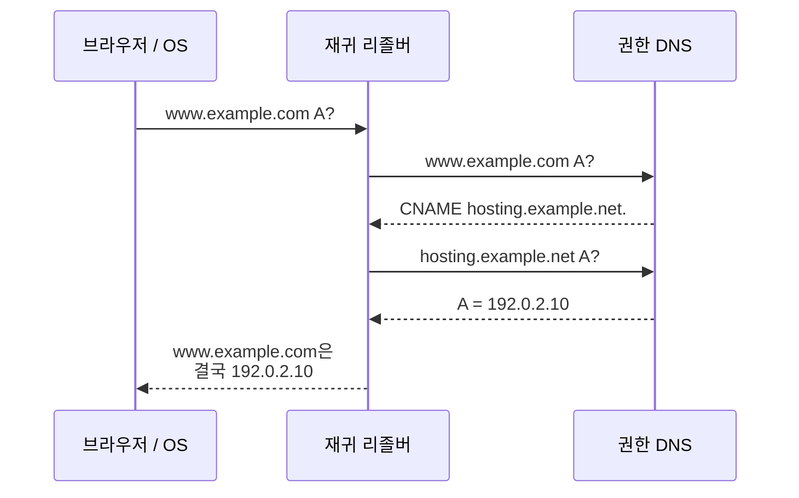
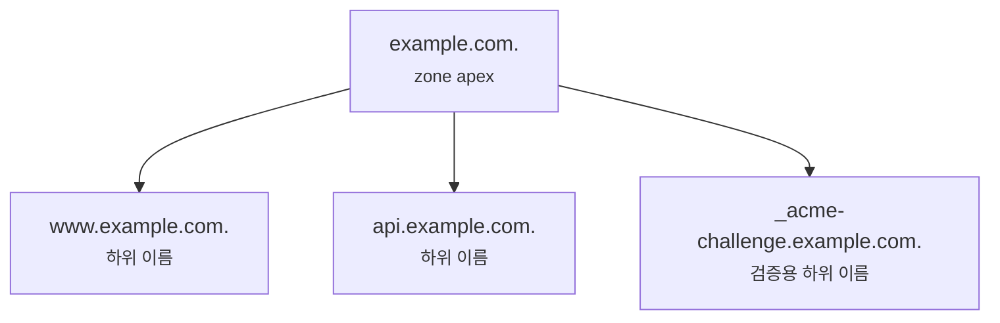
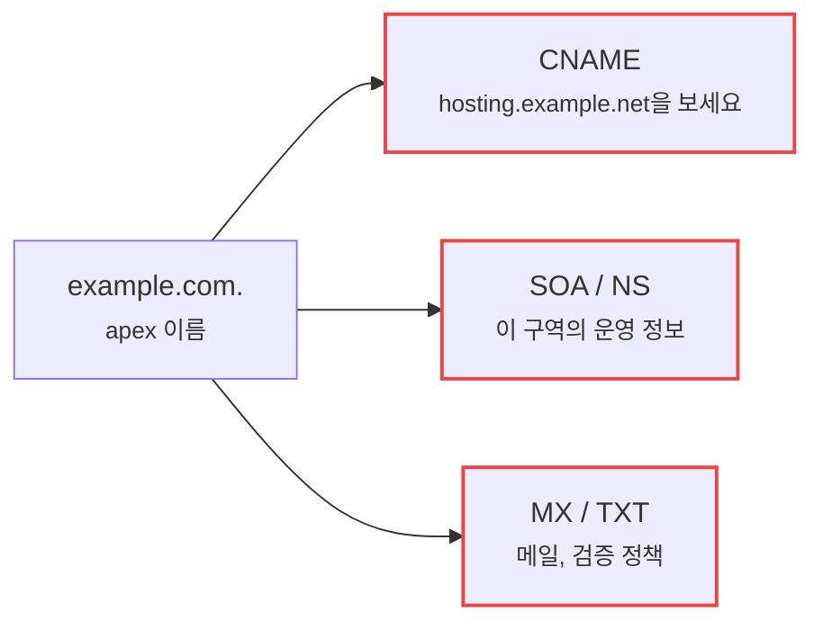
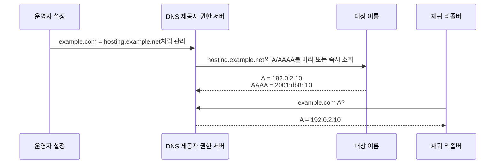
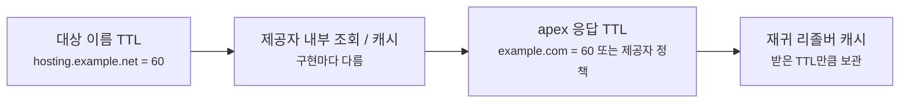

# CNAME과 apex 도메인은 왜 같이 쓰기 어려울까요?

> `www.example.com` 은 CNAME으로 잘 연결되는데, `example.com` 은 똑같이 하면 될 것 같죠? **사실은 루트 도메인에서는 그게 꽤 까다로워요.**

[A, AAAA, CNAME... DNS 레코드는 왜 종류가 여러 갈래일까요?](../basic/10-dns-records.md#cname-record){ data-preview }에서는 CNAME을 **"이 이름은 사실 저 이름이에요"** 라고 알려주는 별명 레코드로 봤어요.
그리고 [DNS TTL과 캐시는 왜 바뀐 주소를 바로 안 보여줄까요?](./dns-ttl-and-cache-staleness.md){ data-preview }에서는 DNS 답이 캐시에 남아 한동안 같은 값을 돌려줄 수 있다는 것도 봤죠.

근데요, 실제 도메인을 연결하다 보면 이런 장면을 자주 만나요.

- `www.example.com` 은 `service.example.net` 으로 CNAME을 걸 수 있어요.
- 그런데 `example.com` 에 똑같이 CNAME을 넣으려 하면 DNS 제공자가 막아요.
- 어떤 제공자는 `ALIAS`, `ANAME`, `CNAME flattening` 같은 이름으로 된 기능을 보여줘요.
- 겉으로는 CNAME처럼 관리하는데, `dig` 로 보면 A나 AAAA가 돌아와요.

오늘은 **CNAME이 한마디로 무엇인지**, **왜 apex 도메인에서는 CNAME을 그대로 둘 수 없는지**, **CNAME flattening이 실제로 어떤 우회인지**, 그리고 **운영할 때 TTL과 장애 경계를 어떻게 읽어야 하는지** 같이 볼게요.
여기서 말하는 CNAME의 기본 규칙은 [RFC 1034 3.6.2절](https://www.rfc-editor.org/rfc/rfc1034#section-3.6.2)의 별명 규칙을 기준으로 잡고, `CNAME` 과 다른 레코드를 함께 두지 말라는 운영 감각은 [RFC 1912 2.4절](https://www.rfc-editor.org/rfc/rfc1912#section-2.4)도 가볍게 참고할게요.

!!! note "이 글의 범위"
    여기서는 **CNAME, apex 도메인, CNAME flattening의 관계**에 집중해요.
    DNS 제공자별 화면 이름이나 CDN별 세부 구현은 모두 다르기 때문에, 특정 서비스 설정법까지 들어가지는 않을게요.
    `ALIAS`, `ANAME` 같은 이름은 표준 DNS 레코드라기보다 제공자 기능 이름으로 읽으면 돼요.

---

## 왜 이걸 알아야 할까요?

처음에는 CNAME이 아주 편해 보여요.
서버 주소가 바뀔 때마다 IP를 직접 고치는 대신, 한 이름을 다른 이름으로 따라가게 만들면 되니까요.

예를 들어 블로그를 외부 호스팅 서비스에 붙인다고 해볼게요.

```text
www.example.com.    300    IN    CNAME    hosting.example.net.
```

이건 자연스러워요.
`www.example.com` 을 물어보면 **"그 이름은 `hosting.example.net` 을 따라가세요"** 라고 말해주는 거죠.

문제는 사용자가 `www` 없이 `example.com` 으로 들어오는 장면이에요.
많은 사람은 이렇게 쓰고 싶어 해요.

```text
example.com.        300    IN    CNAME    hosting.example.net.
```

딱 봐도 편해 보이죠?
그런데 DNS에서는 이 줄이 보통 문제가 돼요.
`example.com` 같은 구역의 맨 위 이름에는 이미 `NS`, `SOA` 같은 필수 레코드가 같이 있어야 하거든요.

즉 이 글은 단순히 *"CNAME은 별명이에요"* 를 반복하는 글이 아니에요.
**별명 하나를 편하게 쓰려다가 DNS 구역의 맨 위 규칙과 충돌하는 장면**을 읽는 글이에요.

---

## CNAME은 한마디로 뭐예요?

짧게 잡으면 이래요.

> **CNAME은 "이 이름의 정식 이름은 저쪽이에요"라고 알려주는 별명 레코드예요.**

| 기본편에서 잡은 감각 | 비유에서는 | 실제로는 |
|---|---|---|
| CNAME | 별명표 | Canonical Name 레코드 |
| 정식 이름 | 별명이 가리키는 본명 | CNAME target |
| A / AAAA | 실제 주소 | IPv4 / IPv6 주소 레코드 |
| apex 도메인 | 건물 대표 주소 | zone apex, root of zone |
| CNAME flattening | 접수처가 대신 본명 주소까지 찾아 적어줌 | 제공자가 A/AAAA를 합성해서 응답 |

CNAME의 핵심은 **값이 IP 주소가 아니라 또 다른 이름**이라는 점이에요.
그래서 CNAME을 받는 쪽은 보통 그 이름을 다시 따라가서 A나 AAAA를 찾아야 해요.



이 그림에서 `www.example.com` 은 주소를 직접 들고 있지 않아요.
대신 `hosting.example.net` 이라는 이름을 알려주고, 리졸버가 그다음 주소를 더 찾아요.

---

## apex 도메인은 왜 특별할까요?

apex 도메인은 한 DNS 구역의 맨 위 이름이에요.
예를 들어 `example.com` 구역을 운영한다면, 그 구역의 apex는 `example.com.` 이에요.
반대로 `www.example.com.` 은 apex가 아니라 그 아래에 붙은 하위 이름이죠.



apex가 특별한 이유는, 그 이름에 DNS 구역 자체를 운영하기 위한 레코드가 꼭 붙기 때문이에요.

| 레코드 | apex에서 하는 일 | 없으면 어떤 문제가 생길까요? |
|---|---|---|
| `SOA` | 이 구역의 시작점과 관리 정보를 알려줌 | 구역 자체를 설명할 기준이 사라져요 |
| `NS` | 이 구역을 맡는 권한 DNS 서버를 알려줌 | 누가 이 구역을 담당하는지 알기 어려워져요 |
| `DNSKEY` | DNSSEC을 쓰는 경우 검증 키를 제공 | 서명 검증 흐름이 깨질 수 있어요 |
| `MX` | apex 도메인으로 메일을 받을 때 사용 | 메일 경로를 같이 두기 어려워져요 |
| `TXT` | 소유권 검증, SPF 같은 정책에 사용 | 도메인 검증이나 메일 정책을 놓칠 수 있어요 |

여기서 핵심은 **apex는 웹사이트 주소 하나만 위한 자리가 아니라는 것**이에요.
그 이름은 DNS 구역 자체의 출입문이기도 하고, 메일과 검증 정책이 붙는 자리이기도 해요.

---

## 그럼 왜 apex에는 CNAME을 그냥 못 둘까요?

CNAME에는 중요한 규칙이 있어요.

> 어떤 이름에 CNAME이 있으면, 그 이름에는 보통 다른 데이터가 같이 있으면 안 돼요.

왜 그럴까요?
CNAME은 **"이 이름은 저 이름의 별명이니, 나머지는 저쪽에서 보세요"** 라는 뜻에 가까워요.
그런데 같은 이름에 A, MX, TXT, NS 같은 다른 레코드가 같이 있으면 의미가 섞여버려요.



이 그림이 바로 충돌이에요.
apex에는 `SOA` 와 `NS` 가 있어야 하는데, CNAME은 같은 이름의 다른 데이터와 같이 있으면 안 돼요.
그래서 `example.com` apex에 CNAME을 그대로 넣으려 하면 많은 DNS 제공자가 막는 거예요.

반면 `www.example.com` 같은 하위 이름은 달라요.
그 이름에는 구역 전체를 대표하는 `SOA`, `NS` 가 꼭 붙어 있어야 하는 건 아니거든요.
그래서 `www` 에 CNAME을 두는 건 흔하고 자연스러워요.

```text
; 괜찮은 경우가 많아요
www.example.com.    300    IN    CNAME    hosting.example.net.

; apex에서는 보통 문제가 돼요
example.com.        300    IN    CNAME    hosting.example.net.
example.com.        300    IN    NS       ns1.example.com.
example.com.        300    IN    SOA      ns1.example.com. hostmaster.example.com. ...
```

위 예시에서 문제는 CNAME 대상이 나쁘다는 게 아니에요.
**같은 이름에 CNAME과 apex 필수 레코드가 함께 있어야 한다는 점**이 충돌이에요.

---

## CNAME flattening은 무엇을 우회하는 걸까요?

그래서 DNS 제공자들이 만든 우회 방식이 있어요.
이름은 제공자마다 조금씩 달라요.

- `CNAME flattening`
- `ALIAS`
- `ANAME`
- `Apex Alias`

이 이름들이 모두 완전히 같은 구현이라는 뜻은 아니에요.
다만 큰 감각은 비슷해요.

> **관리자는 CNAME처럼 목표 이름을 적지만, 권한 DNS는 사용자에게 A/AAAA처럼 주소를 돌려줘요.**

흐름을 그리면 이렇게 볼 수 있어요.



리졸버 입장에서는 `example.com` 에서 CNAME을 받은 게 아니에요.
그냥 A나 AAAA 답을 받았어요.
그래서 apex에 필요한 `SOA`, `NS`, `TXT`, `MX` 같은 레코드와 충돌하지 않게 만들 수 있어요.

여기서 중요한 표현이 있어요.
CNAME flattening은 **표준 CNAME 레코드를 apex에 몰래 넣는 마법**이 아니에요.
제공자가 뒤에서 대상 이름을 따라가고, 그 결과 주소를 **apex의 A/AAAA 응답처럼 합성해서 주는 기능**에 가까워요.

---

## 실제로 `dig` 에서는 어떻게 보일까요?

먼저 일반적인 CNAME 장면부터 볼게요.
하위 이름인 `www.example.com` 을 조회하면 이런 식으로 보일 수 있어요.

```bash
dig www.example.com A
```

```text
;; ANSWER SECTION:
www.example.com.        300    IN    CNAME    hosting.example.net.
hosting.example.net.     60    IN    A        192.0.2.10
```

이 경우에는 `ANSWER SECTION` 에 CNAME과 최종 A가 같이 보일 수 있어요.
읽는 순서는 이래요.

1. `www.example.com` 은 `hosting.example.net` 의 별명이에요.
2. `hosting.example.net` 은 `192.0.2.10` 을 가리켜요.
3. TTL은 각 레코드마다 따로 붙을 수 있어요.

반면 apex flattening을 쓰면 겉모습이 달라져요.

```bash
dig example.com A
```

```text
;; ANSWER SECTION:
example.com.            60     IN    A        192.0.2.10
```

여기서는 CNAME 줄이 안 보일 수 있어요.
운영 화면에서는 `hosting.example.net` 을 목표로 적어뒀는데, DNS 응답에서는 A 레코드처럼 보이는 거죠.
이게 바로 flattening이라는 말의 감각이에요.

!!! warning "여기서 자주 헷갈려요"
    `dig example.com A` 에서 A만 보인다고 해서, 운영자가 IP를 직접 박아둔 설정이라고 단정하면 안 돼요.
    DNS 제공자 쪽에서 flattening을 하고 있을 수도 있어요.
    이때는 DNS 응답만 보지 말고, 권한 DNS 제공자 설정 화면과 TTL 정책까지 같이 봐야 해요.

---

## TTL은 어디 기준으로 봐야 할까요?

CNAME flattening에서 운영자가 자주 헷갈리는 지점이 TTL이에요.

일반 CNAME 체인에서는 각각의 레코드가 자기 TTL을 가져요.

```text
www.example.com.        300    IN    CNAME    hosting.example.net.
hosting.example.net.     60    IN    A        192.0.2.10
```

이 경우 리졸버는 CNAME 답과 최종 A 답을 각각의 TTL 감각으로 캐시할 수 있어요.
그런데 flattening에서는 권한 DNS 제공자가 대상 이름을 대신 따라가고, 사용자에게는 합성된 A/AAAA를 줘요.



이 그림에서 조심할 점은, 사용자가 보는 TTL이 항상 대상 이름의 TTL과 1:1로 같지는 않을 수 있다는 거예요.
제공자 구현에 따라 대상 조회 주기, 내부 캐시, 응답 TTL 정책이 달라질 수 있어요.

그래서 flattening을 쓸 때는 아래를 같이 확인하는 편이 좋아요.

| 확인할 것 | 왜 봐야 할까요? |
|---|---|
| apex 응답 TTL | 재귀 리졸버가 합성된 A/AAAA를 얼마나 들고 있을지 보기 위해 |
| 대상 이름의 TTL | 제공자가 대상 주소 변화를 얼마나 빨리 따라갈 수 있을지 가늠하기 위해 |
| 제공자 문서의 flattening 정책 | 내부 갱신 주기와 지원 레코드가 구현마다 다르기 때문에 |
| IPv4/IPv6 동시 지원 여부 | A만 합성되는지, AAAA도 같이 합성되는지 확인하기 위해 |

여기서 [DNS TTL과 캐시](./dns-ttl-and-cache-staleness.md){ data-preview }에서 본 감각이 다시 이어져요.
flattening을 쓰더라도, 재귀 리졸버가 받은 A/AAAA 응답은 TTL 동안 캐시될 수 있어요.
즉 대상 서비스의 IP가 바뀌어도, 모든 사용자가 즉시 새 주소를 보는 건 아니에요.

---

## 언제 CNAME을 쓰고, 언제 flattening을 볼까요?

처음부터 복잡하게 생각할 필요는 없어요.
이렇게 나눠보면 꽤 선명해져요.

| 상황 | 보통의 선택 | 이유 |
|---|---|---|
| `www.example.com` 을 외부 서비스에 연결 | CNAME | 하위 이름이라 다른 필수 apex 레코드와 충돌하지 않음 |
| `api.example.com` 을 플랫폼 주소에 연결 | CNAME | 대상 서비스 주소 변경을 따라가기 쉬움 |
| `example.com` 자체를 외부 서비스에 연결 | A/AAAA 직접 설정 또는 flattening | apex에는 CNAME을 그대로 두기 어려움 |
| 메일, TXT 검증, DNSSEC을 apex에 같이 둠 | CNAME apex 피하기 | 같은 이름에 여러 운영 레코드가 필요함 |

운영 감각으로는 `www` 를 정식 웹 주소로 두고, apex는 `www` 로 리다이렉트하는 방식도 많이 써요.
반대로 제품 요구상 apex 자체가 꼭 외부 플랫폼을 직접 가리켜야 한다면, 제공자의 flattening 기능을 검토하게 돼요.

중요한 건 **사용자가 보는 웹 주소 정책**과 **DNS 레코드가 지켜야 하는 구조 규칙**을 나눠서 보는 거예요.
브라우저 주소창에서는 `example.com` 과 `www.example.com` 차이가 작아 보여도, DNS 구역 안에서는 둘의 역할이 꽤 달라요.

---

## 잘못 읽기 쉬운 함정은 뭐가 있을까요?

### CNAME은 리다이렉트가 아니에요

CNAME은 HTTP 리다이렉트가 아니에요.
브라우저 주소창을 바꾸는 기능도 아니고, `301`, `302` 응답을 만드는 기능도 아니에요.
DNS 조회 단계에서 **이 이름을 다른 이름으로 해석하라**고 알려주는 레코드예요.

`example.com` 에서 `www.example.com` 으로 주소창을 바꾸고 싶다면, 그건 보통 웹 서버나 CDN의 HTTP 리다이렉트 설정에서 다뤄요.

### CNAME 체인이 길면 좋은 게 아니에요

CNAME은 편하지만, 별명을 계속 따라가야 해요.

```text
shop.example.com.    CNAME    shops.hosting.example.
shops.hosting.example. CNAME  edge.vendor.example.
edge.vendor.example. A        192.0.2.20
```

이런 체인이 길어질수록 조회가 복잡해지고, 중간 이름 하나가 문제를 일으켰을 때 원인도 더 찾기 어려워져요.
가능하면 필요한 만큼만 짧게 두는 편이 좋아요.

### flattening은 제공자 기능이에요

`ALIAS`, `ANAME`, `CNAME flattening` 은 표준 DNS 메시지의 새로운 공통 레코드처럼 생각하면 헷갈려요.
대부분은 DNS 제공자가 자기 시스템 안에서 제공하는 편의 기능이에요.

그래서 도메인을 다른 DNS 제공자로 옮기면 같은 이름의 기능이 없거나, 동작 방식이 다를 수 있어요.
마이그레이션할 때는 **화면에 보이는 레코드 이름**보다 **실제 권한 DNS 응답이 A/AAAA로 어떻게 나오는지**를 확인해야 해요.

---

## 실제 확인은 어떤 순서로 하면 좋을까요?

apex 연결 문제를 확인할 때는 이 순서가 좋아요.

```bash
dig example.com A
dig example.com AAAA
dig example.com CNAME
dig www.example.com A
dig www.example.com CNAME
```

읽을 때는 이렇게 나눠요.

1. **apex에서 CNAME이 직접 보이는지** 봐요.
   - 보통은 보이지 않아야 자연스러워요.
2. **apex A/AAAA가 어떤 TTL로 나오는지** 봐요.
   - flattening이면 합성된 주소와 TTL이 여기서 보여요.
3. **`www` 같은 하위 이름은 CNAME인지** 봐요.
   - 하위 이름에서는 CNAME이 자연스럽게 보일 수 있어요.
4. **권한 DNS와 재귀 리졸버를 나눠서 확인해요.**
   - 캐시 때문에 내 기본 리졸버와 권한 DNS 결과가 잠깐 다를 수 있어요.
5. **운영 화면의 목표 이름과 실제 DNS 응답을 같이 봐요.**
   - flattening은 화면과 응답이 다르게 보일 수 있기 때문이에요.

!!! tip "이것만 기억해도 충분해요"
    하위 도메인에는 CNAME을 편하게 쓸 수 있지만, apex 도메인은 `SOA`, `NS` 같은 구역 운영 레코드와 같이 살아야 해요.
    그래서 apex에서는 CNAME을 그대로 넣기보다 A/AAAA를 직접 쓰거나, 제공자의 flattening 기능으로 A/AAAA 응답을 합성하는 방식을 보게 돼요.

---

## 자, 정리해볼까요?

!!! abstract "오늘 우리가 배운 것"
    - **CNAME** 은 이 이름이 다른 정식 이름을 가리킨다고 알려주는 별명 레코드예요.
    - **apex 도메인** 은 DNS 구역의 맨 위 이름이라 `SOA`, `NS` 같은 운영 레코드를 함께 가져야 해요.
    - CNAME은 같은 이름의 다른 데이터와 함께 두기 어렵기 때문에, apex에 그대로 넣으면 규칙이 충돌해요.
    - **CNAME flattening** 은 제공자가 목표 이름을 대신 따라간 뒤, 사용자에게는 A/AAAA 응답처럼 합성해서 주는 우회 방식이에요.
    - flattening을 쓸 때도 TTL, 제공자 내부 캐시, IPv4/IPv6 지원 여부를 같이 봐야 해요.

CNAME은 단순한 별명처럼 보이지만, apex에 오면 DNS 구역 운영 규칙과 바로 부딪혀요.
그래서 `www` 에서는 쉬웠던 설정이 `example.com` 에서는 갑자기 어려워지는 거예요.

---

## 이어서 보면 좋은 글

- CNAME, A, AAAA 같은 레코드의 큰 그림부터 다시 잡고 싶다면 — [DNS 레코드는 왜 이렇게 종류가 많을까요?](../basic/10-dns-records.md){ data-preview }
- CNAME과 A/AAAA 응답이 실제 `dig` 출력에서 어떻게 보이는지 보고 싶다면 — [dig 출력은 어디부터 읽어야 할까요?](./dns-lookup-with-dig.md){ data-preview }
- flattening 결과가 바로 안 바뀌는 이유를 TTL과 캐시 관점에서 보고 싶다면 — [DNS TTL과 캐시는 왜 바뀐 주소를 바로 안 보여줄까요?](./dns-ttl-and-cache-staleness.md){ data-preview }
- DNS 메시지 안에서 Answer와 Authority가 왜 나뉘는지 더 구조적으로 보고 싶다면 — [DNS 메시지는 왜 질문 하나에 칸이 이렇게 많을까요?](./dns-message-format.md){ data-preview }
