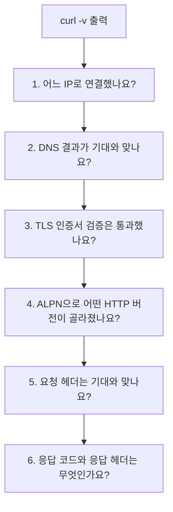
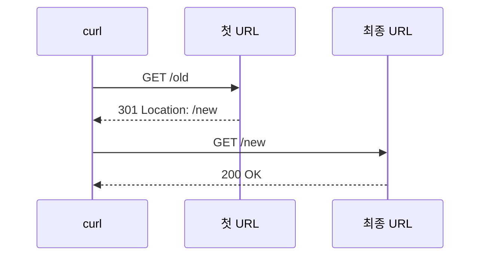

# curl verbose와 timing은 어디부터 읽어야 할까요?

> 브라우저에서는 그냥 "느려요"로 보이는데, 터미널에서는 요청이 지나간 체크포인트가 꽤 많이 보여요.

[End-to-End Request Debugging](../basic/26-end-to-end-request-debugging.md){ data-preview }에서는 느린 요청 하나를 DNS, 연결, TLS, 프록시, 캐시, 오리진 같은 체크포인트로 나눠 읽는 큰 그림을 봤어요. 그리고 앞의 HTTP 글들에서는 HTTP/1.1, HTTP/2, HTTP/3가 요청과 응답을 어떤 모양으로 실어 나르는지도 열어봤죠.

근데요, 실제로 문제를 만나면 이런 순간이 와요.

> *"브라우저 waterfall을 열기 전에, 터미널에서 이 요청이 어디서 느린지 빠르게 볼 수 없을까요?"*

이럴 때 가장 자주 꺼내는 도구 중 하나가 `curl`이에요. `curl -v`는 요청이 지나가는 장면을 글로 보여주고, `--write-out`은 전송이 끝난 뒤 시간 값을 숫자로 뽑아줘요. curl 공식 문서에서도 `--verbose`는 내부 동작을 보기 위한 디버깅 정보, `--write-out`은 전송 완료 뒤 변수 값을 출력하는 기능으로 설명해요. 자세한 변수 이름은 [curl man page](https://curl.se/docs/manpage.html)와 [everything curl의 write-out 문서](https://everything.curl.dev/usingcurl/verbose/writeout.html)를 기준으로 볼게요.

!!! note "이 글의 범위"
    여기서는 `curl`을 부하 테스트 도구처럼 쓰는 법이 아니라, **요청 하나를 어디서 읽을지**에 집중해요. DNS, TCP, TLS, HTTP 버전, 응답 코드, 첫 바이트, 전체 시간을 나눠 보는 감각이 목표예요.

---

## 먼저 몸통은 버리고 신호만 보게 만들어요

처음 `curl https://example.com/`을 치면 HTML 본문이 주르륵 나와요. 그런데 디버깅에서는 본문보다 **연결과 시간 신호**가 먼저 필요할 때가 많아요.

그래서 기본 모양은 이렇게 잡으면 좋아요.

```bash
curl -sS -o /dev/null \
  -w 'http_version=%{http_version}
response_code=%{response_code}
remote_ip=%{remote_ip}
time_namelookup=%{time_namelookup}
time_connect=%{time_connect}
time_appconnect=%{time_appconnect}
time_pretransfer=%{time_pretransfer}
time_starttransfer=%{time_starttransfer}
time_total=%{time_total}
' \
  https://example.com/
```

각 옵션은 이런 역할이에요.

| 옵션 | 처음엔 이렇게 읽으면 돼요 |
|---|---|
| `-sS` | 진행 막대는 숨기되, 에러 메시지는 보여줘요 |
| `-o /dev/null` | 응답 본문은 버려요 |
| `-w` / `--write-out` | 전송이 끝난 뒤 보고 싶은 값을 출력해요 |
| `%{response_code}` | 마지막 응답 코드 |
| `%{http_version}` | 실제로 사용된 HTTP 버전 |
| `%{remote_ip}` | 실제 연결한 원격 IP |
| `%{time_*}` | 요청 흐름의 누적 시간 값 |

중요한 건 `time_*` 값이 대부분 **구간별 시간**이 아니라 **시작부터 그 지점까지의 누적 시간**이라는 점이에요. 그래서 숫자를 그대로 더하면 안 되고, 필요하면 서로 빼서 구간을 읽어야 해요.

## 실제 출력은 이렇게 생겨요

아래는 이 작업 환경에서 2026년 6월 17일에 `https://example.com/`으로 한 번 실행해 본 예시예요. 인터넷 경로와 서버 상태에 따라 값은 매번 달라져요.

```text
http_version=2
response_code=200
remote_ip=172.66.147.243
time_namelookup=0.084679
time_connect=0.117370
time_appconnect=0.163551
time_pretransfer=0.163677
time_starttransfer=0.201843
time_total=0.201888
```

이 출력만 보면 일단 이런 말을 할 수 있어요.

- 이름을 주소로 바꾸는 데 약 `0.085s`까지 걸렸어요.
- TCP 연결 완료는 약 `0.117s` 시점이에요.
- TLS handshake 완료는 약 `0.164s` 시점이에요.
- 첫 바이트는 약 `0.202s` 시점에 왔어요.
- 전체 다운로드도 거의 같은 시점에 끝났으니, 본문 다운로드는 작았어요.


이 그림처럼 `curl` timing은 요청이 지나간 체크포인트를 숫자로 찍어준다고 보면 돼요. 한 줄짜리 평균 시간이 아니라, **어느 지점까지 도달하는 데 얼마나 걸렸는지**를 보여주는 표식이에요.

---

## 비유로 보면, 택배 추적 시간표에 가까워요

택배가 늦을 때 "배송이 느려요"라고만 하면 원인을 알기 어렵죠.

- 주문 접수까지 늦었는지
- 물류센터 입고가 늦었는지
- 간선 이동이 늦었는지
- 집 근처 도착 뒤 배송이 늦었는지

이걸 시간표로 보면 훨씬 빨리 좁힐 수 있어요. `curl --write-out`도 비슷해요.

| 택배 추적에서는 | curl timing에서는 |
|---|---|
| 주문 번호로 배송지를 찾음 | `time_namelookup` |
| 물류센터와 연결됨 | `time_connect` |
| 신원 확인과 인수 조건 확인 | `time_appconnect` |
| 실제 배송 준비 완료 | `time_pretransfer` |
| 첫 물건이 도착함 | `time_starttransfer` |
| 모든 물건이 도착함 | `time_total` |

그래서 `time_total` 하나만 보면 "전체가 2초 걸렸어요"밖에 모르지만, 중간 표식을 같이 보면 **DNS가 늦은 건지, 연결이 늦은 건지, 서버가 첫 응답을 늦게 준 건지**를 나눠 볼 수 있어요.

## 누적 시간은 빼서 구간으로 바꿔 읽어요

`time_starttransfer`가 `0.800`이고 `time_total`이 `0.900`이면 첫 바이트까지 `0.8초`, 그 뒤 전체 다운로드까지 `0.1초`에 가까워요. `time_total - time_starttransfer`가 다운로드 쪽 감각을 주는 거죠.

자주 보는 계산은 이렇게예요.

| 보고 싶은 구간 | 대략 이렇게 계산해요 | 의미 |
|---|---|---|
| DNS | `time_namelookup` | 이름 해석 완료까지 |
| TCP 연결 | `time_connect - time_namelookup` | 주소를 안 뒤 연결이 열릴 때까지 |
| TLS | `time_appconnect - time_connect` | HTTPS 보호 통로 준비 |
| 서버 처리 + 첫 응답 대기 | `time_starttransfer - time_pretransfer` | 요청을 보낸 뒤 첫 바이트가 오기까지 |
| 다운로드 | `time_total - time_starttransfer` | 첫 바이트 이후 전체 완료까지 |

!!! warning "숫자를 전부 더하면 안 돼요"
    `time_namelookup`, `time_connect`, `time_appconnect`, `time_starttransfer`, `time_total`은 대체로 같은 시작점을 기준으로 한 누적 시각이에요. `0.1 + 0.2 + 0.3`처럼 더하면 실제 전체 시간보다 커져요.

## `curl -v`는 숫자 대신 장면을 보여줘요

타이밍 값이 "어느 단계가 길었는지"를 숫자로 보여준다면, `curl -v`는 그 단계에서 **무슨 일이 있었는지**를 글로 보여줘요.

```bash
curl -sS -o /dev/null -v https://example.com/
```

실제로는 훨씬 길지만, 중요한 줄만 줄이면 이런 모양이에요.

```text
*   Trying 104.20.23.154:443...
* Host example.com:443 was resolved.
* IPv6: 2606:4700:10::ac42:93f3, 2606:4700:10::6814:179a
* IPv4: 104.20.23.154, 172.66.147.243
* ALPN: curl offers h2,http/1.1
* TLSv1.3 (OUT), TLS handshake, Client hello (1):
* SSL connection using TLSv1.3 / TLS_AES_256_GCM_SHA384 / ...
* ALPN: server accepted h2
* Server certificate:
*   subject: CN=example.com
*   subjectAltName: "example.com" matches cert's "example.com"
* OpenSSL verify result: 0
* using HTTP/2
> GET / HTTP/2
> Host: example.com
> User-Agent: curl/8.20.0
< HTTP/2 200
< content-type: text/html
< cf-cache-status: HIT
```

curl 공식 문서 기준으로 `-v` 출력에서 `>`는 curl이 보낸 헤더, `<`는 받은 헤더, `*`는 curl이 덧붙인 설명이에요. 이 구분만 알아도 로그가 훨씬 덜 무서워져요.

| 표시 | 뜻 |
|---|---|
| `*` | curl이 알려주는 진행 설명 |
| `>` | 클라이언트가 보낸 HTTP 헤더 |
| `<` | 서버가 보낸 HTTP 헤더 |
| `}` | curl이 보낸 데이터 |
| `{` | curl이 받은 데이터 |

!!! warning "verbose 로그는 공유 전에 꼭 지워야 해요"
    `curl -v`에는 `Authorization`, `Cookie`, 토큰, 내부 호스트명 같은 민감한 값이 섞일 수 있어요. 공개 이슈나 채팅에 붙이기 전에는 요청 헤더와 URL query를 반드시 확인해야 해요.

---

## `curl -v`는 위에서 아래로 체크포인트를 지워가며 읽어요

처음부터 모든 줄을 외우려고 하면 힘들어요. 대신 아래 순서로 보면 좋아요.



### 1. 어느 IP로 연결했나요?

`Trying 104.20.23.154:443...` 같은 줄은 curl이 실제 연결을 시도한 주소예요. DNS가 여러 주소를 돌려줬더라도, 이번 요청에서는 그중 하나를 골라 붙을 수 있어요.

여기서 `remote_ip`와 같이 보면 좋아요.

```text
remote_ip=172.66.147.243
```

같은 도메인인데 어떤 요청은 다른 IP로 가고, 특정 IP에서만 느리다면 서버 묶음이나 엣지 위치 차이를 의심할 수 있어요.

### 2. DNS 결과가 기대와 맞나요?

`Host example.com:443 was resolved.` 뒤에 IPv4, IPv6 후보가 보여요. 여기서 엉뚱한 IP가 보이면 앱 서버보다 DNS나 hosts, 프록시, 사내 네트워크 정책을 먼저 봐야 할 수 있어요.

### 3. TLS 인증서 검증은 통과했나요?

`subjectAltName ... matches`와 `OpenSSL verify result: 0` 같은 줄은 이름 검증과 인증서 검증이 통과했다는 단서예요. 반대로 여기서 멈추면 HTTP 요청 자체가 서버 애플리케이션까지 가지 못했을 가능성이 커요.

### 4. 어떤 HTTP 버전이 골라졌나요?

`ALPN: server accepted h2`와 `using HTTP/2` 같은 줄은 협상된 HTTP 버전을 알려줘요. 앞에서 본 [HTTP/2 프레임과 멀티플렉싱](./http2-frames-and-multiplexing.md){ data-preview }, [HTTP/3와 QUIC 프레임](./http3-and-quic-frames.md){ data-preview } 감각이 여기서 연결돼요.

### 5. 내가 보낸 요청이 맞나요?

`>` 줄을 보면 실제로 어떤 `Host`, `User-Agent`, `Accept`, 추가 헤더가 나갔는지 볼 수 있어요. 인증 헤더, 캐시 우회 헤더, 테스트용 `Host` 헤더가 빠졌다면 서버가 다른 응답을 주는 게 당연할 수 있어요.

### 6. 응답은 누가 어떤 힌트를 줬나요?

`< HTTP/2 200`, `< server: cloudflare`, `< cf-cache-status: HIT` 같은 줄은 응답의 표면 힌트예요. 특정 CDN이나 프록시 헤더가 보이면, "오리진이 직접 대답했나?"보다 "중간 계층이 어떤 상태였나?"도 같이 봐야 해요.

## 증상별로 먼저 볼 값을 나눠볼게요

`curl` 값을 읽는 목적은 모든 숫자를 예쁘게 모으는 게 아니에요. 증상별로 의심 지점을 좁히는 거예요.

| 증상 | 먼저 볼 값 / 줄 | 해석 방향 |
|---|---|---|
| 첫 접속이 유난히 느림 | `time_namelookup`, `time_connect`, `time_appconnect` | DNS, TCP, TLS 준비 단계 확인 |
| 첫 바이트가 늦음 | `time_starttransfer - time_pretransfer` | 서버 처리, 프록시 대기, 캐시 미스 의심 |
| 다운로드가 길게 늘어짐 | `time_total - time_starttransfer`, `size_download`, `speed_download` | 본문 크기, 대역폭, 압축, 스트리밍 확인 |
| 가끔 다른 결과가 옴 | `remote_ip`, 응답 헤더, 캐시 상태 헤더 | 엣지 위치, 서버 묶음, 캐시 상태 차이 확인 |
| 브라우저와 curl 결과가 다름 | `User-Agent`, 쿠키, 압축, HTTP 버전 | 클라이언트 조건 차이 확인 |
| 인증서 오류 | TLS 관련 `-v` 줄, `ssl_verify_result` | 이름 불일치, 체인, 신뢰 저장소 확인 |

여기서 `time_starttransfer`는 흔히 TTFB 감각과 연결해서 봐요. 다만 curl의 값은 curl이 본 전송 기준이고, 브라우저의 waterfall과는 캐시, 쿠키, 프록시, 연결 재사용 조건이 다를 수 있어요.

## redirects를 따라가면 시간이 섞여 보여요

`-L`을 붙이면 curl이 `Location` 리다이렉트를 따라가요.

```bash
curl -sS -L -o /dev/null -w 'redirects=%{num_redirects}
time_redirect=%{time_redirect}
time_starttransfer=%{time_starttransfer}
time_total=%{time_total}
' https://example.com/
```

이때 `time_redirect`는 마지막 요청이 시작되기 전까지의 리다이렉트 단계 시간을 보여줘요. 그래서 `-L`을 쓴 결과와 쓰지 않은 결과를 섞어 비교하면 판단이 흐려질 수 있어요.



리다이렉트가 많으면 사용자는 그냥 "첫 화면이 늦다"고 느끼지만, 실제로는 최종 서버 처리 전부터 시간이 쓰였을 수 있어요.

## 연결 재사용은 curl 한 번 실행 안에서만 생각해야 해요

curl man page는 여러 URL을 한 번의 curl invocation에 넣으면 연결 재사용을 시도할 수 있지만, 별도 curl 실행 사이에서는 재사용할 수 없다고 설명해요. 이 차이가 꽤 중요해요.

```bash
curl -sS -o /dev/null -w 'connect=%{time_connect} total=%{time_total}\n' \
  https://example.com/ \
  https://example.com/
```

같은 명령 안에서 여러 URL을 요청하면 뒤쪽 요청은 이미 열린 연결을 재사용할 수 있어요. 반대로 쉘에서 `curl ...`을 두 번 따로 실행하면 매번 새 프로세스와 새 연결 조건에서 시작한다고 봐야 해요.

!!! warning "브라우저와 curl은 같은 클라이언트가 아니에요"
    브라우저는 쿠키, 캐시, connection pool, HTTP/2/3 정책, service worker, 보안 정책을 갖고 있어요. curl은 훨씬 단순한 조건으로 요청할 수 있어요. 그래서 curl 결과가 빠르다고 브라우저 문제가 확정되는 것도 아니고, curl 결과가 느리다고 사용자 전체가 느리다는 뜻도 아니에요.

## 잘못 읽기 쉬운 함정

### `time_total` 하나로 원인을 단정하기

`time_total`은 전체 시간이에요. 전체가 길다는 사실만으로 DNS, TLS, 서버 처리, 다운로드 중 무엇이 문제인지는 알 수 없어요. 최소한 `time_namelookup`, `time_connect`, `time_appconnect`, `time_starttransfer`를 같이 봐야 해요.

### `time_starttransfer`를 순수 서버 처리 시간으로 보기

`time_starttransfer`는 시작부터 첫 바이트까지예요. 서버 처리 시간뿐 아니라 DNS, TCP, TLS, 요청 전송 준비 시간이 이미 포함돼요. 서버 처리 감각을 보려면 `time_starttransfer - time_pretransfer`처럼 빼서 봐야 해요.

### `-k`로 성공했으니 문제가 없다고 보기

`-k` 또는 `--insecure`는 인증서 검증 실패를 무시하게 만들 수 있어요. 테스트에는 쓸 수 있지만, 실제 문제를 해결한 게 아니에요. 인증서 이름, 체인, 신뢰 저장소 문제는 따로 확인해야 해요.

### verbose 로그를 그대로 공유하기

`curl -v`는 디버깅에 좋지만, 요청 헤더와 URL에 민감한 값이 들어갈 수 있어요. 특히 `Authorization`, `Cookie`, query token, 내부 도메인은 공유 전에 지워야 해요.

### 한 번의 결과만 보고 결론 내기

네트워크 시간은 흔들려요. 같은 URL도 DNS 캐시, 연결 대상 IP, 엣지 위치, 서버 부하에 따라 달라질 수 있어요. 최소 몇 번 반복하고, 값이 튀는지 안정적인지 봐야 해요.

## 자, 정리해볼까요?

!!! abstract "오늘 우리가 배운 것"
    - `curl -v`는 요청이 지나간 장면을 텍스트 로그로 보여줘요.
    - `--write-out`은 전송이 끝난 뒤 HTTP 버전, 응답 코드, IP, timing 값을 뽑아줘요.
    - `time_*` 값은 대체로 누적 시간이므로, 구간을 보려면 서로 빼서 읽어야 해요.
    - `time_namelookup`, `time_connect`, `time_appconnect`, `time_starttransfer`, `time_total`을 같이 보면 DNS, TCP, TLS, 첫 바이트, 다운로드 구간을 나눠 볼 수 있어요.
    - `curl` 결과와 브라우저 결과는 조건이 다를 수 있으니, 결론보다 의심 지점을 좁히는 데 쓰는 편이 좋아요.

## 이어서 보면 좋은 글

- [End-to-End Request Debugging - 느린 요청은 어디서 막히고 있을까요?](../basic/26-end-to-end-request-debugging.md){ data-preview } — curl timing 값을 전체 요청 체크포인트 지도 위에 올려볼 수 있어요.
- [HTTP/2는 어떻게 여러 요청을 한 연결에 섞어 보낼까요?](./http2-frames-and-multiplexing.md){ data-preview } — `curl -v`에서 `h2`가 보일 때 실제로 어떤 구조인지 이어서 볼 수 있어요.
- [HTTP/3는 QUIC 위에서 프레임을 어떻게 나눌까요?](./http3-and-quic-frames.md){ data-preview } — `h3`가 보일 때 HTTP/3와 QUIC 스트림 감각을 같이 연결할 수 있어요.
