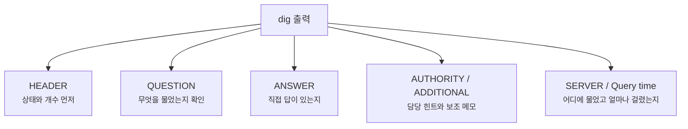
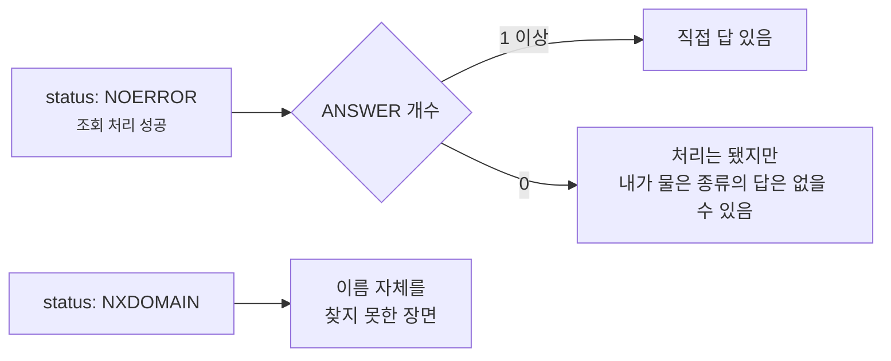
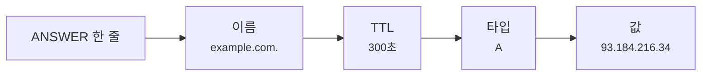
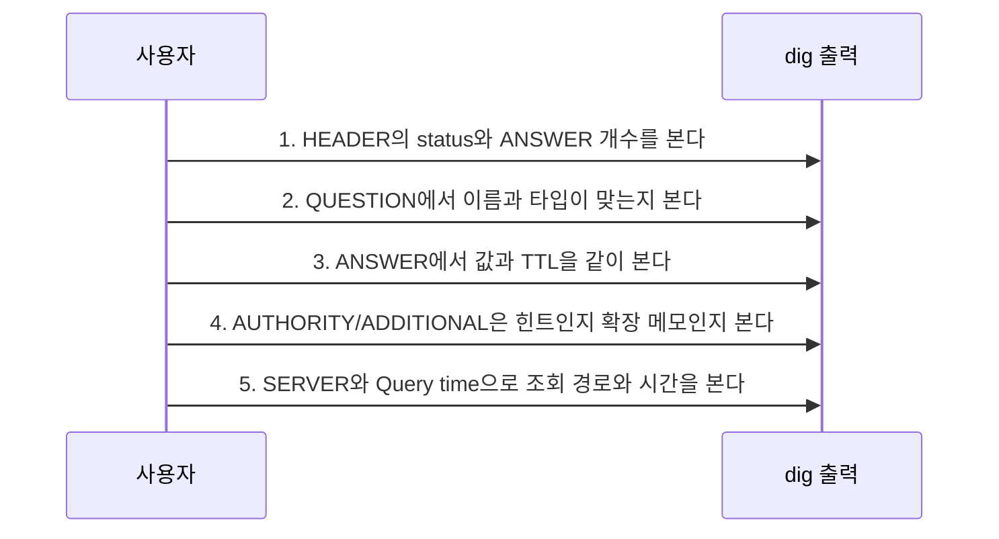

# dig 출력은 어디부터 읽어야 할까요?

> `dig example.com` 한 번이면 끝날 것 같죠? **사실은 답보다 주변 메모를 먼저 읽어야 할 때가 많아요.**

[DNS는 어떻게 이름을 IP 주소로 바꿀까요?](../basic/04-dns.md){ data-preview }에서는 DNS를 **이름을 숫자 주소로 바꿔주는 안내 데스크**로 봤어요. 그리고 [DNS 메시지는 왜 질문 하나에 칸이 이렇게 많을까요?](./dns-message-format.md){ data-preview }에서는 그 질문과 답이 실제 메시지 안에서 `Header`, `Question`, `Answer`, `Authority`, `Additional` 구역으로 나뉜다는 것도 봤죠.

근데요, 실제 터미널에서 `dig`를 열면 생각보다 이런 고민이 먼저 와요.

- `status: NOERROR` 인데 왜 답이 없죠?
- `ANSWER SECTION` 이 없으면 조회가 실패한 걸까요?
- `AUTHORITY SECTION` 은 답인가요, 아니면 힌트인가요?
- `OPT PSEUDOSECTION` 은 갑자기 왜 끼어들었을까요?
- `SERVER: 192.168.0.1#53` 은 내가 물어본 사이트 서버인가요?

이 글은 바로 그 장면을 읽는 글이에요. 여기서는 `dig` 명령어 전체 설명서처럼 모든 옵션을 외우지 않고, **출력 한 덩어리를 위에서 아래로 읽는 순서**에 집중할게요. 이전 글에서 본 DNS 메시지 구조가 여기서 그대로 이어지고, 다음 DNS 글들에서는 재귀 조회와 TTL/캐시 문제를 더 따로 열어볼 거예요.

!!! note "이 글의 범위"
    여기서는 `dig` 출력의 기본 구조와 자주 헷갈리는 신호를 읽는 데 집중해요. `+trace`, DNSSEC 검증, DoH/DoT 경로, 리졸버 설정 파일까지는 깊게 들어가지 않을게요. 오늘 목표는 **터미널 출력에서 어디가 질문이고, 어디가 답이고, 어디가 힌트인지** 구분하는 거예요.

---

## 왜 dig 출력을 읽을 줄 알아야 할까요?

DNS 문제는 겉으로 보면 다 비슷해 보여요.

브라우저에는 그냥 **"사이트에 연결할 수 없음"** 이라고 뜨고, 서버에서는 **"외부 API가 안 붙어요"** 라고 보일 수 있죠. 그런데 `dig` 출력으로 내려오면 문제가 조금 더 잘게 갈라져요.

- 이름 자체가 없는지
- 이름은 있는데 내가 물은 레코드 종류만 없는지
- 답은 왔는데 캐시 때문에 오래된 값을 보고 있는지
- 내 컴퓨터가 어느 리졸버에게 물어보고 있는지
- 응답은 성공인데 `CNAME` 을 따라가야 하는지

즉 `dig`는 DNS의 최종 정답지만 보여주는 도구가 아니라, **DNS 조회 장면의 영수증**을 보여주는 도구에 가까워요.

| 기본편에서 잡은 감각 | 비유에서는 | dig 출력에서는 |
|---|---|---|
| DNS 조회 | 안내 데스크에 질문표 제출 | `QUESTION SECTION` |
| DNS 응답 | 안내 데스크가 돌려준 답변지 | `ANSWER SECTION` |
| 담당자 힌트 | "이쪽 부서가 담당이에요" | `AUTHORITY SECTION` |
| 추가 메모 | 답을 읽는 데 붙는 보조 정보 | `ADDITIONAL SECTION`, `OPT PSEUDOSECTION` |
| 어디에 물었는지 | 어느 안내 데스크를 찾아갔는지 | `SERVER` 줄 |

이 표만 먼저 잡아도 출력이 훨씬 덜 낯설어요. `dig`는 DNS 메시지의 칸을 사람이 읽기 좋게 펼쳐놓은 화면이라고 보면 돼요.

---

## 먼저 한 화면을 같이 볼까요?

예를 들어 A 레코드를 조회하면 이런 모양의 출력이 나와요. 실제 값은 조회 시점과 사용하는 리졸버에 따라 달라질 수 있어서, 아래 예시는 읽기 흐름을 보여주기 위해 단순화했어요.

```bash
dig example.com A
```

```text
; <<>> DiG 9.18.30 <<>> example.com A
;; global options: +cmd
;; Got answer:
;; ->>HEADER<<- opcode: QUERY, status: NOERROR, id: 49321
;; flags: qr rd ra; QUERY: 1, ANSWER: 1, AUTHORITY: 0, ADDITIONAL: 1

;; OPT PSEUDOSECTION:
; EDNS: version: 0, flags:; udp: 1232

;; QUESTION SECTION:
;example.com.                    IN      A

;; ANSWER SECTION:
example.com.             300     IN      A       93.184.216.34

;; Query time: 18 msec
;; SERVER: 192.168.0.1#53(192.168.0.1) (UDP)
;; WHEN: Fri Jun 12 10:30:00 KST 2026
;; MSG SIZE  rcvd: 56
```

처음에는 `ANSWER SECTION` 의 IP 주소만 보고 싶어져요. 당연해요. 근데 장애를 볼 때는 위에서 아래로 최소한 네 곳을 같이 봐야 해요.

1. **HEADER** — 성공인지 실패인지, 답 개수는 몇 개인지
2. **QUESTION** — 내가 정말 의도한 이름과 종류를 물었는지
3. **ANSWER / AUTHORITY / ADDITIONAL** — 직접 답인지, 힌트인지, 보조 메모인지
4. **SERVER / Query time** — 누구에게 물었고 얼마나 걸렸는지



이 그림의 핵심은 **답만 읽지 말고, 질문과 상태부터 확인한다**는 거예요. 질문이 틀렸거나 상태가 다른데 답 줄만 보면 엉뚱한 결론으로 가기 쉬워요.

---

## HEADER는 결과표의 맨 위 요약이에요 { #dig-header }

`dig` 출력에서 제일 먼저 볼 줄은 여기예요.

```text
;; ->>HEADER<<- opcode: QUERY, status: NOERROR, id: 49321
;; flags: qr rd ra; QUERY: 1, ANSWER: 1, AUTHORITY: 0, ADDITIONAL: 1
```

여기에는 이전 글에서 본 [DNS 메시지 헤더](./dns-message-format.md#header-grid){ data-preview }가 사람이 읽는 말로 풀려 있어요.

| 출력 조각 | 먼저 읽는 질문 | 뜻 |
|---|---|---|
| `opcode: QUERY` | 어떤 작업이지? | 일반 조회 |
| `status: NOERROR` | 처리 결과가 성공인가? | DNS 처리 자체는 성공 |
| `id: 49321` | 어느 질문의 답이지? | 질문-응답 짝을 맞추는 번호 |
| `flags: qr rd ra` | 어떤 깃발이 켜졌지? | 응답이고, 재귀 요청/제공이 보임 |
| `QUERY: 1` | 질문은 몇 개였지? | 보통 1개 |
| `ANSWER: 1` | 직접 답은 몇 개지? | 답 레코드 1개 |
| `AUTHORITY: 0` | 권한 섹션은 몇 개지? | 여기서는 없음 |
| `ADDITIONAL: 1` | 추가 섹션은 몇 개지? | EDNS 메모 1개 |

여기서 제일 중요한 건 `status` 와 `ANSWER` 를 따로 읽는 거예요.

> `NOERROR` 는 "처리 성공"이지, "답이 반드시 있다"는 뜻은 아니에요.

예를 들어 도메인은 존재하지만 `AAAA` 레코드가 없을 수도 있어요. 이때는 `status: NOERROR` 이면서 `ANSWER: 0` 이 나올 수 있어요. 반대로 이름 자체가 없으면 보통 `NXDOMAIN` 으로 보이죠.



이 차이를 놓치면 *"DNS가 실패했다"* 고 너무 빨리 단정하게 돼요. 실제로는 **실패가 아니라 빈 답**일 때가 꽤 있어요.

---

## QUESTION은 내가 낸 질문표예요 { #dig-question }

그다음은 `QUESTION SECTION` 을 봐요.

```text
;; QUESTION SECTION:
;example.com.                    IN      A
```

이 줄은 사람 말로 바꾸면 이거예요.

> "`example.com.` 의 인터넷 클래스(`IN`) A 레코드를 알려주세요."

| 칸 | 의미 | 예시 |
|---|---|---|
| `example.com.` | 물어본 이름 | 끝의 점은 루트까지 붙은 완전한 이름 느낌 |
| `IN` | 클래스 | 인터넷에서는 거의 `IN` |
| `A` | 레코드 종류 | IPv4 주소를 물음 |

여기서 은근히 많이 생기는 실수가 있어요. 내가 A 레코드를 본다고 생각했는데 실제로는 `AAAA` 를 물었거나, `www.example.com` 을 봐야 하는데 `example.com` 을 보고 있을 수 있거든요.

그래서 장애를 볼 때는 답부터 보지 말고, 먼저 이렇게 물어보면 좋아요.

- 내가 정말 **그 이름**을 물었나요?
- 내가 정말 **그 레코드 종류**를 물었나요?
- 끝에 붙은 점, CNAME, `www` 유무 때문에 다른 이름을 보고 있지는 않나요?

이건 사소해 보이지만, 실제로는 꽤 자주 시간을 아껴줘요.

---

## ANSWER는 직접 답이고, TTL도 같이 읽어야 해요 { #dig-answer }

`ANSWER SECTION` 은 우리가 가장 기대하는 부분이에요.

```text
;; ANSWER SECTION:
example.com.             300     IN      A       93.184.216.34
```

한 줄을 쪼개면 이렇게 읽어요.

| 칸 | 뜻 | 이 예시에서는 |
|---|---|---|
| 이름 | 이 레코드가 붙은 이름 | `example.com.` |
| TTL | 이 답을 캐시해도 되는 남은 시간 | `300`초 |
| 클래스 | 인터넷 클래스 | `IN` |
| 타입 | 레코드 종류 | `A` |
| 값 | 실제 답 | `93.184.216.34` |

여기서 IP 주소만 보고 지나가면 아쉬워요. DNS 장애나 배포 전환을 볼 때는 `TTL` 도 같이 봐야 하거든요.



`TTL 300` 은 **이 답을 300초 동안 캐시해도 된다**는 뜻에 가까워요. 그래서 방금 DNS 설정을 바꿨는데 누군가는 예전 주소를 보고 있다면, 단순히 *"DNS가 이상하다"* 가 아니라 **어딘가에 남은 TTL 동안 예전 답이 캐시되어 있을 수 있다**고 보는 게 더 정확해요.

여기서는 TTL을 캐시의 유통기한 정도로만 잡고 갈게요. TTL이 리졸버 캐시, 브라우저, 운영체제 쪽에서 어떻게 체감되는지는 [DNS TTL과 캐시는 왜 바뀐 주소를 바로 안 보여줄까요?](./dns-ttl-and-cache-staleness.md){ data-preview }에서 더 자세히 이어서 볼 수 있어요.

---

## AUTHORITY와 ADDITIONAL은 답처럼 보여도 역할이 달라요 { #authority-additional }

이번에는 직접 답이 없는 장면을 볼게요. 예시는 단순화한 출력이에요.

```text
;; ->>HEADER<<- opcode: QUERY, status: NOERROR, id: 33102
;; flags: qr rd ra; QUERY: 1, ANSWER: 0, AUTHORITY: 1, ADDITIONAL: 1

;; QUESTION SECTION:
;example.com.                    IN      AAAA

;; AUTHORITY SECTION:
example.com.             300     IN      SOA     ns.example.com. hostmaster.example.com. 2026061201 7200 3600 1209600 300

;; OPT PSEUDOSECTION:
; EDNS: version: 0, flags:; udp: 1232
```

여기서 조심해야 해요.

`AUTHORITY SECTION` 에 뭔가 적혀 있다고 해서, 그게 내가 물은 `AAAA` 의 직접 답이라는 뜻은 아니에요. 이 경우에는 **직접 답은 없고**, 권한 섹션에 **이 영역에 대한 근거 메모**가 붙은 장면으로 읽는 편이 좋아요.

| 섹션 | 답인가요? | 이렇게 읽으면 돼요 |
|---|---|---|
| `ANSWER` | 보통 직접 답 | "네가 물은 값은 이거야" |
| `AUTHORITY` | 직접 답이 아닐 수 있음 | "이 영역의 담당/근거는 이쪽이야" |
| `ADDITIONAL` | 보조 메모 | "위 내용을 읽는 데 도움 되는 덤이야" |
| `OPT PSEUDOSECTION` | 일반 레코드가 아님 | "EDNS 같은 확장 조건이 붙었어" |

`OPT PSEUDOSECTION` 은 이름부터 살짝 이상하죠. 이건 일반적인 도메인 레코드라기보다, **DNS 메시지 자체의 확장 정보를 담는 특별한 메모**에 가까워요. 지금은 `udp: 1232` 처럼 *"이 정도 크기의 UDP 응답을 다룰 수 있어요"* 같은 협상 정보가 보일 수 있다는 정도만 알아도 충분해요.

---

## SERVER와 Query time은 어디서 물었는지 알려줘요 { #server-and-time }

마지막 아래쪽 줄도 그냥 장식이 아니에요.

```text
;; Query time: 18 msec
;; SERVER: 192.168.0.1#53(192.168.0.1) (UDP)
;; WHEN: Fri Jun 12 10:30:00 KST 2026
;; MSG SIZE  rcvd: 56
```

여기서 `SERVER` 는 **내가 질문을 보낸 DNS 리졸버**예요. 내가 접속하려는 웹사이트 서버가 아니에요.

| 줄 | 뜻 | 볼 때의 질문 |
|---|---|---|
| `Query time` | 응답을 받기까지 걸린 시간 | 느린가, 빠른가 |
| `SERVER` | 내가 물어본 리졸버 | 공유기인가, 회사 DNS인가, 공용 DNS인가 |
| `WHEN` | 조회 시각 | 언제 본 값인가 |
| `MSG SIZE` | 받은 DNS 메시지 크기 | 너무 커지거나 잘렸나 |

이 줄이 중요한 이유는 간단해요. 같은 이름을 물어도 **어느 리졸버에게 물었느냐**에 따라 캐시 상태, 정책, 응답 시간이 달라질 수 있거든요.

예를 들어 이렇게 명시해서 물을 수도 있어요.

```bash
dig @1.1.1.1 example.com A
dig @8.8.8.8 example.com A
```

이건 각각 다른 리졸버에게 같은 질문을 던져보는 방식이에요. 둘의 답이 다르다면 바로 *"누가 맞고 누가 틀렸다"* 로 가지 말고, **캐시 TTL, 지리적 응답, 권한 서버 반영 시간, 리졸버 정책** 같은 가능성을 같이 봐야 해요.

---

## 짧게 보고 싶을 때는 +short, 구조를 보고 싶을 때는 기본 출력이에요

`dig`를 쓰다 보면 이런 명령도 많이 봐요.

```bash
$ dig +short example.com A
93.184.216.34
```

`+short` 는 답만 빠르게 볼 때 편해요. 스크립트에서 값을 뽑거나, 지금 주소가 뭔지만 빠르게 확인할 때는 좋죠.

하지만 문제를 파악하는 중이라면 기본 출력이 더 나아요.

| 목적 | 명령 감각 | 이유 |
|---|---|---|
| 답만 빠르게 보기 | `dig +short example.com A` | 값을 짧게 확인 |
| 출력 구조까지 보기 | `dig example.com A` | 상태, 질문, TTL, 서버까지 확인 |
| 특정 리졸버에게 묻기 | `dig @1.1.1.1 example.com A` | 리졸버 차이 비교 |
| 특정 타입 묻기 | `dig example.com MX` | A가 아닌 레코드 확인 |
| CNAME까지 흐름 보기 | `dig www.example.com A` | 별명과 최종 답을 같이 확인 |

그러니까 `+short` 는 **정상일 때 빠르게 확인하는 도구**에 가깝고, 기본 출력은 **이상할 때 이유를 찾는 도구**에 가까워요.

---

## 헷갈리기 쉬운 장면 세 가지

### 1. `NOERROR` 인데 답이 없을 수 있어요

`NOERROR` 는 DNS 서버가 질문을 처리했다는 뜻이에요. 내가 물은 레코드가 실제로 있다는 뜻은 아니에요.

그래서 `status: NOERROR`, `ANSWER: 0` 을 보면 이렇게 읽어야 해요.

> "이름이나 영역은 처리됐지만, 내가 물은 타입의 직접 답은 없을 수 있구나."

### 2. `AUTHORITY SECTION` 을 직접 답으로 착각하기 쉬워요

`AUTHORITY` 에 `SOA` 나 `NS` 가 보이면 뭔가 답을 받은 것처럼 느껴져요. 하지만 `ANSWER: 0` 이면 직접 답은 없는 장면일 수 있어요.

`AUTHORITY` 는 대개 **담당자 힌트나 부정 응답의 근거** 쪽으로 먼저 읽는 게 덜 위험해요.

### 3. `SERVER` 는 목적지 웹 서버가 아니에요

`SERVER: 192.168.0.1#53` 을 보고 *"example.com 서버가 192.168.0.1인가?"* 라고 읽으면 안 돼요. 이건 내가 질문을 던진 **DNS 리졸버**예요.

웹사이트에 실제로 접속할 서버 주소는 `ANSWER SECTION` 의 A/AAAA 값 쪽에서 봐야 해요.

---

## 그럼 실제로는 어떤 순서로 읽으면 좋을까요?

처음에는 이 순서만 따라가도 충분해요.



이 순서가 좋은 이유는, 결론을 너무 빨리 내리지 않게 해주기 때문이에요. DNS 출력은 **답 줄 하나**가 아니라 **질문, 상태, 직접 답, 힌트, 조회 위치**가 같이 붙은 기록이니까요.

---

## 자, 정리해볼까요?

!!! abstract "오늘 우리가 배운 것"
    - `dig` 기본 출력은 DNS 메시지를 사람이 읽기 좋게 펼쳐놓은 화면이에요.
    - `HEADER` 에서는 `status` 와 `ANSWER` 개수를 먼저 같이 봐야 해요.
    - `QUESTION` 은 내가 정말 의도한 이름과 레코드 타입을 물었는지 확인하는 자리예요.
    - `ANSWER` 에서는 값뿐 아니라 `TTL` 도 같이 읽어야 해요.
    - `AUTHORITY`, `ADDITIONAL`, `OPT PSEUDOSECTION` 은 직접 답이 아니라 힌트나 확장 메모일 수 있어요.
    - `SERVER` 는 목적지 웹 서버가 아니라, 내가 물어본 DNS 리졸버예요.

이것만 잡아도 `dig` 출력은 암호문이 아니라 꽤 친절한 영수증처럼 보이기 시작해요.

---

## 이어서 보면 좋은 글

- `dig` 출력 뒤에 있는 원래 DNS 메시지 칸을 더 자세히 보고 싶다면 — [DNS 메시지는 왜 질문 하나에 칸이 이렇게 많을까요?](./dns-message-format.md){ data-preview }
- `SERVER`, `RD`, `RA`, `AUTHORITY` 를 재귀 조회 관점에서 다시 읽고 싶다면 — [DNS 재귀 조회와 반복 조회는 뭐가 다를까요?](./dns-resolver-recursion-vs-iteration.md){ data-preview }
- 답은 맞는 것 같은데 예전 값이 남아 보이는 이유를 보고 싶다면 — [DNS TTL과 캐시는 왜 바뀐 주소를 바로 안 보여줄까요?](./dns-ttl-and-cache-staleness.md){ data-preview }
- CNAME과 apex 도메인을 `dig` 로 확인하는 장면까지 이어서 보고 싶다면 — [CNAME과 apex 도메인은 왜 같이 쓰기 어려울까요?](./cname-flattening-and-apex.md){ data-preview }
