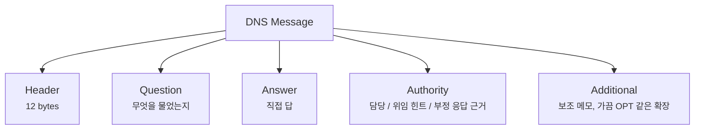
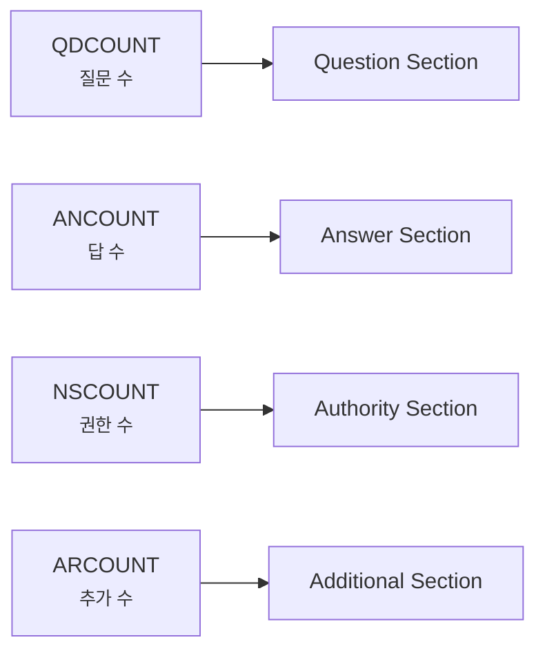

# DNS 메시지는 왜 질문 하나에 칸이 이렇게 많을까요?

> DNS는 그냥 **"이름 하나 보내고 주소 하나 받는 일"** 같죠? **사실은 그 짧은 질문 안에도 꽤 많은 운영 메모가 같이 들어 있어요.**

[DNS는 어떻게 이름을 IP 주소로 바꿀까요?](../basic/04-dns.md){ data-preview }에서는 DNS를 **이름을 숫자 주소로 바꿔주는 안내 데스크**로 먼저 봤어요. 그리고 [A, AAAA, CNAME... DNS 레코드는 왜 종류가 여러 갈래일까요?](../basic/10-dns-records.md){ data-preview }에서는 그 안내 데스크가 **어떤 종류의 답을 적어 보내는지**도 살짝 봤죠.

근데 막상 `dig` 나 `nslookup`, 혹은 패킷 캡처 화면으로 내려오면 질문이 또 달라져요.

- `id 41023` 같은 숫자는 왜 붙어 있죠?
- `qr rd ra` 같은 짧은 깃발은 각각 무슨 뜻일까요?
- 왜 답은 하나뿐인데 `Answer`, `Authority`, `Additional` 같은 구역이 따로 있죠?
- DNS는 UDP 위에서 짧게 오간다는데, 왜 메시지 안은 이렇게 여러 칸으로 나뉘어 있을까요?

바로 그 헷갈림 때문에 이 글이 필요해요. 기본편에서는 **"누구한테 물어보고, 누가 답해주는가"** 를 보는 게 중요했다면, 여기서는 그 질문과 답이 **실제로 어떤 형식의 봉투**로 오가는지 봐야 하거든요. 오늘은 **DNS 메시지가 한마디로 뭐인지**, **기본편에서 봤던 DNS 조회와 무엇이 연결되는지**, **왜 이런 칸 구조가 생겼는지**, 그리고 그다음에야 **12바이트 헤더, Question / Answer / Authority / Additional 섹션, 실제 출력에서 읽는 법** 순서로 같이 내려가볼게요. 큰 뼈대는 [RFC 1035 4.1절](https://www.rfc-editor.org/rfc/rfc1035#section-4.1) 을 바탕으로 잡고, 메시지가 너무 커질 때의 확장 표지판은 [RFC 6891](https://www.rfc-editor.org/rfc/rfc6891) 쪽 감각만 가볍게 빌려올게요.

!!! note "이 글의 범위"
    여기서는 **고전적인 DNS 메시지 기본 형식**에 집중할게요. 즉 **12바이트 헤더 + 네 개 섹션**이라는 큰 틀, 그리고 `QNAME`, `QTYPE`, `TTL`, `RDATA` 같은 핵심 칸이 오늘의 주인공이에요. `dig` 사용법 전체, DNSSEC 검증 비트, EDNS 옵션 세부값까지 다 열지는 않을게요. 그런 가지는 관련 글에서 필요할 때 이어보면 돼요.

---

## 왜 DNS 메시지 형식을 알아야 할까요?

DNS는 초반엔 **"이름을 주소로 바꿔주는 시스템"** 정도로 이해해도 충분해요. 근데 운영 화면이나 캡처로 내려오면, 그다음부터는 **메시지를 읽을 줄 아는지**가 꽤 중요해져요.

- 응답이 없을 때 진짜 **서버가 모르는 건지**, 아니면 **잘린 응답**인지
- `NXDOMAIN` 이 뜰 때 **이름이 없는 건지**, **레코드만 없는 건지**
- `Additional` 에 붙은 값이 **그냥 덤인지**, 아니면 **다음 조회를 줄여주는 힌트인지**
- `Authority` 가 채워진 이유가 **위임 힌트**인지, **부정 응답의 근거**인지

즉 이 글은 DNS를 새로 배우는 글이라기보다, 기본편에서 만든 감각을 **실제 메시지 칸 위에 다시 얹는 글**에 가까워요.

---

## 그래서 DNS 메시지는 한마디로 뭐예요?

DNS 메시지는 **"무슨 이름을, 어떤 종류로 물었고, 그 답과 주변 힌트가 무엇인지"를 정해진 칸에 담아 보내는 작은 양식**에 가까워요.

| 기본편에서 잡은 감각 | 비유에서는 | 실제로는 |
|---|---|---|
| 조회 한 번 | 안내 데스크에 내는 질문표 | DNS query message |
| 질문 내용 | "이 이름의 주소 알려주세요" | Question section |
| 직접 답 | "여기 주소예요" | Answer section |
| 어디에 물어봐야 하는지 힌트 | "정확한 담당은 여기예요 / 저쪽에 다시 물어봐요" | Authority section |
| 옆에 붙는 추가 메모 | "참고로 이 정보도 같이 봐요" (가끔 확장 메모도) | Additional section |
| 접수 번호 / 상태 표시 | 접수증 번호와 처리 상태 | Header fields |

즉 DNS 메시지는 **레코드 값 하나만 오가는 구조**가 아니에요. 질문, 직접 답, 권한 단서, 추가 힌트, 그리고 그걸 관리하는 헤더가 한 덩어리로 붙어 다녀요.

그리고 이런 구조가 생긴 이유도 먼저 잡고 가야 해요. DNS는 단순 주소록 같아 보여도 실제로는 **재귀 조회, 위임, 캐시, 응답 잘림, 여러 레코드 동봉** 같은 운영 장면을 같이 감당해야 하거든요. 그래서 메시지도 생각보다 메모 칸이 많아졌어요.

---

## DNS 메시지 전체 그림부터 볼까요? { #message-overview }

메시지 전체는 크게 이렇게 생겼어요.



이 그림에서 먼저 잡아야 할 건 두 가지예요.

1. **헤더는 항상 맨 앞 12바이트로 고정**돼 있어요.
2. 그 뒤에는 **질문 / 답 / 권한 / 추가** 구역이 순서대로 이어져요.

그러니까 DNS 메시지를 읽는다는 건, 그냥 *"주소가 뭐지?"* 만 보는 일이 아니라 **이 메시지가 어떤 종류의 질문이고, 답이 어디에 담겼고, 주변 힌트가 어느 구역에 붙었는지**까지 같이 읽는 일이에요.

---

## 이 메시지에서 먼저 읽어야 할 신호 다섯 가지 { #signals-to-read }

처음부터 모든 필드를 외우려고 하면 금방 복잡해져요. 우선은 이 다섯 가지만 먼저 보면 돼요.

1. **`ID`** — 지금 보는 응답이 어느 질문에 대한 답인지
2. **`QR` / `RCODE`** — 질문인지 응답인지, 그리고 결과가 성공인지 실패인지
3. **`QDCOUNT` / `ANCOUNT`** — 질문이 몇 개고 답이 몇 개인지
4. **`Authority` / `Additional`** — 직접 답 말고 어떤 힌트가 더 붙었는지
5. **`TC`** — 응답이 잘려서 더 큰 방식으로 다시 물어봐야 하는지

이 다섯 가지만 먼저 잡아도 `dig` 출력이나 캡처를 볼 때 *"아, 이건 답이 없는 게 아니라 잘린 거구나"*, *"이건 실패가 아니라 권한 서버 힌트를 준 거구나"* 같은 감이 훨씬 빨리 와요.

---

## 12바이트 헤더는 어떤 칸으로 나뉠까요? { #header-grid }

DNS 헤더는 **딱 12바이트(96비트)** 예요. 32비트 줄로 그리면 정확히 3줄이 나와요.

<div style="margin: 1.5rem 0; border: 2px solid var(--md-default-fg-color--lighter); border-radius: 0.75rem; overflow: hidden; background: color-mix(in srgb, var(--md-default-bg-color) 95%, var(--md-default-fg-color) 5%);">
  <div style="display: grid; grid-template-columns: repeat(32, 1fr); padding: 0.4rem 0.6rem; background: color-mix(in srgb, var(--md-primary-fg-color) 8%, var(--md-default-bg-color)); border-bottom: 1px solid var(--md-default-fg-color--lightest); font-size: 0.65rem; color: var(--md-default-fg-color--light); text-align: center;">
    <span style="grid-column: span 8;">0</span>
    <span style="grid-column: span 8;">8</span>
    <span style="grid-column: span 8;">16</span>
    <span style="grid-column: span 8;">24</span>
  </div>
  <div style="display: grid; grid-template-columns: repeat(32, 1fr); gap: 2px; padding: 0.6rem; background: var(--md-default-fg-color--lightest);">
    <div style="grid-column: span 16; padding: 0.5rem 0.4rem; background: color-mix(in srgb, #ef4444 18%, var(--md-default-bg-color)); text-align: center; font-size: 0.8rem; border-radius: 0.25rem;"><strong>ID</strong><br/><small>16b</small></div>
    <div style="grid-column: span 16; padding: 0.5rem 0.4rem; background: color-mix(in srgb, #f97316 18%, var(--md-default-bg-color)); text-align: center; font-size: 0.8rem; border-radius: 0.25rem;"><strong>Flags</strong><br/><small>16b</small></div>

    <div style="grid-column: span 16; padding: 0.5rem 0.4rem; background: color-mix(in srgb, #22c55e 18%, var(--md-default-bg-color)); text-align: center; font-size: 0.8rem; border-radius: 0.25rem;"><strong>QDCOUNT</strong><br/><small>16b</small></div>
    <div style="grid-column: span 16; padding: 0.5rem 0.4rem; background: color-mix(in srgb, #06b6d4 18%, var(--md-default-bg-color)); text-align: center; font-size: 0.8rem; border-radius: 0.25rem;"><strong>ANCOUNT</strong><br/><small>16b</small></div>

    <div style="grid-column: span 16; padding: 0.5rem 0.4rem; background: color-mix(in srgb, #8b5cf6 18%, var(--md-default-bg-color)); text-align: center; font-size: 0.8rem; border-radius: 0.25rem;"><strong>NSCOUNT</strong><br/><small>16b</small></div>
    <div style="grid-column: span 16; padding: 0.5rem 0.4rem; background: color-mix(in srgb, #ec4899 18%, var(--md-default-bg-color)); text-align: center; font-size: 0.8rem; border-radius: 0.25rem;"><strong>ARCOUNT</strong><br/><small>16b</small></div>
  </div>
</div>

헤더가 하는 일은 의외로 소박해요. **질문과 응답을 맞춰보고**, **상태를 표시하고**, **뒤에 각 구역이 몇 개 붙는지 세는 일**이 거의 전부예요.

| 필드 | 길이(bit) | 의미 | 자주 보는 값 |
|---|---:|---|---|
| ID | 16 | 질문과 응답을 짝짓는 식별자 | `41023` 같은 임의 값 |
| Flags | 16 | 질문/응답 여부, 재귀 요청, 잘림, 결과 코드 등 | `qr rd ra` 류 |
| QDCOUNT | 16 | 질문 개수 | `1` 흔함 |
| ANCOUNT | 16 | 답 레코드 개수 | `0`, `1`, `2` 류 |
| NSCOUNT | 16 | 권한 섹션 레코드 개수 | `0` 또는 위임 시 양수 |
| ARCOUNT | 16 | 추가 섹션 레코드 개수 | `0` 또는 `1+` |

---

## 1번째 줄 — 접수 번호와 상태 깃발 { #id-and-flags }

### ID — 이 응답이 어느 질문의 답인지 붙잡는 번호예요

DNS는 질문을 보내고 응답을 받아요. 그럼 응답 쪽에서는 **"내가 어느 질문에 답하는 중인지"** 를 알아야 하겠죠. 그 역할을 하는 게 `ID` 예요.

- 클라이언트가 질문할 때 임의의 `ID` 를 넣고
- 서버는 응답할 때 같은 `ID` 를 돌려줘요

그러니까 `ID` 는 *"도메인 이름 그 자체"* 가 아니라, **질문-응답 짝을 맞추는 접수 번호**에 가까워요.

### Flags — 짧은 깃발들 안에 꽤 많은 운영 힌트가 들어 있어요

Flags 16비트는 보통 이렇게 읽어요.

```text
QR | Opcode | AA | TC | RD | RA | Z | RCODE
 1 |   4    | 1  | 1  | 1  | 1  | 3 |   4
```

여기서 초반에 특히 자주 보는 건 이 친구들이에요.

| 비트 | 의미 | 처음엔 이렇게 읽으면 돼요 |
|---|---|---|
| `QR` | Query / Response 구분 | `0` 이면 질문, `1` 이면 응답 |
| `AA` | Authoritative Answer | 권한 서버가 직접 준 답인지 |
| `TC` | Truncated | 응답이 다 못 실려서 잘렸는지 |
| `RD` | Recursion Desired | "대신 끝까지 찾아주세요" 요청 |
| `RA` | Recursion Available | 상대가 재귀 기능을 제공하는지 |
| `RCODE` | 결과 코드 | `NOERROR`, `NXDOMAIN` 같은 상태 |

여기서 제일 많이 헷갈리는 건 `RD` 와 `RA` 예요. 이름이 비슷해서 그렇죠. 근데 역할은 달라요.

- `RD` 는 **클라이언트가 부탁한 것**
- `RA` 는 **서버가 해줄 수 있는지 알리는 것**

즉 *"재귀를 원했다"* 와 *"재귀를 제공한다"* 는 같은 말이 아니에요.

---

## 2·3번째 줄 — 뒤에 몇 칸이 따라오는지 세는 카운터예요 { #counts }

나머지 네 필드는 다 **카운터**예요. 헤더 뒤에 이어지는 네 섹션 각각에 **레코드가 몇 개 들어 있는지**만 세어줘요.



이 구조가 왜 중요할까요? DNS 메시지는 뒤쪽 섹션 길이가 항상 고정이 아니거든요. 질문 이름이 길 수도 있고, 답 레코드가 여러 개일 수도 있어요. 그래서 헤더에서 먼저 **"뒤에 이 구역이 몇 개씩 따라온다"** 고 알려줘야, 받는 쪽이 메시지를 제대로 끊어 읽을 수 있어요.

보통 우리가 보는 일반 조회에서는:

- `QDCOUNT = 1`
- `ANCOUNT = 0` 또는 `1+`
- `NSCOUNT = 0` 또는 위임/부정 응답 시 양수
- `ARCOUNT = 0` 또는 추가 힌트가 있으면 양수

정도로 읽는 경우가 많아요.

---

## Question 섹션은 정확히 무엇을 묻고 있을까요? { #question-section }

Question 섹션은 말 그대로 **"무슨 이름을 어떤 종류로 물었는가"** 를 적는 구역이에요.

| 필드 | 의미 | 예시 |
|---|---|---|
| QNAME | 묻는 이름 | `example.com.` |
| QTYPE | 묻는 레코드 종류 | `A`, `AAAA`, `MX` |
| QCLASS | 보통 인터넷 클래스 | 거의 항상 `IN` |

기본편에서 [DNS 레코드 종류](../basic/10-dns-records.md#dns-records-role){ data-preview }를 볼 때는 **A냐 AAAA냐 CNAME이냐** 가 핵심이었죠. 여기서는 그게 실제로는 **Question 섹션의 `QTYPE` 칸**에 적힌다는 걸 다시 연결하면 돼요.

예를 들어:

```text
example.com.   IN   A
```

라는 질문은 사람 말로 하면 **"`example.com` 의 IPv4 주소를 알려주세요"** 예요.

여기서 한 가지 표지판만 세워둘게요. `QNAME` 은 화면에서는 `example.com.` 처럼 도메인으로 보여도, 실제 메시지 안에서는 **길이 바이트가 끊어지는 label 형식**으로 들어가요. 오늘은 *"질문 이름 칸이 있다"* 까지만 붙잡고, 그 바이트 인코딩을 끝까지 뜯어보는 일은 여기서 더 깊게 늘리지 않을게요.

---

## Answer / Authority / Additional 은 왜 셋으로 나뉠까요? { #three-sections }

DNS를 처음 보면 여기서 제일 놀라요.

> *"답이면 그냥 답만 주면 되지, 왜 옆 칸이 이렇게 많죠?"*

이 셋은 다 **리소스 레코드(Resource Record)** 형식을 공유하지만, **무슨 역할로 붙었는지**가 달라요.

| 섹션 | 무엇이 들어오나 | 이렇게 읽으면 돼요 |
|---|---|---|
| Answer | 질문에 대한 직접 답 | "네가 묻던 값은 이거야" |
| Authority | 이 이름/영역의 담당 정보, 위임 힌트, 부정 응답의 근거(SOA 같은) | "정확한 담당은 여기, 또는 여기로 가서 다시 물어봐" |
| Additional | 위 답·위임을 보조하는 부가 정보 | "참고로 이것도 같이 봐" |

즉 셋 다 비슷한 레코드처럼 보여도, **메시지 안에서 맡는 역할이 다르기 때문에 구역을 나눠 둔 것**에 가까워요.

여기서 한 가지 표지판을 더 세워둘게요. `Authority` 는 *"권한 서버가 보낸 직접 답"* 과는 달라요. 그건 헤더의 `AA` 비트가 표시해주는 거고, `Authority` 섹션은 보통 **"이 이름은 저쪽 서버가 담당해요"** 같은 위임용 `NS` 레코드나, **"이 이름은 없어요"** 라는 부정 응답을 받쳐주는 `SOA` 레코드가 들어오는 자리에 가까워요. 또 `Additional` 에는 일반 리소스 레코드 말고도 **EDNS의 `OPT` 같은 의사(pseudo) 레코드**가 끼어드는 경우가 있어요. `dig` 출력에서 `;; OPT PSEUDOSECTION` 같은 줄이 보이는 게 바로 그 자리예요. 그 줄이 왜 DNS 메시지 크기와 연결되는지는 [EDNS0는 DNS 메시지 크기를 어떻게 넓혀줄까요?](./edns0-and-dns-message-size.md#opt-pseudo-record){ data-preview }에서 이어서 볼 수 있어요.

---

## 리소스 레코드 한 줄은 어떤 칸으로 생겼을까요? { #resource-record }

Answer, Authority, Additional 안에 들어가는 각 항목은 대체로 이런 모양이에요.

| 필드 | 의미 | 예시 감각 |
|---|---|---|
| NAME | 이 레코드가 가리키는 이름 | `example.com.` |
| TYPE | 레코드 종류 | `A`, `NS`, `CNAME` |
| CLASS | 보통 `IN` | 인터넷 클래스 |
| TTL | 이 답을 얼마나 캐시해도 되는지 | `300` |
| RDLENGTH | 실제 데이터 길이 | `4`, `16` 등 |
| RDATA | 진짜 값 | IPv4 주소, 이름, NS 이름 등 |

여기서 중요한 반전은 이거예요.

> 우리가 보통 **"DNS 답"** 이라고 부르는 건 사실 `RDATA` 하나만이 아니라, **그 값을 둘러싼 이름·종류·TTL·길이 메타데이터까지 포함한 한 줄**이에요.

예를 들어:

```text
example.com.  300  IN  A  93.184.216.34
```

처럼 보이는 줄은, 단순히 주소 하나가 아니라 **"이 이름에 대해, A 타입으로, 300초 동안, 이런 값이 온다"** 는 전체 메모예요.

그래서 기본편 [DNS는 어떻게 이름을 IP 주소로 바꿀까요?](../basic/04-dns.md){ data-preview }에서 봤던 `TTL` 도 사실은 **응답 레코드 줄에 함께 붙어 다니는 칸**이라고 이해하면 감이 훨씬 정확해져요.

---

## 그럼 진짜 출력에서는 어떻게 보일까요? { #real-scene }

예를 들어 `dig example.com A` 같은 장면에서는 보통 이런 류의 출력 일부를 보게 돼요.

```text
;; ->>HEADER<<- opcode: QUERY, status: NOERROR, id: 41023
;; flags: qr rd ra; QUERY: 1, ANSWER: 1, AUTHORITY: 0, ADDITIONAL: 1

;; QUESTION SECTION:
;example.com.          IN      A

;; ANSWER SECTION:
example.com.   300     IN      A       93.184.216.34

;; ADDITIONAL SECTION:
; OPT PSEUDOSECTION
```

실제 값은 조회 시점과 서버에 따라 달라질 수 있지만, 읽는 순서는 거의 비슷해요.

1. **`id: 41023`** — 질문/응답을 맞추는 번호예요.
2. **`status: NOERROR`** — 적어도 결과 코드는 정상이라는 뜻이에요.
3. **`flags: qr rd ra`** — 응답이고(`qr`), 재귀를 원했고(`rd`), 재귀 기능도 제공됐다는(`ra`) 뜻이에요.
4. **`QUERY: 1, ANSWER: 1 ...`** — 각 섹션에 몇 줄이 들어왔는지 보여줘요.
5. **Question / Answer / Additional** — 아까 본 네 구역이 사람이 읽기 좋은 형태로 펼쳐진 거예요.

여기서 중요한 건, `dig` 가 새로운 정보를 만들어내는 게 아니라 **이미 메시지 안에 있던 칸들을 보기 좋게 풀어주는 것**이라는 점이에요.

---

## 근데 왜 굳이 이런 형식으로 나뉘었을까요?

한 줄짜리 `이름 → 값` 표만 오가면 더 쉬울 것 같죠? **사실은 아니에요.** DNS가 감당해야 하는 장면이 생각보다 많거든요.

### 1. 질문과 응답을 맞춰야 하니까요

여러 질문이 오갈 수 있으니 `ID`, `QR`, `RCODE` 같은 메타데이터가 필요해요.

### 2. 직접 답 말고도 위임 힌트가 필요하니까요

DNS는 항상 **최종값만 주는 시스템**이 아니에요. 어떤 이름은 *"내가 직접 답하기보다 저 권한 서버를 봐"* 같은 흐름이 섞이고, *"그 이름은 아예 없어"* 같은 부정 응답도 근거 레코드와 함께 와요. 그래서 `Authority` 같은 구역이 따로 있어요.

### 3. 추가로 붙여두면 다음 단계를 줄일 수 있으니까요

`Additional` 은 괜히 붙는 덤이 아니라, **다음 조회를 덜 하게 도와주는 보조 메모** 역할을 할 때가 많아요. 또 EDNS 같은 확장 메모(`OPT`)가 이 자리에 끼어드는 경우도 있어서, 일반 레코드 섹션과는 결이 살짝 달라요.

### 4. UDP 위에서도 짧고 규칙적으로 읽혀야 하니까요

DNS는 전통적으로 UDP 위에서 짧게 오가는 장면이 많았어요. 그러니 헤더는 고정 12바이트로 짧게 두고, 뒤쪽은 카운터로 길이를 관리하는 식이 자연스러웠어요. 다만 응답이 너무 커지면 `TC` 가 켜지거나, 요즘은 EDNS로 더 큰 UDP 응답을 쓰기도 해요. 오늘은 그 갈래가 있다는 표지판까지만 세워둘게요.

---

## 잘못 읽기 쉬운 함정 다섯 가지 { #pitfalls }

**하나, `ANSWER = 0` 이면 무조건 DNS 실패라고 생각하기.**  
꼭 그렇진 않아요. 권한 힌트만 오거나, 존재는 하지만 그 타입 레코드가 없을 수도 있어요. 결과 코드는 `RCODE` 와 함께 봐야 해요.

**둘, `RD` 와 `RA` 를 같은 뜻으로 읽기.**  
`RD` 는 *"끝까지 찾아주세요"* 라는 요청이고, `RA` 는 *"나는 그런 기능을 제공해요"* 라는 응답 쪽 능력 표시예요.

**셋, `Additional` 은 그냥 장식 칸이라고 생각하기.**  
실제로는 다음 조회를 줄여주는 꽤 중요한 힌트가 들어갈 수 있고, EDNS의 `OPT` 같은 확장 메모도 여기 자리를 빌려 와요.

**넷, DNS 답은 값 하나만 온다고 생각하기.**  
실제로는 `NAME / TYPE / CLASS / TTL / RDLENGTH / RDATA` 가 함께 오는 **리소스 레코드 줄**이에요.

**다섯, DNS는 무조건 작고 한 번에 끝난다고 생각하기.**  
응답이 커지면 잘릴 수도 있고(`TC`), 확장 메커니즘이 붙기도 해요. 그래서 헤더의 깃발과 카운터를 먼저 보는 습관이 중요해져요.

---

## 자, 정리해볼까요?

!!! abstract "오늘 우리가 배운 것"
    - DNS 메시지는 **12바이트 헤더 + Question / Answer / Authority / Additional** 네 구역으로 읽으면 돼요.
    - 헤더는 **질문/응답 구분, 상태, 섹션 개수**를 관리하는 접수표에 가까워요.
    - Question 은 **무엇을 물었는지**, Answer 는 **직접 답**, Authority 는 **권한 힌트**, Additional 은 **추가 메모**를 담아요.
    - 우리가 보통 보는 DNS 답 한 줄은 사실 **TTL과 타입까지 포함한 리소스 레코드 전체**예요.
    - `dig` 출력은 새 형식이 아니라, 원래 DNS 메시지 칸들을 사람이 읽기 좋게 펼쳐준 모습이에요.

이제 `dig` 화면에서 `flags: qr rd ra` 나 `ANSWER: 1, AUTHORITY: 0, ADDITIONAL: 1` 같은 줄을 봐도, 그냥 장식처럼 지나가진 않을 거예요.

---

## 이어서 보면 좋은 글

- 이 메시지 칸들이 실제 터미널 출력에서 어떻게 펼쳐지는지 보고 싶다면 — [dig 출력은 어디부터 읽어야 할까요?](./dns-lookup-with-dig.md){ data-preview }
- `RD`, `RA`, `AUTHORITY` 같은 신호가 재귀 조회와 어떻게 연결되는지 보고 싶다면 — [DNS 재귀 조회와 반복 조회는 뭐가 다를까요?](./dns-resolver-recursion-vs-iteration.md){ data-preview }
- `TTL` 이 실제 운영에서 왜 예전 답을 남기는지 이어서 보고 싶다면 — [DNS TTL과 캐시는 왜 바뀐 주소를 바로 안 보여줄까요?](./dns-ttl-and-cache-staleness.md){ data-preview }
- DNS 레코드의 큰 그림부터 다시 잡고 싶다면 — [DNS 레코드는 왜 이렇게 종류가 많을까요?](../basic/10-dns-records.md){ data-preview }
