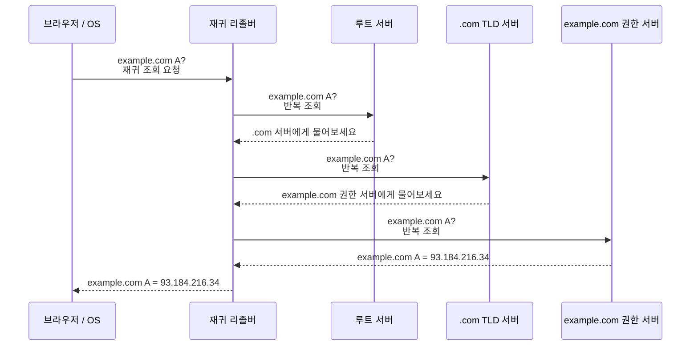
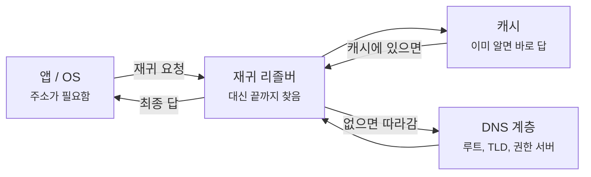
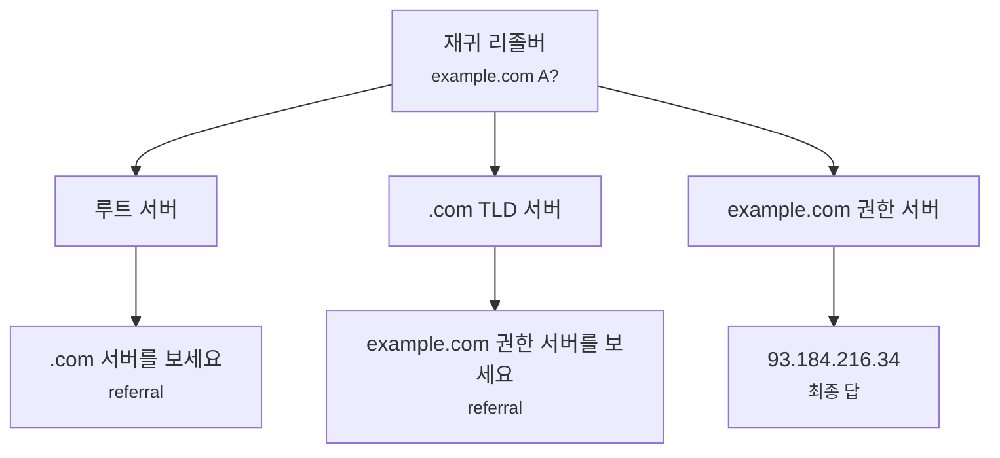
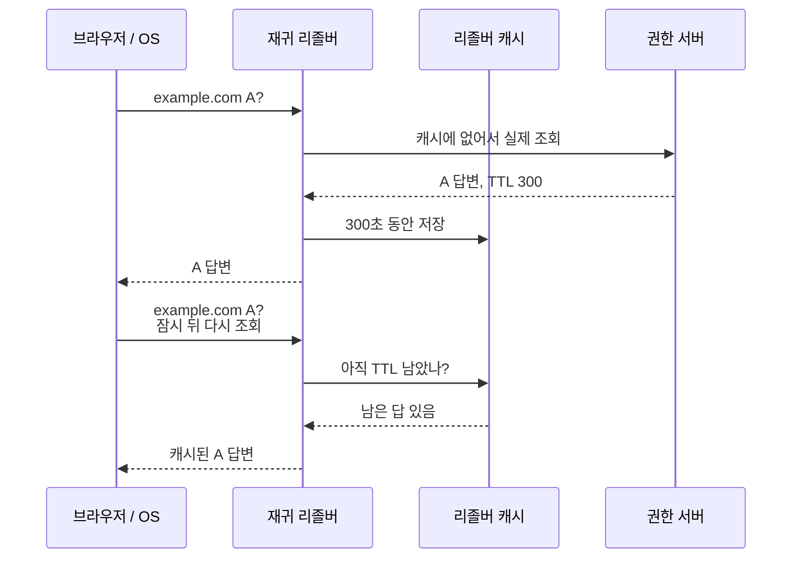
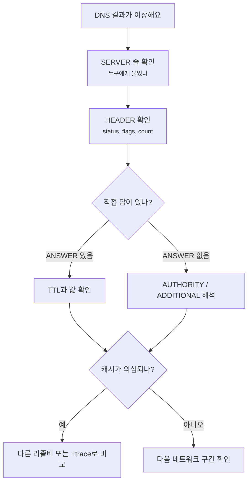

# DNS 재귀 조회와 반복 조회는 뭐가 다를까요?

> DNS는 그냥 한 서버에게 물어보면 끝날 것 같죠? **사실은 "누가 끝까지 찾아주는가"에 따라 완전히 다른 대화가 돼요.**

[DNS는 어떻게 이름을 IP 주소로 바꿀까요?](../basic/04-dns.md){ data-preview }에서는 DNS를 **이름을 숫자 주소로 바꿔주는 안내 데스크**로 봤어요.
그리고 [dig 출력은 어디부터 읽어야 할까요?](./dns-lookup-with-dig.md){ data-preview }에서는 그 조회 결과가 `HEADER`, `QUESTION`, `ANSWER`, `AUTHORITY`, `ADDITIONAL` 같은 구역으로 펼쳐진다는 것도 봤죠.

근데요, 여기서 한 가지가 은근히 헷갈려요.

- 내 브라우저는 DNS 서버에게 한 번만 물어본 것 같은데, 왜 루트 서버와 `.com` 서버 이야기가 나오죠?
- `dig +trace` 를 보면 내가 직접 여러 서버를 따라가는 것처럼 보이는데, 평소 조회도 그런 걸까요?
- `rd` 와 `ra` 플래그는 왜 자꾸 같이 보일까요?
- `AUTHORITY SECTION` 에 답 대신 다른 서버 이름이 오는 건 실패일까요, 힌트일까요?

이 글은 바로 그 질문을 풀기 위한 글이에요.
오늘은 **재귀 조회와 반복 조회가 한마디로 무엇인지**, **기본편의 DNS 조회 흐름과 어떻게 이어지는지**, **왜 이 둘을 나눠서 봐야 하는지**, 그리고 실제로 **리졸버가 어떤 순서로 루트, TLD, 권한 서버를 따라가는지** 같이 내려가볼게요.
DNS의 큰 모델은 [RFC 1034 4.3.1절](https://www.rfc-editor.org/rfc/rfc1034#section-4.3.1)과 [RFC 1035 7절](https://www.rfc-editor.org/rfc/rfc1035#section-7)에서 잡은 재귀/반복 조회 감각을 바탕으로 볼게요.

!!! note "이 글의 범위"
    여기서는 **재귀 리졸버가 대신 끝까지 찾아주는 흐름**과 **권한 서버가 다음 힌트만 돌려주는 흐름**을 구분하는 데 집중해요.
    DNSSEC 검증, QNAME minimization, resolver 구현별 캐시 정책, DoH/DoT 전송 경로는 여기서 깊게 열지 않을게요.
    그런 주제는 DNS 축의 뒤 글에서 따로 이어보면 돼요.

---

## 왜 이 차이를 알아야 할까요?

평소에는 재귀 조회와 반복 조회를 몰라도 웹사이트가 잘 열려요.
문제는 DNS 장애나 운영 확인을 할 때예요.

예를 들어 `dig example.com A` 를 쳤는데 답이 없다고 해볼게요.
이때 바로 *"권한 서버가 망가졌나?"* 라고 단정하면 위험해요.
실제로는 아래 중 하나일 수 있거든요.

- 내 컴퓨터가 물어본 **재귀 리졸버**가 캐시된 예전 답을 들고 있음
- 리졸버가 루트나 TLD에서 받은 **위임 힌트**를 따라가다 실패함
- 권한 서버는 정상인데, 내가 물은 리졸버에서 **재귀 기능을 제공하지 않음**
- `+trace` 로 직접 따라간 결과와 평소 리졸버 결과가 **서로 다른 경로**를 보고 있음

즉 DNS를 볼 때는 **"누가 누구에게 무엇을 부탁했는지"** 를 먼저 나눠야 해요.
그 경계가 바로 재귀 조회와 반복 조회예요.

---

## 재귀 조회와 반복 조회는 한마디로 뭐예요?

먼저 짧게 잡으면 이래요.

> **재귀 조회는 "대신 끝까지 찾아주세요"이고, 반복 조회는 "다음에 물어볼 곳만 알려주세요"예요.**

이 한 줄이 오늘의 핵심이에요.

| 기본편에서 잡은 감각 | 비유에서는 | 실제로는 |
|---|---|---|
| 브라우저가 DNS에게 물어봄 | 안내 데스크에 "끝까지 찾아주세요" 맡김 | Stub resolver → Recursive resolver |
| 리졸버가 대신 돌아다님 | 직원이 부서들을 돌며 담당자를 찾음 | Recursive resolver가 root/TLD/authoritative 서버 조회 |
| 중간 서버가 힌트를 줌 | "저쪽 부서에 물어보세요" 라고 안내 | Iterative response, referral |
| 최종 담당자가 답함 | 담당자가 실제 번호를 알려줌 | Authoritative answer |
| 같은 질문을 다시 빠르게 답함 | 안내 데스크가 메모해둔 답을 꺼냄 | Resolver cache |

여기서 중요한 건 **브라우저와 리졸버 사이의 대화**와 **리졸버와 권한 계층 사이의 대화**가 성격이 다르다는 점이에요.

브라우저는 보통 재귀 리졸버에게 이렇게 말해요.

> "`example.com` 주소가 필요해요. 제가 직접 돌아다니긴 어렵고, 대신 끝까지 찾아주세요."

반면 리졸버가 루트나 TLD 서버에게 물어볼 때는 보통 이런 식이에요.

> "`example.com` 을 알고 있나요? 모르면 다음에 누구한테 물어봐야 하는지 알려주세요."

이 두 대화를 한 덩어리로 뭉개면 `dig` 출력도, 캡처도, 장애 원인도 흐려져요.

---

## 전체 흐름을 먼저 한 장으로 볼까요?

평소 브라우저가 `example.com` 에 접속하려고 할 때의 흐름을 크게 그리면 이렇게 돼요.



이 그림에서 앞뒤를 나눠 보는 게 중요해요.
**앱 → 재귀 리졸버** 구간은 "대신 끝까지 찾아주세요"에 가깝고, **재귀 리졸버 → 루트/TLD/권한 서버** 구간은 "알면 답하고, 모르면 다음 힌트를 주세요"에 가까워요.

---

## 재귀 조회는 누가 끝까지 책임지는 흐름일까요? { #recursive-query }

재귀 조회에서는 질문을 받은 쪽이 **최종 답을 구해서 돌려주는 책임**을 져요.
보통 여러분의 컴퓨터나 브라우저가 직접 루트 서버를 따라다니지 않고, 집 공유기나 통신사 DNS, 회사 DNS, 공용 DNS 같은 **재귀 리졸버**에게 맡기는 이유가 여기에 있어요.



재귀 리졸버는 먼저 캐시를 봐요.
이미 답을 알고 있으면 루트 서버까지 가지 않고 바로 돌려줄 수 있어요.
캐시에 없으면 그때 루트, TLD, 권한 서버를 차례로 따라가죠.

이때 DNS 메시지 헤더에서는 `RD` 와 `RA` 를 자주 보게 돼요.

| 플래그 | 풀어 읽으면 | 누가 말하는 신호인가요? |
|---|---|---|
| `RD` | Recursion Desired | 클라이언트가 "재귀 조회를 원해요"라고 표시 |
| `RA` | Recursion Available | 서버가 "저는 재귀 조회를 제공할 수 있어요"라고 표시 |

`RD` 와 `RA` 는 비슷하게 생겼지만 같은 말이 아니에요.
`RD` 는 **부탁**이고, `RA` 는 **가능 여부**예요.

!!! warning "여기서 자주 헷갈려요"
    `flags: qr rd ra` 가 보인다고 해서, 그 응답이 반드시 루트부터 새로 따라간 결과라는 뜻은 아니에요.
    재귀 리졸버가 캐시에서 답을 꺼내도 `rd`, `ra` 는 그대로 보일 수 있어요.
    이 플래그는 **재귀 요청/제공의 관계**를 보여주지, 매번 실제로 전체 계층을 돌아다녔는지를 보장하진 않아요.

---

## 반복 조회는 왜 "힌트만 주는" 방식일까요? { #iterative-query }

반복 조회에서는 질문을 받은 서버가 **자기가 아는 만큼만 답해요**.
최종 답을 알고 있으면 답을 주고, 모르면 보통 다음에 물어볼 곳을 알려줘요.

루트 서버를 생각해볼까요?
루트 서버는 전 세계 모든 도메인의 IP 주소를 직접 들고 있지 않아요.
대신 `.com`, `.net`, `.kr` 같은 큰 구역을 누가 담당하는지 알고 있어요.



이 그림에서 루트와 TLD는 보통 최종 IP를 직접 주지 않아요.
대신 **다음 담당자 정보**를 줘요.
이런 응답을 흔히 referral, 즉 위임 힌트처럼 읽어요.

`dig` 출력에서는 이 힌트가 `AUTHORITY SECTION` 과 `ADDITIONAL SECTION` 쪽에 나타날 수 있어요.

| 섹션 | 반복 조회에서 자주 보이는 역할 | 예시 감각 |
|---|---|---|
| `ANSWER` | 직접 답 | `example.com. A 93.184.216.34` |
| `AUTHORITY` | 다음 담당 서버 이름 | `com. NS a.gtld-servers.net.` |
| `ADDITIONAL` | 그 담당 서버의 주소 힌트 | `a.gtld-servers.net. A ...` |

여기서 `AUTHORITY SECTION` 에 뭔가 나왔다고 해서 항상 실패는 아니에요.
오히려 반복 조회 중간에서는 **"다음은 여기로 가세요"** 라는 정상적인 안내일 수 있어요.

---

## `dig +trace` 는 왜 평소 조회와 다르게 보일까요?

DNS를 공부하다 보면 `dig +trace example.com` 을 자주 보게 돼요.
이 명령은 평소처럼 한 재귀 리졸버에게 끝까지 맡기는 장면이라기보다, **루트부터 시작해서 위임 힌트를 따라가는 과정을 눈앞에 펼쳐보는 장면**에 가까워요.

```bash
dig +trace example.com A
```

단순화하면 출력 흐름은 이런 식이에요.

```text
.                       NS      a.root-servers.net.
com.                    NS      a.gtld-servers.net.
example.com.            NS      a.iana-servers.net.
example.com.            A       93.184.216.34
```

이건 실제 값 전체를 그대로 외우자는 뜻이 아니에요.
읽는 순서가 중요해요.

1. 루트에서 시작해요.
2. `.com` 담당자를 받아요.
3. `example.com` 담당자를 받아요.
4. 마지막 권한 서버에서 `A` 답을 받아요.

평소 `dig example.com A` 는 보통 여러분이 설정한 재귀 리졸버에게 물어요.
반면 `+trace` 는 계층을 따라가는 모습을 보여주기 때문에, 둘의 결과가 다르게 보일 때도 있어요.
캐시, 접근 제한, 네트워크 경로, 권한 서버 응답 차이 같은 것들이 사이에 끼어들 수 있거든요.

!!! tip "이렇게 구분하면 편해요"
    - `dig example.com A` 는 **내가 쓰는 리졸버가 지금 뭐라고 답하는지** 보는 데 좋아요.
    - `dig +trace example.com A` 는 **DNS 위임 사슬이 어디까지 이어지는지** 보는 데 좋아요.

---

## 캐시는 이 흐름을 어떻게 바꿀까요?

처음 조회에서는 리졸버가 여러 단계를 따라갈 수 있어요.
하지만 같은 이름을 다시 묻는다면 이야기가 달라져요.



이 장면 때문에 DNS 장애가 더 헷갈려져요.
권한 서버의 설정을 바꿨는데도 어떤 사람은 새 주소를 보고, 어떤 사람은 예전 주소를 볼 수 있거든요.
그 차이는 **어느 재귀 리졸버를 쓰는지**, **그 리졸버가 언제 답을 캐시했는지**, **TTL이 얼마나 남았는지**에 따라 달라질 수 있어요.

여기서는 캐시가 조회 흐름을 짧게 만들 수 있다는 점까지만 잡을게요.
TTL 때문에 값이 오래 남는 문제는 다음 DNS 글에서 더 따로 열어볼게요.

---

## 실제로 헷갈리기 쉬운 장면을 나눠볼까요?

재귀 조회와 반복 조회를 구분하면, 아래 장면들을 훨씬 덜 성급하게 판단할 수 있어요.

| 장면 | 바로 단정하기 쉬운 말 | 더 정확한 첫 질문 |
|---|---|---|
| `status: NOERROR`, `ANSWER: 0` | DNS가 실패했네요 | 이름은 있는데 내가 물은 타입만 없는 건 아닐까요? |
| `AUTHORITY SECTION` 만 보임 | 답이 없으니 망가졌네요 | 위임 힌트나 부정 응답 근거를 받은 건 아닐까요? |
| `flags: rd ra` 가 보임 | 루트부터 새로 조회했네요 | 재귀 요청/제공 플래그일 뿐, 캐시 답일 수도 있지 않을까요? |
| `dig` 와 `dig +trace` 결과가 다름 | 둘 중 하나가 틀렸네요 | 재귀 리졸버 캐시와 권한 계층 직접 조회를 섞어 본 건 아닐까요? |
| 회사망에서만 결과가 다름 | DNS 전체 장애네요 | 회사 재귀 리졸버 정책이나 내부 DNS가 끼어든 건 아닐까요? |

이 표에서 핵심은 하나예요.
DNS 문제를 볼 때는 **결과값만 보지 말고, 그 결과를 누가 대신 찾아줬는지** 같이 봐야 해요.

---

## 그럼 진짜 DNS 조회를 볼 때는 어디부터 읽을까요?

운영 화면이나 터미널에서 DNS를 볼 때는 이런 순서가 편해요.

1. **내가 누구에게 물었는지** 봐요.
   - `dig` 출력의 `SERVER:` 줄을 먼저 확인해요.
2. **재귀 조회를 기대하는 장면인지** 봐요.
   - 일반 조회라면 보통 `rd`, `ra` 플래그가 보일 수 있어요.
3. **답이 직접 답인지 힌트인지** 봐요.
   - `ANSWER`, `AUTHORITY`, `ADDITIONAL` 을 나눠 읽어요.
4. **캐시 가능성을 의심해요.**
   - `TTL` 이 남아 있으면 예전 답이 정상적으로 보일 수도 있어요.
5. **필요할 때만 `+trace` 로 위임 사슬을 따라가요.**
   - 평소 리졸버 답과 권한 계층 흐름을 구분해서 봐요.



이 순서를 따르면 **DNS가 틀렸다**는 말이 조금 더 구체적으로 바뀌어요.
*"내가 쓰는 재귀 리졸버가 캐시된 답을 주는지"*, *"권한 서버까지 위임 사슬이 이어지는지"*, *"직접 답이 아니라 힌트를 보고 있는지"* 처럼요.

---

## 자, 정리해볼까요?

!!! abstract "오늘 우리가 배운 것"
    - **재귀 조회**는 클라이언트가 리졸버에게 **"대신 끝까지 찾아주세요"** 라고 맡기는 흐름이에요.
    - **반복 조회**는 서버가 최종 답을 모르면 **"다음에 여기로 가세요"** 라는 힌트를 주는 흐름이에요.
    - `RD` 는 재귀를 원한다는 부탁이고, `RA` 는 재귀를 제공할 수 있다는 표시예요.
    - `AUTHORITY SECTION` 은 실패 표시가 아니라, 위임 힌트나 부정 응답 근거일 수 있어요.
    - `dig` 와 `dig +trace` 는 같은 DNS를 보더라도 **재귀 리졸버의 답**과 **위임 사슬의 흐름**을 다르게 보여줘요.

재귀와 반복을 나눠서 보면, DNS가 갑자기 훨씬 덜 마법처럼 보여요.
누가 끝까지 찾아주는지, 누가 힌트만 주는지, 그리고 캐시가 어디에 끼어드는지만 나눠도 문제 장면을 훨씬 작게 쪼갤 수 있거든요.
