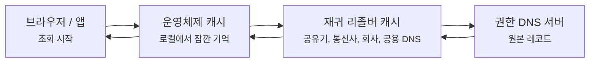
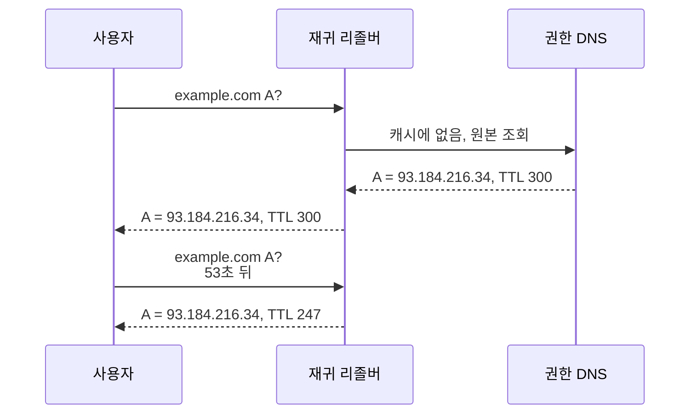
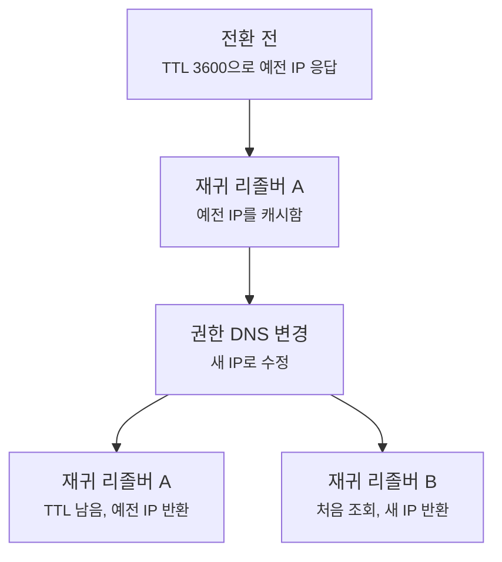
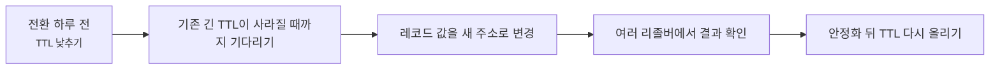

# DNS TTL과 캐시는 왜 바뀐 주소를 바로 안 보여줄까요?

> DNS 설정을 저장하면 전 세계가 바로 새 주소를 볼 것 같죠? **사실은 누군가는 아직 예전 답을 정상적으로 보고 있을 수 있어요.**

[DNS 재귀 조회와 반복 조회는 뭐가 다를까요?](./dns-resolver-recursion-vs-iteration.md){ data-preview }에서는 브라우저가 보통 **재귀 리졸버에게 대신 끝까지 찾아달라고 맡긴다**는 걸 봤어요.
그리고 [dig 출력은 어디부터 읽어야 할까요?](./dns-lookup-with-dig.md#dig-answer){ data-preview }에서는 `ANSWER SECTION` 의 `TTL` 값이 **이 답을 얼마나 캐시해도 되는지** 알려준다는 것도 봤죠.

근데요, 실제 운영에서는 이 장면이 제일 사람을 헷갈리게 만들어요.

- DNS 레코드를 바꿨는데 내 컴퓨터는 새 주소를 보고, 동료 컴퓨터는 예전 주소를 봐요.
- `dig` 로 보면 TTL이 계속 줄어드는데, 새로고침해도 결과가 안 바뀌어요.
- 레코드를 삭제했는데 한동안 `NXDOMAIN` 이 계속 남아 있는 것처럼 보여요.
- "전파가 아직 안 됐다"는 말을 듣긴 했는데, 정확히 어디에 남아 있는지 모르겠어요.

이 글은 바로 그 장면을 읽는 글이에요.
오늘은 **TTL이 한마디로 무엇인지**, **재귀 리졸버 캐시와 어떻게 연결되는지**, **왜 주소를 바꿔도 바로 모두에게 보이지 않는지**, 그리고 실제로 **전환 전에 TTL을 어떻게 낮추고, 전환 뒤에는 무엇을 확인해야 하는지** 같이 볼게요.
기본 TTL 의미는 [RFC 1035 3.2.1절](https://www.rfc-editor.org/rfc/rfc1035#section-3.2.1)의 리소스 레코드 형식을 기준으로 잡고, 없는 이름을 캐시하는 음성 캐시는 [RFC 2308](https://www.rfc-editor.org/rfc/rfc2308) 감각을 가볍게 빌려올게요.

!!! note "이 글의 범위"
    여기서는 **DNS 응답이 캐시에 남아서 예전 값처럼 보이는 장면**에 집중해요.
    CDN 캐시, 브라우저 HTTP 캐시, 프록시 캐시까지 한꺼번에 열지는 않을게요.
    여기서 말하는 캐시는 주로 **DNS 리졸버가 도메인 조회 결과를 잠깐 기억하는 캐시**예요.

---

## 왜 TTL을 알아야 할까요?

DNS 문제는 겉으로 보면 참 애매해요.

서버를 새 IP로 옮겼는데 어떤 사람은 잘 되고, 어떤 사람은 예전 서버로 가요.
운영자는 분명 권한 DNS에서 레코드를 바꿨는데, 사용자 쪽에서는 한동안 예전 값이 보여요.

이때 자주 나오는 말이 있어요.

> "DNS 전파가 아직 안 된 것 같아요."

틀린 말처럼 들리진 않지만, 이 표현만으로는 부족해요.
DNS 값이 공기처럼 퍼져 나가는 게 아니라, 여러 재귀 리졸버가 **각자 TTL이 끝날 때까지 예전 답을 들고 있는 장면**에 더 가깝거든요.

그래서 TTL을 모르면 이런 걸 구분하기 어려워요.

- 권한 DNS 설정이 아직 안 바뀐 건지
- 재귀 리졸버가 예전 답을 캐시하고 있는 건지
- 내 컴퓨터나 브라우저 쪽 캐시가 끼어든 건지
- 없는 이름이라는 답, 즉 `NXDOMAIN` 자체가 캐시된 건지

즉 TTL은 단순히 숫자 하나가 아니라, **DNS 변경이 언제쯤 실제 사용자에게 보일지 가늠하는 시간표**에 가까워요.

---

## TTL은 한마디로 뭐예요?

한 줄로 잡으면 이래요.

> **TTL은 "이 DNS 답을 몇 초 동안 다시 물어보지 않고 믿어도 되는지"를 적어둔 시간이에요.**

| 기본편에서 잡은 감각 | 비유에서는 | 실제로는 |
|---|---|---|
| DNS 답 | 안내 데스크가 알려준 주소 | Resource Record |
| TTL | 메모에 적힌 유통기한 | 캐시 가능 시간(초) |
| 재귀 리졸버 캐시 | 안내 데스크가 잠깐 보관한 메모 | Resolver cache |
| 권한 DNS | 원본 주소록 | Authoritative DNS server |
| 오래된 답 | 유통기한이 아직 남은 예전 메모 | Stale-looking cached answer |

여기서 조심할 점이 있어요.
TTL은 **"이 시간 뒤에 무조건 새 주소로 바뀐다"** 는 예약 시간이 아니에요.
정확히는 **"이 답을 받은 쪽이 이 시간 동안 캐시해도 된다"** 는 허용 시간에 가까워요.

그래서 같은 시각에 같은 도메인을 봐도, 리졸버마다 결과가 다를 수 있어요.
어떤 리졸버는 방금 새로 물어서 새 값을 받았고, 어떤 리졸버는 10분 전에 예전 값을 받아서 아직 TTL이 남아 있을 수 있거든요.

---

## 캐시는 어디에 남을까요?

DNS 캐시라고 하면 하나만 떠올리기 쉬운데, 실제로는 여러 층이 있어요.



이 그림에서 권한 DNS 서버가 원본에 가까워요.
하지만 사용자는 보통 권한 DNS에 직접 묻지 않고, 중간의 재귀 리졸버와 로컬 캐시를 거쳐요.

그래서 레코드를 바꿨을 때도 이렇게 갈릴 수 있어요.

- 권한 DNS는 이미 새 값을 갖고 있음
- 어떤 재귀 리졸버는 아직 예전 값을 TTL 동안 보관 중
- 어떤 재귀 리졸버는 TTL이 끝나 새 값을 다시 받아옴
- 내 운영체제나 브라우저도 아주 짧게 별도 캐시를 들고 있을 수 있음

이걸 한 문장으로 줄이면, **DNS 변경은 한 번에 전 세계를 덮어쓰는 일이 아니라 각 캐시가 만료되며 서서히 새 답을 다시 받아오는 일**이에요.

---

## TTL이 줄어드는 모습은 어떻게 보일까요?

`dig` 로 같은 리졸버에 여러 번 물어보면 TTL이 줄어드는 모습을 볼 수 있어요.
예시는 읽기 흐름을 보여주기 위해 단순화했어요.

```bash
dig example.com A
```

```text
;; ANSWER SECTION:
example.com.             300     IN      A       93.184.216.34

;; SERVER: 192.168.0.1#53(192.168.0.1) (UDP)
```

잠시 뒤 같은 리졸버에 다시 물으면 이렇게 보일 수 있어요.

```text
;; ANSWER SECTION:
example.com.             247     IN      A       93.184.216.34
```

여기서 `300` 이 `247` 로 줄었다면, 이 리졸버가 **권한 서버에 새로 물어본 게 아니라 캐시에 있던 답을 꺼내고 있다**고 볼 수 있어요.
물론 구현마다 표시 방식은 조금씩 다를 수 있지만, 운영 관점에서는 이 감각이 꽤 유용해요.



이 장면에서 핵심은 **TTL은 응답을 받은 순간부터 내려가는 숫자**라는 거예요.
권한 DNS의 원본 TTL이 300초라도, 캐시에서 꺼낸 응답은 남은 시간이 247초처럼 보일 수 있어요.

---

## 왜 바꾼 주소가 바로 안 보일까요?

이제 전환 장면을 보죠.
처음에는 `example.com` 이 예전 서버를 가리키고 있었어요.

```text
example.com.    3600    IN    A    192.0.2.10
```

그리고 운영자가 권한 DNS에서 새 서버로 바꿨어요.

```text
example.com.    3600    IN    A    198.51.100.20
```

권한 DNS에서는 이미 새 값이에요.
그런데 어떤 사용자는 여전히 `192.0.2.10` 으로 가요.
왜 그럴까요?



리졸버 A는 전환 전에 예전 답을 받았고, 아직 TTL이 남아 있어요.
그러면 그 리졸버를 쓰는 사용자는 한동안 예전 IP를 볼 수 있어요.
반면 리졸버 B는 전환 뒤 처음 조회했기 때문에 새 IP를 바로 볼 수 있죠.

그래서 DNS 변경 직후에 사람마다 결과가 다르게 보이는 건 꼭 이상한 일이 아니에요.
TTL 안에서는 **서로 다른 캐시 상태가 공존할 수 있기 때문**이에요.

---

## "전파"라는 말은 어디까지 맞을까요?

현장에서 "DNS 전파"라는 말을 많이 써요.
편하게 말할 때는 괜찮지만, 문제를 좁혀야 할 때는 조금 더 정확하게 보는 게 좋아요.

| 흔한 표현 | 더 정확히 보면 |
|---|---|
| DNS가 아직 전파 안 됐어요 | 일부 재귀 리졸버가 예전 답을 TTL 동안 캐시하고 있을 수 있어요 |
| 내 컴퓨터만 이상해요 | 내 네트워크가 쓰는 리졸버나 로컬 캐시가 다른 답을 들고 있을 수 있어요 |
| 권한 DNS가 안 바뀐 것 같아요 | 권한 DNS와 재귀 리졸버 결과를 나눠서 봐야 해요 |
| TTL을 낮췄는데 왜 아직 예전 값이 보이죠? | TTL을 낮추기 전에 받아간 예전 긴 TTL이 아직 남아 있을 수 있어요 |

특히 마지막 줄이 중요해요.
전환 직전에 TTL을 3600에서 60으로 낮췄다고 해도, 이미 누군가가 **TTL 3600짜리 예전 답**을 받아갔다면 그 캐시는 바로 짧아지지 않아요.
새 TTL은 다음에 새로 받아가는 답부터 의미가 있어요.

---

## DNS 전환 전에는 어떻게 준비하면 좋을까요?

전환을 부드럽게 하고 싶다면, 보통 이런 순서로 생각해요.



예를 들어 기존 TTL이 3600초였다면, 전환 직전에 낮추는 것보다 **적어도 기존 TTL만큼 미리 낮춰두는 편**이 좋아요.
그래야 전환 시점에 많은 리졸버가 짧은 TTL을 들고 있게 되거든요.

실무 감각으로는 이렇게 나눠볼 수 있어요.

| 시점 | 할 일 | 이유 |
|---|---|---|
| 전환 전 | TTL을 낮춤 | 새 값으로 바꿨을 때 캐시가 빨리 만료되게 함 |
| 전환 전 대기 | 기존 긴 TTL이 빠질 시간을 둠 | 이미 받아간 긴 캐시가 남아 있을 수 있음 |
| 전환 시점 | A/AAAA/CNAME 값을 변경 | 원본 권한 DNS 값을 바꿈 |
| 전환 직후 | 여러 리졸버에 조회 | 캐시 상태가 리졸버마다 다른지 확인 |
| 안정화 뒤 | TTL을 다시 적절히 올림 | 불필요한 조회 부담을 줄임 |

여기서 TTL을 무조건 짧게 두는 게 늘 좋은 건 아니에요.
TTL이 너무 짧으면 변경 반영은 빨라질 수 있지만, 재귀 리졸버가 권한 DNS에 더 자주 물어봐야 해요.
반대로 TTL이 너무 길면 평소 조회 부담은 줄지만, 변경이 늦게 보일 수 있어요.

> 결국 TTL은 **변경 민첩성**과 **조회 부담** 사이의 균형이에요.

---

## 없는 이름도 캐시될 수 있어요

여기서 한 가지 더 헷갈리는 장면이 있어요.
DNS 캐시는 성공한 답만 저장할 것 같죠?
**사실은 없는 이름이라는 답도 잠깐 캐시될 수 있어요.**

예를 들어 아직 `api.example.com` 레코드를 만들기 전에 누군가 조회했어요.
그때 `NXDOMAIN` 이 캐시되면, 곧바로 레코드를 만들어도 일부 리졸버는 잠깐 동안 **"그 이름은 없어요"** 라는 예전 판단을 계속 돌려줄 수 있어요.

```text
;; ->>HEADER<<- opcode: QUERY, status: NXDOMAIN, id: 12031
;; flags: qr rd ra; QUERY: 1, ANSWER: 0, AUTHORITY: 1, ADDITIONAL: 1

;; AUTHORITY SECTION:
example.com.     300     IN      SOA     ns1.example.com. hostmaster.example.com. ...
```

이런 걸 보통 **negative caching**, 여기서는 쉽게 **음성 캐시**라고 부를게요.
없다는 답도 운영상 의미가 있기 때문에, 리졸버는 그 판단을 잠깐 기억할 수 있어요.

!!! warning "새 서브도메인을 만들 때 조심할 점"
    새 이름을 만들기 직전에 미리 조회 테스트를 많이 해두면, 일부 리졸버가 **없다는 답**을 캐시할 수 있어요.
    그래서 새 레코드를 추가했는데도 잠깐 `NXDOMAIN` 이 남아 보이는 장면이 생길 수 있어요.

---

## 실제 확인은 어떤 순서로 하면 좋을까요?

DNS 값이 바뀌었는지 볼 때는 한 군데만 보지 않는 게 좋아요.
권한 DNS와 재귀 리졸버를 나눠서 보면 훨씬 빨라요.

```bash
dig example.com A
dig @1.1.1.1 example.com A
dig @8.8.8.8 example.com A
dig @ns1.example.com example.com A
```

읽을 때는 순서가 중요해요.

1. **내 기본 리졸버 결과**를 봐요.
   - 그냥 `dig example.com A` 로 지금 내가 쓰는 경로를 확인해요.
2. **다른 재귀 리졸버 결과**를 비교해요.
   - `@1.1.1.1`, `@8.8.8.8` 처럼 서로 다른 캐시 상태를 봐요.
3. **권한 DNS 결과**를 따로 확인해요.
   - 권한 서버를 직접 지정하면 원본 설정에 더 가까운 값을 볼 수 있어요.
4. **TTL이 줄어드는지** 봐요.
   - 줄어드는 TTL은 캐시에서 나온 답일 가능성을 알려줘요.
5. **`ANSWER` 와 `AUTHORITY` 를 나눠 읽어요.**
   - 값이 없는 건지, 이름이 없는 건지, 힌트만 받은 건지 구분해요.

!!! tip "이것만 기억해도 충분해요"
    DNS 변경을 확인할 때는 **값 하나만 보지 말고, 어느 서버에게 물었는지와 TTL이 얼마 남았는지**를 같이 보세요.
    같은 도메인이라도 리졸버마다 캐시 상태가 다를 수 있어요.

---

## 자, 정리해볼까요?

!!! abstract "오늘 우리가 배운 것"
    - **TTL** 은 DNS 답을 몇 초 동안 캐시해도 되는지 알려주는 시간이에요.
    - DNS 값을 바꿔도, 이미 예전 답을 받은 재귀 리졸버는 TTL이 끝날 때까지 예전 값을 줄 수 있어요.
    - `dig` 에서 TTL이 줄어드는 모습은 캐시된 답을 보고 있다는 힌트가 될 수 있어요.
    - DNS 전환 전에는 TTL을 미리 낮추고, 기존 긴 TTL이 빠질 시간을 둔 뒤 값을 바꾸는 편이 좋아요.
    - 성공한 답뿐 아니라 `NXDOMAIN` 같은 **없는 이름이라는 답**도 잠깐 캐시될 수 있어요.

DNS TTL은 작은 숫자처럼 보이지만, 운영에서는 꽤 큰 시간표예요.
어디에 예전 답이 남아 있는지, 얼마나 기다리면 새 답을 다시 물어볼지, 그리고 지금 보는 값이 원본인지 캐시인지 구분하는 기준이 되거든요.
