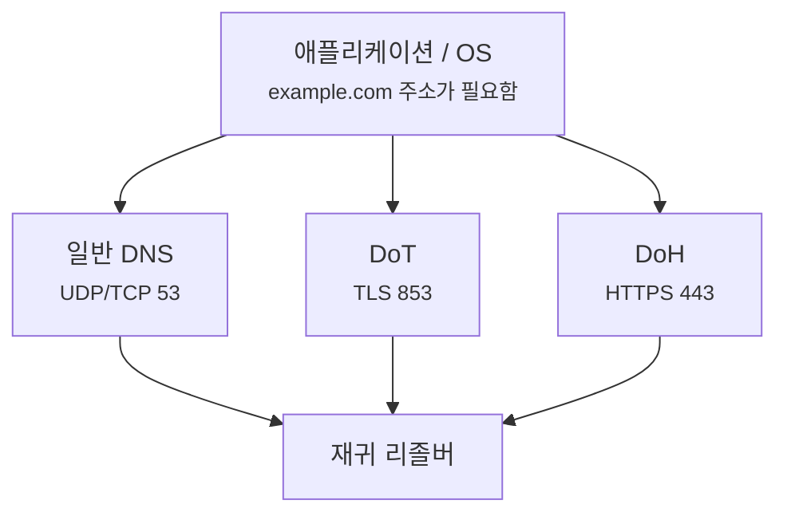
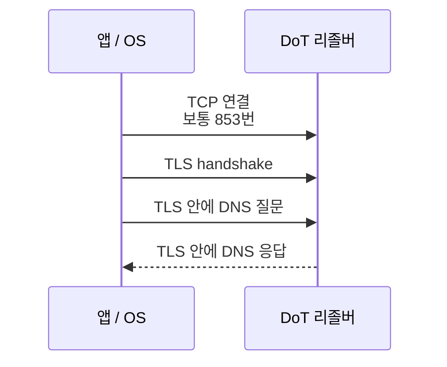
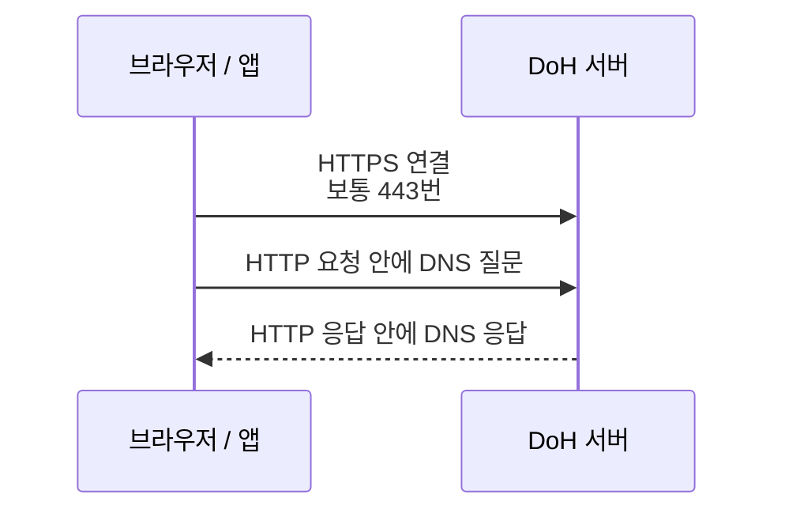
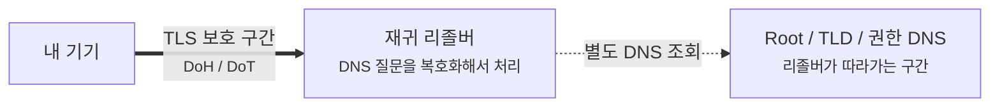

# DoH와 DoT는 DNS 경로를 어디까지 숨겨줄까요?

> DNS도 HTTPS처럼 암호화하면, 이제 아무도 내가 어떤 사이트를 찾는지 모를 것 같죠? **사실은 숨겨지는 구간과 남는 흔적을 나눠 봐야 해요.**

[DNS는 어떻게 이름을 IP 주소로 바꿀까요?](../basic/04-dns.md){ data-preview }에서는 브라우저가 도메인 이름을 바로 이해하는 게 아니라, 먼저 DNS로 주소를 묻는다고 봤어요. 그리고 [DNSSEC은 DNS 응답을 어떻게 믿게 만들어줄까요?](./dnssec-overview.md){ data-preview }에서는 그 답이 진짜인지 검증하는 구조를 봤죠.

근데요, DNSSEC을 알고 나면 또 다른 질문이 생겨요.

- DNS 응답이 진짜인지 검증하는 건 알겠어요.
- 그런데 DNS 질문 자체는 누가 볼 수 있나요?
- 회사, 카페 와이파이, 통신사, 중간 장비는 내가 묻는 이름을 볼까요?
- DoH나 DoT를 쓰면 DNS가 완전히 사라진 것처럼 숨겨질까요?

여기서 **DoH**와 **DoT**가 등장해요. 둘 다 DNS 질문과 응답을 암호화된 통로에 실어 보내는 방식이에요. 하지만 둘의 목적은 DNSSEC과 달라요. DNSSEC은 **답의 진위 검증**, DoH와 DoT는 주로 **클라이언트와 재귀 리졸버 사이 전송 경로 보호**에 가까워요.

오늘은 **평문 DNS 경로가 어디서 보이는지**, **DoT와 DoH가 그 경로를 어떻게 감싸는지**, **그래도 어떤 신호는 남는지**, 그리고 실제 운영 장면에서 **포트, 프로토콜, 리졸버 선택, 로그 위치**를 어떻게 나눠 읽어야 하는지 볼게요. 큰 규칙은 DNS over TLS를 정의한 [RFC 7858](https://www.rfc-editor.org/rfc/rfc7858)과 DNS over HTTPS를 정의한 [RFC 8484](https://www.rfc-editor.org/rfc/rfc8484)의 흐름을 바탕으로 잡을게요.

!!! note "이 글의 범위"
    여기서는 DoH와 DoT를 **DNS 질문을 어떤 통로로 리졸버까지 보내는가** 관점에서 볼게요. Oblivious DoH, DDR, 기업 보안 정책, 브라우저별 자동 전환 정책은 깊게 열지 않아요. 오늘은 *"무엇이 암호화되고, 어디부터 다시 보이는가"* 를 붙잡으면 충분해요.

---

## 왜 DoH와 DoT를 알아야 할까요?

기본 DNS는 보통 UDP 53번이나 TCP 53번으로 오가요. 빠르고 단순하지만, 전통적인 형태에서는 질문 이름이 평문으로 보일 수 있어요.

예를 들어 노트북이 카페 와이파이에 붙어서 `example.com A?` 라고 묻는다고 해볼게요. 이때 경로 위의 장비는 DNS 패킷을 보고 이런 정도의 정보를 알 수 있어요.

- 어느 기기가 DNS 질문을 보냈는지
- 어느 리졸버에게 물었는지
- 어떤 도메인 이름을 물었는지
- 응답이 어떤 주소를 돌려줬는지

물론 모든 장비가 항상 이걸 적극적으로 기록한다는 뜻은 아니에요. 다만 기본 DNS는 구조상 **보일 수 있는 형태**에 가까웠어요. DoH와 DoT는 이 지점을 바꿔요. DNS 메시지 자체를 TLS가 보호하는 통로 안에 넣어서, 중간 경로에서 질문과 응답 내용을 그대로 읽기 어렵게 만들어요.

---

## 우편엽서에서 봉인된 봉투로 바뀌는 장면

동네 안내 데스크에 주소를 묻는다고 상상해볼게요.

평문 DNS는 우편엽서에 가깝게 느껴져요.

> "example.com 주소 알려주세요."

엽서는 빠르고 간단하지만, 배달 경로 중간에서 겉면을 보면 질문 내용이 보여요.

DoT와 DoH는 이 질문지를 봉투에 넣고 봉인해서 보내는 쪽에 가까워요.

> "봉인된 봉투 안에 DNS 질문이 들어 있어요."

중간 배달자는 봉투가 어디로 가는지는 볼 수 있어도, 봉투 안쪽 질문 내용은 바로 읽기 어려워져요. 다만 봉투가 **어느 안내 데스크로 가는지**는 여전히 보일 수 있어요. 여기서 감각을 나눠야 해요.

| 비유에서는 | 실제로는 |
|---|---|
| 엽서에 적힌 질문 | 평문 DNS 질의와 응답 |
| 봉인된 봉투 | TLS로 보호되는 통로 |
| 안내 데스크 주소 | 재귀 리졸버의 IP 주소나 호스트 |
| 봉투를 들고 가는 길 | 클라이언트에서 리졸버까지의 네트워크 경로 |
| 안내 데스크가 다시 찾는 과정 | 리졸버가 권한 DNS들을 따라가는 조회 |

핵심은 **봉투가 끝까지 모든 곳을 가리는 건 아니라는 점**이에요. DoH와 DoT는 보통 클라이언트와 재귀 리졸버 사이를 보호해요. 그 뒤 리졸버가 권한 서버를 찾아가는 구간은 별도의 이야기예요.

---

## 일반 DNS, DoT, DoH는 어디가 다를까요?

먼저 세 가지를 한 줄로 비교해볼게요.

| 방식 | 주로 보이는 통로 | 기본 포트 감각 | DNS 메시지는 어떻게 실리나요? |
|---|---|---|---|
| 일반 DNS | UDP/TCP | 53 | DNS 메시지가 그대로 오가요 |
| DoT | TLS 위의 DNS | 853 | DNS 메시지를 TLS 연결 안에 실어요 |
| DoH | HTTPS 위의 DNS | 443 | DNS 메시지를 HTTP 요청/응답 몸체에 실어요 |

DoT는 이름 그대로 **DNS over TLS**예요. DNS 전용 TLS 통로를 만들고, 그 안에 DNS 메시지를 넣어요.

DoH는 **DNS over HTTPS**예요. 겉으로는 HTTPS 요청처럼 보이고, 그 요청 안에 DNS 메시지를 실어요. 그래서 네트워크 장비 입장에서는 일반 웹 트래픽과 같은 443번 흐름으로 섞여 보일 수 있어요.

이 그림에서 목적지는 셋 다 재귀 리졸버예요. 달라지는 건 **DNS 질문을 어떤 포장으로 리졸버까지 가져가느냐**예요.

---

## DoT는 어떤 느낌으로 읽으면 될까요?

DoT는 DNS 전용 터널처럼 읽으면 좋아요.

DoT의 장점은 역할이 비교적 분명하다는 거예요. 853번을 보면 *"아, DNS를 TLS로 보호하는 흐름일 수 있겠구나"* 하고 읽기 쉬워요.

반대로 운영 정책에서는 이 분명함이 장단점이 돼요. 방화벽이나 네트워크 정책에서 DoT를 허용하거나 차단하기가 상대적으로 쉬워요. 전용 포트를 쓰는 흐름이니까요.

---

## DoH는 어떤 느낌으로 읽으면 될까요?

DoH는 DNS 메시지를 HTTPS 요청 안에 넣어요.

DoH에서는 DNS가 웹 요청처럼 포장돼요. 그래서 중간 장비가 단순히 포트만 보고 DNS인지 구분하기 어려울 수 있어요. 하지만 그렇다고 완전히 사라지는 건 아니에요.

여전히 이런 신호는 남을 수 있어요.

| 남는 신호 | 왜 남을 수 있나요? |
|---|---|
| DoH 서버의 IP 주소 | 어디와 HTTPS 연결했는지는 보일 수 있어요 |
| 연결 시간과 크기 패턴 | 암호화돼도 트래픽의 크기와 타이밍은 남을 수 있어요 |
| TLS의 일부 메타데이터 | 환경에 따라 서버 이름 관련 신호가 보일 수 있어요 |
| 리졸버 쪽 로그 | 질문을 받은 리졸버는 DNS 내용을 처리해야 해요 |

즉 DoH는 중간 경로에서 DNS 내용을 읽기 어렵게 만들지만, **내가 어떤 리졸버를 믿고 맡기는지**는 여전히 중요한 문제가 돼요.

---

## 그럼 리졸버 뒤쪽은 어떻게 될까요?

여기서 가장 많이 헷갈리는 부분이 나와요.

> *"DoH를 쓰면 DNS 전체가 끝까지 암호화되는 거죠?"*

사실은 그렇게 단순하지 않아요. 일반적인 DoH/DoT는 **클라이언트에서 재귀 리졸버까지**의 구간을 보호해요. 재귀 리졸버는 질문 내용을 알아야 대신 답을 찾아줄 수 있어요.

이 그림에서 두꺼운 선은 DoH/DoT가 보호하는 대표 구간이에요. 점선 구간은 리졸버가 권한 서버들을 따라가며 답을 찾는 쪽이에요. 그 구간이 항상 같은 방식으로 암호화된다고 보면 안 돼요.

그래서 DoH/DoT를 사용할 때 질문은 이렇게 바뀌어요.

- 중간 네트워크에게 DNS 질문을 덜 보이게 하고 싶은가요?
- 어떤 재귀 리졸버를 신뢰할 건가요?
- OS가 쓰는 리졸버와 브라우저가 쓰는 리졸버가 같은가요?
- 사내망 도메인이나 내부 DNS 정책은 어떻게 처리되나요?

DoH/DoT는 DNS 질문을 없애는 기술이 아니라, **질문을 맡기는 경로와 신뢰 지점을 바꾸는 기술**에 가까워요.

---

## DNSSEC, DoH, DoT는 어떻게 나눠 읽어야 할까요?

세 기술은 이름이 모두 DNS와 보안을 떠올리게 해서 섞이기 쉬워요. 하지만 보호하는 위치가 달라요.

| 기술 | 주로 보호하는 것 | 보호하지 않는 것 |
|---|---|---|
| DNSSEC | DNS 응답이 진짜 권한 데이터인지 | 질문과 응답 내용을 숨기지는 않아요 |
| DoT | 클라이언트와 리졸버 사이 DNS 전송 내용 | 리졸버가 질문을 아는 사실 |
| DoH | 클라이언트와 리졸버 사이 DNS 전송 내용 | 리졸버 선택과 HTTPS 트래픽 메타데이터 |

DNSSEC은 **도장이 진짜인지 확인하는 구조**예요. DoH와 DoT는 **도장 찍힌 문서를 봉투에 넣어 보내는 구조**에 가까워요. 둘은 경쟁 관계가 아니라 보는 층이 달라요.

!!! tip "나눠 기억하기"
    **DNSSEC은 답을 믿어도 되는지**, **DoH/DoT는 질문과 답이 리졸버까지 가는 길에서 그대로 보이는지**를 다뤄요.

---

## 실제 장면에서는 어떤 신호를 보면 될까요?

운영이나 디버깅에서 DoH/DoT가 끼면, "DNS가 안 돼요"라는 말만으로는 부족해져요. 어디에서 막혔는지 나눠야 해요.

| 볼 것 | 왜 보나요? |
|---|---|
| 사용 중인 리졸버 | 어느 서버에게 DNS 질문을 맡기는지 확인해요 |
| 프로토콜과 포트 | 일반 DNS 53인지, DoT 853인지, DoH 443인지 나눠요 |
| OS 설정과 브라우저 설정 | 브라우저만 별도 DoH를 쓸 수 있어서예요 |
| 사내 도메인 해석 여부 | 내부 DNS가 우회되면 내부 이름이 안 풀릴 수 있어요 |
| 방화벽과 프록시 정책 | DoT 853 또는 특정 DoH 엔드포인트가 막힐 수 있어요 |
| DNSSEC 검증 여부 | 전송 암호화와 응답 검증은 별도 문제라서예요 |

예를 들어 회사 네트워크에서 `intranet.local` 같은 내부 이름이 브라우저에서만 안 풀린다고 해볼게요. 이때는 DNS 서버가 죽었다고 단정하기 전에, 브라우저가 OS의 사내 DNS 대신 외부 DoH 리졸버를 쓰고 있는지 확인해야 해요.

반대로 집에서는 잘 되는데 카페 와이파이에서만 DoT가 안 된다면, 853번 연결이 막혔는지 볼 수 있어요. DoH라면 443번 HTTPS처럼 보이기 때문에 포트만으로는 더 구분이 어려울 수 있고, 어떤 DoH 서버와 통신하는지까지 봐야 해요.

---

## 잘못 읽기 쉬운 함정

DoH와 DoT는 "암호화된 DNS"라는 말 때문에 과하게 이해되기 쉬워요.

| 헷갈리는 읽기 | 더 정확한 읽기 |
|---|---|
| DoH/DoT를 쓰면 DNS가 아무에게도 안 보인다 | 재귀 리졸버는 질문을 처리해야 하므로 내용을 알아요 |
| DoH는 DNSSEC을 대신한다 | DoH는 전송 보호, DNSSEC은 응답 검증이에요 |
| DoT는 항상 DoH보다 안전하다 | 포장 방식과 운영 특성이 다를 뿐, 신뢰 지점과 설정을 함께 봐야 해요 |
| DoH는 443이라 무조건 통과한다 | 네트워크 정책이나 엔드포인트 차단에 따라 막힐 수 있어요 |
| 브라우저에서 되는 DNS는 OS에서도 똑같이 된다 | 브라우저가 별도 DoH 설정을 쓰면 경로가 달라질 수 있어요 |

특히 마지막 줄이 실제 디버깅에서 자주 중요해요. 터미널의 `dig`는 OS나 지정한 리졸버를 보고, 브라우저는 자체 DoH 설정을 볼 수 있어요. 그래서 **같은 노트북인데 앱마다 DNS 결과가 다르다**는 장면이 생길 수 있어요.

---

## 자, 정리해볼까요?

!!! abstract "오늘 우리가 배운 것"
    - 일반 DNS는 전통적으로 UDP/TCP 53번에서 질문 이름과 응답이 보일 수 있는 형태였어요.
    - DoT는 DNS 메시지를 TLS 통로에 넣어 보통 853번으로 보내는 방식이에요.
    - DoH는 DNS 메시지를 HTTPS 요청/응답 안에 넣어 보통 443번으로 보내는 방식이에요.
    - DoH/DoT는 주로 **클라이언트와 재귀 리졸버 사이**를 보호하고, 재귀 리졸버는 질문 내용을 처리해야 해요.
    - DNSSEC은 응답 검증, DoH/DoT는 전송 경로 보호라서 서로 대신하는 관계가 아니에요.

이제 DoH와 DoT를 보면 *"DNS가 완전히 보이지 않게 되는 마법"* 이 아니라, **DNS 질문을 리졸버까지 가져가는 봉투를 TLS로 봉인하는 방식**으로 읽으면 돼요.

## 이어서 보면 좋은 글

- [DNSSEC은 DNS 응답을 어떻게 믿게 만들어줄까요?](./dnssec-overview.md){ data-preview } — 전송 경로 보호와 응답 검증을 나눠 보고 싶을 때 같이 보면 좋아요.
- [DNS 재귀 조회와 반복 조회는 뭐가 다를까요?](./dns-resolver-recursion-vs-iteration.md){ data-preview } — DoH/DoT가 주로 보호하는 클라이언트와 재귀 리졸버 사이, 그리고 리졸버 뒤쪽 조회를 구분하고 싶을 때 좋아요.
- [dig 출력은 어디부터 읽어야 할까요?](./dns-lookup-with-dig.md){ data-preview } — 터미널에서 일반 DNS 경로를 먼저 읽는 감각을 잡고 싶을 때 이어서 보면 좋아요.

## 이어서 볼 질문

> *"DNS까지 봤으니, 이제 HTTP 요청 자체는 어떤 문법으로 생겼을까요?"*

다음에는 DNS 뒤에 이어지는 **HTTP/1.1 메시지의 시작 줄, 헤더, 본문 구조**를 열어볼게요.
