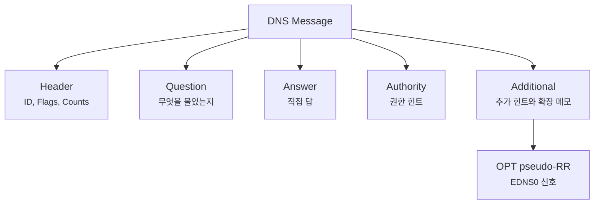
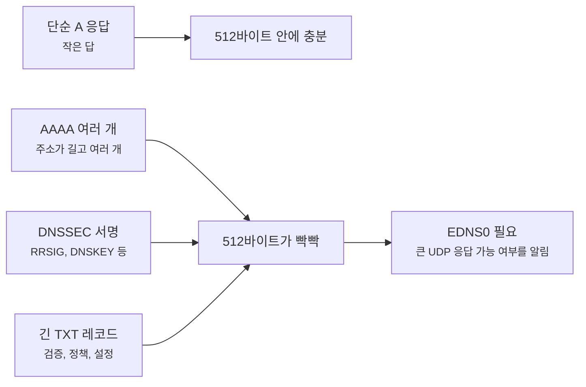
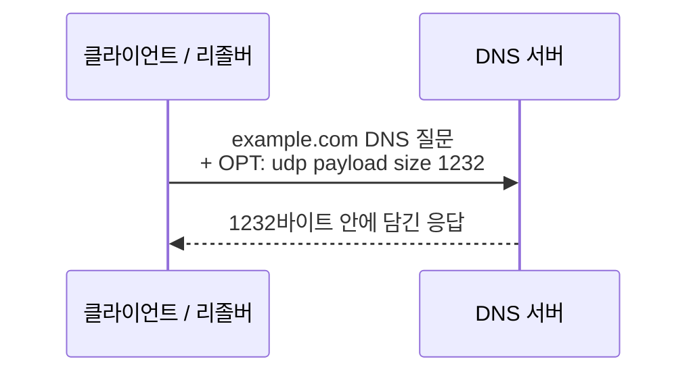
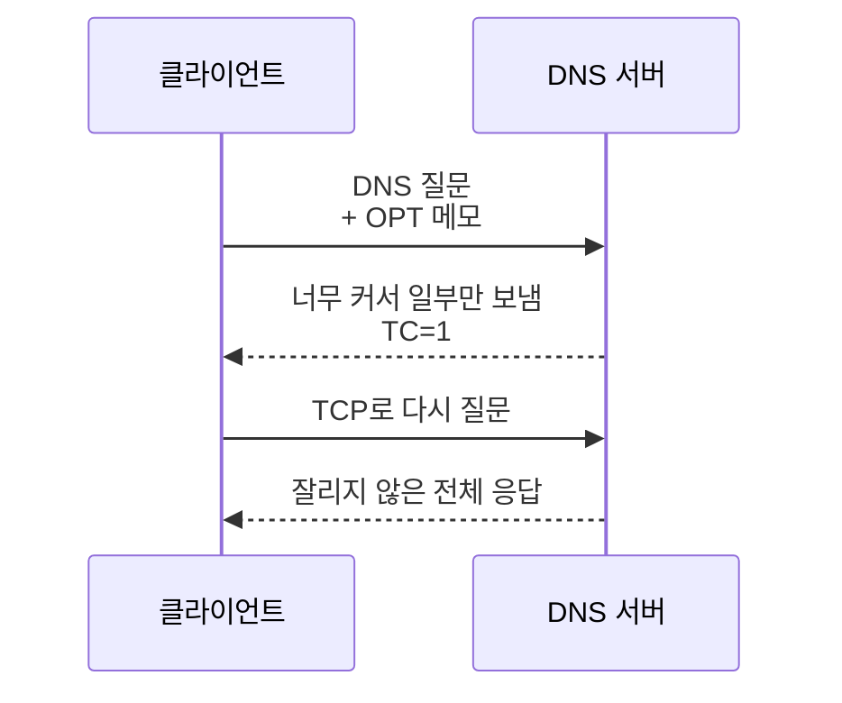

# EDNS0는 DNS 메시지 크기를 어떻게 넓혀줄까요?

> DNS는 질문도 짧고 답도 짧을 것 같죠? **사실은 요즘 DNS 응답은 512바이트 안에 다 못 들어가는 일이 꽤 자연스러워요.**

[A, AAAA, CNAME... DNS 레코드는 왜 종류가 여러 갈래일까요?](../basic/10-dns-records.md){ data-preview }에서는 DNS 응답이 단순한 주소 하나가 아니라, A, AAAA, CNAME, TXT 같은 **서로 다른 종류의 메모**로 나뉜다는 걸 봤어요. 그리고 [DNS 메시지는 왜 질문 하나에 칸이 이렇게 많을까요?](./dns-message-format.md){ data-preview }에서는 그 메모들이 `Answer`, `Authority`, `Additional` 같은 구역에 담긴다는 것도 봤죠.

근데요, 여기서 이상한 질문이 하나 생겨요.

- DNS는 원래 UDP로 가볍게 물어보고 답하는 느낌이었잖아요?
- 그런데 TXT 레코드가 길거나, IPv6 주소가 여러 개 붙거나, DNSSEC 서명까지 들어오면 어떻게 될까요?
- 512바이트 안에 못 들어가면 그냥 답을 포기할까요?
- 아니면 처음부터 TCP로만 바꿔야 할까요?

**사실은 둘 다 아니에요.** DNS는 기존 메시지 모양을 크게 깨지 않으면서, *"저는 더 큰 UDP 응답을 받을 수 있어요"* 라는 확장 메모를 붙이는 쪽을 택했어요. 그 확장 방식이 바로 **EDNS0**예요.

오늘은 **EDNS0가 한마디로 무엇인지**, **왜 DNS 메시지 크기 문제에서 나왔는지**, **기본 DNS 메시지의 Additional 구역과 어떻게 연결되는지**, 그리고 그다음에야 **OPT 의사 레코드, UDP payload size, TC 비트, TCP fallback** 순서로 내려가볼게요. 큰 규칙은 [RFC 6891](https://www.rfc-editor.org/rfc/rfc6891)의 EDNS(0) 정의를 기준으로 보고, TCP로 다시 묻는 운영 감각은 [RFC 7766](https://www.rfc-editor.org/rfc/rfc7766)의 DNS over TCP 요구사항과 이어서 생각하면 돼요.

!!! note "이 글의 범위"
    여기서는 EDNS0를 **DNS 메시지 크기와 확장 메모** 관점에서 볼게요. DNSSEC 검증, DoH/DoT, EDNS Client Subnet 같은 개별 옵션은 깊게 열지 않아요. 오늘은 `OPT PSEUDOSECTION` 이 왜 보이고, `udp: 1232` 같은 숫자를 어떻게 읽어야 하는지에 집중하면 충분해요.

---

## 왜 EDNS0를 알아야 할까요?

처음 DNS를 배울 때는 이런 장면이 편해요.

클라이언트가 `example.com A?` 라고 묻고, DNS 서버가 `93.184.216.34` 같은 주소 하나를 돌려주는 장면이죠. 이렇게만 보면 DNS 응답은 아주 작아 보여요. 실제로 예전의 단순한 A 레코드 하나라면 작은 UDP 메시지로 충분한 경우가 많았어요.

하지만 지금의 DNS는 주소 하나만 들고 다니지 않아요.

- IPv4 주소와 IPv6 주소가 여러 개 붙을 수 있어요.
- `TXT` 레코드가 도메인 검증, 메일 정책, 서비스 설정 때문에 길어질 수 있어요.
- DNSSEC을 쓰면 서명과 키 정보가 응답에 같이 붙을 수 있어요.
- 권한 서버 힌트와 추가 주소가 함께 들어올 수 있어요.

즉 DNS는 여전히 가볍게 보이지만, 안쪽에서는 **짧은 쪽지에서 두꺼운 서류철로 커지는 장면**이 생겨요. EDNS0는 바로 이 장면을 다루기 위해 필요해요.

---

## 일단 비유로 시작해볼게요

동네 안내 데스크에 질문지를 낸다고 상상해볼까요?

예전 규칙은 이랬어요.

> "답장은 작은 봉투 하나에 들어갈 만큼만 보내주세요."

주소 하나만 물어보면 문제없어요. 작은 봉투면 충분하니까요.

근데 어느 날 질문이 이렇게 바뀌어요.

- 이 가게의 예전 주소와 새 주소를 모두 알려주세요.
- 별명으로 연결된 진짜 이름도 알려주세요.
- 이 답이 진짜인지 확인할 서명도 붙여주세요.
- 혹시 다음 담당 부서가 있으면 그쪽 연락처도 같이 넣어주세요.

작은 봉투에 다 안 들어가겠죠. 그렇다고 안내 데스크 시스템 전체를 새로 만들기는 부담스러워요. 그래서 질문지 맨 아래에 이런 메모를 붙이는 거예요.

> "저는 큰 봉투도 받을 수 있어요. 이 정도 크기까지는 보내도 돼요."

EDNS0는 DNS에서 이 메모에 가까워요. 기존 DNS 메시지 형식을 유지하면서, `Additional` 구역에 **확장 가능하다는 신호**를 붙여요.

| 비유에서는 | 실제로는 |
|---|---|
| 작은 봉투 | EDNS 없이 UDP DNS에서 흔히 말하는 512바이트 한계 |
| 큰 봉투도 받을 수 있다는 메모 | EDNS0의 `OPT` 의사 레코드 |
| 받을 수 있는 봉투 크기 | UDP payload size |
| 봉투가 잘렸다는 표시 | DNS 헤더의 `TC` 비트 |
| 다시 큰 택배로 보내기 | TCP로 DNS 재시도 |

여기서 중요한 건 EDNS0가 **새로운 DNS 서버 주소록**이 아니라는 점이에요. 기존 DNS 메시지에 붙는 **확장 약속**이에요.

---

## EDNS0는 한마디로 뭐예요?

짧게 잡으면 이래요.

> **EDNS0는 기존 DNS 메시지에 "나는 이런 확장을 이해하고, 이만큼 큰 UDP 응답을 받을 수 있어요"라고 알려주는 추가 메모예요.**

이 메모는 보통 DNS 메시지의 `Additional` 구역에 `OPT`라는 특별한 항목으로 들어가요.



이 그림에서 EDNS0는 `Answer`에 들어가지 않아요. 사용자가 물어본 도메인의 주소도 아니고, `A`나 `AAAA` 같은 일반 레코드도 아니거든요. 그래서 `OPT`는 **의사 레코드(pseudo-RR)** 라고 불려요. 레코드처럼 보이지만, 주소록 데이터라기보다 **메시지를 어떻게 주고받을지에 대한 협상 메모**에 가까워요.

---

## 512바이트 한계는 어디서 문제가 될까요?

고전적인 DNS에서는 UDP 응답 크기를 512바이트 안쪽으로 보는 관성이 강했어요. 이 숫자는 작은 주소 조회에는 충분했지만, DNS가 더 많은 정보를 싣기 시작하면서 금방 좁아졌어요.



512바이트를 넘는다고 해서 항상 장애가 나는 건 아니에요. 문제는 **상대가 얼마나 큰 응답을 받을 수 있는지 서로 알 방법이 없으면**, 서버가 조심스럽게 작게 보내거나 응답을 잘라야 한다는 점이에요.

그래서 EDNS0는 요청 쪽에서 먼저 말해요.

> "저는 UDP로 이 정도 크기까지 받을 수 있어요."

그러면 응답 쪽은 그 범위 안에서 더 큰 DNS 응답을 UDP로 보낼 수 있어요.

---

## OPT 의사 레코드는 어떻게 생겼을까요? { #opt-pseudo-record }

`dig` 출력에서 EDNS0가 보이면 보통 이런 줄을 만나요.

```text
;; OPT PSEUDOSECTION:
; EDNS: version: 0, flags:; udp: 1232
```

처음 보면 레코드 같기도 하고, 설정값 같기도 하죠. 이 줄은 대략 이렇게 읽으면 돼요.

| 출력 조각 | 뜻 | 처음엔 이렇게 읽으면 돼요 |
|---|---|---|
| `OPT PSEUDOSECTION` | OPT 의사 레코드가 들어온 자리 | 일반 DNS 답이 아니라 EDNS0 메모 |
| `version: 0` | EDNS 버전 | 지금 흔히 쓰는 EDNS0 |
| `flags:` | EDNS 확장 플래그 | DNSSEC 요청 때 `do` 같은 표시가 붙을 수 있음 |
| `udp: 1232` | 광고한 UDP payload size | 이 정도 크기의 UDP DNS 응답을 받을 수 있다는 신호 |

여기서 `udp: 1232`는 **항상 모든 서버가 그 크기로 답한다**는 뜻이 아니에요. 요청자가 *"저는 여기까지 받을 수 있어요"* 라고 말하는 값에 가까워요. 실제 응답 크기는 서버가 가진 답, 경로의 MTU, 중간 장비, 구현 정책에 따라 더 작을 수도 있어요.

!!! note "왜 1232가 자주 보일까요?"
    과거에는 `4096` 같은 큰 값을 자주 보기도 했어요. 하지만 UDP 조각화가 중간 경로에서 문제를 만들 수 있어서, 요즘 구현은 더 보수적인 값을 고르는 경우가 많아요. `1232`는 IPv6의 최소 MTU 1280바이트에서 IP/UDP 헤더 여유를 뺀 감각과 잘 맞아서 자주 보이는 숫자예요.

---

## EDNS0가 붙으면 메시지 흐름은 어떻게 바뀔까요?

EDNS0가 있을 때의 핵심 흐름은 이래요.



질문 자체가 완전히 다른 프로토콜로 바뀌는 게 아니에요. 여전히 DNS 메시지예요. 다만 `Additional` 구역에 OPT 메모가 붙어서, 양쪽이 **조금 더 큰 봉투**를 쓸 수 있게 돼요.

EDNS0가 없거나, 상대가 EDNS0를 이해하지 못하거나, 중간 장비가 큰 UDP 응답을 막으면 이야기가 달라져요.



여기서 `TC=1`은 **Truncated**, 즉 응답이 잘렸다는 신호예요. DNS 메시지 형식 글에서 봤던 헤더의 `TC` 비트가 바로 이 장면에서 중요해져요. `TC=1`을 보면 *"답이 없다"* 가 아니라 **"UDP 응답 안에 다 못 실었으니 TCP로 다시 물어봐야 한다"** 쪽으로 읽어야 해요.

---

## 왜 그냥 처음부터 TCP만 쓰지 않을까요?

그럼 이런 생각이 들 수 있어요.

> *"잘릴 수 있으면 DNS도 그냥 처음부터 TCP로 하면 안 돼요?"*

물론 DNS도 TCP를 쓸 수 있어요. 특히 응답이 커졌거나, UDP 응답이 잘렸거나, 영역 전송 같은 장면에서는 TCP가 중요해요.

다만 일반 조회는 여전히 UDP가 잘 맞는 면이 있어요.

- 연결을 여는 과정 없이 짧게 물어보고 답하기 좋아요.
- 작은 조회가 매우 많이 오가는 DNS 특성과 잘 맞아요.
- 캐시 리졸버와 권한 서버 사이에서도 짧은 질의응답이 많아요.

EDNS0는 이 둘 사이에서 현실적인 절충을 해요.

| 상황 | 주로 쓰기 좋은 방식 | 이유 |
|---|---|---|
| 작은 일반 조회 | UDP | 빠르고 가벼워요 |
| 조금 큰 응답 | UDP + EDNS0 | 큰 UDP payload size를 광고할 수 있어요 |
| 너무 큰 응답, 잘린 응답 | TCP fallback | 전체 응답을 안정적으로 다시 받을 수 있어요 |
| 항상 암호화된 DNS 경로 | DoT / DoH 같은 별도 흐름 | 전송 경로와 프라이버시 문제가 함께 들어와요 |

그러니까 EDNS0는 TCP를 없애는 기술이 아니에요. **TCP로 넘어가기 전에 UDP가 감당할 수 있는 범위를 넓혀주는 기술**에 가까워요.

---

## 실제 출력에서는 어디를 보면 될까요?

`dig`를 평소처럼 실행하면 `OPT PSEUDOSECTION`이 같이 보일 때가 많아요.

```bash
$ dig example.com A

;; ->>HEADER<<- opcode: QUERY, status: NOERROR, id: 43120
;; flags: qr rd ra; QUERY: 1, ANSWER: 1, AUTHORITY: 0, ADDITIONAL: 1

;; OPT PSEUDOSECTION:
; EDNS: version: 0, flags:; udp: 1232

;; QUESTION SECTION:
;example.com.            IN  A

;; ANSWER SECTION:
example.com.        300 IN  A  93.184.216.34
```

여기서 읽을 순서는 이래요.

1. `ADDITIONAL: 1` — 추가 구역에 뭔가 하나 붙었구나
2. `OPT PSEUDOSECTION` — 그게 일반 추가 주소가 아니라 EDNS0 메모구나
3. `udp: 1232` — 이 질의응답에서 광고한 UDP payload size가 1232구나
4. `flags`에 `tc`가 없네 — 이번 응답은 잘리지 않았구나

반대로 응답이 잘렸다면 헤더 쪽에 `tc`가 보일 수 있어요.

```text
;; flags: qr rd ra tc; QUERY: 1, ANSWER: 2, AUTHORITY: 0, ADDITIONAL: 1
```

이때는 *"서버가 답을 모른다"* 라고 읽으면 안 돼요. **응답이 너무 커서 UDP로 일부만 왔을 수 있다**고 봐야 해요.

---

## 잘못 읽기 쉬운 함정

EDNS0는 출력에 자주 보이지만, 의미를 잘못 붙이기 쉬워요.

| 헷갈리는 읽기 | 더 정확한 읽기 |
|---|---|
| `OPT`는 새 DNS 레코드 종류다 | 일반 주소록 레코드가 아니라 EDNS0용 의사 레코드예요 |
| `udp: 1232`면 응답이 반드시 1232바이트다 | 받을 수 있다고 광고한 크기예요. 실제 응답 크기는 더 작을 수 있어요 |
| EDNS0가 있으면 TCP는 필요 없다 | 응답이 더 크거나 잘리면 TCP fallback이 여전히 필요해요 |
| `TC=1`은 DNS 실패다 | 실패라기보다 UDP 응답이 잘렸다는 신호예요 |
| EDNS0는 DNSSEC 그 자체다 | DNSSEC이 EDNS0를 활용할 수 있지만, EDNS0와 DNSSEC은 같은 개념이 아니에요 |

특히 마지막 줄이 중요해요. DNSSEC은 응답을 검증 가능하게 만들기 위해 서명과 키 정보를 붙여요. 그 결과 응답이 커지니까 EDNS0가 도움이 되는 거예요. **EDNS0는 공간과 확장 신호의 문제**, **DNSSEC은 신뢰와 검증의 문제**라고 나눠 읽으면 덜 헷갈려요.

---

## 그럼 진짜 운영 장면에서는 무엇을 의심해야 할까요?

EDNS0는 평소에는 조용히 지나가요. 하지만 DNS가 간헐적으로 느리거나, 특정 네트워크에서만 실패하거나, DNSSEC 도메인만 이상하게 보이면 이쪽을 의심할 때가 있어요.

예를 들어 이런 장면이에요.

- 작은 A 조회는 되는데 DNSSEC 관련 조회가 자주 실패해요.
- 어떤 네트워크에서는 `dig`가 바로 답하지만, 다른 네트워크에서는 타임아웃이 나요.
- UDP 응답이 잘려서 TCP로 재시도해야 하는데, 방화벽이 TCP 53번을 막고 있어요.
- 큰 UDP 응답이 IP 조각으로 나뉘었는데, 중간 장비가 조각을 버려요.

이럴 때는 단순히 *"DNS 서버가 죽었나?"* 만 보면 부족해요. 질문을 이렇게 나눠야 해요.

| 확인할 것 | 왜 보는 걸까요? |
|---|---|
| `OPT PSEUDOSECTION`이 있는지 | EDNS0를 쓰고 있는지 보기 위해서예요 |
| `udp:` 값이 얼마인지 | 어느 정도 큰 응답을 기대하는지 보기 위해서예요 |
| 헤더에 `tc`가 있는지 | UDP 응답이 잘렸는지 보기 위해서예요 |
| TCP 53번 재시도가 되는지 | 잘린 응답을 다시 받을 길이 있는지 보기 위해서예요 |
| 작은 조회와 큰 조회가 다르게 실패하는지 | 크기 문제인지, 이름 문제인지 나누기 위해서예요 |

이 지점부터는 DNS가 단순 주소록이 아니라 **경로와 크기와 중간 장비까지 함께 보는 운영 장면**으로 바뀌어요.

---

## 자, 정리해볼까요?

!!! abstract "오늘 우리가 배운 것"
    - EDNS0는 기존 DNS 메시지에 붙는 **확장 메모**예요.
    - EDNS0는 보통 `Additional` 구역의 `OPT` 의사 레코드로 보여요.
    - `udp: 1232` 같은 값은 **이 정도 크기의 UDP DNS 응답을 받을 수 있다**는 광고에 가까워요.
    - DNS 응답이 너무 크면 헤더의 `TC` 비트가 켜질 수 있고, 이때는 TCP로 다시 물어봐야 해요.
    - EDNS0는 DNSSEC이 아니에요. 다만 DNSSEC처럼 큰 응답을 만드는 기능이 EDNS0의 도움을 받을 수 있어요.

이제 `dig` 출력에서 `OPT PSEUDOSECTION`이 보여도 낯설지 않죠. 그 줄은 이상한 덤이 아니라, DNS가 작은 봉투의 한계를 넘기 위해 붙인 **확장 가능성 표시**예요.

## 이어서 보면 좋은 글

- [DNS 메시지는 왜 질문 하나에 칸이 이렇게 많을까요?](./dns-message-format.md#three-sections){ data-preview } — EDNS0가 왜 `Additional` 구역에 붙는지, DNS 메시지 구역 구조부터 다시 보고 싶을 때 좋아요.
- [dig 출력은 어디부터 읽어야 할까요?](./dns-lookup-with-dig.md){ data-preview } — 실제 `dig` 화면에서 `HEADER`, `ANSWER`, `OPT PSEUDOSECTION`을 함께 읽고 싶을 때 이어서 보면 좋아요.

## 이어서 볼 질문

> *"크기를 키우는 건 알겠어요. 그럼 DNS 응답이 진짜인지 아닌지는 어떻게 확인할까요?"*

다음에는 **DNSSEC이 DNS 응답을 어떻게 검증 가능한 답으로 만드는지** 이어서 열어볼게요.
