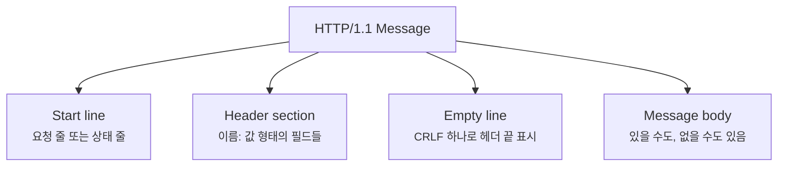
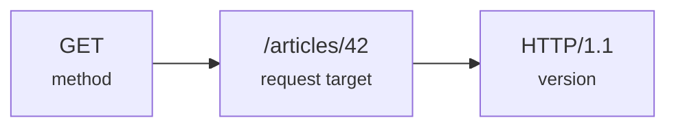
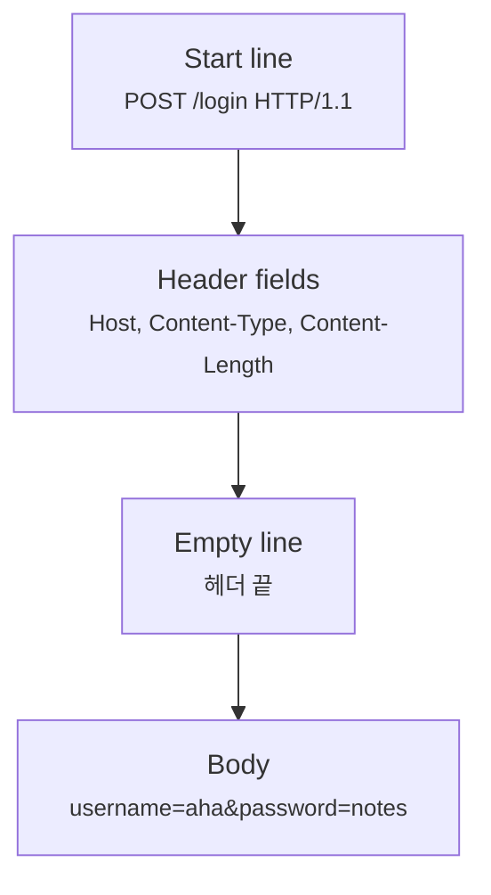
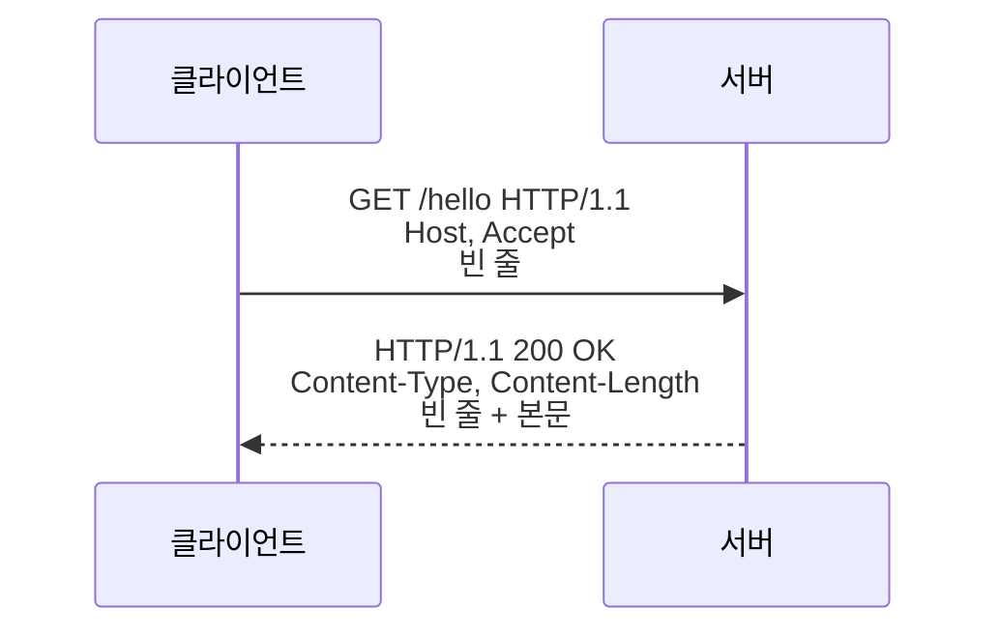
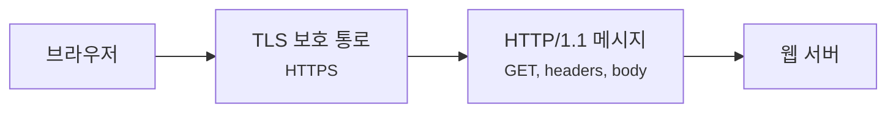

# HTTP/1.1 메시지는 왜 빈 줄 하나가 중요할까요?

> HTTP 요청은 그냥 글자 몇 줄처럼 보이죠? **사실은 줄 하나, 빈 줄 하나가 메시지의 경계를 가르는 문법이에요.**

[HTTP와 HTTPS는 뭐가 다를까요?](../basic/06-http-and-https.md){ data-preview }에서는 HTTP가 브라우저와 서버의 **대화 규칙**이고, HTTPS는 그 대화를 보호된 통로에 싣는 방식이라고 봤어요. 그리고 [DoH와 DoT는 DNS 경로를 어디까지 숨겨줄까요?](./doh-dot-and-resolver-paths.md){ data-preview }까지 오면서, 이름을 주소로 바꾸는 구간과 그다음 웹 요청 구간도 분리해서 볼 수 있게 됐죠.

근데요, 이제 진짜 웹 서버 앞에 서면 이런 질문이 생겨요.

- `GET / HTTP/1.1` 이 한 줄은 정확히 뭘 나눈 걸까요?
- `Host: example.com` 같은 줄은 어디까지가 이름이고 어디부터가 값일까요?
- 헤더가 끝났다는 건 어떻게 알까요?
- 본문이 있는 요청은 어디서부터 어디까지가 본문일까요?
- `Content-Length`와 `Transfer-Encoding: chunked`는 왜 자주 같이 언급될까요?

오늘은 HTTP/1.1 메시지를 **텍스트처럼 보이는 구조화된 문서**로 펼쳐볼게요. 큰 규칙은 HTTP/1.1 메시지 구문과 연결 관리를 다루는 [RFC 9112](https://www.rfc-editor.org/rfc/rfc9112.html), 메서드·상태 코드·필드 의미를 다루는 [RFC 9110](https://www.rfc-editor.org/rfc/rfc9110.html)을 기준으로 잡을게요.

!!! note "이 글의 범위"
    여기서는 HTTP/1.1의 **메시지 모양과 경계 읽기**에 집중해요. HTTP/2 프레임, HTTP/3, 캐시 정책, 쿠키 보안, 모든 메서드 의미까지는 깊게 열지 않을게요. 오늘은 *"시작 줄, 헤더, 빈 줄, 본문을 정확히 나눠 읽는 감각"* 이 목표예요.

---

## 왜 HTTP/1.1 문법을 알아야 할까요?

브라우저 개발자 도구나 `curl -v`를 보면 HTTP는 꽤 읽기 쉬워 보여요.

```text
GET /articles HTTP/1.1
Host: example.com
Accept: text/html
```

사람 눈에는 그냥 세 줄이에요. 하지만 서버나 프록시는 이걸 훨씬 엄격하게 읽어요.

- 첫 줄은 요청의 방향을 정해요.
- 그다음 줄들은 메타데이터를 붙여요.
- 빈 줄은 헤더가 끝났다는 신호예요.
- 빈 줄 뒤에 본문이 올 수 있어요.

이 문법이 왜 중요하냐면, 중간 프록시와 뒤쪽 서버가 메시지 경계를 다르게 읽으면 아주 위험하거나 이상한 일이 생길 수 있기 때문이에요. 어떤 요청은 서버까지 못 가고, 어떤 요청은 본문 길이를 잘못 읽고, 어떤 경우에는 요청 스머글링 같은 보안 문제로 이어질 수도 있어요.

그러니까 HTTP/1.1 문법은 단순한 예쁜 형식이 아니라, **어디까지가 한 요청이고 어디서 다음 요청이 시작되는지 정하는 약속**이에요.

---

## 주문서의 제목, 메모, 빈 칸, 내용물

카페 주문서를 떠올려볼게요.

주문서 맨 위에는 이렇게 적혀 있어요.

> "아이스 아메리카노를 주문합니다."

그 아래에는 추가 메모가 붙어요.

> "테이크아웃이에요."  
> "얼음은 적게 주세요."

그리고 줄 하나를 비운 뒤, 쿠폰이나 긴 요청사항이 따로 붙을 수 있어요.

HTTP/1.1 메시지도 비슷하게 읽을 수 있어요.

| 비유에서는 | 실제로는 |
|---|---|
| 주문서 맨 위 제목 | 요청 줄 또는 상태 줄 |
| 추가 메모 | 헤더 필드 |
| 메모가 끝났다는 빈 칸 | 헤더 섹션을 끝내는 빈 줄 |
| 따로 붙은 내용물 | 메시지 본문 |
| 주문서가 어디까지인지 표시 | `Content-Length` 또는 `Transfer-Encoding` |

여기서 빈 줄이 중요해요. 사람은 대충 문맥으로 읽을 수 있지만, 서버는 문맥으로 눈치 보지 않아요. **빈 줄이 나오기 전까지는 헤더**, 그 뒤부터는 조건에 따라 **본문**으로 읽어요.

---

## HTTP/1.1 메시지의 큰 모양

HTTP/1.1 메시지는 크게 이렇게 생겼어요.

```text
start-line
header-field
header-field

message-body
```

요청이면 시작 줄이 **request-line**이고, 응답이면 **status-line**이에요.



이 그림에서 본문은 항상 있는 게 아니에요. `GET` 요청에는 보통 본문이 없고, `POST` 요청이나 `200 OK` 응답에는 본문이 있을 수 있어요. 중요한 건 **본문이 있느냐보다, 본문이 어디서 시작하고 얼마나 이어지는지를 어떻게 판단하느냐**예요.

---

## 요청 줄은 세 조각으로 읽어요

가장 익숙한 요청 줄부터 볼게요.

```text
GET /articles/42 HTTP/1.1
```

이 한 줄은 세 조각이에요.

| 조각 | 예시 | 처음엔 이렇게 읽으면 돼요 |
|---|---|---|
| method | `GET` | 무엇을 하려는지 |
| request target | `/articles/42` | 어느 대상을 향하는지 |
| HTTP version | `HTTP/1.1` | 어떤 메시지 문법으로 말하는지 |

즉 이 줄은 *"`/articles/42`라는 대상을 HTTP/1.1 방식으로 GET하고 싶어요"* 라는 말이에요.



여기서 request target은 항상 전체 URL처럼 보이지는 않아요. 일반적인 웹 서버 요청에서는 `/path?query` 같은 **origin-form**이 흔해요. 프록시를 향한 요청에서는 전체 URL처럼 보이는 **absolute-form**이 쓰일 수 있고, `CONNECT`처럼 터널을 만들 때는 `host:port` 모양의 **authority-form**도 나와요.

처음엔 전부 외울 필요는 없어요. 다만 *"요청 줄의 두 번째 칸은 그냥 URL 전체가 아니라, 요청 대상 표현 방식이다"* 라고 잡아두면 좋아요.

---

## 응답의 첫 줄은 결과표예요

응답은 이렇게 시작해요.

```text
HTTP/1.1 200 OK
```

요청 줄과 모양이 비슷하지만 역할은 달라요.

| 조각 | 예시 | 처음엔 이렇게 읽으면 돼요 |
|---|---|---|
| HTTP version | `HTTP/1.1` | 이 응답의 HTTP 버전 |
| status code | `200` | 처리 결과를 나타내는 숫자 |
| reason phrase | `OK` | 사람이 읽기 쉬운 짧은 설명 |

`200 OK`는 성공, `404 Not Found`는 대상을 찾지 못함, `502 Bad Gateway`는 앞단이 뒤쪽 서버와 대화하다가 실패한 장면처럼 읽을 수 있어요. 상태 코드의 의미 자체는 HTTP semantics 쪽 이야기이고, 여기서는 **응답도 첫 줄에서 결과를 먼저 말한다**는 구조를 붙잡으면 충분해요.

```text
HTTP/1.1 404 Not Found
Content-Type: text/html
Content-Length: 48

<h1>Not Found</h1>
```

이 예시에서 `404 Not Found`는 결과표이고, `Content-Type`과 `Content-Length`는 뒤에 오는 본문을 어떻게 읽을지 알려주는 메모예요.

---

## 헤더 필드는 이름과 값의 목록이에요

시작 줄 다음에는 헤더 필드가 이어져요.

```text
Host: example.com
User-Agent: curl/8.7.1
Accept: text/html
```

헤더 필드는 기본적으로 `field-name: field-value` 형태예요.

| 헤더 | 무엇을 알려주나요? |
|---|---|
| `Host` | 같은 IP의 여러 사이트 중 어느 이름을 향하는지 |
| `User-Agent` | 요청한 클라이언트가 어떤 종류인지 |
| `Accept` | 어떤 응답 형식을 선호하는지 |
| `Content-Type` | 본문이 어떤 형식인지 |
| `Content-Length` | 본문이 몇 바이트인지 |

여기서 `Host`는 HTTP/1.1에서 특히 중요해요. 하나의 서버나 IP 뒤에 여러 도메인이 함께 있을 수 있기 때문에, 서버는 `Host`를 보고 **어느 사이트를 향한 요청인지**를 고를 수 있어요.

!!! note "헤더 이름의 대소문자"
    HTTP 필드 이름은 대소문자를 구분하지 않는 이름으로 다뤄요. 하지만 실제 출력에서는 `Content-Type`, `content-type`, `CONTENT-TYPE`처럼 여러 모양을 만날 수 있어요. 사람이 읽을 때는 같은 필드 이름인지부터 보고, 값의 의미를 따로 읽으면 돼요.

---

## 빈 줄은 왜 그렇게 중요할까요?

HTTP/1.1 메시지를 직접 보면 헤더와 본문 사이에 아무것도 없어 보이는 줄이 하나 있어요.

```text
POST /login HTTP/1.1
Host: example.com
Content-Type: application/x-www-form-urlencoded
Content-Length: 27

username=aha&password=notes
```

저 빈 줄이 **헤더 섹션의 끝**이에요. 사람 눈에는 사소한 줄바꿈이지만, 파서는 이 지점에서 읽는 모드를 바꿔요.



그래서 HTTP/1.1에서는 줄 끝과 빈 줄을 가볍게 보면 안 돼요. 실제 표준 문서에서는 CRLF, 즉 carriage return과 line feed 조합을 기준으로 메시지 줄을 설명해요. 우리가 글에서 보기 쉽게 줄바꿈으로 표현하지만, 실제 파서는 바이트 흐름 위에서 이 경계를 찾아요.

---

## 본문 길이는 어떻게 알까요?

TCP는 바이트 흐름이에요. 택배 상자처럼 *"여기까지가 메시지 하나"* 라고 자동으로 잘라주지 않아요. 그래서 HTTP/1.1은 본문 길이를 따로 판단해야 해요.

가장 단순한 신호는 `Content-Length`예요.

```text
HTTP/1.1 200 OK
Content-Type: text/plain
Content-Length: 5

hello
```

여기서는 빈 줄 뒤로 5바이트를 본문으로 읽으면 돼요.

그런데 응답을 만들 때 전체 길이를 처음부터 모르는 경우도 있어요. 이때는 `Transfer-Encoding: chunked`가 나올 수 있어요.

```text
HTTP/1.1 200 OK
Transfer-Encoding: chunked

5
hello
0
```

chunked는 본문을 조각 단위로 보내는 방식이에요. 각 조각 앞에 그 조각의 크기가 오고, 크기 `0`인 조각이 나오면 끝이라고 읽어요.

| 방식 | 처음엔 이렇게 읽으면 돼요 |
|---|---|
| `Content-Length: 5` | 빈 줄 뒤에서 정확히 5바이트를 본문으로 읽어요 |
| `Transfer-Encoding: chunked` | 조각 크기를 보면서 본문을 이어 읽고, 0 크기 조각에서 끝나요 |
| 연결 종료로 끝남 | 일부 응답에서는 연결이 닫히는 것으로 끝을 알 수 있어요 |

여기서 디버깅 감각이 중요해요. **본문 길이를 판단하는 신호가 애매하거나 서로 충돌하면**, 프록시와 서버가 메시지 경계를 다르게 읽을 수 있어요. 그래서 `Content-Length`와 `Transfer-Encoding`은 단순한 부가 정보가 아니라, HTTP/1.1 메시지를 안전하게 자르는 핵심 신호예요.

---

## 실제로 한 요청과 응답을 같이 읽어볼까요?

아주 작은 HTTP/1.1 대화를 펼쳐보면 이런 모양이에요.

```text
GET /hello HTTP/1.1
Host: example.com
Accept: text/plain

HTTP/1.1 200 OK
Content-Type: text/plain
Content-Length: 13

Hello, world!
```

이 출력은 실제 캡처처럼 방향 표시가 없어서 조금 붙어 보이지만, 논리적으로는 요청 하나와 응답 하나예요.



읽는 순서는 이래요.

1. 요청 줄에서 메서드와 대상을 봐요.
2. `Host`로 어느 사이트를 향하는지 봐요.
3. 빈 줄에서 요청 헤더가 끝났다고 봐요.
4. 응답 상태 줄에서 결과를 봐요.
5. 응답 헤더에서 본문 형식과 길이를 봐요.
6. 빈 줄 뒤의 본문을 그 길이만큼 읽어요.

이렇게 보면 HTTP/1.1은 단순한 문자열 더미가 아니라, **읽는 순서가 있는 메시지 문법**이에요.

---

## HTTPS면 이 모양이 안 보일까요?

여기서 기본편과 다시 연결해볼게요.

HTTPS는 HTTP 메시지 모양을 없애는 게 아니에요. 보통은 TLS 통로 안에 HTTP 메시지가 들어가요. 그래서 네트워크 중간에서 패킷을 보면 HTTP/1.1 시작 줄과 헤더가 그대로 보이지 않을 수 있지만, 브라우저와 서버가 TLS를 풀어 처리하는 안쪽에서는 여전히 HTTP 의미와 메시지 구조가 중요해요.



정확히는 실제 구현에서는 TLS 레코드, HTTP 버전, 프록시 구성, ALPN 협상 등에 따라 보이는 층이 달라질 수 있어요. 하지만 초반 감각으로는 **HTTPS는 HTTP 문법을 보호된 통로 안에 넣는다**고 잡아도 좋아요.

---

## 잘못 읽기 쉬운 함정

HTTP/1.1 메시지는 읽기 쉬워 보여서 오히려 대충 읽기 쉬워요.

| 헷갈리는 읽기 | 더 정확한 읽기 |
|---|---|
| 첫 줄은 그냥 설명문이다 | 첫 줄은 요청 대상이나 응답 결과를 정하는 구조예요 |
| 빈 줄은 보기 좋으라고 넣은 줄이다 | 빈 줄은 헤더 섹션이 끝났다는 경계예요 |
| `Content-Length`는 참고용이다 | 본문을 몇 바이트 읽을지 정하는 핵심 신호예요 |
| 헤더 순서가 항상 의미를 정한다 | 보통은 이름과 값이 중요하고, 일부 필드는 결합 규칙이 따로 있어요 |
| HTTPS면 HTTP 메시지 문법은 상관없다 | 암호화된 통로 안에서도 HTTP 의미와 경계는 여전히 처리돼요 |
| HTTP/2도 이런 텍스트 줄로 똑같이 흐른다 | HTTP/2는 바이너리 프레임으로 나뉘어서 보이는 모양이 달라요 |

특히 마지막 줄이 다음 글로 이어져요. HTTP/1.1은 사람이 읽기 쉬운 텍스트 줄처럼 보이지만, HTTP/2부터는 **프레임**이라는 단위가 훨씬 중요해져요.

---

## 자, 정리해볼까요?

!!! abstract "오늘 우리가 배운 것"
    - HTTP/1.1 메시지는 **시작 줄, 헤더 필드, 빈 줄, 본문**으로 나눠 읽어요.
    - 요청의 첫 줄은 `method`, `request target`, `HTTP version`으로 나뉘어요.
    - 응답의 첫 줄은 `HTTP version`, `status code`, `reason phrase`로 나뉘어요.
    - 빈 줄은 단순한 장식이 아니라 **헤더가 끝났다는 경계**예요.
    - `Content-Length`와 `Transfer-Encoding`은 본문을 어디까지 읽을지 정하는 중요한 신호예요.

이제 `GET / HTTP/1.1` 같은 줄을 보면 그냥 예시 문자열이 아니라, **서버와 프록시가 메시지 경계를 맞추기 위해 읽는 문법**으로 보일 거예요.

## 이어서 보면 좋은 글

- [HTTP와 HTTPS는 뭐가 다를까요?](../basic/06-http-and-https.md){ data-preview } — HTTP가 대화 규칙이고 HTTPS가 보호 통로라는 기본 감각을 다시 잡고 싶을 때 좋아요.
- [TLS 핸드셰이크는 실제로 어떻게 한 단계씩 진행될까요?](./tls-handshake-step-by-step.md){ data-preview } — HTTPS에서 HTTP 메시지가 오가기 전, 보호 통로가 어떻게 준비되는지 이어서 보기 좋아요.
- [QUIC은 왜 UDP 위에서 돌아갈까요?](./quic-first-look.md#http3-over-quic){ data-preview } — HTTP/3에서는 HTTP가 어떤 바닥 위로 옮겨 가는지 큰 그림을 보고 싶을 때 좋아요.

## 이어서 볼 질문

> *"HTTP/1.1은 줄 단위 메시지였어요. 그럼 HTTP/2는 왜 프레임과 스트림이라는 말을 쓸까요?"*

다음에는 **HTTP/2 프레임과 멀티플렉싱**을 열어서, 한 연결 안에서 여러 요청이 어떻게 섞여 흐르는지 볼게요.
