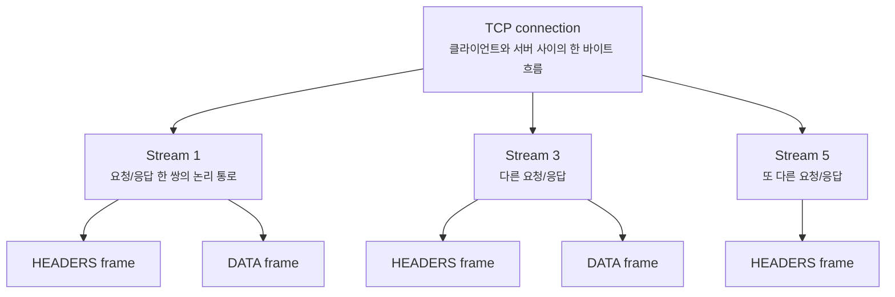
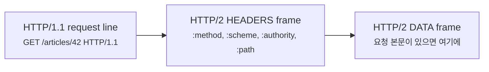
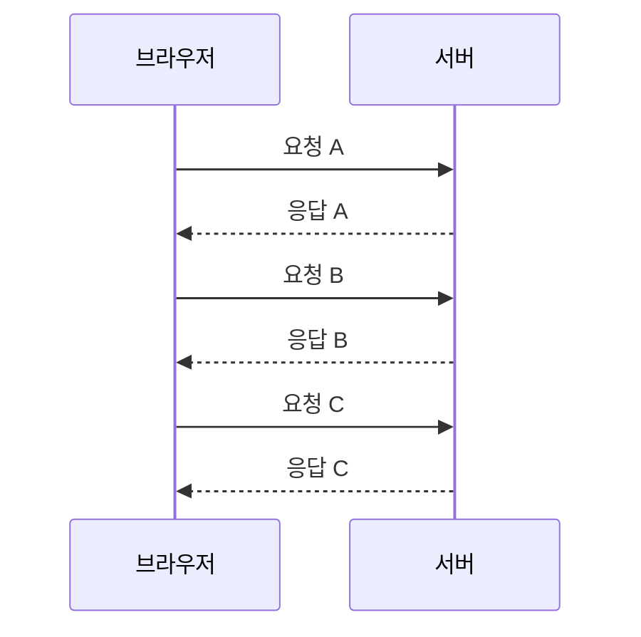
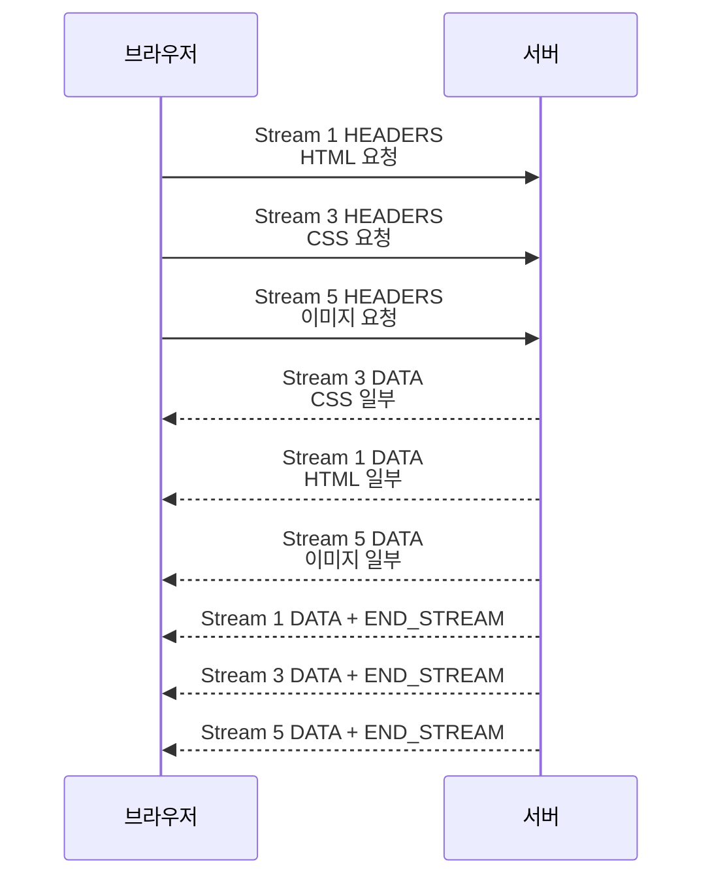
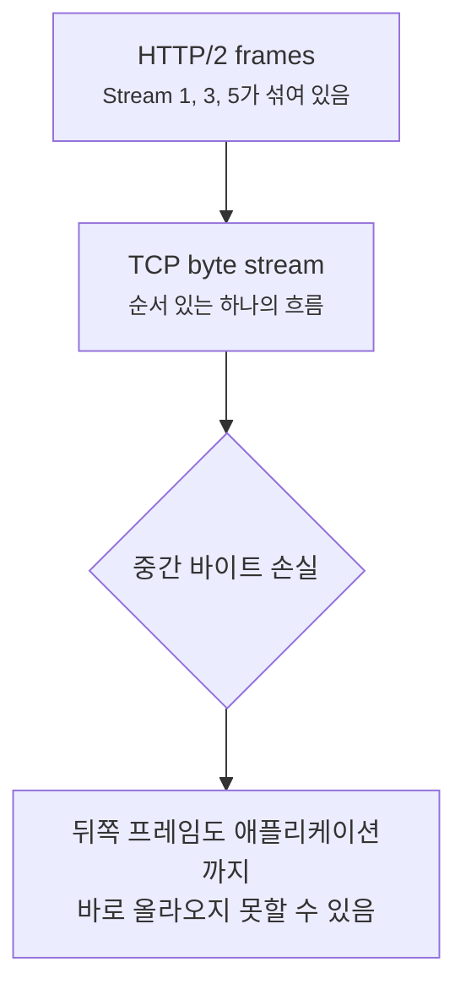

# HTTP/2는 어떻게 여러 요청을 한 연결에 섞어 보낼까요?

> 웹페이지 하나를 여는데 요청이 수십 개라면, 줄을 하나씩 세워야 할까요? **HTTP/2는 한 연결 안에 여러 줄을 동시에 펼쳐요.**

[HTTP/1.1 메시지는 왜 빈 줄 하나가 중요할까요?](./http1-message-grammar.md){ data-preview }에서는 HTTP/1.1이 시작 줄, 헤더, 빈 줄, 본문을 가진 **텍스트 메시지 문법**이라는 걸 봤어요. 그 글을 읽고 나면 요청 하나의 경계는 꽤 잘 보이죠.

근데요, 실제 웹페이지는 요청 하나로 끝나지 않아요.

- HTML을 받고
- CSS를 받고
- JavaScript를 받고
- 이미지 여러 장을 받고
- 글꼴과 API 응답도 받아요

HTTP/1.1에서도 연결을 재사용할 수는 있지만, 한 연결 위에서 요청과 응답을 줄 세우듯 다루면 앞의 응답이 늦을 때 뒤쪽도 같이 답답해질 수 있어요. 그래서 브라우저는 여러 TCP 연결을 열어 병렬성을 만들곤 했죠.

HTTP/2는 여기서 방향을 바꿔요. HTTP의 의미, 그러니까 `GET`, 상태 코드, 헤더, 본문이라는 생각은 유지하면서, 그 표현을 **바이너리 프레임과 스트림**으로 바꿔요. 큰 규칙은 [RFC 9113](https://www.rfc-editor.org/rfc/rfc9113.html)을 기준으로 볼게요. 헤더 압축인 HPACK은 [RFC 7541](https://www.rfc-editor.org/rfc/rfc7541.html)에 따로 정의되어 있어요.

!!! note "이 글의 범위"
    여기서는 HTTP/2의 **프레임, 스트림, 멀티플렉싱 감각**에 집중해요. HPACK 압축 알고리즘, 우선순위 세부 정책, 서버 푸시 운영 이슈, 모든 오류 코드는 깊게 열지 않을게요. 오늘 목표는 *"HTTP/2 화면에서 왜 한 연결에 여러 요청이 섞여 보이는지"* 를 읽는 거예요.

---

## 왜 HTTP/2는 메시지를 잘게 자를까요?

HTTP/1.1 요청은 사람 눈에 꽤 잘 읽혀요.

```text
GET /style.css HTTP/1.1
Host: example.com
Accept: text/css

```

하지만 이 방식은 한 요청과 응답을 큰 덩어리처럼 읽기 쉬워요. 웹페이지가 작은 파일 수십 개를 동시에 가져와야 할 때는, 덩어리 하나가 길을 오래 붙잡는 느낌이 생겨요.

HTTP/2는 이 덩어리를 작은 조각으로 나눠요.

- 헤더 정보는 `HEADERS` 프레임에 담고
- 본문 데이터는 `DATA` 프레임에 담고
- 설정은 `SETTINGS` 프레임으로 맞추고
- 흐름 제어는 `WINDOW_UPDATE` 프레임으로 조절해요

그리고 각 조각에는 **어느 대화에 속한 조각인지**를 알려주는 스트림 ID가 붙어요. 그래서 한 TCP 연결 안에서도 여러 요청의 조각을 섞어 보낼 수 있어요.

## 편의점 계산대 하나에 여러 주문 바구니를 올려놓는다면

편의점 계산대가 하나 있다고 해볼게요. HTTP/1.1 방식으로 생각하면 한 손님의 바구니를 끝까지 계산한 뒤 다음 손님 바구니로 넘어가는 느낌이에요.

그런데 손님마다 바구니가 작은 물건, 큰 물건, 할인 확인이 필요한 물건으로 섞여 있다면 어떨까요? 계산원이 **바구니마다 번호표를 붙여두고**, 물건 단위로 조금씩 처리할 수 있다면 앞 바구니의 큰 물건 하나 때문에 뒤 바구니의 작은 물건들이 전부 기다릴 필요가 줄어들겠죠.

HTTP/2의 감각이 이와 비슷해요.

| 비유에서는 | 실제로는 |
|---|---|
| 계산대 하나 | 하나의 TCP 연결 |
| 번호표 붙은 주문 바구니 | HTTP/2 스트림 |
| 바구니 안의 물건 조각 | HTTP/2 프레임 |
| 주문 메모 | `HEADERS` 프레임 |
| 실제 상품 | `DATA` 프레임 |
| 계산대 규칙 맞추기 | `SETTINGS` 프레임 |

핵심은 **연결 하나와 요청 하나가 더 이상 1:1처럼 느껴지지 않는다**는 점이에요. HTTP/2에서는 연결 하나 안에 여러 스트림이 있고, 각 스트림은 프레임 조각들로 표현돼요.

---

## HTTP/2의 큰 단위는 연결, 스트림, 프레임이에요

HTTP/2를 처음 볼 때는 세 단어를 먼저 잡으면 좋아요.



이 그림에서 TCP 연결은 하나예요. 하지만 그 안에 스트림이 여러 개 있고, 각 스트림은 프레임들로 이어져요. 클라이언트가 만든 스트림 ID는 보통 홀수로 증가하고, 서버가 만든 스트림 ID는 짝수로 증가해요. 일반적인 브라우저 요청을 읽을 때는 `1`, `3`, `5`처럼 홀수 스트림이 눈에 자주 들어와요.

!!! tip "처음 읽는 순서"
    HTTP/2를 볼 때는 먼저 **연결 하나**, 그 안의 **스트림 여러 개**, 각 스트림을 이루는 **프레임 여러 개** 순서로 읽으면 덜 헷갈려요.

## 프레임 헤더는 9바이트예요

HTTP/2 프레임은 앞에 9바이트짜리 프레임 헤더를 붙여요. 이 헤더가 *"뒤에 오는 payload가 어떤 종류이고, 어느 스트림에 속하는지"* 를 알려줘요.

<table>
  <thead>
    <tr>
      <th style="width: 18%;">길이</th>
      <th style="width: 18%;">필드</th>
      <th>처음엔 이렇게 읽으면 돼요</th>
    </tr>
  </thead>
  <tbody>
    <tr>
      <td><code>24 bits</code></td>
      <td><code>Length</code></td>
      <td>이 프레임 payload가 몇 바이트인지</td>
    </tr>
    <tr>
      <td><code>8 bits</code></td>
      <td><code>Type</code></td>
      <td><code>HEADERS</code>, <code>DATA</code>, <code>SETTINGS</code> 같은 프레임 종류</td>
    </tr>
    <tr>
      <td><code>8 bits</code></td>
      <td><code>Flags</code></td>
      <td><code>END_STREAM</code>, <code>END_HEADERS</code> 같은 추가 신호</td>
    </tr>
    <tr>
      <td><code>1 + 31 bits</code></td>
      <td><code>R + Stream Identifier</code></td>
      <td>예약 비트 1개와 이 프레임이 속한 스트림 ID</td>
    </tr>
  </tbody>
</table>

```text
+-----------------------------------------------+
|                 Length (24)                   |
+---------------+---------------+---------------+
|   Type (8)    |   Flags (8)   |
+---+-------------------------------------------+
| R |            Stream Identifier (31)         |
+---+-------------------------------------------+
|               Frame Payload (*)               |
+-----------------------------------------------+
```

여기서 payload의 모양은 프레임 타입마다 달라요. `DATA` 프레임이면 본문 바이트가 들어가고, `HEADERS` 프레임이면 압축된 헤더 블록이 들어가요. 그래서 HTTP/2는 `GET / HTTP/1.1` 같은 줄을 그대로 보내는 게 아니라, **HTTP 의미를 프레임 구조 안에 다시 담아 보내는 방식**이에요.

## HEADERS와 DATA는 HTTP 메시지를 다시 표현해요

HTTP/1.1 요청의 시작 줄은 이렇게 생겼죠.

```text
GET /articles/42 HTTP/1.1
Host: example.com
```

HTTP/2에서는 이런 시작 줄을 그대로 싣지 않아요. 대신 `:method`, `:scheme`, `:authority`, `:path` 같은 **pseudo-header field**로 요청의 핵심 제어 정보를 표현해요.

| HTTP/1.1에서 보던 것 | HTTP/2에서 흔히 보는 표현 |
|---|---|
| `GET` | `:method: GET` |
| `https` 요청인지 | `:scheme: https` |
| `Host: example.com` | `:authority: example.com` |
| `/articles/42` | `:path: /articles/42` |
| 일반 헤더 | 일반 HTTP 필드로 표현 |
| 본문 | `DATA` 프레임 payload |

응답도 비슷해요. HTTP/1.1의 `HTTP/1.1 200 OK` 같은 상태 줄 대신, HTTP/2에서는 `:status: 200`처럼 상태 코드를 담아요.



즉 HTTP/2는 HTTP를 없애는 게 아니에요. HTTP의 의미는 유지하되, 선과 빈 줄 중심의 텍스트 문법 대신 **프레임 타입과 스트림 ID 중심의 바이너리 문법**으로 옮겨놓은 거예요.

---

## 멀티플렉싱은 프레임을 섞어 보내는 능력이에요

가장 중요한 장면을 볼게요. HTML, CSS, 이미지 요청이 동시에 있다고 해볼게요.

HTTP/1.1을 단순하게 줄 세워 보면 이런 느낌이에요.



HTTP/2에서는 한 연결 위에서 프레임이 섞일 수 있어요.



이게 멀티플렉싱이에요. 프레임이 도착한 순서는 섞여 있어도, 각 프레임에 스트림 ID가 있으니 받는 쪽은 다시 자기 스트림별로 조립할 수 있어요. 그래서 작은 CSS 응답이 큰 이미지 응답 뒤에 꼭 갇혀 있을 필요가 줄어들어요.

!!! note "순서가 완전히 사라지는 건 아니에요"
    한 스트림 안의 프레임 순서는 의미가 있어요. 다만 서로 다른 스트림의 프레임은 같은 연결 위에서 교차될 수 있어요. 그래서 **스트림 안에서는 순서**, **연결 안에서는 섞임**으로 기억하면 좋아요.

## 그럼 TCP head-of-line blocking도 없어질까요?

여기서 자주 헷갈려요.

HTTP/2 멀티플렉싱은 HTTP/1.1의 응답 줄서기 문제를 많이 줄여줘요. 하지만 HTTP/2가 보통 TCP 위에서 돌아간다는 사실은 그대로예요. TCP는 순서 있는 바이트 흐름이기 때문에, 네트워크에서 TCP 세그먼트 하나가 손실되면 그 뒤 바이트는 애플리케이션에 바로 넘겨지지 못하고 기다릴 수 있어요.



즉 HTTP/2는 **HTTP 레벨의 줄서기 문제**를 줄여주지만, **TCP 레벨의 손실 대기 문제**까지 없애지는 못해요. 이 차이가 다음에 HTTP/3와 QUIC을 볼 때 중요해져요.

## SETTINGS와 WINDOW_UPDATE는 연결의 운영 신호예요

HTTP/2 캡처나 로그를 보면 `HEADERS`, `DATA` 말고도 낯선 프레임이 보여요.

| 프레임 | 어디에 쓰이나요? |
|---|---|
| `SETTINGS` | 양쪽이 연결 규칙과 한계를 맞춰요 |
| `WINDOW_UPDATE` | 흐름 제어 창을 늘려 더 보낼 수 있음을 알려줘요 |
| `PING` | 연결이 살아 있는지, 왕복 시간을 확인할 수 있어요 |
| `RST_STREAM` | 특정 스트림을 중단해요 |
| `GOAWAY` | 연결을 더는 새 스트림에 쓰지 않겠다고 알려요 |
| `CONTINUATION` | 큰 헤더 블록이 이어질 때 사용될 수 있어요 |

처음부터 모든 프레임을 외울 필요는 없어요. 다만 운영 화면에서 `SETTINGS`만 잔뜩 보인다고 해서 실제 페이지 본문이 오가는 장면이라고 착각하면 안 돼요. `HEADERS`와 `DATA`가 사용자 요청과 응답의 몸통에 더 가깝고, 나머지는 연결을 조율하는 신호인 경우가 많아요.

## 실제로 한 요청을 어떻게 읽으면 좋을까요?

HTTP/2 장면을 읽을 때는 한 줄씩 순서대로만 보지 말고, 스트림 ID로 묶어보면 좋아요.

```text
Stream 1  HEADERS  :method=GET :path=/index.html
Stream 3  HEADERS  :method=GET :path=/style.css
Stream 1  DATA     4096 bytes
Stream 5  HEADERS  :method=GET :path=/hero.png
Stream 3  DATA     1200 bytes END_STREAM
Stream 1  DATA     2048 bytes END_STREAM
Stream 5  DATA     16384 bytes
```

이걸 시간순으로만 읽으면 정신없어요. 대신 이렇게 묶어요.

| 스트림 | 무엇을 보면 되나요? | 읽는 감각 |
|---|---|---|
| Stream 1 | `/index.html`의 `HEADERS`, `DATA`, `END_STREAM` | HTML 응답 하나 |
| Stream 3 | `/style.css`의 `HEADERS`, `DATA`, `END_STREAM` | CSS 응답 하나 |
| Stream 5 | `/hero.png`의 `HEADERS`, `DATA` | 아직 이미지 데이터가 이어지는 중 |

즉 HTTP/2 로그에서 핵심 신호는 **시간순 위치**와 **스트림 ID**를 같이 보는 거예요. 시간순으로는 섞여 있고, 의미상으로는 스트림별로 묶여 있어요.

---

## 잘못 읽기 쉬운 함정

### 1. HTTP/2는 HTTP와 완전히 다른 프로토콜이라고 읽기

HTTP/2는 HTTP의 의미를 버리지 않아요. 메서드, 상태 코드, 필드 의미는 HTTP semantics 위에 있어요. 달라진 건 선으로 된 텍스트 메시지를 그대로 흘리는 대신, 프레임과 스트림으로 표현하는 방식이에요.

### 2. 한 TCP 연결이면 요청도 하나라고 생각하기

HTTP/2에서는 연결 하나 안에 여러 스트림이 있어요. 그래서 `netstat`이나 `ss`에서 연결이 하나만 보여도, 브라우저는 그 안에서 여러 HTTP 요청을 동시에 처리하고 있을 수 있어요.

### 3. 멀티플렉싱이면 모든 대기가 사라진다고 믿기

멀티플렉싱은 HTTP 레벨에서 응답을 섞어 보내는 힘이에요. 하지만 TCP 손실 때문에 연결 전체가 기다리는 장면은 여전히 생길 수 있어요. 이 한계 때문에 HTTP/3가 QUIC 위에서 다른 방식을 택해요.

### 4. 프레임 순서만 보고 요청 순서를 단정하기

프레임은 섞일 수 있어요. 그래서 어떤 요청이 먼저 끝났는지는 단순한 줄 위치보다 `END_STREAM`, 스트림 ID, 시간, 바이트 양을 같이 봐야 해요.

## 자, 정리해볼까요?

!!! abstract "오늘 우리가 배운 것"
    - HTTP/2는 HTTP 의미를 유지하면서 표현 방식을 바이너리 프레임으로 바꿔요.
    - 한 TCP 연결 안에 여러 스트림이 있고, 각 스트림은 여러 프레임으로 구성돼요.
    - 프레임 헤더에는 길이, 타입, 플래그, 스트림 ID가 들어가요.
    - `HEADERS`는 HTTP 필드와 제어 정보를, `DATA`는 본문 바이트를 담아요.
    - 멀티플렉싱은 서로 다른 스트림의 프레임을 한 연결에 섞어 보내는 능력이에요.
    - HTTP/2는 HTTP 레벨의 줄서기를 줄이지만, TCP 레벨의 손실 대기까지 없애지는 못해요.

HTTP/2를 읽을 때는 **연결 하나, 스트림 여러 개, 프레임 조각들**이라는 세 층을 먼저 떠올리면 돼요. 그러면 개발자 도구나 캡처에서 요청이 섞여 보이는 장면도 훨씬 덜 낯설어져요.

## 이어서 보면 좋은 글

- [HTTP/1.1 메시지는 왜 빈 줄 하나가 중요할까요?](./http1-message-grammar.md){ data-preview } — HTTP/2가 무엇을 바꿨는지 보려면, 먼저 HTTP/1.1의 시작 줄, 헤더, 빈 줄, 본문 구조를 다시 보면 좋아요.
- [QUIC은 왜 UDP 위에서 돌아갈까요?](./quic-first-look.md){ data-preview } — HTTP/2가 TCP 위에서 남기는 한계를 본 뒤, QUIC이 왜 다른 바닥을 고르는지 이어서 볼 수 있어요.
