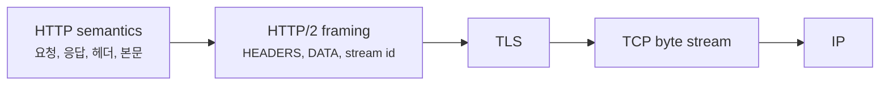
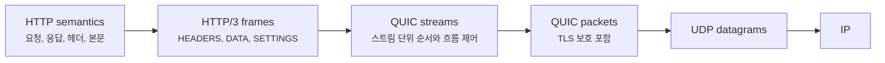
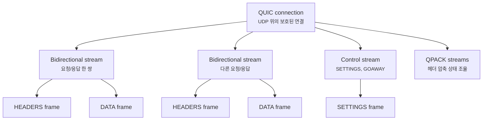
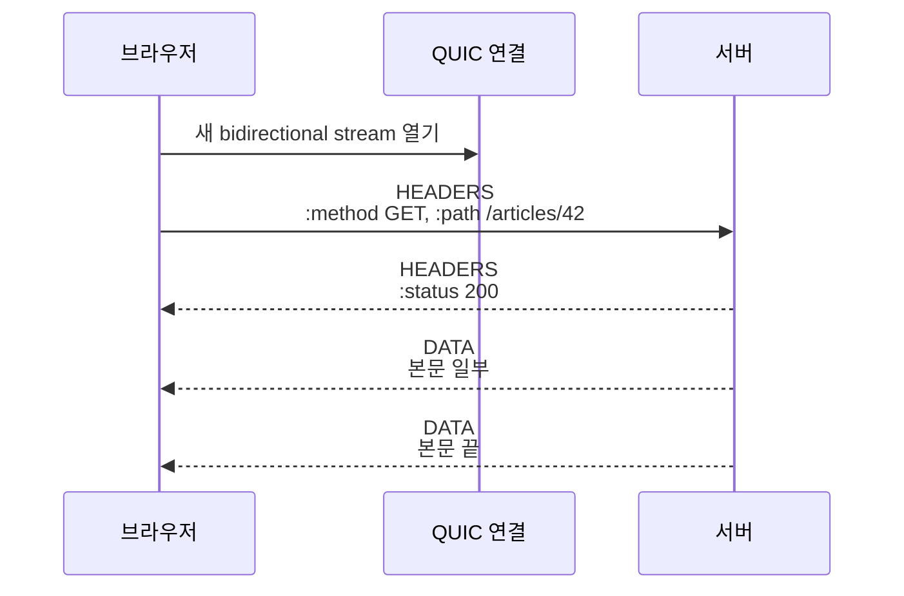
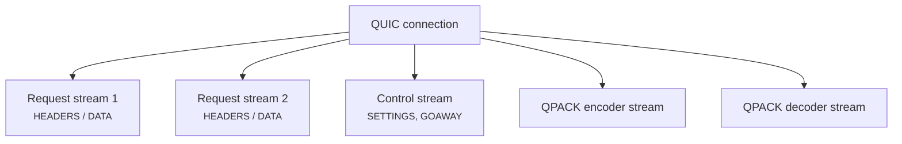
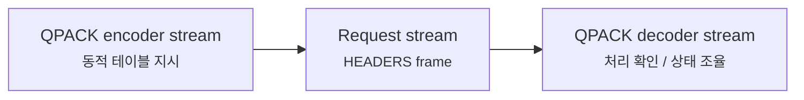
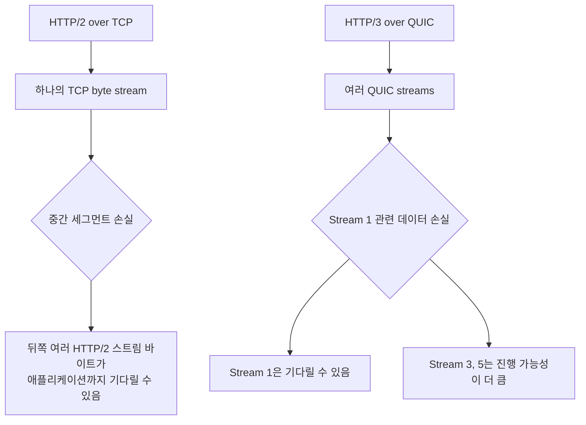
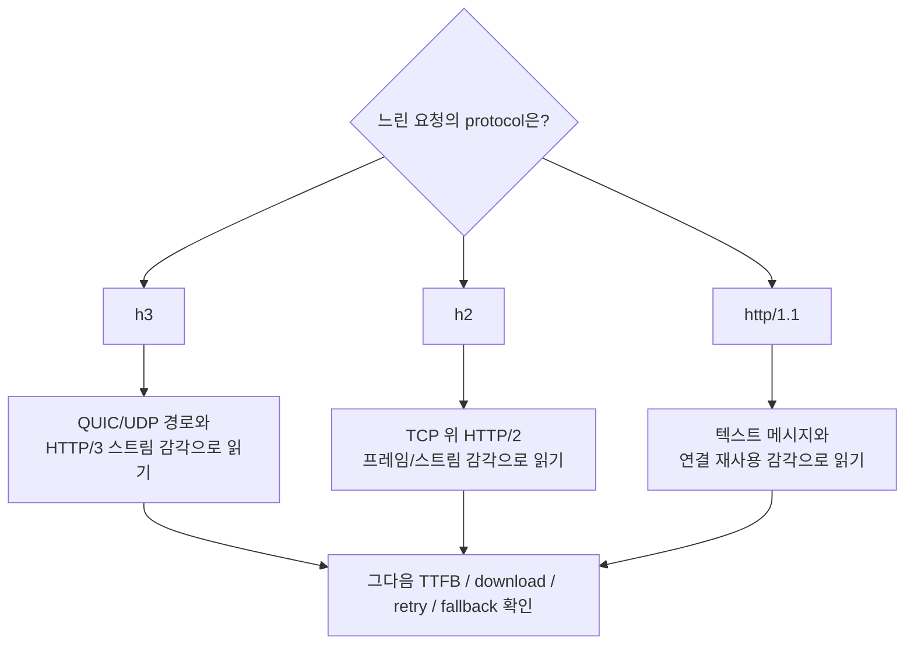

# HTTP/3는 QUIC 위에서 프레임을 어떻게 나눌까요?

> HTTP/3도 프레임을 쓴다는데, HTTP/2랑 같은 걸까요? **겉모습은 닮았지만 바닥 역할이 크게 달라졌어요.**

[HTTP/2는 어떻게 여러 요청을 한 연결에 섞어 보낼까요?](./http2-frames-and-multiplexing.md){ data-preview }에서는 HTTP/1.1의 텍스트 메시지가 `HEADERS`, `DATA` 같은 바이너리 프레임과 스트림으로 바뀌는 장면을 봤어요. 그리고 [QUIC은 왜 UDP 위에서 돌아갈까요?](./quic-first-look.md){ data-preview }에서는 HTTP/3가 단순히 HTTP 버전만 올린 게 아니라, 아래 전송 계층을 QUIC으로 바꾼다는 큰 그림을 잡았고요.

근데요, 둘을 이어 붙이면 바로 이런 질문이 생겨요.

> *"HTTP/2도 프레임이고 HTTP/3도 프레임이면, 그냥 TCP 대신 UDP로 바꾼 HTTP/2 아닌가요?"*

사실은 그렇게 보면 중간이 많이 비어요. HTTP/3는 HTTP 의미, 그러니까 요청, 응답, 헤더, 본문이라는 생각은 계속 가져가요. 하지만 **멀티플렉싱과 흐름 제어의 상당 부분을 QUIC에게 맡기고**, HTTP/3는 그 위에서 자기 프레임을 더 가볍게 얹어요.

오늘은 [RFC 9114](https://www.rfc-editor.org/rfc/rfc9114.html)의 HTTP/3 구조를 기준으로, HTTP/3 프레임이 어디에 놓이고, QUIC 스트림이 무엇을 대신해주며, 왜 HPACK 대신 [RFC 9204](https://www.rfc-editor.org/rfc/rfc9204.html)의 QPACK이 나오는지까지 한 번에 이어볼게요. QUIC 바닥의 큰 성격은 [RFC 9000](https://www.rfc-editor.org/rfc/rfc9000.html)을 기준으로 필요한 만큼만 가져올게요.

!!! note "이 글의 범위"
    여기서는 HTTP/3의 **프레임, QUIC 스트림 매핑, 제어 스트림, QPACK이 필요한 이유**에 집중해요. QUIC 패킷 헤더 전체, 손실 복구 알고리즘, 0-RTT 보안 caveat, HTTP/3 모든 오류 코드는 깊게 열지 않을게요. 목표는 *"개발자 도구나 캡처에서 h3가 보일 때, HTTP/2와 무엇이 같고 무엇이 다른지"* 를 읽는 거예요.

---

## 왜 HTTP/3를 HTTP/2의 복사본처럼 보면 안 될까요?

HTTP/2에서는 HTTP 레벨에서 스트림과 프레임을 만들었어요. 그런데 그 아래는 여전히 TCP였죠.



이 구조에서는 HTTP/2가 여러 스트림을 섞어도, TCP 입장에서는 결국 **순서 있는 하나의 바이트 흐름**이에요. 그래서 손실된 TCP 세그먼트 하나가 있으면, 그 뒤의 여러 HTTP/2 스트림 조각이 애플리케이션까지 같이 못 올라올 수 있었어요.

HTTP/3는 이 부분을 바꿔요.



여기서 HTTP/3는 프레임을 계속 쓰지만, HTTP/2처럼 자기 프레임 헤더에 스트림 ID를 직접 들고 다니지 않아요. 어느 요청에 속하는지는 **그 프레임이 올라탄 QUIC 스트림**이 말해줘요.

| HTTP/2에서 하던 일 | HTTP/3에서는 어디로 갔나요? |
|---|---|
| 한 연결 안에서 여러 요청을 섞기 | QUIC 스트림 다중화가 맡아요 |
| 프레임마다 stream identifier 붙이기 | QUIC 스트림 자체가 요청 통로가 돼요 |
| TCP 위에서 순서 있는 바이트 흐름 사용 | QUIC이 스트림별 순서 있는 바이트 흐름을 제공해요 |
| HPACK으로 헤더 압축 | QPACK으로 바뀌어요 |
| 연결 전체 설정 교환 | HTTP/3 제어 스트림의 `SETTINGS`가 맡아요 |

즉 HTTP/3는 HTTP/2의 프레임 감각을 이어받지만, **스트림이라는 바닥 기능을 QUIC에게 위임한 버전**으로 읽어야 해요.

---

## 배송 트럭이 아니라 컨베이어 벨트 여러 줄로 바뀐 느낌이에요

HTTP/2를 트럭 한 대 안에 여러 주문 상자를 섞어 싣는 방식이라고 해볼게요. 상자마다 번호표가 붙어 있어서, 도착한 뒤 다시 주문별로 나눌 수 있어요. 하지만 트럭 입구에서 큰 사고가 나면, 뒤쪽에 실린 작은 상자들도 같이 늦어질 수 있죠.

HTTP/3는 느낌이 조금 달라요. 같은 물류센터 안에 **주문별 컨베이어 벨트가 따로 있는 것**에 가까워요. 전체 센터는 하나지만, 한 줄에서 잠깐 막힌 일이 다른 줄까지 똑같이 멈추지는 않아요.

| 비유에서는 | 실제로는 |
|---|---|
| 물류센터 하나 | QUIC 연결 하나 |
| 주문별 컨베이어 벨트 | QUIC 스트림 |
| 벨트 위의 작은 라벨 붙은 박스 | HTTP/3 프레임 |
| 주문서 | `HEADERS` 프레임 |
| 실제 물건 | `DATA` 프레임 |
| 센터 운영 규칙 | 제어 스트림의 `SETTINGS` |
| 라벨 압축 장부 | QPACK encoder/decoder stream |

중요한 건 HTTP/3 프레임이 **연결 위에 바로 흩뿌려지는 게 아니라**, QUIC 스트림이라는 벨트 위에 올라간다는 점이에요.

## HTTP/3의 큰 단위는 연결, 스트림, 프레임이에요

HTTP/3를 읽을 때도 세 단어를 잡으면 좋아요. 다만 HTTP/2와 역할 분담이 달라요.



[RFC 9114](https://www.rfc-editor.org/rfc/rfc9114.html)는 요청과 응답 한 쌍이 하나의 QUIC 스트림을 쓴다고 설명해요. 실제 요청/응답 본문은 주로 양방향 스트림 위에서 `HEADERS`와 `DATA` 프레임으로 오가고, 연결 전체에 관한 신호는 별도의 단방향 제어 스트림에서 오가요.

!!! tip "처음 읽는 순서"
    HTTP/3는 **QUIC 연결 하나**, 그 안의 **QUIC 스트림 여러 개**, 각 스트림 안의 **HTTP/3 프레임 여러 개** 순서로 읽으면 좋아요. HTTP/2처럼 프레임 헤더에서 stream id부터 찾으려 하면 오히려 헷갈려요.

---

## HTTP/3 프레임 헤더는 고정 9바이트가 아니에요

HTTP/2 프레임 헤더는 9바이트로 고정되어 있었죠. `Length`, `Type`, `Flags`, `Stream Identifier`가 있었어요.

HTTP/3 프레임은 모양이 달라요.

```text
+===============================+
| Frame Type (i)                |
+===============================+
| Length (i)                    |
+===============================+
| Frame Payload (*)             |
+===============================+
```

여기서 `(i)`는 QUIC의 variable-length integer를 뜻해요. 처음부터 몇 바이트인지 고정된 필드가 아니라, 값의 크기에 따라 길이가 달라질 수 있는 정수예요.

| 필드 | 처음엔 이렇게 읽으면 돼요 |
|---|---|
| `Frame Type` | `DATA`, `HEADERS`, `SETTINGS` 같은 HTTP/3 프레임 종류 |
| `Length` | 뒤에 오는 payload 길이 |
| `Frame Payload` | 프레임 타입별 실제 내용 |

보이죠? HTTP/2 프레임 헤더에 있던 `Flags`와 `Stream Identifier`가 HTTP/3 프레임 헤더에는 없어요.

- 스트림 구분은 QUIC 스트림이 이미 해줘요.
- 많은 흐름 제어와 스트림 생명주기 신호도 QUIC이 맡아요.
- 그래서 HTTP/3 프레임은 **타입, 길이, 내용** 중심으로 더 단순하게 보여요.

!!! warning "HTTP/2 프레임 표를 그대로 들고 오면 헷갈려요"
    HTTP/3에도 `HEADERS`, `DATA`, `SETTINGS`가 있지만, 프레임 헤더 형식은 HTTP/2와 같지 않아요. 특히 HTTP/3 프레임 자체에는 HTTP/2의 `Stream Identifier` 필드가 없어요.

## 요청 하나는 어떤 프레임 순서로 보일까요?

가장 단순한 `GET /articles/42` 요청을 생각해볼게요.

HTTP 의미는 그대로예요.

| HTTP 의미 | HTTP/3에서 흔히 보이는 표현 |
|---|---|
| 메서드 | `:method: GET` |
| 스킴 | `:scheme: https` |
| 호스트 | `:authority: example.com` |
| 경로 | `:path: /articles/42` |
| 응답 상태 | `:status: 200` |
| 본문 | `DATA` 프레임 |

하지만 이 표현이 들어가는 자리는 HTTP/2와 달라져요.



한 요청과 응답은 보통 하나의 양방향 QUIC 스트림 위에서 흐르기 때문에, 받는 쪽은 *"이 DATA 프레임은 어느 스트림 것이지?"* 를 HTTP/3 프레임 안에서 찾기보다, **어느 QUIC 스트림에서 읽고 있는지**로 판단해요.

## 연결 전체 신호는 제어 스트림에서 읽어요

HTTP/2에서는 `SETTINGS`, `PING`, `GOAWAY` 같은 연결 운영 신호가 같은 HTTP/2 연결의 프레임으로 보였어요. HTTP/3에서도 `SETTINGS`, `GOAWAY` 같은 신호가 있지만, 중요한 차이가 있어요.

HTTP/3에는 **제어 스트림(control stream)** 이 있어요. 각 endpoint는 자기 제어 스트림을 열고, 그 위에 연결 전체에 적용되는 프레임을 보내요. `SETTINGS`는 이 제어 스트림의 첫 프레임으로 나와야 해요.



이 구조 때문에 HTTP/3 로그를 읽을 때는 **요청 스트림**과 **연결 운영 스트림**을 나눠 봐야 해요. `SETTINGS`를 봤다고 해서 사용자 요청 본문이 온 게 아니고, `HEADERS`와 `DATA`가 보이는 스트림이 실제 요청/응답 장면에 더 가까워요.

| 프레임 | 주로 어디에서 보나요? | 읽는 감각 |
|---|---|---|
| `HEADERS` | 요청/응답 스트림 | HTTP 필드 묶음 |
| `DATA` | 요청/응답 스트림 | 본문 바이트 |
| `SETTINGS` | 제어 스트림 | 연결 규칙 교환 |
| `GOAWAY` | 제어 스트림 | 새 요청을 어디까지 받을지 정리 |
| `CANCEL_PUSH` | 제어 스트림 | 서버 push 관련 취소 신호 |
| `MAX_PUSH_ID` | 제어 스트림 | 서버 push 허용 범위 |

처음에는 `HEADERS`, `DATA`, `SETTINGS`, `GOAWAY` 정도만 잡아도 충분해요. 서버 push 관련 프레임은 브라우저와 서버 구현, 정책에 따라 자주 보이지 않을 수도 있어요.

---

## QPACK은 왜 HPACK을 그대로 쓰지 않았을까요?

HTTP/2의 헤더 압축은 HPACK이었어요. 그런데 HTTP/3는 QPACK을 써요.

왜 바꿨을까요?

핵심은 QUIC의 스트림 독립성과 헤더 압축 상태가 서로 충돌하지 않게 하려는 거예요. HPACK은 압축 테이블 상태가 순서대로 전달된다는 감각에 기대기 쉬웠어요. 그런데 HTTP/3는 여러 QUIC 스트림이 서로 독립적으로 진행하길 원하죠. 헤더 압축 때문에 한 스트림이 다른 스트림을 과하게 붙잡으면 HTTP/3가 얻고 싶었던 장점이 흐려져요.

QPACK은 그래서 별도의 단방향 스트림을 둬요.



[RFC 9204](https://www.rfc-editor.org/rfc/rfc9204.html)는 QPACK이 정적 테이블과 동적 테이블을 쓰고, encoder와 decoder 사이의 지시를 단방향 스트림으로 나눈다고 설명해요. 처음 읽을 때는 압축 알고리즘 세부보다 **헤더 압축 상태를 요청 스트림 바깥에서도 조율한다**는 점을 잡으면 돼요.

!!! note "QPACK도 blocking 가능성이 완전히 0은 아니에요"
    QPACK은 HTTP/3에 맞게 head-of-line blocking을 줄이도록 설계됐지만, 동적 테이블 참조와 승인 상태에 따라 특정 헤더 블록이 기다릴 수는 있어요. 그래서 *"QUIC이면 모든 대기가 사라진다"* 로 읽으면 과해요.

## HTTP/2와 HTTP/3를 나란히 놓고 읽어볼게요

HTTP/3는 HTTP/2를 버린 게 아니라, 많은 생각을 가져오되 바닥 역할을 바꿨어요.

| 질문 | HTTP/2 | HTTP/3 |
|---|---|---|
| 바닥 전송 | TCP | QUIC over UDP |
| 보안 | 보통 TLS over TCP | QUIC 안에 TLS 1.3 통합 |
| 요청/응답 단위 | HTTP/2 stream | QUIC bidirectional stream |
| 프레임 구분 | 9바이트 HTTP/2 frame header | variable-length `type`, `length` |
| 스트림 ID 위치 | HTTP/2 frame header 안 | QUIC stream 자체 |
| 헤더 압축 | HPACK | QPACK |
| 손실 시 영향 | TCP 바이트 흐름 때문에 여러 스트림이 같이 stall될 수 있음 | QUIC 스트림 단위로 영향이 더 좁아질 수 있음 |
| ALPN 표시 | `h2` | `h3` |

여기서 마지막 줄도 운영 화면에서 꽤 중요해요. HTTP/3는 ALPN 식별자로 `h3`를 써요. 브라우저 개발자 도구나 서버 로그에서 `h3`가 보이면, 단순히 HTTP 문법만 바뀐 게 아니라 **QUIC 연결 위에서 HTTP가 흐르는 장면**이라고 읽어야 해요.

---

## 손실이 나면 정말 다른 스트림은 계속 갈 수 있을까요?

HTTP/3를 설명할 때 자주 나오는 말이 있어요.

> *"HTTP/3는 head-of-line blocking을 해결했다."*

이 문장도 조심해서 읽어야 해요. 더 정확히는 **HTTP/2 over TCP에서 생기던 전송 계층의 전체 스트림 stall 문제를 줄였다**에 가까워요.



그래도 네트워크 전체 혼잡, 경로 품질, 서버 처리 지연, QUIC 연결 수준의 흐름 제어 같은 요인은 여전히 남아요. HTTP/3는 마법처럼 모든 지연을 없애는 기능이 아니라, **손실의 영향 범위를 스트림 단위로 좁히기 쉬운 구조**를 제공하는 쪽이에요.

## 실제 화면에서는 무엇을 먼저 보면 좋을까요?

브라우저 개발자 도구나 서버 로그에서 HTTP/3 장면을 볼 때는 아래 순서로 읽으면 좋아요.

1. **protocol이 `h3`인지** 봐요.
2. 실패하면 **HTTP/2로 fallback 되었는지** 봐요.
3. 한 요청이 느리면 **TTFB인지 다운로드인지** 먼저 나눠요.
4. 캡처라면 **UDP/443 위 QUIC인지** 확인해요.
5. 프레임 로그가 있다면 **요청 스트림의 `HEADERS`/`DATA`와 제어 스트림의 `SETTINGS`를 구분**해요.

여기서 중요한 건 HTTP/3가 보인다고 해서 원인 분석이 끝나는 게 아니라는 점이에요. `h3`는 *"이 요청이 QUIC 위 HTTP/3로 갔다"* 는 큰 단서예요. 느린 이유가 DNS인지, 서버 처리인지, 콘텐츠 다운로드인지, QUIC 경로 문제인지는 다시 나눠 읽어야 해요.



## 잘못 읽기 쉬운 함정

### `h3`가 보이면 무조건 빠르다고 생각하기

HTTP/3는 좋은 전송 구조를 제공하지만, 애플리케이션 서버가 느리거나, 캐시 미스가 났거나, 파일이 너무 크거나, 특정 네트워크에서 UDP가 불안정하면 여전히 느릴 수 있어요. 프로토콜 표시는 원인 분석의 출발점이지 결론이 아니에요.

### HTTP/3 프레임을 HTTP/2 프레임과 같은 표로 외우기

이름이 겹치는 프레임이 있어도 헤더 형식과 스트림 매핑이 달라요. HTTP/3 프레임에는 HTTP/2의 고정 9바이트 헤더가 없고, stream id도 프레임 안에 있지 않아요.

### QUIC이면 TCP의 모든 성질이 사라진다고 생각하기

QUIC은 TCP가 아니지만, 신뢰성 있는 전달, 혼잡 제어, 흐름 제어 같은 전송 계층 고민은 여전히 있어요. 다만 그것을 UDP 위에서 QUIC 방식으로 다시 구현하고, 스트림 단위 독립성을 더 잘 살리려는 구조예요.

### QPACK은 그냥 HPACK 이름만 바꾼 것이라고 보기

QPACK은 HTTP/3의 스트림 독립성에 맞추기 위해 별도 encoder/decoder stream을 둬요. 헤더 압축이라는 목적은 비슷하지만, HTTP/3의 바닥 구조에 맞게 다시 설계된 부분이 핵심이에요.

## 자, 정리해볼까요?

!!! abstract "오늘 우리가 배운 것"
    - HTTP/3는 HTTP 의미를 유지하지만, 전송 바닥을 QUIC으로 옮겨요.
    - HTTP/3 프레임은 QUIC 스트림 위에 올라가며, 프레임 자체에는 HTTP/2식 `Stream Identifier`가 없어요.
    - 요청/응답 한 쌍은 보통 하나의 QUIC 양방향 스트림 위에서 `HEADERS`와 `DATA`로 표현돼요.
    - 연결 전체 신호는 제어 스트림의 `SETTINGS`, `GOAWAY` 같은 프레임으로 읽어요.
    - HTTP/3는 HPACK 대신 QPACK을 써서 QUIC의 스트림 구조에 맞게 헤더 압축을 조율해요.
    - HTTP/3는 HTTP/2 over TCP의 head-of-line blocking 문제를 줄이지만, 모든 지연을 없애는 마법은 아니에요.

## 이어서 보면 좋은 글

- [HTTP/2는 어떻게 여러 요청을 한 연결에 섞어 보낼까요?](./http2-frames-and-multiplexing.md){ data-preview } — HTTP/3와 비교할 기준인 HTTP/2 프레임, 스트림, 멀티플렉싱을 먼저 잡을 수 있어요.
- [QUIC은 왜 UDP 위에서 돌아갈까요?](./quic-first-look.md){ data-preview } — HTTP/3 아래쪽에서 QUIC이 왜 필요한지 큰 이유를 다시 볼 수 있어요.
- [HTTP/1.1 메시지는 왜 빈 줄 하나가 중요할까요?](./http1-message-grammar.md){ data-preview } — HTTP 의미가 텍스트 메시지에서 프레임 기반 구조로 어떻게 이동했는지 거슬러 올라갈 수 있어요.
