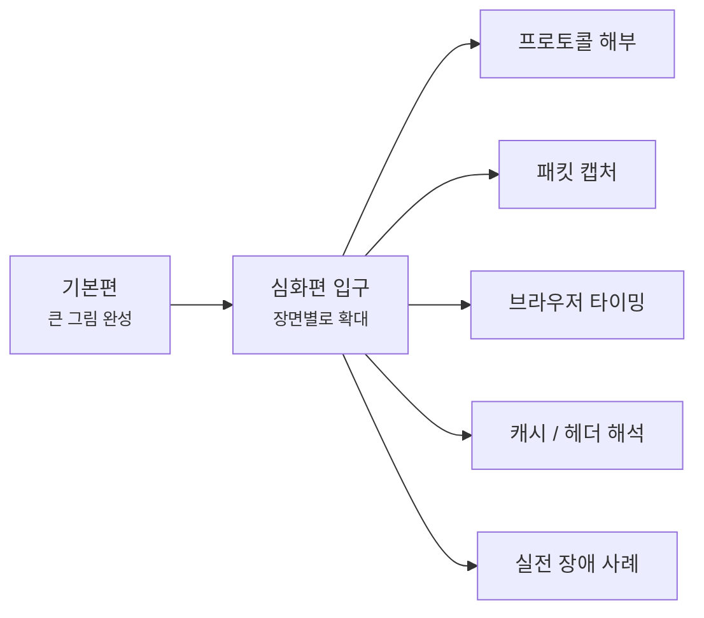

# 네트워크 심화편은 여기서 시작할게요

> 큰 그림을 다 보면 끝일 것 같죠? **사실은 그때부터가 장면을 더 깊게 읽는 시작이에요.**

[기본편의 마지막 글인 요청 하나를 끝까지 따라가 보는 글](../basic/25-end-to-end-request-debugging.md){ data-preview }까지 읽고 나면,
이제는 **인터넷이 왜 그렇게 움직이는지** 에 대한 큰 그림이 어느 정도 머릿속에 들어와 있을 거예요.

근데요, 여기서부터는 질문이 조금 달라져요.

- "이 헤더 칸은 실제로 몇 번째 비트에 들어 있을까요?"
- "이 패킷 캡처 줄은 왜 이렇게 보일까요?"
- "브라우저 waterfall에서 어디가 진짜 느린 걸까요?"
- "캐시 히트와 미스는 응답 헤더에서 어떻게 읽을까요?"
- "이 장애 장면은 DNS 문제일까요, TLS 문제일까요, 오리진 문제일까요?"

바로 이런 질문들이 심화편의 출발점이에요.

---

## 심화편은 어떤 흐름으로 읽게 될까요?

기본편이 **처음부터 차례대로 따라가는 큰 길**이었다면,
심화편은 그 길 위의 **특정 장면을 확대해서 다시 보는 구간**이에요.

그러니까 여기서는 기본편의 큰 흐름을 다시 반복하기보다,
**"이 장면을 더 정확하게 읽고 싶다"** 는 필요를 따라 들어오면 돼요. 어떤 글은 헤더나 캡처를 더 깊게 읽는 쪽으로, 또 어떤 글은 장애 장면이나 브라우저 타이밍을 더 촘촘하게 해석하는 쪽으로 이어질 거예요.

---

## 읽기 전에 이것만 먼저 보면 좋아요

심화편에서 중요한 건 글 수보다,
**기본편에서 만든 감과 지도를 들고 들어오는 것** 이거든요.

그래서 가능하면 먼저:

- [기본편 읽기 가이드](../basic/index.md){ data-preview }를 한 번 보고,
- 가능하면 [기본편 마지막 글](../basic/25-end-to-end-request-debugging.md){ data-preview }까지의 큰 흐름을 머릿속에 두고,
- 그다음 필요한 장면을 심화편에서 다시 여는 식으로 들어오면 좋아요.

### 지금 바로 읽을 수 있는 프로토콜 해부 글

- [IPv4 헤더 한 줄 한 줄 읽기](./ipv4-header-anatomy.md){ data-preview } — 기본편에서 카드처럼만 봤던 IP 헤더를 32비트 격자 위에서 펼쳐봐요.
- [이더넷 프레임과 VLAN 태그 해부하기](./ethernet-frame-and-vlan.md){ data-preview } — IP 패킷을 감싸서 로컬 네트워크로 실어 나르는 이더넷 프레임의 구조와, 그 사이에 끼어드는 VLAN 태그의 4바이트를 자세히 들여다봐요.
- [TCP 헤더는 왜 이렇게 칸이 많을까요?](./tcp-header-anatomy.md){ data-preview } — `SYN`, `ACK`, sequence 번호, window, 옵션이 TCP 헤더의 어느 칸에 들어가는지 20바이트 격자 위에서 같이 읽어봐요.
- [TCP 플래그는 어떻게 읽어야 할까요?](./tcp-flags-cheatsheet.md){ data-preview } — `Flags [S]`, `Flags [S.]`, `Flags [F.]`, `Flags [R]` 같은 짧은 표시를 handshake, 데이터, 종료 장면과 함께 읽어봐요.
- [UDP 헤더는 왜 딱 8바이트일까요?](./udp-header-anatomy.md){ data-preview } — TCP보다 훨씬 짧은 UDP 헤더가 포트, 길이, 체크섬 네 칸으로 어떻게 끝나는지 같이 읽어봐요.
- [IPv6 헤더는 왜 딱 40바이트일까요?](./ipv6-header-anatomy.md){ data-preview } — 주소는 더 길어졌는데 왜 기본 헤더는 오히려 일정해졌는지 같이 읽어봐요.

### 지금 바로 읽을 수 있는 패킷 캡처 글

- [tcpdump 한 줄은 어떻게 읽어야 할까요?](./tcpdump-first-look.md){ data-preview } — 터미널에 길게 찍히는 tcpdump 한 줄을 시간, 인터페이스, 방향, 주소, 플래그, 길이 순서로 차근차근 읽어봐요.

## 자, 정리해볼까요?

!!! abstract "심화편은 이런 분에게 맞아요"
    - 기본편의 큰 흐름을 끝까지 따라온 뒤, 이제 **장면 하나를 더 깊게 보고 싶은 분**
    - 패킷 캡처, 브라우저 타이밍, 캐시 헤더, 장애 사례처럼 **실전 해석 감각**을 더 키우고 싶은 분
    - 큰 그림은 이미 있는데, 그 안쪽 장면이 어떻게 보이는지 더 정확히 읽고 싶은 분

그럼, 심화편으로 들어가기 전에 기본편의 마지막 흐름부터 다시 보고 싶으세요?

<a class="md-button md-button--primary" href="../basic/25-end-to-end-request-debugging/">기본편 마지막 글 다시 보기</a>
<a class="md-button" href="../basic/">기본편 읽기 가이드 보기</a>
