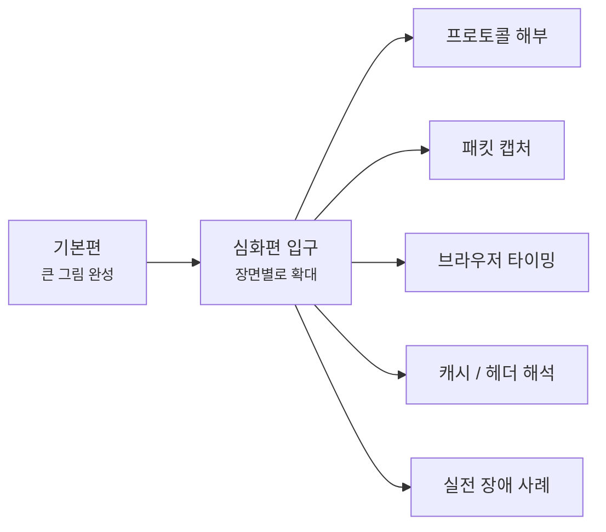
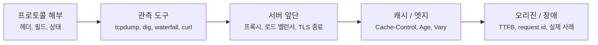
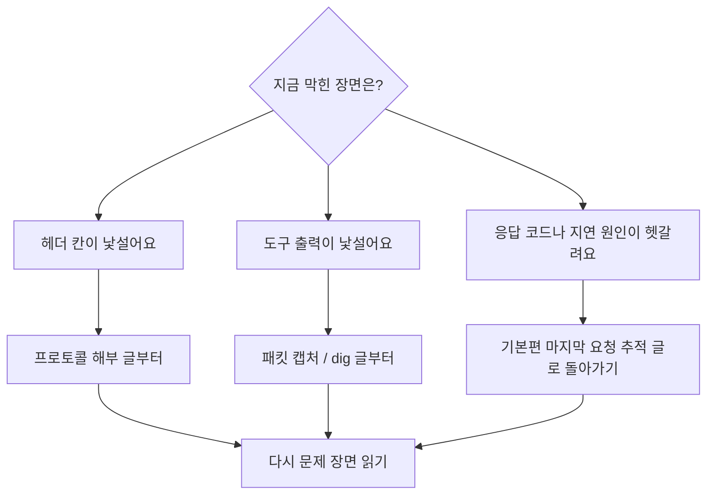

# 네트워크 심화편은 여기서 시작할게요

> 큰 그림을 다 보면 끝일 것 같죠? **사실은 그때부터가 장면을 더 깊게 읽는 시작이에요.**

[기본편의 마지막 글인 요청 하나를 끝까지 따라가 보는 글](../basic/25-end-to-end-request-debugging.md){ data-preview }까지 읽고 나면,
이제는 **인터넷이 왜 그렇게 움직이는지** 에 대한 큰 그림이 어느 정도 머릿속에 들어와 있을 거예요.

근데요, 여기서부터는 질문이 조금 달라져요.

- "이 헤더 칸은 실제로 몇 번째 비트에 들어 있을까요?"
- "이 패킷 캡처 줄은 왜 이렇게 보일까요?"
- "브라우저 waterfall에서 어디가 진짜 느린 걸까요?"
- "캐시 히트와 미스는 응답 헤더에서 어떻게 읽을까요?"
- "이 장애 장면은 DNS 문제일까요, TLS 문제일까요, 오리진 문제일까요?"

바로 이런 질문들이 심화편의 출발점이에요.

---

## 심화편은 어떤 흐름으로 읽게 될까요?

기본편이 **처음부터 차례대로 따라가는 큰 길**이었다면,
심화편은 그 길 위의 **특정 장면을 확대해서 다시 보는 구간**이에요.

그러니까 여기서는 기본편의 큰 흐름을 다시 반복하기보다,
**"이 장면을 더 정확하게 읽고 싶다"** 는 필요를 따라 들어오면 돼요. 어떤 글은 헤더나 캡처를 더 깊게 읽는 쪽으로, 또 어떤 글은 장애 장면이나 브라우저 타이밍을 더 촘촘하게 해석하는 쪽으로 이어질 거예요.

---

## 읽기 전에 이것만 먼저 보면 좋아요

심화편에서 중요한 건 글 수보다,
**기본편에서 만든 감과 지도를 들고 들어오는 것** 이거든요.

그래서 가능하면 먼저:

- [기본편 읽기 가이드](../basic/index.md){ data-preview }를 한 번 보고,
- 가능하면 [기본편 마지막 글](../basic/25-end-to-end-request-debugging.md){ data-preview }까지의 큰 흐름을 머릿속에 두고,
- 그다음 필요한 장면을 심화편에서 다시 여는 식으로 들어오면 좋아요.

근데요, 심화편은 번호 시리즈가 아니다 보니 **아무 데서나 골라 읽기 쉬워 보이지만**, 막상 읽어보면 앞에서 한 번 보고 온 장면이 있을수록 훨씬 덜 헷갈려요.
그래서 아래는 발행 순서가 아니라, **독자가 읽기 편한 추천 순서**로 정리해둘게요.

### 지금 바로 읽을 수 있는 프로토콜 해부 글

- [IPv4 헤더 한 줄 한 줄 읽기](./ipv4-header-anatomy.md){ data-preview } — 기본편에서 카드처럼만 봤던 IP 헤더를 32비트 격자 위에서 펼쳐봐요.
- [IPv6 헤더는 왜 딱 40바이트일까요?](./ipv6-header-anatomy.md){ data-preview } — 주소는 더 길어졌는데 왜 기본 헤더는 오히려 일정해졌는지 같이 읽어봐요.
- [TCP 헤더는 왜 이렇게 칸이 많을까요?](./tcp-header-anatomy.md){ data-preview } — `SYN`, `ACK`, sequence 번호, window, 옵션이 TCP 헤더의 어느 칸에 들어가는지 20바이트 격자 위에서 같이 읽어봐요.
- [TCP 플래그는 어떻게 읽어야 할까요?](./tcp-flags-cheatsheet.md){ data-preview } — `Flags [S]`, `Flags [S.]`, `Flags [F.]`, `Flags [R]` 같은 짧은 표시를 handshake, 데이터, 종료 장면과 함께 읽어봐요.
- [TCP 상태 머신: 연결의 탄생부터 소멸까지의 일대기](./tcp-state-machine.md){ data-preview } — TCP가 `SYN`을 보내고 `TIME-WAIT`로 사라지기까지, 엔드포인트 내부에서 어떤 상태를 거치는지 RFC 9293 표준을 바탕으로 촘촘하게 해부해봐요.
- [TCP 윈도우와 흐름 제어는 왜 같이 읽어야 할까요?](./tcp-window-and-flow-control.md){ data-preview } — 받는 쪽이 **"지금은 이만큼 더 받아도 돼요"** 라고 광고하는 Window 값이 ACK, 버퍼 여유, Window Scale과 함께 어떻게 움직이는지 같이 읽어봐요.
- [TCP 혼잡 제어는 왜 흐름 제어와 따로 봐야 할까요?](./tcp-congestion-control.md){ data-preview } — 받는 쪽 여유가 아니라 **길이 붐비는지**를 보고 송신자가 `cwnd` 를 어떻게 조절하는지, slow start와 duplicate ACK 감각까지 같이 읽어봐요.
- [UDP 헤더는 왜 딱 8바이트일까요?](./udp-header-anatomy.md){ data-preview } — TCP보다 훨씬 짧은 UDP 헤더가 포트, 길이, 체크섬 네 칸으로 어떻게 끝나는지 같이 읽어봐요.
- [이더넷 프레임과 VLAN 태그 해부하기](./ethernet-frame-and-vlan.md){ data-preview } — IP 패킷을 감싸서 로컬 네트워크로 실어 나르는 이더넷 프레임의 구조와, 그 사이에 끼어드는 VLAN 태그의 4바이트를 자세히 들여다봐요.

### 지금 바로 읽을 수 있는 패킷 캡처 글

- [tcpdump 한 줄은 어떻게 읽어야 할까요?](./tcpdump-first-look.md){ data-preview } — 터미널에 길게 찍히는 tcpdump 한 줄을 시간, 인터페이스, 방향, 주소, 플래그, 길이 순서로 차근차근 읽어봐요.
- [tcpdump에서 TCP handshake는 어떻게 보일까요?](./tcp-handshake-in-capture.md){ data-preview } — `SYN`, `SYN-ACK`, `ACK` 세 줄이 실제 캡처에서는 어떻게 찍히는지, 어디서 끊기면 무엇을 의심해야 하는지 같이 읽어봐요.
- [ss와 netstat에서 TCP 상태는 어떻게 읽어야 할까요?](./ss-and-netstat-state-reading.md){ data-preview } — `LISTEN`, `ESTABLISHED`, `TIME-WAIT`, `CLOSE-WAIT` 같은 상태 이름이 실제 운영 화면에서는 어떤 장면으로 읽히는지 같이 정리해봐요.

### 그다음 TLS 장면으로 넘어가면 좋아요

- [TLS 1.3 핸드셰이크는 실제로 어떤 순서일까요?](./tls13-handshake-anatomy.md){ data-preview } — `ClientHello` 부터 `ServerHello`, `EncryptedExtensions`, `Certificate`, `Finished` 까지, HTTPS 보호 통로가 어떤 순서로 준비되는지 같이 해부해봐요.
- [TLS 핸드셰이크는 실제로 어떻게 한 단계씩 진행될까요?](./tls-handshake-step-by-step.md){ data-preview } — TCP가 열린 뒤 TLS 장면이 어떤 순서로 지나가고, 각 단계에서 무엇을 먼저 읽어야 하는지 실제 흐름처럼 따라가봐요.
- [TLS 인증서 체인과 신뢰 오류는 어떻게 읽어야 할까요?](./tls-cert-chain-and-trust-errors.md){ data-preview } — `hostname mismatch`, 만료, intermediate 누락, 신뢰 저장소 차이 같은 인증서 경고를 **어느 검사에서 멈췄는지** 기준으로 같이 읽어봐요.
- [SNI, ESNI, ECH는 뭐가 다를까요?](./sni-and-esni-ech.md){ data-preview } — 서버가 인증서를 고르기 전에 왜 이름이 먼저 필요했는지, 평문 SNI가 왜 문제였는지, 왜 ESNI가 ECH로 바뀌었는지 같이 해부해봐요.
- [QUIC은 왜 UDP 위에서 돌아갈까요?](./quic-first-look.md){ data-preview } — QUIC이 왜 굳이 UDP를 바닥으로 골랐는지, TLS는 어디에 들어가는지, HTTP/3 장면은 어떻게 보이는지 같이 읽어봐요.

### 그다음 DNS 메시지 안쪽으로 내려가도 좋아요

- [DNS 메시지는 왜 질문 하나에 칸이 이렇게 많을까요?](./dns-message-format.md){ data-preview } — `id`, `flags`, `QUESTION`, `ANSWER`, `AUTHORITY`, `ADDITIONAL` 같은 칸이 실제로 어떤 구조로 붙어 있는지, `dig` 화면 감각과 함께 같이 읽어봐요.
- [dig 출력은 어디부터 읽어야 할까요?](./dns-lookup-with-dig.md){ data-preview } — `dig` 기본 출력에서 `HEADER`, `QUESTION`, `ANSWER`, `AUTHORITY`, `ADDITIONAL`, `SERVER` 줄을 어떤 순서로 읽어야 하는지 실제 장면처럼 따라가봐요.
- [DNS 재귀 조회와 반복 조회는 뭐가 다를까요?](./dns-resolver-recursion-vs-iteration.md){ data-preview } — 브라우저는 한 번만 물어본 것 같은데, 재귀 리졸버가 루트·TLD·권한 서버를 대신 따라가는 흐름을 같이 읽어봐요.
- [DNS TTL과 캐시는 왜 바뀐 주소를 바로 안 보여줄까요?](./dns-ttl-and-cache-staleness.md){ data-preview } — DNS 설정을 바꿨는데도 누군가는 예전 주소를 보는 이유를 TTL, 재귀 리졸버 캐시, 음성 캐시 관점에서 읽어봐요.

## 그다음에는 어떤 장면을 더 열어볼까요?

여기까지가 지금 바로 읽을 수 있는 심화편의 첫 묶음이에요.
처음에는 **프로토콜의 속살을 읽는 힘**을 먼저 만들고, 그다음에는 **도구 출력과 실제 장애 장면을 해석하는 힘**으로 넓혀갈 거예요.

이 그림은 발행 순서라기보다 **읽는 힘이 넓어지는 방향**에 가까워요.
처음에는 패킷과 헤더를 직접 읽고, 그다음에는 그 흔적이 도구 화면과 운영 장면에서 어떻게 보이는지 따라가게 될 거예요.

### DNS 쪽에서는 이런 질문이 이어져요

이미 공개된 DNS 글에서는 **메시지 구조**와 **`dig` 출력 읽기**를 먼저 봤어요.
그다음에는 이런 질문이 자연스럽게 남아요.

- `CNAME` 은 왜 편한데, apex 도메인에서는 갑자기 조심해야 할까요?
- DNS 메시지가 커지면 왜 EDNS0 같은 확장 메모가 필요해질까요?
- DoH와 DoT는 DNS를 어디까지 숨기고, 어디까지는 여전히 남겨둘까요?

여기서는 아직 링크를 달지 않을게요.
글이 실제로 발행되면 이 입구 문서와 사이드바에 함께 붙여서, 지금처럼 바로 이어 읽을 수 있게 정리할 거예요.

### 웹 요청을 더 깊게 보면 이런 장면도 기다리고 있어요

DNS 다음에는 HTTP와 서버 앞단으로 시선이 옮겨가요.
브라우저에서 요청 하나가 느려졌을 때, 겉으로는 그냥 **"사이트가 느리다"** 로 보이지만 안쪽 장면은 꽤 다르게 갈라지거든요.

| 겉으로 보이는 장면 | 더 깊게 보면 | 앞으로 열어볼 질문 |
|---|---|---|
| 브라우저 waterfall이 길게 늘어짐 | DNS, 연결, TLS, TTFB, 다운로드 시간이 따로 움직임 | 진짜 느린 구간은 어디일까요? |
| `502`, `503`, `504` 가 뜸 | 앞단 프록시와 뒤쪽 서버 사이의 실패일 수 있음 | 이 응답은 누구의 목소리일까요? |
| 캐시가 된 것 같은데 값이 이상함 | `Cache-Control`, `Age`, `Vary`, CDN 상태 헤더가 얽힘 | 지금 보는 건 새 값일까요, 오래된 사본일까요? |
| 인증서 오류가 갑자기 터짐 | 체인, 만료, 이름 불일치, 신뢰 저장소가 갈라짐 | 어느 검사에서 멈춘 걸까요? |
| 간헐적으로만 느림 | 평균보다 p95, p99 같은 꼬리 지연이 중요할 수 있음 | 왜 대부분은 빠른데 일부 요청만 느릴까요? |

기본편에서는 이 장면들을 한 요청의 큰 흐름으로 이어서 봤고,
심화편에서는 각각의 줄을 **실제 출력, 헤더, 상태, 장애 사례** 위에서 다시 읽어볼 거예요.

## 길을 잃었을 때는 이렇게 돌아오면 돼요

심화편은 차례대로 읽어도 좋지만, 문제를 만난 지점에서 들어와도 괜찮아요.
대신 막히면 아래처럼 한 칸만 뒤로 물러서면 훨씬 덜 복잡해져요.

헤더 칸이 헷갈리면 구조 해부 글로, 출력이 헷갈리면 도구 글로, 전체 요청 흐름이 흐릿하면 기본편 마지막 글로 잠깐 돌아오면 돼요.
심화편은 외우는 글 모음이라기보다, **문제 장면을 더 작게 쪼개 읽는 지도**에 가까워요.

## 자, 정리해볼까요?

!!! abstract "심화편은 이런 분에게 맞아요"
    - 기본편의 큰 흐름을 끝까지 따라온 뒤, 이제 **장면 하나를 더 깊게 보고 싶은 분**
    - 패킷 캡처, 브라우저 타이밍, 캐시 헤더, 장애 사례처럼 **실전 해석 감각**을 더 키우고 싶은 분
    - 큰 그림은 이미 있는데, 그 안쪽 장면이 어떻게 보이는지 더 정확히 읽고 싶은 분
    - 헤더, 상태, 출력, 응답 헤더를 보고 **"이게 어떤 신호인지"** 직접 읽어보고 싶은 분

그럼, 심화편으로 들어가기 전에 기본편의 마지막 흐름부터 다시 보고 싶으세요?

<a class="md-button md-button--primary" href="../basic/25-end-to-end-request-debugging/">기본편 마지막 글 다시 보기</a>
<a class="md-button" href="../basic/">기본편 읽기 가이드 보기</a>
