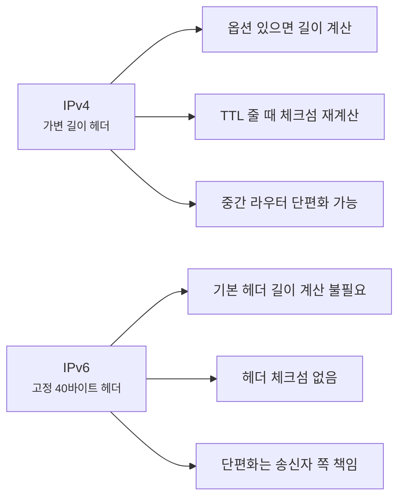
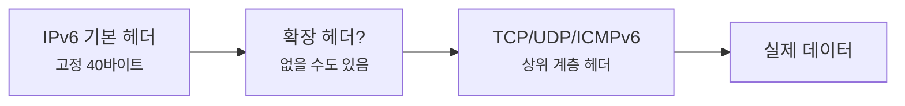

# IPv6 헤더는 왜 딱 40바이트일까요?

> IPv6 주소는 훨씬 길어졌는데, **헤더 자체는 오히려 "무조건 40바이트"로 더 단순해졌어요.**

[IP 주소와 라우팅](../basic/02-ip-and-routing.md){ data-preview }에서는 IP 헤더를 **출발지 IP / 도착지 IP / TTL / 프로토콜** 카드 정도로만 봤고, [IPv4 헤더 한 줄 한 줄 읽기](./ipv4-header-anatomy.md){ data-preview }에서는 그 카드가 실제로 **32비트 격자** 안에 어떻게 들어앉는지 펼쳐봤어요.

근데 여기서 이런 생각이 들죠.

> *"그럼 IPv6는요? 주소는 엄청 길어졌는데 헤더도 같이 더 복잡해졌나요?"*

겉으로 보면 그럴 것 같죠? **사실은 반은 맞고, 반은 아니에요.** 주소 칸은 훨씬 커졌지만, 대신 IPv4가 헤더 안에 꾹꾹 눌러 담아뒀던 몇몇 일은 바깥으로 빼버렸거든요.

이 글이 중요한 이유도 거기 있어요.

- 왜 IPv6는 주소는 더 커졌는데 **기본 헤더는 오히려 더 정돈돼 보이는지**
- 왜 `TTL` 대신 `Hop Limit`, `Protocol` 대신 `Next Header` 같은 이름을 쓰는지
- 왜 IPv4에서 보던 단편화 관련 칸이나 체크섬이 **기본 헤더에서 사라졌는지**

오늘은 그 결과가 왜 **딱 40바이트짜리 고정 헤더**가 됐는지, 그리고 `TTL` 자리에 왜 `Hop Limit` 이 들어왔는지까지 같이 읽어볼게요.

!!! note "이 글의 범위"
    여기서는 **IPv6 기본 헤더(base header)** 만 다뤄요. 확장 헤더(Extension Header)는 왜 필요한지와 어디에 붙는지만 짚고, Neighbor Discovery나 주소 체계 전체는 다른 글에서 따로 열어볼게요. RFC 기준으로는 [RFC 8200 3장](https://www.rfc-editor.org/rfc/rfc8200.html#section-3) 의 헤더 형식과 [4장](https://www.rfc-editor.org/rfc/rfc8200.html#section-4) 의 확장 헤더 흐름이 오늘 글의 뼈대예요.

---

## 그래서 IPv6 헤더는 한마디로 뭐예요?

IPv6 기본 헤더는 **자주 읽어야 하는 공통 정보만 앞에 고정 길이로 남기고, 나머지는 뒤로 분리한 새 양식**에 가까워요.

| 기본편에서 잡은 감각 | 비유에서는 | 실제로는 |
|---|---|---|
| 출발지 주소 / 도착지 주소 | 보낸 사람 / 받는 사람 주소 칸 | Source Address / Destination Address |
| TTL | 중간 거점을 몇 번까지 거칠 수 있는지 | Hop Limit |
| 프로토콜 | 이 상자 안에 다음으로 뭘 실었는지 | Next Header |
| 옵션 | 송장 옆에 덧붙이는 특이사항 메모 | Extension Header |

그러니까 IPv6는 **"정보를 없앴다"** 라기보다, **"맨 앞 송장은 일정하게, 특이사항은 뒤로"** 라는 식으로 구조를 다시 정리한 거예요.

---

## IPv4 카드와 뭐가 달라졌을까요?

[IP 주소와 라우팅의 IP 헤더 카드](../basic/02-ip-and-routing.md#ip-header-card){ data-preview }에서 봤던 네 장을 IPv6 쪽에 그대로 옮겨보면 이렇게 보여요.

| 기본편 카드 | IPv4에서는 | IPv6에서는 |
|---|---|---|
| 출발지 IP | 32비트 (4바이트) | 128비트 (16바이트) |
| 도착지 IP | 32비트 (4바이트) | 128비트 (16바이트) |
| TTL | `TTL` | `Hop Limit` |
| 프로토콜 | `Protocol` | `Next Header` |

이 표만 봐도 느낌이 와요.

- 주소 칸은 **4배** 커졌고,
- `TTL` 은 이름이 `Hop Limit` 으로 바뀌었고,
- `Protocol` 은 뒤에 오는 헤더를 더 넓게 가리키는 `Next Header` 로 바뀌었어요.

그리고 IPv4에서 봤던 **Header Checksum**, **Flags**, **Fragment Offset** 같은 칸은 기본 헤더에서 사라졌어요. 없어졌다고 끝난 건 아니고, 일부는 **확장 헤더**로 빠졌고 일부는 **굳이 매 홉마다 하지 않기로** 한 거예요.



한 줄로 줄이면 이거예요. **IPv4는 헤더 안에서 여러 일을 같이 했고, IPv6는 기본 헤더를 단순하게 만든 뒤 나머지를 바깥으로 분리했어요.**

---

## IPv6 기본 헤더 전체 그림 { #header-grid }

IPv6 기본 헤더는 **무조건 40바이트(320비트)** 예요. 한 줄을 32비트로 그리면 **딱 10줄**이에요.

<div style="margin: 1.5rem 0; border: 2px solid var(--md-default-fg-color--lighter); border-radius: 0.75rem; overflow: hidden; background: color-mix(in srgb, var(--md-default-bg-color) 95%, var(--md-default-fg-color) 5%);">
  <div style="display: grid; grid-template-columns: repeat(32, 1fr); padding: 0.4rem 0.6rem; gap: 0; background: color-mix(in srgb, var(--md-primary-fg-color) 8%, var(--md-default-bg-color)); border-bottom: 1px solid var(--md-default-fg-color--lightest); font-size: 0.65rem; color: var(--md-default-fg-color--light); text-align: center;">
    <span style="grid-column: span 4;">0</span>
    <span style="grid-column: span 8;">4</span>
    <span style="grid-column: span 20;">12</span>
  </div>
  <div style="display: grid; grid-template-columns: repeat(32, 1fr); gap: 2px; padding: 0.6rem; background: var(--md-default-fg-color--lightest);">
    <div style="grid-column: span 4; padding: 0.5rem 0.4rem; background: color-mix(in srgb, #ef4444 18%, var(--md-default-bg-color)); text-align: center; font-size: 0.8rem; border-radius: 0.25rem;"><strong>Version</strong><br/><small>4b</small></div>
    <div style="grid-column: span 8; padding: 0.5rem 0.4rem; background: color-mix(in srgb, #f97316 18%, var(--md-default-bg-color)); text-align: center; font-size: 0.8rem; border-radius: 0.25rem;"><strong>Traffic Class</strong><br/><small>8b</small></div>
    <div style="grid-column: span 20; padding: 0.5rem 0.4rem; background: color-mix(in srgb, #eab308 18%, var(--md-default-bg-color)); text-align: center; font-size: 0.8rem; border-radius: 0.25rem;"><strong>Flow Label</strong><br/><small>20b</small></div>

    <div style="grid-column: span 16; padding: 0.5rem 0.4rem; background: color-mix(in srgb, #22c55e 18%, var(--md-default-bg-color)); text-align: center; font-size: 0.8rem; border-radius: 0.25rem;"><strong>Payload Length</strong><br/><small>16b</small></div>
    <div style="grid-column: span 8; padding: 0.5rem 0.4rem; background: color-mix(in srgb, #14b8a6 18%, var(--md-default-bg-color)); text-align: center; font-size: 0.8rem; border-radius: 0.25rem;"><strong>Next Header</strong><br/><small>8b</small></div>
    <div style="grid-column: span 8; padding: 0.5rem 0.4rem; background: color-mix(in srgb, #06b6d4 18%, var(--md-default-bg-color)); text-align: center; font-size: 0.8rem; border-radius: 0.25rem;"><strong>Hop Limit</strong><br/><small>8b</small></div>

    <div style="grid-column: span 32; padding: 0.5rem 0.4rem; background: color-mix(in srgb, #6366f1 18%, var(--md-default-bg-color)); text-align: center; font-size: 0.8rem; border-radius: 0.25rem;"><strong>Source Address</strong><br/><small>128b (4줄)</small></div>

    <div style="grid-column: span 32; padding: 0.5rem 0.4rem; background: color-mix(in srgb, #8b5cf6 18%, var(--md-default-bg-color)); text-align: center; font-size: 0.8rem; border-radius: 0.25rem;"><strong>Destination Address</strong><br/><small>128b (4줄)</small></div>

    <div style="grid-column: span 32; padding: 0.5rem 0.4rem; background: color-mix(in srgb, var(--md-default-fg-color) 10%, var(--md-default-bg-color)); text-align: center; font-size: 0.75rem; border-radius: 0.25rem; color: var(--md-default-fg-color--light); border: 1px dashed var(--md-default-fg-color--lighter);"><strong>Extension Headers / Upper-Layer Data</strong><br/><small>필요하면 뒤에 붙고, 아니면 바로 TCP/UDP/ICMPv6 같은 상위 헤더로 이어져요</small></div>
  </div>
</div>

이 그림에서 가장 중요한 감각은 두 가지예요.

1. **기본 헤더 길이가 무조건 40바이트로 고정**이라는 점
2. 특별한 일은 **기본 헤더 안에 우겨 넣지 않고 뒤에 붙인다**는 점

즉, IPv4처럼 *"헤더 길이가 몇 바이트인지부터 먼저 읽어야 한다"* 가 아니라, IPv6는 기본 송장 자체는 언제나 같은 길이라고 생각하면 돼요.

---

## 1번째 줄 — 버전, 우선순위, 흐름 꼬리표 { #row-1 }

**Version (4비트) · Traffic Class (8비트) · Flow Label (20비트)**

| 필드 | 길이(bit) | 의미 | 자주 보는 값 |
|---|---:|---|---|
| Version | 4 | IP 버전. IPv6면 항상 `6` | `6` |
| Traffic Class | 8 | 우선순위·혼잡 관련 힌트 | `0x00` 흔함 |
| Flow Label | 20 | 같은 흐름으로 다루고 싶은 패킷 묶음 표시 | `0x00000` 흔함 |

첫 줄은 *"나 IPv6야. 그리고 이 흐름을 이런 성격으로 봐줘"* 라고 말하는 줄이에요.

`Traffic Class` 는 IPv4에서 본 `ToS / DSCP+ECN` 쪽 감각이 이어진다고 보면 돼요. 반면 `Flow Label` 은 IPv4 기본 헤더에는 없던 새 칸이에요. 같은 흐름에 속한 패킷들을 네트워크가 조금 더 일관되게 다루도록 돕기 위한 20비트 꼬리표예요. RFC 8200 3장은 이 줄을 아예 헤더 첫머리에 고정해놔서, 장비가 *"일단 IPv6 패킷이다"* 라는 사실과 기본 성격을 빠르게 읽을 수 있게 했어요.

---

## 2번째 줄 — 길이, 다음 헤더, 남은 홉 수 { #row-2 }

**Payload Length (16비트) · Next Header (8비트) · Hop Limit (8비트)**

| 필드 | 길이(bit) | 의미 | 자주 보는 값 |
|---|---:|---|---|
| Payload Length | 16 | IPv6 헤더 뒤에 오는 전체 길이 | `20`, `32`, `1440` 류 |
| Next Header | 8 | 바로 뒤에 오는 헤더 종류 | `6`(TCP), `17`(UDP), `58`(ICMPv6), `44`(Fragment) |
| Hop Limit | 8 | 라우터를 지날 때마다 1씩 줄어드는 값 | `64`, `128`, `255` |

`Hop Limit` 은 사실상 IPv4의 `TTL` 자리에 있는 친구예요. 다만 이름이 더 솔직해졌어요. 실제로는 시간을 재는 게 아니라 **몇 홉 더 갈 수 있는지**를 세니까요.

`Next Header` 도 중요해요. 이름만 보면 IPv4 `Protocol` 의 다른 말 같죠? 절반은 맞아요. TCP=`6`, UDP=`17` 같은 번호 공간을 공유하니까요. 그런데 IPv6에서는 그 값이 꼭 TCP/UDP를 바로 가리키는 건 아니에요. 중간에 **Fragment 헤더(`44`)**, **Routing 헤더(`43`)**, **Destination Options(`60`)** 같은 확장 헤더가 한 장 더 붙을 수도 있거든요.

그리고 `Payload Length` 는 이름이 조금 함정이에요. **40바이트짜리 기본 헤더는 제외**하고, 그 뒤에 오는 확장 헤더 + 상위 계층 데이터 길이를 가리켜요.

---

## 3~6번째 줄 — 출발지 주소 { #source-address }

**Source Address (128비트 = 16바이트)**

| 필드 | 길이(bit) | 의미 | 자주 보는 값 |
|---|---:|---|---|
| Source Address | 128 | 보낸 사람 IPv6 주소 | `2001:db8::10` 류 |

이제부터는 진짜로 주소 칸이 커져요. IPv4에서는 주소 한 줄이 32비트였는데, IPv6는 **주소 하나가 무려 128비트**라서 **네 줄**을 통째로 써요.

그래서 IPv6 헤더가 길어 보이는 가장 큰 이유는 사실 복잡한 제어 필드가 많아서가 아니라, **주소 칸 자체가 엄청 커졌기 때문**이에요.

```text
  2001  : 0db8  : 0001  : 0000  : 0000  : 0000  : 0000  : 0010
│-16bit-│-16bit-│-16bit-│-16bit-│-16bit-│-16bit-│-16bit-│-16bit-│
```

우리가 평소에 `2001:db8:1::10` 처럼 줄여 쓰는 건, 16비트 덩어리 여덟 개를 사람이 보기 좋게 압축한 표현이에요.

---

## 7~10번째 줄 — 도착지 주소 { #destination-address }

**Destination Address (128비트 = 16바이트)**

| 필드 | 길이(bit) | 의미 | 자주 보는 값 |
|---|---:|---|---|
| Destination Address | 128 | 받는 사람 IPv6 주소 | `2606:4700:4700::1111` 류 |

도착지 주소도 똑같이 네 줄을 써요. 기본 감각은 IPv4와 같아요. **어디로 갈지**를 알려주는 가장 큰 표지판이죠.

다만 RFC 8200 3장은 한 가지 단서를 붙여요. 만약 Routing 헤더 같은 확장 헤더가 있다면, 이 칸이 **최종 도착지와 잠깐 다르게 보일 수도 있어요.** 대부분의 평범한 웹 트래픽에서는 그냥 최종 목적지라고 생각해도 충분하지만, 심화편에서는 *"주소 칸이 항상 마지막 종착역만 뜻하는 건 아니구나"* 정도는 기억해두면 좋아요.

---

## 근데 왜 굳이 이렇게 바꿨을까요?

IPv6가 단순히 주소만 늘린 버전이었다면, 굳이 헤더 구조까지 손대지 않아도 됐을 거예요. 근데 실제로는 세 가지 큰 이유가 있었어요.

### 1. 라우터가 매 패킷마다 덜 바쁘게 하려고요

IPv4는 `TTL` 이 줄어들 때마다 **Header Checksum** 도 다시 계산해야 했어요. 라우터 입장에서는 홉 하나 지날 때마다 매번 추가 계산이 붙는 셈이죠.

IPv6는 아예 **헤더 체크섬 필드를 없애버렸어요.** 상위 계층과 링크 계층이 무결성을 어느 정도 챙기고, 라우터는 전달에 집중하게 하자는 쪽으로 구조를 정리한 거예요.

### 2. 기본 헤더를 읽는 일은 언제나 같은 길이로 맞추려고요

IPv4는 옵션이 있으면 20바이트보다 길어질 수 있었죠. 그래서 먼저 `IHL` 을 읽고, 그다음 데이터 시작 위치를 계산해야 했어요.

IPv6는 이걸 뒤집었어요.

- 기본 헤더는 **무조건 40바이트**
- 더 필요한 정보는 **확장 헤더로 뒤에 붙이기**

장비 입장에서는 첫 40바이트를 읽는 방식이 늘 같으니까 훨씬 다루기 편해져요.

### 3. 단편화 책임을 송신자 쪽으로 더 밀어냈어요

[MTU, Fragmentation, 그리고 Path MTU](../basic/21-mtu-fragmentation-and-path-mtu.md){ data-preview }에서 봤듯이, IPv6 라우터는 중간에서 패킷을 잘게 쪼개주지 않아요. 너무 크면 **ICMPv6 Packet Too Big** 을 돌려주고, 보낸 쪽이 다시 크기를 조절해야 해요.

그래서 IPv4 기본 헤더에 있던 `Flags`, `Fragment Offset` 같은 칸도 IPv6 기본 헤더에서는 빠졌어요. 필요하면 **Fragment 확장 헤더**가 뒤에 붙는 식이에요.

---

## 그럼 확장 헤더는 어디 붙을까요? { #extension-headers }

여기서는 중요한 경계만 하나 먼저 잡아둘게요.

> 여기서는 **확장 헤더가 왜 생겼는지**까지만 볼게요. 실제로 Hop-by-Hop, Routing, Fragment 헤더가 어떤 순서로 붙고 각각 안에 뭐가 들어가는지는 뒤 글에서 따로 열어볼게요.

그림으로 보면 이런 느낌이에요.



핵심은 `Next Header` 가 체인처럼 이어진다는 거예요.

- 기본 헤더의 `Next Header = 6` 이면 바로 TCP
- `Next Header = 44` 면 다음에 Fragment 헤더가 한 장 더 있음
- 그 Fragment 헤더 안에도 또 `Next Header` 가 있어서, 그다음이 TCP인지 UDP인지 이어서 가리켜요

이 방식 덕분에 기본 헤더는 짧고 일정하게 유지하면서도, 필요할 때만 정보를 뒤에 더 붙일 수 있어요.

---

## 실제 패킷에서 이렇게 보여요

말로만 보면 여전히 추상적이니까, 실제 바이트를 한 번 짚어볼게요.

### 먼저, 진짜 바이트로 보면 { #real-bytes }

옵션 없는 단순한 IPv6 + TCP 패킷의 앞 40바이트만 떼서 보면 이렇게 생겼다고 해볼게요.

```text
0x0000  60 00 00 00 00 14 06 40 20 01 0d b8 00 01 00 00
0x0010  00 00 00 00 00 00 00 10 26 06 47 00 47 00 00 00
0x0020  00 00 00 00 00 00 11 11
```

| 위치 | hex 에서 잘라보면 | 어떻게 읽나 |
|---|---|---|
| 1번째 바이트 상위 4비트 | `6` | Version = 6 |
| 1~4번째 바이트 | `60 00 00 00` | Traffic Class = 0, Flow Label = 0 |
| 5~6번째 바이트 | `00 14` | Payload Length = 20바이트 |
| 7번째 바이트 | `06` | Next Header = 6 = TCP |
| 8번째 바이트 | `40` | Hop Limit = 64 |
| 9~24번째 바이트 | `20 01 ... 00 10` | Source Address = `2001:db8:1::10` |
| 25~40번째 바이트 | `26 06 ... 11 11` | Destination Address = `2606:4700:4700::1111` |

여기서 눈에 띄는 건, IPv4처럼 `IHL` 이나 `Header Checksum` 을 찾을 자리가 아예 없다는 점이에요. 딱 정해진 칸만 읽고 바로 다음 단계로 넘어가면 돼요.

### 사람이 읽는 한 줄로 보면

도구가 이걸 풀어주면 대략 이런 식으로 보일 수 있어요.

```text
IP6 2001:db8:1::10 > 2606:4700:4700::1111: hlim 64 next-header TCP payload length: 20
```

이 한 줄에서 읽어야 할 건 세 가지예요.

- `IP6` — IPv6 패킷이라는 뜻
- `hlim 64` — `Hop Limit = 64`
- `next-header TCP` — 다음 헤더가 TCP라는 뜻

즉 IPv4에서 보던 **TTL / Protocol / Source / Destination** 감각이, IPv6에서는 **Hop Limit / Next Header / 128비트 주소** 형태로 이어진다고 보면 돼요.

---

## 잘못 읽기 쉬운 함정 세 가지

**하나, Hop Limit을 여전히 시간처럼 읽기.**
이름은 바뀌었지만 역할은 여전히 **홉 수 제한**이에요. 초 단위 타이머가 아니에요.

**둘, Payload Length에 40바이트 헤더가 포함된다고 생각하기.**
아니에요. **기본 헤더 뒤에 오는 길이만** 세요. 그래서 와이어 위 실제 총 길이는 `40 + Payload Length` 에 가까워요.

**셋, Next Header가 항상 TCP/UDP를 바로 가리킨다고 생각하기.**
그럴 수도 있지만, 중간에 확장 헤더가 끼면 **다음 칸은 일단 Fragment나 Routing 같은 헤더**일 수도 있어요.

---

## 자, 정리해볼까요?

!!! abstract "오늘 우리가 본 것"
    - IPv6 기본 헤더는 **무조건 40바이트(320비트)** 짜리 고정 격자예요.
    - 1줄: Version + Traffic Class + Flow Label — 패킷의 성격과 흐름 꼬리표.
    - 2줄: Payload Length + Next Header + Hop Limit — 길이, 다음 헤더, 남은 홉 수.
    - 3~6줄: Source Address, 7~10줄: Destination Address — 주소 두 개가 대부분의 공간을 차지해요.
    - IPv4의 `TTL` 은 IPv6에서 `Hop Limit` 으로 이어지고, `Protocol` 은 `Next Header` 로 확장돼요.
    - 단편화 정보와 헤더 체크섬은 기본 헤더에서 빠졌고, 필요하면 확장 헤더나 다른 계층이 그 역할을 나눠 맡아요.

[IP 주소와 라우팅](../basic/02-ip-and-routing.md){ data-preview }에서 *"IP 헤더 안에는 출발지, 도착지, TTL, 프로토콜 같은 정보가 있다"* 정도로만 봤던 감각이, 이제는 *"IPv6에서는 그 정보가 어떤 칸으로 재배치됐는지"* 로 한 단계 더 선명해졌어요.

---

## 이어서 보면 좋은 글

- 같은 기본 개념이 예전 양식에서는 어떻게 생겼는지 다시 보고 싶다면 — [IPv4 헤더 한 줄 한 줄 읽기](./ipv4-header-anatomy.md){ data-preview }
- IPv6에서 왜 라우터가 중간 단편화를 안 하는지 흐름부터 다시 잡고 싶다면 — [MTU, Fragmentation, 그리고 Path MTU](../basic/21-mtu-fragmentation-and-path-mtu.md){ data-preview }
- IP 헤더 바로 위에 얹히는 TCP 헤더가 어떻게 생겼는지 보고 싶다면 — [TCP 헤더는 왜 이렇게 칸이 많을까요?](./tcp-header-anatomy.md){ data-preview }

여기까지 오면, 보통 관심사는 한 층 더 위로 올라가요.

> *"IP 헤더는 알겠는데, 우리가 handshake랑 재전송에서 계속 보던 `SYN`, `ACK`, sequence 번호는 그 위에서 정확히 어디 칸에 들어 있죠?"*

그 관심사는 자연스럽게 [TCP 헤더는 왜 이렇게 칸이 많을까요?](./tcp-header-anatomy.md){ data-preview } 쪽과 이어져요. 바로 이 글과 맞물리는 다음 구조 해부 글이에요.
