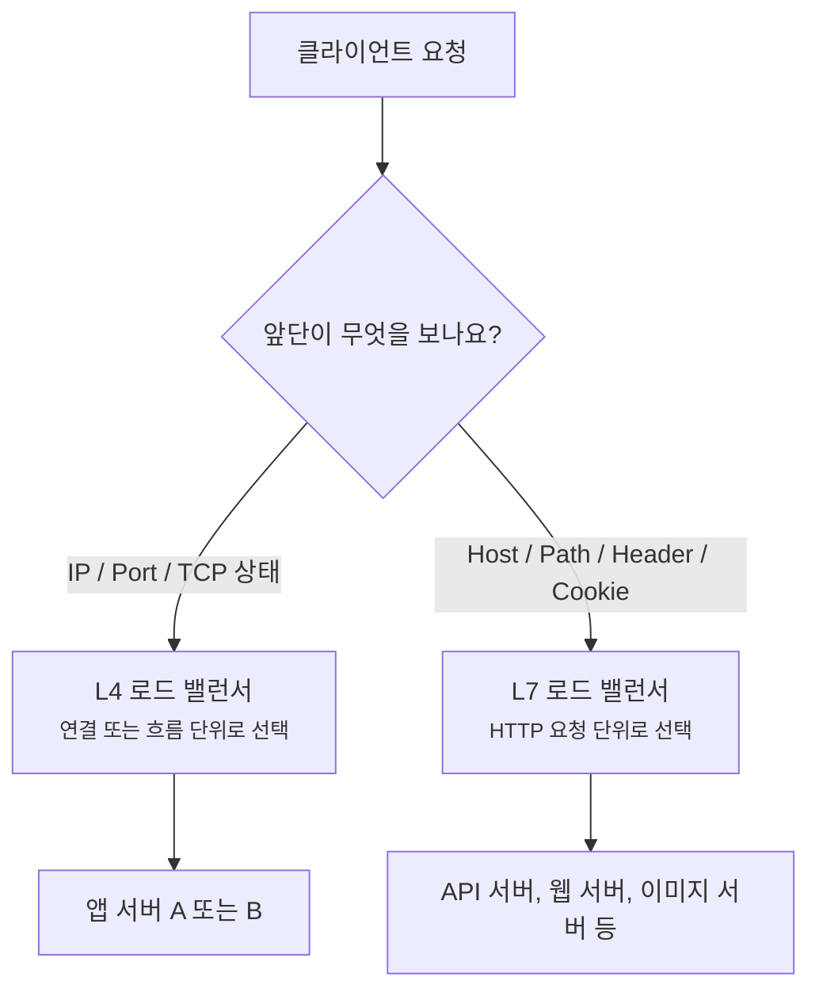
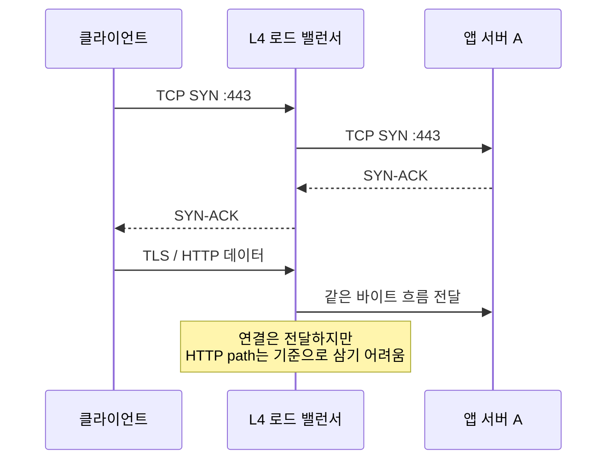
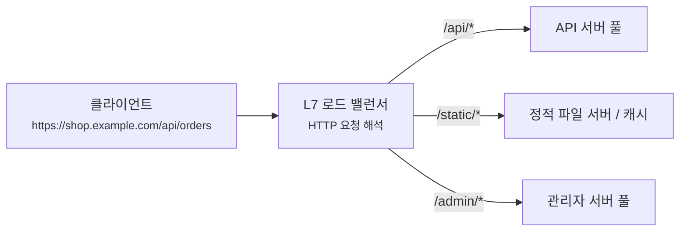
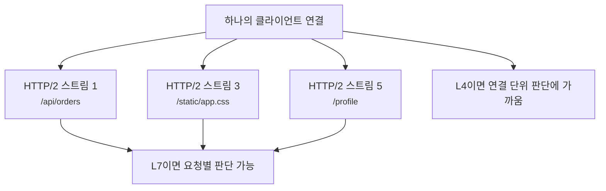
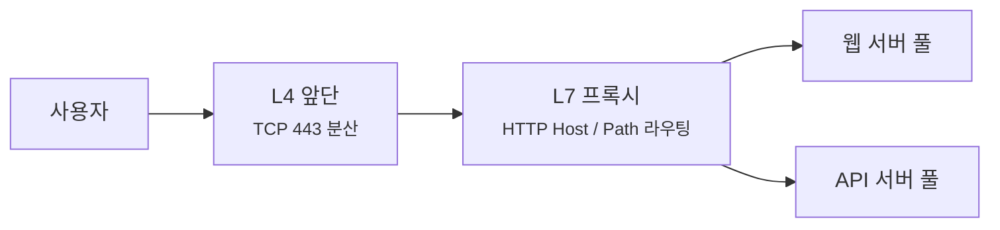

# L4와 L7 로드 밸런서는 무엇을 보고 나눠 보낼까요?

> 같은 로드 밸런서처럼 보이죠? **사실은 앞단이 보고 있는 정보의 높이가 달라요.**

[Proxy, Reverse Proxy, 그리고 Load Balancer](../basic/24-proxy-reverse-proxy-and-load-balancer.md){ data-preview }에서는 서버 앞단이 요청을 먼저 받고, 여러 서버 중 어디로 보낼지 고를 수 있다는 큰 그림을 봤어요. 그리고 [502, 503, 504는 어디서 만든 응답일까요?](./reading-502-503-504.md){ data-preview }에서는 그 앞단이 직접 오류 응답을 만들 수도 있다는 걸 봤죠.

이번에는 로드 밸런서가 **무엇을 보고** 뒤쪽 서버를 고르는지 더 자세히 볼게요.

운영 설정을 보다 보면 이런 말을 자주 만나요.

```text
TCP 443 -> app-a:443, app-b:443
HTTP host=api.example.com path=/v1/* -> api-pool
HTTP host=www.example.com path=/static/* -> web-pool
```

겉으로는 둘 다 "트래픽을 나눠 보내는 설정"이에요. 그런데 첫 줄은 TCP 연결을 보고 있고, 아래 두 줄은 HTTP 요청 내용을 보고 있어요. 여기서 L4와 L7의 차이가 시작돼요.

오늘의 질문은 이거예요.

> *"이 앞단은 연결을 나누고 있을까요, 요청을 읽고 나누고 있을까요?"*

!!! note "이 글의 범위"
    여기서는 특정 제품의 기능표를 외우기보다, L4와 L7 로드 밸런서를 **어떤 정보까지 읽는 앞단인지**로 구분해요. 실제 제품은 L4 기능과 L7 기능을 한 장비 안에 함께 제공하기도 하고, SNI처럼 계층 경계에 걸친 신호를 쓰기도 해요.

---

## 안내 데스크가 봉투 겉면만 볼 수도, 편지 내용까지 볼 수도 있어요

회사 우편물을 나누는 장면을 떠올려볼게요.

- 어떤 안내 데스크는 봉투 겉면의 **건물, 층, 부서 번호**만 보고 배달함을 골라요.
- 다른 안내 데스크는 봉투를 열어 **제목, 요청 종류, 담당 팀 이름**까지 보고 더 세밀하게 넘겨요.

둘 다 교통정리예요. 하지만 볼 수 있는 정보가 달라요.

| 우편물 장면 | 네트워크 장면 |
|---|---|
| 봉투 겉면의 주소와 부서 번호 | IP 주소, TCP/UDP 포트, 프로토콜 |
| 봉투 하나가 배달되는 흐름 | TCP 연결 또는 UDP 흐름 |
| 편지 안의 제목과 내용 | HTTP Host, path, header, cookie, method |
| 봉투 겉면만 보고 나누기 | L4 로드 밸런싱 |
| 편지 내용까지 보고 나누기 | L7 로드 밸런싱 |

그래서 L4와 L7은 **좋고 나쁨의 등급**이 아니라, 앞단이 어느 깊이까지 읽고 판단하느냐의 차이에 가까워요.



이 그림에서 핵심은 판단 재료예요. L4는 주로 네트워크와 전송 계층의 정보를 보고, L7은 애플리케이션 프로토콜의 메시지를 읽어요.

## L4는 연결의 겉모양을 보고 고르는 쪽이에요

L4 로드 밸런서는 보통 TCP나 UDP 흐름을 기준으로 뒤쪽 서버를 골라요. 예를 들어 클라이언트가 `203.0.113.25:54012`에서 `198.51.100.10:443`으로 TCP 연결을 열었다면, 앞단은 이 연결을 서버 A나 B 중 하나로 붙여줄 수 있어요.

```text
client 203.0.113.25:54012
    -> load balancer 198.51.100.10:443
    -> backend 10.0.2.17:443
```

L4가 주로 볼 수 있는 신호는 이런 것들이에요.

| 신호 | 예시 | 이걸로 할 수 있는 일 |
|---|---|---|
| 목적지 IP | `198.51.100.10` | 어떤 가상 IP로 들어왔는지 구분 |
| 목적지 포트 | `443`, `5432` | HTTPS, PostgreSQL 같은 서비스 입구 구분 |
| 프로토콜 | TCP, UDP | 연결형인지, 흐름형인지에 맞게 전달 |
| 출발지 IP/포트 | `203.0.113.25:54012` | 흐름 식별, 해시 기반 분배 |
| TCP 상태 | SYN, FIN, RST 등 | 연결 생성과 종료 추적 |

이 방식의 장점은 앞단이 HTTP 내용을 몰라도 된다는 점이에요. HTTPS 연결도 내용은 암호화된 채로 뒤쪽 서버에 그대로 넘길 수 있어요. 그래서 데이터베이스, SMTP, SSH, 게임 서버, 자체 TCP 프로토콜처럼 HTTP가 아닌 트래픽에도 잘 맞아요.

반대로 L4는 HTTP 요청 안쪽을 기준으로 판단하기 어려워요. `Host: api.example.com`인지, path가 `/images/logo.png`인지, cookie에 어떤 값이 있는지는 TCP payload 안쪽 이야기거든요. TLS가 걸려 있다면 그 안쪽은 더더욱 보이지 않아요.



이 장면에서는 앞단이 연결을 이어주는 역할에 가깝고, HTTP를 해석하는 주체는 뒤쪽 서버예요.

## L7은 요청의 의미를 읽고 고르는 쪽이에요

L7 로드 밸런서는 HTTP 같은 애플리케이션 프로토콜을 읽어요. 그래서 같은 `443` 포트로 들어와도 Host, path, header, cookie, method 같은 값을 기준으로 다른 서버 풀을 고를 수 있어요.

```http
GET /api/orders HTTP/1.1
Host: shop.example.com
Cookie: region=kr
```

이 요청을 L7 앞단이 읽으면 이런 판단이 가능해져요.

| 읽는 신호 | 가능한 라우팅 |
|---|---|
| `Host: shop.example.com` | 쇼핑몰 웹 서버 풀로 전달 |
| `Host: api.example.com` | API 서버 풀로 전달 |
| `GET /static/logo.png` | 정적 파일 서버나 캐시 쪽으로 전달 |
| `POST /api/orders` | 주문 API 서버 풀로 전달 |
| `Cookie: region=kr` | 한국 리전 서버로 전달 |
| `Header: x-canary: true` | 카나리 배포 서버로 일부 전달 |

그래서 L7은 "서비스 입구를 하나로 보이게 두고, 안쪽에서는 요청 성격별로 나누기"에 강해요.



대신 L7이 HTTPS 요청의 HTTP 내용을 읽으려면 보통 앞단에서 TLS를 종료해야 해요. 클라이언트와 앞단 사이의 HTTPS를 앞단이 풀어야 `Host`, `path`, `header`를 볼 수 있으니까요. 그 뒤 앞단과 오리진 사이를 HTTP로 보낼 수도 있고, 다시 HTTPS로 암호화해서 보낼 수도 있어요.

!!! warning "HTTPS path 기반 라우팅은 암호를 풀지 않고는 보통 할 수 없어요"
    path나 header는 TLS 안쪽의 HTTP 메시지에 들어 있어요. 그래서 앞단이 `/api`와 `/static`을 기준으로 나누려면 대개 TLS 종료가 필요해요. 단, SNI처럼 TLS 핸드셰이크에서 보이는 이름 신호는 HTTP path와는 다른 층의 정보예요.

## 같은 443 포트라도 판단 단위가 달라져요

둘을 가장 쉽게 구분하는 방법은 **고르는 순간의 단위**를 보는 거예요.

| 구분 | L4 로드 밸런서 | L7 로드 밸런서 |
|---|---|---|
| 주로 보는 것 | IP, 포트, TCP/UDP 흐름 | HTTP Host, path, header, cookie, method |
| 선택 단위 | 연결 또는 흐름 | 요청 또는 스트림 |
| HTTPS 내용 읽기 | 보통 읽지 않음 | TLS 종료 후 읽는 경우가 많음 |
| HTTP path 라우팅 | 어려움 | 가능 |
| 비HTTP 프로토콜 | 잘 맞음 | 프로토콜을 이해해야 가능 |
| 앱에 남는 흔적 | 앞단 주소, NAT 흔적 | `X-Forwarded-*`, request id, 앞단 에러 페이지 |

여기서 HTTP/2와 HTTP/3를 만나면 차이가 더 중요해져요. 현대 웹에서는 한 연결 안에 여러 요청이 섞일 수 있거든요.



L4는 연결 하나를 어느 백엔드로 붙일지 고르는 쪽에 가까워요. 그런데 L7은 연결 안의 요청이나 스트림을 읽고 다른 정책을 적용할 수 있어요. 물론 실제 제품이 HTTP/2, HTTP/3를 어디까지 지원하는지는 구현 차이예요.

## 운영 화면에서는 이런 신호로 구분해요

문서를 읽을 때 "이게 L4인지 L7인지" 헷갈리면 설정과 로그에서 아래 신호를 찾아보면 좋아요.

| 보이는 신호 | L4에 가까운가요, L7에 가까운가요? | 이유 |
|---|---|---|
| `TCP`, `UDP`, `listener :443` | L4 쪽 신호 | 포트와 연결 단위 설정이 중심이에요 |
| `target 10.0.2.17:443` | L4 또는 L7 모두 가능 | 뒤쪽 대상만으로는 단정할 수 없어요 |
| `host == api.example.com` | L7 쪽 신호 | HTTP Host를 읽고 있어요 |
| `path starts_with /api` | L7 쪽 신호 | HTTP 요청 대상 경로를 읽고 있어요 |
| `header x-canary` | L7 쪽 신호 | HTTP header 기반 정책이에요 |
| `x-forwarded-for` 추가 | L7 프록시에서 자주 보임 | 요청 헤더를 수정해 뒤로 넘겨요 |
| TLS certificate가 앞단에 있음 | L7 가능성이 커짐 | HTTPS 내용을 읽으려면 앞단 종료가 필요해요 |
| PROXY protocol 사용 | L4 환경에서 자주 보임 | 원래 클라이언트 주소를 별도 메타데이터로 전달해요 |

단, 이 표를 절대판정표처럼 쓰면 안 돼요. 예를 들어 TLS 인증서가 앞단에 있어도, 앞단이 HTTP를 깊게 라우팅하지 않고 단순 전달에 가깝게 동작할 수도 있어요. 반대로 어떤 제품은 L4 listener 위에 TLS SNI 기반 라우팅 같은 중간 성격의 기능을 제공하기도 해요.

중요한 건 제품 이름보다 **"이 앞단이 어떤 바이트를 읽고, 어떤 단위로 백엔드를 골랐나"**예요.

## 오류를 볼 때도 의심 방향이 달라져요

L4와 L7은 장애를 읽는 감각도 달라요.

### L4에서 먼저 보는 것

L4는 연결이 붙는지, SYN이 오가는지, 백엔드 포트가 열려 있는지 같은 신호가 중요해요.

```text
client -> lb:443  SYN
lb -> backend:443 SYN
backend -> lb     RST
```

이런 장면에서는 HTTP 상태 코드보다 연결 실패, 방화벽, 백엔드 프로세스, health check, 포트 설정을 먼저 볼 수 있어요. 클라이언트는 `connection refused`, `connection reset`, TLS handshake failure 같은 모양으로 느낄 수도 있어요.

### L7에서 먼저 보는 것

L7은 HTTP 요청을 읽고 대신 응답을 만들 수 있어요.

```http
HTTP/2 502
server: edge-proxy
x-request-id: req_41b8
```

이때는 [502, 503, 504를 읽는 글](./reading-502-503-504.md){ data-preview }에서 본 것처럼, 응답을 만든 주체와 request id를 먼저 봐야 해요. path 규칙이 잘못되어 엉뚱한 upstream으로 갔는지, Host 규칙이 빠졌는지, 앞단에서 body 크기 제한이나 timeout에 걸렸는지도 같이 봐야 해요.

| 장애 장면 | L4라면 먼저 볼 것 | L7이라면 먼저 볼 것 |
|---|---|---|
| 접속 자체가 안 됨 | listener 포트, 방화벽, 백엔드 포트, SYN/RST | TLS 종료 설정, 인증서, listener 규칙 |
| 특정 path만 실패 | L4만으로는 path를 모름 | path 라우팅, rewrite, upstream 선택 |
| 모든 사용자가 같은 IP로 보임 | NAT 또는 PROXY protocol 전달 여부 | `X-Forwarded-For` 신뢰 설정 |
| 30초 근처에서 504 | upstream TCP 연결과 timeout | route별 upstream timeout, 앱 처리 시간 |
| HTTP/2 일부 요청만 이상함 | 연결 단위로는 구분이 어려움 | 스트림 처리, 요청별 라우팅, header 규칙 |

이 표의 목적은 "어느 쪽이 더 좋다"가 아니에요. 장애를 볼 때 **어느 층의 증거부터 찾아야 하는지**를 덜 헤매기 위한 지도예요.

## L4와 L7은 같이 쓰이기도 해요

현실 구조는 딱 한 단어로 끝나지 않을 때가 많아요.



큰 서비스에서는 바깥쪽에서 L4로 연결을 넓게 받고, 안쪽에서 L7 프록시가 HTTP 규칙을 세밀하게 적용할 수 있어요. 또는 하나의 제품이 listener는 TCP로 받고, 그 안에서 TLS와 HTTP 규칙을 함께 처리할 수도 있고요.

그래서 문서나 장애 보고서에서 "로드 밸런서 문제"라는 말을 보면 한 번 더 물어봐야 해요.

- 클라이언트가 앞단에 연결하는 데 실패했나요?
- 앞단이 백엔드 포트에 연결하지 못했나요?
- HTTP Host나 path 규칙 때문에 다른 서버 풀로 갔나요?
- TLS를 앞단에서 끝냈나요, 뒤쪽 서버까지 그대로 넘겼나요?
- 클라이언트 IP를 헤더로 넘겼나요, PROXY protocol로 넘겼나요?

이 질문에 답하다 보면 "로드 밸런서"라는 한 단어가 L4 연결 문제인지, L7 라우팅 문제인지, TLS 경계 문제인지 조금씩 갈라져요.

## 잘못 읽기 쉬운 함정

### L7이 항상 더 좋은 선택이라고 보기

L7은 더 많은 정보를 읽을 수 있지만, 그래서 항상 정답인 건 아니에요. HTTP가 아닌 프로토콜이거나, TLS를 백엔드까지 그대로 넘겨야 하거나, 연결 단위의 단순하고 빠른 분산이 필요하면 L4가 더 자연스러울 수 있어요.

### L4는 health check를 못 한다고 보기

L4가 HTTP path를 읽지 않는다고 해서 health check가 아예 없는 건 아니에요. TCP 포트 연결만 확인할 수도 있고, 제품에 따라 더 높은 수준의 health check를 별도로 붙일 수도 있어요. 다만 그 기능이 실제 트래픽 라우팅 판단과 어떤 관계인지 확인해야 해요.

### HTTPS인데 path로 라우팅할 수 있다고 쉽게 가정하기

`/api`와 `/static`은 HTTP 요청 안쪽 정보예요. HTTPS로 암호화되어 있다면 앞단이 TLS를 종료하거나, HTTP를 해석할 수 있는 위치에 있어야 path 기반 라우팅이 가능해요.

### SNI를 HTTP Host와 같은 것으로 보기

SNI는 TLS 핸드셰이크에서 서버 이름을 알려주는 신호예요. HTTP의 `Host` 헤더와 비슷한 이름을 담을 수 있지만, 같은 층의 같은 값이라고 단정하면 안 돼요. SNI는 인증서 선택이나 TLS 단계 라우팅에 쓰이고, HTTP Host는 요청 메시지 안쪽에서 쓰여요.

### 한 TCP 연결이 곧 한 HTTP 요청이라고 보기

HTTP/1.1 keep-alive, HTTP/2 multiplexing, HTTP/3 위에서는 연결과 요청의 관계가 1:1이 아닐 수 있어요. L4가 연결을 나눈다는 말과 L7이 요청을 읽는다는 말을 구분해야 하는 이유예요.

## 자, 정리해볼까요?

!!! abstract "오늘 우리가 배운 것"
    - L4 로드 밸런서는 주로 **IP, 포트, TCP/UDP 흐름**을 보고 백엔드를 골라요.
    - L7 로드 밸런서는 **HTTP Host, path, header, cookie, method** 같은 애플리케이션 메시지를 읽고 백엔드를 골라요.
    - L4와 L7은 성능 등급이 아니라, 앞단이 **어떤 정보까지 읽는지**의 차이에 가까워요.
    - HTTPS 요청의 path나 header를 기준으로 나누려면 보통 앞단에서 TLS를 종료해야 해요.
    - 장애를 볼 때 L4는 연결, 포트, SYN/RST, health check를 먼저 보고, L7은 Host/path 규칙, request id, forwarded 헤더, 앞단 응답을 같이 봐요.
    - 실제 서비스에서는 L4와 L7이 한 제품 안에 섞이거나 여러 단계로 같이 쓰일 수 있어요.

## 이어서 보면 좋은 글

- [Proxy, Reverse Proxy, 그리고 Load Balancer](../basic/24-proxy-reverse-proxy-and-load-balancer.md){ data-preview } - 로드 밸런서가 왜 서버 앞단에 서는지 큰 그림을 다시 볼 수 있어요.
- [502, 503, 504는 어디서 만든 응답일까요?](./reading-502-503-504.md){ data-preview } - 앞단이 만든 HTTP 오류와 오리진이 만든 오류를 나눠 읽어볼 수 있어요.
- [X-Forwarded 헤더에서 진짜 클라이언트 IP는 어떻게 읽을까요?](./x-forwarded-headers-and-client-ip.md){ data-preview } - L7 프록시 뒤에서 클라이언트 IP와 원래 요청 정보를 어떻게 믿어야 하는지 이어서 볼 수 있어요.
- [TLS 핸드셰이크는 실제로 어떻게 한 단계씩 진행될까요?](./tls-handshake-step-by-step.md){ data-preview } - HTTPS를 앞단에서 끝낼 때 어떤 TLS 장면을 지나가는지 같이 볼 수 있어요.
