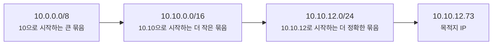
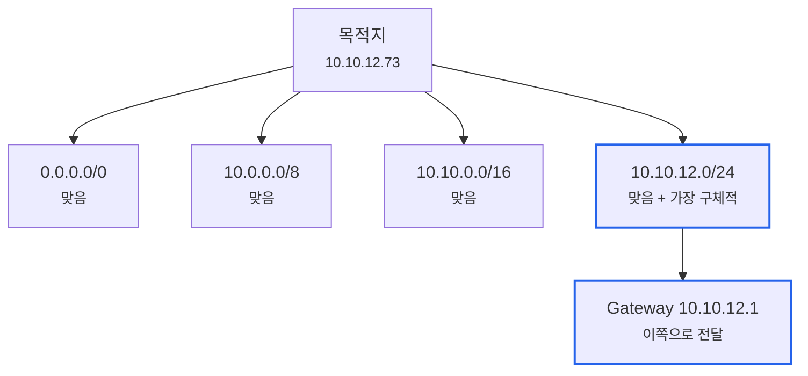
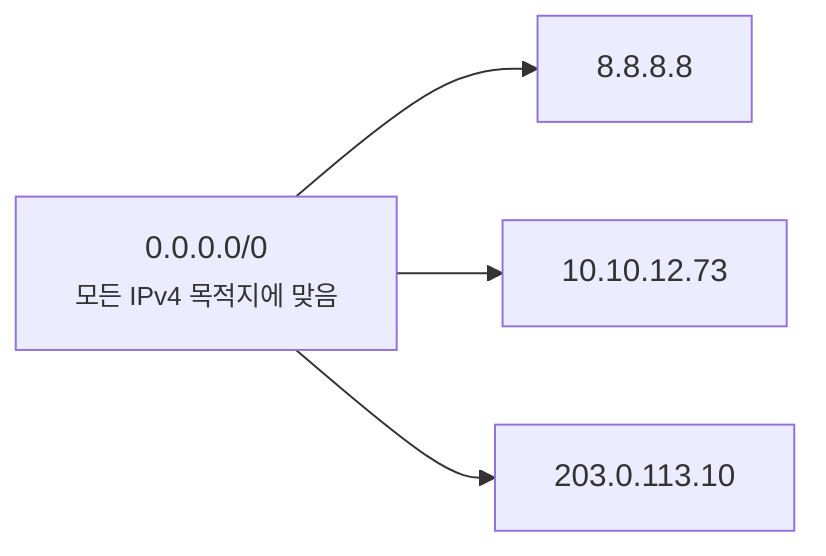
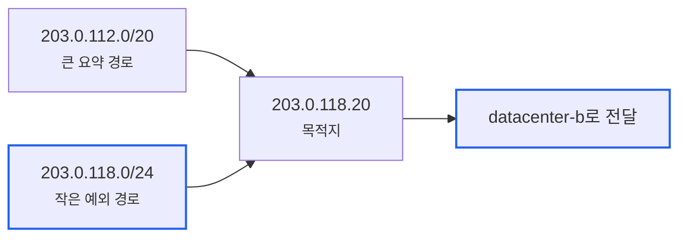
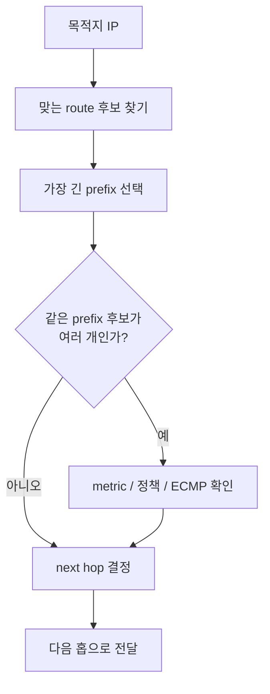

# Longest Prefix Match는 왜 더 구체적인 길을 고를까요?

> 라우팅 테이블에 `10.0.0.0/8`도 있고 `10.10.12.0/24`도 있으면, 둘 다 맞는 것 같죠? **사실 라우터는 더 구체적인 쪽을 먼저 골라요.**

[IP 주소와 라우팅](../basic/02-ip-and-routing.md#routing-basics){ data-preview }에서는 라우터가 패킷의 목적지 IP를 보고 **다음 한 칸**을 고른다고 봤어요.
그리고 [기본 게이트웨이와 첫 번째 도약](../basic/19-default-gateway-and-first-hop.md){ data-preview }에서는 내 기기가 모르는 바깥 길을 기본 게이트웨이에게 맡기는 장면까지 따라갔죠.

근데 실제 라우팅 테이블로 내려오면 질문이 하나 더 생겨요.

- `0.0.0.0/0`도 모든 주소에 맞고,
- `10.0.0.0/8`도 `10.10.12.73`에 맞고,
- `10.10.0.0/16`도 맞고,
- `10.10.12.0/24`도 맞는다면,

라우터는 대체 어느 줄을 고를까요?

오늘은 **Longest Prefix Match가 한마디로 무엇인지**, **CIDR과 기본 경로가 여기서 어떻게 연결되는지**, **라우팅 테이블에서 실제로 어떤 줄이 선택되는지**, 그리고 **metric이나 administrative distance와 헷갈리기 쉬운 지점**까지 같이 볼게요.
IPv4 라우터의 longest match 감각은 [RFC 1812 5.2.4절](https://www.rfc-editor.org/rfc/rfc1812#section-5.2.4)과, CIDR forwarding이 longest-match 기반이라는 점은 [RFC 4632 5.1절](https://www.rfc-editor.org/rfc/rfc4632#section-5.1)을 기준으로 잡을게요.

!!! note "이 글의 범위"
    여기서는 **이미 라우팅 테이블에 올라온 경로들 중 어떤 경로를 써서 전달할지**에 집중해요.
    BGP, OSPF, 정적 라우트가 경로를 어떻게 배워오고 어떤 경로를 테이블에 올리는지는 깊게 들어가지 않을게요.
    즉 오늘은 “경로를 배우는 법”보다 **“목적지 IP 하나를 보고 어떤 줄을 고르는 법”**이 주인공이에요.

---

## 왜 이 규칙을 알아야 할까요?

라우팅 문제를 볼 때 가장 흔한 착각이 있어요.

> *"기본 경로가 있으니까 이 패킷은 무조건 인터넷 쪽으로 나가겠지?"*

근데요, 기본 경로는 정말 **아무것도 더 구체적으로 맞지 않을 때** 쓰는 마지막 선택지예요.
더 구체적인 경로가 있으면 그쪽이 먼저예요.

예를 들어 서버 라우팅 테이블이 이렇게 생겼다고 해볼게요.

```text
Destination        Next hop
0.0.0.0/0          192.168.0.1
10.0.0.0/8         10.1.0.1
10.10.0.0/16       10.10.0.1
10.10.12.0/24      10.10.12.1
```

목적지가 `10.10.12.73`이면 네 줄이 다 맞아요.
하지만 라우터는 가장 구체적인 `10.10.12.0/24`를 골라요.

이 규칙을 모르면 이런 장면에서 길을 잘못 읽기 쉬워요.

- VPN 경로가 기본 인터넷 경로보다 먼저 잡히는 이유
- 특정 사무실 대역만 전용선으로 가고 나머지는 인터넷으로 나가는 이유
- 큰 CIDR 요약 경로가 있어도 작은 예외 경로가 이기는 이유
- `default route`가 있는데도 어떤 목적지만 다른 방향으로 빠지는 이유

즉 이 글은 라우팅 이론을 외우자는 글이 아니에요.
**여러 경로가 동시에 맞을 때, 패킷이 실제로 어느 줄을 타는지 읽는 법**이에요.

---

## Longest Prefix Match는 한마디로 뭐예요?

짧게 잡으면 이래요.

> **Longest Prefix Match는 목적지 IP와 맞는 경로가 여러 개 있을 때, 앞쪽 비트가 가장 많이 일치하는 경로를 고르는 규칙이에요.**

| 기본편에서 잡은 감각 | 비유에서는 | 실제로는 |
|---|---|---|
| 라우터의 다음 한 칸 | 안내 표지판에서 더 정확한 행선지 찾기 | route lookup |
| 기본 게이트웨이 | “나머지는 이쪽” 표지판 | default route `0.0.0.0/0` |
| CIDR prefix | 주소를 어디까지 비교할지 | `/8`, `/16`, `/24` 같은 prefix length |
| 더 긴 prefix | 더 좁고 정확한 주소 범위 | more specific route |
| Longest Prefix Match | 가장 자세한 표지판 우선 | longest matching network prefix 선택 |

비유로 보면 길 안내 표지판이 여러 개 있는 상황이에요.

```text
모든 차량       -> 큰 도로
서울 방향       -> 서울고속도로
강남구 방향     -> 강남 나들목
테헤란로 방향   -> 테헤란로 출구
```

목적지가 테헤란로라면 “모든 차량”도 맞고 “서울 방향”도 맞아요.
하지만 가장 정확한 표지판은 “테헤란로 방향”이죠.
Longest Prefix Match도 이 감각과 비슷해요.

---

## prefix가 길수록 왜 더 구체적일까요?

CIDR에서 `/8`, `/16`, `/24`는 앞에서부터 몇 비트를 네트워크 prefix로 볼지 말해요.
그러니까 prefix가 길다는 건 **목적지 주소와 더 많은 앞자리 비트를 비교한다**는 뜻이에요.



이 그림에서 `10.10.12.73`은 세 prefix에 모두 들어가요.
하지만 `/24`는 `/16`보다 더 좁고, `/16`은 `/8`보다 더 좁아요.
그래서 `/24`가 더 구체적인 길이에요.

표로 보면 더 분명해져요.

| 경로 | 목적지 `10.10.12.73`과 맞나요? | 구체성 |
|---|---|---|
| `0.0.0.0/0` | 맞아요 | 가장 넓음 |
| `10.0.0.0/8` | 맞아요 | 넓음 |
| `10.10.0.0/16` | 맞아요 | 더 좁음 |
| `10.10.12.0/24` | 맞아요 | 가장 좁음 |

결과는 `10.10.12.0/24`예요.
“맞는 경로 중 prefix 길이가 가장 긴 것”을 고른다고 보면 돼요.

---

## 실제 라우팅 테이블에서는 어떻게 고를까요? { #route-selection-example }

이번에는 실제 장면처럼 한 줄씩 읽어볼게요.

```text
Destination        Gateway        Interface
0.0.0.0/0          192.168.0.1    eth0
10.0.0.0/8         10.1.0.1       tun0
10.10.0.0/16       10.10.0.1      tun1
10.10.12.0/24      10.10.12.1     eth1
```

목적지 IP가 `10.10.12.73`이라고 해볼게요.
라우터는 이렇게 생각해요.

1. `0.0.0.0/0`에 맞나요?
   - 맞아요. 모든 IPv4 주소가 여기에 들어가요.
2. `10.0.0.0/8`에 맞나요?
   - 맞아요. 첫 8비트가 `10`이에요.
3. `10.10.0.0/16`에 맞나요?
   - 맞아요. 앞 16비트가 `10.10`이에요.
4. `10.10.12.0/24`에 맞나요?
   - 맞아요. 앞 24비트가 `10.10.12`예요.
5. 그중 prefix가 가장 긴 건?
   - `/24`예요.



이 그림에서 기본 경로 `0.0.0.0/0`도 틀린 건 아니에요.
그냥 너무 넓을 뿐이에요.
더 구체적인 경로가 있으니 밀리는 거예요.

---

## 기본 경로는 왜 `/0`일까요? { #default-route }

`0.0.0.0/0`은 처음 보면 이상해요.
주소도 전부 0이고, prefix 길이도 0이잖아요.

근데 이게 바로 핵심이에요.
`/0`은 **앞에서부터 비교할 비트가 0개**라는 뜻이에요.
그러니까 모든 IPv4 주소가 여기에 맞아요.



이게 기본 게이트웨이 감각과 연결돼요.
내 노트북은 세상 모든 목적지의 자세한 길을 갖고 있지 않아요.
그래서 보통 이런 식의 기본 경로를 가져요.

```text
0.0.0.0/0 via 192.168.0.1
```

사람 말로 하면 이래요.

> **"더 자세히 아는 길이 없으면, 일단 192.168.0.1 게이트웨이에게 맡겨요."**

그러니까 기본 경로는 강한 길이 아니라 **마지막에 남는 넓은 길**이에요.
더 구체적인 `/24`, `/16`, `/8` 경로가 있으면 그쪽이 먼저 선택돼요.

---

## VPN에서는 왜 이 규칙이 자주 보일까요?

Longest Prefix Match는 VPN에서 정말 자주 체감돼요.
예를 들어 회사 VPN에 연결했더니 라우팅 테이블이 이렇게 바뀌었다고 해볼게요.

```text
0.0.0.0/0          via 192.168.0.1     Wi-Fi
10.40.0.0/16       via 10.8.0.1        VPN
10.40.18.0/24      via 10.8.0.9        VPN
```

이제 목적지마다 길이 달라져요.

| 목적지 | 맞는 경로 | 선택되는 경로 |
|---|---|---|
| `8.8.8.8` | `0.0.0.0/0` | Wi-Fi 기본 경로 |
| `10.40.20.5` | `0.0.0.0/0`, `10.40.0.0/16` | VPN `/16` |
| `10.40.18.25` | `0.0.0.0/0`, `10.40.0.0/16`, `10.40.18.0/24` | VPN `/24` |

여기서 중요한 건 VPN이 “모든 인터넷을 무조건 가져간다”가 아니라는 점이에요.
설정에 따라 특정 회사 대역만 더 구체적인 경로로 넣고, 나머지는 기존 Wi-Fi 기본 경로를 그대로 쓰게 할 수 있어요.
이런 방식을 흔히 split tunnel이라고 부르기도 해요.

!!! note "VPN 이름은 여기서 깊게 파지 않을게요"
    여기서는 VPN 자체의 암호화나 터널 구조보다, **VPN이 라우팅 테이블에 더 구체적인 경로를 추가할 수 있다**는 점만 보면 돼요.
    VPN 구조와 캡처 장면은 별도 글에서 다루는 편이 더 자연스러워요.

---

## CIDR 요약 경로와 예외 경로는 같이 살 수 있어요

[A/B/C 클래스 주소 체계와 CIDR 역사 글](./classful-addressing-and-cidr-history.md){ data-preview }에서 CIDR은 여러 경로를 하나로 요약할 수 있다고 했어요.
예를 들어 큰 조직이 바깥에는 이렇게 광고할 수 있어요.

```text
203.0.112.0/20
```

이건 넓은 묶음이에요.
그 안쪽에서는 특정 지점만 다른 길로 보내는 더 구체적인 경로를 둘 수 있어요.

```text
203.0.112.0/20      via backbone-a
203.0.118.0/24      via datacenter-b
```

목적지가 `203.0.118.20`이면 두 줄이 다 맞아요.
하지만 `/24`가 `/20`보다 더 구체적이니까 `datacenter-b` 쪽이 선택돼요.



이 구조 덕분에 인터넷은 큰 길을 단순하게 유지하면서도,
필요한 일부 목적지만 더 정확한 길로 빼낼 수 있어요.

---

## metric은 언제 보는 걸까요?

여기서 자주 헷갈리는 말이 나와요.

- Longest Prefix Match
- metric
- administrative distance
- cost

처음에는 이것들을 한꺼번에 섞지 않는 게 좋아요.
오늘의 핵심은 **패킷을 전달할 때 목적지 IP와 맞는 경로 중 가장 긴 prefix를 고른다**예요.

그럼 metric은 언제 볼까요?
간단히 말하면, **같은 prefix에 대해 여러 후보가 있을 때** 비교하는 값으로 생각하면 좋아요.

예를 들어:

```text
10.10.12.0/24 via 10.1.1.1 metric 100
10.10.12.0/24 via 10.1.1.2 metric 200
```

두 줄은 prefix 길이도 같고, 목적지 범위도 같아요.
그럴 때는 운영체제나 라우터가 metric, 프로토콜 우선순위, 정책 같은 추가 기준으로 하나를 고를 수 있어요.

하지만 아래처럼 prefix 길이가 다르면 이야기가 달라져요.

```text
10.0.0.0/8      via 10.1.1.1 metric 10
10.10.12.0/24   via 10.1.1.2 metric 500
```

목적지가 `10.10.12.73`이라면 `/24`가 더 구체적이에요.
처음 읽을 때는 **metric이 낮아 보여도, 더 구체적인 prefix가 먼저 이긴다**고 잡으면 실수를 줄일 수 있어요.

!!! warning "구현과 정책은 더 복잡할 수 있어요"
    실제 장비는 policy routing, VRF, source-based routing, ECMP 같은 기능을 더 얹을 수 있어요.
    하지만 기본 라우팅 테이블 lookup을 읽는 출발점은 여전히 **어떤 prefix가 목적지와 가장 구체적으로 맞는가**예요.

---

## 실제로는 어떤 순서로 읽으면 좋을까요?

라우팅 테이블을 볼 때는 이 순서를 추천해요.

1. **목적지 IP를 하나 정해요.**
   - 예: `10.10.12.73`
2. **그 IP가 들어갈 수 있는 경로를 모두 표시해요.**
   - `/0`, `/8`, `/16`, `/24`처럼 여러 개가 맞을 수 있어요.
3. **prefix 길이가 가장 긴 경로를 골라요.**
   - `/24`가 `/16`보다 더 구체적이에요.
4. **같은 prefix가 여러 개라면 metric이나 정책을 봐요.**
   - 이건 동점 처리에 가까워요.
5. **선택된 next hop이 로컬에서 닿을 수 있는지도 확인해요.**
   - next hop 자체가 같은 링크에서 ARP 가능한지, 또는 또 다른 경로가 필요한지 봐야 해요.



이 흐름을 잡고 있으면 `ip route`, `route print`, 네트워크 장비의 `show route` 같은 출력도 훨씬 덜 무서워져요.
출력 형식은 달라도 핵심 질문은 같아요.

> **"이 목적지 IP와 가장 길게 맞는 prefix는 어느 줄이지?"**

---

## 여기서 자주 헷갈리는 함정들

### 기본 경로가 항상 이기는 게 아니에요

`0.0.0.0/0`은 모든 목적지에 맞지만, 가장 덜 구체적인 경로예요.
더 구체적인 경로가 하나라도 있으면 그쪽이 먼저 선택돼요.

### 더 큰 주소 범위가 더 강한 경로는 아니에요

`10.0.0.0/8`은 많은 주소를 담지만, `10.10.12.0/24`보다 덜 구체적이에요.
라우터는 “큰 길”이 아니라 **목적지에 더 정확히 맞는 길**을 골라요.

### metric은 prefix 선택을 대신하지 않아요

metric은 중요하지만, 처음부터 모든 경로를 metric만 보고 줄 세우는 게 아니에요.
목적지와 맞는 경로 중 가장 구체적인 prefix를 먼저 보고, 같은 prefix 후보끼리 metric이나 정책을 비교한다고 읽는 편이 안전해요.

### next hop도 실제로 닿을 수 있어야 해요

라우팅 테이블에서 경로가 선택됐다고 끝은 아니에요.
그 next hop으로 실제 프레임을 보낼 수 있어야 해요.
그래서 [기본 게이트웨이와 첫 번째 도약](../basic/19-default-gateway-and-first-hop.md){ data-preview }에서 본 것처럼, 결국 다음 홉의 MAC 주소를 찾는 로컬 전달 감각도 같이 필요해요.

---

## 자, 정리해볼까요?

!!! abstract "오늘 우리가 배운 것"
    - Longest Prefix Match는 목적지 IP와 맞는 여러 경로 중 **prefix 길이가 가장 긴 경로**를 고르는 규칙이에요.
    - `/24`는 `/16`보다, `/16`은 `/8`보다 더 구체적인 경로예요.
    - `0.0.0.0/0` 기본 경로는 모든 목적지에 맞지만, 가장 넓은 마지막 선택지예요.
    - CIDR 요약 경로와 더 작은 예외 경로가 같이 있을 때는, 더 구체적인 예외 경로가 선택돼요.
    - metric이나 정책은 보통 같은 prefix 후보끼리 비교할 때 중요해지고, prefix 길이 판단과 섞어 읽으면 헷갈리기 쉬워요.
    - 선택된 next hop이 실제로 닿을 수 있는지도 함께 확인해야 해요.

이제 라우팅 테이블을 볼 때 `default route가 있네`에서 멈추지 않고,
**목적지와 가장 길게 맞는 줄이 무엇인지** 먼저 찾을 수 있겠죠?

---

## 이어서 보면 좋은 글

- [A/B/C 클래스 주소 체계는 왜 CIDR로 바뀌었을까요?](./classful-addressing-and-cidr-history.md){ data-preview } — CIDR이 주소 낭비와 라우팅 테이블 문제를 어떻게 줄였는지 먼저 보고 오면 좋아요.
- [네트워크 주소, 브로드캐스트 주소, 호스트 범위는 어떻게 나뉠까요?](./network-broadcast-and-host-range.md){ data-preview } — prefix 길이가 실제 주소 범위를 어떻게 자르는지 다시 확인할 수 있어요.
- [기본 게이트웨이와 첫 번째 도약, 패킷이 집을 나서는 순간엔 무슨 일이 벌어질까요?](../basic/19-default-gateway-and-first-hop.md){ data-preview } — 선택된 next hop으로 패킷이 실제로 넘어가는 첫 장면을 이어서 볼 수 있어요.

## 이어서 볼 질문

라우팅 테이블을 읽을 수 있게 되면, 다음에는 이런 운영 질문이 남아요.

> *"라우팅 표는 맞아 보이는데, 실제 패킷은 어디까지 갔는지 어떻게 확인할까요?"*

그 질문은 `ping`, `traceroute`, `tcpdump` 같은 관측 도구를 함께 읽는 쪽으로 이어져요.
