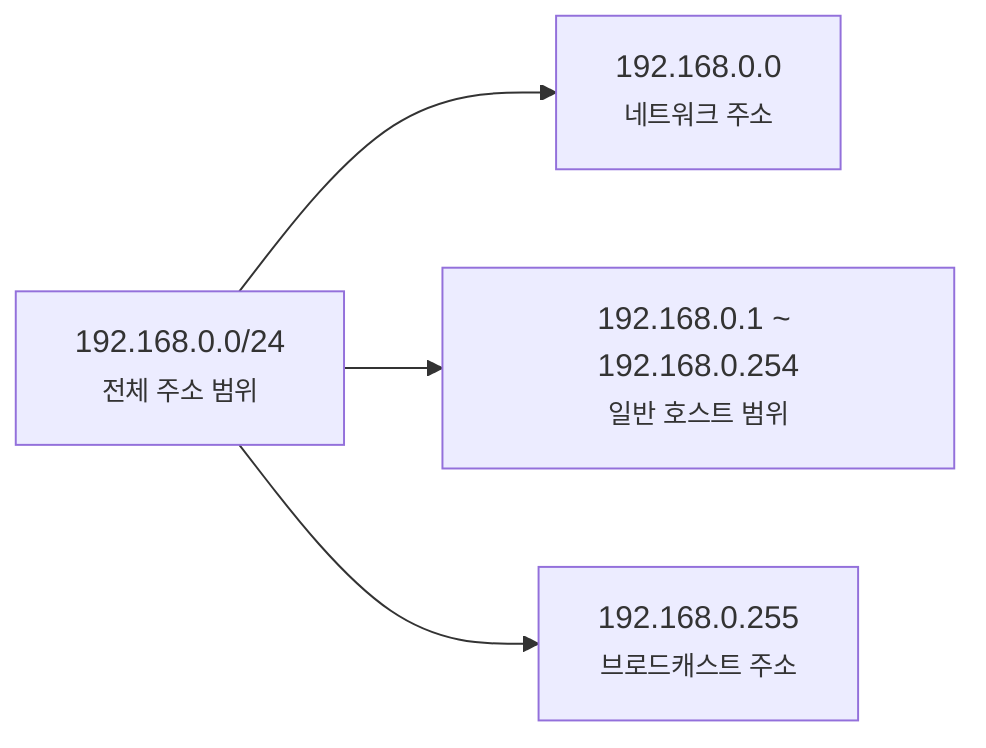
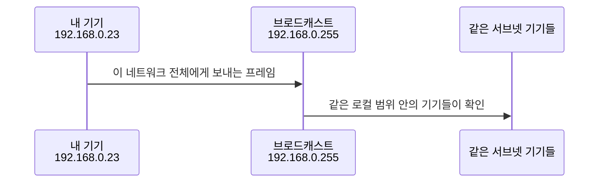
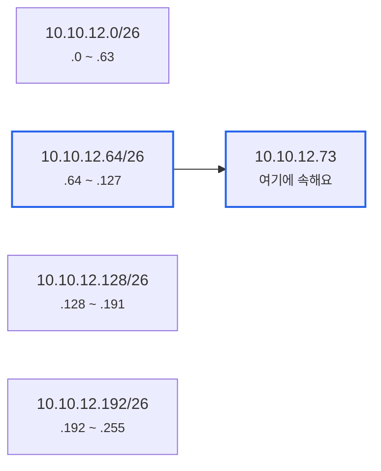
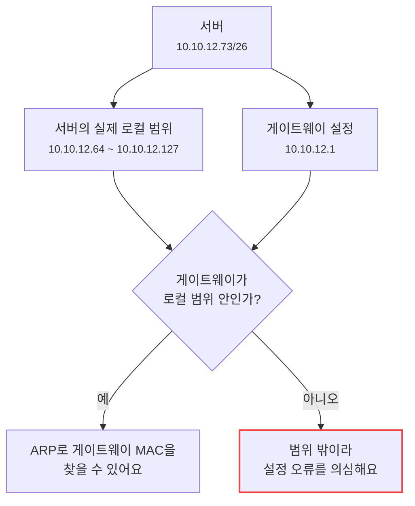

# 네트워크 주소, 브로드캐스트 주소, 호스트 범위는 어떻게 나뉠까요?

> `192.168.0.0/24`에는 주소가 256개나 있어 보이죠? **사실 기기에게 마음대로 줄 수 있는 주소는 보통 그보다 2개 적어요.**

[서브넷 마스크와 CIDR은 실제로 어떻게 계산할까요?](./subnet-mask-and-cidr.md){ data-preview }에서는 `/24`, `/26` 같은 prefix가 **IPv4 주소 32비트의 경계선**이라는 걸 봤어요.
그리고 [ARP와 로컬 전달](../basic/18-arp-and-local-delivery.md#same-subnet-vs-gateway){ data-preview }에서는 같은 네트워크 안이면 상대를 직접 찾고, 아니면 게이트웨이에게 맡긴다는 것도 봤죠.

근데요, 실제 설정 화면으로 내려오면 질문이 더 날카로워져요.

- `192.168.0.0/24`에서 `192.168.0.0`은 왜 보통 기기 주소로 안 쓰나요?
- `192.168.0.255`는 왜 마지막 기기 주소가 아니라 브로드캐스트 주소일까요?
- `/26`이면 `10.10.12.73`이 들어가는 범위는 어디부터 어디까지일까요?
- `usable hosts: 62` 같은 말은 어떻게 계산한 걸까요?

오늘은 **네트워크 주소, 브로드캐스트 주소, 실제 호스트 범위가 한마디로 무엇인지**, **서브넷 계산과 로컬 전달이 여기서 어떻게 이어지는지**, 그리고 **실제 주소 하나를 보고 범위를 빠르게 잘라 읽는 법**을 같이 볼게요.
IPv4 브로드캐스트의 기본 감각은 [RFC 919](https://www.rfc-editor.org/rfc/rfc919)와 [RFC 922](https://www.rfc-editor.org/rfc/rfc922), 서브넷 주소 감각은 [RFC 950](https://www.rfc-editor.org/rfc/rfc950)을 기준으로 가볍게 잡을게요.

!!! note "이 글의 범위"
    여기서는 **일반적인 IPv4 서브넷 범위 계산**에 집중해요.
    IPv6에는 IPv4식 브로드캐스트가 없고, `/31` 점대점 링크처럼 예외적인 IPv4 운영도 있어요.
    그런 예외는 뒤에서 표지판으로만 짚고, 먼저 가장 자주 만나는 `/24`, `/26`, `/27` 감각을 확실히 잡아볼게요.

---

## 왜 이 범위를 직접 읽어야 할까요?

집 공유기만 쓸 때는 보통 `192.168.0.2`부터 `192.168.0.254` 사이에서 주소가 자동으로 나뉘어요.
그래서 네트워크 주소나 브로드캐스트 주소를 몰라도 인터넷은 잘 돼요.

문제는 직접 설정하거나 장애를 볼 때예요.

```text
IP address: 10.10.12.73
Netmask:    255.255.255.192
Gateway:    10.10.12.1
```

이 값을 보면 뭔가 이상하다는 걸 알아차릴 수 있어야 해요.
`255.255.255.192`는 `/26`이고, `10.10.12.73/26`이 속한 네트워크는 `10.10.12.64/26`이에요.
그 범위에서 `10.10.12.1`은 같은 서브넷 밖에 있죠.

즉 이 계산은 시험 문제가 아니에요.
**내 주소, 게이트웨이, DHCP 범위, 방화벽 규칙이 서로 같은 범위를 보고 있는지 확인하는 도구**예요.

---

## 그래서 세 주소는 한마디로 뭐예요?

짧게 잡으면 이래요.

> **하나의 IPv4 서브넷 안에는 그 범위 자체를 가리키는 주소, 모두에게 보내는 주소, 실제 기기에게 줄 주소가 따로 있어요.**

| 기본편에서 잡은 감각 | 비유에서는 | 실제로는 |
|---|---|---|
| 같은 네트워크 | 같은 아파트 단지 | 같은 prefix를 공유하는 IPv4 범위 |
| 네트워크 주소 | 단지 이름표 | 호스트 비트가 모두 `0`인 주소 |
| 브로드캐스트 주소 | 단지 전체 방송 호출 | 호스트 비트가 모두 `1`인 주소 |
| 호스트 주소 | 실제 세대 호수 | 기기에게 줄 수 있는 일반 주소 |
| 기본 게이트웨이 | 단지 밖으로 나가는 문 | 보통 호스트 범위 안의 라우터 주소 |

예를 들어 `192.168.0.0/24`를 보면 이렇게 갈라져요.



이 그림에서 핵심은 단순해요.
처음 주소와 마지막 주소는 보통 특별한 역할을 맡고, 실제 기기 주소는 그 사이에서 고르는 거예요.

---

## 네트워크 주소는 범위의 이름표예요 { #network-address }

네트워크 주소는 **호스트 비트를 모두 `0`으로 만든 주소**예요.
그 범위 안의 특정 기기라기보다, **이 서브넷 전체를 가리키는 대표 이름**에 가까워요.

예를 들어 `192.168.0.23/24`를 볼게요.

```text
IP:      192.168.0.23
Prefix:  /24
```

`/24`는 앞 24비트가 네트워크 부분이라는 뜻이었죠.
그러면 뒤 8비트, 즉 마지막 숫자는 호스트 부분이에요.
그 호스트 부분을 모두 `0`으로 만들면 네트워크 주소가 나와요.

```text
192.168.0.23  -> 호스트 부분을 0으로
192.168.0.0   -> 네트워크 주소
```

비트로 보면 이렇게 읽을 수 있어요.

```text
IP:      11000000.10101000.00000000.00010111
Mask:    11111111.11111111.11111111.00000000
Network: 11000000.10101000.00000000.00000000
```

네트워크 주소는 라우팅 표나 방화벽 규칙에서 자주 보여요.

```text
192.168.0.0/24
10.10.12.64/26
172.16.8.128/27
```

이건 *"저 주소 하나"* 를 말하는 게 아니라,
**그 주소에서 시작하는 묶음 전체**를 말하는 표기예요.

---

## 브로드캐스트 주소는 모두에게 던지는 주소예요 { #broadcast-address }

이번에는 반대로 호스트 비트를 모두 `1`로 만들어볼게요.
그러면 그 서브넷의 브로드캐스트 주소가 나와요.

```text
192.168.0.23/24
호스트 부분을 모두 1로
=> 192.168.0.255
```

브로드캐스트는 같은 IPv4 로컬 네트워크 안의 모두에게 보내는 방식이에요.
예전 기본편에서 ARP Request가 **네트워크 전체에 묻는 질문**처럼 보였죠.
그런 전체 호출 감각이 IPv4 브로드캐스트 주소와 이어져요.



실제로 모든 브로드캐스트가 항상 `192.168.0.255`처럼 보이는 건 아니에요.
어떤 서브넷인지에 따라 마지막 주소가 달라져요.
`10.10.12.64/26`의 브로드캐스트 주소는 `10.10.12.127`이고, `10.10.12.128/26`의 브로드캐스트 주소는 `10.10.12.191`이에요.

!!! warning "브로드캐스트 주소를 기기에게 주면 이상해져요"
    일반적인 IPv4 서브넷에서 마지막 주소를 기기에게 할당하면, 그 주소가 **개별 기기**인지 **전체 호출**인지 의미가 충돌해요.
    그래서 DHCP 범위에서도 보통 네트워크 주소와 브로드캐스트 주소는 빼고 나눠줘요.

---

## 호스트 범위는 둘 사이에 있어요 { #host-range }

이제 실제로 쓸 수 있는 호스트 범위를 계산해볼게요.

```text
192.168.0.0/24
```

`/24`는 호스트 비트가 8개예요.
그러면 주소 개수는 `2^8 = 256`개예요.

| 항목 | 값 |
|---|---|
| 전체 범위 | `192.168.0.0` ~ `192.168.0.255` |
| 네트워크 주소 | `192.168.0.0` |
| 첫 번째 일반 호스트 | `192.168.0.1` |
| 마지막 일반 호스트 | `192.168.0.254` |
| 브로드캐스트 주소 | `192.168.0.255` |
| 일반 호스트 개수 | `254` |

계산식은 보통 이렇게 잡아요.

```text
전체 주소 개수 = 2^(호스트 비트 수)
일반 호스트 개수 = 전체 주소 개수 - 2
```

그래서 `/24`는 `256 - 2 = 254`개예요.
`- 2`는 네트워크 주소와 브로드캐스트 주소를 빼는 감각이에요.

!!! note "`/31`과 `/32`는 예외로 봐요"
    일반적인 LAN 서브넷에서는 `- 2` 감각이 잘 맞아요.
    다만 점대점 링크에서는 [RFC 3021](https://www.rfc-editor.org/rfc/rfc3021)처럼 `/31`의 두 주소를 모두 쓰는 방식이 있고, `/32`는 단일 호스트 하나를 가리키는 경로로 자주 써요.
    처음에는 예외보다 **보통의 LAN에서는 처음과 끝을 빼고 본다**는 감각을 먼저 잡으면 돼요.

---

## `/26` 범위는 어디서 끊길까요?

이제 조금 더 현실적인 예시를 볼게요.

```text
10.10.12.73/26
```

`/26`은 호스트 비트가 `32 - 26 = 6`개예요.
그러면 한 서브넷의 주소 개수는 `2^6 = 64`개예요.

마지막 숫자 기준으로 보면 `/26`은 64개씩 끊겨요.

```text
10.10.12.0   ~ 10.10.12.63
10.10.12.64  ~ 10.10.12.127
10.10.12.128 ~ 10.10.12.191
10.10.12.192 ~ 10.10.12.255
```

`73`은 `64 ~ 127` 사이에 들어가죠.
그래서 결과는 이렇게 돼요.

| 항목 | 값 |
|---|---|
| IP / prefix | `10.10.12.73/26` |
| 전체 범위 | `10.10.12.64` ~ `10.10.12.127` |
| 네트워크 주소 | `10.10.12.64` |
| 첫 번째 일반 호스트 | `10.10.12.65` |
| 마지막 일반 호스트 | `10.10.12.126` |
| 브로드캐스트 주소 | `10.10.12.127` |
| 일반 호스트 개수 | `62` |



이 그림에서 중요한 건 `10.10.12.73`의 앞 세 칸이 같다는 사실이 아니에요.
`/26` 기준으로 마지막 칸이 **64개 단위로 잘린다**는 점이에요.

---

## 실제 설정에서는 어떤 실수가 자주 날까요?

이번에는 장애처럼 읽어볼게요.

```text
서버 IP:     10.10.12.73/26
게이트웨이:  10.10.12.1
```

겉으로는 `10.10.12.x`라서 같은 네트워크처럼 보일 수 있어요.
하지만 방금 계산했듯이 `10.10.12.73/26`의 실제 범위는:

```text
10.10.12.64 ~ 10.10.12.127
```

그 안에서 일반 호스트 범위는:

```text
10.10.12.65 ~ 10.10.12.126
```

`10.10.12.1`은 이 범위 밖이에요.
그러면 서버 입장에서는 게이트웨이를 같은 로컬 네트워크 안의 이웃으로 찾기 어렵고, ARP도 자연스럽게 이어지지 않아요.



이런 장면에서 `ping 8.8.8.8`이 안 된다고 해서 바로 DNS나 방화벽을 의심하면 멀리 돌아갈 수 있어요.
먼저 **내 IP, prefix, 게이트웨이가 같은 호스트 범위 안에서 말이 되는지** 보는 게 좋아요.

---

## DHCP 범위도 같은 기준으로 읽어요

공유기나 DHCP 서버 설정에는 이런 값이 자주 나와요.

```text
LAN network: 192.168.0.0/24
Gateway:     192.168.0.1
DHCP range:  192.168.0.100 ~ 192.168.0.200
```

이제 이 설정은 이렇게 읽을 수 있어요.

| 설정 | 읽는 법 |
|---|---|
| `192.168.0.0/24` | 이 LAN의 전체 범위는 `.0 ~ .255`예요 |
| `192.168.0.1` | 게이트웨이는 일반 호스트 범위 안에 있어요 |
| `.100 ~ .200` | DHCP가 자동으로 나눠줄 일부 구간이에요 |
| `.0`, `.255` | 일반 기기에게 주지 않는 특별 주소예요 |

DHCP 범위가 반드시 전체 호스트 범위를 다 써야 하는 건 아니에요.
오히려 일부를 비워두는 경우가 흔해요.

- 게이트웨이는 `.1`에 고정
- 프린터나 NAS는 `.10 ~ .30` 같은 낮은 구간에 수동 고정
- 일반 노트북과 휴대폰은 `.100 ~ .200`에서 자동 할당

여기서 중요한 건 DHCP 범위가 **네트워크 주소와 브로드캐스트 주소를 침범하지 않아야 하고**, 같은 서브넷의 일반 호스트 범위 안에 있어야 한다는 점이에요.

---

## 빠르게 계산하는 순서는 이렇게 잡으면 돼요

매번 비트를 길게 쓰기 어렵다면 이 순서로 보면 좋아요.

1. **prefix에서 호스트 비트 수를 구해요.**
   - `/26`이면 `32 - 26 = 6`
2. **한 블록의 주소 개수를 구해요.**
   - `2^6 = 64`
3. **주소가 어느 블록에 들어가는지 찾아요.**
   - 마지막 숫자가 `73`이면 `64 ~ 127`
4. **블록의 첫 주소를 네트워크 주소로 봐요.**
   - `10.10.12.64`
5. **블록의 마지막 주소를 브로드캐스트 주소로 봐요.**
   - `10.10.12.127`
6. **그 사이를 일반 호스트 범위로 봐요.**
   - `10.10.12.65 ~ 10.10.12.126`

자주 보는 prefix는 이렇게 감을 잡아두면 빨라요.

| CIDR | 블록 크기 | 일반 호스트 개수 | 마지막 칸 시작점 감각 |
|---|---:|---:|---|
| `/24` | 256 | 254 | `0` |
| `/25` | 128 | 126 | `0`, `128` |
| `/26` | 64 | 62 | `0`, `64`, `128`, `192` |
| `/27` | 32 | 30 | `0`, `32`, `64`, `96`, ... |
| `/28` | 16 | 14 | `0`, `16`, `32`, `48`, ... |
| `/29` | 8 | 6 | `0`, `8`, `16`, `24`, ... |
| `/30` | 4 | 2 | `0`, `4`, `8`, `12`, ... |

이 표를 외우라는 뜻은 아니에요.
다만 `/26`을 보면 **64개씩**, `/27`을 보면 **32개씩**, `/28`을 보면 **16개씩** 끊긴다는 감각이 생기면 실제 설정을 훨씬 빨리 읽을 수 있어요.

---

## 여기서 자주 헷갈리는 함정들

### 앞 세 숫자가 같다고 항상 같은 네트워크는 아니에요

`10.10.12.73`과 `10.10.12.1`은 앞 세 숫자가 같아요.
하지만 `/26` 기준에서는 서로 다른 범위일 수 있어요.
반드시 prefix와 함께 읽어야 해요.

### 주소 개수와 호스트 개수는 달라요

`/26`은 주소가 64개예요.
하지만 일반적인 LAN에서는 네트워크 주소와 브로드캐스트 주소를 빼서 호스트는 62개로 봐요.
`64개 주소`와 `62개 호스트`를 섞으면 DHCP 범위를 잘못 잡기 쉬워요.

### 브로드캐스트 주소는 항상 `.255`가 아니에요

`192.168.0.0/24`에서는 `192.168.0.255`가 브로드캐스트 주소예요.
하지만 `10.10.12.64/26`에서는 `10.10.12.127`이에요.
마지막 주소는 **그 서브넷 범위의 마지막 주소**이지, 늘 `.255`가 아니에요.

### 게이트웨이는 보통 같은 호스트 범위 안에 있어야 해요

기기가 외부로 나가려면 먼저 게이트웨이의 MAC 주소를 알아내야 해요.
그러려면 게이트웨이 IP가 내 로컬 서브넷 안에 있는 이웃처럼 보여야 하죠.
게이트웨이가 범위 밖이라면 IP, prefix, VLAN, 라우팅 설정을 먼저 의심해볼 만해요.

---

## 자, 정리해볼까요?

!!! abstract "오늘 우리가 배운 것"
    - **네트워크 주소**는 호스트 비트를 모두 `0`으로 만든, 서브넷 전체의 대표 주소예요.
    - **브로드캐스트 주소**는 호스트 비트를 모두 `1`로 만든, 같은 IPv4 서브넷 전체 호출 주소예요.
    - 일반적인 IPv4 LAN에서는 처음 주소와 마지막 주소를 빼고, 그 사이를 **호스트 범위**로 봐요.
    - `/26`은 64개 단위, `/27`은 32개 단위처럼 prefix에 따라 블록 크기가 달라져요.
    - 게이트웨이와 DHCP 범위도 이 호스트 범위 안에서 말이 되는지 같이 확인해야 해요.

이제 `192.168.0.0/24`가 단순히 주소 하나가 아니라, **시작점과 끝점과 실제 기기 구간을 가진 범위**로 보이죠?

---

## 이어서 보면 좋은 글

- [서브넷 마스크와 CIDR은 실제로 어떻게 계산할까요?](./subnet-mask-and-cidr.md){ data-preview } — `/24`와 `255.255.255.0`이 같은 말인 이유를 비트 단위로 먼저 잡고 싶다면 여기로 돌아가면 좋아요.
- [ARP와 로컬 전달, 주소는 알겠는데 진짜 목적지는 어떻게 찾을까요?](../basic/18-arp-and-local-delivery.md#same-subnet-vs-gateway){ data-preview } — 같은 서브넷 판단이 실제 MAC 주소 찾기로 어떻게 이어지는지 볼 수 있어요.
- [기본 게이트웨이와 첫 번째 도약, 인터넷으로 나가는 첫 문은 누구일까요?](../basic/19-default-gateway-and-first-hop.md){ data-preview } — 다른 네트워크로 나갈 때 왜 게이트웨이부터 찾아야 하는지 이어서 보면 좋아요.

## 이어서 볼 질문

주소 범위를 읽을 수 있게 되면, 다음에는 이런 질문이 남아요.

> *"예전에는 A/B/C 클래스라고 나눴다는데, 왜 지금은 `/24`, `/20`, `/16` 같은 CIDR로 말할까요?"*

그 질문은 IP 주소 체계가 어떻게 커지고 쪼개졌는지 보는 길로 이어져요.
