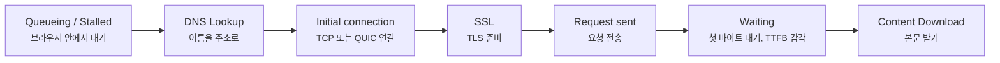
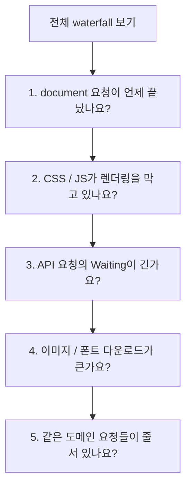
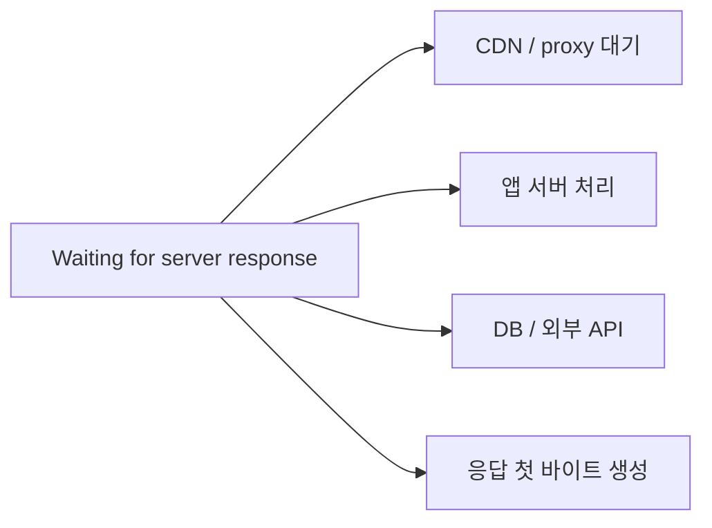

# 브라우저 waterfall은 어디부터 읽어야 할까요?

> 막대가 길다고 전부 서버가 느린 건 아니에요. **브라우저 waterfall은 기다린 이유를 여러 색의 구간으로 나눠 보여줘요.**

[End-to-End Request Debugging](../basic/26-end-to-end-request-debugging.md){ data-preview }에서는 느린 요청 하나를 DNS, 연결, TLS, 프록시, 캐시, 오리진 같은 체크포인트로 나눠 읽는 큰 그림을 봤어요. 그리고 바로 앞 글인 [curl verbose와 timing은 어디부터 읽어야 할까요?](./curl-verbose-and-timing.md){ data-preview }에서는 터미널에서 요청 하나를 숫자로 쪼개 읽는 방법을 봤죠.

근데요, 실제 웹페이지가 느릴 때는 요청 하나만 느린 게 아닐 수 있어요.

- HTML은 늦게 왔는지
- CSS나 JavaScript가 줄을 세웠는지
- 이미지 다운로드가 오래 걸렸는지
- API 응답의 첫 바이트가 늦었는지
- 캐시에서 끝난 요청과 네트워크로 나간 요청이 섞였는지

이걸 한눈에 보려고 여는 화면이 브라우저 개발자 도구의 Network waterfall이에요. Chrome DevTools 공식 문서도 Network 패널을 요청 목록과 각 요청의 activity breakdown을 보는 도구로 설명하고, Waterfall 열이 요청별 활동을 시각적으로 쪼개 보여준다고 안내해요. 이 글에서는 [Chrome DevTools Network features reference](https://developer.chrome.com/docs/devtools/network/reference)를 기준으로, 초심자가 어디부터 보면 덜 헤매는지에 집중할게요.

!!! note "이 글의 범위"
    여기서는 Chrome DevTools의 Network waterfall 감각을 기준으로 설명해요. 브라우저마다 이름과 UI는 조금 다를 수 있어요. 오늘 목표는 *"막대가 길다"* 에서 멈추지 않고, **어느 구간이 길어서 느린지**를 나눠 읽는 거예요.

---

## waterfall은 요청들이 겹쳐 흐르는 시간표예요

브라우저 Network 탭을 열고 새로고침하면 요청들이 줄줄이 쌓여요. 각 행은 보통 하나의 리소스예요.

```text
Name                 Status   Type        Protocol   Size      Time
document             200      document    h2         18 KB     420 ms
app.css              200      stylesheet  h2         42 KB     80 ms
app.js               200      script      h2         210 KB    310 ms
hero.webp            200      image       h2         620 KB    920 ms
/api/products        200      fetch       h2         9 KB      740 ms
```

그리고 오른쪽 Waterfall 열에는 각 요청이 언제 시작했고, 언제 기다렸고, 언제 다운로드했는지가 막대로 보여요.

```text
0 ms        250 ms       500 ms       750 ms       1000 ms
|-----------|------------|------------|------------|
document    [DNS][TCP][SSL][ Waiting ][Down]
app.css                         [Wait][Down]
app.js                          [ Waiting ][Download]
hero.webp                       [Wait][====== Download ======]
/api/products                         [        Waiting       ][D]
```

이 예시는 실제 화면 캡처가 아니라, 읽는 순서를 보여주기 위한 단순화된 텍스트예요. 핵심은 요청 하나가 혼자 있는 게 아니라 **여러 요청이 시간축 위에서 겹쳐 보인다**는 점이에요.

## 주문 처리판처럼 보면 덜 헷갈려요

식당 주방에 주문 처리판이 있다고 해볼게요. 주문마다 접수 시간, 조리 시작, 대기, 포장, 배달 완료 시간이 달라요. 어떤 주문은 접수는 빨랐는데 조리가 오래 걸리고, 어떤 주문은 조리는 빨랐는데 배달이 오래 걸리죠.

waterfall도 비슷해요.

| 주문 처리판에서는 | 브라우저 waterfall에서는 |
|---|---|
| 주문 행 하나 | 요청 행 하나 |
| 주문이 들어온 시각 | request start |
| 재료 찾기 | DNS Lookup |
| 주방과 연결 | Initial connection |
| 신원/결제 확인 | SSL / TLS |
| 주방이 요리하는 시간 | Waiting for server response |
| 포장해서 가져오는 시간 | Content Download |
| 주문을 누가 넣었는지 | Initiator |
| 어떤 창구로 처리했는지 | Protocol / Remote address |

그래서 waterfall을 볼 때 첫 질문은 이거예요.

> *"이 막대는 어디가 길어서 긴 걸까요?"*

Time 열의 전체 시간만 보면 `920 ms`처럼 한 숫자예요. 하지만 waterfall과 Timing 탭을 열면 그 안이 여러 구간으로 갈라져요.

---

## 요청 하나의 Timing 구간을 먼저 읽어요

요청 하나를 클릭하면 Timing 탭에서 더 자세한 구간을 볼 수 있어요. 흔히 이런 이름들이 보여요.

```text
Queueing                     12 ms
Stalled                       3 ms
DNS Lookup                   28 ms
Initial connection           42 ms
SSL                          61 ms
Request sent                  1 ms
Waiting for server response 310 ms
Content Download             45 ms
```

처음에는 이 표를 아래 순서로 읽으면 좋아요.



Chrome DevTools 문서에서 Requests table의 `Time`은 요청 시작부터 최종 바이트 수신까지의 전체 duration이고, Waterfall은 각 요청 activity를 시각적으로 나눠 보여주는 열이에요. 그러니까 Time 숫자를 보고 끝내지 말고, Timing 구간으로 내려가야 원인을 좁힐 수 있어요.

| Timing 구간 | 먼저 떠올릴 질문 |
|---|---|
| `Queueing` / `Stalled` | 브라우저가 아직 요청을 내보내지 못하고 있나요? |
| `DNS Lookup` | 이름 해석이 느린가요? |
| `Initial connection` | 연결을 여는 데 오래 걸리나요? |
| `SSL` | TLS 준비나 인증서 확인이 오래 걸리나요? |
| `Request sent` | 업로드할 요청 본문이 큰가요? |
| `Waiting for server response` | 서버나 앞단이 첫 바이트를 늦게 주나요? |
| `Content Download` | 응답 본문이 크거나 네트워크가 느린가요? |

!!! tip "처음엔 긴 구간 하나만 찾으세요"
    모든 요청의 모든 구간을 한 번에 해석하려고 하면 금방 지쳐요. 먼저 **가장 긴 요청**, 그 안에서 **가장 긴 Timing 구간** 하나를 찾는 게 좋아요.

## curl timing과 나란히 놓으면 감이 살아나요

앞 글에서 본 `curl --write-out` 값과 브라우저 waterfall은 완전히 같은 도구는 아니지만, 큰 체크포인트 감각은 비슷해요.

| curl timing | 브라우저 waterfall / Timing |
|---|---|
| `time_namelookup` | `DNS Lookup` |
| `time_connect` | `Initial connection` |
| `time_appconnect` | `SSL` / TLS 완료 시점 |
| `time_starttransfer` | `Waiting for server response`가 끝나는 시점, TTFB 감각 |
| `time_total` | `Time` 전체 duration |

차이도 있어요. 브라우저는 캐시, Service Worker, 우선순위, 렌더링 영향, 연결 재사용, HTTP/2/3 멀티플렉싱 같은 조건을 갖고 있어요. 그래서 curl에서 빠른 요청이 브라우저에서도 똑같이 빠르다고 단정하면 안 돼요. 대신 두 도구를 같이 보면 **브라우저 안에서 생긴 대기인지, 네트워크나 서버 쪽 대기인지**를 더 잘 나눌 수 있어요.

---

## 전체 waterfall은 행보다 흐름을 먼저 봐요

요청 하나의 Timing을 읽었다면, 이제 전체 waterfall을 봐야 해요. 웹페이지는 요청 하나가 아니라 여러 요청의 묶음이니까요.



### 1. document 요청을 먼저 봐요

처음 HTML 문서가 늦으면 뒤쪽 CSS, JavaScript, 이미지 발견도 늦어질 수 있어요. 그래서 페이지 전체가 느릴 때는 먼저 `document` 타입의 첫 요청을 봐요.

여기서 `Waiting for server response`가 길면 서버, CDN cache miss, 프록시 대기, 오리진 처리 같은 쪽으로 의심이 옮겨가요. 반대로 `Content Download`가 길면 HTML 자체가 크거나 네트워크 다운로드가 느린 쪽을 봐야 해요.

### 2. CSS와 JavaScript의 위치를 봐요

CSS와 JavaScript는 화면 표시와 실행 순서에 큰 영향을 줄 수 있어요. Network 패널의 `Initiator`, `Type`, `Priority`, `Render-blocking` 같은 열을 켜면 어떤 리소스가 어떤 이유로 중요하게 다뤄졌는지 더 잘 볼 수 있어요.

Chrome DevTools 문서 기준으로 Requests table에는 `Initiator`, `Protocol`, `Priority`, `Render-blocking`, `Remote address` 같은 열을 추가할 수 있어요. 특히 `Initiator`는 누가 이 요청을 시작했는지 보는 데 도움이 돼요.

### 3. API 요청은 Waiting과 Status를 같이 봐요

`fetch`나 `xhr` 요청이 길면 대개 `Waiting for server response`와 `Status`를 같이 봐요.

- `Waiting`이 길고 `200`이면 서버가 늦게 계산했을 수 있어요.
- `Waiting` 뒤에 `502`, `503`, `504`가 오면 프록시와 오리진 경계가 의심돼요.
- 짧게 실패하면 CORS, 인증, 네트워크 차단 같은 다른 문제일 수 있어요.

### 4. 이미지와 폰트는 다운로드 구간을 봐요

이미지, 영상, 폰트는 `Content Download`가 길 수 있어요. 이때는 서버 처리보다 파일 크기, 압축, 포맷, CDN 위치, 네트워크 속도를 봐야 해요. Size 열도 같이 봐요. DevTools는 네트워크로 받은 크기와 압축 해제 뒤 크기를 구분해서 볼 수 있는 옵션도 제공해요.

### 5. 줄 서 있는 요청이 많은지 봐요

여러 요청이 비슷한 시점에 시작했는데 막대 앞쪽이 길게 비어 있거나 `Queueing` / `Stalled`가 길면, 브라우저 내부 우선순위, 연결 슬롯, 캐시 접근, Service Worker, 프록시 같은 대기 가능성을 봐요.

!!! warning "`Stalled`가 항상 서버 문제는 아니에요"
    `Stalled`나 `Queueing`은 요청이 서버에서 오래 처리됐다는 뜻이 아닐 수 있어요. 브라우저가 아직 요청을 내보내기 전이거나, 연결 재사용/우선순위/캐시/프록시 조건 때문에 기다리는 장면일 수 있어요.

## Protocol 열은 `h1`, `h2`, `h3` 감각을 붙여줘요

Network 탭에서 `Protocol` 열을 켜면 요청이 `http/1.1`, `h2`, `h3` 중 무엇으로 갔는지 볼 수 있어요.

| Protocol | 읽는 감각 |
|---|---|
| `http/1.1` | 연결 재사용과 요청 줄서기 감각을 같이 봐요 |
| `h2` | 한 TCP 연결 안에서 여러 스트림이 섞일 수 있어요 |
| `h3` | QUIC 위에서 HTTP/3 요청이 오갔다는 단서예요 |
| `(from disk cache)` / `(from memory cache)` | 네트워크 요청이 아닐 수 있어요 |

[HTTP/2 프레임 글](./http2-frames-and-multiplexing.md){ data-preview }과 [HTTP/3 프레임 글](./http3-and-quic-frames.md){ data-preview }을 읽어두면 이 열이 단순한 버전 표시가 아니라 **요청들이 어떤 방식으로 동시에 흐를 수 있는지**를 알려주는 단서로 보여요.

## Disable cache와 Preserve log는 실험 조건이에요

DevTools에서 `Disable cache`를 켜면 DevTools가 열린 동안 브라우저 캐시를 끄고 첫 방문자에 가까운 조건으로 볼 수 있어요. Chrome 문서도 이 기능을 first-time visitor 경험을 흉내내는 방법으로 설명해요.

반대로 로그인 이후 이동, 리다이렉트, 페이지 전환을 따라가야 한다면 `Preserve log`를 켜야 이전 요청이 사라지지 않아요.

| 설정 | 언제 켜나요? | 조심할 점 |
|---|---|---|
| `Disable cache` | 캐시 영향 없이 네트워크를 다시 보고 싶을 때 | 실제 반복 방문자보다 느리게 보일 수 있어요 |
| `Preserve log` | 리다이렉트나 페이지 이동 전후 요청을 이어 볼 때 | 로그가 많아져서 필터링이 필요해요 |
| Throttling | 느린 네트워크 조건을 재현할 때 | 실제 사용자 전체 조건으로 일반화하면 안 돼요 |

설정은 결과를 바꾸는 실험 조건이에요. 그래서 waterfall을 공유하거나 비교할 때는 **캐시를 껐는지, throttling을 켰는지, 로그인 쿠키가 있었는지**를 같이 적어야 해요.

---

## 증상별로 먼저 볼 곳을 나눠볼게요

| 증상 | 먼저 볼 곳 | 다음 의심 |
|---|---|---|
| 첫 화면이 늦게 뜸 | 첫 `document`의 `Waiting`, `Content Download` | 서버 처리, CDN miss, HTML 크기 |
| 특정 API만 느림 | 해당 `fetch`/`xhr`의 `Waiting`, `Status`, response headers | 오리진 처리, DB, upstream API |
| 이미지가 늦게 채워짐 | 이미지 요청의 `Content Download`, `Size` | 파일 크기, 포맷, CDN, lazy loading |
| 요청이 시작 자체를 늦게 함 | `Queueing`, `Stalled`, `Initiator`, `Priority` | 브라우저 우선순위, 연결 제한, Service Worker |
| 같은 요청이 어떤 때만 느림 | `Protocol`, `Remote address`, cache headers | 엣지 위치, 캐시 상태, 서버 묶음 차이 |
| 브라우저만 느리고 curl은 빠름 | 쿠키, 캐시, Service Worker, Initiator, Priority | 브라우저 조건 차이 |

이 표는 정답지가 아니라 출발점이에요. waterfall은 "원인 확정" 도구라기보다 **다음에 어디를 봐야 하는지 좁히는 도구**에 가까워요.

## Server-Timing 헤더가 있으면 안쪽 힌트를 더 볼 수 있어요

브라우저 waterfall에서 가장 답답한 부분은 `Waiting for server response`예요. 이 구간은 브라우저 입장에서는 그냥 "첫 바이트를 기다림"이에요. 그 안에서 CDN이 기다렸는지, 앱 서버가 렌더링했는지, DB가 느렸는지는 기본적으로 밖에서 잘 안 보여요.

이때 서버가 `Server-Timing` 헤더를 보내면 브라우저가 내부 단계 힌트를 표시할 수 있어요.

```http
Server-Timing: cdn-cache;desc="MISS", db;dur=83, app;dur=120
```

이런 헤더가 있으면 `Waiting`이라는 큰 상자 안을 조금 더 나눠 볼 수 있어요. 없으면 waterfall만으로는 서버 내부 원인을 단정하지 말고, 서버 로그나 tracing, request id와 이어서 봐야 해요.



브라우저는 첫 바이트가 늦었다는 사실을 잘 보여주지만, 첫 바이트가 왜 늦었는지는 서비스 내부 관측과 연결해야 더 정확해져요.

## 잘못 읽기 쉬운 함정

### Waterfall 막대가 길면 무조건 서버가 느리다고 보기

막대 전체에는 queueing, DNS, connection, TLS, waiting, download가 모두 섞일 수 있어요. 서버 처리를 보려면 먼저 `Waiting for server response` 구간을 따로 봐야 해요.

### `Waiting`을 서버 코드 실행 시간과 동일하게 보기

`Waiting`은 브라우저가 첫 바이트를 기다린 시간이에요. CDN, 프록시, 캐시 miss, 오리진 큐, 서버 처리, 외부 API 대기가 섞일 수 있어요. 서버 코드만의 시간으로 단정하면 안 돼요.

### 캐시를 끈 결과와 켠 결과를 섞어 비교하기

`Disable cache`를 켜면 첫 방문자 조건에 가까워져요. 반복 방문자에서 캐시가 작동하는 상황과는 결과가 달라요. 비교할 때는 캐시 조건을 맞춰야 해요.

### Status `200`이면 문제가 없다고 보기

`200`은 응답이 성공했다는 뜻이지 빠르다는 뜻이 아니에요. `200`인데 `Waiting`이 3초일 수도 있고, `Content Download`가 너무 길 수도 있어요.

### 한 리소스만 보고 페이지 전체 원인을 확정하기

페이지 체감 속도는 HTML, CSS, JS, 이미지, 폰트, API 요청이 서로 영향을 주며 만들어져요. 가장 긴 요청 하나가 항상 사용자가 느낀 병목이라고 단정하면 안 돼요.

## 자, 정리해볼까요?

!!! abstract "오늘 우리가 배운 것"
    - 브라우저 waterfall은 여러 요청이 시간축 위에서 어떻게 겹쳐 흐르는지 보여줘요.
    - 요청 하나는 `Queueing`, `DNS Lookup`, `Initial connection`, `SSL`, `Waiting`, `Content Download`로 나눠 읽을 수 있어요.
    - 전체 페이지를 볼 때는 첫 document, CSS/JS, API, 이미지/폰트, 줄서기 여부를 순서대로 보면 좋아요.
    - `Protocol`, `Initiator`, `Priority`, `Remote address`, cache 관련 표시를 켜면 해석 단서가 늘어나요.
    - waterfall은 원인 확정 도구가 아니라, 다음에 볼 곳을 좁히는 지도에 가까워요.

## 이어서 보면 좋은 글

- [curl verbose와 timing은 어디부터 읽어야 할까요?](./curl-verbose-and-timing.md){ data-preview } — 브라우저 waterfall의 Timing 구간을 터미널 숫자와 나란히 비교해볼 수 있어요.
- [End-to-End Request Debugging - 느린 요청은 어디서 막히고 있을까요?](../basic/26-end-to-end-request-debugging.md){ data-preview } — waterfall에서 찾은 긴 구간을 전체 요청 체크포인트 지도에 올려볼 수 있어요.
- [HTTP/3는 QUIC 위에서 프레임을 어떻게 나눌까요?](./http3-and-quic-frames.md){ data-preview } — `Protocol` 열의 `h3`가 어떤 전송 구조를 뜻하는지 이어서 볼 수 있어요.
