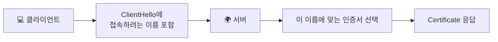
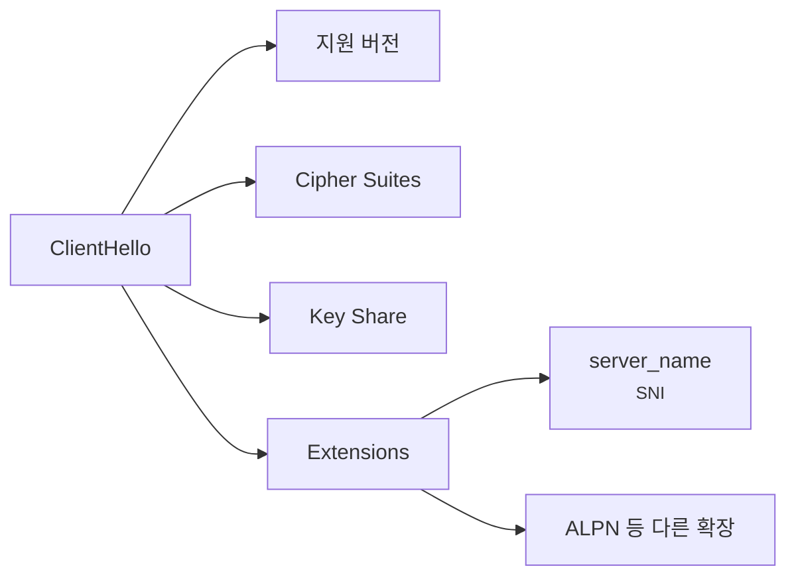
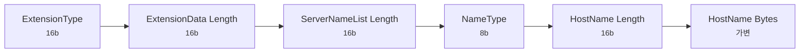
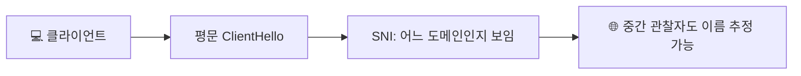
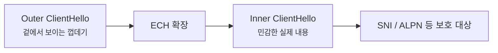

# SNI, ESNI, ECH는 뭐가 다를까요?

> HTTPS면 목적지 이름까지 다 감춰질 것 같죠? **사실은 한동안은 어느 도메인에 가는지 꽤 이른 단계에서 드러났어요.**

[TLS, SSL, 인증서는 뭐가 다를까요?](../basic/07-tls-ssl-and-certificates.md#browser-verification-flow){ data-preview }에서는 브라우저가 **상대가 진짜인지 확인하고 보호된 통로를 준비한다**는 큰 그림을 먼저 봤어요. 그리고 바로 앞 글인 [TLS 인증서 체인과 신뢰 오류는 어떻게 읽어야 할까요?](./tls-cert-chain-and-trust-errors.md#trust-errors){ data-preview }에서는 **인증서 이름이 안 맞거나 체인이 끊기면 어디서 멈추는지**도 봤죠.

근데 여기서 자연스럽게 또 궁금해져요.

> *"좋아요, 이름 확인이 중요하다는 건 알겠어요. 근데 서버는 인증서를 고르기 전부터 그 이름을 어떻게 알고, 왜 그 이름이 프라이버시 이슈가 되죠?"*

근데 이 글이 중요한 이유는, HTTPS를 쓴다고 해서 **어느 사이트에 가는지까지 자동으로 다 숨겨지는 건 아니었기 때문**이에요.

- 서버는 인증서를 고르기 전에 **이름 힌트**가 필요했고
- 그 힌트가 한동안은 **평문으로 먼저 보였고**
- 그래서 `ESNI` 같은 과도기 아이디어를 거쳐 **ECH** 까지 오게 됐어요

오늘은 **SNI가 왜 필요했는지**, **평문 SNI가 무엇을 노출하는지**, 그리고 **왜 ESNI가 ECH로 바뀌었는지**를 ClientHello 구조 위에서 같이 해부해볼게요. 기본 축은 [RFC 6066의 `server_name` 확장](https://www.rfc-editor.org/rfc/rfc6066)과 [RFC 9849의 ECH](https://www.rfc-editor.org/rfc/rfc9849), 그리고 *왜 SNI만 숨겨서는 부족했는지*를 설명하는 [RFC 8744](https://www.rfc-editor.org/rfc/rfc8744) 쪽 감각을 바탕으로 볼게요.

!!! note "이 글의 범위"
    여기서는 **SNI, ESNI, ECH의 큰 구조와 설계 이유**에 집중할게요. 실제 브라우저 지원 상태표나 DNS HTTPS RR 배포 절차를 제품별 설정 가이드처럼 길게 열진 않을 거예요. 또 **ECH가 모든 메타데이터를 다 숨기는 만능 익명화 기술은 아니다**는 점도 같이 붙잡을 거예요.

---

## 그래서 SNI는 한마디로 뭐예요?

SNI는 **서버가 어느 사이트용 인증서를 골라야 하는지 알려주는 이름 힌트**였어요.

문제는 그 힌트가 오랫동안 **ClientHello의 평문 확장**으로 보였다는 거예요. 그래서 서버 입장에서는 꼭 필요했지만, 동시에 바깥 관찰자에게는 **목표 도메인을 짐작하게 해주는 메타데이터 단서**가 되기도 했죠.

| 기본편에서 잡은 감각 | 비유에서는 | 실제로는 |
|---|---|---|
| 어느 사이트에 가는지 지정 | 안내 데스크에 방문 회사 이름 말하기 | `server_name` (SNI) |
| 맞는 신분증 꺼내기 | 그 회사 전용 출입증 확인 | 올바른 인증서 선택 |
| 복도에서 들리는 정보 | 주변 사람이 회사 이름을 들음 | 평문 ClientHello의 SNI 노출 |
| 이름만 가리는 시도 | 회사 이름만 작게 가리기 | ESNI |
| 민감한 안내 묶음을 함께 숨기기 | 안쪽 서류 묶음을 통째로 봉인 | ECH |

---

## 왜 서버 이름을 인증서보다 먼저 알아야 할까요? { #why-name-before-certificate }

요즘 서버 한 대, IP 하나가 **여러 도메인**을 함께 처리하는 경우가 많아요. 예를 들어 같은 IP에 `example.com`, `api.example.com`, `static.example.com` 이 함께 붙어 있을 수 있죠.

그런데 TLS는 **서버가 인증서를 먼저 내밀어야** 핸드셰이크가 굴러가요. 바로 여기서 문제가 생겨요.

> *"좋아요, 근데 그 서버는 인증서를 꺼내기 전에 내가 어느 이름으로 왔는지 어떻게 알죠?"*

그래서 나온 게 **SNI(Server Name Indication)** 예요. 클라이언트가 `ClientHello` 안에서 **내가 찾는 서버 이름은 이거예요** 하고 먼저 알려주면, 서버는 거기에 맞는 인증서를 골라 응답할 수 있어요.

이 흐름이 없으면, 이름 기반 가상 호스팅 서버는 **어느 인증서를 내야 할지** 초반에 판단하기 어려워져요. 그러니까 SNI는 장식이 아니라, **현대 웹 호스팅 구조를 TLS 위에서 굴리기 위한 실용적인 힌트**에 가까웠어요.

---

## SNI는 ClientHello 어디쯤에 있을까요? { #sni-in-clienthello }

[TLS 1.3 핸드셰이크는 실제로 어떤 순서일까요?](./tls13-handshake-anatomy.md#clienthello){ data-preview }에서 본 것처럼, `ClientHello` 에는 버전, cipher suites, key share 같은 것과 함께 **여러 확장(extension)** 이 묶여 들어가요. SNI는 그 확장들 중 하나예요.

핵심은 이거예요.

- SNI는 **별도 프로토콜**이 아니라 `ClientHello` 의 **확장 필드 하나**예요.
- 그래서 TLS가 완전히 시작되기 전에, 더 정확히는 **초기 ClientHello를 보는 관찰자**가 그 이름을 읽을 수 있었어요.
- TLS 1.3이 도입돼도, **초기 ClientHello가 평문이면 SNI 노출 문제는 그대로 남아요.**

---

## `server_name` 확장은 대충 이렇게 생겨요 { #server-name-extension-shape }

RFC 6066의 `server_name` 확장은 메시지 뼈대로 보면 이런 느낌이에요.

| 필드명 | 길이(bit) | 의미 | 자주 보는 값 |
|---|---:|---|---|
| `ExtensionType` | 16 | 이 확장이 `server_name` 임을 표시 | `0x0000` |
| `extension_data` 길이 | 16 | 뒤에 오는 SNI 데이터 전체 길이 | 이름 길이에 따라 가변 |
| `ServerNameList` 길이 | 16 | 이름 목록 전체 길이 | 보통 하나의 이름 |
| `NameType` | 8 | 어떤 이름 종류인지 | `host_name(0)` |
| `HostName` 길이 | 16 | 실제 도메인 이름 길이 | 도메인에 따라 다름 |
| `HostName` | 가변 | 접속하려는 서버 이름 | `example.com` 류 |

여기서 잡아야 할 포인트는, SNI가 **거창한 새 메시지**가 아니라 **가변 길이 확장 하나**라는 점이에요. 그래서 `ClientHello` 안 다른 확장들 옆에 자연스럽게 붙어 있고, 동시에 평문 ClientHello를 보면 그 이름도 함께 드러나기 쉬웠어요.

---

## 근데 왜 평문 SNI가 프라이버시 문제가 됐을까요? { #why-plain-sni-leaks }

SNI는 서버 입장에선 꼭 필요한 힌트였지만, 네트워크 중간 관찰자 입장에선 **꽤 좋은 메타데이터 힌트**이기도 했어요.

예를 들어 TLS 본문은 암호화돼도,

- **어느 IP로 갔는지**
- **DNS가 평문이었는지**
- **ClientHello 안에 어떤 이름이 있었는지**

같은 정보는 서로 합쳐져 꽤 많은 힌트를 줄 수 있어요. RFC 8744가 중요하게 짚는 것도 바로 이 지점이에요. 단순히 *"SNI 한 칸만 좀 가리면 끝"* 이 아니라, **ClientHello 전체에서 무엇이 드러나는지**를 더 넓게 봐야 한다는 거죠.

---

## ESNI와 ECH는 정확히 뭐가 다를까요? { #esni-vs-ech }

여기서는 이름부터 먼저 분리해둘게요.

> **ESNI는 역사적 단계 이름에 더 가깝고, 지금 표준화된 이름은 ECH예요.**

ESNI는 말 그대로 **Encrypted SNI** 감각이었어요. 처음 발상은 꽤 자연스러웠죠.

> *"문제가 SNI면, 그 이름 칸만 암호화하면 되는 거 아닌가요?"*

근데 실제로는 그렇게 단순하지 않았어요. RFC 8744가 설명하듯, **SNI만 따로 숨기면 여전히 다른 ClientHello 정보가 단서가 되거나**, 구조적으로 더 넓은 보호가 필요했어요. 그래서 최종 방향은 **SNI 하나만 가리는 방식**보다, **민감한 ClientHello 내용을 더 넓게 감싸는 ECH** 쪽으로 갔어요.

| 이름 | 어떻게 이해하면 좋을까 | 지금 관점에서의 위치 |
|---|---|---|
| SNI | 서버 이름을 알려주는 평문 힌트 | 여전히 기본 개념 |
| ESNI | SNI만 암호화하려던 과도기적 발상/초안 계열 | 역사적 단계 |
| ECH | 민감한 ClientHello 내용을 더 넓게 숨기려는 최종 표준 | 현재 표준 축 |

즉 ESNI → ECH는 이름만 바뀐 게 아니라, **문제를 바라보는 범위가 넓어졌다**는 뜻에 더 가까워요.

---

## ECH에서는 왜 outer/inner ClientHello가 같이 나오죠? { #outer-inner-clienthello }

ECH 설명에서 제일 자주 보이는 단어가 바로 **outer/inner ClientHello** 예요.

감각적으로 보면 이래요.

- **outer ClientHello** 는 네트워크와 호환성 때문에 바깥에서 보이는 껍데기예요.
- **inner ClientHello** 는 실제로 더 민감한 설정과 이름이 들어 있는 안쪽 내용이에요.
- 서버는 ECH 구성을 알고 있으면, 바깥 껍데기만 보는 게 아니라 **안쪽 ClientHello를 복원해서** 실제 협상을 진행해요.

RFC 9849를 초심자 감각으로 줄이면, ECH는 **"이름 한 칸만 따로 숨기기"** 보다 **"민감한 초기 인사 묶음을 안쪽 봉투로 한 번 더 싸기"** 에 더 가까워요.

---

## 그래서 ECH는 무엇을 숨기고, 무엇은 못 숨길까요? { #what-ech-hides }

이 부분이 제일 중요해요. ECH를 소개할 때 가장 흔한 오해가 여기서 생겨요.

### ECH가 숨기려는 것

- 실제 **서버 이름(SNI)**
- 그와 함께 노출되면 힌트가 될 수 있는 **민감한 ClientHello 정보 일부**
- 그래서 **"어느 도메인에 가는지"**를 바로 읽기 어렵게 만드는 효과

### ECH가 못 숨기는 것

- **IP 주소 자체**
- 평문 DNS를 쓰면 그 **DNS 질의 자체**
- 트래픽 크기, 타이밍 같은 **패턴 정보**
- 같은 anonymity set 바깥에서는 여전히 보일 수 있는 **환경 단서**

| 항목 | 평문 SNI 시절 | ECH 도입 후 감각 |
|---|---|---|
| 목표 도메인 이름 | ClientHello에서 더 직접 보임 | 직접 읽기 더 어려워짐 |
| IP 주소 | 보임 | 여전히 보임 |
| DNS가 평문이면 질의 이름 | 보임 | 여전히 별도 고려 필요 |
| 트래픽 패턴 | 보임 | 여전히 보임 |

그래서 ECH를 **완전 익명화**처럼 말하면 과장돼요. 더 정확한 말은, **같은 집합 안의 여러 이름 중 어느 곳인지 구분하기 어렵게 만든다** 쪽에 가까워요.

---

## 잘못 읽기 쉬운 함정 다섯 가지 { #pitfalls }

**하나, HTTPS면 처음부터 목적지 이름도 다 안 보인다고 생각하기.**  
한동안은 `ClientHello` 안 평문 SNI가 꽤 중요한 힌트였어요.

**둘, SNI가 인증서 뒤에 오는 정보라고 생각하기.**  
오히려 서버가 인증서를 고르기 전에 필요한 힌트라서 `ClientHello` 쪽에 먼저 들어가요.

**셋, ESNI와 ECH를 그냥 같은 말이라고 생각하기.**  
둘이 연결돼 있긴 하지만, ECH는 **SNI만 가리는 발상**보다 더 넓은 보호 구조예요.

**넷, ECH면 IP 주소나 DNS, 트래픽 패턴까지 다 숨겨진다고 생각하기.**  
ECH는 강력하지만, 모든 메타데이터를 지워주는 만능 기술은 아니에요.

**다섯, ECH가 되면 누구에게나 완전 같은 모습으로 보인다고 생각하기.**  
더 정확한 표현은 **같은 anonymity set 안에서 구분이 어려워진다** 쪽이에요.

---

## 자, 정리해볼까요?

!!! abstract "오늘 우리가 본 것"
    - SNI는 **서버가 어떤 이름용 인증서를 골라야 하는지** 알게 해주는 `ClientHello` 확장이에요.
    - 그래서 이름 기반 가상 호스팅에는 실용적으로 꼭 필요했지만, 동시에 **평문 메타데이터 노출** 문제도 만들었어요.
    - ESNI는 그 문제를 좁게 다루려던 과도기적 이름이고, 최종 표준 축은 **ECH** 예요.
    - ECH는 **민감한 ClientHello 내용을 더 넓게 감싸는 구조**라서, SNI 하나만 따로 가리는 것보다 범위가 넓어요.
    - 그래도 ECH가 **IP, DNS, 트래픽 패턴까지 전부 숨기는 건 아니에요.**

결국 SNI, ESNI, ECH를 읽는다는 건 *"서버 이름이 TLS에서 언제 왜 보이느냐"* 와 *"그걸 감추려면 왜 이름 한 칸보다 더 넓은 구조가 필요했느냐"* 를 함께 보는 일이에요. 이 감각이 잡히면 `ClientHello` 가 단순한 인사말이 아니라, **호스팅과 프라이버시가 부딪히는 첫 장면**이라는 것도 같이 보이기 시작해요.

---

## 이어서 보면 좋은 글

- TLS와 인증서의 큰 그림부터 다시 잡고 싶다면 — [TLS, SSL, 인증서는 뭐가 다를까요?](../basic/07-tls-ssl-and-certificates.md#browser-verification-flow){ data-preview }
- `ClientHello` 안에서 확장들이 어디쯤 붙는지 다시 보고 싶다면 — [TLS 1.3 핸드셰이크는 실제로 어떤 순서일까요?](./tls13-handshake-anatomy.md#clienthello){ data-preview }
- 인증서 이름 확인과 체인 오류를 장면으로 다시 보고 싶다면 — [TLS 인증서 체인과 신뢰 오류는 어떻게 읽어야 할까요?](./tls-cert-chain-and-trust-errors.md#trust-errors){ data-preview }
