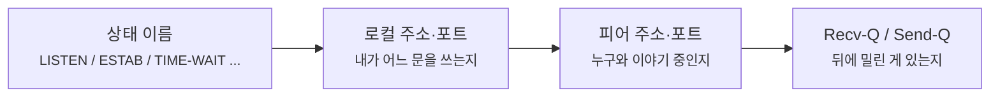
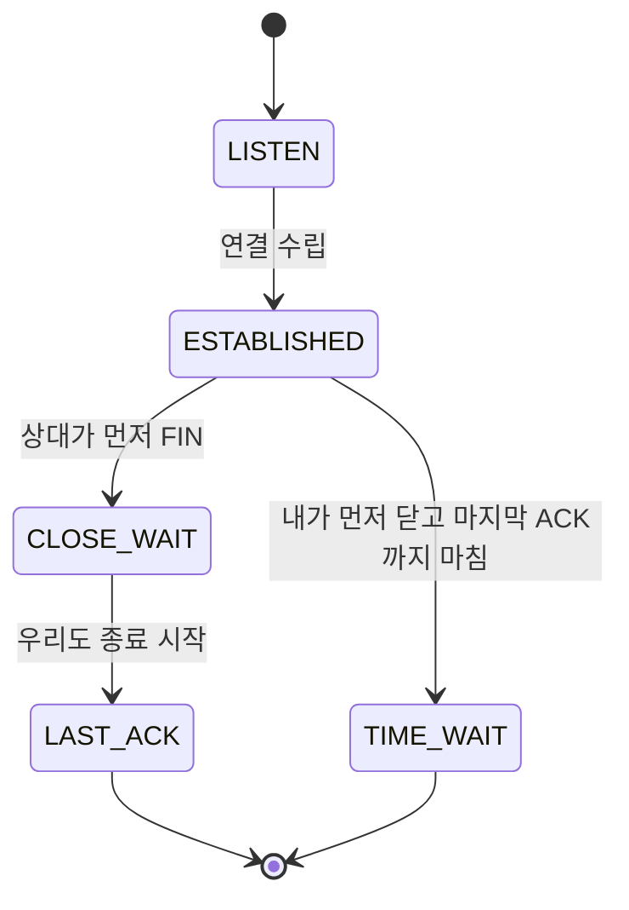

# ss와 netstat에서 TCP 상태는 어떻게 읽어야 할까요?

> 연결은 열렸나 닫혔나 둘 중 하나일 것 같죠? **사실 운영 화면에서는 그 사이에 훨씬 많은 표지판이 보여요.**

[TCP Teardown과 TIME-WAIT - 대화가 끝난 뒤의 깔끔한 마무리](../basic/22-tcp-teardown-and-time-wait.md){ data-preview }에서는 `TIME-WAIT` 가 왜 남는지 큰 그림으로 먼저 봤고, [TCP 상태 머신: 연결의 탄생부터 소멸까지의 일대기](./tcp-state-machine.md#state-summary){ data-preview }에서는 `LISTEN`, `ESTABLISHED`, `CLOSE-WAIT`, `LAST-ACK` 같은 이름이 **내부 상태 지도** 위에서 어디쯤 있는지도 봤어요.

근데 막상 터미널에서 `ss -nat` 나 `netstat -tan` 을 열면 또 이런 생각이 들죠.

> *"좋아요, 상태 이름은 본 적 있어요. 근데 지금 이 줄이 정상 장면인지, 어디가 막힌 건지, 뭘 먼저 읽어야 하죠?"*

이 글이 필요한 이유는 상태 이름을 아는 것과, 상태 줄을 실제 운영 장면으로 읽는 건 전혀 다른 감각이기 때문이에요.

- `TIME-WAIT` 가 많으면 바로 문제라고 봐야 하나?
- `CLOSE-WAIT` 하나가 오래 남아 있으면 네트워크 문제인가, 애플리케이션 정리 문제인가?
- `LISTEN` 과 `ESTAB` 는 보이는데, 어디서부터 정상이고 어디서부터 막힌 걸로 읽어야 하지?

오늘은 `ss` 와 `netstat` 화면에서 **TCP 상태를 장면처럼 읽는 감각**을 잡아볼게요. 여기서는 모든 옵션을 백과사전처럼 다 모으기보다, **운영 화면에서 상태 줄이 보였을 때 무엇부터 의심하고 무엇은 성급히 단정하면 안 되는지** 쪽에 집중할 거예요.

!!! note "이 글의 범위"
    여기서는 `ss` / `netstat` 로 보이는 **TCP 상태 줄 읽기**에 집중해요. 패킷 한 줄 자체를 읽는 법은 [tcpdump 한 줄은 어떻게 읽어야 할까요?](./tcpdump-first-look.md#one-line-anatomy){ data-preview }에서, 상태 이름이 상태 머신 안에서 어디에 놓이는지는 [TCP 상태 머신: 연결의 탄생부터 소멸까지의 일대기](./tcp-state-machine.md#state-diagram){ data-preview }에서 이미 봤어요. 여기서는 그 둘을 이어서, **운영 화면의 상태 목록을 실제 관찰 장면으로 읽는 감각**을 잡아볼게요.

---

## 그래서 이 화면은 대체 뭘 보여주는 걸까요?

`ss` 나 `netstat` 는 패킷을 한 줄씩 보여주는 CCTV라기보다, **각 소켓이 지금 어떤 TCP 상태에 놓여 있는지 적어놓은 현황판**에 더 가까워요.

즉 이 화면에서 읽어야 하는 건 단순히 이름 하나가 아니라,

- 지금 문을 **열어두고 기다리는 중인지**
- 이미 **대화가 진행 중인지**
- **종료 뒷정리**가 남아 있는지
- 상대는 끝냈는데 우리 쪽 정리가 **안 끝난 상태**인지

같은 운영 장면이에요.

| 기본편/심화편에서 잡은 감각 | 비유에서는 | 실제로는 |
|---|---|---|
| 포트 열기 | 손님 맞을 문 열어두기 | `LISTEN` |
| 연결 성립 | 실제 손님과 대화 시작 | `ESTABLISHED` |
| 종료 정리 대기 | 문 닫은 뒤 잠깐 더 지켜보기 | `TIME-WAIT` |
| 상대는 끝냈지만 나는 아직 정리 중 | 손님은 나갔는데 계산 마감이 남음 | `CLOSE-WAIT` |
| 상태 목록 | 관리실 현황판 | `ss` / `netstat` 출력 |

---

## 먼저 장면부터 볼까요?

실제 화면은 대개 이런 식으로 보여요.

```text
$ ss -ant
State      Recv-Q Send-Q Local Address:Port    Peer Address:Port
LISTEN     0      128    0.0.0.0:8080          0.0.0.0:*
ESTAB      0      0      192.168.0.10:51515    198.51.100.80:443
TIME-WAIT  0      0      192.168.0.10:51516    198.51.100.80:443
CLOSE-WAIT 1      0      192.168.0.10:4000     203.0.113.20:9000
```

`netstat` 쪽은 기본적으로 listening 소켓을 같이 보여주지 않을 수 있어서, 같은 장면을 보려면 보통 `-a` 를 함께 붙여요.

```text
$ netstat -tanl
Proto Recv-Q Send-Q Local Address           Foreign Address         State
tcp        0      128 0.0.0.0:8080          0.0.0.0:*               LISTEN
```

그리고 이미 열린 연결 쪽은 이런 식으로 보게 돼요.

```text
$ netstat -tan
Proto Recv-Q Send-Q Local Address           Foreign Address         State
tcp        0      0 192.168.0.10:51515      198.51.100.80:443      ESTABLISHED
tcp        0      0 192.168.0.10:51516      198.51.100.80:443      TIME_WAIT
tcp        1      0 192.168.0.10:4000       203.0.113.20:9000      CLOSE_WAIT
```

둘 다 결국은 **소켓 하나가 지금 어느 TCP 상태에 있는지** 보여주는 화면이에요. `ss` 는 리눅스 쪽에서 더 많은 TCP 정보와 상태 정보를 보여줄 수 있고, `netstat` 매뉴얼도 지금은 **대체 도구로 `ss` 를 권한다**고 설명해요. 그렇다고 `netstat` 화면을 아예 안 보게 되는 건 아니어서, 둘 다 읽히는 편이 좋아요.

---

## 이 장면에서 먼저 읽어야 할 신호 네 가지 { #signals-to-read }

처음 상태 목록을 볼 때는 이 네 가지만 먼저 보면 돼요.

1. **지금 이 줄이 `LISTEN` 인지, 이미 연결된 상태인지**
2. **로컬 주소와 피어 주소가 누구인지**
3. **`Recv-Q`, `Send-Q` 가 비어 있는지 쌓이는지**
4. **`TIME-WAIT` 인지, `CLOSE-WAIT` 인지처럼 종료 쪽 상태가 어느 편 사정인지**

이 네 가지만 잡아도, *"서버가 문을 연 상태인지"*, *"이미 연결은 됐는지"*, *"종료 뒷정리가 밀리는지"* 같은 큰 흐름이 꽤 또렷하게 보여요.



이 그림이 중요한 이유는, 상태 목록을 볼 때 **상태 이름만 보고 끝내면 반쯤만 읽은 것**이기 때문이에요. 같은 `ESTABLISHED` 라도 어느 포트인지, 누구와 붙어 있는지, 큐가 쌓이는지에 따라 해석이 달라져요.

---

## `ss` 와 `netstat` 는 무엇이 다를까요?

여기서는 도구 자체보다 공통 감각만 먼저 잡을게요.

> 여기서는 도구 비교를 깊게 파고들기보다, **상태를 읽는 공통 감각**만 잡을게요. 다만 리눅스 `ss(8)` 매뉴얼은 `ss` 를 **소켓 통계를 보는 도구**라고 설명하고, `netstat(8)` 매뉴얼은 `netstat` 가 **대체로 obsolete** 하며 연결 상태 확인 쪽은 `ss` 를 대안으로 보라고 적어둬요.

실전 감각으로 요약하면 이래요.

| 도구 | 이런 느낌으로 보면 돼요 | 이 글에서 중요한 포인트 |
|---|---|---|
| `ss` | 좀 더 최신이고 상태·타이머·내부 TCP 정보까지 넓게 보여주는 쪽 | 리눅스에선 우선 이쪽 감각을 익혀두면 좋아요 |
| `netstat` | 오래된 예시나 문서에서 아직 자주 보이는 출력 형식 | 화면을 봤을 때 상태 이름과 주소 칼럼이 읽히면 충분해요 |

공식 `ss(8)` 문서는 `ss` 가 `netstat` 와 비슷한 정보를 보여주지만 **더 많은 TCP와 상태 정보**를 볼 수 있다고 설명해요. 그리고 `netstat(8)` 문서는 아예 **replacement for netstat is ss** 라고 적고 있죠. 그러니까 오늘 감각은 **둘 다 읽되, 리눅스에선 `ss` 쪽을 기본 언어처럼 익힌다** 정도로 잡으면 좋아요.

---

## 자주 보는 상태를 장면으로 읽어볼게요 { #common-states }

### 1. `LISTEN` — 문은 열려 있고, 아직 손님을 기다리는 상태

```text
LISTEN 0 128 0.0.0.0:8080 0.0.0.0:*
```

- 내 프로세스가 `8080` 포트에서 **들어오는 연결을 기다리는 중**이에요.
- 아직 특정 상대와 대화 중인 건 아니라서 피어 쪽은 `*` 처럼 넓게 보일 수 있어요.
- `ss` 매뉴얼도 기본적으로 listening 소켓은 생략되고, `-l` 이나 `-a` 로 보라고 설명해요.

즉 `LISTEN` 은 **서버가 죽었다**가 아니라, 오히려 **손님을 받을 준비가 된 상태**예요.

### 2. `ESTABLISHED` / `ESTAB` — 실제 대화가 열린 상태

```text
ESTAB 0 0 192.168.0.10:51515 198.51.100.80:443
```

- 이미 연결은 성립했어요.
- 로컬 포트 `51515` 와 원격 `443` 이 실제로 붙어 있어요.
- RFC 9293은 `ESTABLISHED` 를 **열린 연결이며, 데이터 전달이 가능한 정상 데이터 전송 단계**라고 설명해요.

중요한 건, `ESTABLISHED` 가 **항상 바쁘게 데이터가 흐르는 상태**를 뜻하는 건 아니라는 점이에요. 통로만 열려 있고, 잠깐 조용할 수도 있어요.

### 3. `TIME-WAIT` — 종료는 끝났지만 안전 정리를 위해 잠깐 더 남아 있는 상태

```text
TIME-WAIT 0 0 192.168.0.10:51516 198.51.100.80:443
```

- [TCP Teardown과 TIME-WAIT](../basic/22-tcp-teardown-and-time-wait.md){ data-preview }에서 본 그 상태예요.
- RFC 9293은 이 상태를 **마지막 ACK가 잘 전달됐는지와, 예전 연결의 지연 세그먼트가 새 연결을 오염시키지 않게 충분히 기다리는 상태**로 설명해요.
- `ss -o` 같은 식으로 보면 `timewait` 타이머가 붙어서 보일 수도 있어요.

즉 `TIME-WAIT` 는 흔히 **정상 종료의 흔적**에 더 가까워요.

### 4. `CLOSE-WAIT` — 상대는 끝냈는데, 우리 쪽 정리가 아직 안 끝난 상태

```text
CLOSE-WAIT 1 0 192.168.0.10:4000 203.0.113.20:9000
```

- 원격 쪽은 이미 **"나 먼저 끝낼게"** 라고 말한 상태예요.
- 우리는 그걸 받았지만, 아직 우리 쪽 애플리케이션이 `close` 쪽 마무리를 덜 했어요.
- RFC 9293은 `CLOSE-WAIT` 를 **원격 종료를 받은 뒤, 로컬 사용자의 종료 요청을 기다리는 상태**로 설명해요.

그래서 `CLOSE-WAIT` 가 오래 남는다면, 네트워크 문제라기보다 **애플리케이션이 연결 정리를 제때 못 하고 있는지** 쪽을 더 의심하게 돼요.

---

## 상태는 이렇게 이어져요 { #state-flow }

상태 이름만 따로 보면 외워야 할 단어처럼 느껴지죠. 근데 흐름으로 보면 훨씬 편해져요.



이 그림은 전체 TCP 상태 머신을 다 그리려는 게 아니라, **운영 화면에서 자주 마주치는 상태들만 한 번에 이어본 축약 지도**예요. 그래서 `TIME-WAIT` 와 `CLOSE-WAIT` 를 같은 "종료 관련 상태"로 뭉뚱그리면 안 되고, **누가 먼저 끝냈고 지금 어느 편 정리가 남았는지** 를 같이 읽어야 해요.

---

## `Recv-Q` 와 `Send-Q` 는 어떻게 읽을까요? { #queues }

상태 이름 다음으로 많이 눈에 들어오는 게 `Recv-Q`, `Send-Q` 죠.

공식 `netstat(8)` 문서는 이렇게 설명해요.

- `Recv-Q` — 이미 받았지만 아직 사용자 프로그램이 가져가지 않은 바이트 수
- `Send-Q` — 이미 보냈지만 아직 원격이 확인하지 않은 바이트 수

`LISTEN` 줄에서는 의미가 조금 달라질 수 있어요. `netstat(8)` 는 listening 소켓에서 이 칼럼들을 **들어오는 연결 대기열과 backlog 성격을 읽는 단서** 쪽으로 설명해요. 그러니까 listening 줄의 `Recv-Q`, `Send-Q` 는 이미 연결된 소켓에서 보던 **그대로의 바이트 큐 감각**으로 읽기보다, **대기열 쪽 숫자**로 더 조심스럽게 보는 편이 안전해요.

즉 장면 감각으로는 이렇게 보면 좋아요.

| 보이는 모습 | 먼저 드는 질문 | 이런 쪽으로 읽기 쉬워요 |
|---|---|---|
| `ESTAB` + `Recv-Q 0` + `Send-Q 0` | 지금 밀린 건 없나? | 통로는 열려 있고 큐도 한산함 |
| `ESTAB` + `Recv-Q` 큼 | 받긴 받았는데 앱이 늦게 읽나? | 수신 후 사용자 공간 소비가 늦을 수 있음 |
| `ESTAB` + `Send-Q` 큼 | 보냈는데 아직 확인이 덜 왔나? | 원격 ACK 지연, 전송 정체, 네트워크 상태를 같이 봐야 함 |
| `LISTEN` + 큐가 눈에 띔 | 들어오는 연결 대기열이 쌓이나? | listening 소켓 쪽 backlog 압박 단서일 수 있음 |

여기서도 숫자 하나만 보고 곧장 진단 확정하면 위험해요. 큐는 **상태 이름, 상대 주소, 지속 시간, 다른 도구 단서**와 같이 봐야 해요.

---

## `ss` 에서는 이런 필터가 특히 좋아요

상태 읽기를 연습할 때는 화면을 줄이는 게 정말 중요해요.

```bash
ss -ant
ss -lnt
ss -tan state time-wait
ss -tan state close-wait
ss -o state established '( dport = :443 or sport = :443 )'
```

이 다섯 줄만 익숙해져도 꽤 많은 장면이 풀려요.

- `ss -ant` — 숫자 그대로 listening 포함 전체 TCP 상태 보기
- `ss -lnt` — 지금 **문 열어놓고 기다리는 포트**만 보기
- `ss -tan state time-wait` — 종료 흔적만 따로 보기
- `ss -tan state close-wait` — 애플리케이션 마무리 지연 후보만 따로 보기
- `ss -o ...` — 타이머까지 같이 보기

`ss(8)` 문서도 상태 필터 문법을 공식으로 제공하고, `established`, `syn-sent`, `time-wait`, `close-wait`, `listening` 같은 식별자를 직접 쓸 수 있다고 설명해요. 그래서 처음에는 **포트 필터**보다 **상태 필터**를 먼저 붙여보는 습관이 꽤 유용해요.

---

## 근데 왜 상태 목록을 이렇게까지 읽어야 할까요?

### 1. 패킷 캡처를 보기 전에 어디를 의심할지 좁혀줘요

`tcpdump` 는 아주 강력하지만, 처음부터 바로 패킷으로 내려가면 화면이 너무 넓을 수 있어요. 반면 `ss` 나 `netstat` 는 **지금 어떤 상태가 많이 보이는지** 먼저 보여줘서, 문제를 좁히는 첫 표지판 역할을 해줘요.

### 2. `TIME-WAIT` 와 `CLOSE-WAIT` 를 다르게 읽게 해줘요

둘 다 끝나는 쪽 상태처럼 보이지만, 실제론 의미가 꽤 달라요. `TIME-WAIT` 는 **정상 종료 뒤 안전 대기**, `CLOSE-WAIT` 는 **원격 종료를 받았는데 우리 쪽 정리가 덜 끝남** 쪽에 더 가까워요.

### 3. 상태 머신이 실제 운영 화면과 연결돼요

[TCP 상태 머신: 연결의 탄생부터 소멸까지의 일대기](./tcp-state-machine.md#real-world-observation){ data-preview }에서 봤던 상태 이름들이 여기서 **추상 개념이 아니라 실제 운영 화면의 단어**로 다시 살아나요.

---

## 잘못 읽기 쉬운 함정 다섯 가지 { #pitfalls }

**하나, `LISTEN` 이 보이면 연결이 이미 성립했다고 생각하기.**  
아니에요. 이건 **기다리는 문**이지, 이미 손님과 대화 중인 줄은 아니에요.

**둘, `ESTABLISHED` 면 무조건 데이터가 왕창 흐른다고 믿기.**  
통로가 열려 있다는 뜻이지, 그 순간 바이트가 계속 오간다는 보장은 아니에요.

**셋, `TIME-WAIT` 가 많으면 곧장 장애라고 단정하기.**  
정상 종료 흔적이 많이 보일 수도 있어요. 다만 양이 너무 많아 포트 고갈로 이어지는지는 따로 봐야 해요.

**넷, `CLOSE-WAIT` 를 `TIME-WAIT` 처럼 같은 부류로 뭉뚱그리기.**  
`CLOSE-WAIT` 는 보통 **우리 쪽 애플리케이션 마무리 지연**을 더 의심하게 하는 상태예요.

**다섯, 상태 이름만 보고 주소와 큐를 안 보기.**  
같은 `ESTABLISHED` 도 **누구와 붙어 있는지**, **큐가 쌓이는지**를 같이 봐야 장면이 풀려요.

---

## 자, 정리해볼까요?

!!! abstract "오늘 우리가 본 것"
    - `ss` 와 `netstat` 는 **패킷 한 줄**보다 한 단계 위에서, 소켓이 지금 어떤 TCP 상태에 있는지 보여주는 현황판에 가까워요.
    - `LISTEN` 은 기다리는 문, `ESTABLISHED` 는 열린 대화, `TIME-WAIT` 는 정상 종료 뒤 안전 대기, `CLOSE-WAIT` 는 원격 종료 뒤 우리 쪽 마무리 대기 쪽으로 읽으면 좋아요.
    - 상태 이름만 보지 말고 **로컬/피어 주소**와 **`Recv-Q` / `Send-Q`** 도 같이 봐야 해요.
    - 리눅스에서는 `ss` 가 더 많은 TCP와 상태 정보를 보여줄 수 있어서 기본 도구로 익혀두기 좋아요.
    - `TIME-WAIT` 와 `CLOSE-WAIT` 는 둘 다 종료 주변 상태지만, **누가 먼저 끝냈고 어느 편 정리가 남았는지**가 다르다는 점이 핵심이에요.

결국 `ss` 나 `netstat` 를 읽는다는 건, 상태 이름을 외우는 일이 아니라 **연결이 지금 생애 주기의 어느 장면에 서 있는지** 읽는 일이에요. 이 감각이 붙으면, 캡처를 열기 전에도 이미 문제의 성격을 꽤 많이 좁힐 수 있게 돼요.

---

## 이어서 보면 좋은 글

- `LISTEN`, `SYN-SENT`, `CLOSE-WAIT`, `TIME-WAIT` 가 상태 머신 전체에서 어디쯤 있는지 다시 보고 싶다면 — [TCP 상태 머신: 연결의 탄생부터 소멸까지의 일대기](./tcp-state-machine.md#state-summary){ data-preview }
- `TIME-WAIT` 가 왜 안전장치인지 종료 장면 중심으로 다시 보고 싶다면 — [TCP Teardown과 TIME-WAIT - 대화가 끝난 뒤의 깔끔한 마무리](../basic/22-tcp-teardown-and-time-wait.md){ data-preview }
- 상태 목록에서 수상한 연결을 본 뒤, 실제 패킷 줄을 어디부터 읽어야 할지 이어서 보고 싶다면 — [tcpdump 한 줄은 어떻게 읽어야 할까요?](./tcpdump-first-look.md#one-line-anatomy){ data-preview }
- `SYN`, `SYN-ACK`, `ACK` 세 줄이 실제 캡처에서 어떻게 보이는지 바로 내려가고 싶다면 — [tcpdump에서 TCP handshake는 어떻게 보일까요?](./tcp-handshake-in-capture.md#signals-to-read){ data-preview }
