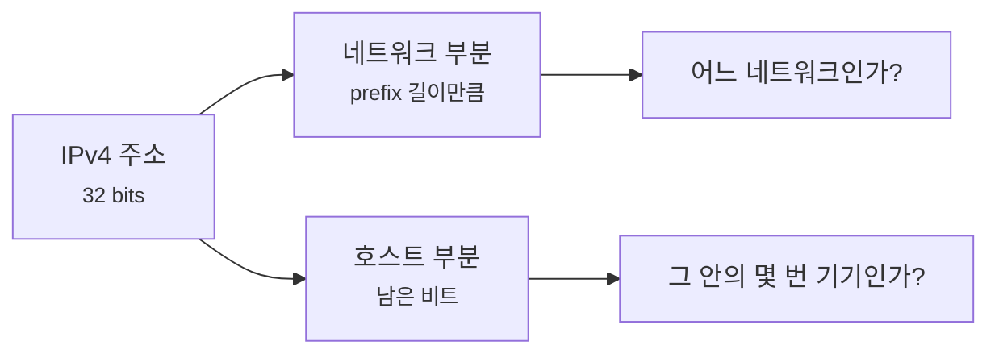
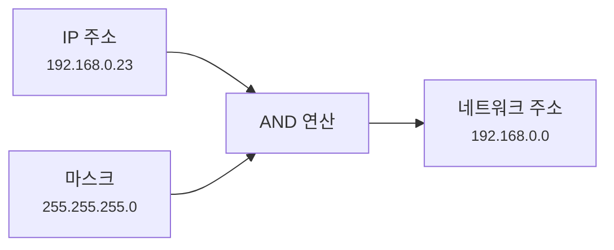
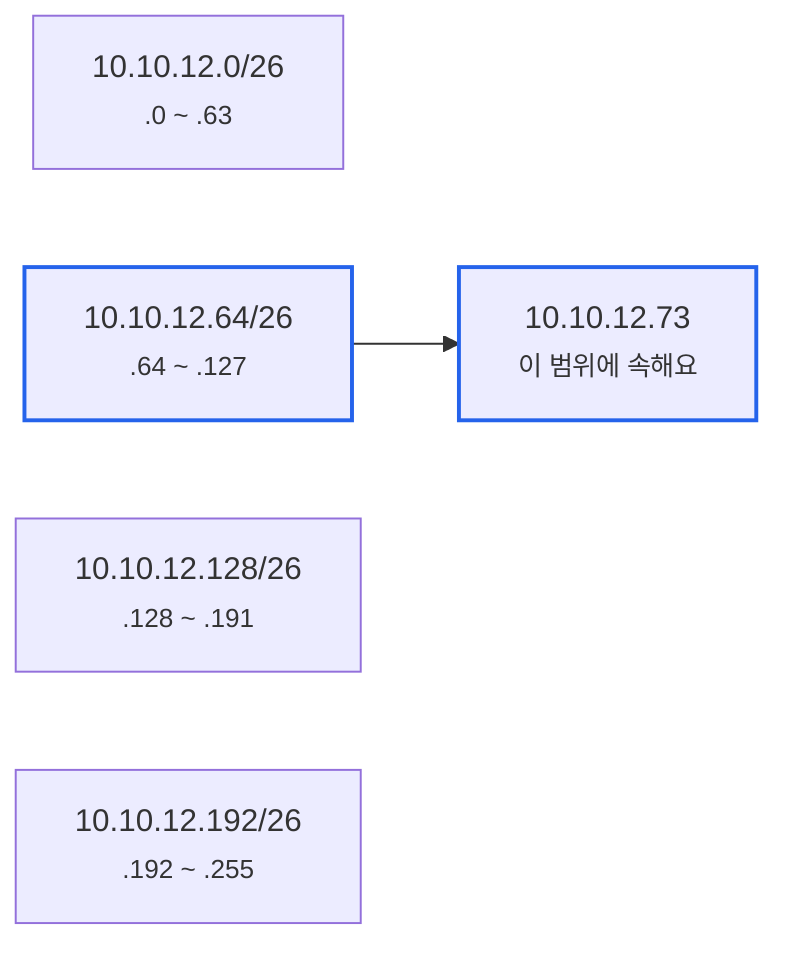
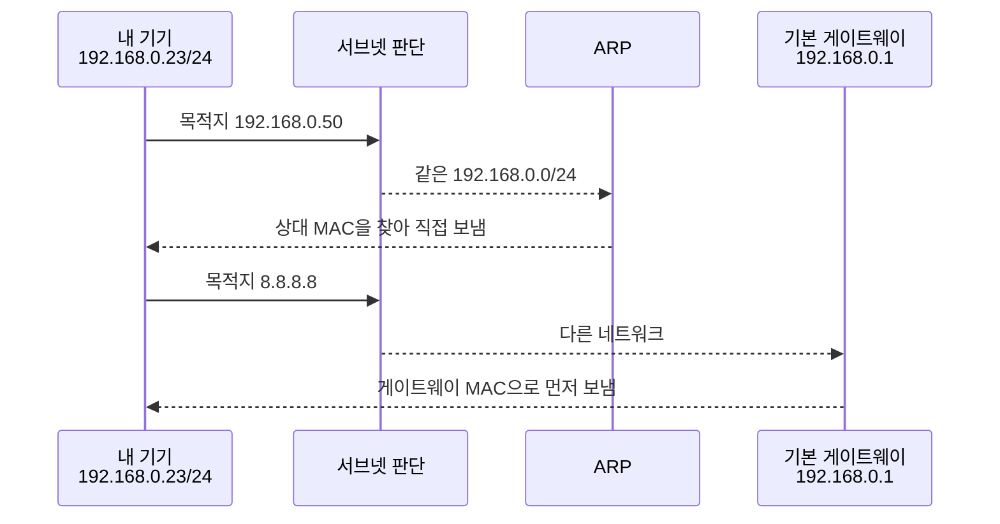

# 서브넷 마스크와 CIDR은 실제로 어떻게 계산할까요?

> `/24`는 그냥 뒤에 붙는 짧은 표시 같죠? **사실은 IP 주소 32비트 중 앞의 24칸을 잠그겠다는 뜻이에요.**

[서브넷 마스크와 CIDR, 같은 동네인지 어떻게 판단할까요?](../basic/16-subnet-mask-and-cidr.md){ data-preview }에서는 서브넷 마스크를 **같은 동네 경계선**으로 봤어요.
그리고 [ARP와 로컬 전달](../basic/18-arp-and-local-delivery.md){ data-preview }, [기본 게이트웨이와 첫 번째 도약](../basic/19-default-gateway-and-first-hop.md){ data-preview }에서는 그 판단에 따라 **직접 보낼지, 게이트웨이에게 맡길지**가 갈린다는 것도 봤죠.

근데 실제 설정이나 장애 장면으로 내려오면 질문이 더 구체적으로 바뀌어요.

- `192.168.0.23/24`에서 네트워크 주소는 왜 `192.168.0.0`일까요?
- `255.255.255.0`과 `/24`는 정말 같은 말일까요?
- `192.168.0.255`는 왜 보통 기기 주소로 안 쓰나요?
- `/26`, `/27`처럼 애매하게 끊기면 범위는 어떻게 계산해야 할까요?

오늘은 **서브넷 마스크와 CIDR이 한마디로 무엇인지**, **기본편의 동네 비유가 실제 비트 계산으로 어떻게 이어지는지**, **왜 CIDR 방식이 지금의 기본 언어가 됐는지**, 그리고 **네트워크 주소·브로드캐스트 주소·호스트 범위를 직접 읽는 법**을 같이 볼게요.
큰 흐름은 CIDR을 정리한 [RFC 4632](https://www.rfc-editor.org/rfc/rfc4632)와, 서브넷 개념의 오래된 출발점인 [RFC 950](https://www.rfc-editor.org/rfc/rfc950)을 가볍게 참고해서 잡을게요.

!!! note "이 글의 범위"
    여기서는 **IPv4 서브넷 계산**에 집중해요.
    IPv6에도 prefix 길이 감각은 이어지지만, 브로드캐스트가 없고 주소 운영 방식도 달라요.
    IPv6 주소 체계와 prefix는 [IPv6 헤더 글](./ipv6-header-anatomy.md){ data-preview }에서 잡은 감각 위에, 나중에 별도 글에서 더 깊게 볼게요.

---

## 왜 이 계산을 알아야 할까요?

평소에는 `/24`를 보고 **"앞 세 칸이 같으면 같은 네트워크"** 정도로 읽어도 꽤 오래 버틸 수 있어요.
집 공유기 환경에서는 `192.168.0.0/24` 같은 모양이 워낙 흔하니까요.

문제는 조금만 현실적인 설정으로 넘어갈 때예요.

```text
10.10.12.73/26
172.16.8.130/27
192.168.10.200/28
```

이런 주소를 만나면 앞 세 숫자만 봐서는 부족해요.
마지막 숫자 안에서도 네트워크 부분과 호스트 부분이 갈라지거든요.

운영 장면에서는 이 차이가 꽤 크게 터져요.

- 같은 서버실에 있는 줄 알았는데, 사실은 다른 서브넷이라 게이트웨이를 지나야 해요.
- 방화벽 규칙을 `10.10.12.0/24`로 너무 넓게 열어버려요.
- 로드 밸런서 health check 주소 범위를 잘못 잡아서 일부 인스턴스만 빠져요.
- VPN에서 겹치는 사설 대역 때문에 어느 쪽으로 보내야 할지 헷갈려요.

즉 이 글은 수학 문제를 풀자는 글이 아니에요.
**목적지 IP가 어느 범위에 속하는지 직접 읽어서, 패킷의 다음 움직임을 예측하는 글**이에요.

---

## 그래서 서브넷 마스크와 CIDR은 한마디로 뭐예요?

짧게 잡으면 이래요.

> **서브넷 마스크와 CIDR은 IP 주소 32비트 중 어디까지를 네트워크 이름으로 볼지 표시하는 방식이에요.**

| 기본편에서 잡은 감각 | 비유에서는 | 실제로는 |
|---|---|---|
| IP 주소 | 정확한 집 주소 | 32비트 IPv4 주소 |
| 서브넷 마스크 | 같은 동네를 가르는 선 | 네트워크 비트는 `1`, 호스트 비트는 `0`인 32비트 값 |
| CIDR prefix | 경계선을 짧게 적은 숫자 | `/24`, `/26`처럼 앞에서부터 `1`인 비트 개수 |
| 네트워크 주소 | 동네 대표 주소 | 호스트 비트를 모두 `0`으로 만든 주소 |
| 브로드캐스트 주소 | 동네 전체 호출 주소 | 호스트 비트를 모두 `1`로 만든 주소 |
| usable host 범위 | 실제 입주 가능한 집 | 보통 네트워크 주소와 브로드캐스트 주소를 뺀 범위 |

기본편에서 말한 **동네 경계선**은 실제로는 32비트 위에 그어진 선이에요.
그 선 왼쪽은 네트워크를 식별하고, 오른쪽은 그 네트워크 안의 기기를 식별해요.



이 그림에서 `/24`, `/26`, `/16` 같은 표기는 **경계선이 몇 번째 비트 뒤에 그어지는지**를 말해요.
그래서 CIDR을 읽는다는 건, 결국 32비트 주소를 왼쪽부터 몇 칸까지 같은 묶음으로 볼지 읽는 일이에요.

---

## `/24`는 왜 `255.255.255.0`과 같을까요? { #slash-24-mask }

IPv4 주소는 8비트씩 네 덩어리로 나뉘어요.
우리가 보는 `192.168.0.23` 같은 표기는 사람이 읽기 좋게 10진수 네 칸으로 적은 모습이에요.

```text
 192.  168.   0.   23
└─┬─┘ └─┬─┘ └─┬─┘ └─┬─┘
8bit  8bit  8bit  8bit 
```

`/24`는 앞에서부터 24비트가 네트워크 부분이라는 뜻이에요.
그러면 마스크는 앞 24비트가 `1`, 뒤 8비트가 `0`이 돼요.

<div style="margin: 1.5rem 0; border: 2px solid var(--md-default-fg-color--lighter); border-radius: 0.75rem; overflow: hidden; background: color-mix(in srgb, var(--md-default-bg-color) 95%, var(--md-default-fg-color) 5%);">
  <div style="display: grid; grid-template-columns: repeat(32, 1fr); padding: 0.4rem 0.6rem; background: color-mix(in srgb, var(--md-primary-fg-color) 8%, var(--md-default-bg-color)); border-bottom: 1px solid var(--md-default-fg-color--lightest); font-size: 0.65rem; color: var(--md-default-fg-color--light); text-align: center;">
    <span style="grid-column: span 8;">0~7</span>
    <span style="grid-column: span 8;">8~15</span>
    <span style="grid-column: span 8;">16~23</span>
    <span style="grid-column: span 8;">24~31</span>
  </div>
  <div style="display: grid; grid-template-columns: repeat(32, 1fr); gap: 2px; padding: 0.6rem; background: var(--md-default-fg-color--lightest);">
    <div style="grid-column: span 8; padding: 0.5rem 0.35rem; background: color-mix(in srgb, #22c55e 18%, var(--md-default-bg-color)); text-align: center; font-size: 0.8rem; border-radius: 0.25rem;"><strong>11111111</strong><br/><small>255</small></div>
    <div style="grid-column: span 8; padding: 0.5rem 0.35rem; background: color-mix(in srgb, #22c55e 18%, var(--md-default-bg-color)); text-align: center; font-size: 0.8rem; border-radius: 0.25rem;"><strong>11111111</strong><br/><small>255</small></div>
    <div style="grid-column: span 8; padding: 0.5rem 0.35rem; background: color-mix(in srgb, #22c55e 18%, var(--md-default-bg-color)); text-align: center; font-size: 0.8rem; border-radius: 0.25rem;"><strong>11111111</strong><br/><small>255</small></div>
    <div style="grid-column: span 8; padding: 0.5rem 0.35rem; background: color-mix(in srgb, #94a3b8 24%, var(--md-default-bg-color)); text-align: center; font-size: 0.8rem; border-radius: 0.25rem;"><strong>00000000</strong><br/><small>0</small></div>
  </div>
</div>

그래서 `/24`는 이렇게 바뀌어요.

```text
/24
= 11111111.11111111.11111111.00000000
= 255.255.255.0
```

여기서 `255`가 나오는 이유는 8비트가 모두 `1`이면 10진수로 `255`이기 때문이에요.
반대로 8비트가 모두 `0`이면 `0`이죠.

---

## 마스크 필드는 어떻게 읽으면 좋을까요?

자주 보는 prefix를 표로 놓으면 감이 빨라져요.

| CIDR | 서브넷 마스크 | 호스트 비트 | 주소 개수 | 처음 읽는 감각 |
|---|---|---:|---:|---|
| `/8` | `255.0.0.0` | 24 | 16,777,216 | 첫 번째 칸만 네트워크 |
| `/16` | `255.255.0.0` | 16 | 65,536 | 앞 두 칸이 네트워크 |
| `/24` | `255.255.255.0` | 8 | 256 | 앞 세 칸이 네트워크 |
| `/25` | `255.255.255.128` | 7 | 128 | 마지막 칸을 둘로 나눔 |
| `/26` | `255.255.255.192` | 6 | 64 | 마지막 칸을 넷으로 나눔 |
| `/27` | `255.255.255.224` | 5 | 32 | 마지막 칸을 여덟으로 나눔 |
| `/28` | `255.255.255.240` | 4 | 16 | 마지막 칸을 열여섯으로 나눔 |
| `/30` | `255.255.255.252` | 2 | 4 | 작은 점대점 링크에서 자주 봄 |
| `/32` | `255.255.255.255` | 0 | 1 | 단일 호스트 하나만 가리킴 |

주소 개수는 `2^(호스트 비트 수)`로 계산해요.
예를 들어 `/26`은 호스트 비트가 6개라서 `2^6 = 64`개 주소를 담아요.

!!! warning "주소 개수와 실제 기기 개수는 보통 달라요"
    일반적인 IPv4 서브넷에서는 네트워크 주소와 브로드캐스트 주소가 따로 쓰여요.
    그래서 `/24`는 주소가 256개지만, 흔히 실제 기기 주소로는 `254`개를 생각해요.
    다만 `/31` 같은 특수한 점대점 링크는 예외적으로 다르게 운영될 수 있어요.

---

## 네트워크 주소는 어떻게 계산할까요? { #network-address }

이제 실제로 하나 계산해볼게요.

```text
IP:   192.168.0.23
CIDR: /24
Mask: 255.255.255.0
```

`/24`에서는 앞 24비트는 그대로 두고, 뒤 8비트는 모두 `0`으로 만들어요.
그러면 네트워크 주소가 나와요.

```text
192.168.0.23  -> 호스트 부분을 0으로
192.168.0.0   -> 네트워크 주소
```

비트로는 이런 느낌이에요.

```text
IP:    11000000.10101000.00000000.00010111
Mask:  11111111.11111111.11111111.00000000
Result 11000000.10101000.00000000.00000000
```

위 `Result`가 `192.168.0.0`이에요.
실제로는 IP 주소와 마스크를 비트 단위로 `AND` 연산해서 네트워크 주소를 얻어요.



이 그림에서 `AND`는 둘 다 `1`인 자리만 `1`로 남기는 계산이에요.
처음에는 연산 이름보다 **마스크의 `1`인 부분만 IP에서 남긴다**고 읽으면 충분해요.

---

## 브로드캐스트 주소와 호스트 범위는 어떻게 나오나요?

같은 예시를 이어갈게요.

```text
192.168.0.23/24
```

네트워크 주소는 `192.168.0.0`이었죠.
이번에는 호스트 부분을 모두 `1`로 만들면 브로드캐스트 주소가 돼요.

```text
192.168.0.0   -> 네트워크 주소
192.168.0.255 -> 브로드캐스트 주소
```

그래서 흔히 쓰는 범위는 이렇게 읽어요.

| 항목 | 값 |
|---|---|
| 네트워크 주소 | `192.168.0.0` |
| 첫 번째 일반 호스트 | `192.168.0.1` |
| 마지막 일반 호스트 | `192.168.0.254` |
| 브로드캐스트 주소 | `192.168.0.255` |

여기서 `192.168.0.0`과 `192.168.0.255`를 보통 기기 주소로 쓰지 않는 이유가 보여요.
하나는 **이 네트워크 자체를 가리키는 이름**이고, 다른 하나는 **이 네트워크 전체에게 보내는 주소**로 쓰이기 때문이에요.

!!! note "브로드캐스트는 IPv4 쪽 감각이에요"
    IPv6에는 IPv4처럼 같은 링크 전체에 뿌리는 브로드캐스트가 없어요.
    대신 멀티캐스트를 써요.
    이 글에서는 IPv4 서브넷 계산을 보고 있으니, 브로드캐스트 주소를 IPv4 문맥으로 읽으면 돼요.

---

## `/26`처럼 애매하게 끊기면 어떻게 볼까요?

이제 진짜로 많이 헷갈리는 장면을 볼게요.

```text
10.10.12.73/26
```

`/26`은 앞 26비트가 네트워크예요.
IPv4는 8비트씩 네 칸이니까, 앞 세 칸 24비트는 완전히 네트워크고, 마지막 칸에서 2비트가 더 네트워크로 들어가요.

```text
/26 mask
= 11111111.11111111.11111111.11000000
= 255.255.255.192
```

마지막 칸의 마스크가 `192`라는 말은, 마지막 숫자를 64개 단위로 나눈다는 뜻이에요.
왜 64일까요?
호스트 비트가 6개 남으니까 `2^6 = 64`개씩 묶이거든요.

```text
10.10.12.0   ~ 10.10.12.63
10.10.12.64  ~ 10.10.12.127
10.10.12.128 ~ 10.10.12.191
10.10.12.192 ~ 10.10.12.255
```

`73`은 `64~127` 사이에 들어가요.
그래서 결과는 이렇게 돼요.

| 항목 | 값 |
|---|---|
| IP / prefix | `10.10.12.73/26` |
| 서브넷 마스크 | `255.255.255.192` |
| 네트워크 주소 | `10.10.12.64` |
| 일반 호스트 범위 | `10.10.12.65` ~ `10.10.12.126` |
| 브로드캐스트 주소 | `10.10.12.127` |
| 주소 개수 | `64` |



이 그림에서 보듯 `/26`은 `/24` 하나를 4개로 쪼갠 모습이에요.
`10.10.12.73`은 두 번째 조각에 들어가니까, 네트워크 주소가 `10.10.12.64`가 되는 거예요.

---

## 계산을 빨리 하는 순서는 이래요

처음에는 외우는 것보다 순서를 고정하는 편이 좋아요.

1. **prefix 길이에서 호스트 비트 수를 구해요.**
   - `32 - prefix`
   - `/26`이면 `6`
2. **주소 개수를 구해요.**
   - `2^호스트 비트`
   - `/26`이면 `64`
3. **마지막으로 갈라지는 칸의 블록 크기를 봐요.**
   - `/26`은 마지막 칸이 `0, 64, 128, 192`로 시작해요.
4. **IP의 마지막 숫자가 어느 블록에 들어가는지 찾아요.**
   - `73`은 `64~127`
5. **맨 앞은 네트워크 주소, 맨 끝은 브로드캐스트 주소로 봐요.**
   - 일반 호스트는 그 사이예요.

예시를 하나 더 볼게요.

```text
192.168.10.200/28
```

`/28`은 호스트 비트가 4개예요.
주소 개수는 `2^4 = 16`개고, 마지막 칸은 16개 단위로 끊겨요.

```text
0~15, 16~31, 32~47, ..., 192~207, 208~223, ...
```

`200`은 `192~207` 사이에 있어요.

| 항목 | 값 |
|---|---|
| 네트워크 주소 | `192.168.10.192` |
| 일반 호스트 범위 | `192.168.10.193` ~ `192.168.10.206` |
| 브로드캐스트 주소 | `192.168.10.207` |

이 정도면 설정 화면에서 `/27`, `/28`을 봐도 당황하지 않고 범위를 대략 잡을 수 있어요.

---

## 같은 네트워크 판단은 실제로 어디에 쓰일까요?

이 계산은 라우팅 테이블 앞에서 바로 쓰여요.
기기는 목적지 IP를 보고 먼저 **내가 직접 보낼 수 있는 범위인지** 판단해요.



여기서 중요한 건 **다른 네트워크라고 해서 목적지 IP가 게이트웨이 IP로 바뀌는 게 아니라는 점**이에요.
IP 패킷의 최종 목적지는 여전히 `8.8.8.8`이에요.
다만 이더넷 같은 로컬 구간에서는 **다음에 넘겨줄 상대의 MAC 주소**가 게이트웨이 MAC이 되는 거예요.

이 감각은 [ARP와 로컬 전달](../basic/18-arp-and-local-delivery.md){ data-preview }에서 본 장면과 바로 이어져요.
서브넷 계산은 **ARP를 목적지에게 직접 할지, 게이트웨이에게 할지**를 가르는 앞단 판단이에요.

---

## 잘못 읽기 쉬운 함정은 뭐가 있을까요?

### `192.168.0.x`면 무조건 같은 네트워크라고 단정하기

`192.168.0.10`과 `192.168.0.200`은 `/24`에서는 같은 네트워크예요.
하지만 `/25`라면 이야기가 달라져요.

```text
192.168.0.0/25    -> .0 ~ .127
192.168.0.128/25  -> .128 ~ .255
```

이 경우 `.10`과 `.200`은 같은 앞 세 칸을 공유하지만, 서로 다른 `/25` 범위에 있어요.
그래서 IP 주소만 보고 같은지 단정하면 안 되고, 항상 prefix를 같이 봐야 해요.

### 서브넷 마스크를 보안 경계로 착각하기

서브넷은 주소 범위를 나누는 방식이에요.
그 자체가 방화벽은 아니에요.

다른 서브넷으로 나뉘어 있으면 라우터나 L3 장비를 지나야 하니까 통제 지점이 생길 수는 있어요.
하지만 실제로 막고 허용하는 건 라우팅 정책, 방화벽, 보안 그룹, ACL 같은 규칙이에요.
**서브넷이 다르다**와 **통신이 막힌다**는 같은 말이 아니에요.

### CIDR 숫자가 작을수록 범위가 작다고 생각하기

반대예요.
`/16`은 `/24`보다 더 큰 범위예요.
prefix가 짧을수록 네트워크 부분이 짧고, 호스트 부분이 길어져요.

| prefix | 호스트 비트 | 주소 개수 |
|---|---:|---:|
| `/16` | 16 | 65,536 |
| `/24` | 8 | 256 |
| `/28` | 4 | 16 |

즉 `/28`이 더 세밀한 작은 조각이고, `/16`은 훨씬 큰 묶음이에요.

---

## 실제 설정을 볼 때는 어떤 순서로 읽을까요?

서버나 노트북에서 이런 설정을 봤다고 해볼게요.

```text
address 10.10.12.73/26
gateway 10.10.12.65
```

읽는 순서는 이래요.

1. `10.10.12.73/26`의 네트워크 범위를 계산해요.
   - `10.10.12.64 ~ 10.10.12.127`
2. 일반 호스트 범위를 확인해요.
   - `10.10.12.65 ~ 10.10.12.126`
3. 게이트웨이가 그 범위 안에 있는지 봐요.
   - `10.10.12.65`는 범위 안이에요.
4. 브로드캐스트나 네트워크 주소를 기기 주소로 쓰고 있지 않은지 봐요.
   - `.64`, `.127`은 피해야 하는 값이에요.
5. 통신이 안 되면 같은 서브넷 판단, ARP, 게이트웨이, 라우팅 테이블 순서로 좁혀요.

!!! tip "이것만 기억해도 충분해요"
    CIDR은 **범위의 이름**이에요.
    `10.10.12.73/26`을 보면 먼저 `10.10.12.64/26` 범위에 속한다고 읽고, 그다음 게이트웨이와 목적지가 같은 범위 안에 있는지 확인하면 돼요.

---

## 자, 정리해볼까요?

!!! abstract "오늘 우리가 배운 것"
    - IPv4 주소는 32비트이고, CIDR의 `/24`, `/26` 같은 숫자는 앞에서부터 몇 비트를 네트워크 부분으로 볼지 나타내요.
    - `/24`는 `255.255.255.0`과 같고, 앞 24비트가 `1`, 뒤 8비트가 `0`인 마스크예요.
    - 네트워크 주소는 호스트 비트를 모두 `0`으로 만든 값이고, IPv4 브로드캐스트 주소는 호스트 비트를 모두 `1`로 만든 값이에요.
    - `/26`은 64개 단위, `/28`은 16개 단위처럼 호스트 비트 수로 블록 크기를 계산할 수 있어요.
    - 같은 네트워크인지 판단해야 ARP로 직접 찾을지, 기본 게이트웨이에게 맡길지 결정할 수 있어요.

서브넷 계산은 숫자 놀이처럼 보이지만, 실제로는 패킷의 첫 번째 선택지를 정하는 일이에요.
**직접 보낼 수 있는가, 아니면 출구에게 맡겨야 하는가**가 여기서 갈라지거든요.

## 이어서 볼 질문

이제 한 가지가 더 궁금해져요.

> *"`192.168.0.0/24`에서 왜 맨 앞과 맨 끝 주소는 특별하게 취급될까요?"*

다음 IP 주소 체계 글에서는 **네트워크 주소, 브로드캐스트 주소, 실제 호스트 범위**를 더 집중해서 열어볼게요.
